=====
Italy
=====

.. _italy/modules:

Configuration
=============

:ref:`Install <general/install>` the following modules to get all the features of the Italian
localization:

.. list-table::
   :header-rows: 1
   :stub-columns: 1

   * - Name
     - Technical name
     - Description
   * - Italy - Accounting
     - `l10n_it`
     - Default :ref:`fiscal localization package <fiscal_localizations/packages>`
   * - Italy - E-invoicing
     - `l10n_it_edi`
     - E-invoice implementation
   * - Italy - E-invoicing
     - `l10n_it_edi_withholding`
     - E-invoice withholding
   * - Italy - Accounting Reports
     - `l10n_it_reports`
     - Country-specific reports
   * - Italy - Stock DDT
     - `l10n_it_stock_ddt`
     - Transport documents - Documento di Trasporto (DDT)

.. figure:: italy/italy-modules.png
   :align: center
   :alt: Italian localization modules

   Italian localization modules

Company information
-------------------

Configuring the company's information ensures your Accounting database is properly set up. To add
information, go to :menuselection:`Settings --> General Settings`, and in the :guilabel:`Companies`
section, click :guilabel:`Update info`. From here, fill out the fields:

- :guilabel:`Address`: the address of the company;
- :guilabel:`VAT`: VAT of the company;
- :guilabel:`Codice Fiscale`: the fiscal code of the company;
- :guilabel:`Tax System`: the tax system under which the company falls;

.. figure:: italy/italy-company.png
   :align: center
   :alt: Company information to be provided

   Company information to be provided

Taxes configuration
-------------------

Many of the e-invoicing features are implemented using Odoo's tax system. As such, it is very
important that taxes are properly configured in order to generate invoices correctly and handle
other billing use cases.

The **Italian** localization contains predefined **examples** of taxes for various purposes.

.. _italy/tax-exemption:

Tax Exemption
~~~~~~~~~~~~~

The use of sale taxes that amount to **zero percent** (0%) is required by Italian authorities to
keep track of the exact :guilabel:`Tax Exemption Kind (Natura)` and :guilabel:`Law Reference` that
justify the exemption operated on an invoice line.

For example the tax for export in the EU to be used as reference (`0% EU`, invoice label `00eu`),
which can be found under :menuselection:`Accounting --> Configuration --> Taxes`. Exports are exempt
from VAT, and therefore they require the :guilabel:`Has exoneration of tax (Italy)` option ticked,
with both the :guilabel:`Exoneration` kind and :guilabel:`Law Reference` filled in.

.. figure:: italy/italy-tax.png
   :align: center
   :alt: Tax Exemption Settings

   Tax Exemption Settings

.. seealso::
   There are many :guilabel:`Tax Exemption Kind (Natura)` and :guilabel:`Law Reference` codes.
   Make sure you are selecting the correct one by reading the official documentation (in Italian)
   here.

   - `Documentation portal with latest link <https://www.agenziaentrate.gov.it/portale/web/guest/aree-tematiche/fatturazione-elettronica>`_
   - `Official guide on Tax exemption codes v1.8 <https://www.agenziaentrate.gov.it/portale/documents/20143/451259/Guida_compilazione-FE-Esterometro-V1.8.pdf/c0aca469-4c4a-9b8d-048c-398412435c26>`_

   .. figure:: italy/italy-tax-agency-docs.png
     :align: center
     :alt: Tax Exemption codes documentation

     Tax Exemption codes documentation

.. note::
   If you need to use a different kind of :guilabel:`Exoneration`, click :menuselection:`Action -->
   Duplicate` within the tax menu to create a copy of an existing similar tax. Then, select another
   :guilabel:`Exoneration`, write the related :guilabel:`Law Reference` and :guilabel:`Save`.
   Repeat this process as many times as you need different kind of :guilabel:`Exoneration` taxes.

.. tip::
   **Rename** your taxes in the :guilabel:`Name` field according to their :guilabel:`Exoneration` to
   differentiate them easily.

.. _italy/reverse-charge:

Reverse charge
==============

Italian businesses selling goods and services are sometimes required *not* to charge the customer
for the VAT. The customers pay the VAT *themselves* to the :abbr:`AdE (Agenzia delle Entrate)`
instead. This mechanism is called **reverse charge**.

- :guilabel:`Internal Reverse Charge` (for domestic sales) was born to fight Tax evasion if the VAT
  is paid by the seller, especially in sectors like waste management, construction, subcontracting
  in the construction sector, the sale of precious metals, as well as transactions involving mobile
  phones and phone cards.

- :guilabel:`External Reverse Charge` (for intra-EU sales). VAT is a kind of tax that is applied on
  the Country of the buyer. The seller has no mean to collect and pay VAT in the other Country, so
  the buyer will be responsable to do it in a B2B setting.

Invoices
--------

**Reverse charged** customer invoices are **tax exempt** (0%) for the seller. Just select the
correct tax on each invoice line. The buyer will have to provide tax information to their
government, but you are set.

Vendor bills
------------

Italian companies subjected to Reverse Charge must send the information contained within the bill
received to the :abbr:`AdE (Agenzia delle Entrate)`.

.. note::
   VAT integrations **XML** files must be issued and sent to the :abbr:`AdE (Agenzia Delle Entrate)`
   for reverse charged bills.

When inputting taxes in a vendor bill, it is possible to select **reverse charge** taxes. These are
automatically activated in the related fiscal position. By going to :menuselection:`Accounting -->
Configuration --> Taxes`, the `10%` and `22%` :guilabel:`Goods` and :guilabel:`Services` tax scopes
are activated and preconfigured with the correct tax grids. These are set up automatically to ensure
the correct booking of accounting entries and display of the tax report.

.. _italy/grids:

Tax grids
---------

The Italian localization has a specific **tax grid** section for **reverse charge** taxes. These tax
grids are identifiable by the :ref:`VJ <italy/grids>` tag, and can be found under
:menuselection:`Accounting --> Reporting --> Audit Reports: Tax Report`.

.. figure:: italy/italy-grids.png
   :align: center
   :alt: Reverse charge tax grid from the VJ section of the Tax Declaration

   Reverse charge tax grid from the VJ section of the Tax Declaration

.. _italy/e-invoicing:

E-invoicing
===========

The :abbr:`SdI (Sistema di Interscambio)` is the electronic invoicing system used in Italy. It
enables to send and receive electronic invoices to and from customers. The documents must be in an
**XML** :abbr:`EDI (Electronic Data Interchange)` format called **FatturaPA** and formally validated
by the system before being delivered.

To be able to receive invoices and notifications, the :abbr:`SdI (Sistema di Interscambio)` service
must be notified that the user's files are to be sent to Odoo and processed on their behalf. To do
so, you must set up Odoo's :guilabel:`Destination Code` on the :abbr:`AdE (Agenzia Delle
Entrate)` portal.

#. Go to https://ivaservizi.agenziaentrate.gov.it/portale/ and authenticate;
#. Go to section :menuselection:`Fatture e Corrispettivi`;
#. Set the user as Legal Party for the VAT number you wish to configure the electronic address;
#. In :menuselection:`Servizi Disponibili --> Fatturazione Elettronica --> Registrazione
   dell’indirizzo telematico dove ricevere tutte le fatture elettroniche`, insert Odoo's
   :guilabel:`Destination Code` `K95IV18`, and confirm.

EDI Mode and authorization
--------------------------

Since the files are transmitted through Odoo's server before being sent to the :abbr:`SdI (Sistema
di Interscambio)` or received by your database, you need to authorize Odoo to process your files
from your database. To do so, go to :menuselection:`Accounting --> Configuration --> Settings -->
Electronic Document Invoicing`.

There are **three** modes available:

- :guilabel:`Demo`
  This mode just simulates an environment in which invoices are sent to the government. In this
  mode, invoices need to be *manually* downloaded as **XML** files and uploaded to the :abbr:`AdE
  (Agenzia delle Entrate)`'s website.
- :guilabel:`Test (experimental)`
  This mode sends invoices to a non-production (i.e., test) service made available by the :abbr:`AdE
  (Agenzia delle Entrate)`. Saving this change directs all companies on the database to use this
  configuration.
- :guilabel:`Official`
  This is a production mode that sends your invoices directly to the :abbr:`AdE (Agenzia delle
  Entrate)`.

Once a mode is selected, you need to accept the **terms and conditions** by ticking :guilabel:`Allow
Odoo to process invoices`, and then :guilabel:`Save`. You can now record your transactions in Odoo
Accounting.

.. warning::
   Selecting either :guilabel:`Test (experimental)` or :guilabel:`Official` is **irreversible**.
   Once in :guilabel:`Official` mode, it is not possible to select :guilabel:`Test (experimental)`
   or :guilabel:`Demo`, and same for :guilabel:`Test (experimental)`. We recommend creating a
   **separate database** for testing purposes only.

.. note::
   When in :guilabel:`Test (Experimental)` mode, all invoices sent *must* have a partner using one
   of the following fake :guilabel:`Destination Code` given by the :abbr:`AdE (Agenzia Delle Entrate)`:
   `0803HR0` - `N8MIMM9` - `X9XX79Z`. Any real production :guilabel:`Codice Destinario` of your
   customers will not be recognized as valid by the test service.

.. figure:: italy/italy-edi.png
   :align: center
   :alt: Electronic document invoicing settings

   Electronic document invoicing settings

.. _italy/e-invoicing-process:

Process
-------

The submission of invoices to the :abbr:`SdI (Sistema di Interscambio)` for Italy is an electronic
process used for the mandatory transmission of tax documents in **XML** format between companies and
the :abbr:`AdE (Agenzia delle Entrate)` to reduce errors and verify the correctness of operations.

.. note::
   You can check the current status of an invoice by the :guilabel:`SdI State` field.
   The **XML** file can be found as an **attachment** of the invoice.

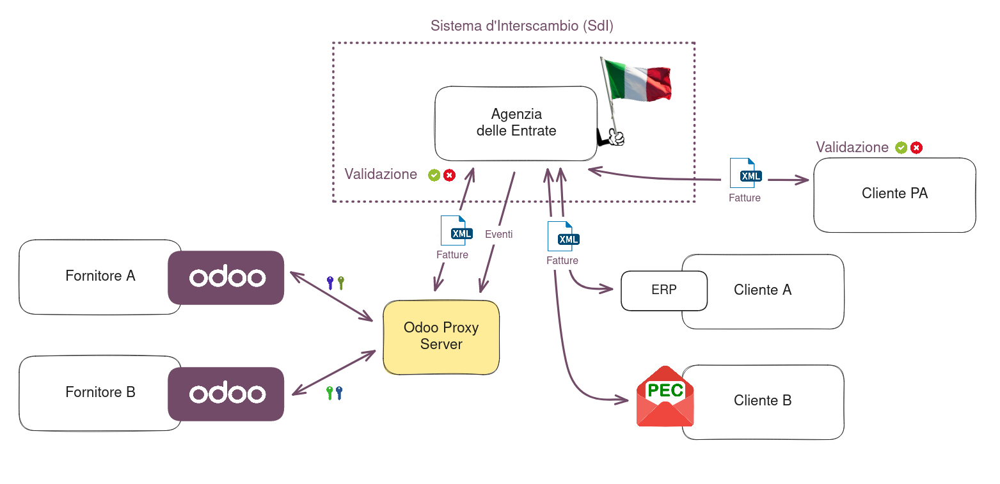

   EDI system architecture

1. XML Documents creation
~~~~~~~~~~~~~~~~~~~~~~~~~

Odoo generates the required **XML** files as attachments to invoices in the `FatturaPA` format
required by the :abbr:`AdE (Agenzia delle Entrate)`. Select the invoices and mark
:guilabel:`Generate XML File` in the :guilabel:`Send and Print` dialog to generate the attachments.

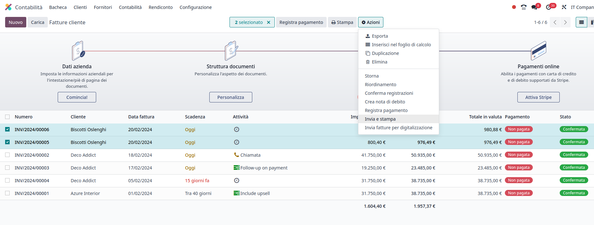

   Send and Print menu

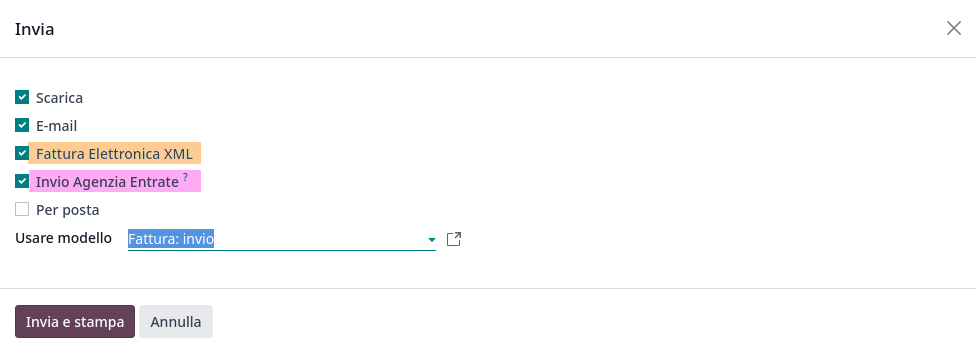

   Send and Print dialog

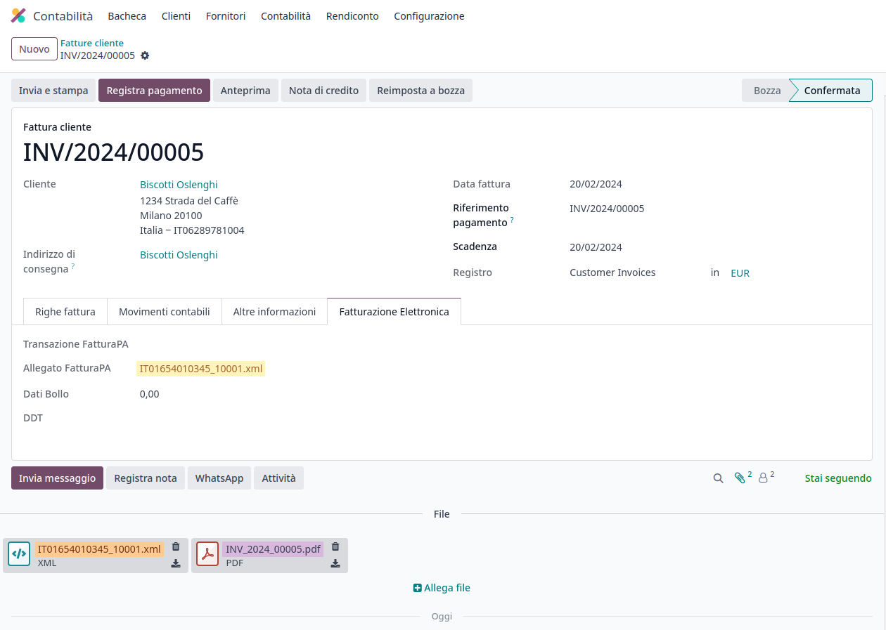

   EDI Attachments

2. Submission to SDI
~~~~~~~~~~~~~~~~~~~~

Also from the "Send and Print" window, you can select submission to the :abbr:`SdI (Sistema di
Interscambio)` The invoice is sent to our :guilabel:`Proxy Server`, which gathers all requests and
then forwards them via a WebServices channel to the :abbr:`SdI (Sistema di Interscambio)`. Check the
sending status of the invoice through the appropriate button.

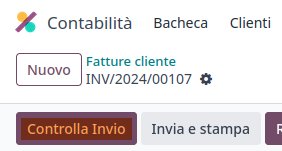

   "Check Sending" Button

3. Processing by SDI
~~~~~~~~~~~~~~~~~~~~

The :abbr:`SdI (Sistema di Interscambio)` receives the document and verifies for any errors. At this
stage, the invoice is in the :guilabel:`SdI Processing` state. The checks may take variable time,
ranging from a few seconds to a day, depending on the queue of invoices sent throughout Italy.

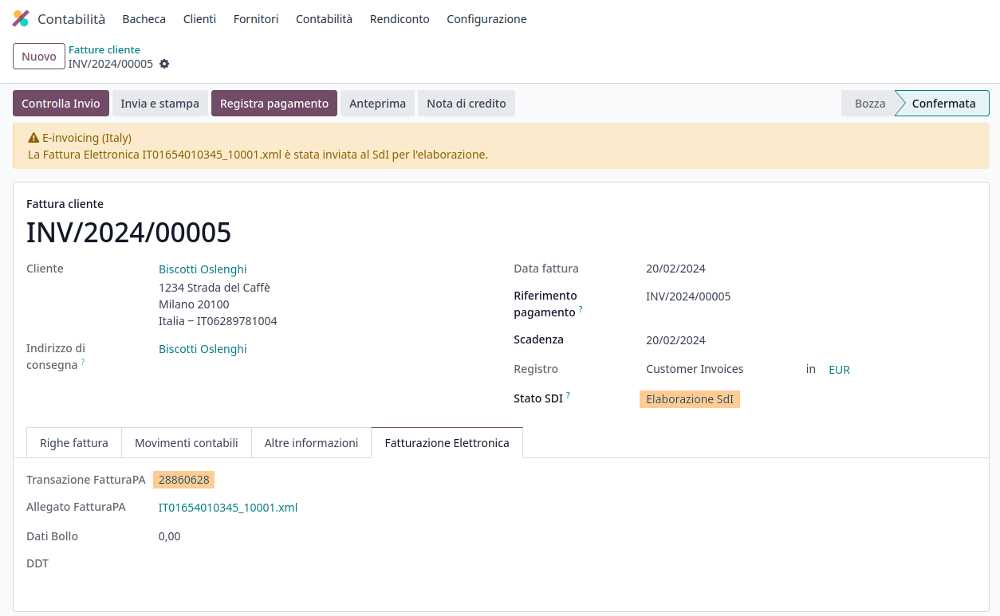

   EDI Processing State

4. Acceptance
~~~~~~~~~~~~~

If the document is valid, it is recorded and considered fiscally valid by the :abbr:`AdE (Agenzia
delle Entrate)`, which will proceed with archiving in :guilabel:`Substitute Storage (Conservazione
Sostitutiva)` if explicitly requested on the Agency's portal.

.. warning::
   Odoo does not offer the
   `Conservazione Sostitutiva <https://www.agid.gov.it/index.php/it/piattaforme/conservazione>`_
   requirements. Other providers and :abbr:`AdE (Agenzia delle Entrate)` supply free and certified storage to
   meet the specifications requested by law.

The :abbr:`SdI (Sistema di Interscambio)` :guilabel:`Destination Code` will attempt to forward the
invoice to the customer at the provided address, whether it is a `PEC` email address or a
:abbr:`SdI (Sistema di Interscambio)` :guilabel:`Destination Code` for their ERP's WebServices
channels. A maximum of 6 attempts are made every 12 hours, so even if unsuccessful, this process can
take up to three days. The invoice status is :guilabel:`Accepted by SDI, Forwarding to Partner`.

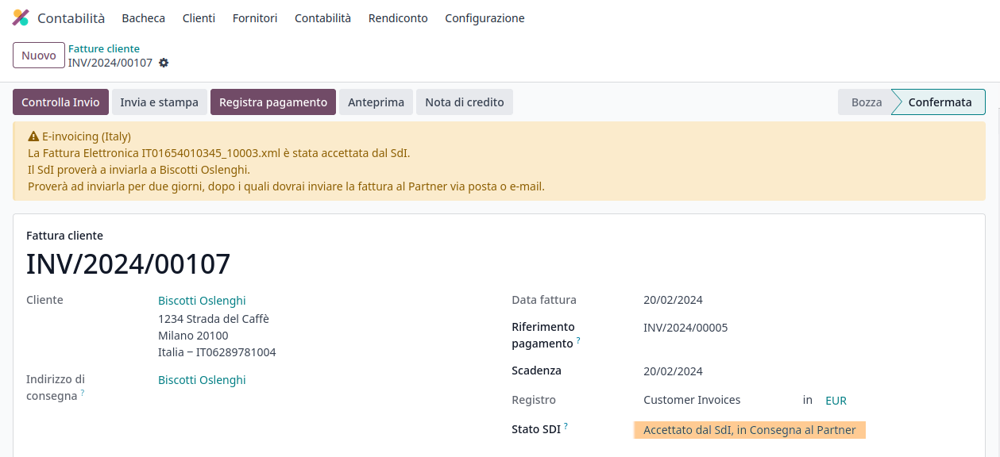

   EDI Forwarding State

4b. Possible Rejection
~~~~~~~~~~~~~~~~~~~~~~

The :abbr:`SdI (Sistema di Interscambio)` may find inaccuracies in the compilation, possibly even
formal ones. In this case, the invoice will be in the :guilabel:`SDI Rejected` state. The :abbr:`SdI
(Sistema di Interscambio)`'s observations will be inserted at the top of the Invoice tab. Nothing
serious, it is sufficient to delete the attachments of the invoice, return the invoice to
:guilabel:`Draft`, and fix the errors. Once the invoice is ready, it can be resent.

.. note::
   To regenerate the **XML**, both the **XML** attachment and the **PDF** report must be deleted, so
   that they are then regenerated together. This ensures that both always contain the same data.

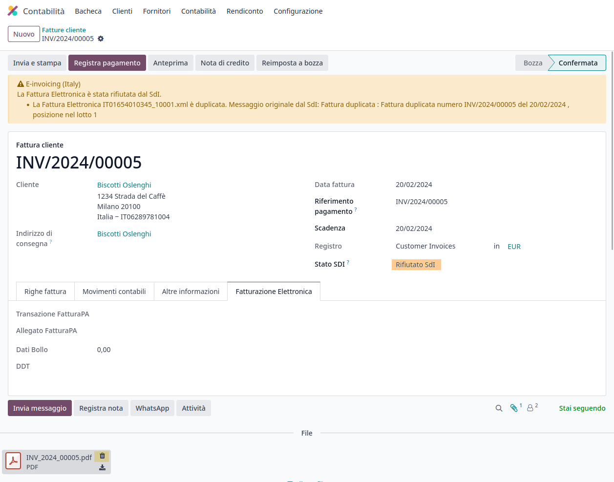

5. Forwarding Completed
~~~~~~~~~~~~~~~~~~~~~~~

The invoice has been delivered to the customer; however, remember that many customers still prefer
to have a copy in **PDF** via email or post. Its status is :guilabel:`Accepted by SDI, Delivered to
Partner`.

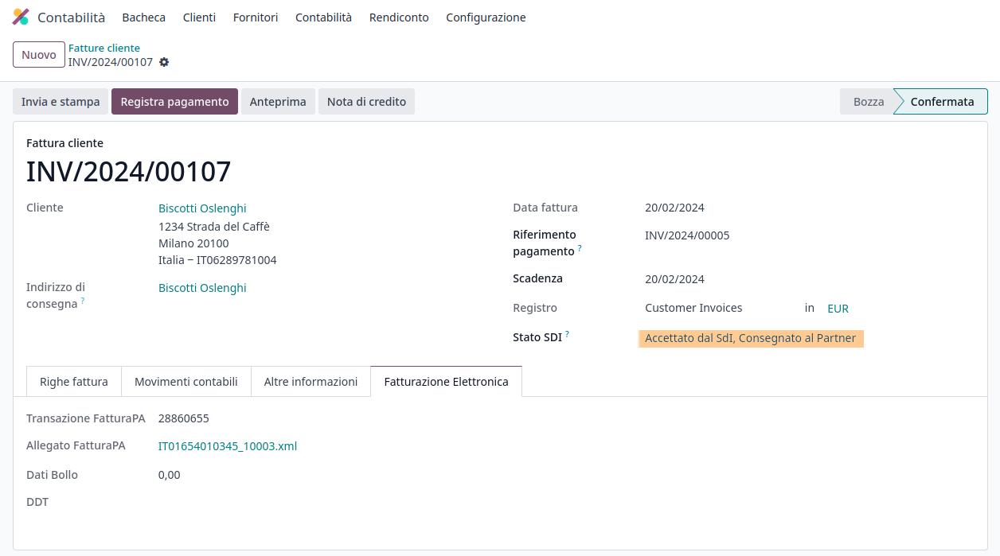

   EDI Delivered State

5b. Possible Forwarding Failure
~~~~~~~~~~~~~~~~~~~~~~~~~~~~~~~

If the :abbr:`SdI (Sistema di Interscambio)` cannot contact your customer, they may not be
registered on the :abbr:`AdE (Agenzia delle Entrate)` portal. No problem, just make sure to send the
invoice in **PDF** via email or by mail. The invoice will be in the :guilabel:`Accepted by SDI,
Partner Delivery Failed` state.

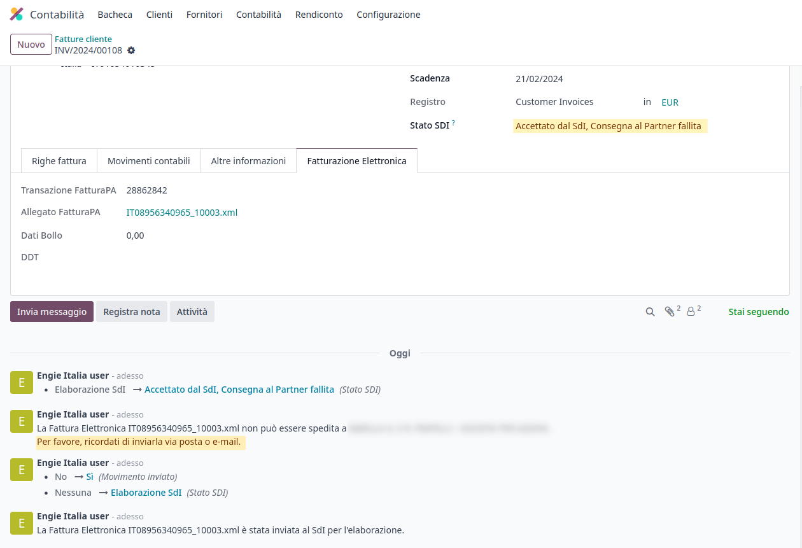

   EDI Forward Failed State

Tax Integrations
----------------

When you receive an invoice from a vendor (which becomes a Vendor Bill), either from the :abbr:`SdI
(Sistema di Interscambio)`, from paper or from an imported **XML** file, the Tax Agency might
request you to send some tax information integration back to the :abbr:`SdI (Sistema di
Interscambio)`. It happens when a transaction that was tax exempt becomes taxable for any reason.

Here is a non-exhaustive list of examples:

- :ref:`italy/reverse-charge`; as a buyer you have to pay taxes on what you buy and integrate
  tax information. :guilabel:`Reverse Charge` taxes.
- :ref:`italy/split-payment`; as a :abbr:`PA (Public Administration)` business buyer, you have to
  pay taxes and integrate tax information. Be sure that you replace the :guilabel:`0% Sale Taxes` on
  the Vendor Bill you received with the correct :guilabel:`Split Payment` taxes.
- :guilabel:`Self Consumption`; when as a business owner you use an asset that you bought for
  business for personal reasons instead, you have to pay those taxes you originally deducted as
  a business cost for it.

Odoo may detect that your Vendor Bill can be interpreted as a document of a type that needs Tax
Integration, as detailed in the :ref:`italy/document-types` section.

Be sure that you replace the :guilabel:`0% Sale Taxes` on the Vendor Bill you received with the ones
you're supposed to pay to the :abbr:`AdE (Agenzia delle Entrate)`. A **button** then appears on the
top of the single Vendor Bill form.

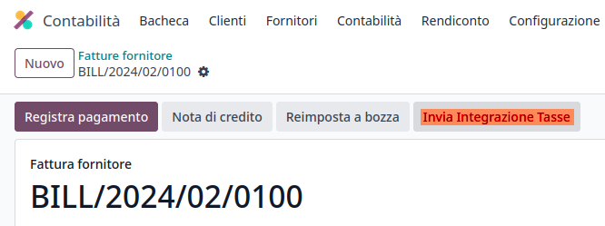

   EDI Send Tax Integration button

When pressed, an **XML** file of the appropriate :guilabel:`Document Type` will be generated, attached
to the Bill and then it will be sent following the same process as invoices, which is described here
below.

.. _italy/document-types:

Mastering the Document Types
----------------------------

The :abbr:`SdI (Sistema di Interscambio)` does not only require businesses to send customer invoices
through the :abbr:`EDI (Electronic Data Interchange)` but there are also other documents that need
sending.

All the different configurations are technically identified by a :guilabel:`Document
Type` code. We do **not** show the :guilabel:`Document Type` to the user, but it is used in the
generation of the **XML** file.

TD01 - Invoices
~~~~~~~~~~~~~~~

This represents the standard **domestic** scenario for all invoices exchanged through the :abbr:`SdI
(Sistema di Interscambio)`. Any invoice that doesn't fall into one of the specific special cases
will be categorized as a Regular Invoice, identified by the :guilabel:`Document Type` `TD01`.

TD02 - Down payments
~~~~~~~~~~~~~~~~~~~~

**Down payment** invoices are imported/exported with a different :guilabel:`Document Type` code
`TDO2` than regular invoices. Upon import of the invoice, it creates a regular vendor bill.

Odoo exports transactions as `TD02` if the following conditions are met:

#. Is an invoice;
#. All invoice lines are related to down payment **sales order lines** (flag `is_downpayment` is set
   as `True`).

.. figure:: italy/italy-edi-td02.png
   :align: center
   :alt: Downpayment invoice

   Downpayment invoice

TD04 - Credit notes
~~~~~~~~~~~~~~~~~~~

It is the standard scenario for all **credit notes** issued to **domestic** clients, when we need to
formally acknowledge that the seller is reducing or canceling a previously issued invoice, for
example in case of overbilling, incorrect items or overpayment. Just like invoices, they must be
sent to the :abbr:`SdI (Sistema di Interscambio)`, their :guilabel:`Document Type` `TD04`

TD07, TD08, TD09 - Simplified Invoicing
~~~~~~~~~~~~~~~~~~~~~~~~~~~~~~~~~~~~~~~

**Simplified invoices** (:guilabel:`Document Type` `TD07`), **credit notes** (`TD08`) and **debit
notes** (`TD09`) can be used to certify **domestic transactions** under **400 EUR** (VAT included).
Its status is the same as a regular invoice, but with fewer information requirements.

For a **simplified** invoice to be established, it must include:

#. :guilabel:`Customer Invoice` reference: **unique** numbering sequence with **no gaps**;
#. :guilabel:`Invoice Date`: issue **date** of the invoice;
#. :guilabel:`Company Info`: the **seller**'s full credentials (VAT/TIN number, name, full address)
   under :menuselection:`General Settings --> Companies (section)`;
#. :guilabel:`VAT`: the **buyer**'s VAT/TIN number (on their profile card);
#. :guilabel:`Total`: the total **amount** (VAT included) of the invoice.

In the :abbr:`EDI (Electronic Data Interchange)`, Odoo exports invoices as simplified if:

#. It is a **domestic** transaction (i.e., the partner is from Italy);
#. Your company's **required fields** (:guilabel:`VAT Number` or :guilabel:`Codice Fiscale`,
   :guilabel:`Fiscal Regime` and full **address**) are provided;
#. The partner's address is not fully specified (i.e. it misses the City or the ZipCode);
#. The total amount VAT included is **less** than **400 EUR**.

.. note::
   The 400 EUR threshold was defined in `the decree of the 10th of May 2019 in the Gazzetta
   Ufficiale <https://www.gazzettaufficiale.it/eli/id/2019/05/24/19A03271/sg>`_. We advise you
   to check the current official value in case it changes.

TD16 - Internal Reverse Charge
~~~~~~~~~~~~~~~~~~~~~~~~~~~~~~

Internal reverse charge transactions (see :ref:`italy/tax-exemption` and
:ref:`italy/reverse-charge`) are exported as `TD16` if the following conditions are met:

- Is a vendor bill;
- At least **one tax** on the invoice lines targets one of these :ref:`tax grids <italy/grids>`:
  `VJ6`, `VJ7`, `VJ8`, `VJ12`, `VJ13`, `VJ14`, `VJ15`, `VJ16`, `VJ17`

TD17 - Buying services from abroad
~~~~~~~~~~~~~~~~~~~~~~~~~~~~~~~~~~

When buying **services** from **EU** and **non-EU** countries, the foreign *seller*
invoices a service with a **VAT-excluded** price, as it is not taxable in Italy.
The VAT is paid by the *buyer* in Italy.

- Within EU: the *buyer* integrates the invoice received with the **VAT information**
  due in Italy (i.e., **vendor bill tax integration**);
- Non-EU: the *buyer* sends themselves an invoice (i.e., **self-billing**).

Odoo exports a transaction as `TD17` if the following conditions are met:

- Is a **vendor bill**;
- At least **one tax** on the invoice lines targets the tax grid :ref:`VJ3 <italy/grids>`;
- All invoice lines either have :guilabel:`Services` as **products**, or a tax with the
  :guilabel:`Services` as **tax scope**.

TD18 - Buying goods from EU
~~~~~~~~~~~~~~~~~~~~~~~~~~~

Invoices issued within the EU follow a **standard format**, therefore only an integration of
the existing invoice is required.

Odoo exports a transaction as `TD18` if the following conditions are met:

- Is a vendor bill;
- The **partner** is from an **EU** country;
- At least one tax on the invoice lines targets the tax grid :ref:`VJ9 <italy/grids>`;
- All invoice lines either have :guilabel:`Consumable` as **products**, or a tax with the
  :guilabel:`Goods` as **tax scope**.

TD19 - Buying goods from VAT deposit
~~~~~~~~~~~~~~~~~~~~~~~~~~~~~~~~~~~~

Buying **goods** from a **foreign** vendor, but the **goods** are already in **Italy** in a
**VAT deposit**.

- From EU: the *buyer* integrates the invoice received with the **VAT information** due in
  Italy (i.e., **vendor bill tax integration**);
- Non-EU: the *buyer* sends an invoice to *themselves* (i.e., **self-billing**).

Odoo exports a transaction as a `TD19` if the following conditions are met:

- Is a vendor bill;
- At least one tax on the invoice lines targets the tax grid :ref:`VJ3 <italy/grids>`;
- All invoice lines either have :guilabel:`Consumables` as products, or a tax with
  :guilabel:`Goods` as **tax scope**.

TD24 - Deferred invoices
~~~~~~~~~~~~~~~~~~~~~~~~

The **deferred invoice** is an invoice that is **issued at a later time** than the sale of goods or
the provision of services. A **deferred invoice** has to be issued at the latest within the **15th
day** of the month following the delivery covered by the document.

It usually is a **summary invoice** containing a list of multiple sales of goods or services,
carried out in the month. The business is allowed to **group** the sales into **one invoice**,
generally issued at the **end of the month** for accounting purposes. Deferred invoices are default
for **wholesaler** having recurrent clients.

If the goods are transported by a **carrier**, every delivery has an associated **Documento di
Transporto (DDT)**, or **Transport Document**. The deferred invoice **must** indicate the details of
all the **DDTs** information for better tracing.

.. note::
    E-invoicing of deferred invoices requires the `l10n_it_stock_ddt`
    :ref:`module <italy/modules>`. In this case, a dedicated :guilabel:`Document Type` `TD24`
    is used in the e-invoice.

Odoo exports transactions as `TD24` if the following conditions are met:

#. Is an invoice;
#. Is associated to deliveries whose **DDTs** have a **different** date than the issue date
   of the invoice.

TD28 - San Marino
~~~~~~~~~~~~~~~~~

Invoices
********

San Marino and Italy have special agreements on e-invoicing operations. As such, **invoices** follow
the regular **reverse charge** rules. You can use the proper :guilabel:`Document Type` depending on
the invoice type: `TD01`, `TD04`, `TD05`, `TD24`, `TD25`. Additional requirements are not enforced
by Odoo, however, the user is requested by the **State** to:

- Select a tax with the :guilabel:`Tax Exemption Kind` set to `N3.3`;
- Use the generic :abbr:`SdI (Sistema di Interscambio)` :guilabel:`Destination Code` `2R4GT08`.

The invoice is then routed by a dedicated office in San Marino to the correct business.

Vendor Bills
************

When a **paper bill** is received from San Marino, any Italian company **must** submit that invoice
to the :abbr:`AdE (Agenzia delle Entrate)` by indicating the e-invoice's :guilabel:`Document Type`
field with the special value `TD28`.

Odoo exports a transaction as `TD28` if the following conditions are met:

#. Is a vendor bill;
#. At least one tax on the invoice lines targets the tax grids :ref:`VJ <italy/grids>`;
#. The **country** of the partner is **San Marino**.

Public Admnistration Businesses (B2G)
=====================================

:abbr:`PA (Public Administration)` businesses are subjected to more control than private businesses
as they handle public money coming from taxpayers. The :abbr:`EDI (Electronic Data Interchange)`
process adds some steps to the :ref:`regular one <italy/e-invoicing-process>` as :abbr:`PA (Public
Administration)` businesses can **accept** or **refuse** invoices.

.. note::
   :abbr:`PA (Public Administration)` businesses have a 6 digits long :guilabel:`Destination Code`
   also called :abbr:`CUU (Codice Univoco Ufficio)` that is **mandatory**, **PEC** address cannot be
   used in this case.

.. seealso::
   The complete list of businesses that belong to the :abbr:`PA (Public Administration)` can be
   found here along with their :guilabel:`Destination Code`:
   - `List of PA businesses <https://www.agenziaentrate.gov.it/portale/web/guest/aree-tematiche/fatturazione-elettronica>`_

CIG, CUP, DatiOrdineAcquisto
----------------------------

To ensure the effective traceability of payments by public administrations, electronic invoices
issued to the public administrations must contain:

- The :abbr:`CIG (Codice Identificativo Gara)`, except in cases of exclusion from traceability
  obligations provided by law n. 136 of August 13, 2010;
- The :abbr:`CUP (Codice Unico di Progetto)`, in case of invoices related to public works.

If the **XML** file requires it, the :abbr:`AdE (Agenzia Delle Entrate)` can *only* proceed payments
of electronic invoices when the **XML** file contains a :abbr:`CIG (Codice Identificativo Gara)` and
:abbr:`CUP (Codice Unico di Progetto)`.

.. note::
   - The :abbr:`CUP (Codice Unico di Progetto)` and the :abbr:`CIG (Codice Identificativo Gara)`
     must be included in one of the `DatiOrdineAcquisto`, `DatiContratto`, `DatiConvenzione`,
     `DateRicezione`, or `DatiFattureCollegate` **XML** tags.
     These correspond to the elements named :guilabel:`CodiceCUP` and :guilabel:`CodiceCIG` of the
     electronic invoice **XML** file, whose table can be found on the government `website
     <http://www.fatturapa.gov.it/>`_.

.. _italy/split-payment:

Split Payment
-------------

The :guilabel:`Split Payment` mechanism behaves much like :ref:`italy/reverse-charge` and it's
been used for the same Tax Evasion purpose.

When an Italian company bills a :abbr:`PA (Public Administration)` business (for example they're
selling cleaning services for a public building) the :abbr:`PA (Public Administration)` business
will send the VAT to the Tax Agency themselves, and the vendor just has to use an appropriate
:guilabel.

In the Italian Localization we have configured a special :guilabel:`Fiscal Position` to deal with
partners belonging to the :abbr:`PA (Public Administration)`.

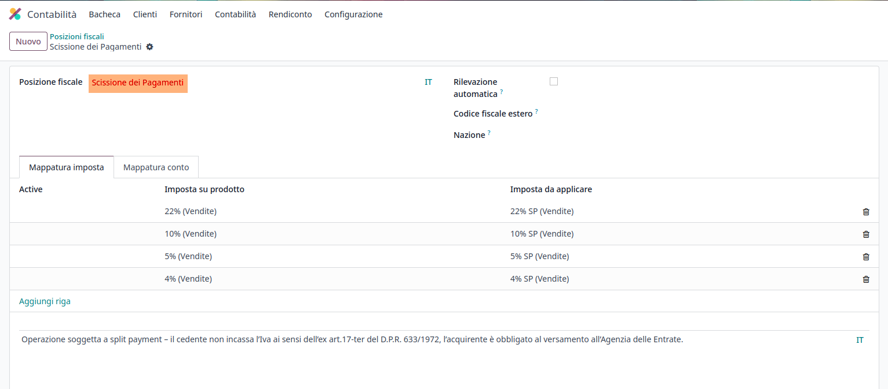

   Public Administration Fiscal Position

Process
-------

.. _italy/digital-signature:

1. Digital qualified signature
~~~~~~~~~~~~~~~~~~~~~~~~~~~~~~

For invoices and bills intended to the **Pubblica Amministrazione (B2G)**, a **Digital Qualified
Signature** is required for all files sent through the :abbr:`SdI (Sistema di Interscambio)`. The
**XML** file must be certified using a certificate that is either:

- a **smart card**;
- a **USB token**;
- an :abbr:`HSM (Hardware Security Module)`.

.. warning::
   Odoo **cannot** digitally sign documents for you. When we detect a :guilabel:`Codice
   Destinatario` that is 6 digits long, then the :abbr:`EDI (Electronic Data Interchange)` process
   stops, the invoice is set on the :guilabel:`Requires user signature` state. You can download the
   document in **XML**, sign it with any :guilabel:`Digital Qualified Signature` provider's external
   program and send it through the :abbr:`AdE (Agenzia Delle Entrate)` portal.

    .. figure:: italy/italy-edi-requires-user-signature.png
       :align: center
       :alt: EDI Request User Signature State

       EDI Request User Signature State

2. Acceptance or Refusal
~~~~~~~~~~~~~~~~~~~~~~~~

.. warning::
   As Odoo does not handle sending signed invoices to :abbr:`PA (Public Administration)` businesses,
   you won't be able to trigger those states from within Odoo, but you have to deal with the
   :abbr:`AdE (Agenzia Delle Entrate)` portal. Yet, if you will still be able to receive
   notifications about it, which will advance the invoice :guilabel:`SdI State` to the correct one.

After receiving the invoice through the :abbr:`SdI (Sistema di Interscambio)`, the :abbr:`PA (Public
Administration)` business has **15 days** to **accept** the invoice. If it does, then the process
ends here. If the :abbr:`PA (Public Administration)` business **refuses** the invoice, it is still
considered valid once it was accepted by the :abbr:`SdI (Sistema di Interscambio)` so you'll have to
emit a credit note to compensate.

2b. Expired Terms
~~~~~~~~~~~~~~~~~

If the :abbr:`PA (Public Administration)` business doesn't reply in the **15 days** time frame,
please contact the :abbr:`PA (Public Administration)` business directly, sending them both the
invoice and the received deadline notification by email. You will be able to get an arrangement with
them, and manually set the correct :guilabel:`SdI State` on your invoice.
