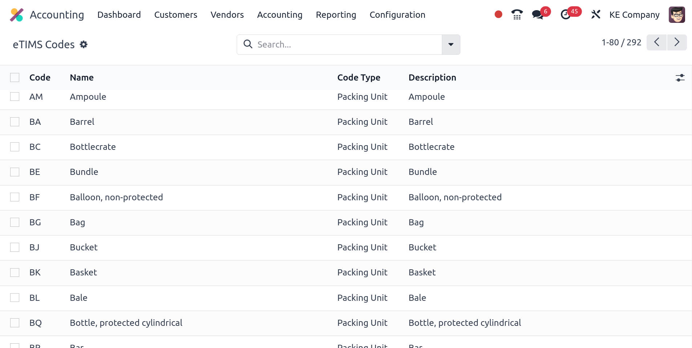
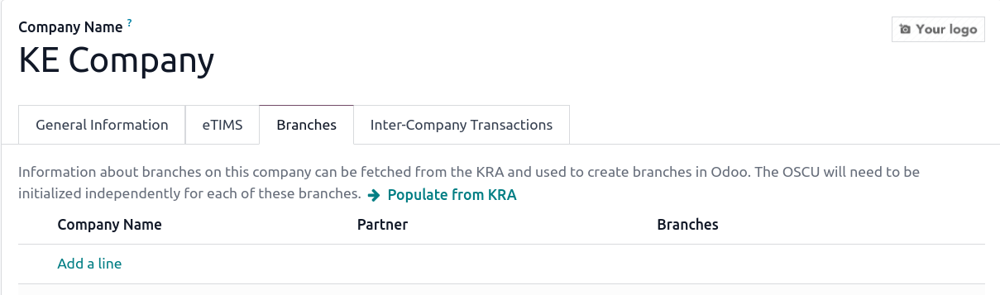
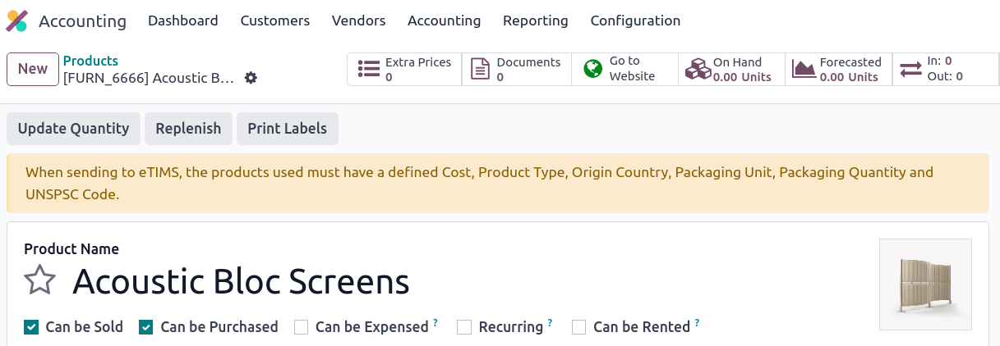
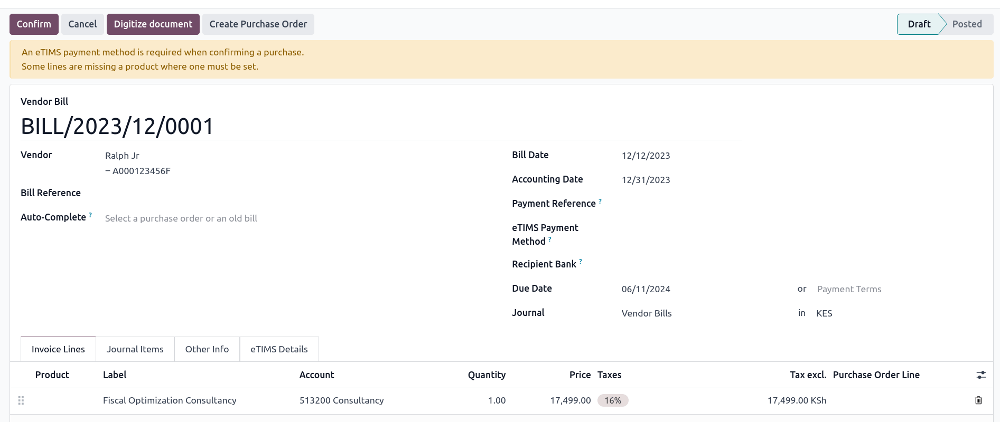

=====
Kenya
=====

.. _localization/kenya/configuration:

Configuration
=============

Install the 🇰🇪 **Kenyan** :ref:`fiscal localization package <fiscal_localizations/packages>` to get
all the features of the Kenyan localization.

eTIMS
=====

The `Kenya Revenue Authority (KRA) <https://www.kra.go.ke/>`_ has implemented the
`electronic Tax Invoice Management System (eTIMS) <https://www.kra.go.ke/online-services/etims>`_
for tax collection.

To submit documents through eTIMS, you must use an :abbr:`OSCU (Online Sales Control Unit)` that
integrates with the existing **Trader Invoicing System (TIS)**, such as the one provided by Odoo.
The OSCU is used to validate, encrypt, sign, transmit, and store tax invoices.

.. note::
   Make sure to :ref:`install <general/install>` the **Kenya eTIMS EDI** modules to use the OSCU
   device fully.

.. _kenya/initialization:

OSCU device initialization
--------------------------

The OSCU must be initialized before use. To do so, navigate to :menuselection:`Settings --> General
Settings`, click :guilabel:`Update Info` in the :guilabel:`Companies` section, and enter your
:guilabel:`Tax ID`.

To initialize the OSCU:

#. Go to the :guilabel:`eTIMS` tab.
#. Fill in the :guilabel:`eTIMS Branch Code` and :guilabel:`Serial Number` of the device.
#. Set the :guilabel:`eTIMS Server Mode` to :guilabel:`Test` for the initialization.
#. Tick the **user agreement** and click :guilabel:`Initialize OSCU`.

.. note::
   Three server modes are available:

   - :guilabel:`Demo`: Designed for demo purposes; it uses mock data and does not require an
     initialized OSCU;
   - :guilabel:`Test`: Used to test the connection to eTIMS;
   - :guilabel:`Production`: Used for live databases that are ready to send data.

.. Important::
   If your device has **already been initialized** (through another ERP, for example), enable the
   :doc:`../../general/developer_mode`, go to the :guilabel:`eTIMS` tab, and enter the key
   obtained through a previous initialization in the :guilabel:`Device Communication Key` field.
   Click :guilabel:`Save manually`, then :guilabel:`Initialize OSCU` (which may take a moment to
   become available).

eTIMS codes
-----------

Common standard codes are **automatically** fetched from the KRA eTIMS API servers every two days.
To fetch them manually, proceed as follows:

#. Enable the :doc:`../../general/developer_mode`.
#. Go to :menuselection:`Settings --> Technical --> Automation: Scheduled Actions` and search for
   :guilabel:`KE eTIMS: Fetch KRA standard codes`.
#. Click the action in the list, then click :guilabel:`Run Manually` to fetch the codes.

Go to :menuselection:`Accounting --> Vendors --> KE OSCU Codes` to view the complete list of
fetched OSCU codes.

.. _etims/unspsc:

UNSPSC codes
------------

The KRA needs UNSPSC codes for a product to be **registered**. UNSPSC codes are **automatically**
fetched from the KRA eTIMS API servers every day. To fetch them manually, proceed as follows:

#. Enable the :doc:`../../general/developer_mode`.
#. Go to :menuselection:`Settings --> Technical --> Automation: Scheduled Actions` and search for
   :guilabel:`KE eTIMS: Fetch UNSPSC codes from eTIMS`.
#. Click the action in the list, then click :guilabel:`Run Manually` to fetch the codes.

Go to :menuselection:`Accounting --> Vendors --> KE UNSPSC Codes` to view the complete list of
fetched UNSPSC codes.

Notices
-------

Notices are **automatically** fetched from the KRA eTIMS API servers every day. To fetch them
**manually**, proceed as follows:

#. Enable the :doc:`../../general/developer_mode`.
#. Go to :menuselection:`Settings --> Technical --> Automation: Scheduled Actions` and search for
   :guilabel:`KE eTIMS: Fetch KRA notices from eTIMS`.
#. Click the action in the list, then click :guilabel:`Run Manually` to fetch the notices.

Go to :menuselection:`Accounting --> Vendors --> KE OSCU Notices` to view the complete list of
fetched notices.

Multi-company
-------------

.. _kenya/branch:

.. seealso::
   :doc:`../../general/companies`

If you have :ref:`multiple companies <accounting/multi-company>`, you can centralize and manage them
all on a single Odoo database. The KRA identifies and differentiates the **main** company from
its **subsidiaries** by using IDs. Furthermore, subsidiaries are classified as **branches** of the
main company.

To configure the company ID, open the **Settings** app, click :guilabel:`Update Info` in the
:guilabel:`Companies` section, then click the :guilabel:`eTIMS` tab. The **main company** has a
branch ID equal to `00` in a multi-company environment. Companies that are *not* the main company
have a branch ID other than `00` and are assigned an ID by the KRA.

To add a branch, go to the :guilabel:`Branches` tab in the **company settings** and click
:guilabel:`Add a line`.

To fetch the **branch ID** from the KRA for your non-main companies, ensure the main company has a
Kenyan :guilabel:`Tax ID` and the OSCU device has been :ref:`initialized <kenya/initialization>`.
Then, go to the :guilabel:`Branches` tab and click :guilabel:`Populate from KRA`.

.. note::
   - The KRA considers each **place of supply** as a separate branch (ID).
   - The **OSCU** device must be :ref:`initialized independently <kenya/initialization>` for each
     branch.

Contact branch ID
-----------------

To attribute a branch ID to a contact, access the contact form, go to the :guilabel:`Accounting`
tab, and enter the branch code in the :guilabel:`eTIMS Branch Code` field.

.. note::
   By default, contacts' branch IDs are set to `OO`.

KRA sequences
-------------

.. important::
   Odoo invoice sequences and KRA sequences are **different**.

In Odoo, invoice sequences depend on the **main company**. Main companies can see the invoices of
branches, but branches **cannot** see the main company's invoices or those of other branches.

The KRA needs **independent** sequences per branch. Therefore, Odoo manages sequences individually
per branch.

.. example::
   If you have a main company with two branches, the invoice sequence would be the following:

   - Creating an invoice on **branch 1**: INV/2024/00001;
   - Creating an invoice on **branch 2**: INV/2024/00002;
   - Creating an invoice on the **main company**: INV/2024/00003.

   This is how Odoo manages sequences to be compliant with the KRA regulations:

   - Creating an invoice on **branch 1**: INV/2024/00001;
   - Creating an invoice on **branch 2**: INV/2024/00001;
   - Creating an invoice on the **main company**: INV/2024/00001.

Insurance
=========

For **health service providers**, you can send insurance information about the main and branch
companies and update it in eTIMS. To do so, open the **Settings** app, click :guilabel:`Update Info`
in the :guilabel:`Companies` section, and in the :guilabel:`eTIMS` tab, fill in the fields related
to your company: :guilabel:`Insurance Code`, :guilabel:`Insurance Name`, and :guilabel:`Insurance
Rate`.

.. _kenya/product-registration:

Product registration
====================

The KRA requires **products to be registered** first before conducting business operations (such as
stock movements, :abbr:`BOM (Bill of Materials)`, customer invoices, etc.). For a product to be
registered, the following fields must be defined on the product form:

- In the :guilabel:`General Information` tab: :guilabel:`Cost`.
- In the :guilabel:`Accounting` tab:

  - :guilabel:`Packaging Unit`;
  - :guilabel:`Packaging Quantity`;
  - :guilabel:`Origin Country`;
  - :guilabel:`eTIMS Product Type`;
  - :guilabel:`Insurance Applicable`;
  - :ref:`UNSPSC Category <etims/unspsc>`.

If the elements above are defined, the product is automatically registered while sending the
operation to the KRA. If not, you will be alerted by a yellow banner at the top of the screen
inviting you to check the missing elements.

Stock movements
===============

All **stock movements** must be sent to the KRA. They do not require an invoice if they are
internal operations or stock adjustments; therefore, Odoo automatically sends them if at least one
of the following conditions are met:

#. No contact is set for the move;
#. The contact is your main company or a branch of the main company.

If the stock moves are **external operations** (e.g., to contacts that are not part of the main
company or its branches), the stock moves are automatically sent *after* the invoice is sent to
eTIMS.

.. note::
   - The stock move must be confirmed before sending the invoice to eTIMS.
   - The product(s) must be :ref:`registered <kenya/product-registration>` for the stock move to be
     sent to eTIMS. If the product has not been registered yet, a yellow banner will prompt the
     products' registration.

Purchases
=========

Odoo automatically fetches new vendor bills from eTIMS every day. You need to confirm the fetched
vendor bills and send the confirmation to the KRA. To confirm a vendor bill, it must be linked to
one or several confirmed purchase order line(s).

.. _kenya/purchases:

In the case of purchases (not customs imports), the steps to link purchase order lines with bills
are the following:

#. Go to :menuselection:`Accounting --> Vendors --> Bills`.
   The vendor bill is fetched from the KRA servers. The JSON file is available in the chatter of the
   vendor bill if needed.
#. Odoo looks at the :guilabel:`Tax ID` (PIN) of the vendor (partner);

   - If it is unknown, a new contact (partner) is created.
   - If it is known and the branch ID is the same, Odoo uses the known contact.

#. In the fetched bill from the KRA, select the :guilabel:`Product`. Each vendor bill *must* contain
   a product to be confirmed and sent to eTIMS later on.
#. Odoo checks existing purchase order lines matching the product(s) entered at the previous step
   and the partner (if any). Click the :guilabel:`Purchase Order Line` field, and select the correct
   related purchase order line(s) matching the product(s). The quantities on the bill *must* be the
   same as the received quantities indicated on the purchase order.

   If no existing purchase order line matches the lines of the fetched bill, click
   :guilabel:`Create Purchase Order` and create a purchase order based on the unmatched line(s).
   :guilabel:`Validate` the resulting stock move and :guilabel:`Confirm` the bill.

#. Set a method in the :guilabel:`eTIMS Payment Method` field..
#. Once all steps are completed, click :guilabel:`Send to eTIMS` to send the vendor bill. When the
   vendor bill has been confirmed on eTIMS, the **KRA invoice number** can be found in the
   :guilabel:`eTIMS Details` tab.

Invoicing
=========

.. note::
   The KRA does *not* accept sales if the product is not in stock.

This is the **advised sales flow** in Odoo when selling:

#. Create a **sales order**.
#. :guilabel:`Validate` the delivery.
#. :guilabel:`Confirm` the invoice.
#. Click :guilabel:`Send and print`, and then enable :guilabel:`Send to eTIMS`.
#. Click :guilabel:`Send & print` to send the invoice.

Once the invoice has been sent and signed by the KRA, the following information can be found on
it:

- **KRA invoice number**;
- Mandatory KRA invoice fields, such as **SCU information**, **date**, **SCU ID**, **receipt
  number**, **item count**, **internal date**, and **receipt signature**;
- The **KRA tax table**;
- A unique **KRA QR code** for the signed invoice.

Imports
=======

Customs import codes are **automatically** fetched from the KRA eTIMS API servers every day. To
fetch them manually, proceed as follows:

#. Enable the :doc:`../../general/developer_mode`.
#. Go to :menuselection:`Settings --> Technical --> Automation: Scheduled Actions` and search for
   :guilabel:`KE eTIMS: Receive Customs Imports from the OSCU`.
#. Click the action in the list, then click :guilabel:`Run Manually` to fetch the codes.

Go to :menuselection:`Accounting --> Vendors --> Customs Imports` to view the imported codes.

The following steps are required to send and have **customs imports** signed by the KRA:

#. Go to :menuselection:`Accounting --> Vendors --> Customs Imports`; The customs import is fetched
   automatically from the KRA.
#. Match the imported item with an existing registered product in the :guilabel:`Product` field (or
   create a product if no related product exists).
#. Set a vendor in the :guilabel:`Partner` field.
#. Based on the partner, match the imported item with its related purchase order (see
   :ref:`purchase steps <kenya/purchases>`). The stock must be correctly adjusted when the customs
   import is approved.

   If no related purchase order exists, create one and :guilabel:`Confirm` it. Then, confirm the
   delivery by clicking :guilabel:`Receive Products`, then :guilabel:`Validate` on the purchase
   order.

#. Click :guilabel:`Match and Approve` or :guilabel:`Match and Reject`, depending on the
   situation of the goods.

.. note::
   The JSON file received from the KRA is attached to the chatter of the customs import.

BOM
===

The KRA requires all BOMs to be sent to them. To send BOMs to eTIMS, the product and its components
*must* be :ref:`registered <kenya/product-registration>`. To access a product's BOM, click on the
product and then click the :guilabel:`Bill of Materials` smart button.

Fill in the KRA's required fields in the :guilabel:`KRA eTIMS details` section of the
:guilabel:`Accounting` tab, then click :guilabel:`Send to eTIMS`. The successful sending of the
BOM is confirmed in the chatter, where you can also find the sent information in an attached JSON
file.

Credit notes
============

The KRA does not accept credit notes with quantities or prices higher than the initial invoice. When
reversing the invoice, a KRA reason must be indicated: in the credit note form, go to the
:guilabel:`eTIMS Details` tab, select the :guilabel:`eTIMS Credit Note Reason`, and then select the
invoice number in the :guilabel:`Reversal of` field.
