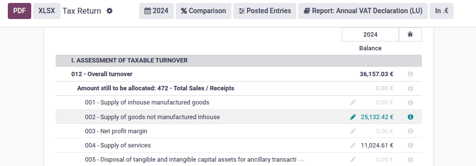
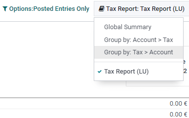

==========
Luxembourg
==========

Configuration
=============

:ref:`Install <general/install>` the following modules to get all the features of the Luxembourgish
localization:

.. list-table::
   :header-rows: 1

   * - Name
     - Technical name
     - Description
   * - :guilabel:`Luxembourg - Accounting`
     - `l10n_lu`
     - Default :ref:`fiscal localization package <fiscal_localizations/packages>`
   * - :guilabel:`Luxembourg - Accounting Reports`
     - `l10n_lu_reports`
     - Country-specific reports
   * - :guilabel:`Luxembourg - Annual VAT Report`
     - `l10n_lu_reports_annual_vat`
     - Country-specific reports

.. image:: luxembourg/modules.png
   :align: center
   :alt: The three modules for the Luxembourgish Fiscal Localization Package on Odoo

.. tip::
   Installing the module :guilabel:`Luxembourg - Accounting Reports` installs all three modules at
   once.

Standard Chart of Accounts - PCN 2020
=====================================

Odoo's :ref:`fiscal localization package <fiscal_localizations/packages>` for Luxembourg includes
the current **Standard Chart of Accounts (PCN 2020)**, effective since January 2020.

eCDF tax return
===============

Tax returns in Luxembourg require a specific XML file to upload on the eCDF.

To download it, go to :menuselection:`Accounting --> Report --> Audit Reports --> Tax Report`, and
click on :guilabel:`Export eCDF declaration`.

.. seealso::
   - :doc:`../accounting/reporting/tax_returns`
   - `Platform for electronic gathering of financial data (eCDF) <http://www.ecdf.lu>`_

Annual tax report
=================

You can generate an XML file to electronically file your annual tax report with the tax office.

To do so, go to :menuselection:`Accounting --> Report --> Luxembourg --> Annual Tax Report`, click
on :guilabel:`Create`, then define the annual period in the :guilabel:`Year` field.

The **simplified annual declaration** is automatically generated. You can manually add values in all
the fields to get a **complete annual declaration**.

To help you complete it, you can use the information provided on the :guilabel:`Tax Report`. To do
so, go to :menuselection:`Accounting --> Report --> Audit Reports --> Tax Report`, then click on the
:guilabel:`Tax Report` dropdown menu and select the type of report you want to display.

Finally, click on :guilabel:`Export XML` to download the XML file.

.. note::
   This feature requires the module :guilabel:`Luxembourg - Annual VAT Report` to be installed.

FAIA (SAF-T)
============

**FAIA (Fichier d’Audit Informatisé AED)** is a standardized and structured file that facilitates
the exchange of information between the taxpayers' accounting system and the tax office. It is the
Luxembourgish version of the OECD-recommended SAF-T (Standard Audit File for Tax).

Odoo can generate an XML file that contains all the content of an accounting period according to the
rules imposed by the Luxembourg tax authorities on digital audit files.

.. note::
   This feature requires the module :guilabel:`Luxembourg - Accounting Reports` to be installed.

Export FAIA file
----------------

Go to :menuselection:`Accounting --> Reporting --> Audit Reports -->  General Ledger`, then click on
:guilabel:`FAIA`.
