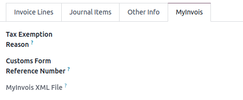
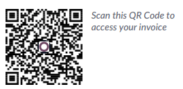

========
Malaysia
========

.. _MyTax: https://mytax.hasil.gov.my

.. _malaysia/configuration:

Configuration
=============

.. _malaysia/configuration/modules:

Modules installation
--------------------

:ref:`Install <general/install>` the following modules to get all the features of the Malaysian
localization:

.. list-table::
   :header-rows: 1

   * - Name
     - Technical name
     - Description
   * - :guilabel:`Malaysia - Accounting`
     - `l10n_my`
     - This module includes the default
       :ref:`fiscal localization package <fiscal_localizations/packages>`.
   * - :guilabel:`Malaysia - Accounting Reports`
     - `l10n_my_reports`
     - This module includes the accounting reports for Malaysia.
   * - :guilabel:`Malaysia - UBL PINT`
     - `l10n_my_ubl_pint`
     - This module includes the features required to export invoices in PINT format.
   * - :guilabel:`Malaysia - E-invoicing`
     - `l10n_my_edi`
     - This module includes the features required for integration with MyInvois under IRBM.
   * - :guilabel:`Malaysia - E-invoicing Extended Features`
     - `l10n_my_edi_extended`
     - This module improves the MyInvois E-invoicing feature by adding proper support for self
       billing, rendering the MyInvois QR code in the invoice PDF file and allows better management
       of foreign customer TIN.

.. _malaysia/configuration/company:

Company information
-------------------

To configure your company information, go to the :guilabel:`Contacts` app, search for your company,
and select it. Then configure the following fields:

- :guilabel:`Name`
- :guilabel:`Address`, including the :guilabel:`City`, :guilabel:`State`, :guilabel:`Zip Code`,
  and :guilabel:`Country`.

   - In the :guilabel:`Street` field, enter the street name, number, and any additional address
     information.
   - In the :guilabel:`Street 2` field, enter the neighborhood.

- :guilabel:`Tax ID`: Tax identification number
- :guilabel:`SST`: Malaysian Sales and Service Tax Number, if applicable
- :guilabel:`TTx`: Malaysian Tourism Tax Number, if applicable
- :guilabel:`Phone`

E-invoicing integration with MyInvois
=====================================

The MyInvois Portal is a platform provided by the :abbr:`IRBM (Inland Revenue Board of Malaysia)`
that facilitates the implementation of e-invoices for Malaysian taxpayers.
Odoo supports integration with MyInvois to submit the invoices generated in Odoo.

.. note::
   The :guilabel:`Malaysia - E-invoicing module` must be installed to submit invoices to MyInvois.

.. _malaysia/myinvois/setup:

Set-up
------

.. _malaysia/myinvois/setup/registration:

MyInvois registration
~~~~~~~~~~~~~~~~~~~~~

To send electronic invoices to MyInvois, you first need to register and log in to the MyInvois
portal to grant Odoo the **right to invoice** as an intermediary for your company.

.. note::
   If this is the first time you log into the MyInvois portal, click :guilabel:`User Manual` on
   MyTax_ to learn more about the registration process. Both the **pre-production** (:dfn:`testing
   environment to try the functions before using the actual (production) environment`) and
   **production** (:dfn:`actual environment to submit e-invoices with accurate information`)
   environments are supported.

#. Log into MyTax_. Choose the :guilabel:`ID Type` and the corresponding
   :guilabel:`identification number` used to register for the digital certificate.
#. From the dashboard, click the :icon:`fa-angle-down` :guilabel:`(angle-down)` icon in the
   top-right corner and select :guilabel:`View Taxpayer Profile`.
#. In the :guilabel:`Representatives` section, click :guilabel:`Add Intermediary` in the top-right
   corner.

   .. image:: malaysia/myinvois-add-intermediary.png
      :alt: MyInvois add intermediary

#. Add `ODOO S.A.` as an intermediary using the following information:

   - :guilabel:`TIN`: `C57800417080`
   - :guilabel:`BRN`: `BE0477472701`
   - :guilabel:`Name`:

     - :guilabel:`Production`: `ODOO S.A.`
     - :guilabel:`Pre-production`: `OXXX_XXXXA.`

#. Grant the following permissions by clicking the :icon:`fa-toggle-on` :guilabel:`(toggle-on)`
   icon:

   - :guilabel:`Representation From`
   - :guilabel:`Document - Submit`
   - :guilabel:`Document - Cancel`
   - :guilabel:`Document - Request Rejection`

   .. note::
      - Access can be revoked in the future if needed.
      - Odoo, as an intermediary, does not store invoices sent on behalf of the client on the proxy
        server.

#. Click :guilabel:`Save`. The status for `ODOO S.A.` is then :guilabel:`Active`.

   .. image:: malaysia/myinvois-intermediary-active.png
      :alt: MyInvois status active

.. _malaysia/myinvois/setup/odoo:

Configuration in Odoo
~~~~~~~~~~~~~~~~~~~~~

.. _malaysia/myinvois/setup/odoo/einvoicing:

Company
*******

Open the Settings app, navigate to the :guilabel:`Companies` section, and click
:guilabel:`Update Info`. Make sure the :guilabel:`Tax ID` is entered and complete the following
fields in the :guilabel:`E-invoicing` section:

   - :guilabel:`Identification`: Select the :guilabel:`ID Type` and enter the associated
     :guilabel:`Identification number` used to register for the digital certificate.
   - :guilabel:`Ind. Classification`: Input the 5-digit numeric code that represents the nature and
     activity of the business.

Electronic invoicing
********************

Go to :menuselection:`Accounting --> Configuration --> Settings`. In the
:guilabel:`Malaysian Electronic Invoicing` section, select the relevant :guilabel:`MyInvois mode`
based on the environment used for the company's MyInvois registration.

Make sure to allow Odoo to process e-invoices by checking the box, then click :guilabel:`Register`.

.. note::
   To change the :abbr:`TIN (tax identification number)` reference, click :guilabel:`Unregister`,
   change the company's information and make sure the number registered on MyInvois matches, then
   :guilabel:`Register` again.

.. important::
   For taxpayers with a :abbr:`TIN (tax identification number)` starting with "IG" and a
   :abbr:`ROB (registration of business)` number, combine the TIN and ROB in the **TIN:ROB** format
   for the :guilabel:`Tax ID` field.

   To register, go to :menuselection:`Accounting --> Configuration --> Settings`, and in the
   :guilabel:`Malaysian Electronic Invoicing` section, click :guilabel:`Register`. Once the
   registration is complete, the **:ROB** can be removed from the :guilabel:`Tax ID`.

   Additionally, remember to log into `MyTax account <https://mytax.hasil.gov.my/>`_ and set the
   :guilabel:`Type of Role` as :guilabel:`Business Owner`.

.. _malaysia/myinvois/setup/odoo/company:

Contacts
********

Access the contact's form and fill in the following fields:

   - :guilabel:`Country`
   - :guilabel:`State`
   - :guilabel:`Phone`
   - :guilabel:`Tax ID`
   - :guilabel:`Identification`: the :guilabel:`ID Type` and the corresponding
     :guilabel:`Identification number` of the contact registered on MyTax.

.. _malaysia/myinvois/setup/odoo/product:

Products
********

All products to be included in e-invoices require a Malaysian classification code. To add it,
access the :guilabel:`Product` form and in the :guilabel:`General Information` tab, fill in the
:guilabel:`Malaysian classification code` field.

Malaysian tax type
******************

To configure a tax's :guilabel:`Malaysian Tax Type` field, go to :menuselection:`Accounting -->
Configuration --> Accounting --> Taxes` and open the relevant tax in the :guilabel:`Taxes` list
view.

When an invoice or bill includes a tax with the :guilabel:`Malaysian Tax Type` set to
**Tax Exempt**, a :guilabel:`Tax Exemption Reason` must be specified in the :guilabel:`MyInvois`
tab before the document is sent.

.. _malaysia/myinvois/workflow:

Workflow
--------

.. _malaysia/myinvois/workflow/sending:

Send invoices to MyInvois
~~~~~~~~~~~~~~~~~~~~~~~~~

Invoices can be sent to MyInvois once they have been confirmed. To do so, click
:guilabel:`Send to MyInvois`.

Send bills to MyInvois
~~~~~~~~~~~~~~~~~~~~~~

Sending a bill to MyInvois is necessary when issuing an e-Invoice on behalf of a supplier. Once a
bill is confirmed, click :guilabel:`Send To MyInvois`.

.. note::
   - In `MyInvois <https://preprod.myinvois.hasil.gov.my/content>`_, these vendor bills are
     categorized as :guilabel:`Self-billed Invoice`.

   - If a :guilabel:`Bill Reference` field is empty, Odoo's vendor bill number is used as the
     MyInvois number. If a reference is entered in the :guilabel:`Bill Reference` field, that
     reference is used instead.

.. _malaysia/myinvois/workflow/sending/status:

MyInvois status
***************

The current MyInvois status of an invoice or bill is shown in the :guilabel:`MyInvois State` field
within the :guilabel:`MyInvois` tab.

 - :guilabel:`Validation in Progress`: the validation is being processed by MyInvois. A blue
   :guilabel:`Processing` banner is also displayed.
 - :guilabel:`Valid`: it is validated by MyInvois. The :guilabel:`Submission UID`,
   :guilabel:`MyInvois` and :guilabel:`Validation Time` are automatically updated with information
   from MyInvois.

.. note::
   Odoo :doc:`automatically checks and updates <../../sales/subscriptions/scheduled_actions>` the
   status every hour. To update it manually at any time, click :guilabel:`Update MyInvois Status`.

.. _malaysia/myinvois/workflow/cancellation:

Invoice cancellation
~~~~~~~~~~~~~~~~~~~~

Sent invoices can be canceled within 72 hours from :guilabel:`Validation time`. In this case, open
the invoice and click :guilabel:`Request Cancel`. In the :guilabel:`Cancel document` window,
include the cancellation :guilabel:`Reason`, then click :guilabel:`Update Invoice`. The
:guilabel:`MyInvois State` is updated to :guilabel:`cancelled`.

Send credit notes to MyInvois
~~~~~~~~~~~~~~~~~~~~~~~~~~~~~

Before sending a credit note, the original invoice must be successfully submitted to MyInvois.
Otherwise, the credit note's :guilabel:`MyInvois State` is updated to :guilabel:`Invalid`.

While Odoo uses a single :guilabel:`credit note` document, MyInvois categorizes these into two
types: :guilabel:`credit note` and :guilabel:`refund note`, depending on how they are reconciled.

- :guilabel:`MyInvois Credit Note`: This is created when an Odoo credit note is reconciled with the
  original invoice.
- :guilabel:`MyInvois Refund Note`: This is created when an Odoo credit note is reconciled with a
  full payment instead of the original invoice.

.. note::
   If a credit note is reconciled with only a partial payment before being sent, it is still
   categorized as a :guilabel:`credit note` in MyInvois.

.. tip::
   To issue both a credit note and a refund note for the same original invoice:
    - Create two separate credit notes in Odoo from the original invoice.
    - For a MyInvois :guilabel:`Refund Note`: Register a payment before sending it.
    - For a MyInvois :guilabel:`Credit Note`: Do not register a payment before sending it.

.. note::
   The same logic applies to credit notes created from bills: if reconciled with a full payment,
   the credit note becomes a :guilabel:`Self-billed Refund Note`; otherwise, it becomes a
   :guilabel:`Self-billed Credit Note`.

Send debit notes to MyInvois
~~~~~~~~~~~~~~~~~~~~~~~~~~~~

:ref:`Issue a debit note from an existing bill or invoice <accounting/credit_notes/issue-debit-note>`
and click :guilabel:`Send To MyInvois`. In MyInvois, it appears then as a :guilabel:`Debit Note` if
issued from an invoice or a :guilabel:`Self-billed Debit Note` from a vendor bill.

Access invoices via QR code
---------------------------

When a document is successfully submitted to MyInvois, a QR code is added to its PDF version.
Scanning this code links directly to the validated document in MyInvois.

To download the PDF from an invoice or bill:

#. Click the :icon:`fa-cog` :guilabel:`(gear)` icon
#. Select :guilabel:`Download`
#. Choose either :guilabel:`PDF` or :guilabel:`PDF without Payment`

.. _malaysia/employment-hero:

Employment Hero payroll
=======================

If your business is already up and running with :doc:`Employment Hero
<../../hr/payroll/payroll_localizations/employment_hero>`, you can use our connector as an
alternative payroll solution.

.. important::
   To :ref:`configure the Employment Hero API <employment_hero/configuration>` for **Malaysia**, use
   the following value as :guilabel:`Payroll URL`: `https://apimy.yourpayroll.io/`.
