======
Mexico
======

.. |SAT| replace:: :abbr:`SAT (Servicio de Administración Tributaria)`
.. |DIOT| replace:: :abbr:`DIOT (Declaración Informativa de Operaciones con Terceros)`
.. |PAC| replace:: :abbr:`PAC (Proveedor Autorizado de Certificación / Authorized Certification
   Provider)`
.. |RFC| replace:: :abbr:`RFC (Registro Federal de Contribuyentes)`
.. |PPD| replace:: :abbr:`PPD (Pago en Parcialidades o Diferido/Payment in Installments or
   Deferred)`
.. |PUE| replace:: :abbr:`PUE (Pago en una Sola Exhibición/Payment in a Single Exhibition)`
.. |CFDI| replace:: :abbr:`CFDI (Comprobante Fiscal Digital por Internet)`
.. |IEPS| replace:: :abbr:`IEPS (Impuesto Especial sobre Producción y Servicios)`

.. _l10n/mx/modules:

Modules
=======

The following modules are automatically installed with the Mexican localization:

.. list-table::
   :header-rows: 1
   :widths: 25 25 50

   * - Name
     - Technical name
     - Description
   * - :guilabel:`Mexico - Accounting`
     - `l10n_mx`
     - The default :doc:`fiscal localization package <../fiscal_localizations>` adds accounting
       characteristics for the Mexican localization, such as: the most common taxes and the chart of
       accounts — based on `the SAT account grouping code
       <https://www.gob.mx/cms/uploads/attachment/file/151586/codigo_agrupador.pdf>`_.
   * - :guilabel:`EDI for Mexico`
     - `l10n_mx_edi`
     - Includes all the technical and functional requirements to generate and validate
       :doc:`electronic documents <../accounting/customer_invoices/electronic_invoicing>` — based
       on the technical documentation published by the |SAT|. This allows invoices to be sent (with
       or without addendums) and payment complements to the government.
   * - :guilabel:`Odoo Mexican Localization Reports`
     - `l10n_mx_reports`
     - Adapts reports for Mexico's electronic accounting: chart of accounts, trial balance, and
       |DIOT|, audit reports, etc.

The following modules are optional. It's recommended to :ref:`install <general/install>` them *only*
if meeting a specific requirement for the business.

.. list-table::
   :header-rows: 1
   :widths: 25 25 50

   * - Name
     - Technical name
     - Description
   * - :guilabel:`EDI for Mexico (Advanced Features)`
     - `l10n_mx_edi_extended`
     - Adds the external trade complement to invoices (a legal requirement for selling products to
       foreign countries).
   * - :guilabel:`Mexico - Electronic Delivery Guide`
     - `l10n_mx_edi_stock`
     - Enables creating a *Carta Porte*: A bill of lading that proves to the government that goods
       are sent between A & B with a signed electronic document. It also installs the
       :doc:`Fleet <../../hr/fleet>` app.
   * - :guilabel:`Odoo Mexico Localization for Stock/Landing`
     - `l10n_mx_edi_landing`
     - Allows managing customs numbers related to landed costs in electronic documents.
   * - :guilabel:`CFDI 4.0 fields for sale orders`
     - `l10n_mx_edi_sale`
     - Adds extra fields to the :doc:`Sales <../../sales/sales>` module to comply with the Mexican
       Electronic Invoicing
   * - :guilabel:`Mexican Localization for the Point of Sale`
     - `l10n_mx_edi_pos`
     - Adds extra fields to the :doc:`Point of Sale <../../sales/point_of_sale>` module to comply
       with the Mexican Electronic Invoicing
   * - :guilabel:`Mexican Localization for eCommerce`
     - `l10n_mx_edi_website_sale`
     - Adds extra fields to the :doc:`eCommerce <../../websites/ecommerce>` module to comply with
       the Mexican electronic invoicing requirements

.. seealso::
   Payroll module information is available :doc:`here
   <../../hr/payroll/payroll_localizations/mexico>`.

.. _l10n/mx/video-tutorials:

Video tutorials
===============

Videos on the Mexican localization are also available. Basic workflows and most topics covered on
this page are also available in video format, please check out the following:

- `Odoo Smart Tutorial - Mexican localization
  <https://www.odoo.com/es/slides/smart-tutorial-localizacion-de-mexico-173>`_
- `Basic configurations and YouTube playlist
  <https://www.youtube.com/watch?v=TjWddMtQRfc&list=PL1-aSABtP6ACcwRzy_cdx-avDoNfSvooD&index=22>`_

.. _l10n/mx/overview:

Localization overview
=====================

The Odoo Mexican localization modules allow for the signing of electronic invoices, according to the
specifications of the |SAT| for `version 4.0 of the CFDI <http://omawww.sat.gob.mx/
tramitesyservicios/Paginas/documentos/Anexo_20_Guia_de_llenado_CFDI.pdf>`_, a legal requirement, as
of January 1, 2022. These modules also add relevant accounting reports including the |DIOT|, enable
foreign trade, and enable the creation of delivery guides.

.. note::
   In order to electronically sign any documents in Odoo, the Sign application must be installed.

.. seealso::

   - :doc:`Documentation on e-invoicing's legality and compliance in Mexico
     <../accounting/customer_invoices/electronic_invoicing/mexico>`
   - :doc:`Mexican Payroll signing and configurations
     <../../hr/payroll/payroll_localizations/mexico>`

.. _l10n/mx/requirements:

Requirements
------------

It is necessary to meet the following requirements before configuring the Mexican localization
modules in Odoo:

#. Be registered in the |SAT| with a valid |RFC|.
#. Have a `Certificado de Sello Digital / Digital Seal Certificate
   <https://www.gob.mx/sat/acciones-y-programas/certificado-de-sello-digital>`_ (CSD).
#. Choose a |PAC|. Currently, Odoo works with the following |PAC|\s: `Solución Factible
   <https://solucionfactible.com/contenido/productos/timbrado/general#dos>`_, `Quadrum
   <https://cfdiquadrum.com.mx/odoo/>`_, and `SW Sapien - Smarter Web
   <https://info.sw.com.mx/sw-smarter-odoo>`_.

.. _l10n/mx/company:

Company
-------

After installing the correct modules, the next step is to verify that the company is configured with
the correct data. To do so, go to :menuselection:`Settings --> Users & Companies --> Companies`, and
select the company to configure.

Enter the full :guilabel:`Address` in the resulting form, including: :guilabel:`ZIP` code,
:guilabel:`State`, :guilabel:`Country`, and |RFC| (:guilabel:`Tax ID` number).

According to the requirements of the |CFDI| 4.0, the name of the main company contact **must** match
the business name registered in the |SAT|, without the legal entity abbreviation. This is the same
for the :guilabel:`ZIP` code.

.. important::
   From a legal point of view, Mexican companies **must** use the local currency (MXN). To use
   another currency, let MXN be the default currency and use a :doc:`pricelist
   <../../sales/sales/products_prices/prices/pricing>` instead.

Next, go to :menuselection:`Accounting --> Settings`, and scroll to the :guilabel:`MX Electronic
invoicing` section. Under :guilabel:`Service Tax Administration (SAT)`, select the :guilabel:`Fiscal
Regime` that applies to the company from the drop-down list, and click :guilabel:`Save`.

.. tip::
   To test the Mexican localization, make sure the following fields are filled in:

   - :guilabel:`Company form`:

     - :guilabel:`Company Name`: enter `INNOVACION VALOR Y DESARROLLO SA SA`
     - :guilabel:`Address`: fill in all fields with a real address in Mexico, and `58000` as
       :guilabel:`Zip`
     - :guilabel:`RFC`: enter `IVD920810GU2`

   - Go to :menuselection:`Accounting --> Configuration --> Settings` and scroll down to the
     :guilabel:`MX Electronic invoicing` section. In the :guilabel:`Fiscal Regime` field, select
     :guilabel:`General de Ley Personas Morales`.

Branches
--------

When using branches, invoicing information is taken from the main company except for the zip code.
Unless the |RFC| is set on the branch, then Odoo uses the branch information instead.

Branches enable users to establish multiple brands within the same parent company. Additionally,
when different fiscal regimes are required for invoicing purposes, it is necessary to create a
branch for each regime. By default, the regime is inherited from the parent company. However, if the
regime is explicitly set on the branch, Odoo adopts the regime applicable to that branch.

.. _l10n/mx/contacts:

Contacts
--------

.. note::
   :ref:`Install <general/install>` the **Contacts** application to access contact records.

To create a contact that can be invoiced, go to the :menuselection:`Contacts` app and click
:guilabel:`New`. Then, enter the contact name, full :guilabel:`Address` including the
:guilabel:`ZIP` code, :guilabel:`State`, :guilabel:`Country`, and |RFC| (:guilabel:`Tax ID`).

.. important::
   As with the company itself, all contacts must have their correct business name registered in the
   |SAT|. The :guilabel:`Fiscal Regime` must also be added in the :guilabel:`Sales & Purchase` tab.

.. warning::
   Having a |RFC| (:guilabel:`Tax ID`) set but no :guilabel:`Country` configured may result in
   incorrect invoices.

.. _l10n/mx/taxes:

Taxes
-----

In order to properly sign invoices, set the :ref:`Factor Type <l10n/mx/factor-type>` and :ref:`Tax
Object <l10n/mx/tax-object>` fields on sales taxes.

.. tip::
   RESICO ISR withholdings and some |IEPS| taxes are created automatically, but the feature is not
   active by default. To enable it, go to :menuselection:`Accounting --> Configuration --> Taxes`.

.. _l10n/mx/factor-type:

Factor type
~~~~~~~~~~~

Both the **Factor Type** and **SAT Tax Type** fields are pre-loaded in the default taxes.

For new taxes, set these fields in :menuselection:`Accounting --> Configuration --> Taxes` and click
:guilabel:`New`. Set the :guilabel:`Tax Type` to :guilabel:`Sales`. In the :guilabel:`Advanced
Options` tab, fill :guilabel:`SAT Tax Type` and :guilabel:`Factor Type` fields.

Odoo supports four groups of :guilabel:`SAT Tax Types`: :guilabel:`IVA`, :guilabel:`ISR`,
:guilabel:`IEPS`, and :guilabel:`Local Taxes`.

If the factor type is :guilabel:`Quota`, standard calculation methods cannot be used. Instead, set
the tax calculation computation to :guilabel:`Custom Formula`.

.. example::
   .. math::
      result = quantity * 6.455

   - *quantity* = the number of items in the transaction
   - *6.455* = the quota value (a fixed amount per unit)
   - Only per-unit quotas are supported, not quotas based on other factors

.. tip::
   Mexico manages two different kinds of 0% VAT to accommodate two scenarios:

   - For *0% VAT*, set the :guilabel:`Factor Type` to :guilabel:`Tasa`.
   - For *VAT Exempt*, set the :guilabel:`Factor Type` to :guilabel:`Exento`.

.. note::
   Local taxes are generated in a separate node in the XML file, these do not get validated by the
   |PAC|.

.. warning::
   Quotas and custom formulas require the :guilabel:`Define Taxes as Python Code` module. See
   :doc:`Taxes <../accounting/taxes>`.

.. _l10n/mx/tax-object:

Tax object
~~~~~~~~~~

One requirement of the CFDI 4.0 is that the resulting XML file handles the breakdown of taxes of the
operation in accordance with the regulation. There are eight different possible values that are
added in the XML file:

- `01`: No tax Object: This value is added automatically if the invoice line doesn't contain any
  taxes.
- `02`: Tax Object: This is the default configuration of any invoice line that contains taxes.
- `03`: Tax Object and doesn't require breakdown: This can only be added manually.
- `04`: Tax Object and doesn't have tax: This can only be added manually.
- `05`: Tax Object, VAT for PODEBI: This can only be added manually.
- `06`: VAT Object, No VAT forwarded: This object is selected when there is an ISR withholding
  and no VAT tax.
- `07`: No VAT forwarded, |IEPS| breakdown: This object is selected when there is an ISR
  withholding, |IEPS| tax and no VAT tax.
- `08`: No VAT forwarded, |IEPS| breakdown: This object can only be added manually.

.. warning::
   Using either 01, 03, 04, or 05 removes the tax node from the XML file.

.. important::
   The :guilabel:`IEPS breakdown` status affects the behavior of the tax objects due to the missing
   |IEPS| when the breakdown does not happen.

.. _l10n/mx/local-taxes:

Local taxes
~~~~~~~~~~~

Local taxes (e.g., *ISH*, *Cedullar*) require a separate XML node and may not follow standard tax
logic.

When configuring a local tax, its name appears in the local tax complement. The rate is treated as a
withholding if negative, or carried forward if positive.

.. _l10n/mx/ieps-breakdown:

IEPS breakdown
~~~~~~~~~~~~~~

By default Odoo hides the |IEPS| in the invoices so that the subtotal on which the VAT is calculated
includes the amount of |IEPS|, this is to ensure that Fiscal Regimes that do not require it, do not
receive it.

It is possible to make the |IEPS| visible in the XML by selecting the :guilabel:`IEPS Breakdown`
checkbox inside each contact on the :guilabel:`Sales & Purchase` tab.

.. important::
   When using either :ref:`eCommerce invoicing <l10n/mx/ecommerce>` or the :ref:`Self invoicing
   portal <l10n/mx/pos/portal>`, the customer has the option to decide whether or not to have
   the |IEPS| breakdown.

.. _l10n/mx/tax-config:

Other tax configurations
~~~~~~~~~~~~~~~~~~~~~~~~

The Mexican Localization uses :doc:`cash basis taxes <../../finance/accounting/taxes/cash_basis>`.
When registering a payment, Odoo carries out the movement of taxes from the *Cash Basis Transition
Account* to the account set in the :guilabel:`Definition` tab of the tax record set on the invoice
or bill line. For such movement, a tax base account is used: (:guilabel:`899.01.99 Base Imponible de
Impuestos en Base a Flujo de Efectivo`) in the journal entry when reclassifying taxes. **Do not
delete this account**.

.. _l10n/mx/products:

Withholdings
------------

By default, Odoo includes withholdings with special distributions to allocate VAT.

When registering an invoice, add the withholding and its corresponding VAT. Both must be included on
the vendor bill to ensure correct accounting. Using :doc:`fiscal positions
<../accounting/taxes/fiscal_positions>` is recommended so the cash-basis entry properly splits the
distribution.

.. example::
   For a lease vendor bill of `10000 MXN`, the `10.67%` lease withholding corresponds to a `16% VAT
   2/3 H`. Both taxes must be applied together to reflect the correct accounting.

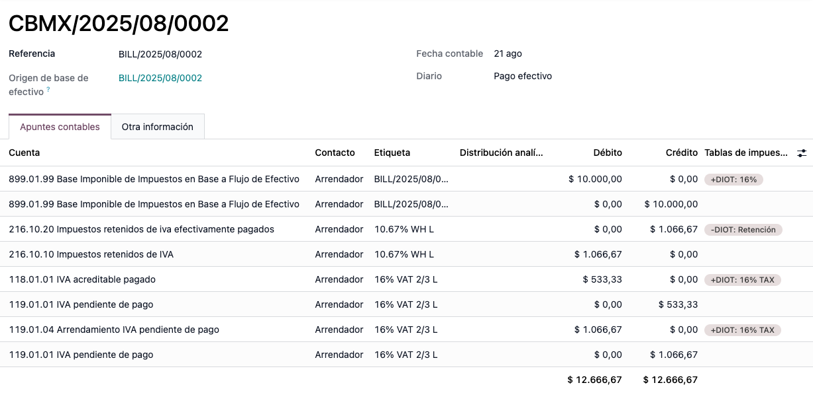

.. note::
   Withholdings |CFDI| is not currently supported. Consult with an accountant about the proper
   distribution.

Products
--------

To configure products, go to :menuselection:`Accounting --> Customers --> Products`. Open an
existing product or click :guilabel:`New`. In the :guilabel:`Accounting` tab, set the
:guilabel:`UNSPSC Product Category`. Products and categories can be set manually, or through :doc:`a
bulk import <../../essentials/export_import_data>`.

.. note::
   All products need to have a |SAT| code associated with them in order to prevent validation
   errors.

.. _l10n/mx/e-invoicing-overview:

Electronic invoicing
--------------------

.. _l10n/mx/pac:

PAC credentials
~~~~~~~~~~~~~~~

After processing the `Private Key (CSD)
<https://sat.gob.mx/portal/public/tramites/certificado-de-sello-digital>`_ with the |SAT|, register
directly with a :ref:`PAC <l10n/mx/requirements>` before creating any invoices in Odoo.

Once an account has been created with any of these providers, go to :menuselection:`Accounting -->
Configuration --> Settings` and navigate to the :guilabel:`MX Electronic invoicing` section. Under
the :guilabel:`Authorized Certification Provider (PAC)` section, enter the name of your |PAC| with
the corresponding credentials (:guilabel:`PAC username` and :guilabel:`PAC password`).

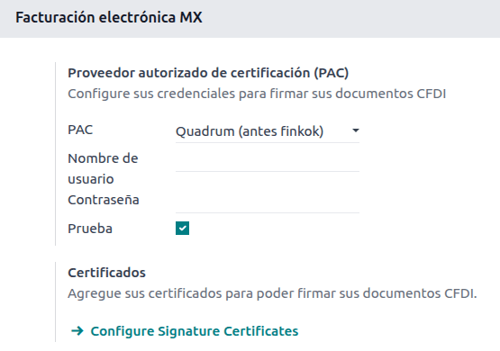

.. tip::
   To test the electronic invoicing without credentials, activate the :guilabel:`MX PAC test
   environment` checkbox, and select :guilabel:`Solucion Factible` as the :guilabel:`PAC`. It is not
   required to add a username or password for a test environment.

.. _l10n/mx/certifications:

.cer and .key certificates
~~~~~~~~~~~~~~~~~~~~~~~~~~

The `digital certificates of the company
<https://www.gob.mx/tramites/ficha/certificado-de-sello-digital/SAT139>`_ must be uploaded within
the :guilabel:`Certificates` section. To do so, navigate to :menuselection:`Settings --> General
Settings --> Certificates and Keys`.

Under :guilabel:`Manage your certificates`, click the :icon:`fa-right-arrow` :guilabel:`Keys` link
to access the :guilabel:`Keys` list view. Click :guilabel:`Create`, upload the digital
:guilabel:`Key file` (:file:`.key` file), add a :guilabel:`Name` to the key, and enter the
:guilabel:`Private key password`.

From :menuselection:`Settings --> General Settings --> Certificates and Keys`, select
:guilabel:`Certificates` to access the :guilabel:`Certificate` list view. Click :guilabel:`Create`,
upload the digital :guilabel:`Certificate` (:file:`.cer` file), add a :guilabel:`Name` to the
certificate, and select the :guilabel:`Private Key` created on the previous step from the drop-down
menu.

.. note::
   The :guilabel:`Certificate Password` and :guilabel:`Public Key` fields on :guilabel:`Certificate`
   records are optional.

.. tip::
   To test the electronic invoicing, the following |SAT| test certificates are provided and can be
   tested with either :guilabel:`Quadrum` or :guilabel:`Solución Factible` as PAC:

   - :download:`Certificate <mexico/certificate.cer>`
   - :download:`Certificate Key <mexico/certificate.key>`
   - **Password**: ``12345678a``

Accounting
==========

.. _l10n/mx/e-invoicing:

Electronic invoicing
--------------------

The invoicing process in Odoo is based on `Annex 20
<http://omawww.sat.gob.mx/tramitesyservicios/Paginas/anexo_20.htm>`_ version 4.0 of electronic
invoicing of the |SAT|.

.. _l10n/mx/invoices:

Customer invoices
~~~~~~~~~~~~~~~~~

To start invoicing from Odoo, a customer invoice must be created using the :doc:`standard invoicing
flow <../accounting/customer_invoices>`.

While the document is in draft mode, changes can be made to it, some fields take values previously
set on the sale order or the contact.

The fields that need to be reviewed are:

- :guilabel:`CFDI to public`
- :guilabel:`Usage`
- :guilabel:`Payment Policy`
- :guilabel:`Payment Method`, if :guilabel:`Payment Policy` is not set as |PPD|

.. tip::
   :guilabel:`Usage`, :guilabel:`Payment Policy` and :guilabel:`Payment Method` can be previously
   set on a sale order and/or can be set on the contact for every invoice.

The payment policy is a selectable field on the invoice and can be manually set to the required
policy, however if no policy is selected, Odoo will compute an automatic policy based on the
following general rules:

The value will be set to |PUE| if the due date in which the payment is expected is within the
current month, in case the date is outside the current month, the policy will be set to |PPD|
instead.

.. warning::
   If the payment policy is not selected and |PPD| policy is expected, either select an invoice
   :guilabel:`Due Date` on a different month than the current one, or choose :guilabel:`Payment
   terms` that imply changing the due month (i.e., :guilabel:`30 Days`, or :guilabel:`15 Days`, as
   long as they fall on the next month).

After clicking :guilabel:`Confirm` in the customer invoice, click the :guilabel:`Send` button
to process the invoice with the government. Make sure that the :guilabel:`CFDI` checkbox is marked.

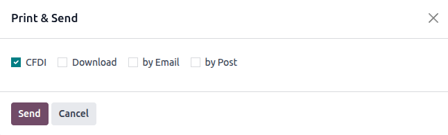

After receiving the signed document back from the government, the :guilabel:`Fiscal Folio` field
appears on the document, and the XML file appears both in the |CFDI| tab and attached in the
chatter.

If an email address is configured on the customer contact record, marking the :guilabel:`by Email`
and :guilabel:`CFDI` checkboxes sends both the XML and PDF files together.

To download the PDF file locally, click the :guilabel:`Print` button.

.. tip::
   When clicking :guilabel:`Update SAT`, the :guilabel:`SAT status` field on the invoice
   confirms if the XML file is **Validated** in the |SAT|.

   On a testing environment, the message :guilabel:`Not Found` commonly appears.

.. warning::
   Invoices with a :guilabel:`Country` different from Mexico or missing the :guilabel:`Zip` field in
   the customer form are classified as :guilabel:`CFDI to public` and addressed to a generic
   customer. The :guilabel:`CFDI to public` checkbox stays active on the invoice form until valid
   partner information is provided. Once the contact information for a national customer is
   complete, the checkbox is automatically deactivated.

.. _l10n/mx/invoices/cash-rounding:

Cash rounding
*************

In the Mexican localization, :doc:`cash rounding
<../../finance/accounting/customer_invoices/cash_rounding>` is supported using the
:guilabel:`Add a rounding line` method. This adds a rounding line that changes the paid amount, but
does not change the amount in the |CFDI|.

.. _l10n/mx/credit-notes:

Credit notes
~~~~~~~~~~~~

While an invoice is a document type "I" (Ingreso), a credit note is a document type "E" (Egreso).

An addition to the :doc:`standard flow for credit notes
<../accounting/customer_invoices/credit_notes>` is that, as a requirement of the |SAT|, there has to
be a relation between a credit note and an invoice through the fiscal folio.

Because of this requirement, the field :guilabel:`CFDI Origin` adds this relation with a `01|`,
followed by the fiscal folio of the original :abbr:`UUID (universally unique identifier)`.

When creating credit notes, make sure the line description clearly indicates its purpose and
specifies which entry applies to a bonus, discount, or refund.

.. tip::
   For the :guilabel:`CFDI Origin` field to be automatically added, use the :guilabel:`Add Credit
   Note` button from the invoice, instead of creating it manually.

Generally credit notes reverse the main sales account defined in the journal, but it is also
possible to globally assign an account to all credit notes. To do so, go to
:menuselection:`Accounting --> Configuration --> Settings` and set the :guilabel:`Credit notes`
account under the :guilabel:`Default Accounts` section.

.. note::
   On the default configuration, the credit notes account is set as :guilabel:`402.01.01 Returns,
   discounts or bonuses over sales and/or services at the general rate`.

.. tip::
   The :guilabel:`Payment Policy` can be manually forced before stamping.

.. _l10n/mx/vendor-bills:

Vendor bills
~~~~~~~~~~~~

Vendor bills must have a fiscal folio for reports and payments to work correctly. If the vendor bill
was created by the Purchase app or added manually, add the XML file of the invoice to the chatter
**as a log note**. This updates the fiscal folio accordingly. The bill **must be in draft state** for
the update to happen.

.. tip::
   When clicking :guilabel:`Update SAT`, the :guilabel:`SAT status` field on the invoice will
   confirm if the XML file is **Validated** by the |SAT|, this is also true for vendor bills.

.. seealso::
   :doc:`../accounting/vendor_bills`

.. _l10n/mx/journals:

Journals
~~~~~~~~

The module :guilabel:`EDI for Mexico (Advanced Features)` (`l10n_mx_edi_extended`) must be installed
on the database to complete the :guilabel:`Address Issued` field on the sales journal. This ensures
that all invoices from that sales journal, as well as :ref:`global invoices
<l10n/mx/global-invoice>`, use the correct ZIP code when generating the CFDI.

To invoice within a company under different time zones with the same user, create a system parameter
to ensure the correct time zone is applied when invoicing, as the user's time zone is used by
default.

To do so, enable :doc:`developer mode <../../general/developer_mode>` and go to
:menuselection:`Settings --> Technical --> System Parameters`. Click :guilabel:`New` to create a new
parameter with the key `l10n_mx_edi_tz_XX` where `XX` is the ID of the journal, and set the desired
time zone as the value, for example, “America/Tijuana”.

.. _l10n/mx/payments:

Payments
~~~~~~~~

.. _l10n/mx/payment-policy:

Payment policy
**************

One addition of the Mexican localization is the :guilabel:`Payment Policy` field. `According to the
SAT documentation <https://www.sat.gob.mx/consultas/92764/comprobante-de-recepcion-de-pagos>`_,
there are two types of payments:

- :guilabel:`PUE` (Pago en una Sola Exhibición/Payment in a Single Exhibition)
- :guilabel:`PPD` (Pago en Parcialidades o Diferido/Payment in Installments or Deferred)

.. warning::
   Payment complements are only generated if the policy of the invoice is set to |PPD|.

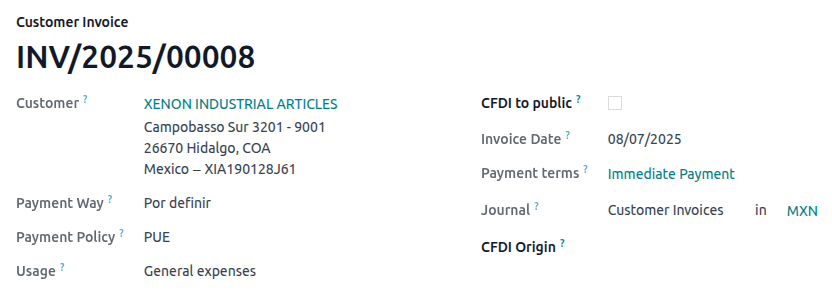

If the invoice has a due date outside the current month, it will default to |PPD|.

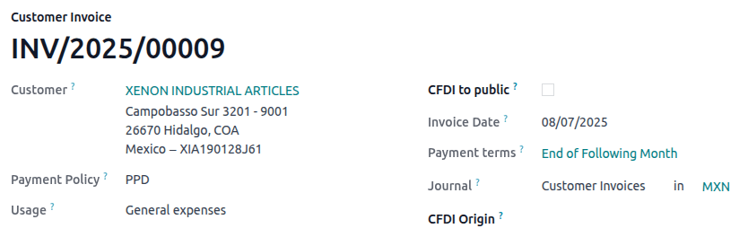

.. _l10n/mx/payment-flow:

Payment flow
************

In both cases, the payment process in Odoo :doc:`is the same <../accounting/payments>`, the main
difference being payments related to |PPD| invoices, by law, need to be sent to the government as a
document type "P" (Pago).

If a payment is related to a |PUE| invoice, it can be registered through the payment popup, and be
associated with the corresponding invoice. To do so, navigate to :menuselection:`Accounting -->
Customers --> Invoices`, and select an invoice. Then, click the :guilabel:`Pay` button to open the
payment popup, set the :guilabel:`Payment Way` and any other fields, and click :guilabel:`Create
Payment`.

.. seealso::
   - :doc:`../accounting/payments`
   - :doc:`../accounting/bank/reconciliation`

While this process is the same for PPD invoices, the addition of creating an :doc:`electronic
document <../accounting/customer_invoices/electronic_invoicing>` means some additional requirements
are needed to correctly send the document to the |SAT|.

From a legal perspective, PPD invoices **must** include the specific :guilabel:`Payment Way` that
the payment was received. Because of this, the :guilabel:`Payment Way` field **cannot** be set as
:guilabel:`To Define`, thus the field will become invisible when selecting it.

.. note::
   - If a bank account number is required, add it in the :guilabel:`Accounting` tab of a customer's
     contact record.
   - The exact configurations are in the `Anexo 20 of the SAT
     <http://omawww.sat.gob.mx/tramitesyservicios/Paginas/anexo_20.htm>`_. Usually, the
     :guilabel:`Bank Account` needs to be 10 or 18 digits for transfers, 16 for credit or debit
     cards.

If a fully-reconciled payment is related to an invoice with a :guilabel:`Fiscal Folio`, the
:guilabel:`Update Payments` appears. Click the :guilabel:`Update Payments` button to send the
**payment complement** XML file to the government automatically and display it in the |CFDI| tab in
both the invoice and the payment.

Similar to an invoice or credit note, the PDF and XML can be sent to the final customer. To do so,
click the :icon:`fa-cog` :guilabel:`(gear)` icon to open the actions drop-down menu and select
:guilabel:`Send receipt by email` from the payment view.

To download the payment PDF from the :guilabel:`CFDI` tab on the invoice, regardless of whether the
payment was created with or without reconciliation, click :guilabel:`Print`.

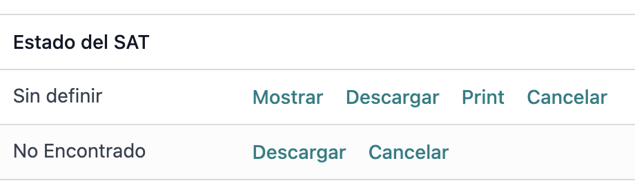

.. _l10n/mx/payment-cancellations:

Payment cancellations
*********************

To cancel :ref:`payment complements <l10n/mx/payment-flow>`, go to the :guilabel:`CFDI` tab of the
related invoice and click :guilabel:`Cancel` on the line of the payment complement.

Like with invoices, go to the payment and click :guilabel:`Update SAT` to change the
:guilabel:`SAT Status` and :guilabel:`Status` to :guilabel:`Cancelled`.

.. note::
   When substituting a payment complement, unreconcile the current payment. Then, to link the new
   payment to the original document, add `04|` followed by the fiscal folio in the :guilabel:`CFDI
   Origin` field. If the new payment is signed after the substituted document is linked, the older
   payment is cancelled.

.. _l10n/mx/factoring:

Factoring
*********

Factoring is a financial transaction in which a business sells its accounts receivable (outstanding
invoices) to a specialized financial institution, known as a *factor*, to gain immediate liquidity.

To record a payment for financial factoring, follow these steps:

#. Go to :menuselection:`Accounting --> Configuration --> Settings`, scroll down to the
   :guilabel:`Default Accounts` section and ensure a :guilabel:`Factoring account`  is selected in
   the :guilabel:`Factoring account` field.
#. From the Accounting Dashboard, click :guilabel:`Bank` on its corresponding Kanban card to
   manually :ref:`add a transaction line <accounting/transactions/register>` and record the
   factoring payment. Complete the following fields:

   - :guilabel:`Label`: Enter a brief description of the transaction.
   - :guilabel:`Partner`: Select the financial institution (factor) that will purchase the debt.
   - :guilabel:`Amount`: Enter the actual amount to be received by the factor.

   .. important::
      The currency of the factoring payment **must** match the bank journal's currency.

#. In the newly created transaction line, click the :icon:`fa-ellipsis-v` :guilabel:`(vertical
   ellipsis)` icon and select :guilabel:`Reconcile`.
#. In the :guilabel:`Search: Journal Items to Match` window, remove the :guilabel:`Partner` filter,
   select the related invoices to be paid by the factor, and click :guilabel:`Select`.

   .. note::
      Do not select the tax lines related to the invoices.

#. In the :guilabel:`Distribute Payment` window, fill in the following fields to distribute the
   payment on the selected invoices:

   - :guilabel:`Amount`: Enter the amount that will actually be received from the factor.
   - :guilabel:`Compensation`: Enter the compensation that was paid to the factor.

   .. tip::
      - The :guilabel:`Amount` and :guilabel:`Compensation` amounts are provided by the factor and
        are stated on the factoring receipt.
      - Make sure the :guilabel:`Amount` and :guilabel:`Compensation` amounts equal the
        :guilabel:`Due` amount. If it exceeds the :guilabel:`Due` amount, the line is highlighted in
        red.
      - The :guilabel:`To distribute` field should balance the :guilabel:`Amount` to the transaction
        amount entered, ensuring it equals zero.

#. Click :guilabel:`Save`.

In the :guilabel:`Bank Matching` view, the factoring payment is then reconciled with the relevant
invoices, and the factoring commission is allocated to the :guilabel:`Factoring` account set up.

To generate the XML file, go to :menuselection:`Accounting --> Customers --> Invoices`, access one
of the paid invoices, and click :guilabel:`Update Payments`.

.. note::
   - The factoring company can retain a portion of the invoice amount, referred to as aforo, until
     the end customer completes payment. The retained balance is then released to the vendor.
   - For multi-currency factoring, use the :icon:`oi-settings-adjust` (:guilabel:`adjust settings`)
     button in the :guilabel:`Distribute Payment` window and add the :guilabel:`Due (Company)`
     column to display the due amount in the company's currency.

.. _l10n/mx/invoice-cancellations:

Invoice cancellations
~~~~~~~~~~~~~~~~~~~~~

It is possible to cancel the EDI documents sent to the |SAT|. According to the `Reforma Fiscal 2022
<https://www.sat.gob.mx/consultas/91447/nuevo-esquema-de-cancelacion>`_, since January 1st, 2022,
there are two requirements for this:

- All cancellation requests require a *cancellation reason*.
- After 24 hours from the invoice creation, the client must be asked to approve the cancellation. If
  there is no response within 72 hours, the cancellation is processed automatically.

Invoice cancellations are updated automatically in Odoo, but the update can take some time. To check
the cancellation status, click :guilabel:`Update SAT`.

Invoice cancellations can be made for one of the following reasons:

- 01 - Invoice issued with errors (with related document)
- 02 - Invoice issued with errors (no replacement)
- 03 - The operation was not carried out
- 04 - Nominative operation related to the global invoice

To initiate a cancellation, go to :menuselection:`Accounting --> Customers --> Invoices`, select the
posted invoice to cancel, and click :guilabel:`Request Cancel`. Then, refer to the
:ref:`l10n/mx/01-invoice-cancellation` or :ref:`l10n/mx/02-03-04-invoice-cancellation` sections,
depending on the cancellation reason.

.. tip::
   Alternatively, request a cancellation from the :guilabel:`CFDI` tab by clicking
   :guilabel:`Cancel` on the line item.

.. note::
   - If a cancellation is requested on a locked period, the CFDI will be cancelled but not the
     accounting entry.
   - If the client rejects the cancellation, the invoice cancellation line item is removed from the
     :guilabel:`CFDI` tab.

.. _l10n/mx/01-invoice-cancellation:

Cancellation reason 01
**********************

#. In the :guilabel:`Request CFDI Cancellation` pop-up window, select :guilabel:`01 - Invoice issued
   with errors (with related document)` from the :guilabel:`Reason` field and click
   :guilabel:`Create Replacement Invoice` to create a new draft invoice. This new draft invoice
   replaces the previous invoice, along with the related |CFDI|.
#. :guilabel:`Confirm` the draft and :guilabel:`Send` the invoice.
#. The substituted invoice automatically cancels the original invoice once the new one is signed.

The invoice cancellation is then generated with a reason line item in the :guilabel:`CFDI` tab.

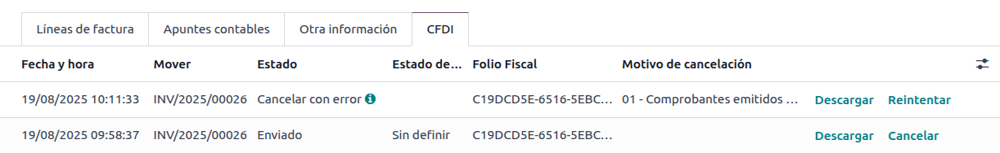

.. note::
   When using the :guilabel:`01 - Invoice issued with errors (with related document)` cancellation
   reason, the `04|` prefix appears in the :guilabel:`Fiscal Folio` field. This is an internal
   prefix used by Odoo to complete the cancellation and **does not** mean that the cancellation
   reason was :guilabel:`04 - Nominative operation related to the global invoice`.

.. _l10n/mx/02-03-04-invoice-cancellation:

Cancellation reasons 02, 03, and 04
***********************************

In the :guilabel:`Request CFDI Cancellation` pop-up window, select the desired cancellation
:guilabel:`Reason` and :guilabel:`Confirm` the cancellation.

Upon doing so, the invoice cancellation is generated with a reason line item in the :guilabel:`CFDI`
tab.

.. note::
   If the :guilabel:`SAT Status` goes back to **Validated** it could be due to one of these three
   reasons:

   - The invoice is labeled as *No Cancelable* in the `SAT Website <https://www.sat.gob.mx/home>`_.
     due to the fact that it has a valid related document: Either another invoice linked with the
     :guilabel:`CFDI Origin` field or a Payment Complement. If so, cancel any other related document
     first.
   - The cancellation request is still being processed by the |SAT|. If so, wait a few minutes and
     try again.
   - The final customer needs to reject or accept the cancellation request in their `Buzón
     Tributario <http://omawww.sat.gob.mx/BuzonTributario/Paginas/servicios_disponibles.html>`_.
     This can take up to 72 hours. If the cancellation request is rejected, repeat the process.

.. seealso::
   `Tool to validate Mexican Electronic Documents (CFDI) status
   <https://verificacfdi.facturaelectronica.sat.gob.mx/>`_

For the cancellation reasons **02**, **03** and **04**, the :guilabel:`Create Replacement Invoice`
button is replaced by a :guilabel:`Confirm` button that requests the cancellation immediately.

Both the current :guilabel:`State` and :guilabel:`Cancellation Reason` can be found in the
:guilabel:`CFDI` tab.

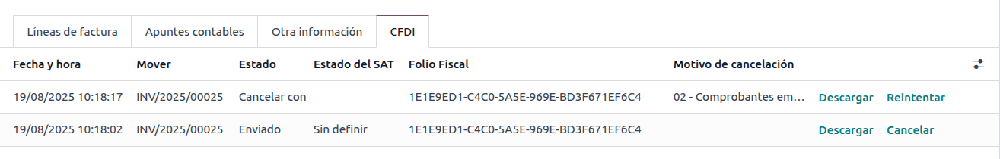

.. _l10n/mx/cancellation-acknowledgement:

Cancellation acknowledgement
****************************

To print a cancellation |PAC| response after cancelling a |CFDI|, click :guilabel:`Print` on the
corresponding cancellation line in the :guilabel:`CFDI` tab of the invoice form.

To include the current :guilabel:`SAT status` in the PDF, click :guilabel:`Update SAT` in the
invoice form. Note that when a payment is reviewed, the invoice status is updated accordingly.

.. image:: mexico/mx-invoice-cancellation-acknowledgement.png
   :alt: Cancellation acknowledgement example.

.. important::
   A cancellation acknowledgement confirms that the cancellation was requested successfully, but it
   is *not* definitive proof that the CFDI has been fully cancelled.

.. _l10n/mx/special-use-cases:

Invoicing special use cases
~~~~~~~~~~~~~~~~~~~~~~~~~~~

.. _l10n/mx/cfdi-origin:

CFDI relations
**************

To relate the current document to previously signed CFDIs, fill in the :guilabel:`CFDI Origin` field
on the invoice and specify the relation using one of the seven available values:

- 01: Nota de crédito
- 02: Nota de débito de los documentos relacionados
- 03: Devolución de mercancía sobre facturas o traslados previos
- 04: Sustitución de los CFDI previos
- 05: Traslados de mercancias facturados previamente
- 06: Factura generada por los traslados previos
- 07: CFDI por aplicación de anticipo

.. tip::
   The format is: Origin Type|UUID1, UUID2, ...., UUIDn where more than one Origin Type can be
   added.

.. example::
   Here is an example with two relations:

   .. code-block:: none

      04|042FE739-7B45-4D64-B26D-360000876D83,
      07|A164BAF8-8016-428C-A422-D9BD2F68F6A0,CEAD9433-3B77-4270-85BF-AC2519587514

   - The first section has relation type **04** with **1 UUID**
   - The second section has relation type **07** with **2 UUIDs**

Additionally any combination is also visible on the signed PDF.

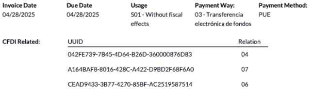

.. _l10n/mx/multicurrency:

Multicurrency
*************

The main :guilabel:`Currency` in Mexico is MXN. While this is mandatory for all Mexican companies,
it is possible to send and receive invoices (and payments) in different currencies. To enable the
use of :doc:`multicurrency <../accounting/get_started/multi_currency>`, navigate to the
:menuselection:`Accounting --> Configuration --> Currencies`, and set :guilabel:`[MX] Bank of
Mexico` as the :guilabel:`Service` in the :guilabel:`Automatic Currency Rates` section. Then, set
the :guilabel:`Interval` field to the desired frequency to update the exchange rates.

This way, the XML file of the document will have the correct exchange rate, and the total amount, in
both the foreign currency and in MXN.

It is highly recommended to use separate :doc:`bank accounts for each currency
<../accounting/bank/foreign_currency>`.

.. note::
   The only currencies that automatically update their exchange rate daily are: USD, EUR, GBP, JPY
   and CNY.

.. _l10n/mx/discounts:

Discounts
*********

By law, electronic documents sent to the government cannot have negative lines, as this can trigger
errors. Therefore, when using :doc:`Gift Cards
<../../sales/sales/products_prices/ewallets_giftcards>` or :doc:`Loyalty Programs
<../../sales/sales/products_prices/loyalty_discount>`, the subsequent negative lines will be
translated in the XML as if they were regular :doc:`Discounts
<../../sales/sales/products_prices/prices/pricing/>`.

In order to set this up, navigate to :menuselection:`Sales --> Products --> Products` and create a
product `Discounts`, make sure that it has a valid :guilabel:`Tax` (usually :guilabel:`IVA` at
`16%`).

After this, create and sign the invoice via |CFDI|, and add the `Discounts` product at the bottom.
In the XML, Odoo will distribute the discount between the lines evenly, while any math differences
will be added in a rounding product.

.. tip::
   A `Discount` and `UNSPSC Product Category` for each product variant related to :guilabel:`Gift
   Cards` or :guilabel:`Loyalty Programs` have to be created.

.. _l10n/mx/down-payments:

Down payments
*************

A common practice in Mexico is the usage of :doc:`down payments
<../../sales/sales/invoicing/down_payment>`. They are primarily used when a payment is received for
a good or service whose product, price, or both have not been fully determined.

The |SAT| allows two different ways to handle this process: both of them involve linking all
invoices to each other with the :guilabel:`CFDI Origin` field.

.. note::
   For this process, the :doc:`Sales <../../sales>` app must be installed.

.. seealso::
   `The official documentation for registration of down payments in Mexico
   <http://omawww.sat.gob.mx/tramitesyservicios/Paginas/documentos/GuiaAnexo311221.pdf>`_.

Configuration
^^^^^^^^^^^^^

First, navigate to :menuselection:`Sales --> Products --> Products` to create a product `Anticipo`
and configure it. The :guilabel:`Product Type` must be :guilabel:`Service`, and use the
:guilabel:`UNSPSC Category` :guilabel:`84111506 Servicios de facturación`.

Then, go to :menuselection:`Sales --> Settings --> Invoicing --> Down Payments`, and add the
*Anticipo* product as the default.

.. _l10n-mx/down-payment-method-a:

Method A
^^^^^^^^

This method consists of creating a down payment invoice, creating an invoice for the total amount,
and finally, creating a credit note for the total of the down payment.

First, create a sales order with the total amount, and create a down payment from it (either using a
percentage or fixed amount). Then, sign the document via CFDI, and register the payment.

When the time comes for the customer to get the final invoice, create it again from the same sales
order. In the :guilabel:`Create Invoice` popup, select :guilabel:`Regular Invoice`. Make sure to
delete the line that contains the product *Anticipo*.

.. tip::
   When using down payments with the Mexican localization, make sure that the :guilabel:`Invoicing
   Policy` of the products are :guilabel:`Ordered quantities`. Otherwise a customer credit note will
   be created.

Then, copy the :guilabel:`Fiscal Folio` from the down payment invoice, and paste it into the
:guilabel:`CFDI Origin` field of the final invoice. Add the prefix `07|` before the value and sign
the document via |CFDI|.

Finally, create a credit note for the first invoice. Copy the :guilabel:`Fiscal Folio` from the
final invoice, and paste it in the :guilabel:`CFDI Origin` of the credit note, adding the prefix
`07|`. Then, sign the document via |CFDI|.

With this, all electronic documents are linked to each other. The final step is to fully pay the new
invoice. At the bottom of the new invoice, the credit note appears in the
:guilabel:`Outstanding credits`; add it as payment. Finally, register the remaining amount with the
:guilabel:`Pay` popup.

In the sales order, all three documents should appear as "In Payment".

Method B
^^^^^^^^

Another, simpler way to fulfill |SAT| requirements involves creating only the down payment invoice,
and a second invoice for the remnant. This method involves the fact that negative lines are treated
as discounts.

For this, follow the same process as :ref:`Method A <l10n-mx/down-payment-method-a>`, up until the
creation of the final invoice. Do not delete the line that contains the *Anticipo* and instead
rename the other products :guilabel:`Description` to include the text `CFDI por remanente de un
anticipo`. Add the :guilabel:`Fiscal Folio` of the down payment invoice in the
:guilabel:`CFDI Origin` field of the final invoice, adding the prefix `07|`.

Finally, sign the final invoice via |CFDI|.

.. _l10n/mx/addendas-and-complements:

Addendas and complements
************************

An addenda is a code addition to an invoice XML file that provides extra information beyond legal
requirements. It is added after the invoice has been signed. A complement is a fiscal addition that
reports specific fiscal operations and is added before the invoice is signed. Only a limited number
of complements are available, and some are already included in Odoo. See the `SAT complement
documentation <https://www.sat.gob.mx/portal/public/tramites/complementos-de-factura>`_ for more
information.

Addendas and complements can be included in the XML. To add one, go to
:menuselection:`Accounting --> Configuration --> Addendas & Complementos (MX)` and click
:guilabel:`New` to enter the code to be injected. Additional fields beyond standard Odoo may be
required.

.. warning::
   This section might require technical knowledge and may risk adding technical debt; it is
   recommended to ask your account manager for the best technical advice.

Once the desired nodes are created, they can be selected on each contact to make them appear on
every invoice addressed to that contact. By default, all the selected nodes will be added
automatically on every invoice.

It is also possible to just select the nodes as needed on every invoice by selecting the
:guilabel:`Other info` tab and then selecting the desired nodes from :guilabel:`Addendas &
Complementos`

.. tip::
   It is possible to add more than one per contact or per invoice.

.. _l10n/mx/xml-reader:

XML reader
**********

On certain occasions, such as when creating invoices in another software or in the |SAT| directly,
it is possible to upload invoices to Odoo. The XML Reader can retrieve the data from an XML file.
To do this, navigate to :menuselection:`Accounting --> Customers --> Invoices` and, in the list
view, click :guilabel:`Upload` to select any number of XML files. Draft invoices are automatically
created. This can also work by dragging files from a local storage and dropping them in the view.

The draft invoices will retrieve the :guilabel:`Customer information` (if it doesn't exist, new ones
will be created), the :guilabel:`Product Lines` (only if products with the same name already exist)
and will calculate all taxes and additional fields exclusive to the Mexican Localization. The import
information will appear in the chatter.

.. warning::
   Depending on where the invoice was created, XML files could have different values from the total
   calculated in Odoo. **Always** double-check any document uploaded this way.

:guilabel:`Customer Invoices` created this way can create **payment complements** and can be
canceled at any time. If the :guilabel:`Print` option is used, the PDF document includes all the
corresponding information.

This can be done for :guilabel:`Vendor Bills` too.

.. tip::
   To retrieve the :guilabel:`Fiscal Folio`, drag and drop XML files as a log note in the chatter
   for previously created draft invoices.

.. _l10n/mx/cfdi:

CFDI to public
**************

The Mexican government requires that any goods or services that are sold must be backed up by an
invoice. If the customer does not require an invoice or has no |RFC|, a *CFDI to Public* has to be
created also known as a "nominative" invoice.

A contact must be created and it must have a particular name.

If the :guilabel:`CFDI to Public` checkbox in either a sales order or an invoice is checked, the
final XML will override the data in the invoice contact and will add the following characteristics:

- |RFC|: **XAXX010101000** if it is a national customer or **XEXX010101000** if it is a foreign
  customer
- :guilabel:`ZIP` code: The same code of the company
- :guilabel:`Usage`: S01 - Without Fiscal Effects

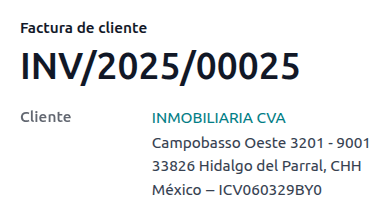

If the final customer doesn't share any details, create a generic :guilabel:`Customer`. The name
cannot be `PUBLICO EN GENERAL` or an error will be triggered (it can be, for example, `CLIENTE
FINAL`).

.. warning::
   By default, sending the invoice is not allowed if the partner does not have either the *Country*
   or *ZIP code* set. However, this is not required if the :guilabel:`CFDI to public` checkbox is
   active.

.. seealso::
   `Regla 2.7.1.21 Expedición de comprobantes en operaciones con el público en general
   <https://www.sat.gob.mx/articulo/90959/regla-2.7.1.21>`_.

.. _l10n/mx/global-invoice:

Global invoice
**************

If by the end of a certain period of time (that can vary from daily to bimonthly, depending on the
company's legal needs and preferences) and the customer still has sales that weren't marked as
regular invoices or individual *CFDI to Public* invoices, the |SAT| allows for the creation of a
single invoice that can contain all operations, known as a *global invoice*.

.. note::
   For this process, the :doc:`Sales <../../sales/sales>` app must be installed.

.. seealso::
   `Guía de llenado del CFDI global
   <http://omawww.sat.gob.mx/tramitesyservicios/Paginas/documentos/GuiallenadoCFDIglobal311221.pdf>`_

Setup
^^^^^

The :guilabel:`Global Invoice Serie` is specific to each branch or company and is used to define the
sequence of global invoices. To configure it, go to :menuselection:`Accounting --> Configuration -->
Settings`, and navigate to the :guilabel:`MX Electronic invoicing` section. The :guilabel:`Global
Invoice Serie` field can be found within the :guilabel:`Service Tax Administration (SAT)` section.

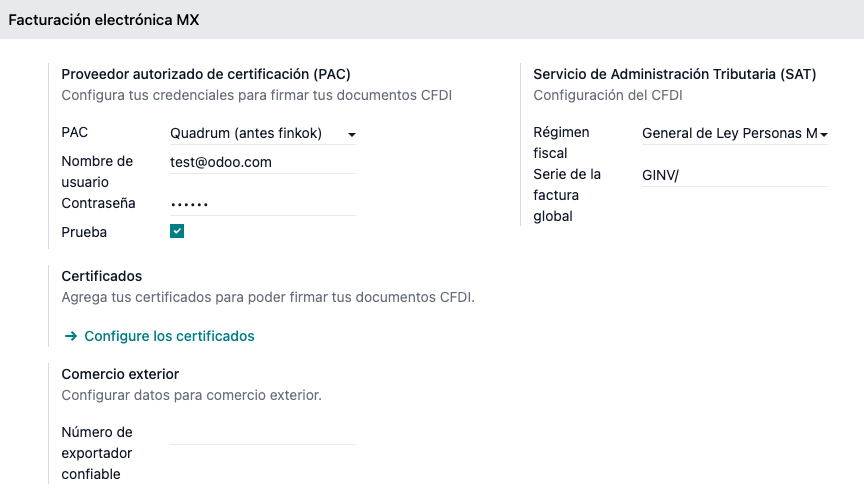

.. tip::
   The default sequence for every company/branch is `GINV/`

Sales flow
^^^^^^^^^^

First, create a dedicated journal in :menuselection:`Accounting --> Configuration --> Journals` to
maintain a separate sequence that is used for global invoices, which function as orders when they
are created.

Then, make sure that all the sales orders that need to be signed have the following configurations:

- :guilabel:`CFDI to Public` checkbox enabled
- :guilabel:`Invoice Status` marked as :guilabel:`To Invoice`

After this, go to :menuselection:`Sales --> To Invoice --> Orders to Invoice`, select all relevant
sales orders and press :guilabel:`Create Invoices`. Make sure to disable the :guilabel:`Consolidated
Billing` checkbox and click :guilabel:`Create Draft Invoice`.

In the list of draft invoices displayed, select all, click :icon:`fa-gear` :guilabel:`Actions`, and
select :guilabel:`Confirm entries`. Then, select all posted invoices again and return to the
:icon:`fa-gear` :guilabel:`Actions` drop-down menu to select :guilabel:`Create Global Invoice`.

In the :guilabel:`Create Global Invoice` window, select the :guilabel:`Periodicity` recommended by
an accountant and use the :guilabel:`Date` field to specify the period to be invoiced. Then, click
:guilabel:`Create`. Verify all invoices are signed under the same XML file and share the same
:guilabel:`Fiscal Folio`.

.. note::
   - The selected :guilabel:`Date` is used only to extract the *month* and *year* for the XML. For
     bimonthly periodicity, the month determines the period declared as follows:

     - Months 1-12: Standard month number (January = 1, February = 2, etc.)
     - January - February -> 13
     - March - April -> 14
     - May - June -> 15
     - July - August -> 16
     - September - October -> 17
     - November - December -> 18

   - Global invoices created this way won't include a **PDF** attachment, as their information is
     already in Odoo and isn't meant to be seen by customers.

.. example::
   - Selecting the date 01/12/2026 with monthly periodicity declares month 12 and year 2026.
   - Selecting the date 01/12/2026 with bimonthly periodicity declares month 18 and year 2026.
   - Selecting the date 01/12/2026 with daily periodicity declares month 12 and year 2026.

.. tip::
   - Click :guilabel:`Show` in the :guilabel:`CFDI` tab to display a list with all related invoices.
   - Click :guilabel:`Cancel` in the :guilabel:`CFDI` tab to cancel the global invoice in both the
     |SAT| and Odoo.

.. _l10n/mx/reporting:

Electronic accounting reports
-----------------------------

For Mexico, `Electronic Accounting
<https://www.sat.gob.mx/aplicacion/42150/envia-tu-contabilidad-electronica>`_ refers to the
obligation to keep accounting records and entries through electronic means, and to enter accounting
information on a monthly basis, through the |SAT| website.

It consists of three main XML files:

#. The updated list of the chart of accounts that is currently in use
#. A monthly trial balance, plus a closing entry report, also known as: *Trial Balance Month 13*
#. An export of the journal entries in the general ledger (optional except in the case of a
   compulsory audit)

The resulting XML files follow the requirements of the `Anexo Técnico de Contabilidad Electrónica
1.3 <https://www.gob.mx/cms/uploads/attachment/file/151135/Anexo24_05012015.pdf>`_.

In addition to this, it is possible to generate the `DIOT
<https://www.sat.gob.mx/declaracion/74295/presenta-tu-declaracion-informativa-de-operaciones-con-
terceros-(diot)->`_: a report of vendors' journal entries that involve IVA taxes that can be
exported in a TXT file.

.. note::
   To use these reports, the following modules must be installed:

   - :guilabel:`Odoo Mexican Localization Reports` (`l10n_mx_reports`)
   - :guilabel:`Mexico - Month 13 Trial Balance` (`l10n_mx_reports_closing`)
   - :guilabel:`Odoo Mexican XML Polizas Export` (`l10n_mx_xml_polizas`)

The *chart of accounts* and the *Trial Balance Month 13* reports can be found in
:menuselection:`Accounting --> Reporting --> Trial Balance`. The *DIOT* report can be found in
:menuselection:`Accounting --> Reporting --> Tax Report`.

.. important::
   The specific characteristics and obligations of the reports required to be sent might change
   depending on the fiscal regime. Always contact an accountant before sending any documents to
   the government.

.. _l10n_mx/chart-of-accounts:

Chart of accounts
~~~~~~~~~~~~~~~~~

The :doc:`chart of accounts <../accounting/get_started/chart_of_accounts>` in Mexico follows a
specific pattern based on the |SAT| documentation `Código agrupador de cuentas
<http://omawww.sat.gob.mx/fichas_tematicas/buzon_tributario/Documents/codigo_agrupador.pdf>`_.

It is possible to create any account, as long as it respects |SAT|'s encoding group: the pattern is
`NNN.XX.YY`, `NNN.XX.YYY` or `NNN.XX.YYY.ZZ`.

.. example::
   Some examples are `102.01.99`, `401.01.001` or `401.01.001.16`.

When a new account is created in :menuselection:`Accounting --> Configuration --> Chart of
Accounts`, the structure is validated.

Once all accounts are created, make sure the correct :guilabel:`Tags` are added as these mark the
nature of the account.

Due to the account hierarchy on parent accounts, set the appropriate :guilabel:`Parent Account` on
each account to create a hierarchy for reports. Accounts without a parent are level 1 accounts;
accounts below them are level 2, and so on.

.. note::
   - Active accounts must be longer than five digits, or they trigger errors in the report. By
     default, Odoo marks accounts in yellow if the numbering could cause issues later on.
   - If an account is shorter than five characters, mark it as inactive so validations do not apply
     to it.
   - Accounts shorter than three characters are not reported in XML reports. This is useful to
     classify accounts.
   - As a good practice, only keep last-level accounts active and keep all parent accounts inactive.
     This prevents accounting errors, while parent accounts still appear in reports.

Once everything is set up, go to :menuselection:`Accounting --> Reporting --> Trial Balance`, and
click the :guilabel:`COA SAT (XML)` button to generate an XML file containing all of the accounts.
This XML file is ready to upload to the |SAT| website.

.. _l10n/mx/trial-balance:

Trial balance
~~~~~~~~~~~~~

The trial balance reports the initial balance, credits, and total balances of the accounts, provided
that their :ref:`numbering <l10n_mx/chart-of-accounts>` is correct.

To generate an XML file of the trial balance, go to :menuselection:`Accounting --> Reporting -->
Trial Balance` and select the date. Click the :icon:`fa-cog` :guilabel:`(gear)` icon and select
:guilabel:`SAT (XML)`. Then, select the appropriate :guilabel:`Submit Type` from the
:guilabel:`Export SAT` window, depending on whether the trial balance is :guilabel:`Normal` or
:guilabel:`Supplementary`.

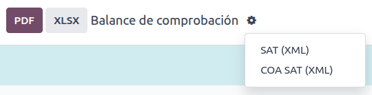

.. _l10n/mx/month-13:

Month 13
********

An additional report is the *Month 13*: a closing balance sheet that shows any adjustments or
movements made in the accounting to close the year.

To generate this XML document, navigate to :menuselection:`Accounting --> Accounting --> Journal
Entries`, and create a new document. Here, add all amounts to modify, and balance the debit and/or
credit of each one.

After this is done, go to the :guilabel:`Other Info` tab and check the :guilabel:`Month 13 Closing`
field. If needed, go to :menuselection:`Accounting --> Reporting --> Trial Balance` and select the
date :guilabel:`Month 13`, where it is possible to see the total amount of the year, plus all the
additions of the journal entry. To generate the XML file, click the :icon:`fa-cog`
:guilabel:`(action menu)`, then select :guilabel:`SAT (XML)`.

.. _l10n/mx/general-ledger:

General ledger
~~~~~~~~~~~~~~

By law, all transactions in Mexico must be recorded digitally. Since Odoo automatically creates all
the underlying journal entries of all invoices and payments, simply exporting the general ledger
complies with |SAT|'s audits and/or tax refunds.

.. tip::
   The report can be filtered by period or by journal, depending on the need.

To create the XML, go to :menuselection:`Accounting --> Reporting --> General Ledger`, click
:icon:`fa-cog` :guilabel:`(action menu)`, then click :guilabel:`XML (Polizas)`. Then, select among
four :guilabel:`Export` types:

- :guilabel:`Tax audit`
- :guilabel:`Audit certification`
- :guilabel:`Return of goods`
- :guilabel:`Compensation`

For :guilabel:`Tax audit` or :guilabel:`Audit certification`, add the :guilabel:`Order Number`
provided by the |SAT|. For :guilabel:`Return of goods` or :guilabel:`Compensation`, add the
:guilabel:`Process Number`, also provided by the |SAT|.

.. note::
   To see this report without sending it, use `ABC6987654/99` for the :guilabel:`Order Number` or
   `AB123451234512` for the :guilabel:`Process Number`.

.. _l10n/mx/diot:

DIOT report
~~~~~~~~~~~

The DIOT (Declaración Informativa de Operaciones con Terceros / *Informative Declaration of
Operations with Third Parties*) is an additional obligation with the |SAT|, where the current status
of creditable and non-creditable payments, withholdings, import taxes, and refunds of VAT from the
vendor bills are provided to the |SAT|.

Unlike other reports, the |DIOT| is uploaded to a website provided by the |SAT| that contains the
A-29 form. In Odoo, it is possible to download the records of all transactions as a TXT file with 54
columns. This file can be uploaded to the form, reducing the data that is manually added.

The transactions file contains the total amount of the payments registered in vendor bills, broken
down into the corresponding types of IVA. The :guilabel:`VAT`, :guilabel:`Country` and
:guilabel:`Type of operation` fields are mandatory for all vendors.

To download the |DIOT| report as a TXT file, go to :menuselection:`Accounting --> Reports --> Tax
Return`. Select the desired month, click :icon:`fa-cog` :guilabel:`(action menu)`, and select
:guilabel:`DIOT (TXT)`.

In case new taxes are created in the database, there are two types of tags. Tags containing **tax**
must go into the tax distribution, and the ones with the base name go on the base of the tax. All
lines of a VAT tax **must** contain at least one tax grid.

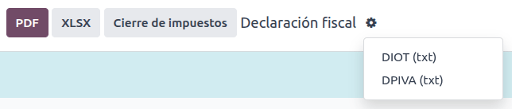

.. important::
   It is required to fill in the :guilabel:`Type of Operation` field in the :guilabel:`Accounting`
   tab of each vendor to prevent validation errors. Make sure that foreign customers have their
   :guilabel:`Country` set.

   .. image:: mexico/mx-reports-diot-contact.png
      :alt: DIOT information on a vendor contact.

   Selecting :guilabel:`87 - Global Operations` will cause the final TXT file to merge all vendors
   that are part of the global operations under one generic VAT: *XAXX010101000*.

.. _l10n/mx/accounting-reports:

Accounting reports
------------------

Two Mexican-specific reports are the :ref:`Balance Sheet <l10n/mx/balance-sheet>` and the
:ref:`Profit and Loss <l10n/mx/profit-loss>`.

.. _l10n/mx/balance-sheet:

Balance Sheet
~~~~~~~~~~~~~

The report is based on NIF B-6 and is divided into assets, liabilities, and equity, which reflect
the current financial state of the company.

.. _l10n/mx/profit-loss:

Profit and Loss
~~~~~~~~~~~~~~~

The report is based on NIF B-3 and is divided into income, operating expenses, comprehensive
financial results (RIF), and taxes, which help identify the net profit or financial position of a
company.

.. _l10n/mx/external-trade:

External trade
--------------

The external trade is a complement to a regular invoice that adds certain values in both the XML and
PDF, to invoices with a foreign customer according to `SAT regulations
<http://omawww.sat.gob.mx/tramitesyservicios/Paginas/complemento_comercio_exterior.htm>`_, such as:

- The specific address of the receiver and the sender
- The addition of a :guilabel:`Tariff Fraction` that identifies the type of product
- The correct :doc:`../accounting/customer_invoices/incoterms` (International Commercial Terms)
- And more, such as the *certificate of origin* and *special units of measure*

This allows the correct identification of exporters and importers, in addition to expanding the
description of the merchandise sold.

Since January 1, 2018, external trade is a requirement for taxpayers who carry export operations of
type A1. While the current CFDI is 4.0, the external trade is currently on version 2.0.

.. note::
   In order to use this feature, the :guilabel:`EDI for Mexico (Advanced Features)`
   `l10n_mx_edi_extended` module must be installed.

.. important::
   Before installing, make sure your business needs to use this feature. Consult an accountant
   first, if needed, before installing any modules.

   The :guilabel:`CFDI to public` checkbox must be ticked when creating foreign invoices.

Configuration
~~~~~~~~~~~~~

Contacts
********

To configure your company contact for external trade, navigate to :menuselection:`Accounting -->
Customers --> Customers`, remove the default :guilabel:`Customer Invoices` filter, and select your
:guilabel:`Company` name. While the CFDI 4.0 requirements require adding a valid :guilabel:`ZIP`
code in the company contact record, the external trade complement adds the requirement that the
:guilabel:`City` and the :guilabel:`State` must also be valid. All three fields must coincide with
the `Official SAT Catalog for Carta Porte
<http://omawww.sat.gob.mx/tramitesyservicios/Paginas/catalogos_emision_cfdi_complemento_ce.htm>`_,
or it will produce an error.

.. warning::
   Add the :guilabel:`City` and :guilabel:`State` in the company's *contact record*, not in the
   company record itself.

On the contact record, the optional fields :guilabel:`Locality` and :guilabel:`Colony Code` can also
be filled. These two fields also have to coincide with the data in the |SAT|.

To configure the contact data for a foreign receiving client, navigate to :menuselection:`Accounting
--> Customers --> Customers`, and select the foreign client's contact. The contact must have the
following fields completed to avoid errors:

#. The entire company :guilabel:`Address`, including a valid :guilabel:`ZIP` code and the foreign
   :guilabel:`Country`.
#. The foreign :guilabel:`RFC` (tax identification number), in the correct format (for example:
   Colombia `123456789-1`)
#. In the :guilabel:`Sales & Purchase` tab, to activate the :guilabel:`Needs external trade?`
   checkbox.

.. note::
   In the resulting XML and PDF files, the :guilabel:`VAT` is automatically replaced by the generic
   VAT for abroad transactions: `XEXX010101000`.

Products
********

All products involved with external trade have four additional fields that are required, two of
which are exclusive to external trade.

#. The :guilabel:`Reference` of the product must be set in the :guilabel:`General Information` tab.
#. The :guilabel:`Weight` of the product in the :guilabel:`Inventory` tab must be more than `0`.
#. The :guilabel:`Tariff Fraction` of the product must be set in the :guilabel:`Accounting` tab for
   external trade. Use the `VUCEM tariff fraction classifier
   <https://www.ventanillaunica.gob.mx/vucem/Clasificador.html>`_ to find the correct value.
#. The :guilabel:`UMT Aduana` in the :guilabel:`Accounting` tab must be set and correspond to the
   :guilabel:`Tariff Fraction` for external trade.

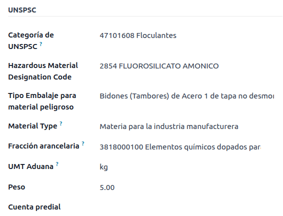

.. tip::
   - If the UoM code of the :guilabel:`Tariff Fraction` is `01`, the correct :guilabel:`UMT Aduana`
     is `kg`.
   - If the UoM code of the :guilabel:`Tariff Fraction` is `06`, the correct :guilabel:`UMT Aduana`
     is `Units`.

Invoicing flow
~~~~~~~~~~~~~~

Before creating an invoice, it is important to take into account that external trade invoices
require converting product prices into a foreign currency such as USD. Therefore,
:doc:`multicurrency <../accounting/get_started/multi_currency>` **must** be enabled with the foreign
currency activated in the :guilabel:`Currencies` section. The correct :guilabel:`Service` to run is
:guilabel:`[MX] Bank of Mexico`. To convert product prices, create a :doc:`pricelist
<../../sales/sales/products_prices/prices/pricing>` in the foreign currency.

Then, with the correct exchange rate set up in :menuselection:`Accounting --> Settings -->
Currency`, set the :guilabel:`Incoterm` and the optional :guilabel:`Certificate Source` fields in
the invoice's :guilabel:`Other Info` tab.

.. tip::
   While not mandatory, the information will be more complete if :guilabel:`CFDI to public` is also
   active.

Finally, confirm the invoice with the same process as a regular invoice, and click the
:guilabel:`Send` button to sign it via CFDI.

.. _l10n/mx/external-trade-services:

Invoicing services
~~~~~~~~~~~~~~~~~~

Services and merchandise can be invoiced together on the same invoice if the service is set up
correctly. To do so, follow these steps:

#. Go to :menuselection:`Accounting --> Customers --> Products` and access the relevant service
   form.
#. In the :guilabel:`Accounting` tab, under the :guilabel:`UNSPSC` section, find the :guilabel:`UMT
   Aduana` field and click the :icon:`oi-arrow-right` :guilabel:`(right arrow)`.
#. Verify that either the :guilabel:`UNSPSC Category` is selected to :guilabel:`E48 service unit` or
   the :guilabel:`Customs code` is set as `99`.

Invoicing with either of these codes sets the service price to 0 for customs declarations.

.. _l10n/mx/pos:

Point of sale
=============

The :doc:`Point of sale <../../sales/point_of_sale>` adaptation of the Mexican Localization enables
the creation of invoices that comply with the |SAT| requirements directly from the **POS register**,
with the added benefit of creating receipt tickets that allow *self-invoicing* in a special portal
and creating global invoices.

.. _l10n/mx/pos/flow:

Point of sale flow
------------------

On top of the standard :ref:`Point of Sale configuration <pos/use/settings>`, the Mexican
localization requires each payment method to be configured with a correct :guilabel:`Payment Way`
as well as a :guilabel:`Re-invoicing account` to handle the accounting for invoices with the
invoicing portal.

.. tip::
   By default, Odoo creates pre-configured payment methods for cash, credit card, and debit card and
   assigns the :guilabel:`402.04.01 Re-invoicing` account as default for re-invoicing.

While selling on the **Point of Sale**, click the :guilabel:`Customer` button to either create or
select a customer. Here it is possible to review customer invoicing information (such as the |RFC|
or :guilabel:`Fiscal Regime`) and even modify it directly inside the session.

After selecting a customer, tick the :icon:`fa-file-text-o` :guilabel:`Invoice` checkbox. This opens
a menu to select the :guilabel:`Usage` and to define if it is an invoice to the public. Click
confirm, select the payment method, and then click validate to complete the order. The PDF is then
downloaded and it is possible to send the invoice via mail to the final customer alongside the
receipt.

.. tip::
   To create invoices from orders, go to the :guilabel:`Orders` menu, select the order, click
   :guilabel:`Load Order`, and tick the :icon:`fa-file-text-o` :guilabel:`Invoice` checkbox. This
   opens the same menu for the :guilabel:`Usage` and :guilabel:`CFDI to Public`.

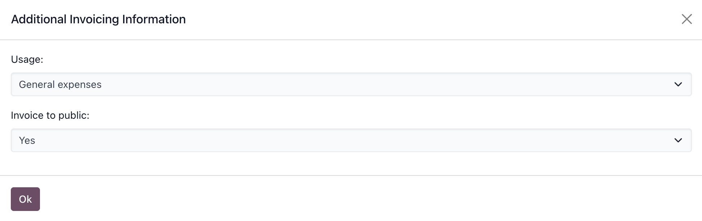

To sign a credit note automatically, tick the :icon:`fa-file-text-o` :guilabel:`Invoice` checkbox
when processing a :ref:`refund <pos/use/refund>`.

.. note::
   Credit notes for returned products will contain the relation type :guilabel:`03 - Devolución de
   mercancía sobre facturas o traslados previos`.

.. important::
   - In the Mexican localization, positive and negative lines in a **POS** session cannot be mixed.

   - If a |SAT| validation error occurs, the customer receives a :doc:`Pro-Forma invoice
     <../../sales/sales/invoicing/proforma>` instead.

.. _l10n/mx/pos/portal:

Self-invoicing portal
---------------------

If the final customer is not sure if they want to have their invoice generated at the exact moment
of the sale, it is possible to give them the option of creating a receipt with either a QR code or a
URL. To do so, follow these steps:

#. Go to :menuselection:`Point of Sale --> Configuration`.
#. Select the :guilabel:`Point of Sale`.
#. Scroll to the :guilabel:`Bills & Receipts` section.
#. Enable :guilabel:`Self-service invoicing`.
#. Set the :guilabel:`Print` field to :guilabel:`QR code`, :guilabel:`URL`, or :guilabel:`QR code +
   URL`.

Customers who scan this QR code or follow the URL access a menu where they can add their fiscal
information, including :guilabel: Usage` and :guilabel:`Fiscal Regime`.

On the journal entries of the session, the previously selected **Re-invoicing account** will be used
to handle reversals of the sales entries when invoices are requested as well as be used as a sales
account for the new invoices.

.. seealso::
   :ref:`refund <pos/use/refund>`

.. _l10n/mx/pos/global-invoice:

Global invoice
--------------

As with regular sales orders, global invoices can also be created from the POS register.

For this, make sure not to select a customer or the invoice option in the payment menu and go to
:menuselection:`Point of Sale --> Orders --> Orders`. There, select all the orders to invoice, click
:icon:`fa-cog` :guilabel:`Actions` and select :guilabel:`Create Global Invoice`.

Like with sales orders, choose the correct :guilabel:`Periodicity` and press :guilabel:`Create`.

This attaches an XML file to each of the selected orders. The XML files can be downloaded by going
to the :guilabel:`CFDI` tab. If needed, it is possible to cancel the invoice from the same tab.

If eventually any of the orders that are part of the global invoice need to be addressed to a
customer, it is still possible to send an invoice by opening the POS register, clicking the
:icon:`fa-bars` :guilabel:`(drop-down menu)`, then click :guilabel:`Orders`. Change the
:guilabel:`All active orders` filter to :guilabel:`Paid`, select the order, and click the
:icon:`fa-file-text-o` :guilabel:`Invoice` button.

.. note::
   Global invoices, just as regular invoices, can only be grouped by physical address. That is
   determined by the address set on the POS invoice journal, so when attempting to invoice two
   addresses a warning will come up to warn the user of the error.

.. seealso::
   For cash rounding, consider the configuration in the :ref:`Cash rounding
   <l10n/mx/invoices/cash-rounding>` section.

.. _l10n/mx/ecommerce:

eCommerce
=========

The eCommerce adaptation of the Mexican Localization provides an extra step to create invoices that
comply with the |SAT| requirements on :doc:`eCommerce <../../websites/ecommerce>` by retrieving the
customer data after the **Checkout** and even allowing for the signature of **automatic invoices**
after the payment is processed, as well as sending customers the files via email and granting them
access to retrieve their PDF file from their own customer portal.

.. _l10n/mx/ecommerce/flow:

eCommerce flow
--------------

During the regular checkout process, a new :guilabel:`Invoicing Info` step appears, where it is
possible to request an invoice or not. If :guilabel:`No` is selected, a **CFDI to Public** is
created. If :guilabel:`Yes` is selected, the :guilabel:`RFC`, :guilabel:`Fiscal Regime`, and
:guilabel:`Usage` are required in order to get all information in the sales order, where its status
will change to :guilabel:`To Invoice`.

Additionally the customer can decide whether or not to request :ref:`IEPS Breakdown
<l10n/mx/ieps-breakdown>`.

.. important::
   Make sure to add a :guilabel:`UNSPSC code` to the :ref:`shipping product
   <ecommerce/checkout/delivery>`.

If the :guilabel:`Automatic Invoicing` is enabled in :menuselection:`Settings --> Website -->
Invoicing`, the electronic document will be signed automatically.

.. _l10n/mx/sales:

Sales
=====

The **Sales** app contains fields that make invoicing easier, while the fields themselves do not
change the sales behavior, they are directly copied when creating an invoice.

The copied fields are:

- :guilabel:`Payment Way`
- :guilabel:`Payment Policy`
- :guilabel:`CFDI to public`
- :guilabel:`Usage`

Additionally, it is possible to get a preview of the invoice for validation purposes with the
customer by installing the :doc:`pro-forma module <../../sales/sales/invoicing/proforma>`. This
module adds the mentioned fields to the sale order as well as:

- :guilabel:`Product code`
- :guilabel:`Unit code`
- :guilabel:`Fiscal regime`

.. _l10n/mx/subscriptions:

Subscriptions
=============

While handling subscriptions, all the sales fields are used to create the recurrent invoices. These
are automatically signed and sent via email with the PDF and XML attached with no additional manual
actions required.

.. important::
   All invoices generated by the subscription app will always be automatically signed with no
   exceptions.

.. _l10n/mx/inventory:

Inventory
=========

.. _l10n/mx/inventory/customs:

Customs numbers
---------------

A *customs declaration* (Pedimento Aduanero) is a fiscal document that certifies that all
contributions to the fiscal entity (the |SAT|) have been paid for, including the import/export of
goods.

According to the `Annex 20 <http://omawww.sat.gob.mx/tramitesyservicios/Paginas/anexo_20.htm>`_ of
CFDI 4.0, in documents where the invoiced goods come from a first-hand import operation, the
:guilabel:`Customs Number` field needs to be added to all lines of products involved with the
operation, as does the date of the document.

.. note::
   To do so, the :guilabel:`Odoo Mexico Localization for Stock/Landing` `l10n_mx_edi_landing` module
   must be installed, in addition to the :doc:`Inventory <../../inventory_and_mrp/inventory>`,
   :doc:`Purchase <../../inventory_and_mrp/purchase>`, and :doc:`Sales <../../sales/sales>` apps.

.. important::
   Do not confuse this feature with external trade. The customs numbers are directly related to
   importing goods, while the external trade complement is related to exporting. Consult an
   accountant first if this feature is needed before doing any modifications.

Configuration
~~~~~~~~~~~~~

In order to track the correct customs number for a specific invoice, Odoo uses :doc:`landed costs
<../../inventory_and_mrp/inventory/inventory_valuation/landed_costs>`. Go to
:menuselection:`Inventory --> Configuration --> Settings`, and in the :guilabel:`Valuation` section,
make sure that :guilabel:`Landed Costs` is activated.

.. tip::
   It is recommended to add a :guilabel:`Default Journal` to automatically fill the mandatory
   :guilabel:`Journal` field on landed costs even though landed costs that only add customs numbers
   without adding :guilabel:`Additional Costs` do not create journal entries.

Configure the **goods-type** products that hold the customs numbers. To do so, create the products
and complete these three requirements:

- :guilabel:`Tracking` **must** be set to either :guilabel:`By Lots` or :guilabel:`By Unique Serial
  Number` but **not** :guilabel:`By Quantity`.
- :guilabel:`Invoicing Policy` **must** be set to :guilabel:`Delivered quantities`.
- :doc:`Valuation by lots/serial numbers
  <../../inventory_and_mrp/inventory/inventory_valuation/valuation_by_lots>` **must** be enabled.

This makes the :guilabel:`Customs invoicing` field available on the :guilabel:`Accounting` tab.
Enable the field to use customs numbers with this product.

It is important to make sure the product has a :guilabel:`Product Category` and has the following
configuration:

- :guilabel:`Costing Method`: Either :guilabel:`FIFO` or :guilabel:`AVCO`
- :guilabel:`Inventory Valuation`: Either :guilabel:`Periodic` or :guilabel:`Perpetual`

.. note::
   The feature works regardless of whether the :doc:`inventory valuation
   <../../inventory_and_mrp/inventory/inventory_valuation/cheat_sheet>` is set to either
   :guilabel:`Periodic (at closing)` or :guilabel:`Perpetual (at invoicing)`.

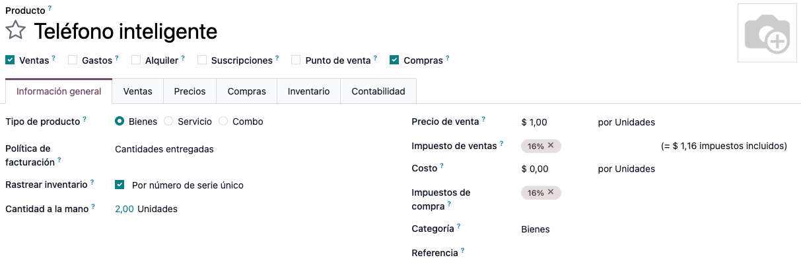

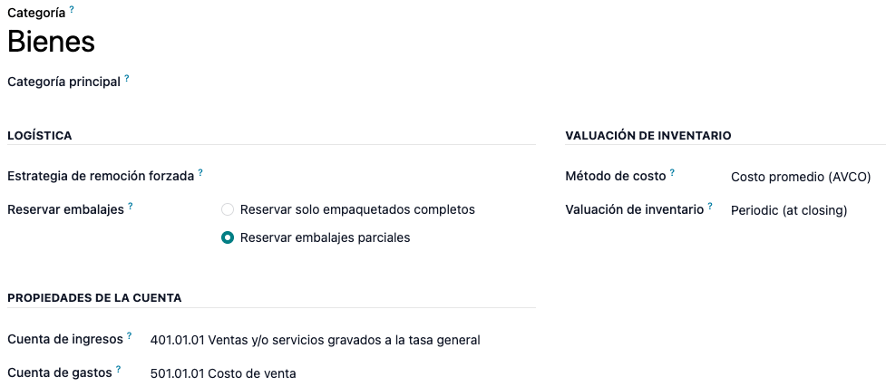

Purchase and sales flow
~~~~~~~~~~~~~~~~~~~~~~~

After configuring the product, follow the standard :doc:`purchase flow
<../../inventory_and_mrp/purchase>`.

Create a purchase order from :menuselection:`Purchase --> Orders --> Purchase Order`. Then, confirm
the order to display a :guilabel:`Receipt` smart button. Click the :guilabel:`Receipt` smart
button and :guilabel:`Validate` the receipt.

Go to :menuselection:`Inventory --> Operations --> Landed Costs`, and create a new record. In the
:guilabel:`Transfer`, add the receipt that was just validated, and add the :guilabel:`Customs
number`.

.. tip::
   While it is possible to add costs related to the customs number at this stage of the process, it
   is highly recommended to create a landed cost from a vendor bill from a customs agent. Learn
   more about :doc:`Landed Costs here
   <../../inventory_and_mrp/inventory/inventory_valuation/landed_costs>`.

.. warning::
   The :guilabel:`Customs number` field is not editable once it is set, and cannot be repeated,
   however it is possible to fix the number on the lot or serial number later by selecting a
   different landed cost.

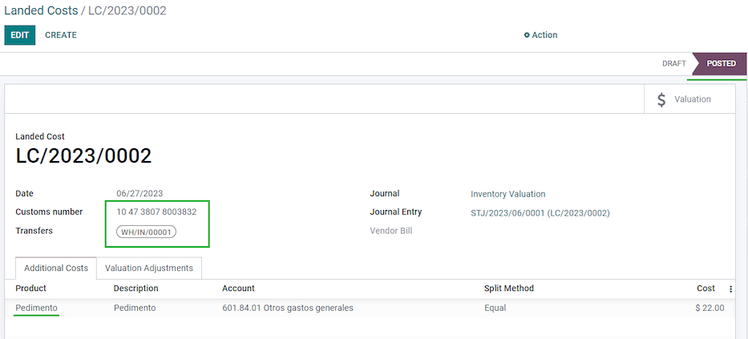

The customs number assigned to a specific lot or serial number can be found on its record in
:menuselection:`Inventory --> Products --> Lots/Serial Numbers`. The :guilabel:`L10N Mx Edi Landed
Cost` field can be edited at any time to fix any mistakes that could have occurred when registering
the landed cost. Editing the :guilabel:`L10N Mx Edi Landed Cost` field automatically updates the
:guilabel:`Customs number` and the name of the lot or serial number.

Next, create a sales order and confirm it. Click the :guilabel:`Delivery` smart button that appears,
and carefully review the assigned lots/serial numbers to make sure they are the desired values.
After that, click :guilabel:`Validate` on the delivery order.

Finally, :ref:`create an invoice from the sales order <accounting/inv-process/so>` and confirm it.
The invoice lines are created according to the distribution of the delivery order. If more than one
customs number is selected, Odoo splits the invoice lines by quantity and customs number.

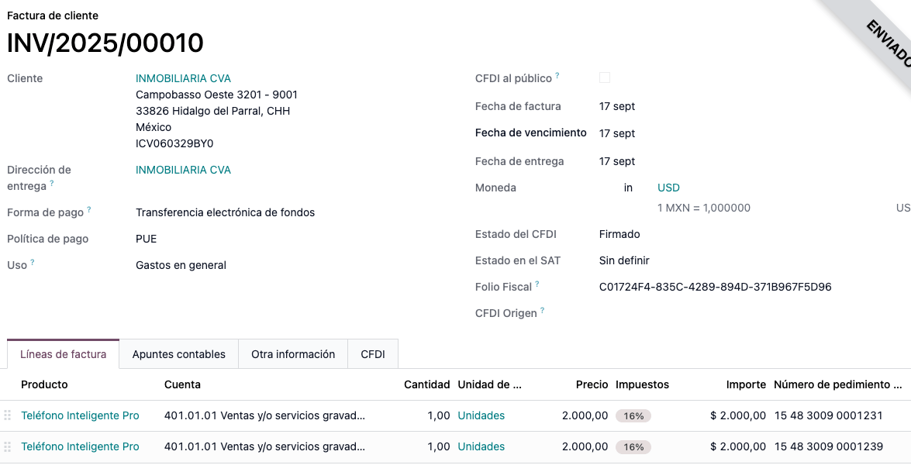

.. _l10n/mx/inventory/delivery-guide:

Delivery guide
--------------

A `Carta Porte <https://www.sat.gob.mx/portal/public/tramites/complemento-carta-porte>`_ is a bill
of lading: a document that states the type, quantity, and destination of goods being carried.

On July 17th, 2024, version 3.1 of this |CFDI| was implemented for all transportation providers,
intermediaries, and owners of goods. Odoo is able to generate a document type "T" (Traslado), which,
unlike other documents, is created in a delivery order instead of an invoice or payment.

Odoo can create XML and PDF files with (or without) ground transport, and can process materials that
are treated as *Dangerous Hazards*.

To print the PDF, the delivery order must be signed by the government. Then, it can be printed using
the :guilabel:`Print Carta Porte` button on the delivery order.

.. tip::
   The PDF file contains a QR code to verify the CCP code for the authorities.

To transport goods between warehouses, the logistic route must contain a **Delivery** type of
operation.

.. seealso::
   :doc:`Inter-warehouse replenishment
   <../../inventory_and_mrp/inventory/warehouses_storage/replenishment/resupply_warehouses>`

.. note::
   In order to use this feature, the :guilabel:`Mexico - Electronic Delivery Guide`
   `l10n_mx_edi_stock` module must be installed.

   Additionally, it is necessary to have the :doc:`Inventory <../../inventory_and_mrp/inventory>`
   and :doc:`Sales <../../sales/sales>` apps installed.

.. important::
   Odoo does not support Carta Porte type document type "I" (Ingreso), air, train or marine
   transport.

   Consult an accountant first if this feature is needed before doing any modifications.

Configuration
~~~~~~~~~~~~~

Odoo manages two different types of CFDI type "T". Both can be created from either :doc:`incoming
shipments or delivery orders
<../../inventory_and_mrp/inventory/shipping_receiving/daily_operations>`.

- :guilabel:`No Federal Highways` is used when the :guilabel:`Distance to Destination` is `less than
  30 km
  <http://omawww.sat.gob.mx/cartaporte/Paginas/documentos/PreguntasFrecuentes_Autotransporte.pdf>`_.
- :guilabel:`Federal Transport` is used when the :guilabel:`Distance to Destination` exceeds 30 km.

For No Federal Highways, no other configuration is required beyond the standard requirements of
regular invoicing (the |RFC| of the customer, the UNSPSC code, etc.).

For *Federal Transport*, several configurations have to be added to contacts, vehicle setups, and
products. Those configurations are then included in the XML and PDF files.

Contacts and vehicles
*********************

Like the external trade feature, the :guilabel:`Address` in both the company and the final customer
must be complete. The :guilabel:`ZIP` code, :guilabel:`City`, and :guilabel:`State` must coincide
with the `Official SAT Catalog for Carta Porte
<http://omawww.sat.gob.mx/tramitesyservicios/Paginas/catalogos_emision_cfdi_complemento_ce.htm>`_.

.. tip::
   The :guilabel:`Locality` field is optional for both addresses.

.. important::
   The origin address used for the delivery guide is set in :menuselection:`Inventory -->
   Configuration --> Warehouses`. While this is set as the company address by default, it is
   possible to change it to a proper warehouse address.

This feature requires the use of :doc:`Fleet <../../hr/fleet/new_vehicle>` to manage vehicles. The
vehicle setup is managed directly on the vehicle, and all the required fields are only visible after
checking the :guilabel:`L10N Mx Is Freight Vehicle` field.

Checking the :guilabel:`L10N Mx Is Freight Vehicle` field displays the :guilabel:`MX Parameters` tab
where the mandatory fields are required to create a correct delivery guide. Additionally the vehicle
**must** contain a :guilabel:`License Plate`, a :guilabel:`Model Year`, and a :guilabel:`Driver`.

.. tip::
   The :guilabel:`Vehicle Plate Number` and :guilabel:`Number Plate` fields must contain between 5
   and 7 characters.

The main driver of the vehicle is set directly on the :guilabel:`Driver` field, and it is possible
to add more vehicle operators in the :guilabel:`Intermediaries` section. The only mandatory fields
for driver contacts are the :guilabel:`VAT` and :guilabel:`Operator License`.

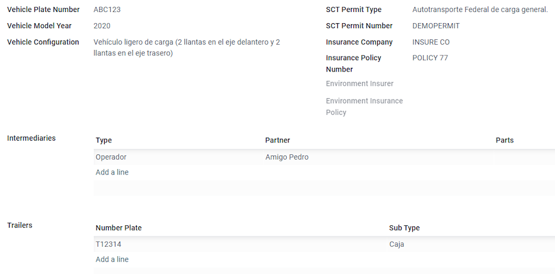

.. tip::
   If the vehicle is rented or more intermediaries are required, it is possible to add them in the
   :guilabel:`Intermediaries` field.

Products
********

Similar to regular invoicing, all products must have a :guilabel:`UNSPSC category`. In addition to
this, there are two extra configurations for products involved in delivery guides:

- The :guilabel:`Product Type` must be set as :guilabel:`Storable Product` for stock movements to be
  created.
- In the :guilabel:`Inventory` tab, the :guilabel:`Weight` field must be more than `0`.

.. warning::
   Creating a delivery guide of a product with the :guilabel:`Weight` set to `0` will trigger an
   error. As the :guilabel:`Weight` is immediately stored in the delivery order, it is then
   necessary to return the products and recreate the delivery order (and delivery guide) with the
   correct values.

Sales and inventory flow
~~~~~~~~~~~~~~~~~~~~~~~~

To create a delivery guide, first create and confirm a sales order from :menuselection:`Sales -->
Sales Order`. Click the :guilabel:`Delivery` smart button that is generated, and
:guilabel:`Validate` the transfer.

After the status is set to :guilabel:`Done`, it is possible to edit the transfer and select the
:guilabel:`Transport Type` in the :guilabel:`Additional Info` tab.

If using the :guilabel:`No Federal Highways` :guilabel:`Transport Type`, save the transfer, and then
click :guilabel:`Generate Delivery Guide`. The resulting XML can be found in the chatter.

.. note::
   Other than the :guilabel:`UNSPSC` on all products, delivery guides that use :guilabel:`No Federal
   Highways` do not require any special configuration to be sent to the government, as they are a
   type "T" CFDI with no delivery guide complement.

If using the :guilabel:`Federal Transport` :guilabel:`Transport Type`, the :guilabel:`Vehicle Setup`
is displayed to be selected.
The :guilabel:`Operator` is taken from the vehicle's driver. It can be changed for each
delivery. If changed, the :guilabel:`Set As Main Driver` button appears. Click it to replace the
driver on the fleet vehicle for traceability purposes.
The :guilabel:`Gross vehicle weight` is taken from the :guilabel:`Vehicle setup` configuration where
it is possible to add additional :guilabel:`Extra weight` to account for the drivers and luggage.

.. note::
   Odoo calculates the :guilabel:`Gross vehicle weight` with the following formula:

   .. math::
      Gross vehicle weight = Vehicle weight + (Weight + Extra Weight) / 1000

Every delivery requires a value in :guilabel:`Distance to Destination (KM)` greater than `0`.
Finally, enter the :guilabel:`Delivery Date` and click :guilabel:`Generate Delivery Guide`.

.. note::
   By default, the :guilabel:`Scheduled Date` is filled and represents the time at which the
   shipment leaves the warehouse. The :guilabel:`Delivery Date` is the time when the shipment is
   expected to arrive at its destination. These values are declared in both the XML and PDF.

Dangerous hazards
*****************

Certain values in the :guilabel:`UNSPSC Category` are considered in the `official SAT catalog
<http://omawww.sat.gob.mx/tramitesyservicios/Paginas/complemento_carta_porte.htm>`_ as *dangerous
hazards*. These categories need additional considerations when creating a delivery guide with
:guilabel:`Federal Transport`.

First, select the product from :menuselection:`Inventory --> Products --> Products`. Then, in the
:guilabel:`Accounting` tab, fill the :guilabel:`Hazardous Material Designation Code` and
:guilabel:`Hazardous Packaging` fields with the correct code from the |SAT| catalog.

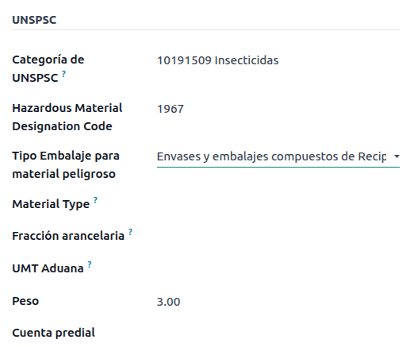

.. important::
   A :guilabel:`UNSPSC Category` may or may not be classified as a dangerous hazard, for example
   *01010101*. If it is not dangerous, enter `0` in the :guilabel:`Hazardous Material Designation
   Code` field.

In :guilabel:`MX Parameters`, complete the :guilabel:`Environment
Insurer` and :guilabel:`Environment Insurance Policy` as well. After this, continue with the regular
process to create a delivery guide.

Imports and Exports
*******************

If a Carta Porte is for international operations (for exports), some additional fields need to be
taken into account.

First, make sure that all relevant :guilabel:`Products` have the following configuration:

- :guilabel:`UNSPSC Category` cannot be :guilabel:`01010101 Does not exist in the catalog`.
- :guilabel:`Tariff Fraction` and :guilabel:`UMT Aduana` must be set, similar to the :ref:`external
  trade <l10n/mx/external-trade>` flow.
- :guilabel:`Material Type` must be set.

Then, when creating a :guilabel:`Delivery Guide` from a delivery or receipt, fill the following
fields:

- :guilabel:`Customs Regimes`
- :guilabel:`Customs Document Type`
- :guilabel:`Customs Document Identification`

Then, when creating a :guilabel:`Delivery Guide` for a receipt where the :guilabel:`Customs Document
Type` is :guilabel:`Customs number`, two new fields appear: :guilabel:`Customs Number` and
:guilabel:`Importer`.

.. tip::
   The :guilabel:`Customs Number` field should follow the pattern `xx xx xxxx xxxxxxx`. For example,
   use `15 48 3009 0001235` with **two** spaces between text.
