======
Mexico
======

.. |CFDI| replace:: :abbr:`CFDI (Comprobante Fiscal Digital por Internet)`
.. |DIOT| replace:: :abbr:`DIOT (Declaración Informativa de Operaciones con Terceros)`
.. |IEPS| replace:: :abbr:`IEPS (Impuesto Especial sobre Producción y Servicios)`
.. |PAC| replace:: :abbr:`PAC (Proveedor Autorizado de Certificación / Authorized Certification
   Provider)`
.. |PPD| replace:: :abbr:`PPD (Pago en Parcialidades o Diferido / Payment in Installments or
   Deferred)`
.. |PUE| replace:: :abbr:`PUE (Pago en una Sola Exhibición / Payment in a Single Exhibition)`
.. |RFC| replace:: :abbr:`RFC (Registro Federal de Contribuyentes)`
.. |SAT| replace:: :abbr:`SAT (Servicio de Administración Tributaria)`

.. _l10n/mx/modules:

Modules
=======

The following modules are automatically installed with the Mexican localization:

.. list-table::
   :header-rows: 1
   :widths: 25 25 50

   * - Name
     - Technical name
     - Description
   * - :guilabel:`Mexico - Accounting`
     - `l10n_mx`
     - The default :doc:`fiscal localization package <../fiscal_localizations>` adds accounting
       characteristics for the Mexican localization, such as the most common taxes and the chart of
       accounts, based on `the SAT account grouping code
       <https://www.gob.mx/cms/uploads/attachment/file/151586/codigo_agrupador.pdf>`_.
   * - :guilabel:`EDI for Mexico`
     - `l10n_mx_edi`
     - Includes all the technical and functional requirements to generate and validate
       :doc:`electronic documents <../accounting/customer_invoices/electronic_invoicing>`, based on
       the technical documentation published by the |SAT|. This allows sending invoices, with or
       without addendas, and payment complements to the government.
   * - :guilabel:`Odoo Mexican Localization Reports`
     - `l10n_mx_reports`
     - Adapts the reports for Mexico's electronic accounting: chart of accounts, trial balance,
       |DIOT|, and audit reports.

The following modules are optional. :ref:`Install <general/install>` them *only* if the business
has to meet the corresponding requirement.

.. list-table::
   :header-rows: 1
   :widths: 25 25 50

   * - Name
     - Technical name
     - Description
   * - :guilabel:`EDI for Mexico (Advanced Features)`
     - `l10n_mx_edi_extended`
     - Adds the foreign trade complement to invoices, a legal requirement for selling products to
       foreign countries.
   * - :guilabel:`Mexico - Electronic Delivery Guide`
     - `l10n_mx_edi_stock`
     - Enables the creation of a *Carta Porte*, a bill of lading that proves to the government with
       a signed electronic document that goods are moved between two points. It also installs the
       :doc:`Fleet <../../hr/fleet>` app.
   * - :guilabel:`Odoo Mexico Localization for Stock/Landing`
     - `l10n_mx_edi_landing`
     - Allows managing customs numbers related to landed costs in electronic documents.
   * - :guilabel:`CFDI 4.0 fields for sale orders`
     - `l10n_mx_edi_sale`
     - Adds extra fields to the :doc:`Sales <../../sales/sales>` app to comply with the Mexican
       electronic invoicing requirements.
   * - :guilabel:`Mexican Localization for the Point of Sale`
     - `l10n_mx_edi_pos`
     - Adds extra fields to the :doc:`Point of Sale <../../sales/point_of_sale>` app to comply with
       the Mexican electronic invoicing requirements.
   * - :guilabel:`Mexican Localization for eCommerce`
     - `l10n_mx_edi_website_sale`
     - Adds extra fields to the :doc:`eCommerce <../../websites/ecommerce>` app to comply with the
       Mexican electronic invoicing requirements.

.. seealso::
   - :doc:`Mexican payroll localization documentation
     <../../hr/payroll/payroll_localizations/mexico>`
   - :doc:`Documentation on e-invoicing's legality and compliance in Mexico
     <../accounting/customer_invoices/electronic_invoicing/mexico>`

.. _l10n/mx/video-tutorials:

Video tutorials
===============

The basic workflows and most of the topics covered on this page are also available in video format:

- `Odoo Smart Tutorial - Mexican localization
  <https://www.odoo.com/es/slides/smart-tutorial-localizacion-de-mexico-173>`_
- `Basic configurations and YouTube playlist
  <https://www.youtube.com/watch?v=TjWddMtQRfc&list=PL1-aSABtP6ACcwRzy_cdx-avDoNfSvooD&index=22>`_

.. _l10n/mx/overview:

Localization overview
=====================

The Mexican localization modules allow signing electronic invoices according to the specifications
of the |SAT| for `version 4.0 of the CFDI
<http://omawww.sat.gob.mx/tramitesyservicios/Paginas/documentos/Anexo_20_Guia_de_llenado_CFDI.pdf>`_,
a legal requirement since January 1, 2022. These modules also add the relevant accounting reports,
including the |DIOT|, and enable foreign trade and the creation of delivery guides.

.. note::
   The Sign app must be installed to electronically sign any document in Odoo.

.. seealso::
   - :doc:`Documentation on e-invoicing's legality and compliance in Mexico
     <../accounting/customer_invoices/electronic_invoicing/mexico>`
   - :doc:`Mexican payroll signing and configurations
     <../../hr/payroll/payroll_localizations/mexico>`

.. _l10n/mx/requirements:

Requirements
------------

The following requirements must be met before configuring the Mexican localization modules in Odoo:

- Being registered with the |SAT| with a valid |RFC|.
- Having a `Certificado de Sello Digital / Digital Seal Certificate
  <https://www.gob.mx/sat/acciones-y-programas/certificado-de-sello-digital>`_ (CSD).
- Choosing a |PAC|. Odoo currently works with the following |PAC|\s: `Solución Factible
  <https://solucionfactible.com/contenido/productos/timbrado/general#dos>`_, `Quadrum
  <https://cfdiquadrum.com.mx/odoo/>`_, and `SW Sapien - Smarter Web
  <https://info.sw.com.mx/sw-smarter-odoo>`_.

.. _l10n/mx/company:

Company
-------

After installing the correct modules, verify that the company is configured with the correct data.
To do so, go to :menuselection:`Settings --> Users & Companies --> Companies`, and select the
company to configure.

In the resulting form, enter the full :guilabel:`Address`, including the :guilabel:`ZIP` code,
:guilabel:`State`, and :guilabel:`Country`, as well as the |RFC| in the :guilabel:`Tax ID` field.

According to the requirements of the |CFDI| 4.0, the name of the main company contact **must** match
the business name registered with the |SAT|, without the legal entity abbreviation. The same applies
to the :guilabel:`ZIP` code.

.. important::
   From a legal point of view, Mexican companies **must** use the local currency (MXN). To use
   another currency, keep MXN as the default currency and use a :doc:`pricelist
   <../../sales/sales/products_prices/prices/pricing>` instead.

Next, go to :menuselection:`Accounting --> Configuration --> Settings`, and scroll to the
:guilabel:`MX Electronic invoicing` section. Under :guilabel:`Service Tax Administration (SAT)`,
select the :guilabel:`Fiscal Regime` that applies to the company from the dropdown list, then click
:guilabel:`Save`.

.. tip::
   To test the Mexican localization, fill in the following fields:

   - On the company form:

     - :guilabel:`Company Name`: enter `INNOVACION VALOR Y DESARROLLO SA SA`
     - :guilabel:`Address`: enter a real address in Mexico, with `58000` as the :guilabel:`ZIP`
       code
     - :guilabel:`Tax ID`: enter `IVD920810GU2`

   - In :menuselection:`Accounting --> Configuration --> Settings`, under the :guilabel:`MX
     Electronic invoicing` section, select :guilabel:`General de Ley Personas Morales` in the
     :guilabel:`Fiscal Regime` field.

.. _l10n/mx/branches:

Branches
--------

Branches make it possible to establish several brands within the same parent company. When invoicing
from a branch, the invoicing information is taken from the parent company, except for the ZIP code.
If an |RFC| is set on the branch, Odoo uses the branch information instead.

A separate branch is also required for each fiscal regime used for invoicing purposes. By default,
the regime is inherited from the parent company; if a regime is explicitly set on the branch, Odoo
applies the regime of that branch.

.. _l10n/mx/contacts:

Contacts
--------

.. note::
   :ref:`Install <general/install>` the **Contacts** app to access contact records.

To create a contact that can be invoiced, go to the :menuselection:`Contacts` app and click
:guilabel:`New`. Then, enter the contact name and the full :guilabel:`Address`, including the
:guilabel:`ZIP` code, :guilabel:`State`, and :guilabel:`Country`, as well as the |RFC| in the
:guilabel:`Tax ID` field.

.. important::
   As with the company itself, all contacts must have the business name registered with the |SAT|.
   The :guilabel:`Fiscal Regime` must also be set in the :guilabel:`Sales & Purchase` tab.

.. warning::
   Setting an |RFC| in the :guilabel:`Tax ID` field without configuring the :guilabel:`Country` may
   result in incorrect invoices.

.. _l10n/mx/taxes:

Taxes
-----

To sign invoices properly, set the :ref:`Factor Type <l10n/mx/factor-type>` and :ref:`Tax Object
<l10n/mx/tax-object>` fields on sales taxes.

.. tip::
   RESICO ISR withholdings and some |IEPS| taxes are created automatically but are inactive by
   default. To use them, go to :menuselection:`Accounting --> Configuration --> Taxes` and activate
   the relevant taxes using the toggle.

.. _l10n/mx/factor-type:

Factor type
~~~~~~~~~~~

The :guilabel:`Factor Type` and :guilabel:`SAT Tax Type` fields are preloaded on the default taxes.

To set these fields on a new tax, go to :menuselection:`Accounting --> Configuration --> Taxes` and
click :guilabel:`New`. Set the :guilabel:`Tax Type` to :guilabel:`Sales`, then fill in the
:guilabel:`SAT Tax Type` and :guilabel:`Factor Type` fields in the :guilabel:`Advanced Options` tab.

Odoo supports four groups of :guilabel:`SAT Tax Type`: :guilabel:`IVA`, :guilabel:`ISR`,
:guilabel:`IEPS`, and :guilabel:`Local Taxes`.

If the factor type is :guilabel:`Quota`, the standard calculation methods do not apply. Set the tax
computation to :guilabel:`Custom Formula` instead.

.. example::
   .. code-block:: text

      result = quantity * 6.455

   - `quantity`: the number of items in the transaction
   - `6.455`: the quota value, a fixed amount per unit

   Only per-unit quotas are supported, not quotas based on other factors.

.. tip::
   Mexico manages two different kinds of 0% VAT to accommodate two scenarios:

   - For *0% VAT*, set the :guilabel:`Factor Type` to :guilabel:`Tasa`.
   - For *VAT exempt*, set the :guilabel:`Factor Type` to :guilabel:`Exento`.

.. note::
   Local taxes are generated in a separate node of the XML file and are not validated by the |PAC|.

.. warning::
   Quotas and custom formulas require the :guilabel:`Define Taxes as Python Code` module. See
   :doc:`Taxes <../accounting/taxes>`.

.. _l10n/mx/tax-object:

Tax object
~~~~~~~~~~

One requirement of the |CFDI| 4.0 is that the resulting XML file handles the breakdown of the taxes
of the operation in accordance with the regulation. Eight different values can be added to the XML
file:

- `01`: no tax object. This value is added automatically if the invoice line contains no taxes.
- `02`: tax object. This is the default configuration of any invoice line that contains taxes.
- `03`: tax object and does not require breakdown. This value can only be added manually.
- `04`: tax object and does not have tax. This value can only be added manually.
- `05`: tax object, VAT for PODEBI. This value can only be added manually.
- `06`: VAT object, no VAT forwarded. This value is selected when there is an ISR withholding and no
  VAT tax.
- `07`: no VAT forwarded, |IEPS| breakdown. This value is selected when there is an ISR withholding,
  an |IEPS| tax, and no VAT tax.
- `08`: no VAT forwarded, |IEPS| breakdown. This value can only be added manually.

.. warning::
   Using `01`, `03`, `04`, or `05` removes the tax node from the XML file.

.. important::
   The :guilabel:`IEPS Breakdown` status affects the behavior of the tax objects, as the |IEPS| is
   missing when the breakdown does not happen.

.. _l10n/mx/local-taxes:

Local taxes
~~~~~~~~~~~

Local taxes, such as *ISH* and *Cedular*, require a separate XML node and may not follow the
standard tax logic.

When a local tax is configured, its name appears in the local tax complement. A negative rate is
treated as a withholding, and a positive rate is carried forward.

.. _l10n/mx/ieps-breakdown:

IEPS breakdown
~~~~~~~~~~~~~~

By default, Odoo hides the |IEPS| on invoices so that the subtotal on which the VAT is calculated
includes the |IEPS| amount. This ensures that fiscal regimes that do not require the breakdown do
not receive it.

To make the |IEPS| visible in the XML file, tick the :guilabel:`IEPS Breakdown` checkbox in the
:guilabel:`Sales & Purchase` tab of the relevant contact.

.. important::
   When using either :ref:`eCommerce invoicing <l10n/mx/ecommerce>` or the :ref:`self-invoicing
   portal <l10n/mx/pos/portal>`, the customer decides whether or not to include the |IEPS|
   breakdown.

.. _l10n/mx/tax-config:

Other tax configurations
~~~~~~~~~~~~~~~~~~~~~~~~

The Mexican localization uses :doc:`cash basis taxes <../accounting/taxes/cash_basis>`. When a
payment is registered, Odoo moves the taxes from the *cash basis transition account* to the account
set in the :guilabel:`Definition` tab of the tax record used on the invoice or bill line. The tax
base account :guilabel:`899.01.99 Base Imponible de Impuestos en Base a Flujo de Efectivo` is used
in the journal entry when reclassifying taxes. **Do not delete this account.**

.. _l10n/mx/withholdings:

Withholdings
------------

By default, Odoo includes withholdings with special distributions to allocate VAT.

When registering a vendor bill, add the withholding and its corresponding VAT. Both must be included
on the vendor bill to ensure correct accounting. Using :doc:`fiscal positions
<../accounting/taxes/fiscal_positions>` is recommended so that the cash basis entry splits the
distribution properly.

.. example::
   For a lease vendor bill of `10000 MXN`, the `10.67%` lease withholding corresponds to a `16% VAT
   2/3 H`. Both taxes must be applied together to reflect the correct accounting.

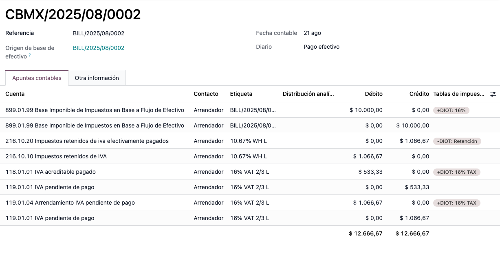

.. note::
   The withholdings |CFDI| is not supported. Consult an accountant about the proper distribution.

.. _l10n/mx/products:

Products
--------

To configure products, go to :menuselection:`Accounting --> Customers --> Products`. Open an
existing product or click :guilabel:`New`, then set the :guilabel:`UNSPSC Product Category` in the
:guilabel:`Accounting` tab. Products and categories can be set manually or through :doc:`a bulk
import <../../essentials/export_import_data>`.

.. note::
   All products need a |SAT| code to prevent validation errors.

.. _l10n/mx/e-invoicing-overview:

Electronic invoicing setup
--------------------------

.. _l10n/mx/pac:

PAC credentials
~~~~~~~~~~~~~~~

After processing the `private key (CSD)
<https://sat.gob.mx/portal/public/tramites/certificado-de-sello-digital>`_ with the |SAT|, register
directly with a :ref:`PAC <l10n/mx/requirements>` before creating any invoice in Odoo.

Once an account has been created with one of these providers, go to :menuselection:`Accounting -->
Configuration --> Settings` and scroll to the :guilabel:`MX Electronic invoicing` section. Under
:guilabel:`Authorized Certification Provider (PAC)`, enter the name of the |PAC| with the
corresponding credentials in the :guilabel:`PAC username` and :guilabel:`PAC password` fields.

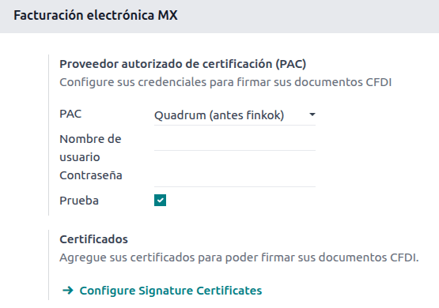

.. tip::
   To test electronic invoicing without credentials, tick the :guilabel:`MX PAC test environment`
   checkbox and select :guilabel:`Solucion Factible` as the :guilabel:`PAC`. A username and password
   are not required in a test environment.

.. _l10n/mx/certifications:

Certificates and keys
~~~~~~~~~~~~~~~~~~~~~

The `digital certificates of the company
<https://www.gob.mx/tramites/ficha/certificado-de-sello-digital/SAT139>`_ must be uploaded in the
:guilabel:`Certificates` section. To do so, open the Settings app and navigate to the
:guilabel:`Certificates and Keys` section.

Under :guilabel:`Manage your certificates`, click the :icon:`oi-arrow-right` (:guilabel:`Keys`) link
to access the :guilabel:`Keys` list view. Click :guilabel:`Create`, upload the :file:`.key` file in
the :guilabel:`Key file` field, add a :guilabel:`Name` for the key, and enter the :guilabel:`Private
key password`.

In the :guilabel:`Certificates and Keys` section, select :guilabel:`Certificates` to access the
:guilabel:`Certificate` list view. Click :guilabel:`Create`,
upload the :file:`.cer` file in the :guilabel:`Certificate` field, add a :guilabel:`Name` for the
certificate, and select the :guilabel:`Private Key` created in the previous step from the dropdown
menu.

.. note::
   The :guilabel:`Certificate Password` and :guilabel:`Public Key` fields on :guilabel:`Certificate`
   records are optional.

.. tip::
   Uploading the company's e.firma in the same section enables the automatic download of
   :ref:`CFDI documents <l10n/mx/cfdi-documents>` from the |SAT|.

.. tip::
   To test electronic invoicing, the following |SAT| test certificates can be used with either
   :guilabel:`Quadrum` or :guilabel:`Solución Factible` as the |PAC|:

   - :download:`Certificate <mexico/certificate.cer>`
   - :download:`Certificate key <mexico/certificate.key>`
   - Password: `12345678a`

.. _l10n/mx/accounting:

Accounting
==========

.. _l10n/mx/e-invoicing:

Electronic invoicing
--------------------

The invoicing process in Odoo is based on version 4.0 of the |SAT|'s `Annex 20
<http://omawww.sat.gob.mx/tramitesyservicios/Paginas/anexo_20.htm>`_.

.. _l10n/mx/invoices:

Customer invoices
~~~~~~~~~~~~~~~~~

To start invoicing from Odoo, create a customer invoice using the :doc:`standard invoicing flow
<../accounting/customer_invoices>`.

While the document is in draft, it can still be modified. Some fields take the values previously set
on the sales order or on the contact.

Review the following fields:

- :guilabel:`CFDI to public`
- :guilabel:`Usage`
- :guilabel:`Payment Policy`
- :guilabel:`Payment Way`, if the :guilabel:`Payment Policy` is not set to |PPD|

.. tip::
   The :guilabel:`Usage`, :guilabel:`Payment Policy`, and :guilabel:`Payment Way` fields can be set
   beforehand on a sales order, or on the contact to apply them to every invoice.

The :guilabel:`Payment Policy` field can be set manually on the invoice. If no policy is selected,
Odoo computes one automatically: the value is set to |PUE| if the date on which the payment is
expected falls within the current month, and to |PPD| if that date falls outside the current month.

.. warning::
   If the payment policy is not selected and the |PPD| policy is expected, either select an invoice
   :guilabel:`Due Date` in a month other than the current one, or choose :guilabel:`Payment terms`
   that change the due month, e.g., :guilabel:`30 Days` or :guilabel:`15 Days`, as long as they fall
   in the next month.

After clicking :guilabel:`Confirm` on the customer invoice, click :guilabel:`Send` to process the
invoice with the government. Make sure the :guilabel:`CFDI` checkbox is ticked.

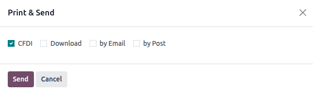

Once the signed document is received back from the government, the :guilabel:`Fiscal Folio` field
appears on the document, and the XML file appears both in the :guilabel:`CFDI` tab and as an
attachment in the chatter.

If an email address is configured on the customer contact record, ticking the :guilabel:`by Email`
and :guilabel:`CFDI` checkboxes sends the XML and PDF files together.

To download the PDF file locally, click :guilabel:`Print`.

.. tip::
   Clicking :guilabel:`Update SAT` refreshes the :guilabel:`SAT status` field, which confirms
   whether the XML file is :guilabel:`Validated` with the |SAT|.

   In a testing environment, the :guilabel:`Not Found` message commonly appears.

.. warning::
   Invoices with a :guilabel:`Country` other than Mexico, or without a :guilabel:`ZIP` code on the
   customer form, are classified as :guilabel:`CFDI to public` and addressed to a generic customer.
   The :guilabel:`CFDI to public` checkbox stays active on the invoice form until valid partner
   information is provided. Once the contact information of a national customer is complete, the
   checkbox is deactivated automatically.

.. _l10n/mx/invoices/cash-rounding:

Cash rounding
*************

In the Mexican localization, :doc:`cash rounding
<../accounting/customer_invoices/cash_rounding>` is supported using the :guilabel:`Add a rounding
line` method. This adds a rounding line that changes the paid amount but not the amount in the
|CFDI|.

.. _l10n/mx/printed-representation:

Printed representation
~~~~~~~~~~~~~~~~~~~~~~

The PDF file of a signed document is built from the values of its XML file, which makes it an exact
printed representation of the |CFDI|: both always show the same values. To download the PDF file,
click :guilabel:`Print` on the document.

Besides the standard invoice information, the PDF displays:

- The :guilabel:`Usage`, :guilabel:`Payment Way`, and :guilabel:`Payment Method` of the document
- The :guilabel:`Currency` and, for foreign currencies, the :guilabel:`Currency rate`
- The total amount in words
- The :guilabel:`Product Code`, :guilabel:`Unit Code`, and :ref:`Tax Object <l10n/mx/tax-object>` of
  each line
- The discount of each line and the total discount
- The :ref:`customs number <l10n/mx/inventory/customs>` of each line
- The amounts including the |IEPS| when the :ref:`IEPS breakdown <l10n/mx/ieps-breakdown>` is not
  requested
- The digital stamps of the emitter and of the |SAT|, the original chain complement of the digital
  certification, and the :guilabel:`Fiscal Folio`

The printed representation works with the :ref:`default document layouts
<studio/pdf-reports/default-layout>` of Odoo.

.. _l10n/mx/credit-notes:

Credit notes
~~~~~~~~~~~~

While an invoice is a document of type `I` (Ingreso), a credit note is a document of type `E`
(Egreso).

In addition to the :doc:`standard flow for credit notes
<../accounting/customer_invoices/credit_notes>`, the |SAT| requires a relation between a credit note
and an invoice through the fiscal folio.

Because of this requirement, the :guilabel:`CFDI Origin` field creates this relation with `01|`,
followed by the fiscal folio of the original :abbr:`UUID (universally unique identifier)`.

When creating credit notes, make sure the line description clearly indicates its purpose and
specifies whether the entry applies to a bonus, a discount, or a refund.

.. tip::
   To add the :guilabel:`CFDI Origin` field automatically, use the :guilabel:`Add Credit Note`
   button on the invoice instead of creating the credit note manually.

Credit notes generally reverse the main sales account defined on the journal, but an account can
also be assigned globally to all credit notes. To do so, go to :menuselection:`Accounting -->
Configuration --> Settings` and set the :guilabel:`Credit notes` account in the :guilabel:`Default
Accounts` section.

.. note::
   In the default configuration, the credit notes account is set to :guilabel:`402.01.01 Returns,
   discounts or bonuses over sales and/or services at the general rate`.

.. tip::
   The :guilabel:`Payment Policy` can be set manually before signing the document.

.. _l10n/mx/vendor-bills:

Vendor bills
~~~~~~~~~~~~

Vendor bills must have a fiscal folio for the reports and payments to work correctly. If the vendor
bill was created from the Purchase app or added manually, add the XML file of the invoice to the
chatter **as a log note** to update the fiscal folio accordingly. The bill **must be in draft** for
the update to happen.

.. tip::
   Clicking :guilabel:`Update SAT` refreshes the :guilabel:`SAT status` field, which confirms
   whether the XML file is :guilabel:`Validated` with the |SAT|. This also applies to vendor bills.

.. seealso::
   - :doc:`../accounting/vendor_bills`
   - :ref:`l10n/mx/cfdi-documents`

.. _l10n/mx/xml-reader:

XML reader
~~~~~~~~~~

Invoices and vendor bills created in another software or directly with the |SAT| can be uploaded to
Odoo, and the XML reader retrieves the data from the XML file. To do so, go to
:menuselection:`Accounting --> Customers --> Invoices` and, in the list view, click
:guilabel:`Upload` to select any number of XML files. Draft invoices are created automatically.
Files can also be dragged from a local folder and dropped into the view.

XML files that are not issued to the company's |RFC| are not imported. The file is still added to
the chatter, together with a message stating that the invoice does not belong to the company's
|RFC|.

From each imported file, the XML reader retrieves:

- The customer or vendor information, creating the contact if it does not exist
- The product lines, including the product descriptions and the internal references
- The taxes, including :ref:`local taxes <l10n/mx/local-taxes>` and the amounts of a hidden
  :ref:`IEPS <l10n/mx/ieps-breakdown>`
- For documents in a foreign currency, the exchange rate stated on the document, which is used
  instead of the rate configured in Odoo
- The fields specific to the Mexican localization

Products are matched on several criteria, including the vendor pricelists, and the account of each
line is determined by a predictive model.

The amounts of the transaction and of the taxes are matched to the cent against the values of the
XML file, and the totals read from the file are transcribed in the chatter. If an amount does not
match, Odoo flags an anomaly in the invoice list view and a banner on the document recommends
checking the values; the import is not blocked. Nothing is flagged when the amounts match exactly.

Customer invoices created this way can generate *payment complements* and can be canceled at any
time. Clicking :guilabel:`Print` produces a PDF document that includes all the corresponding
information. The same applies to vendor bills.

.. tip::
   To retrieve the :guilabel:`Fiscal Folio` of a draft invoice that already exists, drag and drop
   the XML file into the chatter as a log note.

.. _l10n/mx/cfdi-documents:

CFDI documents
~~~~~~~~~~~~~~

Odoo downloads the XML files of the CFDIs received by the company from the |SAT| and creates the
corresponding vendor bills and credit notes. To access them, go to :menuselection:`Accounting -->
Review --> CFDI Documents (MX)`.

To enable the download, upload the company's e.firma, formerly known as FIEL, in the
:guilabel:`Certificates and Keys` section of the Settings app, following the same steps as for the
:ref:`digital seal certificate <l10n/mx/certifications>`. No other configuration is required.

The downloaded files are processed by the :ref:`XML reader <l10n/mx/xml-reader>`, which fills in the
vendor information, the product lines, the taxes, and the fields specific to the Mexican
localization. Each downloaded document is compared with the documents already in the database, so
only the missing ones are created and existing records are not duplicated.

The list displays the :guilabel:`Datetime`, :guilabel:`Fiscal Folio`, :guilabel:`Receipt Type`,
:guilabel:`RFC`, and :guilabel:`Sat State` of every CFDI in the database. The :guilabel:`Sat State`
column shows the status of each document with the |SAT|. Click a line to open the related document,
and use the :guilabel:`Receipt Type` and :guilabel:`Datetime` fields to filter the list.

Two requests are sent automatically every day: one for the invoices received and one for the credit
notes received. The CFDIs issued by the company are only retrieved through a manual request.

To retrieve the CFDIs issued by the company, or documents from a specific period, such as those
issued from other software during the previous fiscal year, proceed as follows:

#. Click :guilabel:`Create CFDI Request`.
#. In the :guilabel:`New CFDI Request` window, click :guilabel:`Last Week` or :guilabel:`Last
   Month`, or set the period manually in the :guilabel:`From - To` fields.
#. Set the :guilabel:`Request Type` to :guilabel:`CFDI (Issued)` or :guilabel:`CFDI (Received)`.
#. Set the :guilabel:`Receipt Type` to :guilabel:`I (Income)` or :guilabel:`E (Credit Note)`.
#. Click :guilabel:`Send Request`.

The request is processed in the background. To follow its status, go to :menuselection:`Accounting
--> Review --> CFDI Requests`.

.. note::
   Download times depend on the |SAT| and range from a few minutes to several days. In most cases,
   the request is completed within the same day.

.. important::
   Only invoices and credit notes are downloaded. Payments, payroll documents, and Carta Porte
   documents are not.

   There is no test environment for this feature: it requires the company's real e.firma and the
   real data of the |SAT|.

.. warning::
   The documents stored by the |SAT| do not contain addendas. If a development depends on reading
   :ref:`addendas <l10n/mx/addendas-and-complements>`, do not retrieve those documents this way.

.. _l10n/mx/journals:

Journals
~~~~~~~~

The :guilabel:`EDI for Mexico (Advanced Features)` (`l10n_mx_edi_extended`) module must be installed
to complete the :guilabel:`Address Issued` field on the sales journal. This ensures that all
invoices from that sales journal, as well as :ref:`global invoices <l10n/mx/global-invoice>`, use
the correct ZIP code when generating the |CFDI|.

To invoice within a company spanning several time zones with the same user, create a system
parameter that applies the correct time zone when invoicing, as the user's time zone is used by
default.

To do so, enable the :doc:`developer mode <../../general/developer_mode>` and go to
:menuselection:`Settings --> Technical --> System Parameters`. Click :guilabel:`New` to create a
parameter with the key `l10n_mx_edi_tz_XX`, where `XX` is the ID of the journal, and set the desired
time zone as the value, e.g., `America/Tijuana`.

.. _l10n/mx/payments:

Payments
~~~~~~~~

.. _l10n/mx/payment-policy:

Payment policy
**************

The :guilabel:`Payment Policy` field is specific to the Mexican localization. `According to the SAT
documentation <https://www.sat.gob.mx/consultas/92764/comprobante-de-recepcion-de-pagos>`_, there
are two types of payments:

- :guilabel:`PUE`: Pago en una Sola Exhibición / Payment in a Single Exhibition
- :guilabel:`PPD`: Pago en Parcialidades o Diferido / Payment in Installments or Deferred

.. warning::
   Payment complements are only generated if the policy of the invoice is set to |PPD|.

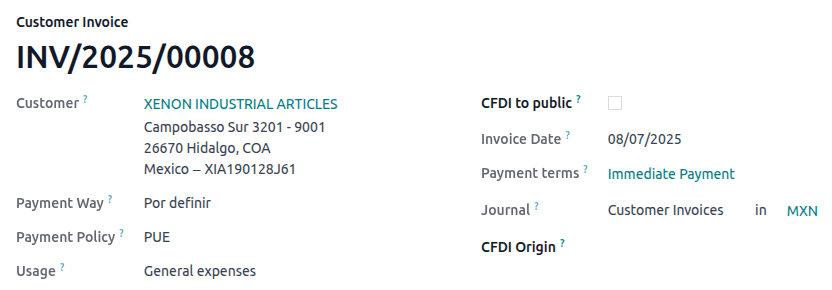

If the invoice has a due date outside the current month, the policy defaults to |PPD|.

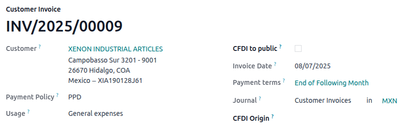

.. _l10n/mx/payment-flow:

Payment flow
************

In both cases, the payment process in Odoo :doc:`is the same <../accounting/payments>`. The main
difference is that, by law, payments related to |PPD| invoices must be sent to the government as a
document of type `P` (Pago).

A payment related to a |PUE| invoice can be registered through the payment window and associated
with the corresponding invoice. To do so, go to :menuselection:`Accounting --> Customers -->
Invoices` and select an invoice. Then, click :guilabel:`Pay` to open the payment window, set the
:guilabel:`Payment Way` and any other field, and click :guilabel:`Create Payment`.

.. seealso::
   - :doc:`../accounting/payments`
   - :doc:`../accounting/bank/reconciliation`

The process is the same for |PPD| invoices, but creating an :doc:`electronic document
<../accounting/customer_invoices/electronic_invoicing>` adds requirements to send the document to
the |SAT| correctly.

From a legal perspective, |PPD| invoices **must** include the specific :guilabel:`Payment Way` used
to receive the payment. For this reason, the :guilabel:`Payment Way` field **cannot** be set to
:guilabel:`To Define`, and the option is therefore hidden.

.. note::
   - If a bank account number is required, add it in the :guilabel:`Accounting` tab of the
     customer's contact record.
   - The exact configurations are described in the |SAT|'s `Annex 20
     <http://omawww.sat.gob.mx/tramitesyservicios/Paginas/anexo_20.htm>`_. The :guilabel:`Bank
     Account` usually needs 10 or 18 digits for transfers, and 16 for credit or debit cards.

If a fully reconciled payment is related to an invoice with a :guilabel:`Fiscal Folio`, the
:guilabel:`Update Payments` button appears. Click it to send the *payment complement* XML file to
the government automatically and display it in the :guilabel:`CFDI` tab of both the invoice and the
payment.

As with an invoice or a credit note, the PDF and XML files can be sent to the final customer. To do
so, click the :icon:`fa-cog` (:guilabel:`gear`) icon on the payment to open the actions dropdown
menu, then select :guilabel:`Send receipt by email`.

To download the payment PDF from the :guilabel:`CFDI` tab of the invoice, regardless of whether the
payment was created with or without reconciliation, click :guilabel:`Print`.

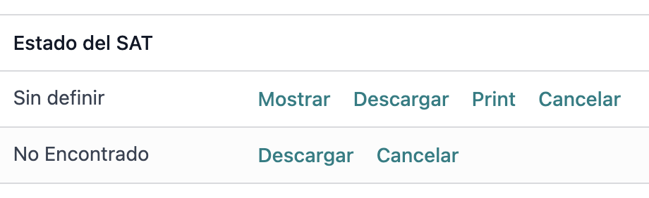

.. _l10n/mx/payment-cancellations:

Payment cancellations
*********************

To cancel a :ref:`payment complement <l10n/mx/payment-flow>`, go to the :guilabel:`CFDI` tab of the
related invoice and click :guilabel:`Cancel` on the line of the payment complement.

As with invoices, go to the payment and click :guilabel:`Update SAT` to change the :guilabel:`SAT
Status` and :guilabel:`Status` to :guilabel:`Cancelled`.

.. note::
   When substituting a payment complement, unreconcile the current payment. Then, to link the new
   payment to the original document, add `04|` followed by the fiscal folio in the :guilabel:`CFDI
   Origin` field. If the new payment is signed after the substituted document is linked, the older
   payment is canceled.

.. _l10n/mx/factoring:

Factoring
*********

Factoring is a financial transaction in which a business sells its accounts receivable, i.e., its
outstanding invoices, to a specialized financial institution known as a *factor*, to gain immediate
liquidity.

To record a payment for financial factoring, proceed as follows:

#. Go to :menuselection:`Accounting --> Configuration --> Settings`, scroll to the
   :guilabel:`Default Accounts` section, and make sure an account is selected in the
   :guilabel:`Factoring account` field.
#. From the Accounting dashboard, click :guilabel:`Bank` on the corresponding Kanban card to
   manually :ref:`add a transaction line <accounting/transactions/register>` and record the
   factoring payment. Complete the following fields:

   - :guilabel:`Label`: Enter a brief description of the transaction.
   - :guilabel:`Partner`: Select the financial institution, i.e., the factor, that purchases the
     debt.
   - :guilabel:`Amount`: Enter the actual amount received from the factor.

   .. important::
      The currency of the factoring payment **must** match the currency of the bank journal.

#. On the newly created transaction line, click the :icon:`fa-ellipsis-v` (:guilabel:`vertical
   ellipsis`) icon and select :guilabel:`Reconcile`.
#. In the :guilabel:`Search: Journal Items to Match` window, remove the :guilabel:`Partner` filter,
   select the invoices to be paid by the factor, and click :guilabel:`Select`.

   .. note::
      Do not select the tax lines related to the invoices.

#. In the :guilabel:`Distribute Payment` window, fill in the following fields to distribute the
   payment over the selected invoices:

   - :guilabel:`Amount`: Enter the amount received from the factor.
   - :guilabel:`Compensation`: Enter the compensation paid to the factor.

   .. tip::
      - The :guilabel:`Amount` and :guilabel:`Compensation` amounts are provided by the factor and
        are stated on the factoring receipt.
      - Make sure the :guilabel:`Amount` and :guilabel:`Compensation` amounts equal the
        :guilabel:`Due` amount. If they exceed it, the line is highlighted in red.
      - The :guilabel:`To distribute` field balances the :guilabel:`Amount` against the transaction
        amount entered; it must equal zero.

#. Click :guilabel:`Save`.

In the :guilabel:`Bank Matching` view, the factoring payment is then reconciled with the relevant
invoices, and the factoring commission is allocated to the configured :guilabel:`Factoring` account.

To generate the XML file, go to :menuselection:`Accounting --> Customers --> Invoices`, open one of
the paid invoices, and click :guilabel:`Update Payments`.

.. note::
   - The factoring company can retain a portion of the invoice amount, known as *aforo*, until the
     end customer completes the payment. The retained balance is then released to the vendor.
   - For multi-currency factoring, use the :icon:`oi-settings-adjust` (:guilabel:`adjust settings`)
     button in the :guilabel:`Distribute Payment` window and add the :guilabel:`Due (Company)`
     column to display the due amount in the company's currency.

.. _l10n/mx/invoice-cancellations:

Invoice cancellations
~~~~~~~~~~~~~~~~~~~~~

The EDI documents sent to the |SAT| can be canceled. According to the `Reforma Fiscal 2022
<https://www.sat.gob.mx/consultas/91447/nuevo-esquema-de-cancelacion>`_, two requirements apply
since January 1, 2022:

- All cancellation requests require a *cancellation reason*.
- After 24 hours from the invoice creation, the client must be asked to approve the cancellation. If
  there is no response within 72 hours, the cancellation is processed automatically.

Invoice cancellations are updated automatically in Odoo, but the update can take some time. To check
the cancellation status, click :guilabel:`Update SAT`.

Invoice cancellations can be made for one of the following reasons:

- `01`: invoice issued with errors (with related document)
- `02`: invoice issued with errors (no replacement)
- `03`: the operation was not carried out
- `04`: nominative operation related to the global invoice

To initiate a cancellation, go to :menuselection:`Accounting --> Customers --> Invoices`, select the
posted invoice to cancel, and click :guilabel:`Request Cancel`. Then, refer to the
:ref:`l10n/mx/01-invoice-cancellation` or :ref:`l10n/mx/02-03-04-invoice-cancellation` section,
depending on the cancellation reason.

.. tip::
   Alternatively, request a cancellation from the :guilabel:`CFDI` tab by clicking
   :guilabel:`Cancel` on the line item.

.. note::
   - If a cancellation is requested in a locked period, the |CFDI| is canceled but the accounting
     entry is not.
   - If the client rejects the cancellation, the invoice cancellation line item is removed from the
     :guilabel:`CFDI` tab.

.. _l10n/mx/01-invoice-cancellation:

Cancellation reason 01
**********************

#. In the :guilabel:`Request CFDI Cancellation` pop-up window, select :guilabel:`01 - Invoice issued
   with errors (with related document)` in the :guilabel:`Reason` field and click :guilabel:`Create
   Replacement Invoice` to create a new draft invoice. This new draft invoice replaces the previous
   invoice, along with the related |CFDI|.
#. Click :guilabel:`Confirm`, then :guilabel:`Send` the invoice.
#. The substituted invoice cancels the original invoice automatically once the new one is signed.

The invoice cancellation is then generated with a reason line item in the :guilabel:`CFDI` tab.

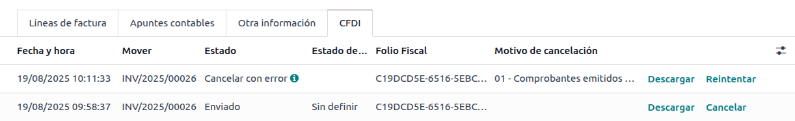

.. note::
   When using the :guilabel:`01 - Invoice issued with errors (with related document)` cancellation
   reason, the `04|` prefix appears in the :guilabel:`Fiscal Folio` field. This is an internal
   prefix used by Odoo to complete the cancellation; it **does not** mean that the cancellation
   reason was :guilabel:`04 - Nominative operation related to the global invoice`.

.. _l10n/mx/02-03-04-invoice-cancellation:

Cancellation reasons 02, 03, and 04
***********************************

In the :guilabel:`Request CFDI Cancellation` pop-up window, select the desired cancellation
:guilabel:`Reason` and click :guilabel:`Confirm`.

For the cancellation reasons `02`, `03`, and `04`, the :guilabel:`Create Replacement Invoice` button
is replaced by a :guilabel:`Confirm` button that requests the cancellation immediately.

The invoice cancellation is then generated with a reason line item in the :guilabel:`CFDI` tab,
where both the current :guilabel:`State` and :guilabel:`Cancellation Reason` are available.

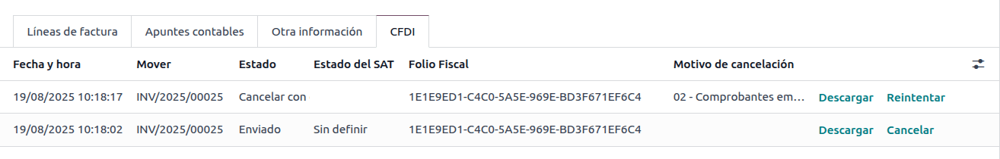

.. note::
   If the :guilabel:`SAT Status` goes back to :guilabel:`Validated`, it can be due to one of the
   following reasons:

   - The invoice is labeled as *No Cancelable* on the `SAT website <https://www.sat.gob.mx/home>`_
     because it has a valid related document, either another invoice linked through the
     :guilabel:`CFDI Origin` field or a payment complement. In that case, cancel the related
     document first.
   - The cancellation request is still being processed by the |SAT|. In that case, wait a few
     minutes and try again.
   - The final customer still has to reject or accept the cancellation request in their `Buzón
     Tributario <http://omawww.sat.gob.mx/BuzonTributario/Paginas/servicios_disponibles.html>`_.
     This can take up to 72 hours. If the cancellation request is rejected, repeat the process.

.. seealso::
   `Tool to validate the status of Mexican electronic documents (CFDI)
   <https://verificacfdi.facturaelectronica.sat.gob.mx/>`_

.. _l10n/mx/cancellation-acknowledgement:

Cancellation acknowledgment
***************************

To print a |PAC| cancellation response after canceling a |CFDI|, click :guilabel:`Print` on the
corresponding cancellation line in the :guilabel:`CFDI` tab of the invoice form.

To include the current :guilabel:`SAT status` in the PDF, click :guilabel:`Update SAT` on the
invoice form. When a payment is reviewed, the invoice status is updated accordingly.

.. image:: mexico/mx-invoice-cancellation-acknowledgement.png
   :alt: Cancellation acknowledgment example.

.. important::
   A cancellation acknowledgment confirms that the cancellation was requested successfully, but it
   is *not* definitive proof that the |CFDI| has been fully canceled.

.. _l10n/mx/special-use-cases:

Invoicing special use cases
~~~~~~~~~~~~~~~~~~~~~~~~~~~

.. _l10n/mx/cfdi-origin:

CFDI relations
**************

To relate the current document to previously signed CFDIs, fill in the :guilabel:`CFDI Origin` field
on the invoice and specify the relation using one of the seven available values:

- `01`: Nota de crédito
- `02`: Nota de débito de los documentos relacionados
- `03`: Devolución de mercancía sobre facturas o traslados previos
- `04`: Sustitución de los CFDI previos
- `05`: Traslados de mercancías facturados previamente
- `06`: Factura generada por los traslados previos
- `07`: CFDI por aplicación de anticipo

.. tip::
   The format is `Origin Type|UUID1, UUID2, ..., UUIDn`, and more than one origin type can be added.

.. example::
   The following value contains two relations:

   .. code-block:: none

      04|042FE739-7B45-4D64-B26D-360000876D83,
      07|A164BAF8-8016-428C-A422-D9BD2F68F6A0,CEAD9433-3B77-4270-85BF-AC2519587514

   - The first section has the relation type `04` with one UUID.
   - The second section has the relation type `07` with two UUIDs.

Every combination is also visible on the signed PDF.

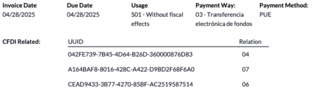

.. _l10n/mx/multicurrency:

Multicurrency
*************

The main :guilabel:`Currency` in Mexico is MXN. While this is mandatory for all Mexican companies,
invoices and payments can be sent and received in other currencies. To enable :doc:`multicurrency
<../accounting/get_started/multi_currency>`, go to :menuselection:`Accounting --> Configuration -->
Currencies` and set :guilabel:`[MX] Bank of Mexico` as the :guilabel:`Service` in the
:guilabel:`Automatic Currency Rates` section. Then, set the :guilabel:`Interval` field to the
desired frequency to update the exchange rates.

The XML file of the document then contains the correct exchange rate and the total amount in both
the foreign currency and MXN.

Using separate :doc:`bank accounts for each currency <../accounting/bank/foreign_currency>` is
highly recommended.

.. note::
   The only currencies whose exchange rate is updated daily are USD, EUR, GBP, JPY, and CNY.

.. _l10n/mx/discounts:

Discounts
*********

By law, electronic documents sent to the government cannot contain negative lines, as these can
trigger errors. Therefore, when using :doc:`gift cards
<../../sales/sales/products_prices/ewallets_giftcards>` or :doc:`loyalty programs
<../../sales/sales/products_prices/loyalty_discount>`, the resulting negative lines are translated
in the XML file as regular :doc:`discounts
<../../sales/sales/products_prices/prices/pricing>`.

To set this up, go to :menuselection:`Sales --> Products --> Products` and create a `Discounts`
product with a valid :guilabel:`Tax`, usually :guilabel:`IVA` at `16%`.

Then, create and sign the invoice via |CFDI| and add the `Discounts` product at the bottom. In the
XML file, Odoo distributes the discount evenly between the lines and adds any rounding difference to
a rounding product.

.. tip::
   A `Discounts` product and a `UNSPSC Product Category` must be created for each product variant
   related to gift cards or loyalty programs.

.. _l10n/mx/down-payments:

Down payments
*************

Down payments are a common practice in Mexico. They are primarily used when a payment is received
for a good or a service whose product, price, or both have not been fully determined.

The |SAT| allows two different ways to handle this process; both involve linking all invoices to
each other with the :guilabel:`CFDI Origin` field.

.. note::
   The :doc:`Sales <../../sales/sales>` app must be installed for this process.

.. seealso::
   `Official documentation for the registration of down payments in Mexico
   <http://omawww.sat.gob.mx/tramitesyservicios/Paginas/documentos/GuiaAnexo311221.pdf>`_

.. _l10n/mx/down-payments/configuration:

Configuration
^^^^^^^^^^^^^

First, go to :menuselection:`Sales --> Products --> Products` to create an `Anticipo` product. Set
the :guilabel:`Product Type` to :guilabel:`Service` and the :guilabel:`UNSPSC Category` to
:guilabel:`84111506 Servicios de facturación`.

Then, go to :menuselection:`Sales --> Configuration --> Settings` and, in the :guilabel:`Invoicing`
section, select the `Anticipo` product in the :guilabel:`Down Payments` field.

.. _l10n/mx/down-payments/method-a:

Method A
^^^^^^^^

This method consists of creating a down payment invoice, then an invoice for the total amount, and
finally a credit note for the total of the down payment.

First, create a sales order with the total amount and create a down payment from it, either using a
percentage or a fixed amount. Then, sign the document via |CFDI| and register the payment.

When the time comes to issue the final invoice to the customer, create it again from the same sales
order. In the :guilabel:`Create Invoice` pop-up window, select :guilabel:`Regular Invoice`, then
delete the line that contains the `Anticipo` product.

.. tip::
   When using down payments with the Mexican localization, make sure the :guilabel:`Invoicing
   Policy` of the products is set to :guilabel:`Ordered quantities`. Otherwise, a customer credit
   note is created.

Then, copy the :guilabel:`Fiscal Folio` of the down payment invoice and paste it into the
:guilabel:`CFDI Origin` field of the final invoice. Add the `07|` prefix before the value and sign
the document via |CFDI|.

Finally, create a credit note for the first invoice. Copy the :guilabel:`Fiscal Folio` of the final
invoice and paste it into the :guilabel:`CFDI Origin` field of the credit note, adding the `07|`
prefix. Then, sign the document via |CFDI|.

All electronic documents are now linked to each other. The final step is to fully pay the new
invoice: at the bottom of the new invoice, the credit note appears under :guilabel:`Outstanding
credits`; add it as a payment. Then, register the remaining amount with the :guilabel:`Pay` window.

On the sales order, all three documents appear as :guilabel:`In Payment`.

.. _l10n/mx/down-payments/method-b:

Method B
^^^^^^^^

Another, simpler way to fulfill the |SAT| requirements consists of creating only the down payment
invoice and a second invoice for the remainder. This method relies on negative lines being treated
as discounts.

Follow the same process as :ref:`Method A <l10n/mx/down-payments/method-a>` up to the creation of
the final invoice. Instead of deleting the line that contains the `Anticipo` product, rename the
:guilabel:`Description` of the other products to include the text `CFDI por remanente de un
anticipo`. Add the :guilabel:`Fiscal Folio` of the down payment invoice in the :guilabel:`CFDI
Origin` field of the final invoice, with the `07|` prefix.

Finally, sign the final invoice via |CFDI|.

.. _l10n/mx/addendas-and-complements:

Addendas and complements
************************

An addenda is a code addition to an invoice XML file that provides extra information beyond the
legal requirements. It is added after the invoice has been signed. A complement is a fiscal addition
that reports specific fiscal operations and is added before the invoice is signed. Only a limited
number of complements are available, and some are already included in Odoo.

.. seealso::
   `SAT documentation on invoice complements
   <https://www.sat.gob.mx/portal/public/tramites/complementos-de-factura>`_

Both addendas and complements can be included in the XML file. To add one, go to
:menuselection:`Accounting --> Configuration --> Addendas & Complementos (MX)` and click
:guilabel:`New` to enter the code to be injected. Fields beyond the standard Odoo fields may be
required.

.. warning::
   This section may require technical knowledge and may add technical debt. Contact the account
   manager for the best technical advice.

Once the desired nodes are created, they can be selected on each contact so that they appear on
every invoice addressed to that contact. By default, all the selected nodes are added automatically
to every invoice.

Nodes can also be selected on each invoice individually from the :guilabel:`Addendas & Complementos`
field in the :guilabel:`Other Info` tab.

.. tip::
   More than one node can be added per contact or per invoice.

.. _l10n/mx/cfdi:

CFDI to public
**************

The Mexican government requires that any good or service sold be backed up by an invoice. If the
customer does not require an invoice or has no |RFC|, a *CFDI to public*, also known as a nominative
invoice, must be created.

If the :guilabel:`CFDI to public` checkbox is ticked on a sales order or an invoice, the final XML
file overrides the data of the invoice contact and adds the following characteristics:

- |RFC|: `XAXX010101000` for a national customer, or `XEXX010101000` for a foreign customer
- :guilabel:`ZIP` code: the ZIP code of the company
- :guilabel:`Usage`: `S01 - Without Fiscal Effects`

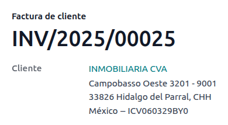

If the final customer does not share any details, create a generic customer. Its name cannot be
`PUBLICO EN GENERAL`, as this triggers an error; use another name, such as `CLIENTE FINAL`.

.. warning::
   By default, sending the invoice is not allowed if the partner has neither a :guilabel:`Country`
   nor a :guilabel:`ZIP` code set. This does not apply when the :guilabel:`CFDI to public` checkbox
   is ticked.

.. seealso::
   `Regla 2.7.1.21 Expedición de comprobantes en operaciones con el público en general
   <https://www.sat.gob.mx/articulo/90959/regla-2.7.1.21>`_

.. _l10n/mx/global-invoice:

Global invoice
**************

If, at the end of a given period, which can vary from daily to bimonthly depending on the company's
legal needs and preferences, a customer still has sales that were not marked as regular invoices or
as individual *CFDI to public* invoices, the |SAT| allows creating a single invoice containing all
the operations, known as a *global invoice*.

.. note::
   The :doc:`Sales <../../sales/sales>` app must be installed for this process.

.. seealso::
   `Guía de llenado del CFDI global
   <http://omawww.sat.gob.mx/tramitesyservicios/Paginas/documentos/GuiallenadoCFDIglobal311221.pdf>`_

.. _l10n/mx/global-invoice/configuration:

Configuration
^^^^^^^^^^^^^

The :guilabel:`Global Invoice Serie` is specific to each branch or company and defines the sequence
of global invoices. To configure it, go to :menuselection:`Accounting --> Configuration -->
Settings` and scroll to the :guilabel:`MX Electronic invoicing` section. The :guilabel:`Global
Invoice Serie` field is located under :guilabel:`Service Tax Administration (SAT)`.

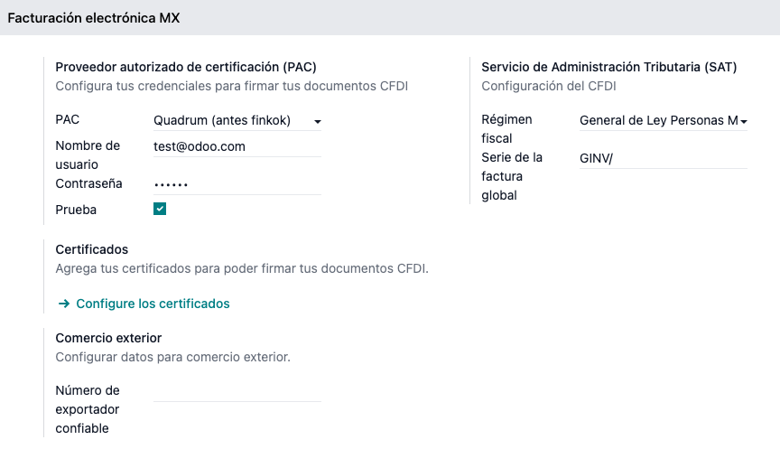

.. tip::
   The default sequence for every company or branch is `GINV/`.

.. _l10n/mx/global-invoice/sales-flow:

Sales flow
^^^^^^^^^^

First, create a dedicated journal in :menuselection:`Accounting --> Configuration --> Journals` to
maintain a separate sequence for global invoices, which function as orders when they are created.

Then, make sure all the sales orders to be signed have the following configuration:

- The :guilabel:`CFDI to public` checkbox is ticked.
- The :guilabel:`Invoice Status` is set to :guilabel:`To Invoice`.

Next, go to :menuselection:`Sales --> To Invoice --> Orders to Invoice`, select all the relevant
sales orders, and click :guilabel:`Create Invoices`. Make sure to untick the :guilabel:`Consolidated
Billing` checkbox, then click :guilabel:`Create Draft Invoice`.

In the list of draft invoices displayed, select all of them, click :icon:`fa-cog`
(:guilabel:`gear`), and select :guilabel:`Confirm entries`. Then, select all the posted invoices
again and, from the same :icon:`fa-cog` (:guilabel:`gear`) menu, select :guilabel:`Create Global
Invoice`.

In the :guilabel:`Create Global Invoice` window, select the :guilabel:`Periodicity` recommended by
an accountant and use the :guilabel:`Date` field to specify the period to invoice. Then, click
:guilabel:`Create`. Verify that all the invoices are signed under the same XML file and share the
same :guilabel:`Fiscal Folio`.

.. note::
   - The selected :guilabel:`Date` is only used to extract the *month* and the *year* for the XML
     file. For the bimonthly periodicity, the month determines the period declared as follows:

     - Months 1 to 12: standard month number, e.g., January is 1 and February is 2
     - January and February: 13
     - March and April: 14
     - May and June: 15
     - July and August: 16
     - September and October: 17
     - November and December: 18

   - Global invoices created this way do not include a PDF attachment, as their information is
     already available in Odoo and is not meant to be seen by customers.

.. example::
   - Selecting the date 01/12/2026 with the monthly periodicity declares month 12 and year 2026.
   - Selecting the date 01/12/2026 with the bimonthly periodicity declares month 18 and year 2026.
   - Selecting the date 01/12/2026 with the daily periodicity declares month 12 and year 2026.

.. tip::
   - Click :guilabel:`Show` in the :guilabel:`CFDI` tab to display the list of all related invoices.
   - Click :guilabel:`Cancel` in the :guilabel:`CFDI` tab to cancel the global invoice in both the
     |SAT| and Odoo.

.. _l10n/mx/reporting:

Electronic accounting reports
-----------------------------

For Mexico, `electronic accounting
<https://www.sat.gob.mx/aplicacion/42150/envia-tu-contabilidad-electronica>`_ refers to the
obligation to keep accounting records and entries through electronic means, and to submit accounting
information on a monthly basis through the |SAT| website.

It consists of three main XML files:

- The updated list of the chart of accounts currently in use
- A monthly trial balance, plus a closing entry report, also known as the *trial balance month 13*
- An export of the journal entries in the general ledger, which is optional except in the case of a
  compulsory audit

The resulting XML files follow the requirements of the `Anexo Técnico de Contabilidad Electrónica
1.3 <https://www.gob.mx/cms/uploads/attachment/file/151135/Anexo24_05012015.pdf>`_.

In addition, the |DIOT| can be generated: a report of the vendors' journal entries involving IVA
taxes, which can be exported as a TXT file.

.. note::
   The following modules must be installed to use these reports:

   - :guilabel:`Odoo Mexican Localization Reports` (`l10n_mx_reports`)
   - :guilabel:`Mexico - Month 13 Trial Balance` (`l10n_mx_reports_closing`)
   - :guilabel:`Odoo Mexican XML Polizas Export` (`l10n_mx_xml_polizas`)

The chart of accounts and the trial balance month 13 reports are available in
:menuselection:`Accounting --> Reporting --> Trial Balance`. The |DIOT| report is available in
:menuselection:`Accounting --> Reporting --> Tax Report`.

.. important::
   The specific characteristics and obligations of the reports to be submitted can change depending
   on the fiscal regime. Always contact an accountant before sending any document to the government.

.. _l10n/mx/chart-of-accounts:

Chart of accounts
~~~~~~~~~~~~~~~~~

The :doc:`chart of accounts <../accounting/get_started/chart_of_accounts>` in Mexico follows a
specific pattern based on the |SAT| documentation `Código agrupador de cuentas
<http://omawww.sat.gob.mx/fichas_tematicas/buzon_tributario/Documents/codigo_agrupador.pdf>`_.

Any account can be created as long as it respects the |SAT| encoding group; the pattern is
`NNN.XX.YY`, `NNN.XX.YYY`, or `NNN.XX.YYY.ZZ`.

.. example::
   `102.01.99`, `401.01.001`, and `401.01.001.16` are valid account codes.

The structure is validated when a new account is created in :menuselection:`Accounting -->
Configuration --> Chart of Accounts`.

Once all the accounts are created, make sure the correct :guilabel:`Tags` are added, as they mark
the nature of the account.

Due to the account hierarchy on parent accounts, set the appropriate :guilabel:`Parent Account` on
each account to create a hierarchy for the reports. Accounts without a parent are level 1 accounts,
accounts below them are level 2, and so on.

.. note::
   - Active accounts must be longer than five digits, or they trigger errors in the report. By
     default, Odoo marks accounts in yellow if the numbering could cause issues later on.
   - If an account is shorter than five characters, mark it as inactive so that the validations do
     not apply to it.
   - Accounts shorter than three characters are not reported in the XML files. This is useful to
     classify accounts.
   - As a good practice, keep only last-level accounts active and all parent accounts inactive. This
     prevents accounting errors, while parent accounts still appear in the reports.

Once everything is set up, go to :menuselection:`Accounting --> Reporting --> Trial Balance` and
click :guilabel:`COA SAT (XML)` to generate an XML file containing all the accounts. This XML file
is ready to be uploaded to the |SAT| website.

.. _l10n/mx/trial-balance:

Trial balance
~~~~~~~~~~~~~

The trial balance reports the initial balance, the credits, and the total balances of the accounts,
provided that their :ref:`numbering <l10n/mx/chart-of-accounts>` is correct.

To generate an XML file of the trial balance, go to :menuselection:`Accounting --> Reporting -->
Trial Balance` and select the date. Click the :icon:`fa-cog` (:guilabel:`gear`) icon and select
:guilabel:`SAT (XML)`. Then, in the :guilabel:`Export SAT` window, select the appropriate
:guilabel:`Submit Type`, depending on whether the trial balance is :guilabel:`Normal` or
:guilabel:`Supplementary`.

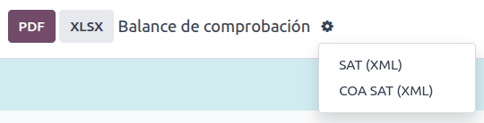

.. _l10n/mx/month-13:

Month 13
********

The *month 13* report is a closing balance sheet that shows the adjustments or movements made in the
accounting to close the year.

To generate this XML file, go to :menuselection:`Accounting --> Accounting --> Journal Entries` and
create a new entry. Add all the amounts to modify and balance the debit and credit of each one.

Then, go to the :guilabel:`Other Info` tab and tick the :guilabel:`Month 13 Closing` checkbox. If
needed, go to :menuselection:`Accounting --> Reporting --> Trial Balance` and select the
:guilabel:`Month 13` date to display the total amount of the year, plus all the additions of the
journal entry. To generate the XML file, click the :icon:`fa-cog` (:guilabel:`gear`) icon, then
select :guilabel:`SAT (XML)`.

.. _l10n/mx/general-ledger:

General ledger
~~~~~~~~~~~~~~

By law, all transactions in Mexico must be recorded digitally. As Odoo automatically creates the
underlying journal entries of all invoices and payments, exporting the general ledger is enough to
comply with the |SAT| audits and tax refunds.

.. tip::
   The report can be filtered by period or by journal.

To create the XML file, go to :menuselection:`Accounting --> Reporting --> General Ledger`, click
the :icon:`fa-cog` (:guilabel:`gear`) icon, then click :guilabel:`XML (Polizas)`. Then, select one
of the four :guilabel:`Export` types:

- :guilabel:`Tax audit`
- :guilabel:`Audit certification`
- :guilabel:`Return of goods`
- :guilabel:`Compensation`

For :guilabel:`Tax audit` and :guilabel:`Audit certification`, add the :guilabel:`Order Number`
provided by the |SAT|. For :guilabel:`Return of goods` and :guilabel:`Compensation`, add the
:guilabel:`Process Number`, also provided by the |SAT|.

.. note::
   To view this report without sending it, use `ABC6987654/99` as the :guilabel:`Order Number` or
   `AB123451234512` as the :guilabel:`Process Number`.

.. _l10n/mx/diot:

DIOT report
~~~~~~~~~~~

The |DIOT| is an additional obligation with the |SAT| that provides the current status of the
creditable and non-creditable payments, withholdings, import taxes, and VAT refunds from the vendor
bills.

Unlike other reports, the |DIOT| is uploaded to a website provided by the |SAT| that contains the
A-29 form. In Odoo, the records of all transactions can be downloaded as a TXT file with 54 columns.
This file can be uploaded to the form, reducing the data to add manually.

The transactions file contains the total amount of the payments registered on vendor bills, broken
down into the corresponding types of IVA. The :guilabel:`VAT`, :guilabel:`Country`, and
:guilabel:`Type of operation` fields are mandatory for all vendors.

To download the |DIOT| report as a TXT file, go to :menuselection:`Accounting --> Reporting --> Tax
Report`. Select the desired month, click the :icon:`fa-cog` (:guilabel:`gear`) icon, and select
:guilabel:`DIOT (TXT)`.

When new taxes are created in the database, two types of tags are available. Tags containing `tax`
go into the tax distribution, and the ones with the base name go on the base of the tax. All the
lines of a VAT tax **must** contain at least one tax grid.

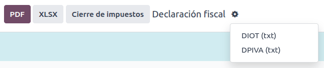

.. important::
   The :guilabel:`Type of Operation` field must be filled in the :guilabel:`Accounting` tab of each
   vendor to prevent validation errors. Make sure foreign customers have their :guilabel:`Country`
   set.

   .. image:: mexico/mx-reports-diot-contact.png
      :alt: DIOT information on a vendor contact.

   Selecting :guilabel:`87 - Global Operations` merges all the vendors that are part of the global
   operations under the generic VAT `XAXX010101000` in the final TXT file.

.. _l10n/mx/accounting-reports:

Accounting reports
------------------

The :ref:`balance sheet <l10n/mx/balance-sheet>` and the :ref:`profit and loss
<l10n/mx/profit-loss>` reports follow the Mexican financial reporting standards.

.. _l10n/mx/balance-sheet:

Balance sheet
~~~~~~~~~~~~~

This report is based on the NIF B-6 standard and is divided into assets, liabilities, and equity,
which reflect the current financial state of the company.

.. _l10n/mx/profit-loss:

Profit and loss
~~~~~~~~~~~~~~~

This report is based on the NIF B-3 standard and is divided into income, operating expenses,
comprehensive financial results (RIF), and taxes, which help identify the net profit or the
financial position of a company.

.. _l10n/mx/external-trade:

Foreign trade
-------------

Foreign trade is a complement to a regular invoice that adds values to both the XML and PDF files of
invoices addressed to a foreign customer, according to the `SAT regulations
<http://omawww.sat.gob.mx/tramitesyservicios/Paginas/complemento_comercio_exterior.htm>`_, such as:

- The specific address of the receiver and of the sender
- A :guilabel:`Tariff Fraction` that identifies the type of product
- The correct :doc:`../accounting/customer_invoices/incoterms`
- Additional information, such as the *certificate of origin* and *special units of measure*

This allows the correct identification of exporters and importers, and expands the description of
the merchandise sold.

Since January 1, 2018, foreign trade is a requirement for taxpayers who carry out export operations
of type A1. While the current |CFDI| is 4.0, the foreign trade complement is on version 2.0.

.. note::
   The :guilabel:`EDI for Mexico (Advanced Features)` (`l10n_mx_edi_extended`) module must be
   installed to use this feature.

.. important::
   Before installing the module, confirm that the business needs this feature; consult an accountant
   if needed.

   The :guilabel:`CFDI to public` checkbox must be ticked when creating foreign invoices.

.. _l10n/mx/external-trade/configuration:

Configuration
~~~~~~~~~~~~~

.. _l10n/mx/external-trade/contacts:

Contacts
********

To configure the company contact for foreign trade, go to :menuselection:`Accounting --> Customers
--> Customers`, remove the default :guilabel:`Customer Invoices` filter, and select the company
name. While the |CFDI| 4.0 requirements include a valid :guilabel:`ZIP` code in the company contact
record, the foreign trade complement adds the requirement that the :guilabel:`City` and the
:guilabel:`State` must also be valid. All three fields must match the `official SAT catalog for
Carta Porte
<http://omawww.sat.gob.mx/tramitesyservicios/Paginas/catalogos_emision_cfdi_complemento_ce.htm>`_,
or an error occurs.

.. warning::
   Add the :guilabel:`City` and :guilabel:`State` in the *contact record* of the company, not in the
   company record itself.

On the contact record, the optional :guilabel:`Locality` and :guilabel:`Colony Code` fields can also
be filled in. These two fields must also match the data of the |SAT|.

All contacts require a foreign trade value, even if the feature itself is not used. The default
value for all contacts is :guilabel:`Does not apply`, which corresponds to the value `01` used on
all invoices with no complement. Four other values are available depending on the need, and the
value is copied automatically onto the new invoices created for the contact.

To configure the contact data of a foreign receiving client, go to :menuselection:`Accounting -->
Customers --> Customers` and select the contact of the foreign client. The following fields must be
completed on the contact to avoid errors:

- The entire company :guilabel:`Address`, including a valid :guilabel:`ZIP` code and the foreign
  :guilabel:`Country`
- The foreign :guilabel:`Tax ID` in the correct format, e.g., `123456789-1` for Colombia
- The :guilabel:`Needs external trade?` checkbox, in the :guilabel:`Sales & Purchase` tab

.. note::
   In the resulting XML and PDF files, the :guilabel:`Tax ID` is automatically replaced by the
   generic VAT for foreign transactions, `XEXX010101000`.

.. _l10n/mx/external-trade/products:

Products
********

All products involved in foreign trade require four additional fields, two of which are exclusive to
foreign trade:

- The :guilabel:`Reference` of the product, in the :guilabel:`General Information` tab
- The :guilabel:`Weight` of the product, in the :guilabel:`Inventory` tab, which must be greater
  than `0`
- The :guilabel:`Tariff Fraction` of the product, in the :guilabel:`Accounting` tab. Use the `VUCEM
  tariff fraction classifier <https://www.ventanillaunica.gob.mx/vucem/Clasificador.html>`_ to find
  the correct value.
- The :guilabel:`UMT Aduana`, in the :guilabel:`Accounting` tab, which must correspond to the
  :guilabel:`Tariff Fraction`

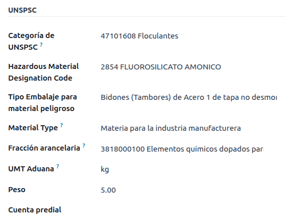

.. tip::
   - If the UoM code of the :guilabel:`Tariff Fraction` is `01`, the correct :guilabel:`UMT Aduana`
     is `kg`.
   - If the UoM code of the :guilabel:`Tariff Fraction` is `06`, the correct :guilabel:`UMT Aduana`
     is `Units`.

.. _l10n/mx/external-trade/invoicing-flow:

Invoicing flow
~~~~~~~~~~~~~~

Foreign trade invoices require converting product prices into a foreign currency, such as USD.
Therefore, :doc:`multicurrency <../accounting/get_started/multi_currency>` **must** be enabled with
the foreign currency activated in the :guilabel:`Currencies` section, and the :guilabel:`Service`
set to :guilabel:`[MX] Bank of Mexico`. To convert product prices, create a :doc:`pricelist
<../../sales/sales/products_prices/prices/pricing>` in the foreign currency.

Then, with the correct exchange rate set up, open the invoice and set the :guilabel:`Incoterm` and,
optionally, the :guilabel:`Certificate Source` field in the :guilabel:`Other Info` tab. The
:guilabel:`External Trade` value can also be changed on a per-invoice basis from that tab.

.. warning::
   The exchange rates have an offset of one day, so a new database needs two days to get the
   expected rate. Add the rate manually if it is needed sooner.

Finally, confirm the invoice as for a regular invoice and click :guilabel:`Send` to sign it via
|CFDI|.

.. _l10n/mx/external-trade-services:

Invoicing services
~~~~~~~~~~~~~~~~~~

Services and merchandise can be invoiced together on the same invoice if the service is set up
correctly. To do so, proceed as follows:

#. Go to :menuselection:`Accounting --> Customers --> Products` and open the relevant service form.
#. In the :guilabel:`Accounting` tab, under the :guilabel:`UNSPSC` section, click the
   :icon:`oi-arrow-right` (:guilabel:`internal link`) icon of the :guilabel:`UMT Aduana` field.
#. Verify that either the :guilabel:`UNSPSC Category` is set to :guilabel:`E48 service unit` or the
   :guilabel:`Customs code` is set to `99`.

Invoicing with either of these codes sets the service price to `0` for customs declarations.

.. _l10n/mx/pos:

Point of sale
=============

The :doc:`Point of Sale <../../sales/point_of_sale>` adaptation of the Mexican localization enables
the creation of invoices that comply with the |SAT| requirements directly from the POS register. It
also allows creating receipt tickets that enable *self-invoicing* through a dedicated portal, as
well as global invoices.

.. _l10n/mx/pos/flow:

Point of sale flow
------------------

On top of the standard :ref:`Point of Sale configuration <pos/use/settings>`, the Mexican
localization requires each payment method to be configured with a correct :guilabel:`Payment Way`
and a :guilabel:`Re-invoicing account` to handle the accounting of the invoices created from the
self-invoicing portal.

.. tip::
   By default, Odoo creates preconfigured payment methods for cash, credit card, and debit card, and
   assigns the :guilabel:`402.04.01 Re-invoicing` account as the default re-invoicing account.

While selling from the POS register, click :guilabel:`Customer` to create or select a customer. The
customer invoicing information, such as the |RFC| or the :guilabel:`Fiscal Regime`, can be reviewed
and modified directly within the session.

After selecting a customer, tick the :icon:`fa-file-text-o` (:guilabel:`Invoice`) checkbox. This
opens a menu to select the :guilabel:`Usage` and to define whether the document is an invoice to the
public. Click :guilabel:`Confirm`, select the payment method, then click :guilabel:`Validate` to
complete the order. The PDF file is then downloaded, and the invoice can be sent by email to the
final customer along with the receipt.

.. tip::
   To create invoices from orders, go to the :guilabel:`Orders` menu, select the order, click
   :guilabel:`Load Order`, and tick the :icon:`fa-file-text-o` (:guilabel:`Invoice`) checkbox. This
   opens the same menu for the :guilabel:`Usage` and :guilabel:`CFDI to public` fields.

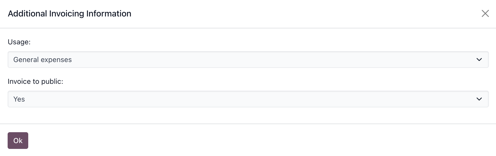

To sign a credit note automatically, tick the :icon:`fa-file-text-o` (:guilabel:`Invoice`) checkbox
when processing a :ref:`refund <pos/use/refund>`.

.. note::
   Credit notes for returned products contain the relation type :guilabel:`03 - Devolución de
   mercancía sobre facturas o traslados previos`.

.. important::
   - In the Mexican localization, positive and negative lines cannot be mixed in a POS session.
   - If a |SAT| validation error occurs, the customer receives a :doc:`pro-forma invoice
     <../../sales/sales/invoicing/proforma>` instead.

.. _l10n/mx/pos/portal:

Self-invoicing portal
---------------------

If the final customer is unsure whether to have the invoice generated at the exact moment of the
sale, a receipt with a QR code or a URL can be provided instead. To do so, proceed as follows:

#. Go to :menuselection:`Point of Sale --> Configuration --> Settings`.
#. Select the point of sale.
#. Scroll to the :guilabel:`Bills & Receipts` section.
#. Enable :guilabel:`Self-service invoicing`.
#. Set the :guilabel:`Print` field to :guilabel:`QR code`, :guilabel:`URL`, or :guilabel:`QR code +
   URL`.

Customers who scan the QR code or follow the URL access a menu where they can add their fiscal
information, including the :guilabel:`Usage` and :guilabel:`Fiscal Regime`.

On the journal entries of the session, the selected re-invoicing account is used to handle the
reversals of the sales entries when invoices are requested, and as the sales account for the new
invoices.

.. seealso::
   :ref:`Refunds in the Point of Sale <pos/use/refund>`

.. _l10n/mx/pos/global-invoice:

Global invoice
--------------

As with regular sales orders, global invoices can be created from the POS register.

To do so, make sure no customer and no invoice option are selected in the payment menu, then go to
:menuselection:`Point of Sale --> Orders --> Orders`. Select all the orders to invoice, click
:icon:`fa-cog` (:guilabel:`gear`), and select :guilabel:`Create Global Invoice`.

As with sales orders, choose the correct :guilabel:`Periodicity` and click :guilabel:`Create`.

This attaches an XML file to each of the selected orders. The XML files can be downloaded from the
:guilabel:`CFDI` tab, where the invoice can also be canceled if needed.

If one of the orders that are part of the global invoice must be addressed to a customer, an invoice
can still be sent by opening the POS register, clicking the :icon:`fa-bars` (:guilabel:`menu`) icon,
then clicking :guilabel:`Orders`. Change the :guilabel:`All active orders` filter to
:guilabel:`Paid`, select the order, and click :icon:`fa-file-text-o` :guilabel:`Invoice`.

.. note::
   Global invoices, like regular invoices, can only be grouped by physical address. The address is
   determined by the one set on the POS invoice journal, so a warning is displayed when attempting
   to invoice two addresses.

.. seealso::
   :ref:`Cash rounding <l10n/mx/invoices/cash-rounding>`

.. _l10n/mx/ecommerce:

eCommerce
=========

The :doc:`eCommerce <../../websites/ecommerce>` adaptation of the Mexican localization adds a step
to the checkout to create invoices that comply with the |SAT| requirements. It collects the fiscal
data of the customer, signs the invoices automatically once the payment is processed, sends the
files to the customers by email, and grants them access to their PDF file from the customer portal.

.. _l10n/mx/ecommerce/flow:

eCommerce flow
--------------

During the checkout process, an :guilabel:`Invoicing info` step is added, which asks
:guilabel:`Do you need an invoice?`. Clicking :guilabel:`I don't need an invoice` skips the step and
leads to the payment.

Clicking :guilabel:`Yes` displays the fiscal fields, which are all required to issue the invoice:
:guilabel:`RFC`, :guilabel:`Company Name`, :guilabel:`Fiscal Regime`, :guilabel:`Usage`, and
:guilabel:`Payment Way`. The customer can also tick the :guilabel:`IEPS Breakdown` checkbox to
request the :ref:`IEPS breakdown <l10n/mx/ieps-breakdown>`. The information is then completed on
the sales order, whose status changes to :guilabel:`To Invoice`.

The invoicing information is synchronized between the order of the customer in the portal and the
sales order: the data entered during the checkout is reflected on the sales order, changes made by
the customer in the portal update the sales order, and changes made on the sales order are reflected
in the portal.

.. important::
   Make sure to add a :guilabel:`UNSPSC Product Category` to the :ref:`shipping product
   <ecommerce/checkout/delivery>`.

If :guilabel:`Automatic Invoicing` is enabled in :menuselection:`Website --> Configuration -->
Settings`, under the :guilabel:`Invoicing` section, the electronic document is signed automatically.

When no invoice is requested, the sales order is marked as :guilabel:`CFDI to public`. A
:ref:`CFDI to public <l10n/mx/cfdi>` invoice is only created if :guilabel:`Automatic Invoicing` is
enabled; otherwise, the sales order keeps the information without being invoiced.

.. _l10n/mx/sales:

Sales
=====

The Sales app contains fields that make invoicing easier. The fields themselves do not change the
sales behavior; they are copied when the invoice is created.

The copied fields are:

- :guilabel:`Payment Way`
- :guilabel:`Payment Policy`
- :guilabel:`CFDI to public`
- :guilabel:`Usage`

A preview of the invoice can also be obtained for validation purposes with the customer by
installing the :doc:`pro-forma invoice <../../sales/sales/invoicing/proforma>` feature. It adds the
fields listed above to the sales order, as well as:

- :guilabel:`Product code`
- :guilabel:`Unit code`
- :guilabel:`Fiscal regime`

.. _l10n/mx/subscriptions:

Subscriptions
=============

For subscriptions, all the sales fields are used to create the recurring invoices. These invoices
are signed and sent by email automatically, with the PDF and XML files attached, without any
additional manual action.

.. important::
   All the invoices generated by the Subscriptions app are always signed automatically, with no
   exception.

.. _l10n/mx/inventory:

Inventory
=========

.. _l10n/mx/inventory/customs:

Customs numbers
---------------

A *customs declaration* (Pedimento Aduanero) is a fiscal document certifying that all contributions
to the fiscal entity, i.e., the |SAT|, have been paid, including for the import and export of goods.

According to the `Annex 20 <http://omawww.sat.gob.mx/tramitesyservicios/Paginas/anexo_20.htm>`_ of
the |CFDI| 4.0, in documents where the invoiced goods come from a first-hand import operation, the
:guilabel:`Customs Number` field must be added to all the product lines involved in the operation,
as well as the date of the document.

.. note::
   The :guilabel:`Odoo Mexico Localization for Stock/Landing` (`l10n_mx_edi_landing`) module must be
   installed, in addition to the :doc:`Inventory <../../inventory_and_mrp/inventory>`,
   :doc:`Purchase <../../inventory_and_mrp/purchase>`, and :doc:`Sales <../../sales/sales>` apps.

.. important::
   Do not confuse this feature with foreign trade. Customs numbers are directly related to importing
   goods, while the foreign trade complement is related to exporting. Consult an accountant before
   making any modification.

.. _l10n/mx/inventory/customs/configuration:

Configuration
~~~~~~~~~~~~~

To track the correct customs number for a specific invoice, Odoo uses :doc:`landed costs
<../../inventory_and_mrp/inventory/inventory_valuation/landed_costs>`. Go to
:menuselection:`Inventory --> Configuration --> Settings` and, in the :guilabel:`Valuation` section,
make sure :guilabel:`Landed Costs` is enabled.

.. tip::
   Adding a :guilabel:`Default Journal` automatically fills in the mandatory :guilabel:`Journal`
   field on landed costs, even though landed costs that only add customs numbers, without
   :guilabel:`Additional Costs`, do not create journal entries.

Then, configure the goods-type products that hold the customs numbers. Create the products and
complete the following three requirements:

- :guilabel:`Tracking` **must** be set to either :guilabel:`By Lots` or :guilabel:`By Unique Serial
  Number`, but **not** :guilabel:`By Quantity`.
- :guilabel:`Invoicing Policy` **must** be set to :guilabel:`Delivered quantities`.
- :doc:`Valuation by lots/serial numbers
  <../../inventory_and_mrp/inventory/inventory_valuation/valuation_by_lots>` **must** be enabled.

This makes the :guilabel:`Customs invoicing` field available in the :guilabel:`Accounting` tab.
Enable the field to use customs numbers with this product.

Make sure the product has a :guilabel:`Product Category` with the following configuration:

- :guilabel:`Costing Method`: either :guilabel:`FIFO` or :guilabel:`AVCO`
- :guilabel:`Inventory Valuation`: either :guilabel:`Periodic` or :guilabel:`Perpetual`

.. note::
   The feature works regardless of whether the :doc:`inventory valuation
   <../../inventory_and_mrp/inventory/inventory_valuation/cheat_sheet>` is set to
   :guilabel:`Periodic (at closing)` or :guilabel:`Perpetual (at invoicing)`.

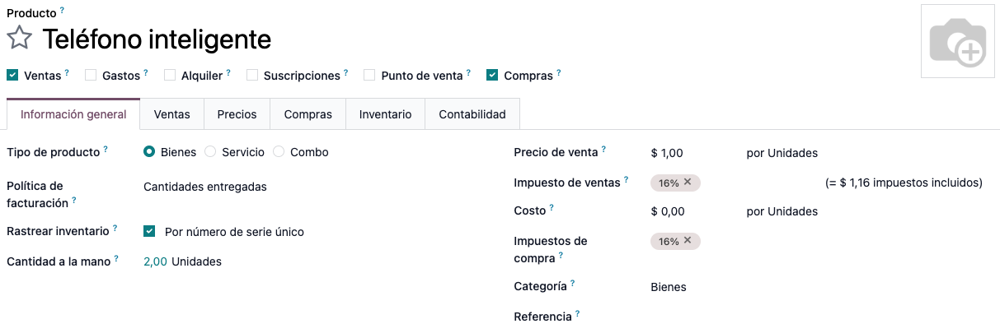

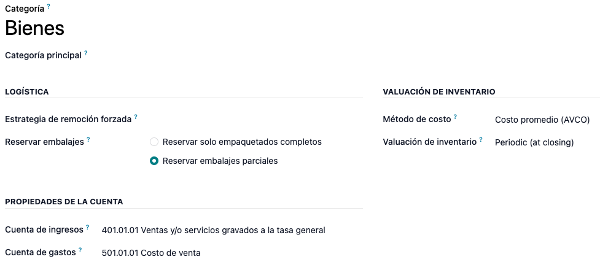

.. _l10n/mx/inventory/customs/flow:

Purchase and sales flow
~~~~~~~~~~~~~~~~~~~~~~~

After configuring the product, follow the standard :doc:`purchase flow
<../../inventory_and_mrp/purchase>`.

Create a purchase order from :menuselection:`Purchase --> Orders --> Purchase Orders`, then confirm
the order to display the :guilabel:`Receipt` smart button. Click the :guilabel:`Receipt` smart
button and :guilabel:`Validate` the receipt.

Go to :menuselection:`Inventory --> Operations --> Landed Costs` and create a new record. In the
:guilabel:`Transfer` field, add the receipt that was just validated, then add the :guilabel:`Customs
number`.

.. tip::
   While costs related to the customs number can be added at this stage of the process, creating a
   landed cost from a vendor bill issued by a customs agent is highly recommended. Learn more about
   :doc:`landed costs <../../inventory_and_mrp/inventory/inventory_valuation/landed_costs>`.

.. warning::
   The :guilabel:`Customs number` field is not editable once it is set, and it cannot be repeated.
   However, the number on the lot or serial number can be fixed later by selecting a different
   landed cost.

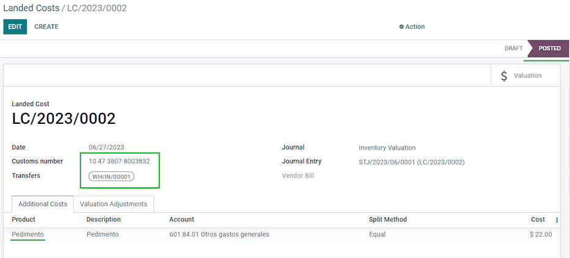

The customs number assigned to a specific lot or serial number is available on its record in
:menuselection:`Inventory --> Products --> Lots/Serial Numbers`. The :guilabel:`L10N Mx Edi Landed
Cost` field can be edited at any time to fix mistakes made when registering the landed cost. Editing
this field automatically updates the :guilabel:`Customs number` and the name of the lot or serial
number.

Next, create a sales order and confirm it. Click the :guilabel:`Delivery` smart button that appears
and carefully review the assigned lots and serial numbers to make sure they are the desired values.
Then, click :guilabel:`Validate` on the delivery order.

Finally, :ref:`create an invoice from the sales order <accounting/inv-process/so>` and confirm it.
The invoice lines are created according to the distribution of the delivery order. If more than one
customs number is selected, Odoo splits the invoice lines by quantity and customs number.

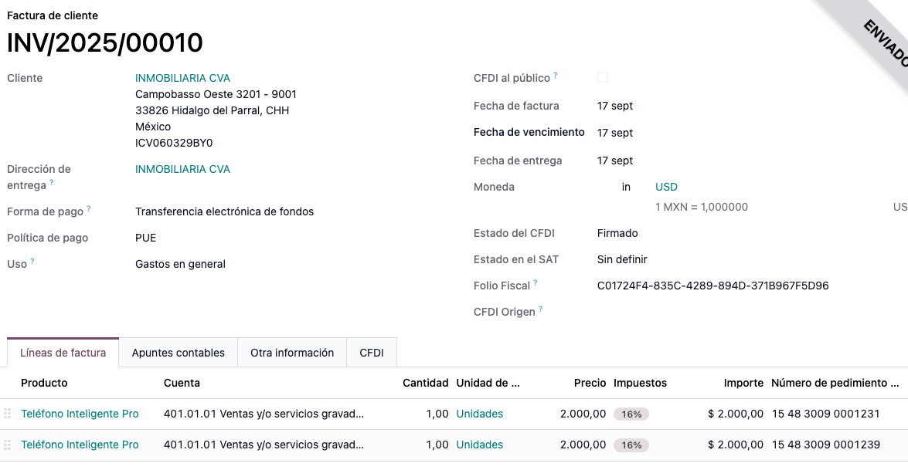

.. _l10n/mx/inventory/delivery-guide:

Delivery guide
--------------

A `Carta Porte <https://www.sat.gob.mx/portal/public/tramites/complemento-carta-porte>`_ is a bill
of lading, a document stating the type, quantity, and destination of the goods being carried.

On July 17, 2024, version 3.1 of this |CFDI| was implemented for all transportation providers,
intermediaries, and owners of goods. Odoo generates a document of type `T` (Traslado), which, unlike
other documents, is created on a delivery order instead of an invoice or a payment.

Odoo creates XML and PDF files with or without ground transport, and processes materials treated as
*dangerous hazards*.

To print the PDF file, the delivery order must be signed by the government. It can then be printed
using the :guilabel:`Print Carta Porte` button on the delivery order.

.. tip::
   The PDF file contains a QR code that allows the authorities to verify the CCP code.

To transport goods between warehouses, the logistic route must contain a delivery-type operation.

.. seealso::
   :doc:`Inter-warehouse replenishment
   <../../inventory_and_mrp/inventory/warehouses_storage/replenishment/resupply_warehouses>`

.. note::
   The :guilabel:`Mexico - Electronic Delivery Guide` (`l10n_mx_edi_stock`) module must be installed
   to use this feature, in addition to the :doc:`Inventory <../../inventory_and_mrp/inventory>` and
   :doc:`Sales <../../sales/sales>` apps.

.. important::
   Odoo does not support the Carta Porte document of type `I` (Ingreso), nor air, train, or marine
   transport.

   Consult an accountant before making any modification.

.. _l10n/mx/inventory/delivery-guide/configuration:

Configuration
~~~~~~~~~~~~~

Odoo manages two different types of |CFDI| of type `T`. Both can be created from either
:doc:`incoming shipments or delivery orders
<../../inventory_and_mrp/inventory/shipping_receiving/daily_operations>`.

- :guilabel:`No Federal Highways` is used when the :guilabel:`Distance to Destination` is `less than
  30 km
  <http://omawww.sat.gob.mx/cartaporte/Paginas/documentos/PreguntasFrecuentes_Autotransporte.pdf>`_.
- :guilabel:`Federal Transport` is used when the :guilabel:`Distance to Destination` exceeds 30 km.

For :guilabel:`No Federal Highways`, no configuration is required beyond the standard requirements
of regular invoicing, i.e., the |RFC| of the customer, the UNSPSC code, etc.

For :guilabel:`Federal Transport`, several configurations must be added to contacts, vehicle setups,
and products. Those configurations are then included in the XML and PDF files.

.. _l10n/mx/inventory/delivery-guide/contacts:

Contacts and vehicles
*********************

As for the foreign trade feature, the :guilabel:`Address` of both the company and the final customer
must be complete. The :guilabel:`ZIP` code, :guilabel:`City`, and :guilabel:`State` must match the
`official SAT catalog for Carta Porte
<http://omawww.sat.gob.mx/tramitesyservicios/Paginas/catalogos_emision_cfdi_complemento_ce.htm>`_.

.. tip::
   The :guilabel:`Locality` field is optional for both addresses.

.. important::
   The origin address used for the delivery guide is set in :menuselection:`Inventory -->
   Configuration --> Warehouses`. While it is set to the company address by default, it can be
   changed to a proper warehouse address.

This feature requires the :doc:`Fleet <../../hr/fleet/new_vehicle>` app to manage vehicles. The
vehicle setup is managed directly on the vehicle, and all the required fields are only visible after
ticking the :guilabel:`L10N Mx Is Freight Vehicle` checkbox.

Ticking the :guilabel:`L10N Mx Is Freight Vehicle` checkbox displays the :guilabel:`MX Parameters`
tab, which contains the mandatory fields needed to create a correct delivery guide. The vehicle
**must** also have a :guilabel:`License Plate`, a :guilabel:`Model Year`, and a :guilabel:`Driver`.

.. tip::
   The :guilabel:`Vehicle Plate Number` and :guilabel:`Number Plate` fields must contain between
   five and seven characters.

The main driver of the vehicle is set in the :guilabel:`Driver` field, and more vehicle operators
can be added in the :guilabel:`Intermediaries` section. The only mandatory fields for driver
contacts are the :guilabel:`Tax ID` and :guilabel:`Operator License`.

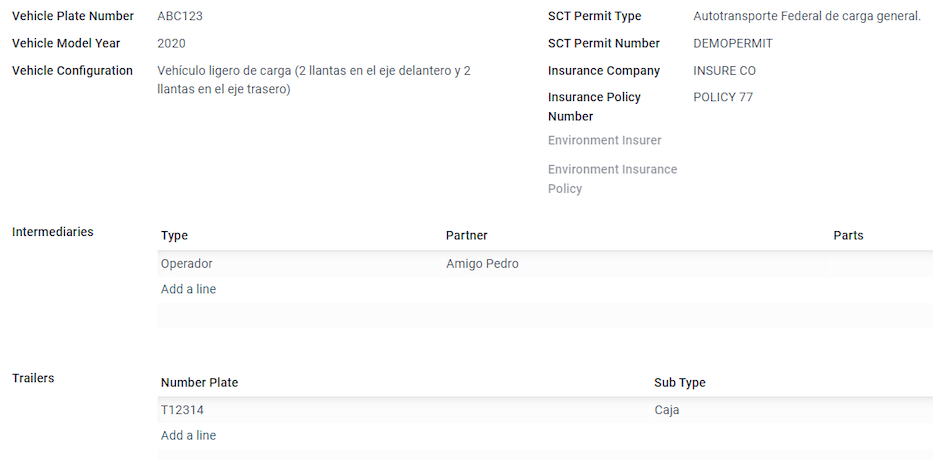

.. tip::
   If the vehicle is rented, or if more intermediaries are required, they can be added in the
   :guilabel:`Intermediaries` field.

.. _l10n/mx/inventory/delivery-guide/products:

Products
********

As for regular invoicing, all products must have a :guilabel:`UNSPSC Product Category`. Two
additional configurations apply to products involved in delivery guides:

- The :guilabel:`Product Type` must be set to :guilabel:`Storable Product` for stock movements to be
  created.
- The :guilabel:`Weight` field, in the :guilabel:`Inventory` tab, must be greater than `0`.

.. warning::
   Creating a delivery guide for a product whose :guilabel:`Weight` is set to `0` triggers an error.
   As the :guilabel:`Weight` is immediately stored on the delivery order, the products must then be
   returned and the delivery order, along with the delivery guide, recreated with the correct
   values.

.. _l10n/mx/inventory/delivery-guide/hazards:

Dangerous hazards
*****************

Certain values of the :guilabel:`UNSPSC Product Category` are considered *dangerous hazards* in the
`official SAT catalog
<http://omawww.sat.gob.mx/tramitesyservicios/Paginas/complemento_carta_porte.htm>`_. These
categories require additional configuration when creating a delivery guide with :guilabel:`Federal
Transport`.

First, select the product from :menuselection:`Inventory --> Products --> Products`. Then, in the
:guilabel:`Accounting` tab, fill in the :guilabel:`Hazardous Material Designation Code` and
:guilabel:`Hazardous Packaging` fields with the correct code from the |SAT| catalog.

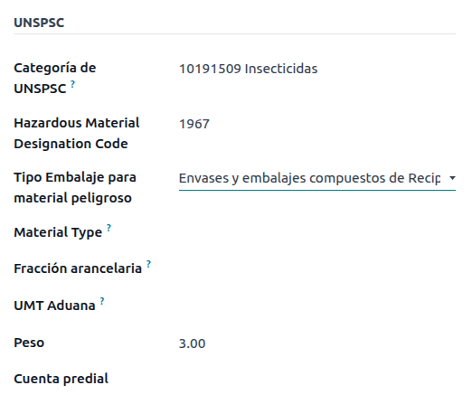

.. important::
   A :guilabel:`UNSPSC Product Category` may or may not be classified as a dangerous hazard, e.g.,
   `01010101`. If it is not dangerous, enter `0` in the :guilabel:`Hazardous Material Designation
   Code` field.

Then, in the :guilabel:`MX Parameters` tab of the vehicle, complete the :guilabel:`Environment
Insurer` and :guilabel:`Environment Insurance Policy` fields. Then, follow the regular
:ref:`delivery guide flow <l10n/mx/inventory/delivery-guide/flow>`.

.. _l10n/mx/inventory/delivery-guide/imports-exports:

Imports and exports
*******************

If a Carta Porte is used for international operations, additional fields must be taken into account.

First, make sure all the relevant products have the following configuration:

- The :guilabel:`UNSPSC Product Category` cannot be :guilabel:`01010101 Does not exist in the
  catalog`.
- The :guilabel:`Tariff Fraction` and :guilabel:`UMT Aduana` must be set, as for the :ref:`foreign
  trade <l10n/mx/external-trade>` flow.
- The :guilabel:`Material Type` must be set.

Then, when creating a delivery guide from a delivery or a receipt, fill in the following fields:

- :guilabel:`Customs Regimes`
- :guilabel:`Customs Document Type`
- :guilabel:`Customs Document Identification`

When creating a delivery guide for a receipt whose :guilabel:`Customs Document Type` is
:guilabel:`Customs number`, two additional fields appear: :guilabel:`Customs Number` and
:guilabel:`Importer`.

.. tip::
   The :guilabel:`Customs Number` field follows the `xx xx xxxx xxxxxxx` pattern, e.g., `15 48 3009
   0001235`, with two spaces between each group.

.. _l10n/mx/inventory/delivery-guide/flow:

Sales and inventory flow
~~~~~~~~~~~~~~~~~~~~~~~~

To create a delivery guide, first create and confirm a sales order from :menuselection:`Sales -->
Orders --> Orders`. Click the :guilabel:`Delivery` smart button that is generated, then
:guilabel:`Validate` the transfer.

Once the status is set to :guilabel:`Done`, the transfer can be edited to select the
:guilabel:`Transport Type` in the :guilabel:`Additional Info` tab.

When using the :guilabel:`No Federal Highways` transport type, save the transfer, then click
:guilabel:`Generate Delivery Guide`. The resulting XML file is available in the chatter.

.. note::
   Other than the UNSPSC category on all products, delivery guides that use :guilabel:`No Federal
   Highways` require no specific configuration to be sent to the government, as they are a |CFDI| of
   type `T` with no delivery guide complement.

When using the :guilabel:`Federal Transport` transport type, the :guilabel:`Vehicle Setup` field is
displayed in the :guilabel:`Transport` section. The :guilabel:`Operator` is taken from the driver of
the vehicle and can be changed for each delivery; the change then applies to that transfer only. To
also replace the driver on the fleet vehicle, click the :guilabel:`Set As Main Driver` button that
appears when the operator is changed.

The :guilabel:`Gross Vehicle Weight` is taken from the :guilabel:`Vehicle Setup` configuration,
where an :guilabel:`Extra Weight` can be added to account for the drivers and the luggage.

.. note::
   Odoo calculates the :guilabel:`Gross Vehicle Weight` as follows:

   .. code-block:: text

      Gross Vehicle Weight = Vehicle Weight + (Weight + Extra Weight) / 1000

Every delivery requires a :guilabel:`Distance to Destination (KM)` value greater than `0`. Finally,
enter the :guilabel:`Delivery Date` and click :guilabel:`Generate Delivery Guide`.

.. note::
   By default, the :guilabel:`Scheduled Date` is filled in and represents the time at which the
   shipment leaves the warehouse. The :guilabel:`Delivery Date` is the time at which the shipment is
   expected to arrive at its destination. Both values are declared in the XML and PDF files.
