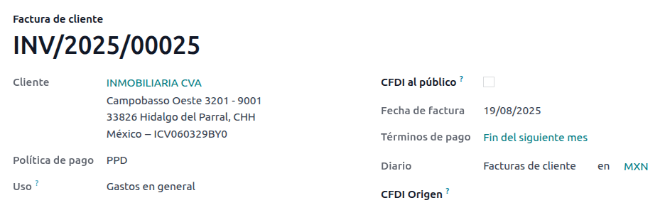

======
Mexico
======

.. _sat-catalog: http://omawww.sat.gob.mx/tramitesyservicios/Paginas/catalogos_emision_cfdi_
   complemento_ce.htm

.. |SAT| replace:: :abbr:`SAT (Servicio de Administración Tributaria)`
.. |DIOT| replace:: :abbr:`DIOT (Declaración Informativa de Operaciones con Terceros)`
.. |PAC| replace:: :abbr:`PAC (Proveedor Autorizado de Certificación / Authorized Certification
   Provider)`
.. |RFC| replace:: :abbr:`RFC (Registro Federal de Contribuyentes)`
.. |PPD| replace:: :abbr:`PPD (Pago en Parcialidades o Diferido/Payment in Installements or
   Deferred)`
.. |PUE| replace:: :abbr:`PUE (Pago en una Sola Exhibición/Payment in a Single Exhibition)`

Webinars
========

A video on the Mexican localization is also available. This video covers how to implement this
localization from scratch, including how to set up the configurations, how to complete common
workflows, and provides an in-depth look at several specific use cases, as well.

- `Video webinar of a complete demo <https://www.youtube.com/watch?v=5cdogjm0GCI>`_.

Introduction
============

The Odoo Mexican localization modules allow for the signing of electronic invoices, according to the
specifications of the |SAT| for `version 4.0 of the CFDI <http://omawww.sat.gob.mx/
tramitesyservicios/Paginas/documentos/Anexo_20_Guia_de_llenado_CFDI.pdf>`_, a legal requirement, as
of January 1, 2022. These modules also add relevant accounting reports (such as: the |DIOT|,
enables foreign trade, and the creation of delivery guides).

.. note::
   In order to electronically sign any documents in Odoo, ensure the *Sign* application is
   installed.

Configuration
=============

Requirements
------------

It is necessary to meet the following requirements before configuring the Mexican localization
modules in Odoo:

.. _mx-requirements:

#. Be registered in the |SAT|, with a valid |RFC|.
#. Have a `Certificate of Digital Seal <https://www.gob.mx/sat/acciones-y-programas/
   certificado-de-sello-digital>`_ (CSD).
#. Choose a PAC (Proveedor Autorizado de Certificación / Authorized Certification Provider).
   Currently, Odoo works with the following |PAC|\s: `Solución Factible
   <https://solucionfactible.com/>`_, `Quadrum (formerly Finkok) <https://cfdiquadrum.com.mx/>`_ and
   `SW Sapien - Smarter Web <https://sw.com.mx/>`_.
#. Have knowledge and experience with billing, sales, and accounting in Odoo. This documentation
   **only** contains the necessary information needed to use Odoo.

Installing modules
------------------

:ref:`Install <general/install>` the following modules to get all the features of the Mexican
localization. The :doc:`Accounting <../accounting>` and *Contacts* modules are required to be
installed for this configuration:

.. list-table::
   :header-rows: 1
   :widths: 25 25 50

   * - Name
     - Technical name
     - Description
   * - :guilabel:`Mexico - Accounting`
     - `l10n_mx`
     - The default :doc:`fiscal localization package <../fiscal_localizations>`, adds accounting
       characteristics for the Mexican localization, such as: the most common taxes and the chart of
       accounts – based on `the SAT account grouping code
       <https://www.gob.mx/cms/uploads/attachment/file/151586/codigo_agrupador.pdf>`_.
   * - :guilabel:`EDI for Mexico`
     - `l10n_mx_edi`
     - Includes all the technical and functional requirements to generate and validate
       :doc:`Electronics Documents <../accounting/customer_invoices/electronic_invoicing>` — based
       on the technical documentation published by the |SAT|. This allows you to send invoices (with
       or without addedums) and payment complements to the government.
   * - :guilabel:`EDI v4.0 for Mexico`
     - `l10n_mx_edi_40`
     - Necessary to create XML documents with the correct specifications of the CFDI 4.0.
   * - :guilabel:`Odoo Mexican Localization Reports`
     - `l10n_mx_reports`
     - Adapts reports for Mexico's Electronic Accounting: Chart of Accounts, Trial Balance, and
       |DIOT|.
   * - :guilabel:`Mexico - Localization Reports for Closing`
     - `l10n_mx_reports_closing`
     - Necessary to create the Closing Entry (Also known as the *month 13th move*).
   * - :guilabel:`Odoo Mexican XML Polizas Export`
     - `l10n_mx_xml_polizas`
     - Allows the export of XML files of Journal Entries for a compulsory audit.
   * - :guilabel:`Odoo Mexican XML Polizas Export Edi bridge`
     - `l10n_mx_xml_polizas_edi`
     - Complements the module `l10n_mx_xml_polizas`.

.. note::
   When installing a database from scratch and selecting :guilabel:`Mexico` as the country, Odoo
   automatically installs the following modules: :guilabel:`Mexico - Accounting`, :guilabel:`EDI for
   Mexico`, and :guilabel:`EDI v4.0 for Mexico`.

The following modules are optional. It's recommended to install them *only* if meeting a specific
requirement. Make sure that they are needed for the business.

.. list-table::
   :header-rows: 1
   :widths: 25 25 50

   * - Name
     - Technical name
     - Description
   * - :guilabel:`EDI for Mexico (Advanced Features)`
     - `l10n_mx_edi_extended`
     - Adds the external trade complement to invoices: A legal requirement for selling products to
       foreign countries.
   * - :guilabel:`EDI v4.0 for Mexico (COMEX)`
     - `l10n_mx_edi_extended_40`
     - Adapts the module `l10n_mx_edi_extended` for CFDI 4.0.
   * - :guilabel:`Mexico - Electronic Delivery Guide`
     - `l10n_mx_edi_stock`
     - Lets you create a *Carta Porte*: A bill of lading that proves to the government you are
       sending goods between A & B with a signed electronic document.
   * - :guilabel:`Electronic Delivery Guide for Mexico CFDI 4.0`
     - `l10n_mx_edi_stock_40`
     - Adapts the module `l10n_mx_edi_stock` for CFDI 4.0
   * - :guilabel:`Odoo Mexico Localization for Stock/Landing`
     - `l10n_mx_edi_landing`
     - Allows managing customs numbers related to landed costs in electronic documents.

Configure your company
----------------------

After installing the correct modules, the next step is to verify that your company is configured
with the correct data. To do so, go to :menuselection:`Settings --> General Settings --> Companies`,
and select :guilabel:`Update Info` under your company name.

Enter the full :guilabel:`Address` in the resulting form, including: :guilabel:`ZIP` code,
:guilabel:`State`, :guilabel:`Country`, and |RFC| (:guilabel:`VAT` number).

According to the requirements of the CFDI 4.0, the name of the main company contact **must**
coincide with your business name registered in the |SAT|, without the legal entity abbreviation.

.. image:: mexico/mx-company-info.png
   :align: center
   :alt: Main company contact requirements for a correct invoicing.

.. important::
   From a legal point of view, a Mexican company **must** use the local currency (MXN). Therefore,
   Odoo does not provide features to manage an alternative configuration. If you want to manage
   another currency, let MXN be the default currency and use a :doc:`pricelist
   <../../sales/sales/products_prices/prices/pricing>`, instead.

Next, go to :menuselection:`Settings --> Accounting --> Electronic Invoicing (MX) --> Fiscal
Regime`, then select the regime that applies to your company from the drop-down list, and click
:guilabel:`Save`.

.. image:: mexico/mx-fiscal-regime.png
   :align: center
   :alt: Fiscal regime configuration in the Accounting settings.

.. tip::
   If you want to test the Mexican localization, the company can be configured with a real address
   within Mexico (including all fields), and add `EKU9003173C9` as the :guilabel:`VAT` and `ESCUELA
   KEMPER URGATE` as the :guilabel:`Company Name`. For the :guilabel:`Fiscal Regime`, use
   :guilabel:`General de Ley Personas Morales`.

Contacts
--------

To create a contact that can be invoiced, go to :menuselection:`Contacts --> Create`. Then, enter
the contact name, full :guilabel:`Address` including: :guilabel:`ZIP` code, :guilabel:`State`,
:guilabel:`Country`, and |RFC| (:guilabel:`VAT` number).

.. important::
   As with your own company, all of your contacts needs to have their correct business name
   registered in the |SAT|. This also applies to the :guilabel:`Fiscal Regime`, which needs to be
   added in the :guilabel:`MX EDI` tab.

Taxes
-----

Some additional configurations for factor type and tax objects need to be added to the sales taxes
in order to properly sign invoices.

Factor type
~~~~~~~~~~~

The *Factor Type* field is pre-loaded in the default taxes. If new taxes are created, you need to
make sure to configure this field. To do so, go to :menuselection:`Accounting --> Configuration -->
Taxes`, then enable the :guilabel:`Factor Type` field in the :guilabel:`Advanced Options` tab for
all records, with the :guilabel:`Tax Type` set as :guilabel:`Sales`.

.. image:: mexico/mx-factor-type.png
   :align: center
   :alt: Factor Type Sales tax type configuration.

.. tip::
   Mexico manages two different kinds of 0% VAT to accommodate two scenarios:

   - *0% VAT* set the :guilabel:`Factor Type` as :guilabel:`Tasa`
   - *VAT Exempt* set the :guilabel:`Factor Type` as :guilabel:`Exento`

Tax object
~~~~~~~~~~

One requirement of the CFDI 4.0 is that the resulting XML file needs (or does not need) to break
down the taxes of the operation. There are three different possible values that are added in the XML
file:

- `01`: Not subject to tax - this value is added automatically if your invoice line doesn't contain
  any taxes.
- `02`: Subject to tax - this is the default configuration of any invoice line that contains taxes.
- `03`: Subject to tax and not forced to break down - this value can be triggered on-demand for
  certain customers to replace the value 02.

To use the `03` value, navigate to :menuselection:`Contacts --> your customer's invoice --> MX EDI
tab`, and activate the :guilabel:`No Tax Breakdown` checkbox.

.. image:: mexico/mx-tax-breakdown.png
   :align: center
   :alt: No Tax Breakdown option on the MX EDI tab of the customer's invoice.

.. important::
   The :guilabel:`No Tax Breakdown` value applies **only** to specific fiscal regimes and/or taxes.
   Consult your accountant first to see if it is needed for your business before making any
   modification.

Other tax configurations
~~~~~~~~~~~~~~~~~~~~~~~~

When registering a payment, Odoo will carry out the movement of taxes from the *Cash Basis
Transition Account* to the account set in the :guilabel:`Definition` tab. For such movement, a tax
base account will be used: (`Base Imponible de Impuestos en Base a Flujo de Efectivo`) in the
journal entry when reclassifying taxes. **Do not delete this account**.

If you create a new tax in :menuselection:`Accounting --> Configuration --> Taxes`, you need to add
the correct :guilabel:`Tax Grids` for it (`IVA`, `ISR` or `IEPS`). Odoo **only** supports these
three groups of taxes.

.. image:: mexico/mx-taxes-config.png
   :align: center
   :alt: Tax accounts available for Odoo.

Products
--------

To configure products, go to :menuselection:`Accounting --> Customers --> Products`, then select a
product to configure, or :guilabel:`Create` a new one. In the :guilabel:`Accounting` tab, and in the
:guilabel:`UNSPSC Product Category` field, select the category that represents the product. The
process can be done manually, or through :doc:`a bulk import <../../general/export_import_data>`.

.. note::
   All products need to have an |SAT| code associated with them in order to prevent validation
   errors.

Electronic invoicing
--------------------

PAC credentials
~~~~~~~~~~~~~~~

After you have processed your `Private Key (CSD)
<https://www.sat.gob.mx/aplicacion/16660/genera-y-descarga-tus-archivos-a-traves-de-la-aplicacion-
certifica>`_ with the |SAT|, you **must** register directly with the :ref:`PAC <mx-requirements>` of
your choice before you start creating invoices from Odoo.

Once you've created your account with any of these providers, go to :menuselection:`Settings -->
Accounting --> Electronic Invoicing (MX)`. Under the :guilabel:`MX PAC` section, enter the name of
your |PAC| with your credentials (:guilabel:`PAC username` and :guilabel:`PAC password`).

.. image:: mexico/mx-pac-account.png
   :align: center
   :alt: Configuring PAC credentials from the Accounting settings.

.. tip::
   If you do not have credentials, but want to test the electronic invoicing, you can activate the
   :guilabel:`MX PAC test environment` checkbox, and select :guilabel:`Solucion Factible` as the
   |PAC|. You do not need to add a username or password for a test environment.

.cer and .key certificates
~~~~~~~~~~~~~~~~~~~~~~~~~~

The `digital certificates of the company
<https://www.gob.mx/tramites/ficha/certificado-de-sello-digital/SAT139>`_ must be uploaded within
the :guilabel:`MX Certificates` section. To do so, navigate to :menuselection:`Settings -->
Accounting --> Electronic Invoicing (MX)`. Under the :guilabel:`MX Certificates` section, select
:guilabel:`Add a line`, and a window will open. Click :guilabel:`Create`, and from there, upload
your digital :guilabel:`Certificate` (:file:`.cer` file), your :guilabel:`Certificate Key`
(:file:`.key` file), and your :guilabel:`Certificate Password`. To finish, click on :guilabel:`Save
& Close`.

.. image:: mexico/mx-certificates.png
   :align: center
   :alt: Certificate and key upload inputs.

.. tip::
   If you still do not have one of the contracted |PAC|\s and you want to test electronic invoicing,
   you can use the following |SAT| test certificates:

   - :download:`Certificate <mexico/certificate.cer>`
   - :download:`Certificate Key <mexico/certificate.key>`
   - **Password**: ``12345678a``

Workflows
=========

Electronic invoicing
--------------------

The invoicing process in Odoo is based on `Annex 20
<http://omawww.sat.gob.mx/tramitesyservicios/Paginas/anexo_20.htm>`_ version 4.0 of electronic
invoicing of the |SAT|.

Customer invoices
~~~~~~~~~~~~~~~~~

To start invoicing from Odoo, a customer invoice must be created using the :doc:`standard invoicing
flow <../accounting/customer_invoices>`.

While the document is in draft mode, changes can be made to it (the correct :guilabel:`Payment Way`
or :guilabel:`Usage` that the customer might require can be added, for example.)

After you :guilabel:`Confirm` the customer invoice, a blue message appears stating: :guilabel:`The
invoice will be processed asynchronously by the following E-invoicing service: CFDI (4.0)`.

Pressing the :guilabel:`Process Now` button sends the document to the government so it can be
signed. After receiving the signed document back from the government, the :guilabel:`Fiscal Folio`
field appears on the document, and the XML file is attached in the chatter.

.. tip::
   If you click :guilabel:`Retry` in the :guilabel:`SAT status` field on the invoice, you can
   confirm if the XML file is valid in the |SAT|.

   If you are in a testing environment, you will always receive the message :guilabel:`Not Found`.

To send the signed invoice to your client by mail, you can send both the XML and PDF files together,
directly from Odoo, by clicking the :guilabel:`Send & Print` button. You can also download the PDF
file to your computer, by clicking the :guilabel:`Print` button, and selecting the desired print
option.

Credit notes
~~~~~~~~~~~~

While an invoice is a document type "I" (Ingreso), a credit note is a document type "E" (Egreso).

The only addition to the :doc:`standard flow for credit notes
<../accounting/customer_invoices/credit_notes>` is that, as a requirement of the |SAT|, there has
to be a relation between a credit note and an invoice through the fiscal folio.

Because of this requirement, the field :guilabel:`CFDI Origin` adds this relation with a `01|`,
followed by the fiscal folio of the original invoice.

.. image:: mexico/mx-creating-credit-note.png
   :align: center
   :alt: Example CFDI Origin number.

.. tip::
   For the :guilabel:`CFDI Origin` field to be automatically added, use the :guilabel:`Add Credit
   Note` button from the invoice, instead of creating it manually.

Payment complements
~~~~~~~~~~~~~~~~~~~

Payment policy
**************

One  addition of the Mexican localization is the :guilabel:`Payment Policy` field . `According to
the SAT documentation <https://www.sat.gob.mx/consultas/92764/comprobante-de-recepcion-de-pagos>`_,
there may be 2 types of payments:

- `PUE` (Pago en una Sola Exhibición/Payment in a Single Exhibition)
- `PPD` (Pago en Parcialidades o Diferido/Payment in Installements or Deferred)

   .. seealso::
      :doc:`../../inventory_and_mrp/inventory/warehouses_storage/inventory_valuation/integrating_landed_costs`

The difference lies in the *Due Date* or *Payment Terms* of the invoice.

To configure |PUE| invoices, navigatge to :menuselection:`Accounting --> Customers --> Invoices`,
and either select an invoice :guilabel:`Due Date` within the same month, or choose a payment term
that does not imply changing the due month (immediate payment, 15 days, 21 days, all falling within
the current month).

.. image:: mexico/mx-pue-payment.png
   :align: center
   :alt: Example of an invoice with the PUE requirements.

.. tip::
   Some :guilabel:`Payment Terms` are already installed by default, and can be managed from
   :menuselection:`Accounting --> Configuration --> Payment Terms`.

To configure |PPD| invoices, navigate to :menuselection:`Accounting --> Customers --> Invoices`, and
select an invoice with a :guilabel:`Due Date` after the first day of the following month. This also
applies if your :guilabel:`Payment Term` is due in the following month.

.. important::
   Because the |PPD| policy implies that an invoice is not going to get paid at the moment, the
   correct :guilabel:`Payment Way` for the |PPD| invoices is :guilabel:`99 - Por Definir` (To
   define).

Payment flow
************

In both cases, the payment process in Odoo :doc:`is the same <../accounting/customer_invoices>`, the
main difference being payments related to |PPD| invoices trigger the creation of a document type "P"
(Pago).

If a payment is related to a |PUE| invoice, it can be registered with the wizard, and be associated
with the corresponding invoice. To do so, navigate to :menuselection:`Accounting --> Customers -->
Invoices`, and select an invoice. Then, click the :guilabel:`Register Payment` button. The invoice
status changes to :guilabel:`In Payment`, since the payment is effectively validated when it is bank
reconciled.

.. seealso::
   :doc:`../accounting/bank/reconciliation`

While this process is the same for PPD invoices, the addition of the creating an :doc:`electronic
document <../accounting/customer_invoices/electronic_invoicing>` means some additional requirements
are needed to correctly send the document to the |SAT|.

From an invoice, you need to confirm the specific :guilabel:`Payment Way` where you received the
payment. Because of this, the :guilabel:`Payment Way` field **cannot** be set as `99 - Por Definir
(To Define)`.

If you are going to add a bank account number in the :guilabel:`Accounting` tab of a customer's
contact card, it must have a valid account number.

.. note::
   The exact configurations are in the `Anexo 20 of the SAT
   <http://omawww.sat.gob.mx/tramitesyservicios/Paginas/anexo_20.htm>`_. Usually, the
   :guilabel:`Bank Account` needs to be 10 or 18 digits for transfers, 16 for credit or debit cards.

If a payment is related to a signed invoice with the :guilabel:`Payment Policy` `PPD`, Odoo
generates the corresponding payment complement automatically, once you click :guilabel:`Process
Now`.

.. image:: mexico/mx-signed-complement.png
   :align: center
   :alt: CFDI (4.0) E-invoicing service process payment now message.

.. warning::
   A payment in MXN **cannot** be used to pay multiple invoices in USD. Instead, the payment should
   be separated into multiple payments, using the :guilabel:`Register Payment` button on the
   corresponding invoices.

Invoice cancellations
~~~~~~~~~~~~~~~~~~~~~

It is possible to cancel the EDI documents sent to the |SAT|. According to the `Reforma Fiscal 2022
<https://www.sat.gob.mx/consultas/91447/nuevo-esquema-de-cancelacion>`_, since January 1st, 2022,
there are two requirements for this:

- With all cancellation requests, you **must** specify a *cancellation reason*.
- After 24 hours have passed since the creation of the invoice, the client **must** be asked to
  accept the cancellation.

There are four different cancellation reasons. In Odoo, you can cancel invoices with the reasons *01
Invoices sent with errors with a relation*, and *02 Invoices sent with errors without a relation*.

The following sections break down the process of canceling invoices for each cancellation reason in
Odoo.

.. important::
   Odoo has certain limitations to canceling invoices in the |SAT|: The reasons 03 and 04
   (*Operation did not take place* and *Nominative transactions related to a global invoice*,
   respectively) are not currently supported by Odoo. For this, you need to cancel the invoice
   directly in the |SAT|, and press :guilabel:`Retry` in the :guilabel:`SAT Status field`.

01 - invoices sent with errors with a relation
**********************************************

This cancellation reason must be used when a new invoice needs to substitute the original one, due
to an error in any field.

Begin by navigating to :menuselection:`Accounting --> Customers --> Invoices`, and select the old
invoice. Copy the :guilabel:`Fiscal Folio` from the old invoice. Then, navigate to the new invoice,
and in the :guilabel:`CFDI Origin` field, add the value `04|` and paste the :guilabel:`Fiscal Folio`
of the old invoice after the value. Finally, sign the new document.

Next, navigate back to the old invoice, and notice the :guilabel:`Substituted By` field is now
available. Click the :guilabel:`Request EDI Cancellation` button on the old invoice, and then click
:guilabel:`Process Now` in the blue section that appears. The invoice status changes to
:guilabel:`Canceled`, and a confirmation is logged in the chatter.

Now, the invoice should be canceled in the |SAT| as well. You can confirm this was done correctly,
by pressing :guilabel:`Retry` in the |SAT| status field.

If the document was canceled more than 24 hours after its creation, you may need to ask the client
to accept the cancellation in their “Buzón Tributario” directly from the `SAT website
<https://www.sat.gob.mx/home>`_.

.. note::
   The `04|` is only a code that helps Odoo to perform this process. It has no relation to the
   method 04 reason for cancellation.

.. image:: mexico/mx-01-invoice-cancellation-substitute.png
   :align: center
   :alt: Old invoice with CFDI Origin.

.. image:: mexico/mx-01-invoice-cancellation.png
   :align: center
   :alt: Invoice with the Substituted By field referencing the CFDI Origin invoice.

02 - invoices sent with errors without a relation
*************************************************

This cancellation reason has to be used when an invoice was sent with an error in any field, and
does not need to be replaced by another one.

For this case, navigate to :menuselection:`Accounting --> Customers --> Invoices`, and select the
old invoice. From here, the only requirement is to click the :guilabel:`Request EDI Cancellation`
button, and then click the :guilabel:`Process Now` button.

Because the field :guilabel:`Substituted By` does not appear when using this cancellation reason,
the |SAT| should automatically detect that the cancellation reason is 02.

Payment cancellations
*********************

It is also possible to cancel *Payment Complements*. For this, go to the payment, via
:menuselection:`Accounting --> Customers --> Payments`, and select :guilabel:`Request EDI
Cancellation`. As with invoices, a blue button will appear. Click :guilabel:`Process now`, and the
document will be sent to the |SAT|. After a few seconds, you can click :guilabel:`Retry` to confirm
the current |SAT| status.

Finally, the payment status is moved to :guilabel:`Cancelled`.

.. note::
   Just like invoices, when you create a new *Payment Complement*, you can add the relation of the
   original document, by adding a `04|` plus the fiscal folio in the :guilabel:`CFDI Origin` field.

Invoicing special use cases
~~~~~~~~~~~~~~~~~~~~~~~~~~~

CFDI to public
**************

If the customer you are selling goods or services to does not require an invoice, a *CFDI to Public*
has to be created.

If you use the :guilabel:`Customer` name `PUBLICO EN GENERAL`, an error will be triggered. This is a
main change in the CFDI 4.0 that requires invoices with that specific name to need additional
fields, which Odoo does not currently support. So, for a *CFDI to Public* to be created, you need to
add any name to your customer that is **not** `PUBLICO EN GENERAL`. (For example: `CLIENTE FINAL`).

In addition to this, it is required that the :guilabel:`ZIP` code of your company is added, the
generic |RFC| is set as `XAXX010101000`, and the :guilabel:`Fiscal Regime` of your customer must be
set as: `Sin obligaciones fiscales`.

.. image:: mexico/mx-cfdi-to-public.png
   :align: center
   :alt: CFDI to Public Customer field configuration.

Multicurrency
*************

The main currency in Mexico is MXN. While this is mandatory for all Mexican companies, it is
possible to send and receive invoices (and payments) in different currencies. To enable the use of
:doc:`multicurrency <../accounting/get_started/multi_currency>`, navigate to the
:menuselection:`Accounting --> Settings --> Currencies`, and set :guilabel:`Mexican Bank` as the
:guilabel:`Service` in the :guilabel:`Automatic Currency Rates` section. Then, set the
:guilabel:`Interval` field to the frequency you wish to update the exchange rates.

This way, the XML file of the document will have the correct exchange rate, and the total amount,
in both the foreign currency and in MXN.

It is highly recommended to use :doc:`a bank account for each currency
<../accounting/bank/foreign_currency>`.

.. note::
   The only currencies that automatically update their exchange rate daily are: USD, EUR, GBP, and
   JPY.

.. image:: mexico/mx-multicurrency-1.png
   :align: center
   :alt: Multi-currency configuration in the Accounting settings.

Down payments
*************

There can be cases where you receive a payment in advance from a customer that needs to be applied
to an invoice later. In order to do this in Odoo, it is required to properly link invoices to each
other with the :guilabel:`CFDI Origin` field. To do so, it is necessary to have the :doc:`Sales
<../../sales>` app installed.

.. seealso::
   `The official documentation for registration of down payments in Mexico
   <http://omawww.sat.gob.mx/tramitesyservicios/Paginas/documentos/Caso_uso_Anticipo.pdf>`_.

First, navigate to the :menuselection:`Sales` app to create a product `Anticipo` and configure it.
The :guilabel:`Product Type` must be :guilabel:`Service`, and use the :guilabel:`UNSPSC Category`
must be: `84111506 Servicios de facturación`.

Then, go to :menuselection:`Sales --> Settings --> Invoicing --> Down Payments`, and add the
*Anticipo* product as the default.

Create a sales order with the total amount, and create a down payment (either using a percentage or
fixed amount). Then, sign the document, and :guilabel:`Register the Payment`.

When the time comes for the customer to get the final invoice, create it again from the same sales
order. In the :guilabel:`Create Invoices` wizard, select :guilabel:`Regular Invoice`, and uncheck
:guilabel:`Deduct down payments`.

Then, copy the :guilabel:`Fiscal Folio` from the first invoice, and paste it into the
:guilabel:`CDFI Origin` of the second invoice, adding the prefix `07|` before the value. Then, sign
the document.

After this, create a credit note for the first invoice. Copy the :guilabel:`Fiscal Folio` from the
second invoice, and paste it in the :guilabel:`CFDI Origin` of the credit note, adding the prefix
`07|`. Then, sign the document.

With this, all electronic documents are linked to each other. The final step is to fully pay the new
invoice. At the bottom of the new invoice, you can find the credit note in the
:guilabel:`Outstanding credits` - add it as payment. Finally, register the remaining amount with the
:guilabel:`Register Payment` wizard.

External trade
--------------

The external trade is a complement to a regular invoice that adds certain values in both the XML and
PDF, to invoices with a foreign customer according to `SAT regulations
<http://omawww.sat.gob.mx/tramitesyservicios/Paginas/complemento_comercio_exterior.htm>`_, such as:

- The specific address of the receiver and the sender
- The addition of a :guilabel:`Tariff Fraction` that identifies the type of product
- The correct :guilabel:`Incoterm` (International Commercial Terms), among others (*certificate of
  origin* and *special units of measure*).

This allows the correct identification of exporters and importers, in addition to expanding the
description of the merchandise sold.

Since January 1, 2018, external trade is a requirement for taxpayers, who carry export operations of
type A1. While the current CFDI is 4.0, the external trade is currently on version 1.1

In order to use this feature, the modules :guilabel:`l10n_mx_edi_extended` and
:guilabel:`l10n_mx_edi_extended_40` have to be installed.

.. important::
   Before installing, make sure your business needs to use this feature. Consult your accountant
   first, if needed, before installing any modules.

Configuration
~~~~~~~~~~~~~

Contacts
********

To configure your company contact for external trade, navigate to :menuselection:`Accounting -->
Customers --> Customers`, and select your :guilabel:`Company`. While the CFDI 4.0 requirements ask
you to add a valid :guilabel:`ZIP` code in your contact, the external trade complement adds the
requirement that your :guilabel:`City` and the :guilabel:`State` must also be valid. All three
fields must coincide with the `Official SAT Catalog <sat-catalog_>`_, or you will receive an error.

.. warning::
   Add the :guilabel:`City` and :guilabel:`State` in the company's *contact*, not in the company
   itself. You can find your company's contact in :menuselection:`Accounting --> Customers -->
   Customers`.

The fields :guilabel:`Locality` and :guilabel:`Colony Code` are optional and can be added in the
company directly in :menuselection:`Settings --> General Settings --> Companies`. These two fields
have to coincide with the data in the |SAT|.

.. image:: mexico/mx-external-trade-rescompany.png
   :align: center
   :alt: Optional external trade company fields.

To configure the contact data for a foreign receiving client, navigate to :menuselection:`Accounting
--> Customers --> Customers`, and select the foreign client's contact. The contact must have the
following fields completed to avoid errors:

#. The entire company :guilabel:`Address`, including a valid :guilabel:`ZIP` code and the foreign
   :guilabel:`Country`.
#. The format of the foreign :guilabel:`VAT` (tax identification number, for example: Colombia
   `123456789-1`)
#. In the :guilabel:`MX EDI` tab, you need to address if the customer receives goods for a period of
   time temporarily (:guilabel:`Temporary`) or permanently (:guilabel:`Definitive`).

.. important::
   If the new contact was created by duplicating another existing contact from Mexico, make sure to
   delete any carried over information from the :guilabel:`Fiscal Regime` field. In addition, do not
   enable the :guilabel:`No Tax Breakdown` option. Selecting this option hides mandatory fields that
   are required for external trade contact configuration.

.. image:: mexico/mx-external-trade-customer-contact.png
   :align: center
   :alt: Required external trade customer fields.

.. note::
   In the resulting XML and PDF files, the :guilabel:`VAT` is automatically replaced by the generic
   VAT for abroad transactions: `XEXX010101000`.

Products
********

All products involved with external trade have four fields that are required, two of them exclusive
to external trade.

#. The :guilabel:`Internal Reference` of the product is in the :guilabel:`General Information` tab.
#. The :guilabel:`Weight` of the product must be more than `0`.
#. The `correct  <https://www.ventanillaunica.gob.mx/vucem/Clasificador.html>`_ :guilabel:`Tariff
   Fraction` of the product in the :guilabel:`Accounting` tab.
#. The :guilabel:`UMT Aduana` corresponds to the :guilabel:`Tariff Fraction`.

.. image:: mexico/mx-external-trade-product.png
   :align: center
   :alt: Required external trade product fields.

.. tip::
   - If the UoM code of the :guilabel:`Tariff Fraction` is `01`, the correct :guilabel:`UMT Aduana`
     is `kg`.
   - If the UoM code of the :guilabel:`Tariff Fraction` is `06`, the correct :guilabel:`UMT Aduana`
     is `Units`.

Invoicing flow
~~~~~~~~~~~~~~

Before creating an invoice, it is important to take into account that external trade invoices
require to convert the amounts of your product into USD. Therefore, :doc:`multicurrency
<../accounting/get_started/multi_currency>` **must** be enabled and *USD* **must** be activated in
the :guilabel:`Currencies` section. The correct :guilabel:`Service` to run is :guilabel:`Mexican
Bank`.

Then, with the correct exchange rate set up in :menuselection:`Accounting --> Settings -->
Currency`, the only fields left are :guilabel:`Incoterm` and the optional :guilabel:`Certificate
Source` in the :guilabel:`Other Info` tab.

.. image:: mexico/mx-external-trade-other-info.png
   :align: center
   :alt: External trade Other Info tab of a product.

Finally, sign the invoice with the same process as a regular invoice, and click the
:guilabel:`Process Now` button.

Delivery guide
--------------

A `Carta Porte <https://www.sat.gob.mx/consultas/68823/complemento-carta-porte->`_ is a bill of
lading: a document that states the type, quantity, and destination of goods being carried.

On December 1st, 2021, version 2.0 of this CFDI was implemented for all transportation providers,
intermediaries, and owners of goods. Odoo is able to generate a document type "T" (Traslado), which,
unlike other documents, is created in a delivery order instead of an invoice or payment.

Odoo can create XML and PDF files with (or without) ground transport, and can process materials that
are treated as *Dangerous Hazards*.

In order to use this feature, the modules :guilabel:`l10n_mx_edi_extended`,
:guilabel:`l10n_mx_edi_extended_40`, :guilabel:`l10n_mx_edi_stock` and
:guilabel:`l10n_mx_edi_stock_40` have to be installed.

In addition to this, it is necessary to have the :doc:`Inventory
<../../inventory_and_mrp/inventory>` and :doc:`Sales <../../sales/sales>` apps installed, as well.

.. important::
   Odoo does not support Carta Porte type document type "I" (Ingreso), air, or marine transport.
   Consult your accountant first if this feature is needed before doing any modifications.

Configuration
~~~~~~~~~~~~~

Odoo manages two different types of CFDI:

- **No Federal Highways**: Is used when the *Distance to Destination* is `less than 30 KM
  <http://omawww.sat.gob.mx/cartaporte/Paginas/documentos/PreguntasFrecuentes_Autotransporte.pdf>`_.
- **Federal Transport**: Is used when the *Distance to Destination* exceeds 30 KM.

Other than the standard requirements of regular invoicing (The |RFC| of the customer, the UNSPSC
code, etc.), if you are using *No Federal Highways*, no external configuration is needed.

For *Federal Transport*, several configurations have to be added to contacts, vehicle setups, and
products. Those configurations are added to the XML and PDF files.

Contacts and vehicles
*********************

Like the external trade feature, the :guilabel:`Address` in both the company and the final customer
must be complete. The :guilabel:`ZIP` code, :guilabel:`City`, and :guilabel:`State` must coincide
with the `Official SAT Catalog for Carta Porte <sat-catalog_>_`.

.. tip::
   The field, :guilabel:`Locality`, is optional for both addresses.

.. image:: mexico/mx-delivery-guide-contacts.png
   :align: center
   :alt: Delivery guide contact configuration.

.. important::
   The origin address used for the delivery guide is set in :menuselection:`Inventory -->
   Configuration --> Warehouses Management --> Warehouses`. While this is set as the company address
   by default, you can change it according to your correct warehouse address.

Another addition to this feature is the :guilabel:`Vehicle Setups` menu found in
:menuselection:`Inventory --> Settings --> Mexico`. This menu lets you add all the information
related to the vehicle used for the delivery order.

All fields are mandatory to create a correct delivery guide.

.. tip::
   The fields, :guilabel:`Vehicle Plate Number` and :guilabel:`Number Plate`, must contain between
   5 to 7 characters.

In the :guilabel:`Intermediaries` section, you must add the operator of the vehicle. The only
mandatory fields for this contact are the :guilabel:`VAT` and :guilabel:`Operator Licence`.

.. image:: mexico/mx-delivery-guide-vehicle.png
   :align: center
   :alt: Delivery guide vehicle configuration.

Products
********

Similar to regular invoicing, all products must have a :guilabel:`UNSPSC category`. In addition to
this, there are two extra configurations for products involved in delivery guides:

- The :guilabel:`Product Type` must be set as :guilabel:`Storable Product` for stock movements to be
  created.
- In the :guilabel:`Inventory` tab, the field :guilabel:`Weight` should have more than `0`.

.. warning::
   Creating a delivery guide of a product with the value `0` will trigger an error. As the
   :guilabel:`Weight` has been already stored in the delivery order, it is needed to return the
   products, and create the delivery order (and delivery guide) again with the correct amounts.

.. image:: mexico/mx-delivery-guide-products.png
   :align: center
   :alt: Delivery guide product configuration.

Sales and inventory flow
~~~~~~~~~~~~~~~~~~~~~~~~

To create a delivery guide, first, you need to create and confirm a sales order from
:menuselection:`Sales --> Sales Order`. This generates a :guilabel:`Delivery` smart button. Click
it, and :guilabel:`Validate` the transfer.

After the status is set to :guilabel:`Done`, you can edit the transfer, and select the
:guilabel:`Transport Type` (either :guilabel:`No Federal Highways` or :guilabel:`Federal
Transport`).

If your delivery guide has the type :guilabel:`No Federal Highways`, you can save the transfer, and
then click :guilabel:`Generate Delivery Guide`. The resulting XML can be found in the chatter.

.. note::
   Other than the :guilabel:`UNSPSC` in all products, delivery guides that use :guilabel:`No Federal
   Highways` do not require any special configuration to be sent to the government.

If your delivery guide has the type, :guilabel:`Federal Transport`, the tab :guilabel:`MX EDI`
appears. There, enter a value in :guilabel:`Distance to Destination (KM)` bigger than `0`, and
select the :guilabel:`Vehicle Setup` used for this delivery.

.. image:: mexico/mx-delivery-guide-federal-transport.png
   :align: center
   :alt: Delivery guide MX EDI tab configuration.

Dangerous hazards
*****************

Certain values in the :guilabel:`UNSPSC Category` are considered in the `official SAT catalog
<http://omawww.sat.gob.mx/tramitesyservicios/Paginas/complemento_carta_porte.htm>`_ as *dangerous
hazards*. These categories need additional considerations when creating a delivery guide with
:guilabel:`Federal Transport`.

First, select your product from :menuselection:`Inventory --> Products --> Products`. Then, in the
:guilabel:`Accounting` tab, the fields :guilabel:`Hazardous Material Designation Code (MX)` and
:guilabel:`Hazardous Packaging (MX)` must be filled with the correct code from the |SAT| catalog.

.. image:: mexico/mx-delivery-guide-hazards-designation.png
   :align: center
   :alt: Delivery guide hazardous material product required fields.

In :menuselection:`Inventory --> Settings --> Mexico --> Vehicle Setup`, the data from the
:guilabel:`Environment Insurer` and :guilabel:`Environment Insurance Policy` has to be filed, as
well. After this, continue with the regular process to create a delivery guide.

.. image:: mexico/mx-delivery-guide-hazards-environment.png
   :align: center
   :alt: Delivery Guide environment insurer required fields.

Customs numbers
---------------

A *customs declaration* (Pedimento Aduanero) is a fiscal document that certifies that all
contributions to the fiscal entity (the |SAT|) has been paid for, including the import/export of
goods.

According to the `Annex 20 <http://omawww.sat.gob.mx/tramitesyservicios/Paginas/anexo_20.htm>`_ of
CFDI 4.0, in documents where the invoiced goods come from a first-hand import operation, the field,
:guilabel:`Customs Number`, needs to be added to all lines of products involved with the operation.

To do so, the module :guilabel:`l10n_mx_edi_landing` must be installed, in addition to the
:doc:`Inventory <../../inventory_and_mrp/inventory>`, :doc:`Purchase
<../../inventory_and_mrp/purchase>` and :doc:`Sales <../../sales/sales>` apps.

.. important::
   Do not confuse this feature with external trade. The customs numbers are directly related to
   importing goods, while the external trade complement is related to exporting. Consult your
   accountant first if this feature is needed before doing any modifications.

Configuration
~~~~~~~~~~~~~

In order to track the correct customs number for a specific invoice, Odoo uses :doc:`landed costs
<../../inventory_and_mrp/inventory/warehouses_storage/inventory_valuation/integrating_landed_costs>`.
Go to :menuselection:`Inventory --> Configuration --> Settings --> Valuation`. Make sure that
:guilabel:`Landed Costs` is activated.

Begin by creating a *service*-type product called, `Pedimento`. In the :guilabel:`Purchase` tab,
activate :guilabel:`Is a Landed Cost`, and select a :guilabel:`Default Split Method`.

Then, configure the *storable products* that hold the customs numbers. To do so, create the storable
products, and make sure the :guilabel:`Product Category` has the following configuration.

- :guilabel:`Costing Method`: Either :guilabel:`FIFO` or :guilabel:`AVCO`
- :guilabel:`Inventory Valuation`: :guilabel:`Automated`
- :guilabel:`Stock Valuation Account`: :guilabel:`115.01.01 Inventario`
- :guilabel:`Stock Journal`: :guilabel:`Inventory Valuation`
- :guilabel:`Stock Input Account`: :guilabel:`115.05.01 Mercancías en tránsito`
- :guilabel:`Stock Output Account`: :guilabel:`115.05.01 Mercancías en tránsito`

Purchase and sales flow
~~~~~~~~~~~~~~~~~~~~~~~

After you configure your product, follow the standard :doc:`purchase flow
<../../inventory_and_mrp/purchase>`.

Create a purchase order from :menuselection:`Purchase --> Orders --> Purchase Order`. Then, confirm
the order to display a :guilabel:`Receipt` smart button. Click on the :guilabel:`Receipt` smart
button to :guilabel:`Validate` the receipt.

Go to :menuselection:`Inventory --> Operations --> Landed Costs`, and create a new record. Add the
transfer that you just created, and both: the product `Pedimento` and :guilabel:`Customs number`.

Optionally, you can add a cost amount. After this, validate the landed cost. Once
:guilabel:`Posted`, all products related to that receipt have the customs number assigned.

.. warning::
   You can only add the *Pedimentos* number **once**, so be careful when associating the correct
   number with the transfer(s).

.. image:: mexico/mx-landing-inventory.png
   :align: center
   :alt: Customs number on a landed costs Inventory record.

Now, create a sales order, and confirm it. This should trigger a :guilabel:`Delivery` smart button.
Validate it.

Finally, create an invoice from the sales order, and confirm it. The invoice line related to your
product has a customs number in it. This number should match the customs number added in the
*Landed Costs* record you created earlier.

.. image:: mexico/mx-landing-invoice.png
   :align: center
   :alt: Customs number on confirmed sales order product.

Electronic accounting
---------------------

For Mexico, `Electronic Accounting
<https://www.sat.gob.mx/aplicacion/42150/envia-tu-contabilidad-electronica>`_ refers to the
obligation to keep accounting records and entries through electronic means, and to enter accounting
information on a monthly basis, through the |SAT| website.

It consists of three main XML files:

#. The updated list of the chart of accounts that you are currently using.
#. A monthly trial balance, plus a closing entry report, also known as: *Trial Balance Month 13*.
#. Either optional, or for a compulsory audit, an export of the journal entries in your general
   ledger.

The resulting XML files follow the requirements of the `Anexo Técnico de Contabilidad Electrónica
1.3 <https://www.gob.mx/cms/uploads/attachment/file/151135/Anexo24_05012015.pdf>`_.

In addition to this, you can generate the `DIOT
<https://www.sat.gob.mx/declaracion/74295/presenta-tu-declaracion-informativa-de-operaciones-con-
terceros-(diot)->`_: A report of vendor's journal entries that involve IVA taxes that can be
exported in a :file:`.txt` file.

In order to use these reports, the modules :guilabel:`l10n_mx_reports`,
:guilabel:`l10n_mx_reports_closing`, :guilabel:`l10n_mx_xml_polizas` and
:guilabel:`l10n_mx_xml_polizas_edi` have to be installed, as well as the :doc:`Accounting
<../accounting/get_started>`.

You can find the *Chart of accounts*, *Trial Balance Month 13*, and *DIOT* reports in
:menuselection:`Accounting --> Reporting --> Mexico`.

.. important::
   The specific characteristics and obligations of the reports that you send might change according
   to your fiscal regime. Always contact your accountant before sending any documents to the
   government.

.. _l10n_mx/chart-of-accounts:

Chart of accounts
~~~~~~~~~~~~~~~~~

The :doc:`chart of accounts <../accounting/get_started/chart_of_accounts>` in México follows a
specific pattern based on |SAT|'s' `Código agrupador de cuentas
<http://omawww.sat.gob.mx/fichas_tematicas/buzon_tributario/Documents/codigo_agrupador.pdf>`_.

You can create any account, as long as it respects |SAT|'s encoding group: the pattern is
`NNN.YY.ZZ` or `NNN.YY.ZZZ`.

.. example::
   Some examples are `102.01.99` or `401.01.001`.

When a new account is created in :menuselection:`Accounting --> Configuration --> Chart of
Accounts`, with the |SAT| encoding group pattern, the correct grouping code appears in
:guilabel:`Tags`, and your account appears in the *COA* report.

Once you create all your accounts, make sure the correct :guilabel:`Tags` are added.

.. note::
   You cannot use any pattern that ends a section with a 0 (such as `100.01.01`, `301.00.003` or
   `604.77.00`). This triggers errors in the report.

Once everything is set up, you can go to :menuselection:`Accounting --> Reporting --> Mexico -->
COA`, and click the :guilabel:`SAT (XML)` button to generate an XML file containing all of your
accounts, which will be ready to upload to the |SAT| website.

Trial balance
~~~~~~~~~~~~~

The trial balance reports the initial balance, credit, and total balance of your accounts, provided
that you added their correct :ref:`encoding group <l10n_mx/chart-of-accounts>`.

This report can be generated monthly, and a corresponding XML file is created, if you go to
:menuselection:`Accounting --> Reporting --> Mexico --> Trial Balance`, and click the
:guilabel:`SAT (XML)` button. Select the month you want to download beforehand.

.. image:: mexico/mx-reports-trial-balance.png
   :align: center
   :alt: Trial balance report.

.. note::
   Odoo does not generate the *Balanza de Comprobación Complementaria*.

An additional report is the *Month 13*: a closing balance sheet that shows any adjustments or
movements made in the accounting to close the year.

To generate this XML document, navigate to :menuselection:`Accounting --> Accounting -->
Miscellaneous --> Journal Entries`, and create a new document. Here, add all amounts to modify, and
balance the debit and/or credit of each one.

After this is done, click :guilabel:`Mark as Closing Entry`, and the report found in
:menuselection:`Accounting --> Reporting --> Mexico --> Trial Balance Month 13`, contains the total
amount of the year, plus all the additions of the journal entry.

The XML file is generated by pressing the :guilabel:`SAT (XML)` button.

.. image:: mexico/mx-reports-trial-balance-13-report.png
   :align: center
   :alt: Trial Balance Month 13 report.

General ledger
~~~~~~~~~~~~~~

By law, all transactions in Mexico must be recorded digitally. Since Odoo automatically creates all
the underlying journal entries of your invoicing and payments, you can export your journal entries
to comply with |SAT|'s audits and/or tax refunds.

.. tip::
   You can filter by period, or by journal, according to your current needs.

To create the XML, go to :menuselection:`Accounting --> Reporting --> Audit Reports --> General
Ledger`, and click :guilabel:`XML (Polizas)`. Here, you can select between four types of
:guilabel:`Export` types:

- :guilabel:`Tax audit`
- :guilabel:`Audit certification`
- :guilabel:`Return of goods`
- :guilabel:`Compensation`

For :guilabel:`Tax audit`, or :guilabel:`Audit certification`, you need to write the
:guilabel:`Order Number` provided by the |SAT|. For :guilabel:`Return of goods`, or
:guilabel:`Compensation`, you need to write your :guilabel:`Process Number`, also provided by the
|SAT|.

.. note::
   If you want to see this report without sending it, use `ABC6987654/99` for :guilabel:`Order
   Number` and `AB123451234512` for :guilabel:`Process Number`.

DIOT report
~~~~~~~~~~~

The DIOT (Declaración Informativa de Operaciones con Terceros / *Informative Declaration of
Operations with Third Parties*) is an additional obligation with the |SAT|, where the current status
of creditable and non-creditable payments, withholdings, and refunds of VAT from your vendor bills,
are provided to the |SAT|.

Unlike other reports, the |DIOT| is uploaded to a software provided by the |SAT| that contains the
A-29 form. In Odoo, you can download the records of your transactions as a :file:`.txt` file that
can be uploaded to the form, avoiding direct capture of this data.

The transactions file contains the total amount of your payments registered in vendor bills, broken
down into the corresponding types of IVA. The :guilabel:`VAT` and :guilabel:`Country` is mandatory
for all vendors.

To get the |DIOT| report, go to :menuselection:`Accounting --> Reports --> Mexico --> Transactions
with third parties [DIOT]`. Select the month that suits you, and click :guilabel:`DIOT (TXT)` to
download the :file:`.txt` file.

.. image:: mexico/mx-reports-diot-example.png
   :align: center
   :alt: A Vendor Bill that is In Payment.

.. image:: mexico/mx-reports-diot-example-download.png
   :align: center
   :alt: DIOT (TXT) download button.

.. important::
   You need to fill the field, :guilabel:`L10N Mx Type of Operation`, in the :guilabel:`Accounting`
   tab of each one of your vendors to prevent validation errors. Make sure that your foreign
   customers have their country set up for :guilabel:`L10N Mx Nationality` to appear automatically.

   .. image:: mexico/mx-reports-diot-contact.png
      :align: center
      :alt: DIOT information on a vendor contact.
