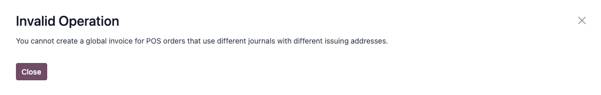

======
Mexico
======

.. _sat-catalog: http://omawww.sat.gob.mx/tramitesyservicios/Paginas/catalogos_emision_cfdi_
   complemento_ce.htm

.. |SAT| replace:: :abbr:`SAT (Servicio de Administración Tributaria)`
.. |DIOT| replace:: :abbr:`DIOT (Declaración Informativa de Operaciones con Terceros)`
.. |PAC| replace:: :abbr:`PAC (Proveedor Autorizado de Certificación / Authorized Certification
   Provider)`
.. |RFC| replace:: :abbr:`RFC (Registro Federal de Contribuyentes)`
.. |PPD| replace:: :abbr:`PPD (Pago en Parcialidades o Diferido/Payment in Installements or
   Deferred)`
.. |PUE| replace:: :abbr:`PUE (Pago en una Sola Exhibición/Payment in a Single Exhibition)`
.. |CFDI| replace:: :abbr:`CFDI (Comprobante Fiscal Digital por Internet)`

Video Tutorials
========

Videos on the Mexican localization are also available. Basic workflows and most topics covered
on this page are also available on video format, please check out the following:

- `Odoo Smart Tutorial - Mexican localization <https://www.odoo.com/es/slides/smart-tutorial-localizacion-de-mexico-173>`_.
- `Basic configurations and Youtube playlist <https://www.youtube.com/watch?v=TjWddMtQRfc&list=PL1-aSABtP6ACcwRzy_cdx-avDoNfSvooD&index=22>`_.

Introduction
============

The Odoo Mexican localization modules allow for the signing of electronic invoices, according to the
specifications of the |SAT| for `version 4.0 of the CFDI <http://omawww.sat.gob.mx/
tramitesyservicios/Paginas/documentos/Anexo_20_Guia_de_llenado_CFDI.pdf>`_, a legal requirement, as
of January 1, 2022. These modules also add relevant accounting reports (such as: the |DIOT|,
enables foreign trade, and the creation of delivery guides).

.. note::
   In order to electronically sign any documents in Odoo, ensure the *Sign* application is
   installed.

.. seealso::
   :doc:`Documentation on e-invoicing's legality and compliance in Mexico
   <../accounting/customer_invoices/electronic_invoicing/mexico>`

Configuration
=============

Requirements
------------

It is necessary to meet the following requirements before configuring the Mexican localization
modules in Odoo:

.. _mx-requirements:

#. Be registered in the |SAT|, with a valid |RFC|.
#. Have a `Certificado de Sello Digital / Digital Seal Certificate
   <https://www.gob.mx/sat/acciones-y-programas/ certificado-de-sello-digital>`_ (CSD).
#. Choose a PAC (Proveedor Autorizado de Certificación / Authorized Certification Provider).
   Currently, Odoo works with the following |PAC|\s: `Solución Factible
   <https://solucionfactible.com/contenido/productos/timbrado/general#dos>`_, 
   `Quadrum <https://cfdiquadrum.com.mx/odoo/>`_ and
   `SW Sapien - Smarter Web <https://info.sw.com.mx/sw-smarter-odoo>`_.
#. Have knowledge and experience with billing, sales, and accounting in Odoo. This documentation
   **only** contains the necessary information needed to use Odoo in a company based in Mexico.

Installing modules
------------------

:ref:`Install <general/install>` the following modules to get all the features of the Mexican
localization. The :doc:`Accounting <../accounting>` and *Contacts* modules are required to be
installed for this configuration:

.. list-table::
   :header-rows: 1
   :widths: 25 25 50

   * - Name
     - Technical name
     - Description
   * - :guilabel:`Mexico - Accounting`
     - `l10n_mx`
     - The default :doc:`fiscal localization package <../fiscal_localizations>`, adds accounting
       characteristics for the Mexican localization, such as: the most common taxes and the chart of
       accounts – based on `the SAT account grouping code
       <https://www.gob.mx/cms/uploads/attachment/file/151586/codigo_agrupador.pdf>`_.
   * - :guilabel:`EDI for Mexico`
     - `l10n_mx_edi`
     - Includes all the technical and functional requirements to generate and validate
       :doc:`Electronics Documents <../accounting/customer_invoices/electronic_invoicing>` — based
       on the technical documentation published by the |SAT|. This allows you to send invoices (with
       or without addedums) and payment complements to the government.
   * - :guilabel:`Odoo Mexican Localization Reports`
     - `l10n_mx_reports`
     - Adapts reports for Mexico's Electronic Accounting: Chart of Accounts, Trial Balance, and
       |DIOT|.
   * - :guilabel:`Mexico - Localization Reports for Closing`
     - `l10n_mx_reports_closing`
     - Necessary to create the Closing Entry (Also known as the *month 13th move*).
   * - :guilabel:`Odoo Mexican XML Polizas Export`
     - `l10n_mx_xml_polizas`
     - Allows the export of XML files of Journal Entries for a compulsory audit.

.. note::
   When installing a database from scratch and selecting :guilabel:`Mexico` as the country, Odoo
   automatically installs those modules.

The following modules are optional. It's recommended to install them *only* if meeting a specific
requirement. Make sure that they are needed for the business.

.. list-table::
   :header-rows: 1
   :widths: 25 25 50

   * - Name
     - Technical name
     - Description
   * - :guilabel:`EDI for Mexico (Advanced Features)`
     - `l10n_mx_edi_extended`
     - Adds the external trade complement to invoices: A legal requirement for selling products to
       foreign countries.
   * - :guilabel:`Mexico - Electronic Delivery Guide` & :guilabel:`Mexico - Electronic Delivery Guide Comex`
     - `l10n_mx_edi_stock` & `l10n_mx_edi_stock_extended`
     - Lets you create a *Carta Porte*: A bill of lading that proves to the government you are
       sending goods between A & B with a signed electronic document.
   * - :guilabel:`Odoo Mexico Localization for Stock/Landing`
     - `l10n_mx_edi_landing`
     - Allows managing customs numbers related to landed costs in electronic documents.
   * - :guilabel:`CFDI 4.0 fields for sale orders`
     - `l10n_mx_edi_sale`
     - Adds extra fields to the :doc:`Sales <../../sales/sales>` module to comply with the Mexican
       Electronic Invoicing
   * - :guilabel:`Mexican Localization for the Point of Sale`
     - `l10n_mx_edi_pos`
     - Adds extra fields to the :doc:`Point of Sale <../../sales/point_of_sale>` module to comply
       with the Mexican Electronic Invoicing
   * - :guilabel:`Mexican Localization for eCommerce`
     - `l10n_mx_edi_website_sale`
     - Adds extra fields to the :doc:`eCommerce <../../websites/ecommerce>` module to comply with
       the Mexican Electronic Invoicing
   * - :guilabel:`Employees - Mexico`
     - `l10n_mx_hr`
     - Adds extra fields to the :doc:`Employees <../../hr/employees>` module to comply with local information for employees.
   * - :guilabel:`Mexico - Payroll with Accounting`
     - `l10n_mx_hr_payroll_account`
     - Adds the required rules and parameters to manage local payroll calculation with the :doc:`Payroll <../../hr/payroll>` app.

Configure your company
----------------------

After installing the correct modules, the next step is to verify that your company is configured
with the correct data. To do so, go to :menuselection:`Settings --> General Settings --> Companies`,
and select :guilabel:`Update Info` under your company name.

Enter the full :guilabel:`Address` in the resulting form, including: :guilabel:`ZIP` code,
:guilabel:`State`, :guilabel:`Country`, and |RFC| (:guilabel:`Tax ID` number).

According to the requirements of the |CFDI| 4.0, the name of the main company contact **must**
coincide with your business name registered in the |SAT|, without the legal entity abbreviation.
This is the same for the :guilabel:`ZIP` code.

.. image:: mexico/mx-company-info.png
   :alt: Main company contact requirements for a correct invoicing.

.. important::
   From a legal point of view, a Mexican company **must** use the local currency (MXN). If you want
   to manage another currency, let MXN be the default currency and use a :doc:`pricelist
   <../../sales/sales/products_prices/prices/pricing>`, instead.

Next, go to :menuselection:`Settings --> Accounting --> MX Electronic Invoicing --> Service Tax
Administration (SAT)`, then select the :guilabel:`Fiscal Regime` that applies to your company from
the drop-down list, and click :guilabel:`Save`.

.. image:: mexico/mx-fiscal-regime.png
   :alt: Fiscal regime configuration in the Accounting settings.

.. tip::
   If you want to test the Mexican localization, the company can be configured with a real address
   within Mexico (including all fields), and add `EKU9003173C9` as the :guilabel:`Tax ID` and
   `ESCUELA KEMPER URGATE` as the :guilabel:`Company Name`. For the :guilabel:`Fiscal Regime`, use
   :guilabel:`General de Ley Personas Morales`.

Contacts
--------

To create a contact that can be invoiced, go to :menuselection:`Contacts --> Create`. Then, enter
the contact name, full :guilabel:`Address` including: :guilabel:`ZIP` code, :guilabel:`State`,
:guilabel:`Country`, and |RFC| (:guilabel:`Tax ID`).

.. important::
   As with your own company, all of your contacts needs to have their correct business name
   registered in the |SAT|. This also applies to the :guilabel:`Fiscal Regime`, which needs to be
   added in the :guilabel:`Sales & Purchase` tab.

.. warning::
   Having a |RFC| (:guilabel:`Tax ID`) set but no :guilabel:`Country` configured may result in
   incorrect invoices.

Taxes
-----

Some additional configurations for factor type and tax objects need to be added to the sales taxes
in order to properly sign invoices.

Factor type
~~~~~~~~~~~

Both the *SAT Tax Type* and *Factor Type* field are pre-loaded in the default taxes. If new taxes
are created, you need to make sure to configure this field. To do so, go to
:menuselection:`Accounting --> Configuration --> Taxes`, then fill both fields in the
:guilabel:`Advanced Options` tab for all records, with the :guilabel:`Tax Type` set as
:guilabel:`Sales`.

Odoo supports four groups of Tax Types: `IVA`, `ISR`, `IEPS` and `Local Taxes`.

.. image:: mexico/mx-factor-type.png
   :alt: Factor Type Sales tax type configuration.

.. tip::
   Mexico manages two different kinds of 0% VAT to accommodate two scenarios:

   - *0% VAT* set the :guilabel:`Factor Type` as :guilabel:`Tasa`
   - *VAT Exempt* set the :guilabel:`Factor Type` as :guilabel:`Exento`

Tax object
~~~~~~~~~~

One requirement of the CFDI 4.0 is that the resulting XML file needs (or does not need) to *break
down* the taxes of the operation. There are three different possible values that are added in the
XML file:

- `01`: Not subject to tax - this value is added automatically if your invoice line doesn't contain
  any taxes.
- `02`: Subject to tax - this is the default configuration of any invoice line that contains taxes.
- `03`: Subject to tax and not forced to break down - this value can be triggered on-demand for
  certain customers to replace the value 02.

To use the `03` value, navigate to :menuselection:`Contacts --> your contact --> Sales & Purchase
--> Fiscal Information`, and activate the :guilabel:`No Tax Breakdown` checkbox.

.. image:: mexico/mx-tax-breakdown.png
   :align: center
   :alt: No Tax Breakdown option on the MX EDI tab of the customer's invoice.

.. important::
   The :guilabel:`No Tax Breakdown` value applies **only** to specific fiscal regimes and/or taxes.
   Consult your accountant first to see if it is needed for your business before making any
   modification.

Other tax configurations
~~~~~~~~~~~~~~~~~~~~~~~~

The Mexican Localization uses :doc:`Cash basis taxes <../../finance/accounting/taxes/cash_basis>`.
So, when registering a payment, Odoo carries out the movement of taxes from the *Cash Basis
Transition Account* to the account set in the :guilabel:`Definition` tab. For such movement, a tax
base account is used: (`899.01.99 Base Imponible de Impuestos en Base a Flujo de Efectivo`) in the
journal entry when reclassifying taxes. **Do not delete this account**.

Products
--------

To configure products, go to :menuselection:`Accounting --> Customers --> Products`, then select a
product to configure, or :guilabel:`Create` a new one. In the :guilabel:`Accounting` tab, and in the
:guilabel:`UNSPSC Product Category` field, select the category that represents the product. The
process can be done manually, or through :doc:`a bulk import <../../essentials/export_import_data>`.

.. note::
   All products need to have a |SAT| code associated with them in order to prevent validation
   errors.

Electronic invoicing
--------------------

PAC credentials
~~~~~~~~~~~~~~~

After you have processed your `Private Key (CSD)
<https://www.sat.gob.mx/aplicacion/16660/genera-y-descarga-tus-archivos-a-traves-de-la-aplicacion-
certifica>`_ with the |SAT|, you **must** register directly with the :ref:`PAC <mx-requirements>` of
your choice before you start creating invoices from Odoo.

Once you've created your account with any of these providers, go to :menuselection:`Settings -->
Accounting --> MX Electronic invoicing`. Under the :guilabel:`Authorized Certification Provider
(PAC)` section, enter the name of your |PAC| with your credentials (:guilabel:`Username` and
:guilabel:`Password`).

.. image:: mexico/mx-pac-account.png
   :alt: Configuring PAC credentials from the Accounting settings.

.. tip::
   If you do not have credentials, but want to test the electronic invoicing, you can activate the
   :guilabel:`MX PAC test environment` checkbox, and select :guilabel:`Solucion Factible` as the
   |PAC|. You do not need to add a username or password for a test environment.

.cer and .key certificates
~~~~~~~~~~~~~~~~~~~~~~~~~~

The `digital certificates of the company
<https://www.gob.mx/tramites/ficha/certificado-de-sello-digital/SAT139>`_ must be uploaded within
the :guilabel:`Certificates` section. To do so, navigate to :menuselection:`Settings -->
General Settings --> Certificates and Keys`.

First Select under :guilabel:`Manage your certificates` the :guilabel:`Keys` button and a menu will
open. From there, create a new registry and upload the digital :guilabel:`Key file` (:file:`.key`
file), add a name to the key and write down the :guilabel:`Private key password`.

On the previous menu select :guilabel:`Certificates`, and a menu will open. From there, create a new
registry and upload the digital :guilabel:`Certificate` (:file:`.cer` file), add a name to the
certificate and select the :guilabel:`Private Key` created on the previous step from the drop-down
menu.

.. image:: mexico/mx-certificates.png
   :alt: Certificate and key upload inputs.

.. note::
   The :guilabel:`Certificates` registries do not require :guilabel:`Certificate Password` or
   :guilabel:`Public Key` to be filled

.. tip::
   In order to test the electronic invoicing,
   the following |SAT| test certificates are provided:

   - :download:`Certificate <mexico/certificate.cer>`
   - :download:`Certificate Key <mexico/certificate.key>`
   - **Password**: ``12345678a``

Workflows
=========

Electronic invoicing
--------------------

The invoicing process in Odoo is based on `Annex 20
<http://omawww.sat.gob.mx/tramitesyservicios/Paginas/anexo_20.htm>`_ version 4.0 of electronic
invoicing of the |SAT|.

Customer invoices
~~~~~~~~~~~~~~~~~

To start invoicing from Odoo, a customer invoice must be created using the :doc:`standard invoicing
flow <../accounting/customer_invoices>`.

While the document is in draft mode, changes can be made to it (the correct :guilabel:`Payment Way`
or :guilabel:`Usage` that the customer might require can be added, for example.)

After clicking on :guilabel:`Confirm` in the customer invoice, click on the :guilabel:`Send & Print`
button to process the invoice with the government. Make sure that the :guilabel:`CFDI` checkbox is
marked.

After receiving the signed document back from the government, the :guilabel:`Fiscal Folio` field
appears on the document, and the XML file will appear both in the |CFDI| tab and attached in the
chatter.

If your customer had a mail set up, you will send can send both the XML and PDF files together. You
can also download the PDF file to your computer, by clicking the :guilabel:`Print` button, and
selecting the desired print option.

.. tip::
   When clicking :guilabel:`Update SAT`, the :guilabel:`SAT status` field on the invoice will
   confirm if the XML file is **Validated** in the |SAT|.

   On a testing environment, the message :guilabel:`Not Found` will always come up.

Credit notes
~~~~~~~~~~~~

While an invoice is a document type "I" (Ingreso), a credit note is a document type "E" (Egreso).

The only addition to the :doc:`standard flow for credit notes
<../accounting/customer_invoices/credit_notes>` is that, as a requirement of the |SAT|, there has
to be a relation between a credit note and an invoice through the fiscal folio.

Because of this requirement, the field :guilabel:`CFDI Origin` adds this relation with a `01|`,
followed by the fiscal folio of the original invoice.

.. image:: mexico/mx-creating-credit-note.png
   :alt: Example CFDI Origin number.

.. tip::
   For the :guilabel:`CFDI Origin` field to be automatically added, use the :guilabel:`Add Credit
   Note` button from the invoice, instead of creating it manually.

Payment complements
~~~~~~~~~~~~~~~~~~~

Payment policy
**************

One addition of the Mexican localization is the :guilabel:`Payment Policy` field. `According to
the SAT documentation <https://www.sat.gob.mx/consultas/92764/comprobante-de-recepcion-de-pagos>`_,
there are 2 types of payments:

- `PUE` (Pago en una Sola Exhibición/Payment in a Single Exhibition)
- `PPD` (Pago en Parcialidades o Diferido/Payment in Installements or Deferred)

The difference lies in the *Due Date* or *Payment Terms* of the invoice.

To configure |PUE| invoices, navigate to :menuselection:`Accounting --> Customers --> Invoices`,
and either select an invoice :guilabel:`Due Date` within the same month, or choose a payment term
that does not imply changing the due month (immediate payment, 15 days, 21 days, all falling within
the current month).

.. image:: mexico/mx-pue-payment.png
   :alt: Example of an invoice with the PUE requirements.

.. tip::
   Some :guilabel:`Payment Terms` are already installed by default, and can be managed from
   :menuselection:`Accounting --> Configuration --> Payment Terms`.

.. note::
   Starting on v18.1 the payment policy is now selectable.

To configure |PPD| invoices, navigate to :menuselection:`Accounting --> Customers --> Invoices`, and
select an invoice with a :guilabel:`Due Date` after the first day of the following month. This also
applies if your :guilabel:`Payment Term` is due in the following month.

.. image:: mexico/mx-ppd-payment.png
   :alt: Example of an invoice with the PPD requirements.

Payment flow
************

In both cases, the payment process in Odoo :doc:`is the same <../accounting/customer_invoices>`, the
main difference being payments related to |PPD| invoices, by law, need to be sent to the government
as a document type "P" (Pago).

If a payment is related to a |PUE| invoice, it can be registered with the wizard, and be associated
with the corresponding invoice. To do so, navigate to :menuselection:`Accounting --> Customers -->
Invoices`, and select an invoice. Then, click the :guilabel:`Register Payment` button. The invoice
status changes to :guilabel:`In Payment`, since the payment is effectively validated when it is bank
reconciled.

.. seealso::
   :doc:`../accounting/bank/reconciliation`

While this process is the same for PPD invoices, the addition of the creating an :doc:`electronic
document <../accounting/customer_invoices/electronic_invoicing>` means some additional requirements
are needed to correctly send the document to the |SAT|.

From a legal perspective, you **must** confirm the specific :guilabel:`Payment Way` where you received
the payment. Because of this, the :guilabel:`Payment Way` field **cannot** be set as `99 - Por Definir
(To Define)`, thus the field will become invisible when selecting it.

If a bank account number is required, go to the :guilabel:`Accounting` tab of a customer's
contact card, and it can be added there.

.. note::
   The exact configurations are in the `Anexo 20 of the SAT
   <http://omawww.sat.gob.mx/tramitesyservicios/Paginas/anexo_20.htm>`_. Usually, the
   :guilabel:`Bank Account` needs to be 10 or 18 digits for transfers, 16 for credit or debit cards.

If a fully-conciliated payment is related to an invoice with a Fiscal Folio, the button
:guilabel:`Update Payments` appears. Pressing the button will send the document to the government
automatically and it'll appear in the |CFDI| tab in both the Invoice and the Payment.

.. tip::
   While it is a bad fiscal practice, the |PUE| payments can also be sent to the government, however
   it is required to press *Force CFDI* in the *CFDI* tab for this.

Similar to an invoice or credit note, the PDF and XML can be sent to the final customer. To do so,
click the :icon:`fa-cog` :guilabel:`(gear)` to open the actions drop-down menu and select
:guilabel:`Send receipt by email`.

.. Warning::
   Bank reconciliation direct payments can't create a PDF, this feature was added in v18.1

Invoice cancellations
~~~~~~~~~~~~~~~~~~~~~

It is possible to cancel the EDI documents sent to the |SAT|. According to the `Reforma Fiscal 2022
<https://www.sat.gob.mx/consultas/91447/nuevo-esquema-de-cancelacion>`_, since January 1st, 2022,
there are two requirements for this:

- With all cancellation requests, you **must** specify a *cancellation reason*.
- After 24 hours from the invoice creation, the client must be asked to approve the cancellation. If
  there is no response within 72 hours, the cancellation is processed automatically.

Invoice cancellations can be made for one of the following reasons:

- 01 - Invoice issued with errors (with related document)
- 02 - Invoice issued with errors (no replacement)
- 03 - The operation was not carried out
- 04 - Nominative operation related to the global invoice

To initiate a cancellation, go to :menuselection:`Accounting --> Customers --> Invoices`, select the
posted invoice to cancel, and click :guilabel:`Request Cancel`. Then, refer to the
:ref:`localizations/mexico/01-invoice-cancellation` or
:ref:`localizations/mexico/02-03-04-invoice-cancellation` sections, depending on the cancellation
reason.

.. tip::
   Alternatively, request a cancellation from the :guilabel:`CFDI` tab by clicking
   :guilabel:`Cancel` on the line item.

.. note::
   If a cancellation is requested on a locked period, the CFDI will be cancelled but not
   the accounting entry.

.. _localizations/mexico/01-invoice-cancellation:

Cancellation reason 01 - Invoice issued with errors (with related document)
***************************************************************************

#. In the :guilabel:`Request CFDI Cancellation` pop-up window, select :guilabel:`01 - Invoice issued
   with errors (with related document)` from the :guilabel:`Reason` field and click
   :guilabel:`Create Replacement Invoice` to create a new draft invoice. This new draft invoice
   replaces the previous invoice, along with the related |CFDI|.
#. :guilabel:`Confirm` the draft and :guilabel:`Send & Print` the invoice.
#. Return to the initial invoice (i.e., the invoice from which you first requested the
   cancellation). Notice the :guilabel:`Substituted By` field appears with a reference to the
   new replacement invoice.
#. Click :guilabel:`Request Cancel`. In the :guilabel:`Request CFDI Cancellation` pop-up window, the
   :guilabel:`01 - Invoice issued with errors (with related document)` option is automatically
   selected in the :guilabel:`Reason` field.
#. Click :guilabel:`Confirm`.

The invoice cancellation is then generated with a reason line item in the :guilabel:`CFDI` tab.

.. note::
   - If the client rejects the cancellation, the invoice cancellation line item is removed from the
     :guilabel:`CFDI` tab.
   - When using the *01 - Invoice issued with errors (with related document)* cancellation reason,
     the `04|` prefix may appear in the :guilabel:`Fiscal Folio` field. This is an internal prefix
     used by Odoo to complete the cancellation and **does not** mean that the cancellation reason
     was *04 - Nominative operation related to the global invoice*.

.. _localizations/mexico/02-03-04-invoice-cancellation:

Cancellation reasons 02, 03, and 04
***********************************

In the :guilabel:`Request CFDI Cancellation` pop-up window, select the desired cancellation
:guilabel:`Reason` and :guilabel:`Confirm` the cancellation.

Upon doing so, the invoice cancellation is generated with a reason line item in the :guilabel:`CFDI`
tab.

.. note::
   If the client rejects the cancellation, the invoice cancellation line item is removed from the
   :guilabel:`CFDI` tab.

- With all cancellation requests, a *cancellation reason* **must** be specified.
- After 24 hours have passed since the creation of the invoice, if certain conditions are met, the
  client **must** be asked to accept or reject the cancellation.

Invoice cancellations can be made for one of the following reasons:

.. important::
   There are four different cancellation reasons and Odoo will let you use any of them. The correct
   reason for each document needs to be reviewed by a professional accountant.

The cancellation reason **01 - Invoice issued with errors (with related document)** must be used when a
new invoice needs to substitute the original one, due to an error in any field. For this, Odoo will ask
to create a new document immediately after requesting the cancellation.

.. tip::
   Alternatively, request a cancellation from the :guilabel:`CFDI` tab by clicking
   :guilabel:`Cancel` on the line item.

.. note::
   - If the client rejects the cancellation, the invoice cancellation line item is removed from the
     :guilabel:`CFDI` tab.
   - When using the *01 - Invoice issued with errors (with related document)* cancellation reason,
     the `04|` prefix may appear in the :guilabel:`Fiscal Folio` field. This is an internal prefix
     used by Odoo to complete the cancellation and **does not** mean that the cancellation reason
     was *04 - Nominative operation related to the global invoice*.

.. _localizations/mexico/02-03-04-invoice-cancellation:

Cancellation reasons 02, 03, and 04
***********************************

In the :guilabel:`Request CFDI Cancellation` pop-up window, select the desired cancellation
:guilabel:`Reason` and :guilabel:`Confirm` the cancellation.

Upon doing so, the invoice cancellation is generated with a reason line item in the :guilabel:`CFDI`
tab.

.. note::
   If the :guilabel:`SAT Status` goes back to **Validated** it could be due to one of these three
   reasons:

   - The invoice is labeled as *No Cancelable* in the `SAT Website <https://www.sat.gob.mx/home>`_.
     due to the fact that it has a valid related document: Either another invoice linked with the
     :guilabel:`CFDI Origin` field or a Payment Complemement. If so, you need to cancel any other
     related document first.
   - The cancellation request is still being processed by the |SAT|. If so, wait a few minutes and
     try again.
   - The final customer needs to reject or accept the cancellation request in their
    `Buzón Tributario
    <http://omawww.sat.gob.mx/BuzonTributario/Paginas/servicios_disponibles.html>`_. This
     can take up to 72 hours and, in case that the cancellation requests gets rejected, you will
     need to repeat the process again.

.. seealso::
   `Tool to validate Mexican Electronic Documents (CFDI) status.
   <https://verificacfdi.facturaelectronica.sat.gob.mx/>`_

For the cancellation reasons **02**, **03** and **04**, the button :guilabel:`Create Replacement
Invoice` won't appear and you'll be able to ask for the request immediately.

Both the current :guilabel:`State` and :guilabel:`Cancellation Reason` can be found in the
:guilabel:`CFDI` tab.

Payment cancellations
*********************

It is also possible to cancel *Payment Complements*. Go to the :guilabel:`CFDI` of either the
related invoice or the payment itself and press :guilabel:`Cancel`.

Like with invoices, you will need to go to the payment and press :guilabel:`Update SAT` in order to
change the :guilabel:`SAT Status` and :guilabel:`Status` to :guilabel:`Cancelled`.

.. note::
   Just like invoices, when you create a new *Payment Complement*, you can add the relation of the
   original document, by adding a `04|` plus the fiscal folio in the :guilabel:`CFDI Origin` field, this will
   cancel with 01 relation.

Invoicing special use cases
~~~~~~~~~~~~~~~~~~~~~~~~~~~

Multicurrency
*************

The :guilabel:`Main Currency` in Mexico is MXN. While this is mandatory for all Mexican companies,
it is possible to send and receive invoices (and payments) in different currencies. To enable the
use of :doc:`multicurrency <../accounting/get_started/multi_currency>`, navigate to the
:menuselection:`Accounting --> Settings --> Currencies`, and set :guilabel:`[MX] Bank of Mexico` as
the :guilabel:`Service` in the :guilabel:`Automatic Currency Rates` section. Then, set the
:guilabel:`Interval` field to the frequency you wish to update the exchange rates.

This way, the XML file of the document will have the correct exchange rate, and the total amount,
in both the foreign currency and in MXN.

It is highly recommended to use :doc:`a bank account for each currency
<../accounting/bank/foreign_currency>`.

.. note::
   The only currencies that automatically update their exchange rate daily are: USD, EUR, GBP, JPY
   and CNY.

Discounts
**********

By law, electronic document sent to the government cannot have negative lines, as this can trigger
errors. Therefore, when you utilize :doc:`Gift Cards
<../../sales/sales/products_prices/ewallets_giftcards>` or :doc:`Loyalty Programs
<../../sales/sales/products_prices/loyalty_discount>` the subsequent negative lines will be
translated in the XML as if they were regular :doc:`Discounts
<../../sales/sales/products_prices/prices/pricing/>`.

In order to set this up, navigate to :menuselection:`Sales --> Products --> Products` and create a
product `Discounts`, make sure that it has a valid :guilabel:`Tax` (usually :guilabel:`IVA` at
`16%`).

After this, create and sign the invoice, and add the `Discounts` product at the bottom. In the XML the discount should
be substracted from the first invoice line available, Odoo will try to subtract from each line the total amount in order
until all the discount has been applied.

.. tip::
   A `Discount` and `UNSPSC Product Category` for each product variant related to :guilabel:`Gift Cards`
   or :guilabel:`Loyalty Programs` have to be created.

Down payments
*************

A common practice in Mexico is the usage of :doc:`Down Payments
<../../sales/sales/invoicing/down_payment>`. It's usage primary consists of cases where you receive
a payment for a good or service where either the product or the price (or both) hasn't been
determinated at the moment.

The |SAT| allows two diferent ways to handle this process: both of them involve linking all invoices
to each other with the :guilabel:`CFDI Origin` field.

For this process, it is necessary to have the :doc:`Sales <../../sales>` app installed.

.. seealso::
   `The official documentation for registration of down payments in Mexico
   <http://http://omawww.sat.gob.mx/tramitesyservicios/Paginas/documentos/GuiaAnexo311221.pdf>`_.

Configuration
^^^^^^^^^^^^^

First, navigate to :menuselection:`Sales --> Products --> Products` to create a product `Anticipo`
and configure it. The :guilabel:`Product Type` must be :guilabel:`Service`, and use the
:guilabel:`UNSPSC Category` must be: `84111506 Servicios de facturación`.

Then, go to :menuselection:`Sales --> Settings --> Invoicing --> Down Payments`, and add the
*Anticipo* product as the default.

Method A
^^^^^^^^

This method consists in creating a Down Payment invoice, creating a invoice for the total amount, and
finally, a credit note for the total of the down payment.

First, create a sales order with the total amount, and create down payment from it (either using a
percentage or fixed amount). Then, sign the document, and register the payment.

When the time comes for the customer to get the final invoice, create it again from the same sales
order. In the :guilabel:`Create Invoice` wizard, select :guilabel:`Regular Invoice`. Make sure to
delete the line that contains the product *Anticipo*.

.. tip::
   If you are going to use down payments with the Mexican localization, make sure that the
   :guilabel:`Invoicing Policy` of your products are :guilabel:`Ordered quantities`. Otherwise a
   customer credit note will be created.

Then, copy the :guilabel:`Fiscal Folio` from the down payment invoice, and paste it into the
:guilabel:`CDFI Origin` of the final invoice, adding the prefix `07|` before the value and sign
the document.

Finally, create a credit note for the first invoice. Copy the :guilabel:`Fiscal Folio` from the
final invoice, and paste it in the :guilabel:`CFDI Origin` of the credit note, adding the prefix
`07|`. Then, sign the document.

With this, all electronic documents are linked to each other. The final step is to fully pay the new
invoice. At the bottom of the new invoice, you can find the credit note in the
:guilabel:`Outstanding credits` - add it as payment. Finally, register the remaining amount with the
:guilabel:`Register Payment` wizard.

In the sales order, all three documents should appear as "In Payment".

Method B
^^^^^^^^

Another, simpler way to fulfill |SAT| requirements involves creating only the down payment invoice,
and a second invoice for the remnant. This method involves the fact that negative lines are treated
as discounts.

For this, follow the same process as :ref:`Method A <l10n-mx/down-payment-method-a>`, up until the
creation of the final invoice. Do not delete the line that contains the *Anticipo* and instead
rename the other products :guilabel:`Description` to include the text `CFDI por remanente de un
anticipo`. Don't forget to add the :guilabel:`Fiscal Folio` of the down payment invoice in the
:guilabel:`CDFI Origin` of the final invoice, adding the prefix `07|`.

Finally, sign the final invoice.

XML reader
**********

In certain occasions, such as when you are creating invoices in another software or in the |SAT|
directly, you would want to upload the invoices in Odoo. The XML Reader allows you to retrieve the
data from an .XML file. To do this, navigate to :menuselection:`Accounting --> Customers -->
Invoices` and, in the list view, you can press the :guilabel:`Upload` button to select any number of
.XML files, and draft invoices will be automatically created. This can work also by dragging the
files from your computer and dropping them in the view.

The draft invoices will retreive the :guilabel:`Customer information` (if it doesn't exist, new ones
will be created), the :guilabel:`Product Lines` (only if products with the same name already exist)
and will calculate all taxes and additional fields exclusive to the Mexican Localization. The import
information will appear in the chatter.

.. warning::
   Depending on where the invoice was created, XML files could have different values from the total
   calculated in Odoo. **Always** double-check any document uploaded this way.

:guilabel:`Customer Invoices` created this way will be able to create Payment Complements and to be
Canceled at any time. If you use the :guilabel:`Send & Print` the PDF Document will have all the
corresponding information.

This can be done for :guilabel:`Vendor Bills` too.

.. tip::

   You can also drag and drop XML files for already created draft invoices and Odoo retrieves the
   :guilabel:`Fiscal Folio`.

CFDI to public
**************

The Mexican government requires that any goods or services that are sold must be backed up by
an invoice. If the customer does not require an invoice or has no |RFC|, a
*CFDI to Public* has to be created also known as a "nominative" invoice.

A contact must be created and it must have a particular name.
If  the :guilabel:`CFDI to Public` checkbox in either a sale order or an invoice is checked, the final XML
will override the data in the invoice contact and will add the following characteristics:

- |RFC|: **XAXX010101000** if it is a national customer or **XEXX010101000** if it is a foreign
  customer
- :guilabel:`ZIP` code: The same code of the company
- :guilabel:`Usage`: S01 - Without Fiscal Effects

.. important::
   If your contact *Country* is empty, the final invoice is considered as a *CFDI to Public* for
   national customers. A non-blocking warning will be displayed before signing the document.

If the final customer doesn't share any details, create a generic :guilabel:`Customer`. The name
cannot be `PUBLICO EN GENERAL` or an error will be triggered (it can be, for example, `CLIENTE
FINAL`).

.. seealso::
   `Regla 2.7.1.21 Expedición de comprobantes en operaciones con el público en general.
   <https://www.sat.gob.mx/articulo/90959/regla-2.7.1.21>`_.

Global invoice
**************

If by the end of a certain period of time (that can vary from daily to bimonthly, depending of your
company's legal needs and preferences) and the customer still has sales that weren't marked as
regular invoices or individual *CFDI to Public* invoices, the |SAT| allows for the creation of a
single invoice that can contain all operations, known as a *Global Invoice*.

To do so, the :doc:`Sales <../../sales/sales>` app needs to be installed.

.. seealso::
   `Guía de llenado del CFDI global.
   <http://omawww.sat.gob.mx/tramitesyservicios/Paginas/documentos/GuiallenadoCFDIglobal311221.pdf>`_.

Sales flow
^^^^^^^^^^

First, it is necessary to create a special :guilabel:`Journal` created in :menuselection:`Accounting
--> Configuration --> Journals` with the purpose of keeping a separate sequence.

Then, make sure that all the sales orders that need to be signed have the following configurations:

- All of them have the :guilabel:`CFDI to Public` checkbox enabled.
- All of them have the :guilabel:`Invoice Status` marked as :guilabel:`To Invoice`.

After this, go to :menuselection:`Sales --> To Invoice --> Orders to Invoice`, select all relevant sales
orders and press :guilabel:`Create Invoices`. Make sure to disable the :guilabel:`Consolidated Billing`
checkbox and press :guilabel:`Create Draft Invoice`.

Odoo will redirect to a list of invoices. Select all of them and in the :icon:`fa-gear`
:guilabel:`Actions` drop-down menu select :guilabel:`Post entries`. Select all posted invoices again
and go back to the  :icon:`fa-gear` :guilabel:`Actions` drop-down menu to select :guilabel:`Create
Global Invoice`.

In the wizard, select the :guilabel:`Periodicity` indicated by a professional accountant and press
:guilabel:`Create`. All invoices should be signed under the same XML file, with the same
:guilabel:`Fiscal Folio`.

.. tip::
   - By pressing :guilabel:`Show` in the :guilabel:`CFDI` tab, a list with all related invoices will
     be displayed.
   - By pressing :guilabel:`Cancel` in the :guilabel:`CFDI` tab, it is possible to cancel the global
     invoice in both the |SAT|
     and Odoo.

.. note::
   Global Invoices created this way won't have a **PDF** in them as their information is already
   within Odoo and is not to be seen by a customer.

Point of sale
-------------

The :doc:`Point of sale <../../sales/point_of_sale>` adaptation of the Mexican Localization enables
the creation of invoices that comply with the |SAT| requeriements directly in the **POS session**, with
the added benefit of creating receipt tickets that allow *self-invoicing* in a special portal, and
the creation of global invoices with a just couple clicks.

Point of sale flow
~~~~~~~~~~~~~~~~~~

Other than the standard :doc:`Point of Sale configuration
<../../sales/point_of_sale/configuration>`, the only requirement for the Mexican localization is the
addition fact that each payment method needs to be configured with a correct :guilabel:`Payment Way`.

.. tip::
   By default Odoo creates preconfigured payment methods for cash, credit card and debit card.

While selling on the **Point of Sale**, by clicking the :guilabel `Customer` button the option is prompted to either create or select
a customer. Here it is possible to review customer invoicing information (such as the |RFC| or :guilabel:`Fiscal Regime`) and
even modify it directly inside the session.

After selecting a customer, press the :guilabel:`Invoice` button. A menu will appear to select the
:guilabel:`Usage` and to determine if it is an invoice to public. Press confirm and then validate to
complete the order. The PDF will be downloaded and it is possible to send the invoice via mail to
the final customer alongside the receipt.

.. tip::
   Invoices can be created from orders by going to the Order menu, selecting the document, and pressing
   Invoice, the same menu for the :guilabel:`Usage` and :guilabel:`CFDI to Public` will apprear.

.. image:: mexico/mx-pos.png
   :alt: Invoice Configuration for Point of Sale.

It is also possible to sign Credit notes automatically by selecting an order and after pressing Refund, making sure to
select again the "invoice" button.

.. note::
   Credit notes for returned products will contain the relation type **03 - Devolución de mercancía sobre facturas o
   traslados previos**

.. important::
   - In the Mexican localization, positive and negative lines in a **POS** session cannot be mixed.
   - If a |SAT| validation error occurrs customer will get a :doc:`Pro-Forma <../../sales/sales/invoicing/proforma>` invoice instead.

Self-invoicing portal
~~~~~~~~~~~~~~~~~~~~~

If the final customer is not sure if they want to have their invoice generated at the exact moment
of the sale, it is possible to add the option of creating an receipt with either a QR code or a five
digit code in the settings of the **Point of Sale** session in :menuselection:`Point of Sale -->
Configuration --> Bills & Receipts` and select :guilabel:`Use QR code on ticket`,
:guilabel:`Generate a code on ticket` or both.

This will provide access to a special menu where they can add their fiscal information, including
the *Usage* and *Fiscal Regime*.

.. seealso::
   :doc:`../../sales/point_of_sale/receipts_invoices`

Global invoice
~~~~~~~~~~~~~~

As with regular sales orders, global invoices can also be created from a POS session.

For this, make sure not to select a customer or the invoice option in the payment menu and go to
:menuselection:`Point of Sale --> Orders --> Orders`. There, select all the orders to invoice, click
the :icon:`fa-cog` :guilabel:`(gear)` to open the actions drop-down menu and select
:guilabel:`Create Global Invoice`.

Like with sales orders, choose the correct :guilabel:`Periodicity` and press :guilabel:`Create`.

This attaches an XML file in all orders, and can be downloaded by going to the :guilabel:`CFDI` tab.
If needed, in the same tab it is possible to cancel the invoice.

If eventually any of the orders that are part of the global invoice need to be addressed to a
customer, it is still possible to send an invoice by entering a new POS session, selecting
:menuselection:`Breadcrumbs --> Orders`, changing :guilabel:`All active orders` to :guilabel:`Paid`,
selecting the sale and clicking on the `Invoice` Button.

.. note::
   Global Invoices just as regular invoices can only be grouped by physical address that is determined
   by the address set on the POS invoice journal, so when attempting to invoice two addresses a warning
   will come up to warn the user of the error.

eCommerce
---------

The eCommerce adaptation of the Mexican Localization provides and extra step to create invoices that
comply with the |SAT| requeriements on :doc:`eCommerce  <../../websites/ecommerce>` by retreiving
the customer data after the **Checkout** and even allowing for the signature of **Automatic
Invoices** after the payment is proccessed, as well as sending them the files via email and granting
the customer access to retreive their PDF & XML files for their own customer portal.

eCommerce flow
~~~~~~~~~~~~~

During the regular checkout process, a new :guilabel:`Invoicing Info` step will appear, where it is
possile to request an invoice or not. If "No" is selected, a CFDI to Public will be created, if
"Yes" is selected, the :guilabel:`RFC`, :guilabel:`Fiscal Regime` and :guilabel:`Usage` will be required
in order to get all information in the Sale Order, where it's status will change to **To Invoice**

.. important::
   Make sure to add a :guilabel:`UNSPSC code` to the :doc:`shipping product
   <../../websites/ecommerce/checkout_payment_shipping/checkout>`

If you check the setting **Automatic Invoicing** in :menuselection:`Settings --> Website -->
Invoicing`, the Electronic Document will be signed automatically.

Subscriptions
-------------

While handling subscriptions all the sales fields will be used to create the recurrent invoices,
these will be automatically signed and sent via email with the PDF and XML attached with no 
additional manual actions required.

Invoices

External trade
--------------

The external trade is a complement to a regular invoice that adds certain values in both the XML and
PDF, to invoices with a foreign customer according to `SAT regulations
<http://omawww.sat.gob.mx/tramitesyservicios/Paginas/complemento_comercio_exterior.htm>`_, such as:

- The specific address of the receiver and the sender
- The addition of a :guilabel:`Tariff Fraction` that identifies the type of product
- The correct :guilabel:`Incoterm` (International Commercial Terms), among others (*certificate of
  origin* and *special units of measure*).

This allows the correct identification of exporters and importers, in addition to expanding the
description of the merchandise sold.

Since January 1, 2018, external trade is a requirement for taxpayers, who carry export operations of
type A1. While the current CFDI is 4.0, the external trade is currently on version 2.0

In order to use this feature, the module :guilabel:`l10n_mx_edi_extended` needs to be installed.

.. important::
   Before installing, make sure your business needs to use this feature. Consult your accountant
   first, if needed, before installing any modules.

Configuration
~~~~~~~~~~~~~

Contacts
********

To configure your company contact for external trade, navigate to :menuselection:`Accounting -->
Customers --> Customers`, and select your :guilabel:`Company` name. While the CFDI 4.0 requirements
ask you to add a valid :guilabel:`ZIP` code in your contact, the external trade complement adds the
requirement that your :guilabel:`City` and the :guilabel:`State` must also be valid. All three
fields must coincide with the `Official SAT Catalog
<http://omawww.sat.gob.mx/tramitesyservicios/Paginas/catalogos_emision_cfdi_complemento_ce.htm>`_,
or you will receive an error.

.. warning::
   Add the :guilabel:`City` and :guilabel:`State` in the company's *contact*, not in the company
   itself.

In there, the optional fields :guilabel:`Locality` and :guilabel:`Colony Code` can be filled too.
These two fields also have to coincide with the data in the |SAT|.

.. image:: mexico/mx-external-trade-rescompany.png
   :alt: Optional external trade company fields.

To configure the contact data for a foreign receiving client, navigate to :menuselection:`Accounting
--> Customers --> Customers`, and select the foreign client's contact. The contact must have the
following fields completed to avoid errors:

#. The entire company :guilabel:`Address`, including a valid :guilabel:`ZIP` code and the foreign
   :guilabel:`Country`.
#. The format of the foreign :guilabel:`VAT` (tax identification number, for example: Colombia
   `123456789-1`)
#. In the :guilabel:`Sales & Purchase` tab, you need to activate the :guilabel:`Needs external
   trade?` checkbox.

.. important::

   Do not enable the :guilabel:`No Tax Breakdown` option for External Trade customers. Selecting
   this option hides mandatory fields that are required for external trade contact configuration.

.. image:: mexico/mx-external-trade-customer-contact.png
   :alt: Required external trade customer fields.

.. note::
   In the resulting XML and PDF files, the :guilabel:`VAT` is automatically replaced by the generic
   VAT for abroad transactions: `XEXX010101000`.

Products
********

All products involved with external trade have four fields that are required, two of them exclusive
to external trade.

#. The :guilabel:`Internal Reference` of the product is in the :guilabel:`General Information` tab.
#. The :guilabel:`Weight` of the product must be more than `0`.
#. The `correct  <https://www.ventanillaunica.gob.mx/vucem/Clasificador.html>`_ :guilabel:`Tariff
   Fraction` of the product in the :guilabel:`Accounting` tab.
#. The :guilabel:`UMT Aduana` corresponds to the :guilabel:`Tariff Fraction`.

.. image:: mexico/mx-external-trade-product.png
   :alt: Required external trade product fields.

.. tip::
   - If the UoM code of the :guilabel:`Tariff Fraction` is `01`, the correct :guilabel:`UMT Aduana`
     is `kg`.
   - If the UoM code of the :guilabel:`Tariff Fraction` is `06`, the correct :guilabel:`UMT Aduana`
     is `Units`.

Invoicing flow
~~~~~~~~~~~~~~

Before creating an invoice, it is important to take into account that external trade invoices
require to convert the amounts of your product into USD. Therefore, :doc:`multicurrency
<../accounting/get_started/multi_currency>` **must** be enabled with *USD* activated in
the :guilabel:`Currencies` section. The correct :guilabel:`Service` to run is :guilabel:`[MX]
Bank of Mexico`.

Then, with the correct exchange rate set up in :menuselection:`Accounting --> Settings -->
Currency`, the only fields left are :guilabel:`Incoterm` and the optional :guilabel:`Certificate
Source` in the :guilabel:`Other Info` tab.

.. image:: mexico/mx-external-trade-other-info.png
   :alt: External trade Other Info tab of a product.

Finally, confirm the invoice with the same process as a regular invoice, and click the
:guilabel:`Send & Print` button to sign it.

Delivery guide
--------------

A `Carta Porte <https://www.sat.gob.mx/consultas/68823/complemento-carta-porte->`_ is a bill of
lading: a document that states the type, quantity, and destination of goods being carried.

On July 17th, 2024, version 3.1 of this |CFDI| was implemented for all transportation providers,
intermediaries, and owners of goods. Odoo is able to generate a document type "T" (Traslado), which,
unlike other documents, is created in a delivery order instead of an invoice or payment.

Odoo can create XML and PDF files with (or without) ground transport, and can process materials that
are treated as *Dangerous Hazards*.

In order to use this feature, the modules :guilabel:`l10n_mx_edi_stock`,
:guilabel:`l10n_mx_edi_stock_30`, :guilabel:`l10n_mx_edi_stock_extended`,
:guilabel:`l10n_mx_edi_stock_extended_30` and :guilabel:`l10n_mx_edi_stock_extended_31` have to be
installed.

In addition to this, it is necessary to have the :doc:`Inventory
<../../inventory_and_mrp/inventory>` and :doc:`Sales <../../sales/sales>` apps installed, as well.

.. important::
   Odoo does not support Carta Porte type document type "I" (Ingreso), air, or marine transport.
   Consult your accountant first if this feature is needed before doing any modifications.

Configuration
~~~~~~~~~~~~~

Odoo manages two different types of CFDI type "T". Both can be created from either :doc:`Incoming
shipments and delivery orders
<../../inventory_and_mrp/inventory/shipping_receiving/daily_operations/shipments_deliveries>`

- **No Federal Highways**: Is used when the *Distance to Destination* is `less than 30 KM
  <http://omawww.sat.gob.mx/cartaporte/Paginas/documentos/PreguntasFrecuentes_Autotransporte.pdf>`_.
- **Federal Transport**: Is used when the *Distance to Destination* exceeds 30 KM.

Other than the standard requirements of regular invoicing (The |RFC| of the customer, the UNSPSC
code, etc.), if you are using *No Federal Highways*, no external configuration is needed.

For *Federal Transport*, several configurations have to be added to contacts, vehicle setups, and
products. Those configurations are added to the XML and PDF files.

Contacts and vehicles
*********************

Like the external trade feature, the :guilabel:`Address` in both the company and the final customer
must be complete. The :guilabel:`ZIP` code, :guilabel:`City`, and :guilabel:`State` must coincide
with the `Official SAT Catalog for Carta Porte <sat-catalog_>_`.

.. tip::
   The field, :guilabel:`Locality`, is optional for both addresses.

.. image:: mexico/mx-delivery-guide-contacts.png
   :alt: Delivery guide contact configuration.

.. important::
   The origin address used for the delivery guide is set in :menuselection:`Inventory -->
   Configuration --> Warehouses Management --> Warehouses`. While this is set as the company address
   by default, you can change it according to your correct warehouse address.

Another addition to this feature is the :guilabel:`Vehicle Setups` menu found in
:menuselection:`Inventory --> Settings --> Mexico`. This menu lets you add all the information
related to the vehicle used for the delivery order.

All fields are mandatory to create a correct delivery guide.

.. tip::
   The fields, :guilabel:`Vehicle Plate Number` and :guilabel:`Number Plate`, must contain between
   5 to 7 characters.

In the :guilabel:`Intermediaries` section, you must add the operator of the vehicle. The only
mandatory fields for this contact are the :guilabel:`VAT` and :guilabel:`Operator Licence`.

.. image:: mexico/mx-delivery-guide-vehicle.png
   :alt: Delivery guide vehicle configuration.

Products
********

Similar to regular invoicing, all products must have a :guilabel:`UNSPSC category`. In addition to
this, there are two extra configurations for products involved in delivery guides:

- The :guilabel:`Product Type` must be set as :guilabel:`Storable Product` for stock movements to be
  created.
- In the :guilabel:`Inventory` tab, the field :guilabel:`Weight` should have more than `0`.

.. warning::
   Creating a delivery guide of a product with the value `0` will trigger an error. As the
   :guilabel:`Weight` has been already stored in the delivery order, it is needed to return the
   products, and create the delivery order (and delivery guide) again with the correct amounts.

.. image:: mexico/mx-delivery-guide-products.png
   :alt: Delivery guide product configuration.

Sales and inventory flow
~~~~~~~~~~~~~~~~~~~~~~~~

To create a delivery guide, first, you need to create and confirm a sales order from
:menuselection:`Sales --> Sales Order`. This generates a :guilabel:`Delivery` smart button. Click
it, and :guilabel:`Validate` the transfer.

After the status is set to :guilabel:`Done`, you can edit the transfer, and select the
:guilabel:`Transport Type` in the :guilabel:`Additional Info` tab.

If your delivery guide has the type :guilabel:`No Federal Highways`, you can save the transfer, and
then click :guilabel:`Generate Delivery Guide`. The resulting XML can be found in the chatter.

.. note::
   Other than the :guilabel:`UNSPSC` in all products, delivery guides that use :guilabel:`No Federal
   Highways` do not require any special configuration to be sent to the government.

If your delivery guide has the type, :guilabel:`Federal Transport`, the tab :guilabel:`MX EDI`
appears. There, enter a value in :guilabel:`Distance to Destination (KM)` bigger than `0`, and
select the :guilabel:`Vehicle Setup` used for this delivery.

Finally, add a :guilabel:`Gross Vehicle Weight` and press :guilabel:`Generate Delivery Guide`.

.. image:: mexico/mx-delivery-guide-federal-transport.png
   :alt: Delivery guide MX EDI tab configuration.

.. tip::
   Delivery Guides can also be created from :guilabel:`Receipts`, either from the Inventory app or
   by the standard flow of the Purchase app.

Dangerous hazards
*****************

Certain values in the :guilabel:`UNSPSC Category` are considered in the `official SAT catalog
<http://omawww.sat.gob.mx/tramitesyservicios/Paginas/complemento_carta_porte.htm>`_ as *dangerous
hazards*. These categories need additional considerations when creating a delivery guide with
:guilabel:`Federal Transport`.

First, select your product from :menuselection:`Inventory --> Products --> Products`. Then, in the
:guilabel:`Accounting` tab, the fields :guilabel:`Hazardous Material Designation Code` and
:guilabel:`Hazardous Packaging` must be filled with the correct code from the |SAT| catalog.

.. image:: mexico/mx-delivery-guide-hazards-designation.png
   :alt: Delivery guide hazardous material product required fields.

   .. important::
   It exists the possibility that a :guilabel:`UNSPSC Category` could or could not be a dangerous hazard.
   (for example *01010101*) If it is not dangerous, write a **0** in the field
   :guilabel:`Hazardous Material Designation Code`.

In :menuselection:`Inventory --> Settings --> Mexico --> Vehicle Setup`, the data from the
:guilabel:`Environment Insurer` and :guilabel:`Environment Insurance Policy` has to be filed, as
well. After this, continue with the regular process to create a delivery guide.

.. image:: mexico/mx-delivery-guide-hazards-environment.png
   :alt: Delivery Guide environment insurer required fields.

Imports and Exports
*****************

If your Carta Porte is for international operations (:guilabel:`Receipts` for imports or :guilabel:`Deliveries`
for exports), some additional fields needs to be taken into account if the :guilabel:`Delivery Address` country
is not Mexico.

First, make sure that your :guilabel:`Products` have the following configuration.

- :guilabel:`UNSPSC Category`: Cannot be 01010101.
- :guilabel:`Tariff Fraction` and :guilabel:`UMT Aduana` should be correct, similar to External Trade.
- :guilabel:`Material Type` is filled.

Then, when creating a :guilabel:`Delivery Guide` from a Delivery or Receipt, fill the following fields:
:guilabel:`Customs Regimes`, :guilabel:`Customs Document Type` and :guilabel:`Customs Document Identification`.

Then, if you created a :guilabel:`Delivery Guide` for a Receipt, and the :guilabel:`Customs Document Type` is
**Pedimento**, two new fields will appear: :guilabel:`Pedimento Number` and :guilabel:`Importer`

.. tip::
   The field :guilabel:`Pedimento Number` should follow the pattern `xx xx xxxx xxxxxxx`. Por example,
   `15 48 3009 0001235`

Customs numbers
---------------

A *customs declaration* (Pedimento Aduanero) is a fiscal document that certifies that all
contributions to the fiscal entity (the |SAT|) has been paid for, including the import/export of
goods.

According to the `Annex 20 <http://omawww.sat.gob.mx/tramitesyservicios/Paginas/anexo_20.htm>`_ of
CFDI 4.0, in documents where the invoiced goods come from a first-hand import operation, the field,
:guilabel:`Customs Number`, needs to be added to all lines of products involved with the operation.

To do so, the module :guilabel:`l10n_mx_edi_landing` must be installed, in addition to the
:doc:`Inventory <../../inventory_and_mrp/inventory>`, :doc:`Purchase
<../../inventory_and_mrp/purchase>` and :doc:`Sales <../../sales/sales>` apps.

.. important::
   Do not confuse this feature with external trade. The customs numbers are directly related to
   importing goods, while the external trade complement is related to exporting. Consult your
   accountant first if this feature is needed before doing any modifications.

Configuration
~~~~~~~~~~~~~

In order to track the correct customs number for a specific invoice, Odoo uses :doc:`landed costs
<../../inventory_and_mrp/inventory/warehouses_storage/inventory_valuation/integrating_landed_costs>`.
Go to :menuselection:`Inventory --> Configuration --> Settings --> Valuation`. Make sure that
:guilabel:`Landed Costs` is activated.

Begin by creating a *service*-type product called, `Pedimento`. In the :guilabel:`Purchase` tab,
activate :guilabel:`Is a Landed Cost`, and select a :guilabel:`Default Split Method`.

Then, configure the *storable products* that hold the customs numbers. To do so, create the storable
products, and make sure the :guilabel:`Product Category` has the following configuration.

- :guilabel:`Costing Method`: Either :guilabel:`FIFO` or :guilabel:`AVCO`
- :guilabel:`Inventory Valuation`: :guilabel:`Automated`
- :guilabel:`Stock Valuation Account`: :guilabel:`115.01.01 Inventario`
- :guilabel:`Stock Journal`: :guilabel:`Inventory Valuation`
- :guilabel:`Stock Input Account`: :guilabel:`115.05.01 Mercancías en tránsito`
- :guilabel:`Stock Output Account`: :guilabel:`115.05.01 Mercancías en tránsito`

.. image:: mexico/mx-landing-configuration.png
   :alt: Storable products general configuration.

.. image:: mexico/mx-landing-configuration-category.png
   :alt: Storable product category configuration.

Purchase and sales flow
~~~~~~~~~~~~~~~~~~~~~~~

After you configure your product, follow the standard :doc:`purchase flow
<../../inventory_and_mrp/purchase>`.

Create a purchase order from :menuselection:`Purchase --> Orders --> Purchase Order`. Then, confirm
the order to display a :guilabel:`Receipt` smart button. Click on the :guilabel:`Receipt` smart
button to :guilabel:`Validate` the receipt.

Go to :menuselection:`Inventory --> Operations --> Landed Costs`, and create a new record. Add the
transfer that you just created, and both: the product `Pedimento` and :guilabel:`Customs number`.

Optionally, it is possible to add a cost amount. After this, validate the landed cost. Once
:guilabel:`Posted`, all products related to that receipt have the customs number assigned.

.. warning::
   You can only add the *Pedimentos* number **once**, so be careful when associating the correct
   number with the transfer(s).

.. image:: mexico/mx-landing-inventory.png
   :alt: Customs number on a landed costs Inventory record.

Now, create a sales order, and confirm it. This should trigger a :guilabel:`Delivery` smart button.
Validate it.

Finally, create an invoice from the sales order, and confirm it. The invoice line related to your
product has a customs number in it. This number should match the customs number added in the
*Landed Costs* record you created earlier.

.. image:: mexico/mx-landing-invoice.png
   :align: center
   :alt: Customs number on confirmed sales order product.

Electronic accounting
---------------------

For Mexico, `Electronic Accounting
<https://www.sat.gob.mx/aplicacion/42150/envia-tu-contabilidad-electronica>`_ refers to the
obligation to keep accounting records and entries through electronic means, and to enter accounting
information on a monthly basis, through the |SAT| website.

It consists of three main XML files:

#. The updated list of the chart of accounts that is currently in use.
#. A monthly trial balance, plus a closing entry report, also known as: *Trial Balance Month 13*.
#. Either optional, or for a compulsory audit, an export of the journal entries in the general
   ledger.

The resulting XML files follow the requirements of the `Anexo Técnico de Contabilidad Electrónica
1.3 <https://www.gob.mx/cms/uploads/attachment/file/151135/Anexo24_05012015.pdf>`_.

In addition to this, it is possible to generate the `DIOT
<https://www.sat.gob.mx/declaracion/74295/presenta-tu-declaracion-informativa-de-operaciones-con-
terceros-(diot)->`_: A report of vendor's journal entries that involve IVA taxes that can be
exported in a :file:`.txt` file.

In order to use these reports, the modules :guilabel:`l10n_mx_reports`,
:guilabel:`l10n_mx_reports_closing`, :guilabel:`l10n_mx_xml_polizas` and
:guilabel:`l10n_mx_xml_polizas_edi` have to be installed, as well as the :doc:`Accounting
<../accounting/get_started>`.

The *Chart of accounts* and the *Trial Balance Month 13* reports can be found in
:menuselection:`Accounting --> Reporting --> Trial Balance`.
The *DIOT* report can be found in
:menuselection:`Accounting --> Reporting --> Tax Report`.

.. important::
   The specific characteristics and obligations of the reports that you send might change according
   to your fiscal regime. Always contact your accountant before sending any documents to the
   government.

.. _l10n_mx/chart-of-accounts:

Chart of accounts
~~~~~~~~~~~~~~~~~

The :doc:`chart of accounts <../accounting/get_started/chart_of_accounts>` in México follows a
specific pattern based on |SAT|'s' `Código agrupador de cuentas
<http://omawww.sat.gob.mx/fichas_tematicas/buzon_tributario/Documents/codigo_agrupador.pdf>`_.

It is possible to create any account, as long as it respects |SAT|'s encoding group: the pattern is
`NNN.YY.ZZ` or `NNN.YY.ZZZ`.

.. example::
   Some examples are `102.01.99` or `401.01.001`.

When a new account is created in :menuselection:`Accounting --> Configuration --> Chart of
Accounts`, with the |SAT| encoding group pattern, the correct grouping code appears in
:guilabel:`Tags`, and your account appears in the *COA* report.

Once all accounts are created, make sure the correct :guilabel:`Tags` are added as these mark the nature
of the account.

.. note::
   It is not advised use any pattern that ends a section with a 0 (such as `100.01.01`, `301.00.003` or
   `604.77.00`). This triggers errors in the report. By default Odoo will mark the accounts as yellow if
   the numbering will cause issue later on, this is to prevent reports from providing innacurate data.

Once everything is set up, you can go to :menuselection:`Accounting --> Reporting --> Trial Balance`,
and click the :guilabel:`COA SAT (XML)` button to generate an XML file containing all of your
accounts, which will be ready to upload to the |SAT| website.

Trial balance
~~~~~~~~~~~~~

The trial balance reports the initial balance, credit, and total balance of your accounts, provided
that you added their correct :ref:`encoding group <l10n_mx/chart-of-accounts>`.

This report can be generated monthly, and a corresponding XML file is created, go to
:menuselection:`Accounting --> Reporting --> Trial Balance`, and click the
:guilabel:`SAT (XML)` button. Select the month to download beforehand.

.. image:: mexico/mx-reports-trial-balance.png
   :alt: Trial balance report.

.. note::
   Odoo does not generate the *Balanza de Comprobación Complementaria*.

An additional report is the *Month 13*: a closing balance sheet that shows any adjustments or
movements made in the accounting to close the year.

To generate this XML document, navigate to :menuselection:`Accounting --> Accounting --> Journal Entries`,
and create a new document. Here, add all amounts to modify, and balance the debit and/or credit of each one.

After this is done, go to the :guilabel:`Other Info` tab and check the :guilabel:`Month 13 Closing` field.
If needed, go to :menuselection:`Accounting --> Reporting --> Trial Balance` and select the date :guilabel:`Month 13`,
where it is possible to see the the total amount of the year, plus all the additions of the journal entry, and it also
is possible to generate the XML file by pressing the :guilabel:`SAT (XML)` button.

General ledger
~~~~~~~~~~~~~~

By law, all transactions in Mexico must be recorded digitally. Since Odoo automatically creates all
the underlying journal entries of your invoicing and payments, you can export your journal entries
to comply with |SAT|'s audits and/or tax refunds.

.. tip::
   The report can be filtered by period, or by journal, depending on the need.

To create the XML, go to :menuselection:`Accounting --> Reporting --> Audit Reports --> General
Ledger`, and click :guilabel:`XML (Polizas)`. Here, you can select between four types of
:guilabel:`Export` types:

- :guilabel:`Tax audit`
- :guilabel:`Audit certification`
- :guilabel:`Return of goods`
- :guilabel:`Compensation`

For :guilabel:`Tax audit`, or :guilabel:`Audit certification`, you need to write the
:guilabel:`Order Number` provided by the |SAT|. For :guilabel:`Return of goods`, or
:guilabel:`Compensation`, you need to write your :guilabel:`Process Number`, also provided by the
|SAT|.

.. note::
   To see this report without sending it, use `ABC6987654/99` for :guilabel:`Order
   Number` and `AB123451234512` for :guilabel:`Process Number`.

DIOT report
~~~~~~~~~~~

The DIOT (Declaración Informativa de Operaciones con Terceros / *Informative Declaration of
Operations with Third Parties*) is an additional obligation with the |SAT|, where the current status
of creditable and non-creditable payments, withholdings, import taxes and refunds of VAT from your vendor bills,
are provided to the |SAT|.

.. note::
   Since July 2025 the new 2025 version of the report is available.

Unlike other reports, the |DIOT| is uploaded to a software provided by the |SAT| that contains the
A-29 form. In Odoo, you can download the records of your transactions as a :file:`.txt` file that
can be uploaded to the form, avoiding direct capture of this data.

The transactions file contains the total amount of your payments registered in vendor bills, broken
down into the corresponding types of IVA. The :guilabel:`VAT` and :guilabel:`Country` is mandatory
for all vendors..

To get the |DIOT| report, go to :menuselection:`Accounting --> Reports --> Tax Report`. Select
the month that suits you, and click :guilabel:`DIOT (TXT)` to download the :file:`.txt` file.

.. important::
   It is required to fill the field, :guilabel:`Type of Operation`, in the :guilabel:`Accounting`
   tab of each vendors to prevent validation errors. Make sure that foreign
   customers have their country set up.

   .. image:: mexico/mx-reports-diot-contact.png
      :alt: DIOT information on a vendor contact.

Selecting :guilabel:`87 - Global Operations` will cause the final .txt file to merge all vendors
that are part of the global operations under one generic VAT: *XAXX010101000*
