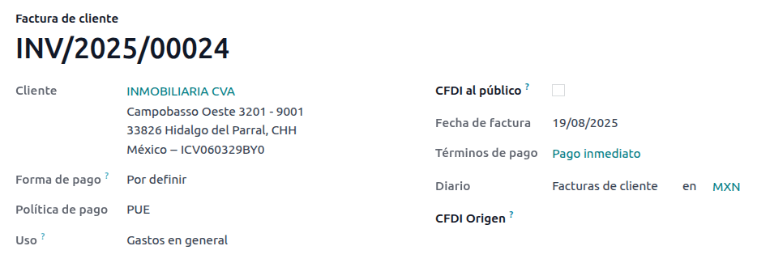
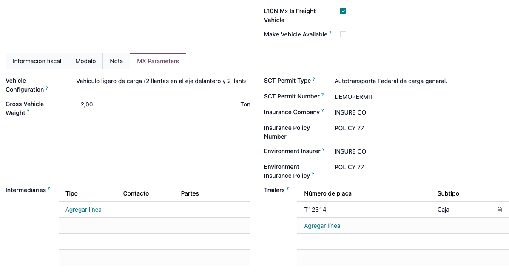

======
Mexico
======

.. _sat-catalog: http://omawww.sat.gob.mx/tramitesyservicios/Paginas/catalogos_emision_cfdi_
   complemento_ce.htm

.. |SAT| replace:: :abbr:`SAT (Servicio de Administración Tributaria)`
.. |DIOT| replace:: :abbr:`DIOT (Declaración Informativa de Operaciones con Terceros)`
.. |PAC| replace:: :abbr:`PAC (Proveedor Autorizado de Certificación / Authorized Certification
   Provider)`
.. |RFC| replace:: :abbr:`RFC (Registro Federal de Contribuyentes)`
.. |PPD| replace:: :abbr:`PPD (Pago en Parcialidades o Diferido/Payment in Installements or
   Deferred)`
.. |PUE| replace:: :abbr:`PUE (Pago en una Sola Exhibición/Payment in a Single Exhibition)`

Webinars
========

Below you can find videos with a general description of the localization, and how to configure it.

- `Video webinar of a complete demo <https://www.youtube.com/watch?v=5cdogjm0GCI>`_.

Introduction
============

Odoo users in Mexico have access to a set of modules that allow them to sign electronic invoices
according to the specifications of the |SAT| for `version 4.0 of the CFDI
<http://omawww.sat.gob.mx/tramitesyservicios/Paginas/documentos/Anexo_20_Guia_de_llenado_CFDI.pdf>`_
, a legal requirement as of January 1, 2022.

These modules also add relevant accounting reports (such as the |DIOT|, enable foreign trade, and
the creation of delivery guides).

Configuration
=============

Requirements
------------

Before making the necessary configurations to have the Mexican localization installed in Odoo, it is
necessary to meet the following requirements:

.. _mx-requirements:

#. Be registered in the |SAT|, with a valid :abbr:`RFC (Registro Federal de Contribuyentes)`.
#. Have a `Certificate of Digital Seal
   <https://www.gob.mx/sat/acciones-y-programas/certificado-de-sello-digital>`_ (CSD).
#. Choose a PAC (Proveedor Autorizado de Certificación / Authorized Certification Provider).
   Currently, Odoo works with the following |PAC|\s: `Solución Factible
   <https://solucionfactible.com/>`_, `Quadrum (formerly Finkok) <https://cfdiquadrum.com.mx/>`_ and
   `SW Sapien - Smarter Web <https://sw.com.mx/>`_.
#. Have knowledge and experience with billing, sales, and accounting in Odoo. This documentation
   contains only the necessary information to use Odoo.

Modules installation
--------------------

:ref:`Install <general/install>` the following modules to get the main features of the Mexican
localization:

.. list-table::
   :header-rows: 1
   :widths: 25 25 50

   * - Name
     - Technical name
     - Description
   * - :guilabel:`Mexico - Accounting`
     - `l10n_mx`
     - The default :doc:`fiscal localization package </applications/finance/fiscal_localizations>`,
       adds accounting characteristics for the Mexican localization, such as the most common taxes
       and the chart of accounts based on `the SAT account grouping code
       <https://www.gob.mx/cms/uploads/attachment/file/151586/codigo_agrupador.pdf>`_.
   * - :guilabel:`EDI for Mexico`
     - `l10n_mx_edi`
     - Includes all the technical and functional requirements to generate and validate
       :doc:`Electronics Documents
       </applications/finance/accounting/customer_invoices/electronic_invoicing>`, based on the
       technical documentation published by the SAT. This allows you to send invoices (with or
       without addendas) and payment complements to the government.
   * - :guilabel:`EDI v4.0 for Mexico`
     - `l10n_mx_edi_40`
     - Necessary to create XML documents with the correct specifications of the CFDI 4.0.

.. note::
   When you install a database from scratch by selecting :guilabel:`Mexico` as the country, Odoo
   automatically installs the following modules: :guilabel:`Mexico - Accounting`, :guilabel:`EDI for
   Mexico`, and :guilabel:`EDI v4.0 for Mexico`.

The following modules are needed to add Mexico's Electronic Accounting. They require the
:doc:`Accounting </applications/finance/accounting>` module to be installed.

.. list-table::
   :header-rows: 1
   :widths: 25 25 50

   * - Name
     - Technical name
     - Description
   * - :guilabel:`Odoo Mexican Localization Reports`
     - `l10n_mx_reports`
     - Adapts reports for Mexico's Electronic Accounting: Chart of Accounts, Trial Balance, and
       DIOT.
   * - :guilabel:`Mexico - Localization Reports for Closing`
     - `l10n_mx_reports_closing`
     - Necessary to create the Closing Entry (Also known as the month 13th move).
   * - :guilabel:`Odoo Mexican XML Polizas Export`
     - `l10n_mx_xml_polizas`
     - Lets you export XML files of your Journal Entries for a compulsory audit.
   * - :guilabel:`Odoo Mexican XML Polizas Export Edi bridge`
     - `l10n_mx_xml_polizas_edi`
     - Complements the module `l10n_mx_xml_polizas`.

The following modules are optional. It's recommended to install them *only* if you meet a specific
requirement. Make sure that they are needed for your business.

.. list-table::
   :header-rows: 1
   :widths: 25 25 50

   * - Name
     - Technical name
     - Description
   * - :guilabel:`EDI for Mexico (Advanced Features)`
     - `l10n_mx_edi_extended`
     - Adds the external trade complement to invoices: A legal requirement for selling products to
       foreign countries.
   * - :guilabel:`EDI v4.0 for Mexico (COMEX)`
     - `l10n_mx_edi_extended_40`
     - Adapts the module `l10n_mx_edi_extended` for CFDI 4.0.
   * - :guilabel:`Mexico - Electronic Delivery Guide`
     - `l10n_mx_edi_stock`
     - Lets you create a "Carta Porte": a bill of lading that proves to the government you are
       sending goods between A & B with a signed electronic document.
   * - :guilabel:`Electronic Delivery Guide for Mexico CFDI 4.0`
     - `l10n_mx_edi_stock_40`
     - Adapts the module `l10n_mx_edi_stock` for CFDI 4.0
   * - :guilabel:`Odoo Mexico Localization for Stock/Landing`
     - `l10n_mx_edi_landing`
     - Allows managing customs numbers related to landed costs in electronic documents.

Configure your company
----------------------

After installing the correct modules, you must verify that the company is configured with the
correct data. To do so, go to :menuselection:`Settings --> General Settings --> Companies` and
select :guilabel:`Update Info` under your company name.

Enter your full :guilabel:`Address` in the resulting form including :guilabel:`ZIP` code,
:guilabel:`State`, :guilabel:`Country`, and RFC (:guilabel:`VAT` number).

According to the requirements of the CFDI 4.0, the name of your main contact must coincide to your
business name registered in the SAT without the legal entity abbreviation.

.. image:: mexico/mx-company-info.png
   :alt: Requirements for a correct invoicing.

.. important::
   From a legal point of view, a Mexican company must use the local currency (MXN). Therefore, Odoo
   does not provide features to manage an alternative configuration. If you want to manage another
   currency, let MXN be the default currency and use a :doc:`pricelist
   </applications/sales/sales/products_prices/prices/pricing>` instead.

Next, go to :menuselection:`Settings --> Accounting --> Electronic Invoicing (MX) --> Fiscal
Regime`, and select the regime that applies to your company from the drop-down list.

.. image:: mexico/mx-fiscal-regime.png
   :alt: Fiscal regime configuration.

.. tip::
   If you want to test the Mexican localization, you can configure the company with a real address
   within Mexico (including all fields), add `EKU9003173C9` as the :guilabel:`VAT` and `ESCUELA
   KEMPER URGATE` as the :guilabel:`Company Name`. For the :guilabel:`Fiscal Regime`, use
   :guilabel:`General de Ley Personas Morales`.

Contacts
--------

To create a contact that can be invoiced, go to :menuselection:`Contacts --> Create`. Then enter the
contact's name, full :guilabel:`Address` including :guilabel:`ZIP` code, :guilabel:`State`,
:guilabel:`Country`, and RFC (:guilabel:`VAT` number).

.. important::
   As with your own company, all of your contacts needs to have their correct business name
   registered in the |SAT|. This also applies to the :guilabel:`Fiscal Regime` which needs to be
   added in the :guilabel:`MX EDI` tab.

Taxes
-----

Some additional configurations for factor type and tax objects need to be added to the sales taxes
in order to properly sign invoices.

Factor type
~~~~~~~~~~~

Go to :menuselection:`Accounting --> Configuration --> Taxes` then enable the :guilabel:`Factor
Type` field in the :guilabel:`Advanced Options` tab for all records with the :guilabel:`Tax Type`
set as :guilabel:`Sales`.

This is pre-loaded in the default taxes. If new ones are created, you need to make sure to fill this
field.

.. image:: mexico/mx-factor-type.png
   :alt: Taxes configuration.

.. tip::
   Mexico manages two different kinds of 0% VAT: *0% VAT* and *VAT Exempt*. For the former, select
   the :guilabel:`Factor Type` :guilabel:`Tasa`. For the latter, use :guilabel:`Exento`.

Tax object
~~~~~~~~~~

One requirement of the CFDI 4.0 is that the resulting XML file needs or does not need to break down
the taxes of the operation. There are three different possible values that are added depending on
specific configurations:

- `01`: Not subject to tax - your invoice must not contain any taxes.
- `02`: Subject to tax - your invoice contains taxes (default configuration).
- `03`: Subject to tax and not forced to breakdown - your invoice contains taxes, and the contact
  configuration has the :guilabel:`No Tax Breakdown` checkbox activated.

.. image:: mexico/mx-tax-breakdown.png
   :alt: Tax Breakdown SAT.

.. important::
   The :guilabel:`No Tax Breakdown` value applies only to specific fiscal regimes and/or taxes.
   Consult your accountant first if it is needed for your business before doing any modification.

Other tax configurations
~~~~~~~~~~~~~~~~~~~~~~~~

When registering a payment, Odoo will carry out the movement of taxes from the *Cash Basis
Transition Account* to the account set in the :guilabel:`Definition` tab. For such movement, a tax
base account will be used: (`Base Imponible de Impuestos en Base a Flujo de Efectivo`) in the
journal entry when reclassifying taxes. **Do not delete this account**.

If you create a new tax, you need to add the correct :guilabel:`Tax Grids` for it (`IVA`, `ISR` or
`IEPS`). Odoo only supports these three groups of taxes.

.. image:: mexico/mx-taxes-config.png
   :alt: Taxes accounts.

Products
--------

To configure products, go to the :guilabel:`Accounting` tab, and in the :guilabel:`UNSPSC Product
Category` field, select the category that represents that product. The process can be done manually
or through :doc:`a bulk import </applications/general/export_import_data>`.

.. note::
   All products need to have a |SAT| code associated with them in order to prevent validation
   errors.

Electronic invoicing
--------------------

PAC credentials
~~~~~~~~~~~~~~~

After you have processed your `Private Key (CSD)
<https://www.sat.gob.mx/aplicacion/16660/genera-y-descarga-tus-archivos-a-traves-de-la-aplicacion-
certifica>`_ with the |SAT|, you must register directly with the :ref:`PAC <mx-requirements>` of
your choice before you start creating invoices from Odoo.

Once you created your account with any of these providers, go to :menuselection:`Settings -->
Accounting --> Electronic Invoicing (MX)`. Under the :guilabel:`MX PAC` section, enter the name of
your |PAC| with your credentials (:guilabel:`PAC username` and :guilabel:`PAC password`).

.. image:: mexico/mx-pac-account.png
   :alt: PAC credentials.

.. tip::
   If you do not have credentials and want to test the electronic invoicing, you can activate the
   :guilabel:`Test Environment` checkbox and select :guilabel:`Solucion Factible` as the |PAC|. You
   do not need to add a username or password.

.cer and .key certificates
~~~~~~~~~~~~~~~~~~~~~~~~~~

You need to upload the `digital certificates of the company
<https://www.gob.mx/tramites/ficha/certificado-de-sello-digital/SAT139>`_ within the section
:guilabel:`MX Certificates`. Select :guilabel:`Add a line` and a window will open. Click on
:guilabel:`Create`, and from there upload your digital certificate (:file:`.cer` file), your key
(:file:`.key` file), and your password. To finish, click on :guilabel:`Save and Close`.

.. image:: mexico/mx-certificates.png
   :alt: Certificate and key.

.. tip::
   If you still do not have one of the contracted |PAC|\s and you want to test electronic invoicing
   you can use the following |SAT| test certificates:

   - :download:`Certificate <mexico/certificate.cer>`
   - :download:`Certificate Key <mexico/certificate.key>`
   - **Password**: ``12345678a``

Workflows
=========

Electronic invoicing
--------------------

The invoicing process in Odoo is based on `Annex 20
<http://omawww.sat.gob.mx/tramitesyservicios/Paginas/anexo_20.htm>`_ version 4.0 of electronic
invoicing of the |SAT|.

Customer invoices
~~~~~~~~~~~~~~~~~

To start invoicing from Odoo, a customer invoice must be created using the :doc:`standard invoicing
flow </applications/finance/accounting/customer_invoices>`.

When the document is in draft mode, you can make any changes to it (add the correct
:guilabel:`Payment Way` or :guilabel:`Usage` that the customer might require, for example.)

After you :guilabel:`Confirm` the customer invoice, a blue message appears stating: :guilabel:`The
invoice will be processed asynchronously by the following E-invoicing service: CFDI (4.0)`. Pressing
the :guilabel:`Process Now` button sends the document to be signed by the government. On success,
the :guilabel:`Fiscal Folio` field appears on the document and the XML file is attached in the
chatter.

.. tip::
   If you press :guilabel:`Retry` in the field :guilabel:`SAT status` of the invoice, you can
   confirm if the XML file is valid in the SAT.

   If you are in a testing environment, you will always receive the message :guilabel:`Not Found`.

To send the signed invoice to your client by mail, you can send the XML together with the PDF file
directly from Odoo by clicking the :guilabel:`Send and Print` button. You can also download the PDF
file to your computer by clicking the :guilabel:`Print` button and selecting the desired option.

Credit notes
~~~~~~~~~~~~

While an invoice is a document type "I" (Ingreso), a credit note is a document type "E" (Egreso).

The only addition to the :doc:`standard flow for credit notes
</applications/finance/accounting/customer_invoices/credit_notes>` is that, as a requirement of the
SAT, there has to be a relation between a credit note and an invoice through the fiscal folio.

Because of this, the field :guilabel:`CFDI Origin` adds this relation with a `01|`, followed by the
fiscal folio of the original invoice.

.. image:: mexico/mx-creating-credit-note.png
   :alt: Creating a credit note.

.. tip::
   For the :guilabel:`CFDI Origin` field to be added automatically, use the button :guilabel:`Add
   Credit Note` from the invoice instead of creating it manually.

Payment complements
~~~~~~~~~~~~~~~~~~~

Payment policy
**************

One of the additions of the Mexican Localization is the field :guilabel:`Payment Policy`. `According
to the SAT documentation
<https://www.sat.gob.mx/consultas/92764/comprobante-de-recepcion-de-pagos>`_, there may be 2 types
of payments:

- `PUE` (Pago en una Sola Exhibición/Payment in a Single Exhibition)
- `PPD` (Pago en Parcialidades o Diferido/Payment in Installements or Deferred)

The difference lies in the *Due Date* or *Payment Terms* of the invoice.

To configure |PUE| invoices, you must select an invoice :guilabel:`Due Date` within the same month
or choose a payment term that does not imply changing the due month (immediate payment, 15 days, 21
days, all falling within the current month).

.. tip::
   Some :guilabel:`Payment Terms` are already installed by default. You can check them in
   :menuselection:`Accounting --> Configuration --> Payment Terms`.

To configure |PPD| invoices, you need to choose a :guilabel:`Due Date` after the first day of the
following month (this also applies if your :guilabel:`Payment Term` is due in the following month).

.. image:: mexico/mx-ppd-payment.png
   :alt: Example of an invoice with the PPD requirements.

.. important::
   Because the |PPD| policy implies that an invoice is not going to get paid at the moment, the
   correct :guilabel:`Payment Way` for the |PPD| invoices is :guilabel:`99 - Por Definir` (To
   define).

Payment flow
************

In both cases, the payment process in Odoo :doc:`is the same
</applications/finance/accounting/customer_invoices>`, the main difference would be that payments
related to |PPD| invoices trigger the creation of a document type "P" (Pago).

If a payment is related to a |PUE| invoice, it can be registered with the wizard and be associated
with the corresponding invoice. Its status will be :guilabel:`In Payment` since the payment is
effectively validated when it is bank reconciled.

.. seealso::
   :doc:`/applications/finance/accounting/bank/reconciliation`

While this process is the same for PPD invoices, the addition of the creation of an :doc:`electronic
document </applications/finance/accounting/customer_invoices/electronic_invoicing>` means that some
additional requirements are needed to correctly send the document to the SAT.

- You need to confirm the specific :guilabel:`Payment Way` where you received the payment. Because
  of this, this field cannot be :guilabel:`99 - Por Definir` (To Define).
- If you are going to add a bank account to the customer in the :guilabel:`Accounting` tab of their
  contact, it needs to have a valid number.

.. note::
   The exact configurations are in the `Anexo 20 of the SAT
   <http://omawww.sat.gob.mx/tramitesyservicios/Paginas/anexo_20.htm>`_. Usually, the
   :guilabel:`Bank Account` needs to be 10 or 18 digits for transfers, 16 for credit or debit cards.

If a payment is related to a signed invoice with the :guilabel:`Payment Policy` `PPD`, Odoo
generates the corresponding payment complement automatically once you press :guilabel:`Process Now`.

.. image:: mexico/mx-signed-complement.png
   :alt: CFDI (4.0) E-invoicing service process payment now message.

.. warning::
   A payment in MXN cannot be used to pay multiple invoices in USD. Rather, the payment should be
   separated into multiple payments created using the :guilabel:`Register Payment` button on the
   corresponding invoices.

Invoice cancellations
~~~~~~~~~~~~~~~~~~~~~

It is possible to cancel the EDI documents sent to the SAT. According to the `Reforma Fiscal 2022
<https://www.sat.gob.mx/consultas/91447/nuevo-esquema-de-cancelacion>`_, since January 1st 2022,
there are two requirements for this:

- With all cancellation requests, you have to specify a *cancellation reason*.
- After 24 hours have passed, the client must be asked to accept the cancellation.

There are four different cancellation reasons. In Odoo, you can cancel invoices with the reasons *01
Invoices sent with errors with a relation*, and *02 Invoices sent with errors without a relation*.

01 - invoices sent with errors with a relation
**********************************************

This cancellation motive has to be used when a new invoice needs to substitute the original one, due
to an error in any field.

- Copy the :guilabel:`Fiscal Folio` of the *old invoice*
- Paste it into the field :guilabel:`CFDI Origin` of the *new invoice*, followed by a `04|`
- Sign the new document.

.. image:: mexico/mx-01-invoice-cancellation.png
   :alt: Old invoice with CFDI Origin.

- Go back to the *old invoice*, the field :guilabel:`Substituted By` should appear.
- Click the :guilabel:`Request EDI Cancellation` button.
- As if it were a regular invoice, a blue field then appears on the invoice. Click
  :guilabel:`Process Now`.
- The invoice status is moved to :guilabel:`Cancelled` and you receive a confirmation in the
  chatter.

.. image:: mexico/mx-01-invoice-cancelled.png
   :alt: Invoice 01 properly canceled.

Now, the invoice should be canceled in the SAT too. You can confirm that this was done correctly by
pressing :guilabel:`Retry` in the SAT status field.

If the document was canceled after 24 hours, it is possible that the client must be asked to accept
the cancellation in their "Buzón Tributario".

.. note::
   The `04|` is only a code that helps Odoo to perform this process. It has no relation to the
   method 04 reason for cancellation.

02 - invoices sent with errors without a relation
*************************************************

This cancellation motive has to be used when an invoice was sent with an error in any field and does
not need to be replaced by another one.

For this case, all that is required is to click on :guilabel:`Request EDI Cancellation`, and then
press click the :guilabel:`Process Now` button.

.. image:: mexico/mx-01-invoice-cancelled.png
   :alt: Invoice 02 properly canceled.

As the field :guilabel:`Substituted By` does not exist, the SAT should detect automatically that the
cancellation reason is 02.

.. important::
   Odoo has certain limitations to canceling invoices in the SAT: The reasons 03 and 04 (*Operation
   did not take place* and *Nominative transactions related to a global invoice*) are not currently
   supported by Odoo. For this, you need to cancel the invoice directly in the SAT and use a
   *Server Action*.

Payment cancellations
*********************

It is also possible to cancel *Payment Complements*. For this, go to the payment and select
:guilabel:`Request EDI Cancellation`. As with invoices, a blue button will appear. Select
:guilabel:`Process now`, and the document will be sent to the SAT. After a few seconds, you can
press :guilabel:`Retry` to confirm the current SAT status.

The payment moves their status to :guilabel:`Cancelled`.

.. note::
   Just like invoices, when you create a new *Payment Complement*, you can add the relation of the
   original document by adding a `04|` plus the fiscal folio.

Invoicing special use cases
~~~~~~~~~~~~~~~~~~~~~~~~~~~

CFDI to public
**************

If the customer you are selling goods or services to does not require an invoice, a *CFDI to Public*
has to be created.

However, if you use the name `PUBLICO EN GENERAL`, an error will be triggered. This is a main change
in the CFDI 4.0 that states that invoices with that specific name needs additional fields.

Odoo currently does not support this. So for a *CFDI to Public* to be created, you need to add any
name to your customer that is not `PUBLICO EN GENERAL`. (For example `CLIENTE FINAL`)

In addition to this, the zip code of your company, and the generic :guilabel:`RFC` ``XAXX010101000``
are needed. The :guilabel:`Fiscal Regime` of your customer must be `Sin obligaciones fiscales`.

.. image:: mexico/mx-cfdi-to-public.png
   :alt: CFDI to Public Error.

Multicurrency
*************

The main currency in Mexico is MXN. While this is mandatory for all Mexican companies, it is
possible to send and receive invoices and payments in different currencies. To do this, you can
enable the use of :doc:`multicurrency
</applications/finance/accounting/get_started/multi_currency>`. And select :guilabel:`Mexican Bank`
as the service in :menuselection:`Accounting --> Settings --> Currency`.

This way, in the XML file of the document you get the correct exchange rate and the total amount
both in the foreign currency and in MXN.

It is highly recommended to use :doc:`a bank account for each currency
</applications/finance/accounting/bank/foreign_currency>`.

.. image:: mexico/mx-multicurrency-1.png
   :alt: Multi-currency configuration.

.. note::
   The only currencies that automatically update their exchange rate daily are USD, EUR, GBP, and
   JPY.

Down payments
*************

There can be cases where you receive a payment in advance from a customer, that needs to be applied
to an invoice later. In order to do this in Odoo, it is required to properly link invoices to each
other with the :guilabel:`CFDI Origin` field.

It is necessary to have the :doc:`Sales </applications/sales/sales>` app installed.

.. seealso::
   `The official documentation for registration of down payments in Mexico
   <http://omawww.sat.gob.mx/tramitesyservicios/Paginas/documentos/Caso_uso_Anticipo.pdf>`_.

First, navigate to the :menuselection:`Sales` app to create a product `Anticipo` and configure it:
the :guilabel:`Product Type` must be :guilabel:`Service`, and use the :guilabel:`UNSPSC Category`
`84111506 Servicios de facturación`.

Then, go to :menuselection:`Sales --> Settings --> Invoicing --> Down Payments` and add the product
as the default.

Create a sales order with the total amount, and create a down payment (either using a percentage or
fixed amount). Then, sign the document, and :guilabel:`Register the Payment`.

When the time comes for the customer to get the final invoice, create it again from the same sales
order. In the :guilabel:`Create Invoices` wizard select :guilabel:`Regular Invoice` and uncheck
:guilabel:`Deduct down payments`.

Then, copy the :guilabel:`Fiscal Folio` from the first invoice and paste it into the :guilabel:`CDFI
Origin` of the second invoice, adding the prefix `07|`. Sign the document.

After this, create a credit note for the first invoice. Copy the :guilabel:`Fiscal Folio` from the
second invoice and paste it in the :guilabel:`CFDI Origin` of the credit note, adding the prefix
`07|`. Sign the document.

With this, all electronic documents are linked to each other. The final step is to fully pay the new
invoice. At the bottom of the new invoice, you can find :guilabel:`Outstanding credits` in the
credit note, add it as payment. Finally, register the remaining amount with the :guilabel:`Register
Payment` wizard.

External trade
--------------

The external trade is a complement to a regular invoice that adds certain values in both the XML and
PDF, according to `SAT regulations
<http://omawww.sat.gob.mx/tramitesyservicios/Paginas/complemento_comercio_exterior.htm>`_.

This adds certain mandatory fields to invoices with a foreign customer, such as:

- The specific address of the receiver and the sender
- The addition of a :guilabel:`Tariff Fraction` that identifies the type of product
- The correct :guilabel:`Incoterm` (International Commercial Terms), among others.

This allows the correct identification of exporters and importers, in addition to expanding the
description of the merchandise sold.

Since January 1st, 2018, it is a requirement for taxpayers who carry export operations of A1 type.
While the current CFDI is 4.0, the external trade is currently on version 1.1

In order to use this feature, the modules :guilabel:`l10n_mx_edi_extended` and
:guilabel:`l10n_mx_edi_extended_40` have to be installed.

.. important::
   Before installing, make sure first that your business needs to use this feature. Consult your
   accountant first if needed before doing any modification.

Configuration
~~~~~~~~~~~~~

Contacts
********

While the CFDI 4.0 requirements ask you to add a valid zip code in your contact, the external trade
complement adds as a mandatory field the :guilabel:`City` and the :guilabel:`State`. All three
fields must coincide with the `Official SAT Catalog <sat-catalog_>`_ or you will receive an error.

.. warning::
   Add the :guilabel:`City` and :guilabel:`State` in the company's contract, not in the company
   itself. You can find your company's contact in :menuselection:`Accounting --> Customers -->
   Customers`

The fields :guilabel:`Locality` and :guilabel:`Colony Code` are optional and can be added in the
company directly in :menuselection:`Settings --> General Settings --> Companies`. These two have to
coincide with the data in the SAT.

.. image:: mexico/mx-external-trade-rescompany.png
   :alt: Optional External Trade Company fields.

The contact data for the foreign receiving client must have the following fields completed to avoid
errors:

#. The entire company :guilabel:`Address`, including a valid :guilabel:`ZIP` code and the foreign
   :guilabel:`Country`.
#. The format of the foreign :guilabel:`VAT` (tax identification number, for example: Colombia
   `123456789-1`)
#. In the :guilabel:`MX EDI` tab, you need to address if the customer receives goods for a period of
   time temporarily (:guilabel:`Temporary`) or permanently (:guilabel:`Definitive`).
#. If you create this contact based in another from Mexico, make sure that you delete any
   information in the field :guilabel:`Fiscal Regime`. Do not use :guilabel:`No Tax Breakdown`
   either.

.. image:: mexico/mx-external-trade-customer-contact.png
   :alt: Required External Trade Customer fields.

.. note::
   In the resulting XML and PDF, the :guilabel:`VAT` is automatically replaced by the generic VAT
   for abroad transactions: `XEXX010101000`.

Products
********

All products involved with external trade must fill four fields, two of them exclusive to this
feature.

#. The :guilabel:`Internal Reference` of the product is in the :guilabel:`General Information` tab.
#. The :guilabel:`Weight` of the product must be more than `0`.
#. The `correct  <https://www.ventanillaunica.gob.mx/vucem/Clasificador.html>`_ :guilabel:`Tariff
   Fraction` of the product in the :guilabel:`Accounting` tab.
#. The :guilabel:`UMT Aduana` corresponds to the :guilabel:`Tariff Fraction`.

.. image:: mexico/mx-external-trade-product.png
   :alt: Required External Trade Product fields.

.. tip::
   - If the UoM code of the :guilabel:`Tariff Fraction` is `01`, the correct :guilabel:`UMT Aduana`
     is `kg`.
   - If the UoM code of the :guilabel:`Tariff Fraction` is `06`, the correct :guilabel:`UMT Aduana`
     is `Units`.

Invoicing flow
~~~~~~~~~~~~~~

Before creating an invoice, it is important to take into account that external trade invoices
require to convert the amounts of your product into USD. Therefore, we need to have
:doc:`multicurrency enabled </applications/finance/accounting/get_started/multi_currency>` and
activate USD in the :guilabel:`Currencies` section. The correct :guilabel:`Service` to run is
:guilabel:`Mexican Bank`.

With the correct exchange rate set up in :menuselection:`Accounting --> Settings --> Currency`, the
only fields left are :guilabel:`Incoterm` and :guilabel:`Certificate Source` in the :guilabel:`Other
Info` tab. The latter is optional.

.. image:: mexico/mx-external-trade-other-info.png
   :alt: External Trade Other Info.

Sign the invoice with the same process as a regular one: Press the :guilabel:`Process Now` button.

Delivery guide
--------------

A `Carta Porte <https://www.sat.gob.mx/consultas/68823/complemento-carta-porte->`_ is a bill of
lading: a document that states the type, quantity, and destination of goods being carried.

On December 1st, 2021, version 2.0 of this CFDI was implemented for all transportation providers,
intermediaries, and owners of goods. Odoo is able to generate a document type "T" (Traslado) which,
unlike other documents, is created in a delivery order instead of an invoice or payment.

Odoo can create XML and PDF files with or without ground transport and can process materials that
are treated as *Dangerous Hazards*.

In order to use this feature, the modules :guilabel:`l10n_mx_edi_extended`,
:guilabel:`l10n_mx_edi_extended_40`, :guilabel:`l10n_mx_edi_stock` and
:guilabel:`l10n_mx_edi_stock_40` have to be installed.

In addition to this, it is necessary to have the :doc:`Inventory
</applications/inventory_and_mrp/inventory>` and :doc:`Sales </applications/sales/sales>` apps
configured.

.. important::
   Odoo does not support Carta Porte type "I" (Ingreso), air, or marine transport. Consult your
   accountant first if this feature is needed before doing any modifications.

Configuration
~~~~~~~~~~~~~

Odoo manages two different types of CFDI:

- **No Federal Highways**: It is used when the *Distance to Destination* is `less than 30 KM
  <http://omawww.sat.gob.mx/cartaporte/Paginas/documentos/PreguntasFrecuentes_Autotransporte.pdf>`_.
- **Federal Transport**: It is used when the *Distance to Destination* exceeds 30 KM.

Other than the standard requirements of regular invoicing (The RFC of the customer, the UNSPSC
code...), if you are using *No Federal Highways*, no external configuration is needed.

For *Federal Transport*, several configurations have to be added to contacts, vehicle setups, and
products. Those configurations are added to the XML and PDF files.

Contacts and vehicles
*********************

Like with the external trade feature, the address in both your company and your final customer has
to be complete. The zip code, city, and state must coincide with the `Official SAT Catalog
<sat-catalog_>`_

.. tip::
   The field :guilabel:`Locality` is optional for both addresses.

.. image:: mexico/mx-delivery-guide-contacts.png
   :alt: Delivery Guide Contacts.

.. important::
   The origin address used for the delivery guide is set in :menuselection:`Inventory -->
   Configuration --> Warehouses Management --> Warehouses`. While this is set as the company address
   by default, you can change it according to your correct warehouse address.

Another addition to this feature is the :guilabel:`Vehicle Setups` menu found in
:menuselection:`Inventory --> Settings --> Mexico`. This menu lets you add all the information
related to the vehicle used for the delivery order.

All fields are mandatory to create a correct delivery guide.

In the :guilabel:`Intermediaries` section, you need to add the operator of the vehicle. The only
mandatory fields for this contact are the :guilabel:`VAT` and :guilabel:`Operator Licence`.

Products
********

Like with regular invoicing, all products must have a :guilabel:`UNSPSC category`. In addition to
this, there are two extra configurations for products involved in delivery guides:

- The :guilabel:`Product Type` must be set as :guilabel:`Storable Product` for stock movements to be
  created.
- In the :guilabel:`Inventory` tab, the field :guilabel:`Weight` should have more than 0.

.. image:: mexico/mx-delivery-guide-products.png
   :alt: Delivery Guide Product Configurations.

Sales and inventory flow
~~~~~~~~~~~~~~~~~~~~~~~~

To create a delivery guide, first, you need to create and confirm a sales order. This generates a
:guilabel:`Delivery` smart button. Press it and :guilabel:`Validate` the transfer.

After the status is set to :guilabel:`Done`, you can edit the transfer and select the
:guilabel:`Transport Type` (either :guilabel:`No Federal Highways` or
:guilabel:`Federal Transport`).

If your delivery guide has the type :guilabel:`No Federal Highways`, you can save the transfer and
then press :guilabel:`Generate Delivery Guide`. The resulting XML can be found in the chatter.

.. note::
   Other than the :guilabel:`UNSPSC` in all products, delivery guides that use :guilabel:`No Federal
   Highways` do not require any special configuration to be sent to the government.

If your delivery guide has the type :guilabel:`Federal Transport`, the tab :guilabel:`MX EDI`
appears. In there, write a value in :guilabel:`Distance to Destination (KM)` bigger than `0`, and
select the :guilabel:`Vehicle Setup` used for this delivery.

.. image:: mexico/mx-delivery-guide-federal-transport.png
   :alt: Delivery Guide MX EDI tab configuration.

Dangerous hazards
*****************

Certain values in the :guilabel:`UNSPSC Category` are considered in the `official SAT catalog
<http://omawww.sat.gob.mx/tramitesyservicios/Paginas/complemento_carta_porte.htm>`_ as dangerous
hazards. These categories need additional considerations when creating a delivery guide with
:guilabel:`Federal Transport`.

In the product, the fields :guilabel:`Hazardous Material Designation Code (MX)` and
:guilabel:`Hazardous Packaging (MX)` must be filled with the correct code from the |SAT| catalog.

In the vehicle setup, the data from the :guilabel:`Environment Insurer` and :guilabel:`Environment
Insurance Policy` has to be filed too.

.. image:: mexico/mx-delivery-guide-dangerous-hazards-configurations.png
   :alt: Delivery Guide environment required fields.

After this, continue with the regular process to create a delivery guide.

Customs numbers
---------------

A *customs declaration* (Pedimento Aduanero) is a fiscal document that certifies that all
contributions to the fiscal entity (the |SAT|) has been paid, for the import/export of goods.

According to the `Annex 20 <http://omawww.sat.gob.mx/tramitesyservicios/Paginas/anexo_20.htm>`_ of
CFDI 4.0, in documents where the invoiced goods come from a first-hand import operation, the field
:guilabel:`Customs Number` needs to be added to all lines of products involved with the operation.

For this, the module :guilabel:`l10n_mx_edi_landing` has to be installed, in addition to the
:doc:`Inventory </applications/inventory_and_mrp/inventory>`, :doc:`Purchase
</applications/inventory_and_mrp/purchase>` and :doc:`Sales </applications/sales/sales>` apps
configured.

.. important::
   Do not confuse this feature with external trade. The customs numbers are directly related to
   importing goods, while the external trade complement is related to exporting. Consult your
   accountant first if this feature is needed before doing any modifications.

Configuration
~~~~~~~~~~~~~

In order to track the correct customs number for a specific invoice, Odoo uses :doc:`landed costs
</applications/inventory_and_mrp/inventory/management/reporting/integrating_landed_costs>`. Go to
:menuselection:`Inventory --> Configuration --> Settings --> Valuation`. Make sure that
:guilabel:`Landed Costs` is activated.

First, a *service*-type product called `Pedimento` has to be created. In the :guilabel:`Purchase`
tab, check :guilabel:`Is a Landed Cost` and select a :guilabel:`Default Split Method`.

After this, we need to configure the *storable products* that holds the customs numbers. We need to
make sure that the product category has the following configuration:

- :guilabel:`Costing Method`: Either :guilabel:`FIFO` or :guilabel:`AVCO`
- :guilabel:`Inventory Valuation`: :guilabel:`Automated`
- :guilabel:`Stock Valuation Account`: :guilabel:`115.01.01 Inventario`
- :guilabel:`Stock Journal`: :guilabel:`Inventory Valuation`
- :guilabel:`Stock Input Account`: :guilabel:`115.05.01 Mercancías en tránsito`
- :guilabel:`Stock Output Account`: :guilabel:`115.05.01 Mercancías en tránsito`

.. image:: mexico/mx-landing-configuration.png
   :alt: Storable products configurations.

Purchase and sales flow
~~~~~~~~~~~~~~~~~~~~~~~

Create a :guilabel:`Purchase Order`, and confirm the order. This should trigger a
:guilabel:`Receipt` smart button. Validate the receipt too.

.. image:: mexico/mx-landing-purchase.png
   :alt: Customs Number Purchase.

Go to :menuselection:`Inventory --> Operations --> Landed Costs` and create a new record. Add the
transfer that you just created, and both the product `Pedimento` and :guilabel:`Customs number`.

Optionally, you can add a cost amount. After this, validate the landed cost. Once
:guilabel:`Posted`, all products related to that receipt have the customs number assigned.

.. warning::
   You can only add the Pedimentos number once, so be careful when associating the correct number
   with the transfer(s).

.. image:: mexico/mx-landing-inventory.png
   :alt: Customs number Inventory.

Now, create a sales order and confirm it. This should trigger a :guilabel:`Delivery` smart button.
Validate it.

Finally, create an invoice from the sales order and confirm it. The invoice line related to your
product has a customs number in it.

.. image:: mexico/mx-landing-invoice.png
   :alt: Customs number on confirmed sales order product.

Electronic accounting
---------------------

For Mexico, `Electronic Accounting
<https://www.sat.gob.mx/aplicacion/42150/envia-tu-contabilidad-electronica>`_ refers to the
obligation to keep accounting records and entries through electronic means and to enter accounting
information on a monthly basis through the SAT's website.

It consists of three main XML files:

#. The updated list of the chart of accounts that you are currently using.
#. A monthly trial balance, plus a closing entry report also known as *Trial Balance Month 13*.
#. Either optional or for a compulsory audit, an export of the journal entries in your general
   ledger.

The resulting XML files follow the requirements of the `Anexo Técnico de Contabilidad Electrónica
1.3 <https://www.gob.mx/cms/uploads/attachment/file/151135/Anexo24_05012015.pdf>`_.

In addition to this, you can generate the `DIOT
<https://www.sat.gob.mx/declaracion/74295/presenta-tu-declaracion-informativa-de-operaciones-con-
terceros-(diot)->`_: A report of vendor's journal entries that involves IVA taxes that can be
exported in :file:`.txt` file.

In order to use these reports, the modules :guilabel:`l10n_mx_reports`,
:guilabel:`l10n_mx_reports_closing`, :guilabel:`l10n_mx_xml_polizas` and
:guilabel:`l10n_mx_xml_polizas_edi` have to be installed, as well as the :doc:`Accounting
</applications/finance/accounting/get_started>`.

You can find all of those reports in :menuselection:`Accounting --> Reporting --> Mexico`.

.. important::
   The specific characteristics and obligations of the reports that you send might change according
   to your fiscal regime. Always contact your accountant before sending any documents to the
   government.

Catálogo de cuentas (chart of accounts)
~~~~~~~~~~~~~~~~~~~~~~~~~~~~~~~~~~~~~~~

The :doc:`chart of accounts </applications/finance/accounting/get_started/chart_of_accounts>` in
México follows a specific pattern based in SAT's `Código agrupador de cuentas
<http://omawww.sat.gob.mx/fichas_tematicas/buzon_tributario/Documents/codigo_agrupador.pdf>`_.

You can create any account as long as it respects |SAT|'s encoding group, This pattern is
`NNN.YY.ZZ` or `NNN.YY.ZZZ`.

.. example::
   Some examples are `102.01.99` or `401.01.001`.

When you create a new account in :menuselection:`Accounting --> Configuration --> Chart of
Accounts`, if you follow this pattern, you get the correct grouping code in :guilabel:`Tags`, and
your account appears in the COA report.

Once you created all your accounts, and made sure that you put the correct :guilabel:`Tags` in them.

.. note::
   You cannot use any pattern that ends a section with a 0 (such as `100.01.01`, `301.00.003` or
   `604.77.00`). This triggers errors in the report.

Once all is set up, you can go to :menuselection:`Accounting --> Reporting --> Mexico --> COA` and
press the button :guilabel:`SAT (XML)`.

Balanza de comprobación (trial balance)
~~~~~~~~~~~~~~~~~~~~~~~~~~~~~~~~~~~~~~~

The trial balance reports the initial balance, credit, and total balance of your accounts, provided
that you added their correct encoding group.

This report can be generated monthly, and an XML file version is created if you go to
:menuselection:`Accounting --> Reporting --> Mexico --> Trial Balance` and press the button
:guilabel:`SAT (XML)`. Select the month you want to download beforehand.

.. note::
   Odoo does not generate the *Balanza de Comprobación Complementaria*.

An additional report is the *Month 13*: a closing balance sheet that shows any adjustments or
movements made in the accounting to close the year.

In order to be able to generate this XML document, you have to go to :menuselection:`Accounting -->
Accounting --> Miscellaneous --> Journal Entries` and create a new document. Here, you can add all
amounts that you want to modify, and you can balance the debit and/or credit of each one.

After this is done, press :guilabel:`Mark as Closing Entry`, and the report found in
:menuselection:`Accounting --> Reporting --> Mexico --> Trial Balance Month 13` contains the total
amount of the year, plus all the additions of the journal entry.

You can generate the XML file by pressing the button :guilabel:`SAT (XML)`.

.. image:: mexico/mx-reports-trial-balance-13.png
   :alt: Trial Balance Month 13 Setup.

Pólizas (general ledger)
~~~~~~~~~~~~~~~~~~~~~~~~

By law, all transactions in Mexico must be recorded digitally. Because Odoo automatically creates
all the underlying journal entries of your invoicing and payments, you can export your journal
entries to comply with SAT's audits or tax refunds.

This XML file is created in :menuselection:`Accounting --> Reporting --> Audit Reports --> General
Ledger`.

.. tip::
   You can filter by period or by journal, according to your current needs.

After you press :guilabel:`XML (Polizas)`, a wizard appears. In here, you can select between four
types of :guilabel:`Export type`.

For :guilabel:`Tax audit` or :guilabel:`Audit certification`, you need to write the :guilabel:`Order
Number` provided by the |SAT| for :guilabel:`Return of goods` or :guilabel:`Compensation`, you need
to write your :guilabel:`Process Number`, also provided by the |SAT|.

.. image:: mexico/mx-reports-polizas-type.png
   :alt: Types of Polizas.

.. note::
   If you want to see this report without sending it, use `ABC6987654/99` for :guilabel:`Order
   Number` and `AB123451234512` for :guilabel:`Process Number`.

DIOT report
~~~~~~~~~~~

The DIOT (Declaración Informativa de Operaciones con Terceros / *Informative Declaration of
Operations with Third Parties*) is an additional obligation with the |SAT|, where we give the
current status of our creditable and non-creditable payments, withholdings and refunds of VAT from
your vendor bills.

Unlike other reports, this is uploaded to a software provided by the |SAT| that contains the A-29
form. In Odoo, you can download the records of your transactions in a :file:`.txt` file that you can
upload to the form, avoiding direct capture of this data.

This file contains the total amount of your payments registered in vendor bills, broken down into
the corresponding types of IVA. The :guilabel:`VAT` and :guilabel:`Country` is mandatory for all
vendors.

To get the report, go to :menuselection:`Accounting --> Reports --> Mexico --> Transactions with
third parties [DIOT]`. Select the month that suits you, and press :guilabel:`DIOT (TXT)` to download
the :file:`.txt` file.

.. image:: mexico/mx-reports-diot-example.png
   :alt: DIOT Example.

.. important::
   You need to fill the field :guilabel:`L10N Mx Type of Operation` in the :guilabel:`Accounting`
   tab of each one of your vendors to prevent validation errors. Make sure that your foreign
   customers have their country set up for :guilabel:`L10N Mx Nationality` to appear automatically.

