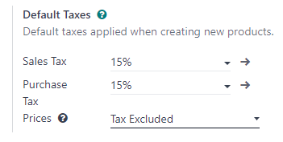
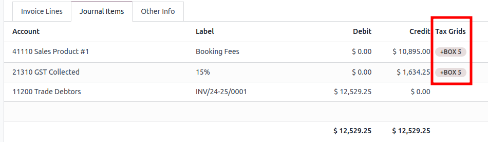
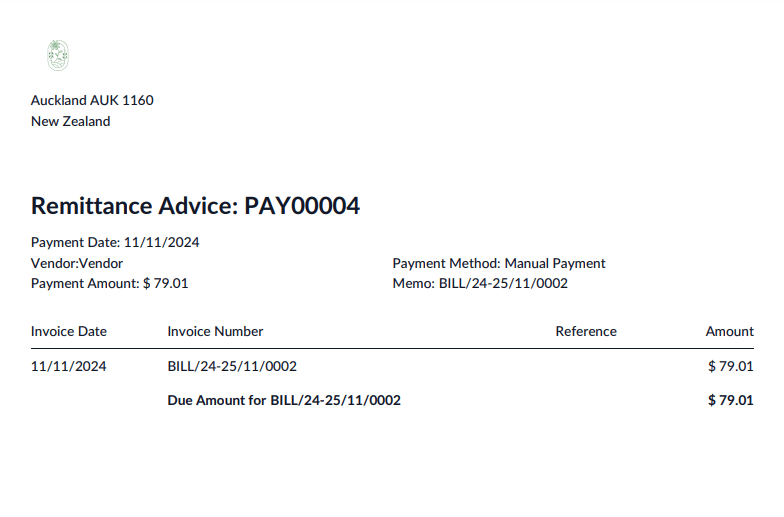
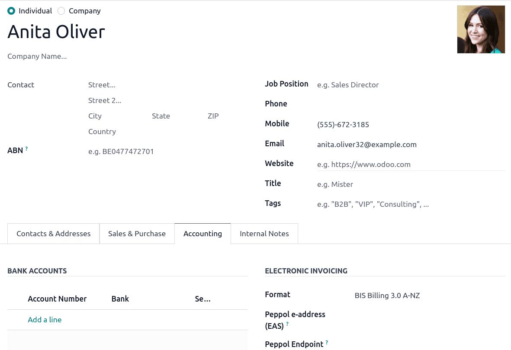
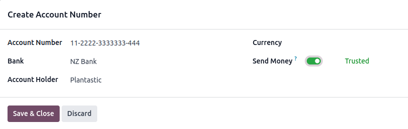
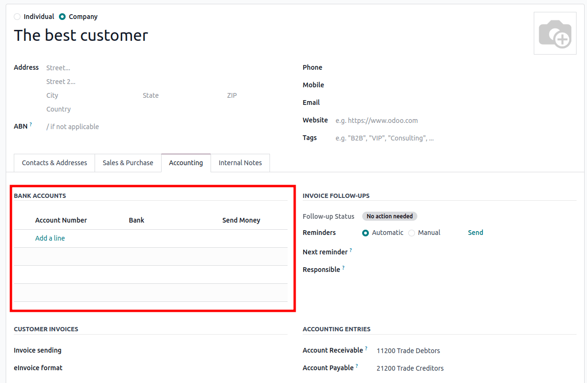
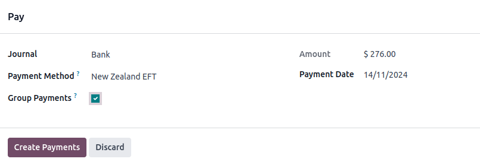
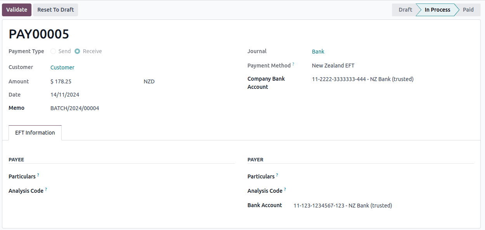
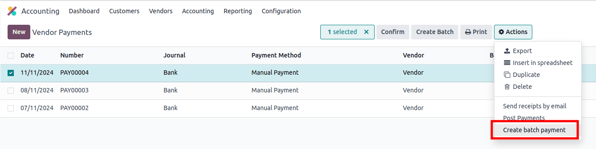
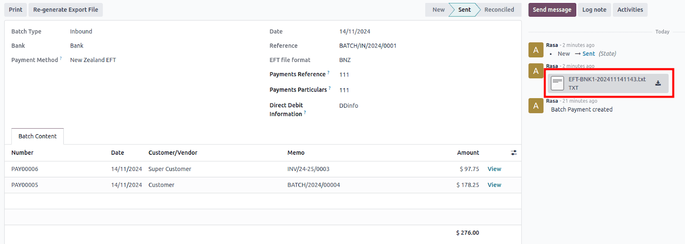

===========
New Zealand
===========

Configuration
=============

.. list-table::
   :widths: 25 25 50
   :header-rows: 1

   * - Name
     - Technical name
     - Description
   * - :guilabel:`New Zealand - Accounting`
     - `l10n_nz`
     - Installed by default when the accounting fiscal localization package is set to New Zealand.
       This module also installs the remittance advice report module.
   * - :guilabel:`Employment Hero NZ Payroll`
     - `l10n_employment_hero`
     - Synchronises all pay runs from Employment Hero with Odoo's journal entries.
   * - :guilabel:`EFT Batch Payment`
     - `l10n_nz_eft`
     - EFT batch payments in New Zealand allow businesses to streamline bulk payments like payroll
       and vendor payments. Each bank has its specific format for these transactions.

Taxes and GST
=============

The default New Zealand taxes impact the
:doc:`GST Report <../../../applications/finance/accounting/reporting/tax_returns>`, which can be
accessed through :menuselection:`Accounting --> Reporting --> Tax Return`

In New Zealand, the standard **Goods and Service Tax** (GST) rate is 15%, but different rates and
exemptions exist for specific categories of goods and services.

Tax Mapping
-----------

Within the New Zealand localisation package, tax names encompass the tax rate as an integral part
of their naming convention.

.. seealso::
   - :doc:`../../../applications/finance/accounting/taxes`

These are the taxes in Odoo 18 configured for New Zealand.

.. list-table::
   :widths: 25 25 25 25
   :header-rows: 1

   * - GST name
     - Description
     - Label on invoices
     - GST Type
   * - 15%
     - Sale (15%)
     - GST Sales (15%)
     - Sales
   * - 15%
     - Purch (15%)
     - GST Purchases (15%)
     - Purchases
   * - 0% EX
     - Zero/Export (0%) Sale
     - Zero Rated (Export) Sales
     - Sales
   * - 0% F
     - Zero/Import (0%) Purch
     - GST Free Purchases
     - Purchases
   * - 0% TPS
     - Purch (Imports Taxable)
     - Purchase (Taxable Imports) - Tax Paid Separately
     - Purchases
   * - 100% ONLY
     - GST Only - Imports
     - GST Only on Imports
     - Purchases

Reports
=======

GST report
----------

The **Goods and Services Tax (GST) report** is a critical tax reporting requirement for businesses
registered for GST in New Zealand. The GST Return is used to report and remit GST to the
**Inland Revenue Department (IRD)**.

.. image:: new_zealand/GST_report.png
   :alt: GST Report.

The base and tax amounts are collected from the **GST**, which is pre-configured in Odoo to align
with New Zealand's GST Return requirements (Boxes 1-15). The **GST** can also be manually
configured for special use cases, such as specific GST treatments (e.g., zero-rating for exported
agricultural goods). Once the **GST** setup for each account is complete, Odoo automatically
categorises journal items into the appropriate boxes. This ensures the **GST** Return is
accurate and fully reflects the business's financial activities.

Closing the GST report
~~~~~~~~~~~~~~~~~~~~~~

When it is time to file the tax return with the **IRD**, click Closing entry. The tax return
period can be configured in :menuselection:`Configuration --> Settings --> Tax Return Periodicity`.
The start date of the tax return period can also be defined on the report itself through the
**period button** (marked by a calendar icon :icon:`fa-calendar`).

.. seealso::
   - :doc:`../../../applications/finance/accounting/reporting/year_end`

Before closing the entry for the first time, the default **GST Payable Account** and **GST
Receivable Account** need to be set. A notification will prompt the user to configure the tax
groups.

 .. image:: new_zealand/GST_report_tax_groups.png
   :alt: GST Reprot Tax Goups.

 Once the **GST Payable** and **GST Receivable** accounts are set up, the **Tax Return** report
 generates an accurate journal closing entry automatically, balancing the GST balance with the GST
 clearing account.

 The balance between **GST Receivable** and **Payable** is set against the tax clearing account
 defined on the tax group. The amount to be paid to or received from **IRD** can then be reconciled
 with a bank statement.

  .. image:: new_zealand/GST_report_tax_journal_items.png
   :alt: GST Reprot Tax Journal Items.

 .. important::
   The **GST** Report is not submitted directly to the **IRD** through Odoo. Instead, Odoo
   automatically calculates the required values for each section, providing options to audit
   and review the data for a clearer understanding of its history. Businesses can then
   manually transfer these values to the `IRD portal <https://myir.ird.govt.nz/_/>`_.

Remittance advice
-----------------

A remittance advice is a document used as proof of payment to a business. In Odoo, it can be
accessed through :menuselection:`Accounting --> Vendors --> Payments`, selecting the payment(s),
and clicking :menuselection:`Print -->Payment Receipt`.

E-Invoicing
===========

PEPPOL
------

Odoo is compliant with Australia's and New Zealand's `PEPPOL requirements <https://peppol.org/learn-more/country-profiles/new-zealand/>`_.
You can find and set up **electronic invoicing** settings per partner under
:menuselection:`Accounting -->Customers` or :menuselection:`Accounting -->Vendors`, select a
partner, and click the Accounting tab.

.. important::
   Validating an invoice or credit note for a partner on the PEPPOL network will download a
   compliant XML file that can be manually uploaded to the PEPPOL network. Odoo is currently in the
   process of becoming an access point for the ANZ region.

EFT Batch Payments
==================

Introduction
------------

An EFT (electronic fund transfer) Batch file is a digital format used in New Zealand to facilitate
bulk payment processing for businesses. It allows companies to consolidate multiple inbound and
outbound payments into a single electronic file. This process is commonly used by businesses
handling multiple payments at once, such as payroll or payments to multiple suppliers.

Configuration
-------------

Settings
~~~~~~~~

 #. :ref:`Activate <general/install>` the EFT Batch Payment module (`l10n_nz_eft`).

 .. image:: new_zealand/eft_batch_payment.png
   :alt: EFT Batch Payment.

#. Go to :menuselection:`Accounting --> Configuration --> Settings --> Customer Payments` to enable
   **Batch Payments**.

.. seealso::
   - :doc:`../../../applications/finance/accounting/payments/batch`

Bank journal
~~~~~~~~~~~~

Then, go to :menuselection:`Accounting --> Configuration --> Journals` to configure the Bank
Account. In the :guilabel:`Journal Entries` tab, enter the :guilabel:`Account Number` and click
:guilabel:`Create and Edit`. In the pop-up window, fill in the following fields:

- :guilabel:`Bank`
- :guilabel:`Account Number`

 .. image:: new_zealand/bank_journal.png
   :alt: Bank Journal.

.. important::
   Send Money defines the bank account as trusted, which is essential for EFT files and must be
   enabled if it is to be used.

.. note::
   The Currency field is optional.

Partners' bank accounts
~~~~~~~~~~~~~~~~~~~~~~~

To add banking information for a partner, navigate to
:menuselection:`Accounting --> Customers --> Customers`,
:menuselection:`Accounting --> Vendors --> Vendors`, or access the partner directly through the
**Contacts** module. Select the relevant partner, then open the **Accounting** tab. Under the
**Bank Accounts** section, click "**Add a line**" to enter the required details.

- :guilabel:`Account Number`
- :guilabel:`Bank`
- :guilabel:`Account Holder` (it will automatically be selected for that partner)
- The Send Money field must be **enabled**.

Generate an EFT file
--------------------

Go to :menuselection:`Accounting --> Customers --> Invoices`
or :menuselection:`Accounting --> Vendors --> Bills`, Select the Invoices/Bills you want to pay
from the list. Once selected, click :guilabel:`Pay` and under Payment Method select
**New Zealand EFT** and :guilabel:`Create Payment`.

.. note::
   The **Group Payment** checkbox is optional. This option appears only if there are multiple
   invoices or bills from the same contact.

Odoo will now open the Payments window. The same payment information can be found under
:menuselection:`Accounting --> Customers --> Payments` or
:menuselection:`Accounting --> Vendors --> Payments`. The required EFT information for each
payment, such as **Particulars** and **Analysis Code**, can be entered as needed.

After completing all required fields, return to the **Payments** list view, select the payments
needing to batch, and click :menuselection:`Actions --> Create Batch Payment`.

In the **Batch Payment** view, fill in the following fields:

- :guilabel:`EFT File Format`
- :guilabel:`Payment Reference`
- :guilabel:`Payment Particulars`

Once all information is completed, click :guilabel:`Validate`. Odoo will generate the EFT file in
the chatter. Click on the file to preview or download it directly to your computer.

.. important::
   Each bank in New Zealand has its specific format requirements for EFT Batch Payments. Make sure
   to choose the correct EFT file format. Some banks may also require you to fill in additional
   fields, such as Direct Debit Information and Dishonour Account.

.. seealso::
   - :doc:`Batch Payment <../../../applications/finance/accounting/payments/batch>`

Industry-specific features
==========================

Starshipit Shipping
-------------------

Starshipit is a shipping service operator that facilitates the integration of Australasian
shipping couriers with Odoo. See our dedicated documentation page.

.. seealso::
   - :doc:`../../../applications/inventory_and_mrp/inventory/shipping_receiving/setup_configuration/starshipit_shipping`
   - `Starshipit Webinar <https://www.youtube.com/watch?v=TcDWnoYLXWg>`_

Buy Now, Pay Later solutions
----------------------------

**Buy Now, Pay Later** solutions are popular payment methods for e-shops in New Zealand. Some of
these solutions are available via the `Stripe <https://stripe.com/au/payments/payment-methods>`_
and `AsiaPay payment <https://www.asiapay.com.au/payment.html#option>`_ providers.

.. seealso::
   - :doc:`AsiaPay Payment Provider <../../../applications/finance/payment_providers/asiapay>`
   - :doc:`Stripe Payment Provider <../../../applications/finance/payment_providers/stripe>`

POS terminals for New Zealand
-----------------------------

If you wish to have a direct connection between Odoo and your PoS terminal in New Zealand, you must
have a **Stripe** terminal. Odoo supports the **EFTPOS** payment solution in New Zealand.

.. note::
   You do not need a Stripe payment terminal to use Odoo as your main PoS system. The only drawback
   of not using Stripe is that cashiers must manually enter the final payment amount on the
   terminal.

.. seealso::
   - :doc:`Stripe Odoo Payment Provider <../../../applications/finance/payment_providers/stripe>`
   - :doc:`Stripe Odoo Payment Terminal <../../../applications/sales/point_of_sale/payment_methods/terminals/stripe>`
   - `Stripe Dashboard <https://dashboard.stripe.com/login?redirect=%2Fdashboard>`_
   - `Stripe Terminal <https://docs.stripe.com/terminal>`_

.. _new-zealand/employment-hero:

Employment Hero Integration
===========================

If your business is already up and running with `Employment Hero <https://employmenthero.com/>`_,
you can use our connector as an alternative payroll solution.

The Employment Hero module synchronises payslip accounting entries (e.g., expenses, social charges,
liabilities, taxes) automatically from **Employment Hero** to Odoo. Payroll administration is still
done in **Employment Hero**. We only record the **journal entries** in Odoo.

Configuration
-------------

#. :ref:`Activate <general/install>` the Employmen Hero Payroll module (`l10n_employment_hero`).
#. Configure the **Employment Hero API** by going to
   :menuselection:`Accounting --> Configuration --> Settings`. More fields become visible after
   clicking on :guilabel:`Enable Employment Hero Integration`.

   .. image:: new_zealand/enable_employment_hero_integration.png
      :alt: Enable Employment Hero Integration.

   - You can find the API Key in the My Account section of the Employment Hero platform.

   .. image:: new_zealand/API_key_employment_hero.png
      :alt: API Key Employment Hero.

   - The Payroll URL is pre-filled with `Employment Hero Payroll <https://employmenthero.nzpayroll.co.nz/>`_

   .. warning::
       Do not modify the **pre-filled Payroll URL**.

   - You can find the **Business ID** in the Employment Hero URL.(i.e., `189241`)

   .. image:: new_zealand/employment_hero_business_ID_189241.png
      :alt: Employment Hero Business ID.

   - You can choose any Odoo journal to post the payslip entries.

#. Configure the tax by going to :menuselection:`Accounting--> Configuration --> Taxes`. Create the
   necessary taxes for the Employment Hero payslip entries. Fill in the tax code from **Employment
   Hero** in the Matching Employment Hero Tax field.

How does the API work?
----------------------

The API syncs the journal entries from **Employment Hero** to Odoo and leaves them in draft mode.
The reference includes the Employment Hero payslip entry ID in brackets for the user to easily
retrieve the same record in Employment Hero and Odoo.

.. image:: new_zealand/employment_hero_odoo_journal_entries_API_sync.png
   :alt: Employment Hero Odoo Journal Entries API Sync.

By default, the synchronisation happens once per week. You can fetch the records manually through
:menuselection:`Accounting --> Configuration --> Settings` and, in the
:guilabel:`Enable Employment Hero Integration` option, click on :guilabel:`Fetch Payruns Manually`.

Employment Hero payslip entries also work based on double-entry bookkeeping.

The accounts used by Employment Hero are defined in the section Payroll settings.

.. image:: new_zealand/employment_hero_settings.png
   :alt: Employment Hero Settings.

For the API to work, you need to create the same accounts as the default accounts of your
Employment Hero business (**same name and same code**) in Odoo. You also need to choose the correct
account types in Odoo to generate accurate financial reports.
