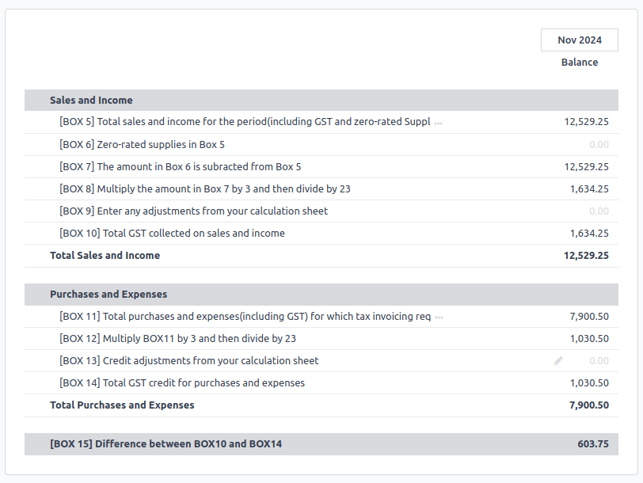
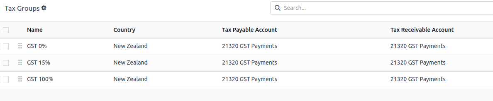
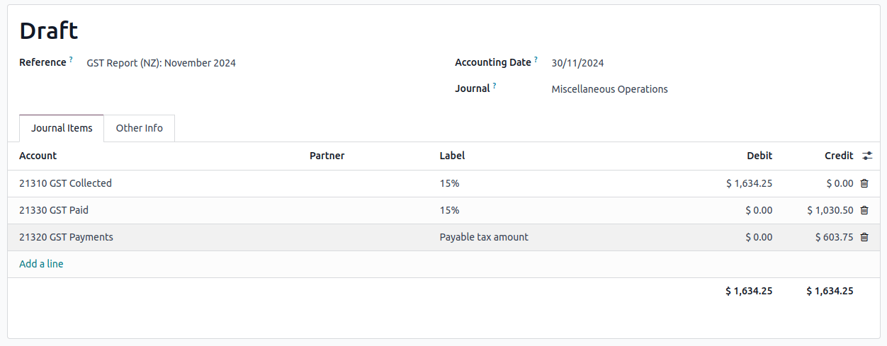
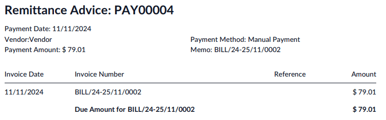
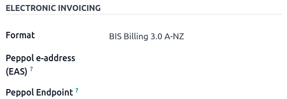
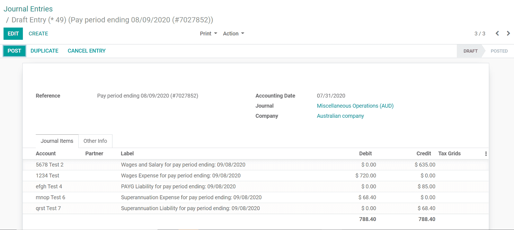
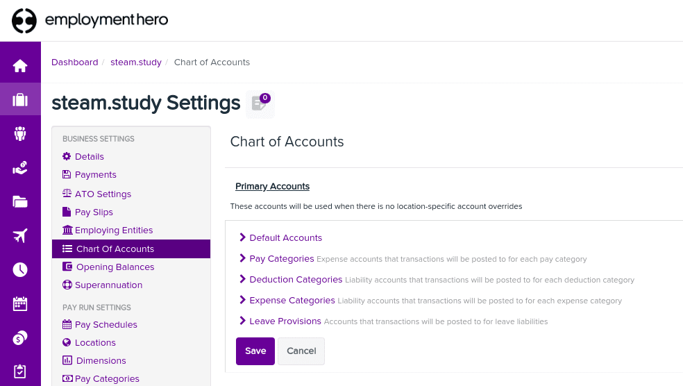

===========
New Zealand
===========

.. _localizations/new_zealand/modules:

Modules
=======

.. list-table::
   :widths: 25 25 50
   :header-rows: 1

   * - Name
     - Technical name
     - Description
   * - :guilabel:`New Zealand - Accounting`
     - `l10n_nz`
     - Installed by default when the accounting fiscal localization package is set to New Zealand.
       This module also installs the remittance advice report module.
   * - :guilabel:`Employment Hero NZ Payroll`
     - `l10n_employment_hero`
     - This module synchronises all pay runs from Employment Hero with Odoo's journal entries.
   * - :guilabel:`EFT Batch Payment`
     - `l10n_nz_eft`
     - This module allows businesses to streamline bulk payments like payroll and vendor payments.
       Each bank has its specific format for these transactions.

.. _localizations/new_zealand/loc-specifics:

Localization specifics
======================

- :ref:`localizations/new_zealand/taxes-gst`
- :ref:`localizations/new_zealand/reporting`

.. _localizations/new_zealand/taxes-gst:

Taxes and GST
-------------

The default taxes impact the
:doc:`GST Report <../../../applications/finance/accounting/reporting/tax_returns>`, which can be
accessed through :menuselection:`Accounting --> Reporting --> Tax Return`

The standard **Goods and Service Tax** (GST) rate is 15%, but different rates and exemptions exist
for specific categories of goods and services.

.. _localizations/new_zealand/tax-mapping:

Tax Mapping
~~~~~~~~~~~

Within the New Zealand localisation package, tax names encompass the tax rate as an integral part
of their naming convention.

.. seealso::
   :doc:`../../../applications/finance/accounting/taxes`

These are the taxes in Odoo.

.. list-table::
   :widths: 25 25 25 25
   :header-rows: 1

   * - GST name
     - Description
     - Label on invoices
     - GST Type
   * - 15%
     - Sale (15%)
     - GST Sales (15%)
     - Sales
   * - 15%
     - Purch (15%)
     - GST Purchases (15%)
     - Purchases
   * - 0% EX
     - Zero/Export (0%) Sale
     - Zero Rated (Export) Sales
     - Sales
   * - 0% F
     - Zero/Import (0%) Purch
     - GST Free Purchases
     - Purchases
   * - 0% TPS
     - Purch (Imports Taxable)
     - Purchase (Taxable Imports) - Tax Paid Separately
     - Purchases
   * - 100% ONLY
     - GST Only - Imports
     - GST Only on Imports
     - Purchases

.. _localizations/new_zealand/reporting:

Reporting
---------

.. _localizations/new_zealand/gst-report:

GST report
~~~~~~~~~~

The **Goods and Services Tax (GST) report** is a critical tax reporting requirement for businesses
registered for GST. The GST Return is used to report and remit GST to the **Inland Revenue
Department (IRD)**.

The base and tax amounts are collected from the **GST**, which is pre-configured in Odoo to align
with GST Return requirements (Boxes 1-15). The **GST** can also be manually configured for special
use cases, such as specific GST treatments (e.g., zero-rating for exported agricultural goods). Once
the **GST** setup for each account is complete, Odoo automatically categorises journal items into
the appropriate boxes. This ensures the **GST** Return is accurate and fully reflects the business's
financial activities.

.. _localizations/new_zealand/gst-closing:

Closing the GST report
**********************

The :ref:`tax return periodicity <tax-returns/periodicity>` must be set up before submitting the
:ref:`tax return <tax-returns/report>` to the **IRD**.

.. seealso::
   :doc:`../../../applications/finance/accounting/reporting/year_end`

Before closing the entry for the first time, the default **GST Payable Account** and **GST
Receivable Account** need to be set. A notification will prompt the user to configure the tax
groups.

Then, the **Tax Return** report generates an accurate journal closing entry automatically, balancing
the GST balance with the GST clearing account.

The balance between **GST Receivable** and **Payable** is set against the tax clearing account
defined on the tax group. The amount to be paid to or received from **IRD** can then be reconciled
with a bank transactions.

.. important::
   The **GST** Report is not submitted directly to the **IRD** through Odoo. Instead, Odoo
   automatically calculates the required values for each section, providing options to audit
   and review the data for a clearer understanding of its history. Businesses can then
   manually transfer these values to the `IRD portal <https://myir.ird.govt.nz/_/>`_.

.. _localizations/new_zealand/remittance-advice:

Remittance advice
~~~~~~~~~~~~~~~~~

A remittance advice is a document used as proof of payment to a business. To access it, go to
:menuselection:`Accounting --> Vendors --> Payments` and select the payment(s) in the
:guilabel:`Vendor Payments` list view. Then, click :icon:`fa-print` :guilabel:`Print` and
select :guilabel:`Payment Receipt`.

.. _localizations/new_zealand/accounting:

Accounting
==========

.. _localizations/new_zealand/e-invoicing:

E-Invoicing
-----------

Odoo allows :ref:`electronic invoicing <e-invoicing/configuration>` settings to be configured per
contact.

.. important::
   Validating an invoice or credit note for a contact on the PEPPOL network will download a
   compliant XML file that can be manually uploaded to the PEPPOL network. Odoo is currently in the
   process of becoming an access point for the ANZ region.

.. seealso::
   `PEPPOL requirements <https://peppol.org/learn-more/country-profiles/new-zealand/>`_

.. _localizations/new_zealand/eft-batch-payments:

EFT Batch Payments
------------------

An EFT (electronic fund transfer) Batch file is a digital format used to facilitate bulk payment
processing for businesses. It allows companies to consolidate multiple inbound and outbound payments
into a single electronic file. This process is commonly used by businesses handling multiple
payments at once, such as payroll or payments to multiple suppliers.

.. _localizations/new_zealand/eft-configuration:

Configuration
~~~~~~~~~~~~~

.. _localizations/new_zealand/eft-settings:

Settings
********

 #. :ref:`Activate <general/install>` the :guilabel:`EFT Batch Payment module` (`l10n_nz_eft`).
 #. Go to :menuselection:`Accounting --> Configuration --> Settings`. In the :guilabel:`Customer
   Payments` section, enable :guilabel:`Batch Payments`.

.. seealso::
   :doc:`../../../applications/finance/accounting/payments/batch`

.. _localizations/new_zealand/eft-bank-journal:

Bank journal
************

To configure the Bank Account, go to :menuselection:`Accounting --> Configuration --> Journals`. In
the :guilabel:`Journal Entries` tab, enter the :guilabel:`Account Number` and click
:guilabel:`Create and Edit`. In the :guilabel:`Create Account Number` window, fill in the
:guilabel:`Bank`. The :guilabel:`Currency` field is optional. The
:guilabel:`Send Money` option defines the bank account as trusted, which is essential for EFT files
and *must be enabled* if it is to be used.

.. _localizations/new_zealand/eft-contacts:

Contacts' bank accounts
***********************

To add banking information for a contact, navigate to
:menuselection:`Accounting --> Customers --> Customers`,
:menuselection:`Accounting --> Vendors --> Vendors`, or access the contact directly through the
**Contacts** app. Select the relevant contact, then open the :guilabel:`Accounting` tab. Under the
:guilabel:`Bank Accounts` section, click :guilabel:`Add a line` to enter the required details.

- :guilabel:`Account Number`
- :guilabel:`Bank`
- :guilabel:`Account Holder` (it will automatically be selected for that contact)
- :guilabel:`Send Money` must be **enabled**.

.. _localizations/new_zealand/eft-generate:

Generate an EFT file
~~~~~~~~~~~~~~~~~~~~

Go to :menuselection:`Accounting --> Customers --> Invoices`
or :menuselection:`Accounting --> Vendors --> Bills`. In the list view, select the invoices/bills to
be paid from the list and click :guilabel:`Pay`. In the :guilabel:`Payment Method` field, select
:guilabel:`New Zealand EFT` and click :guilabel:`Create Payment`.

.. note::
   The :guilabel:`Group Payment` checkbox is optional. This option appears only if there are
   multiple invoices or bills from the same contact.

In the Payments window, the required EFT information for each payment, such as
:guilabel:`Particulars` and :guilabel:`Analysis Code`, can be entered as needed.

.. note::
   The same payment information can be found under :menuselection:`Accounting --> Customers -->
   Payments` or :menuselection:`Accounting --> Vendors --> Payments`.

Then, return to the **Payments** list view, select the payments needing to batch, and click
:guilabel:`Create Batch`.

In the **Batch Payment** view, fill in the following fields:

- :guilabel:`EFT File Format`
- :guilabel:`Payment Reference`
- :guilabel:`Payment Particulars`

Then, click :guilabel:`Validate`. Odoo will generate the EFT file in the chatter. Click on the file
to preview or download it directly to the computer.

.. important::
   Each bank has its specific format requirements for EFT Batch Payments. Make sure to choose the
   correct EFT file format. Some banks may also require the completion of additional fields, such as
   :guilabel:`Direct Debit Information` and :guilabel:`Dishonour Account`.

.. seealso::
   :doc:`Batch Payment <../../../applications/finance/accounting/payments/batch>`

.. _localizations/new_zealand/XXXXXX:

Industry-specific features
==========================

.. _localizations/new_zealand/starshipit:

Starshipit Shipping
-------------------

:doc:`Starshipit <../../../applications/inventory_and_mrp/inventory/shipping_receiving/setup_configuration/starshipit_shipping>`
is a shipping service operator that facilitates the integration of Australasian shipping couriers
with Odoo.

.. seealso::
   `Starshipit Webinar <https://www.youtube.com/watch?v=TcDWnoYLXWg>`_

.. _localizations/new_zealand/buynow-paylater:

Buy Now, Pay Later solutions
----------------------------

**Buy Now, Pay Later** solutions are popular payment methods for e-shops. Some of these solutions
are available via the `Stripe <https://stripe.com/au/payments/payment-methods>`_ and
`AsiaPay payment <https://www.asiapay.com.au/payment.html#option>`_ providers.

.. seealso::
   - :doc:`AsiaPay Payment Provider <../../../applications/finance/payment_providers/asiapay>`
   - :doc:`Stripe Payment Provider <../../../applications/finance/payment_providers/stripe>`

.. _localizations/new_zealand/pos-terminals:

POS terminals
-------------

To have a direct connection between Odoo and the PoS terminal, a :doc:`Stripe terminal
<../../../applications/sales/point_of_sale/payment_methods/terminals/stripe>` is needed. Odoo
supports the **EFTPOS** payment solution.

.. note::
   A Stripe payment terminal is not needed to use Odoo as the main PoS system. The only drawback
   of not using Stripe is that cashiers must manually enter the final payment amount on the
   terminal.

.. seealso::
   - :doc:`Stripe Odoo Payment Provider <../../../applications/finance/payment_providers/stripe>`
   - `Stripe Dashboard <https://dashboard.stripe.com/login?redirect=%2Fdashboard>`_
   - `Stripe Terminal <https://docs.stripe.com/terminal>`_

.. _new-zealand/payroll:

Payroll
=======

.. _new-zealand/employment-hero:

Employment Hero Integration
---------------------------

If your business is already up and running with `Employment Hero <https://employmenthero.com/>`_,
the connector can be used as an alternative payroll solution.

The Employment Hero module automatically synchronises payslip accounting entries (e.g., expenses,
social charges, liabilities, taxes) from **Employment Hero** to Odoo. Payroll administration is
still done in **Employment Hero**; only the **journal entries** are recorded in Odoo.

.. _new-zealand/employment-hero-configuration:

Configuration
~~~~~~~~~~~~~

#. :ref:`Activate <general/install>` the Employment Hero Payroll module (`l10n_employment_hero`).
#. To configure the **Employment Hero API**, go to to
   :menuselection:`Accounting --> Configuration --> Settings`. In the :guilabel:`Employment Hero`
   section, enable :guilabel:`Enable Employment Hero Integration`. Then, fill in the following
   fields:

   - :guilabel:`API Key`: Can be found in :menuselection:`My Account --> Account Details` of the
     Employment Hero platform.

   - :guilabel:`Payroll URL`: Is pre-filled with `Employment Hero Payroll
     <https://employmenthero.nzpayroll.co.nz/>`_.

     .. warning::
        Do not modify the **pre-filled Payroll URL**.

   - :guilabel:`Business Id`: Can be found in the Employment Hero URL.(i.e., `189241`).

   .. image:: new_zealand/employment_hero_business_ID_189241_new.png
      :alt: Employment Hero Business ID.

   - :guilabel:`Payroll Journal`: Any Odoo journal can be chosen to post the payslip entries.

#. To configure the tax, go to :menuselection:`Accounting--> Configuration --> Taxes`. Create the
   necessary taxes for the Employment Hero payslip entries. Fill in the tax code from **Employment
   Hero** in the :guilabel:`Matching Employment Hero Tax` field.

.. _new-zealand/api:

API Synchronization
~~~~~~~~~~~~~~~~~~~~~~

The API syncs the journal entries from **Employment Hero** to Odoo and leaves them in draft mode.
The reference includes the Employment Hero payslip entry ID in brackets for the user to easily
retrieve the same record in Employment Hero and Odoo.

By default, the synchronisation happens once per week. To fetch the records manually, go to
:menuselection:`Accounting --> Configuration --> Settings` and, in the
:guilabel:`Enable Employment Hero Integration` option, click on :guilabel:`Fetch Payruns Manually`.

Employment Hero payslip entries also work based on double-entry bookkeeping.

The accounts used by Employment Hero are defined in the section Payroll settings.

For the API to work, the same accounts as the default accounts of the Employment Hero business
(**same name and same code**) in Odoo have to be created. The correct account types in Odoo have to
be chosen to generate accurate financial reports.
