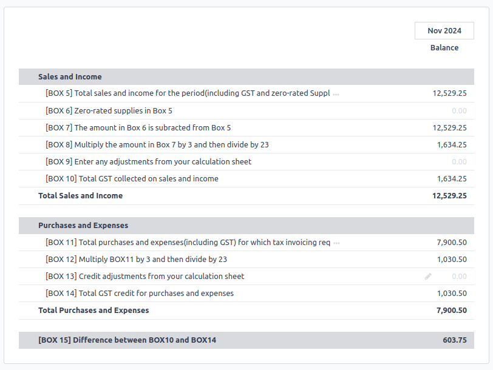
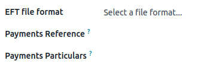

===========
New Zealand
===========

.. _localizations/new_zealand/modules:

Modules
=======

The following modules related to the New Zealand localization are available:

.. list-table::
   :widths: 25 25 50
   :header-rows: 1

   * - Name
     - Technical name
     - Description
   * - :guilabel:`New Zealand - Accounting`
     - `l10n_nz`
     - Installed by default when the accounting fiscal localization package is set to New Zealand.
       This module also installs the remittance advice report module.
   * - :guilabel:`Employment Hero NZ Payroll`
     - `l10n_employment_hero`
     - This module synchronizes all pay runs from Employment Hero with Odoo's journal entries.
   * - :guilabel:`EFT Batch Payment`
     - `l10n_nz_eft`
     - This module allows businesses to streamline bulk payments like payroll and vendor payments.
       Each bank has its specific format for these transactions.

.. note::
   The localization’s core modules are installed automatically with the localization. The rest can
   be manually :doc:`installed </applications/general/apps_modules>`.

.. _localizations/new_zealand/loc-specifics:

Localization overview
=====================

- :doc:`../accounting/get_started/chart_of_accounts`: a predefined structure tailored to New
  Zealand accounting standards
- :doc:`../accounting/taxes/fiscal_positions`: automated tax adjustments based on customer or
  supplier registration status
- :ref:`localizations/new_zealand/taxes-gst`
- :ref:`localizations/new_zealand/reporting`

.. _localizations/new_zealand/taxes-gst:

Taxes and GST
-------------

The default taxes impact the
:doc:`GST report<../../../applications/finance/accounting/reporting/tax_returns>`, which can be
accessed through :menuselection:`Accounting --> Reporting --> Tax Return`

The standard **Goods and Service Tax** (GST) rate is 15%, but different rates and exemptions exist
for specific categories of goods and services.

.. seealso::
   :doc:`GST report<../../../applications/finance/accounting/reporting/tax_returns>`

.. _localizations/new_zealand/tax-mapping:

Tax mapping
~~~~~~~~~~~

Within the New Zealand localization package, tax names encompass the tax rate as an integral part
of their naming convention.

.. seealso::
   :doc:`Taxes documentation <../../../applications/finance/accounting/taxes>`

These are the taxes in Odoo.

.. list-table::
   :widths: 25 25 25 25
   :header-rows: 1

   * - GST name
     - Description
     - Label on invoices
     - GST Type
   * - 15%
     - Sale (15%)
     - GST Sales (15%)
     - Sales
   * - 15%
     - Purch (15%)
     - GST Purchases (15%)
     - Purchases
   * - 0% EX
     - Zero/Export (0%) Sale
     - Zero Rated (Export) Sales
     - Sales
   * - 0% F
     - Zero/Import (0%) Purch
     - GST Free Purchases
     - Purchases
   * - 0% TPS
     - Purch (Imports Taxable)
     - Purchase (Taxable Imports) - Tax Paid Separately
     - Purchases
   * - 100% ONLY
     - GST Only - Imports
     - GST Only on Imports
     - Purchases

.. _localizations/new_zealand/reporting:

Reporting
---------

.. _localizations/new_zealand/gst-report:

GST report
~~~~~~~~~~

The **Goods and Services Tax (GST) report** is a critical tax reporting requirement for businesses
registered for GST. The GST return is used to report and remit GST to the **Inland Revenue
Department (IRD)**.

The base and tax amounts are collected from the **GST**, which is pre-configured in Odoo to align
with GST Return requirements (Boxes 1-15). The **GST** can also be manually configured for special
use cases, such as specific GST treatments (e.g., zero-rating for exported agricultural goods).
Once the **GST** setup for each account is complete, Odoo automatically categorizes journal items
into the appropriate boxes. This ensures the **GST** return is accurate and fully reflects the
business's financial activities.

.. seealso::
   :doc:`Taxes documentation <../../../applications/finance/accounting/taxes>`

.. _localizations/new_zealand/gst-closing:

Closing the GST report
**********************

The :ref:`tax return periodicity <tax-returns/periodicity>` must be set up before submitting the
:ref:`tax return <tax-returns/report>` (**GST report**) to the **IRD**.

.. seealso::
   :doc:`Year-end closing documentation
   <../../../applications/finance/accounting/reporting/year_end>`

Before closing the entry for the first time, enable the :doc:`developer mode
<../../../applications/general/developer_mode>` and go to :menuselection:`Accounting -->
Configuration --> Tax Groups` to set the default **GST payable account** and **GST receivable
account**.

Once the **GST payable** and **GST receivable** accounts are set up, the **Tax Return** report
generates an accurate journal closing entry automatically, balancing the GST balance with the GST
clearing account.

The balance between **GST receivable** and **payable** is set against the tax clearing account
defined on the tax group. The amount to be paid to or received from **IRD** can then be reconciled
with a bank transaction.

.. important::
   The **GST** report is not submitted directly to the **IRD**. Instead, Odoo
   automatically calculates the required values for each section, providing options to audit
   and review the data for a clearer understanding of its history. Businesses can then
   submit these values to the `IRD portal <https://myir.ird.govt.nz/_/>`_.

.. _localizations/new_zealand/remittance-advice:

Remittance advice
~~~~~~~~~~~~~~~~~

A remittance advice is a document used as proof of payment to a business. To access it, go to
:menuselection:`Accounting --> Vendors --> Payments` and select the payment(s). Then click
:icon:`fa-print` :guilabel:`Print` and select :guilabel:`Payment Receipt`.

.. _localizations/new_zealand/accounting:

Accounting
==========

.. _localizations/new_zealand/e-invoicing:

E-invoicing
-----------

Odoo allows :ref:`electronic invoicing <e-invoicing/configuration>` settings to be configured per
contact.

.. important::
   Validating an invoice or credit note for a contact on the PEPPOL network will download a
   compliant XML file that can be manually uploaded to the PEPPOL network. Odoo is currently in the
   process of becoming an access point for the ANZ region.

.. seealso::
   `PEPPOL requirements <https://peppol.org/learn-more/country-profiles/new-zealand/>`_

.. _localizations/new_zealand/eft-batch-payments:

EFT batch payments
------------------

An :abbr:`EFT (electronic funds transfer)` batch file is a digital format used to facilitate bulk
payment processing for businesses. It allows companies to consolidate multiple inbound and outbound
payments into a single electronic file. This process is commonly used by businesses handling
multiple payments at once, such as payroll or payments to multiple suppliers.

.. _localizations/new_zealand/eft-configuration:

Configuration
~~~~~~~~~~~~~

.. _localizations/new_zealand/eft-settings:

 #. :ref:`Install <general/install>` the :guilabel:`EFT Batch Payment` module (`l10n_nz_eft`).
 #. Go to :menuselection:`Accounting --> Configuration --> Settings`. In the
    :guilabel:`Customer Payments` section, enable :guilabel:`Batch Payments`.

.. seealso::
   :doc:`../../../applications/finance/accounting/payments/batch`

.. _localizations/new_zealand/eft-bank-journal:

Bank journal
************

Go to :menuselection:`Accounting --> Configuration --> Journals` to configure the bank **journal**.
In the :guilabel:`Journal Entries` tab, enter the :guilabel:`Account Number` and click
:guilabel:`Create and edit...`. In the :guilabel:`Create Account Number` window, fill in the
:guilabel:`Bank` and enable :guilabel:`Send Money` to set the bank account as trusted. The
:guilabel:`Currency` field is optional.

.. _localizations/new_zealand/eft-contacts:

Contacts' bank accounts
***********************

To add banking information for a contact, navigate to
:menuselection:`Accounting --> Customers --> Customers`,
:menuselection:`Accounting --> Vendors --> Vendors`, or access the contact directly through the
**Contacts** app. Select the relevant contact, then open the :guilabel:`Accounting` tab. Under the
:guilabel:`Bank Accounts` section, click :guilabel:`Add a line` to enter the required details.

- :guilabel:`Account Number`
- :guilabel:`Bank`
- :guilabel:`Account Holder` (it will automatically be selected for that contact)
- :guilabel:`Send Money` must be **enabled**.

.. _localizations/new_zealand/eft-generate:

Generate an EFT file
~~~~~~~~~~~~~~~~~~~~

Go to :menuselection:`Accounting --> Customers --> Invoices`
or :menuselection:`Accounting --> Vendors --> Bills`. Select the invoices/bills to be paid from the
list and click :guilabel:`Pay`. In the :guilabel:`Payment Method` field, select
:guilabel:`New Zealand EFT` and click :guilabel:`Create Payment`.

.. note::
   The :guilabel:`Group Payment` checkbox is optional. This option appears only if there are
   multiple invoices or bills from the same contact.

In the payments window, the required EFT information for each payment, such as
:guilabel:`Particulars` and :guilabel:`Analysis Code`, can be entered as needed.

.. note::
   The same payment information can be found under :menuselection:`Accounting --> Customers -->
   Payments` or :menuselection:`Accounting --> Vendors --> Payments`.

Then, return to the **payments** list view, select the payments needing to be batched, and click
:guilabel:`Create Batch`.

In the **batch payment** window, fill in the following fields:

- :guilabel:`EFT file format`
- :guilabel:`Payment Reference`
- :guilabel:`Payment Particulars`

Then, click :guilabel:`Validate`. Odoo will generate the EFT file in the chatter. Click on the file
to preview or download it.

.. important::
   Each bank has its specific format requirements for EFT batch payments. Make sure to choose the
   correct EFT file format. Some banks may also require the completion of additional fields, such
   as :guilabel:`Direct Debit Information` and :guilabel:`Dishonour Account`.

.. seealso::
   :doc:`Batch paments by bank deposit documentation
   <../../../applications/finance/accounting/payments/batch>`

.. _localizations/new_zealand/XXXXXX:

Industry-specific features
==========================

.. _localizations/new_zealand/starshipit:

Starshipit shipping
-------------------

`Starshipit <https://starshipit.com/>`_ is a shipping service operator that facilitates the
integration of Australasian shipping couriers with Odoo.

.. seealso::
   - `Starshipit webinar recording <https://www.youtube.com/watch?v=TcDWnoYLXWg>`_
   - :doc:`Starshipit shipping <../../../applications/inventory_and_mrp/inventory/shipping_receiving/setup_configuration/starshipit_shipping>`

.. _localizations/new_zealand/buynow-paylater:

Buy Now, Pay Later solutions
----------------------------

**Buy Now, Pay Later** solutions are popular payment methods for e-shops. Some of these solutions
are available via the `Stripe <https://stripe.com/au/payments/payment-methods>`_ and
`AsiaPay payment <https://www.asiapay.com.au/payment.html#option>`_ providers.

.. seealso::
   - :doc:`AsiaPay Payment Provider documentation <../../../applications/finance/payment_providers/asiapay>`
   - :doc:`Stripe Payment Provider documentation <../../../applications/finance/payment_providers/stripe>`

.. _localizations/new_zealand/pos-terminals:

Point of Sale terminals
-----------------------

To have a direct connection between Odoo and a PoS terminal, a :doc:`Stripe terminal
<../../../applications/sales/point_of_sale/payment_methods/terminals/stripe>` is needed. Odoo
supports the **EFTPOS** payment solution.

.. note::
   A Stripe payment terminal is not needed to use Odoo as the main POS system. The only drawback
   of not using Stripe is that cashiers must manually enter the final payment amount on the
   terminal.

.. seealso::
   - :doc:`Stripe Payment Provider documentation <../../../applications/finance/payment_providers/stripe>`
   - `Stripe.com Dashboard <https://dashboard.stripe.com/login?redirect=%2Fdashboard>`_
   - `Stripe.com Docs: Terminal <https://docs.stripe.com/terminal>`_

.. _new-zealand/payroll:

Payroll
=======

.. _new-zealand/employment-hero:

Employment Hero integration
---------------------------

If your business is already up and running with `Employment Hero <https://employmenthero.com/>`_,
the connector can be used as an alternative payroll solution.

The Employment Hero module automatically synchronises payslip accounting entries (e.g., expenses,
social charges, liabilities, taxes) from **Employment Hero** to Odoo. Payroll administration is
still done in **Employment Hero**; only the **journal entries** are recorded in Odoo.

.. important::
   To :ref:`configure the Employment Hero API <employment_hero/configuration>` for **New Zealand**,
   use the following value as :guilabel:`Payroll URL`: `https://api.nzpayroll.co.nz/`.
