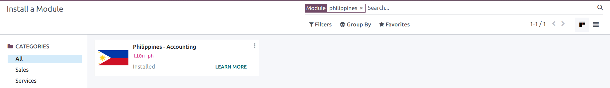
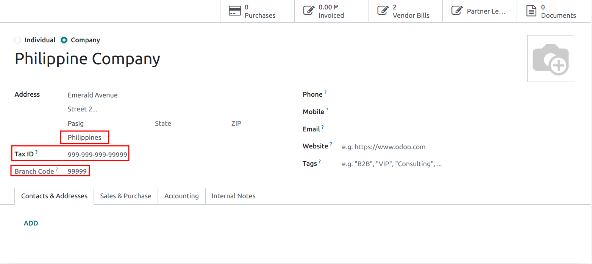
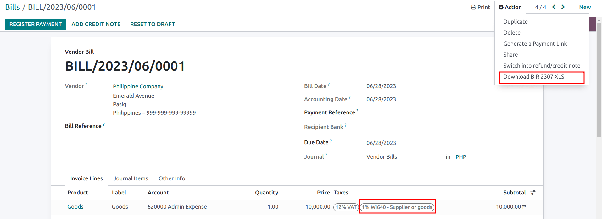
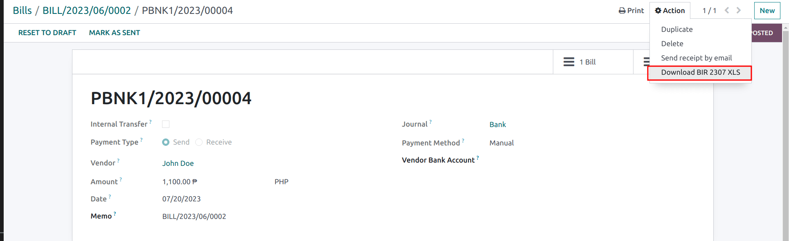

===========
Philippines
===========

Introduction
============

**l10n_ph** module adds accounting localization features for the Philippines such as Chart of Accounts, Taxes, 
and the BIR 2307 report.
These provide a base template to get started with using Philippine accounting.

Configuration
=============

Module installation
-------------------

:ref:`Install <general/install>` the following module to get all the features of the Philippine
localization:

.. note::
   - When creating a new database and `Philippines` is selected as a country, the fiscal localization module :guilabel:`Philippines - Accounting` is automatically installed.
   - If installing the module in a existing database, the Chart of Accounts and Taxes will *not* be replaced if there is changes.
   - The BIR 2307 report will be installed but the witholding taxes may need to be manually created.

Chart of accounts & taxes
-------------------------
A minimum configuration default chart of accounts is installed and following types of taxes is installed and also linked to the relevant account:

- VAT 12%.
- VAT Exempt.
- Withholding taxes.

For the Witholding taxes, there is an additional field under :menuselection:`Philippines --> Philippines ATC`:

.. image:: philippines/philippines-atc-code.png
   :align: center
   :alt: Philippines ATC code field set on taxes.

This is the ATC code for that tax when it is exported in the BIR 2307 file. 
This will need to be filled in manually if the taxes are manually created.

Contacts
--------
In the :guilabel:`Contacts`, if it is set as a :guilabel:`Company` and the :guilabel:`Country` is `Philippines`, 
fill in the :guilabel:`Tax ID` field with the `Taxpayer Identification Number (TIN)`:

In the :guilabel:`Contacts`, if it is set as a :guilabel:`Individual`, the :guilabel:`Country` is `Philippines` and it does not belong to any company, fill in the :guilabel:`Tax ID` field with the `Taxpayer Identification Number (TIN)`.
There is additional fields for:

- :guilabel:`First Name`
- :guilabel:`Middle Name`
- :guilabel:`Last Name`

.. image:: philippines/philippines-contact-individual.png
   :align: center
   :alt: Individual type contact.

.. note::
   For both :guilabel:`Company` and :guilabel:`Individual`, the TIN would follow the format `NNN-NNN-NNN-NNNNN`
   The branch code would follow the last digits of the TIN number or else it can be left as `00000`.

Workflows
=========

BIR 2307 Report
---------------
**BIR 2307** report data also known as *Certificate of Creditable Tax Withheld at Source*
can be generated for purchase orders and vendor payments with the applicable withholding taxes.

The file can be generated from :menuselection:`Vendor Bills --> Action -->Download BIR 2307 XLS`:

The same action can be performed on multiple Vendor Bills:

.. image:: philippines/philippines-multi-bill.png
   :align: center
   :alt: Multiple Vendor Bill selected with action to "Download BIR 2307 XLS"

A pop-up will appear to review the selection and then click on :guilabel:`Generate`:

.. image:: philippines/philippines-generate.png
   :align: center
   :alt: Pop up menu to generate BIR 2307 XLS file
   
This will generate the `Form_2307.xls` file that lists all the vendor bill lines with the applicable withholding tax.

.. note::
   If there is no witholding tax applied then the XLS file will not generate records for those vendor bill lines.

The same process above can be done for a *single* vendor :doc:`payment <../accounting/payments>` as well if they were linked to 
one or more :doc:`vendor bills <../accounting/payments/multiple>` with applied withholding taxes.

   
.. note::
   When grouping payment for multiple bills, Odoo will split the payments based on the contact.
   When :menuselection:`Payment --> Action --> Download BIR 2307 XLS` 
   the report will only be for those vendor bills for the single contact only.

.. important::
   Odoo cannot generate the BIR 2307 PDF report or `DAT` files directly.
   The generated `Form_2307.xls` file can be exported to an *external* tool to convert it to BIR `DAT` format or PDF.