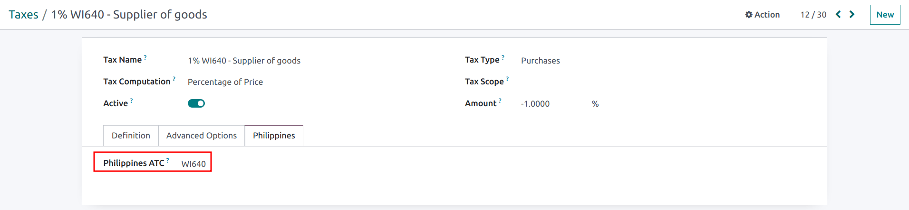
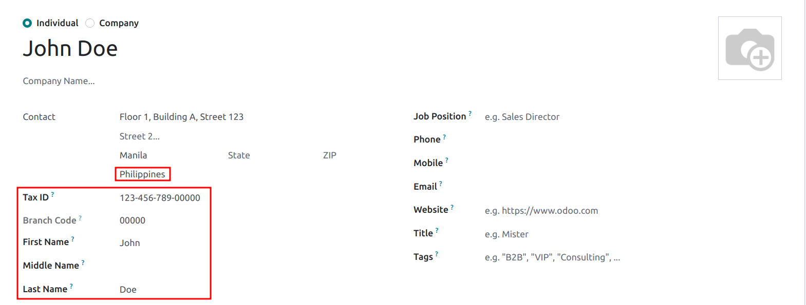
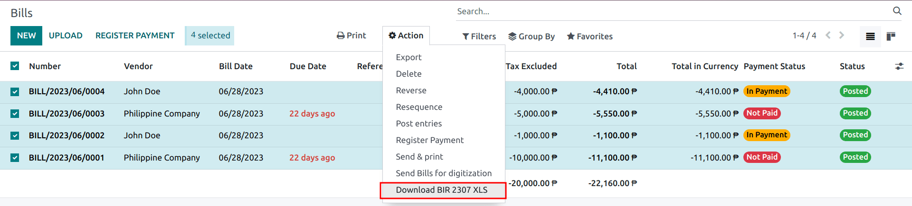
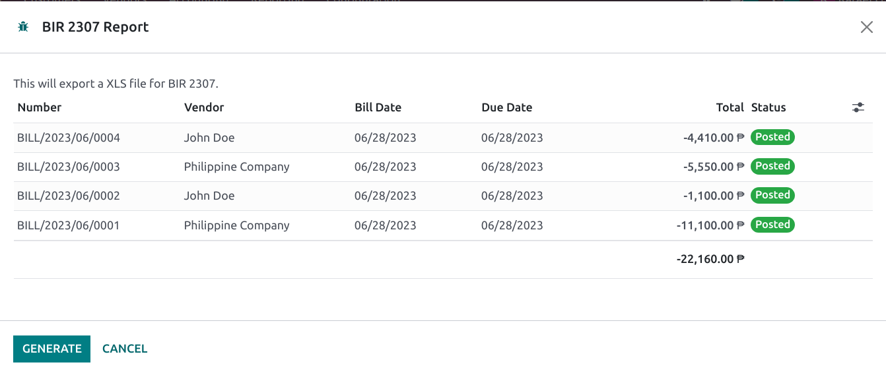

===========
Philippines
===========

Configuration
=============

:ref:`Install <general/install>` the :guilabel:`🇵🇭 Philippines` :ref:`fiscal localization package
<fiscal_localizations/packages>` to get all the default accounting features of the Philippine
localization, such as a chart of accounts, taxes, and the BIR 2307 report. These provide a base
template to get started with using Philippine accounting.

.. note::
   - When creating a new database and `Philippines` is selected as a country, the fiscal
     localization module **Philippines - Accounting** is automatically installed.
   - If installing the module in an existing company, the **chart of accounts** and **taxes** will
     *not* be replaced if there are already posted journal entries.
   - The BIR 2307 report is installed, but the withholding taxes may need to be manually created.

Chart of accounts and taxes
---------------------------

A minimum configuration default chart of accounts is installed, and the following types of taxes are
installed and also linked to the relevant account:

- VAT 12%
- VAT Exempt
- Withholding taxes

For the withholding taxes, there is an additional :guilabel:`Philippines ATC` field under the
:guilabel:`Philippines` tab.

Taxes' ATC codes are used for the BIR 2307 report. If a tax is created manually, its ATC code must
be added.

Contacts
--------

When a company or an individual (not belonging to a company) contact is located in the Philippines,
fill in the :guilabel:`Tax ID` field with their `Taxpayer Identification Number (TIN)`.

For individuals not belonging to a company, identify them by using the following additional fields:

- :guilabel:`First Name`
- :guilabel:`Middle Name`
- :guilabel:`Last Name`

.. note::
   For both :guilabel:`Company` and :guilabel:`Individual`, the TIN should follow the
   `NNN-NNN-NNN-NNNNN` format. The branch code should follow the last digits of the TIN, or else it
   can be left as `00000`.

BIR 2307 report
===============

**BIR 2307** report data, also known as *Certificate of Creditable Tax Withheld at Source*,
can be generated for purchase orders and vendor payments with the applicable withholding taxes.

To generate a BIR 2307 report, select one or multiple vendor bills from the list view, and click
:menuselection:`Action --> Download BIR 2307 XLS`.

The same action can be performed on a vendor bill from the form view.

A pop-up appears to review the selection, then click on :guilabel:`Generate`.

This generates the `Form_2307.xls` file that lists all the vendor bill lines with the applicable
withholding tax.

The same process above can also be done for a *single* vendor :doc:`payment
<../accounting/payments>` if they were linked to one or more :doc:`vendor bills
<../accounting/payments>` with applied withholding taxes.

.. note::
   - If there is no withholding tax applied, then the XLS file will not generate records for those
     vendor bill lines.
   - When grouping payments for multiple bills, Odoo splits the payments based on the contact. From
     a payment, clicking :menuselection:`Action --> Download BIR 2307 XLS`, generates a report that
     only includes vendor bills related to that contact.

.. important::
   Odoo cannot generate the BIR 2307 PDF report or DAT files directly.
   The generated `Form_2307.xls` file can be exported to an *external* tool to convert it to BIR DAT
   or PDF format.
