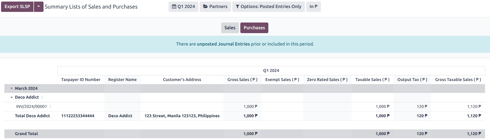
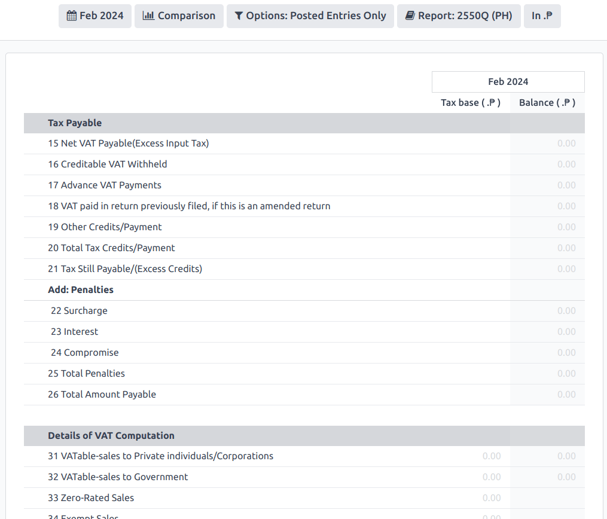

===========
Philippines
===========

Configuration
=============

:ref:`Install <general/install>` the :guilabel:`🇵🇭 Philippines` :ref:`fiscal localization package
<fiscal_localizations/packages>` to get all the default accounting features of the Philippine
localization, such as a chart of accounts, taxes, and the BIR 2307 report. These provide a base
template to get started with using Philippine accounting.

.. note::
   - When creating a new database and selecting the `Philippines` as a country, the fiscal
     localization module **Philippines - Accounting** is automatically installed.
   - If the module is installed in an existing company, the **chart of accounts** and **taxes** will
     *not* be replaced if there are already posted journal entries.
   - The BIR 2307 report is installed, but the withholding taxes may need to be manually created.

Chart of accounts and taxes
---------------------------

A minimum configuration default chart of accounts is installed, and the following types of taxes are
installed and linked to the relevant account:

- Sales and Purchase VAT 12%
- Sales and Purchase VAT Exempt
- Sales and Purchase VAT Zero-Rated
- Purchase Withholding

For the withholding taxes (:menuselection:`Configuration --> Taxes`), there is an additional
:guilabel:`Philippines ATC` field under the :guilabel:`Philippines` tab.

.. image:: philippines/philippines-atc-code.png
   :alt: Philippines ATC code field set on taxes.

.. note::
   Taxes' ATC codes are used for the BIR 2307 report. If a tax is created manually, its ATC code
   must be added.

Contacts
--------

When a company or an individual (not belonging to a company) contact is located in the Philippines,
fill in the :guilabel:`Tax ID` field with their `Taxpayer Identification Number (TIN)`.

For individuals not belonging to a company, identify them by using the following additional fields:

- :guilabel:`First Name`
- :guilabel:`Middle Name`
- :guilabel:`Last Name`

.. image:: philippines/philippines-contact-individual.png
   :alt: Individual type contact with First, Middle, and Last Name fields.

.. note::
   For both :guilabel:`Company` and :guilabel:`Individual`, the TIN should follow the
   `NNN-NNN-NNN-NNNNN` format. The branch code should follow the last digits of the TIN, or else it
   can be left as `00000`.

BIR 2307 report
===============

**BIR 2307** report data, also known as `Certificate of Creditable Tax Withheld at Source
<https://www.bir.gov.ph/index.php/bir-forms/certificates.html>`_, can be generated for purchase
orders and vendor payments with the applicable withholding taxes.

To generate a BIR 2307 report, select one or multiple vendor bills from the list view, and click
:menuselection:`Action --> Download BIR 2307 XLS`.

.. image:: philippines/philippines-multi-bill.png
   :alt: Multiple vendor bills selected with action to "Download BIR 2307 XLS".

.. tip::
   The same action can be performed on a vendor bill from the form view.

A pop-up appears to review the selection, then click on :guilabel:`Generate`.

.. image:: philippines/philippines-generate.png
   :alt: Pop up menu to generate BIR 2307 XLS file.

This generates the `Form_2307.xls` file that lists all the vendor bill lines with the applicable
withholding tax.

The process above can also be used for a *single* vendor :doc:`payment <../accounting/payments>` if
it is linked to one or more :doc:`vendor bills <../accounting/payments>` with applied withholding
taxes.

.. note::
   - If no withholding tax is applied, then the XLS file will not generate records for those vendor
     bill lines.
   - When grouping payments for multiple bills, Odoo splits the payments based on the contact. From
     a payment, clicking :menuselection:`Action --> Download BIR 2307 XLS` generates a report that
     only includes vendor bills related to that contact.

.. important::
   Odoo cannot generate the BIR 2307 PDF report or DAT files directly. The generated
   :file:`Form_2307.xls` file can be exported to an *external* tool to convert it to BIR DAT or PDF
   format.

SLSP Report
===========

The **SLSP** report, also known as the *Summary List of Sales and Purchases*, can be viewed and
exported (in XLSX format). The report can be viewed from :menuselection:`Reporting --> Partner
Reports --> Summary List of Sales and Purchases`.

The report is split into two sections, which can be accessed from their respective buttons at the
top:

- | :guilabel:`Sales` for :abbr:`SLS (Summary List of Sales)` report
  | All customer invoices with the associated sales taxes applied are shown in this report.
- | :guilabel:`Purchases` for :abbr:`SLP (Summary List of Purchases)` report
  | All vendor bills with the associated purchase taxes applied are shown in this report.

By default, both reports exclude journal entries containing partners without a TIN number set and
those with importation taxes set. To view or hide them, the :guilabel:`Options:` button gives
additional filters to include these, among others:

- `Including Partners Without TIN`
- `Including Importations`

.. important::
   Odoo cannot generate the DAT files directly. The :guilabel:`Export SLSP` and :guilabel:`XLSX`
   buttons export an XLSX file, which can be processed using an *external* tool to convert to the
   DAT format.

2550Q Tax report
================

The tax report report is accessible by navigating to :menuselection:`Reporting --> Statement Reports
--> Tax Report --> 2550Q(PH)`. The form is based on the latest *2550Q (Quarterly Value-Added Tax
Return)* Jan. 2023 version.

.. tip::
   Most lines in the tax report are automatically computed based on the taxes. For more accurate
   reporting and filing of the tax report, manual journal entries can also be mapped to the tax
   report through preconfigured **Tax Grids** for each tax report line.

.. important::
   Odoo cannot generate the 2550Q BIR formatted PDF report directly. It should be used as a
   reference when externally filing the form manually or online.
