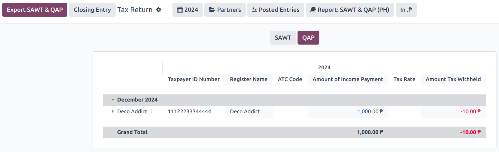

===========
Philippines
===========

Configuration
=============

:ref:`Install <general/install>` the :guilabel:`🇵🇭 Philippines` :ref:`fiscal localization package
<fiscal_localizations/packages>` to get all the default accounting features of the Philippine
localization, such as a chart of accounts, taxes, and reports. These provide a base template to get
started with using Philippine accounting.

.. note::
  - When creating a new database and selecting the `Philippines` as a country, the fiscal
    localization module **Philippines - Accounting** is automatically installed.
  - If the module is installed in an existing company, the **chart of accounts** and **taxes** will
    *not* be replaced if there are already posted journal entries.

Chart of accounts and taxes
---------------------------

A minimum configuration default chart of accounts is installed, and the following types of taxes are
installed and linked to the relevant account:

- Sales and Purchase VAT 12%
- Sales and Purchase VAT Exempt
- Sales and Purchase VAT Zero-Rated
- Sales and Purchase Withholding

For the withholding taxes (:menuselection:`Accounting --> Configuration --> Taxes`), there is an
additional :guilabel:`Philippines ATC` field under the :guilabel:`Philippines` tab.

.. image:: philippines/philippines-atc-code.png
  :alt: Philippines ATC code field set on taxes.

.. note::
  Taxes' ATC codes are used for the :ref:`BIR 2307 <localizations/philippines/report-BIR1207>`,
  :ref:`SAWT and QAP reports <localizations/philippines/report-QAP-SAWT>`. If a tax is created
  manually, its ATC code must be added.

Contacts
--------

When a company or an individual (not belonging to a company) contact is located in the Philippines,
fill in the :guilabel:`Tax ID` field with their `Taxpayer Identification Number (TIN)`.

For individuals not belonging to a company, identify them by using the following additional fields:

- :guilabel:`First Name`
- :guilabel:`Middle Name`
- :guilabel:`Last Name`

.. note::
  For both :guilabel:`Company` and :guilabel:`Individual`, the TIN should follow the
  `NNN-NNN-NNN-NNNNN` format. The branch code should follow the last digits of the TIN, or else it
  can be left as `00000`.

Reports
=======

.. _localizations/philippines/report-BIR1207:

BIR 2307 report
---------------

**BIR 2307** reports, also known as `Certificate of Creditable Tax Withheld at Source
<https://www.bir.gov.ph/bir-forms?tab=Certificates&idTag=BIR2307&datasetCode=3381&label=2307&type=TAB%20LINK>`_,
can be generated for purchase orders and vendor payments with the applicable withholding taxes.

To generate a BIR 2307 report, select one or multiple vendor bills from the list view, and click
:menuselection:`Action --> Download BIR 2307 XLS`.

.. tip::
  The same action can be performed on a vendor bill from the form view.

In the pop-up that opens, review the selection and click :guilabel:`Generate`.

This generates the `Form_2307.xls` file that lists all the vendor bill lines with the applicable
withholding tax.

The process above can also be used for a *single* vendor :doc:`payment <../accounting/payments>` if
it is linked to one or more :doc:`vendor bills <../accounting/payments>` with applied withholding
taxes.

.. note::
  - If no withholding tax is applied, then the XLS file will not generate records for those vendor
    bill lines.
  - When grouping payments for multiple bills, Odoo splits the payments based on the contact. From
    a payment, clicking :menuselection:`Action --> Download BIR 2307 XLS` generates a report that
    only includes vendor bills related to that contact.

.. important::
  Odoo cannot generate the BIR 2307 PDF report or DAT files directly. The generated
  :file:`Form_2307.xls` file can be exported to an *external* tool to convert it to BIR DAT or PDF
  format.

SLSP report
-----------

To access the :abbr:`SLSP (Summary List of Sales and Purchases)` report, go to
:menuselection:`Accounting --> Reporting --> Summary List of Sales and Purchases`.

Click the buttons at the top to display the desired report:

- | :guilabel:`Sales` for the :abbr:`SLS (Summary List of Sales)` report.
  | All customer invoices with the associated sales taxes applied are shown in this report.
- | :guilabel:`Purchases` for the :abbr:`SLP (Summary List of Purchases)` report.
  | All vendor bills with the associated purchase taxes applied are shown in this report.

By default, both reports exclude journal entries containing partners without a TIN number set and
those with importation taxes set. To view or hide them, click :guilabel:`Options:` and select the
required filter:

- :guilabel:`Including Partners Without TIN`
- :guilabel:`Including Importations`

To export the :abbr:`SLSP (Summary List of Sales and Purchases)` report, click :guilabel:`Export
SLSP`.

.. important::
  Odoo cannot generate the DAT files directly. The :guilabel:`Export SLSP` and :guilabel:`XLSX`
  buttons are used to export an XLSX file, which can be processed using an *external* tool to
  convert it to the DAT format.

2550Q tax report
----------------

The tax report report is accessible by navigating to :menuselection:`Accounting --> Reporting -->
Statement Reports --> Tax Report --> 2550Q(PH)`. The form is based on the latest *2550Q
(Quarterly Value-Added Tax Return)* Jan. 2023 version.

.. tip::
  Most lines in the tax report are automatically computed based on the taxes. For more accurate
  reporting and filing of the tax report, manual journal entries can also be mapped to the tax
  report through preconfigured **Tax Grids** for each tax report line.

.. important::
  Odoo cannot generate the 2550Q BIR formatted PDF report directly. It should be used as a
  reference when externally filing the form manually or online.

.. _localizations/philippines/report-QAP-SAWT:

QAP & SAWT reports
------------------

To access the :abbr:`QAP (Quarterly Alphalist of Payees)` and :abbr:`SAWT (Summary Alphalist of
Withholding Tax)` reports, go to :menuselection:`Accounting --> Reporting --> Tax Return`, click
the :icon:`fa-book` :guilabel:`Report:` button, and select :guilabel:`SAWT & QAP (PH)`.

Click the buttons at the top to display the desired report:

- | :guilabel:`SAWT` for the :abbr:`SAWT (Summary Alphalist of Withholding Tax)` report.
  | All customer invoices with the associated sales witholding taxes applied are shown in this
   report.
- | :guilabel:`QAP` for the :abbr:`QAP (Quarterly Alphalist of Payees)` report.
  | All vendor bills with the associated purchase witholding taxes applied are shown in this report.

To export the :abbr:`SAWT (Summary Alphalist of Withholding Tax)` and :abbr:`QAP (Quarterly
Alphalist of Payees)` reports in XLSX format, click :guilabel:`Export SAWT & QAP`.

.. important::
  Odoo cannot generate the DAT files directly. The :guilabel:`Export SAWT & QAP` and
  :guilabel:`XLSX` buttons are used to export an XLSX file, which can be processed using an
  *external* tool to convert it to the DAT format.

Check printing
==============

The Philippine check print layout follows the latest :abbr:`PCHC (Philippine Clearing House
Corporation)` standardized format. To enable check printing, go to :menuselection:`Accounting -->
Configuration --> Settings`, enable :guilabel:`Checks` and set the :guilabel:`Check Layout` to
`Print Check - PH`.

Checks are printed using the :doc:`standard workflow <../accounting/payments/pay_checks>`.
