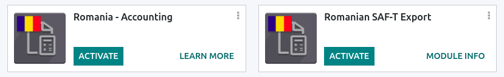
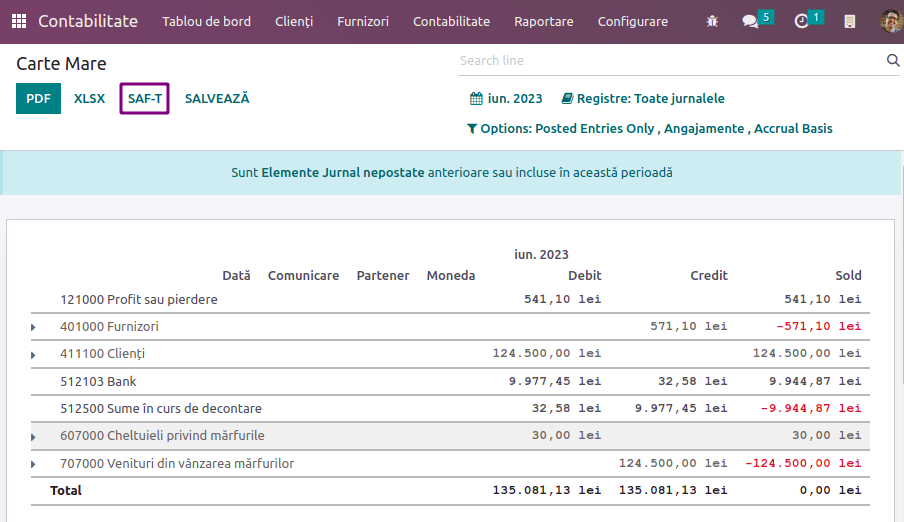
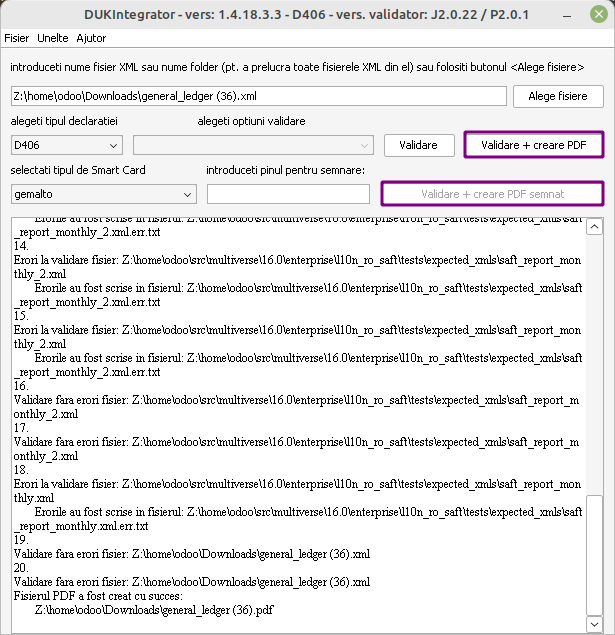

=======
Romania
=======

Configuration
=============

:ref:`Install <general/install>` the following modules to get all the features of the Romanian
localization.

.. list-table::
   :header-rows: 1

   * - Name
     - Technical name
     - Description
   * - :guilabel:`Romania - Accounting`
     - `l10n_ro`
     - Default :ref:`fiscal localization package <fiscal_localizations/packages>`.
   * - :guilabel:`Romanian SAF-T Export`
     - `l10n_ro_saft`
     - Module to generate the **D.406 declaration** in the SAF-T format.

D.406 declaration
=================

Starting January 1, 2023, companies registered for tax purposes in Romania must report their
accounting data to the Romanian Tax Agency monthly or quarterly in the D.406 declaration.

Odoo provides all you need to export the data of this declaration in the SAF-T XML format, which you
can validate and sign using the software provided by the Romanian Tax Agency.

.. note::
   Currently, Odoo only supports the generation of the monthly/quarterly D.406 declaration
   (containing journal entries, invoices, vendor bills, and payments). The yearly declaration
   (including assets) and the on-demand declaration (including inventory) are not yet supported.

Configuration
-------------

Company
~~~~~~~

- Under :guilabel:`Settings --> General Settings`, in the **Companies** section, click
  :guilabel:`Update Info` and fill in the company's :guilabel:`Country`, :guilabel:`City`, and
  :guilabel:`Telephone Number`.
- Provide your company's :abbr:`CUI (Codul Unic de Inregistrare)` number or :abbr:`CIF (*Codul de
  identificare fiscală*)` number (for foreign companies) in the :guilabel:`Company ID` field,
  without the `RO` prefix (e.g., `18547290`).
- If your company is **registered** for VAT in Romania, fill in the :guilabel:`Tax ID` field number,
  including the `RO` prefix (e.g., `RO18547290`). If the company is **not** registered for
  VAT in Romania, you **must not** fill in the :guilabel:`Tax ID` field.
- Open the **Contacts** app and search for your company. Open your company's profile, and in the
  :guilabel:`Accounting` tab, click :guilabel:`Add a line` and add your **bank account number** if
  not informed already. Make sure the profile is set as :guilabel:`Company` above the **name**.

  - You must have at least one **contact person** linked to your company in the **Contacts** app.
    If no **contact person** is linked, create a new one by clicking :guilabel:`New`, set it
    as :guilabel:`Individual`, and select your company in the :guilabel:`Company name` field.

Chart of accounts
~~~~~~~~~~~~~~~~~

To generate a file receivable by the Romanian Tax Agency, the chart of accounts must not deviate
from an official chart of accounts, such as:

- the chart of accounts for commercial companies (*PlanConturiBalSocCom*), which is installed
  by default when creating a company with the Romanian localization or;
- the chart of accounts for companies following `IFRS <https://www.ifrs.org/>`_ (*PlanConturiIFRS*).

Under :guilabel:`Settings --> Accounting`, in the **Romanian localization** section, set the
:guilabel:`Tax Accounting Basis` to reflect the accounting regulations and Chart of Accounts used
by the company.

.. seealso::
   :doc:`../accounting/get_started/chart_of_accounts`

Customer and supplier
~~~~~~~~~~~~~~~~~~~~~

Fill in the :guilabel:`Country`, :guilabel:`City`, and :guilabel:`Zip Code` of each partner that
appears in your invoices, vendor bills, or payments through the **Contacts** app.

For partners that are companies, you must fill in the VAT number (including the country  prefix) in
the :guilabel:`Tax ID` field. If the partner is a company based in Romania, you may instead fill in
the CUI number (without the 'RO' prefix) in the :guilabel:`Company ID` field.

Tax
~~~

You must indicate the :guilabel:`Romanian SAF-T Tax Type` (3-digit number) and :guilabel:`Romanian
SAF-T Tax Code` (6-digit number) on each of the taxes you use. This is already done for the taxes
that exist by default in Odoo. To do so, go to :menuselection:`Accounting --> Configuration -->
Taxes`, select the tax you wish to modify, click the :guilabel:`Advanced Options` tab, and fill in
the **tax type** and **tax code** fields.

.. note::
   The **tax type** and **tax code** are codes defined by the Romanian Tax Agency for the **D.406
   declaration**. These can be found in the Excel spreadsheet published as guidance for completing
   the declaration, which you can find on the `website of the Romanian Tax Agency <https://www.anaf.ro/anaf/internet/ANAF/despre_anaf/strategii_anaf/proiecte_digitalizare/saf_t/>`_.

.. seealso::
   :doc:`../accounting/taxes`

Product
~~~~~~~

For some types of goods transactions, the :guilabel:`Intrastat Code` (Cod NC) must be configured
on the product, as it is required by Romanian law:

- import / export transactions;
- acquisitions / supplies of food products subjected to reduced VAT rate;
- intra-community movements subjected to intrastat reporting;
- acquisitions / supplies subjected to local reversed VAT charge (depending on Cod NC); and
- transactions with excisable products for which excise duties are determined based on the Cod NC.

If the Intrastat Code is not specified on a non-service product, the default code '0' will be used.

To configure the :guilabel:`Intrastat Codes`, go to
:menuselection:`Accounting --> Customers --> Products`, select a product, and in the
:guilabel:`Accounting` tab, set a :guilabel:`Commodity Code`.

.. seealso::
   :doc:`../accounting/reporting/intrastat`

Vendor bill
~~~~~~~~~~~

You must check the :guilabel:`Is self-invoice (RO)?` checkbox in the :guilabel:`Other Info` tab for
any vendor bill that is a self-invoice (i.e. a vendor bill that you issued yourself in the absence
of an invoice document received from a supplier).

Generating the declaration
--------------------------

Exporting your data
~~~~~~~~~~~~~~~~~~~

To export the XML for the D.406 declaration, go to :menuselection:`Accounting --> Reports -->
General Ledger` and click on :guilabel:`SAF-T`.

You can then validate and sign the XML file using the Romanian Tax Agency's validation software,
*DUKIntegrator*.

Signing the report
~~~~~~~~~~~~~~~~~~

Download and install the *DUKIntegrator* validation software found on the `website of the Romanian
Tax Agency <https://www.anaf.ro/anaf/internet/ANAF/despre_anaf/strategii_anaf/proiecte_digitalizare/saf_t/>`_.

Once you have generated the XML, open 'DUKIntegrator' and select the file you have just generated.

Click on :guilabel:`Validare + creare PDF` to create an **unsigned** PDF containing your report, or
:guilabel:`Validare + creare PDF semnat` to create a **signed** PDF containing your report.

If the *DUKIntegrator* validator detects errors or inconsistencies in your data, it generates a file
that explains the errors. In this case, you need to correct those inconsistencies in your data
before you can submit the report to the Romanian Tax Agency.
