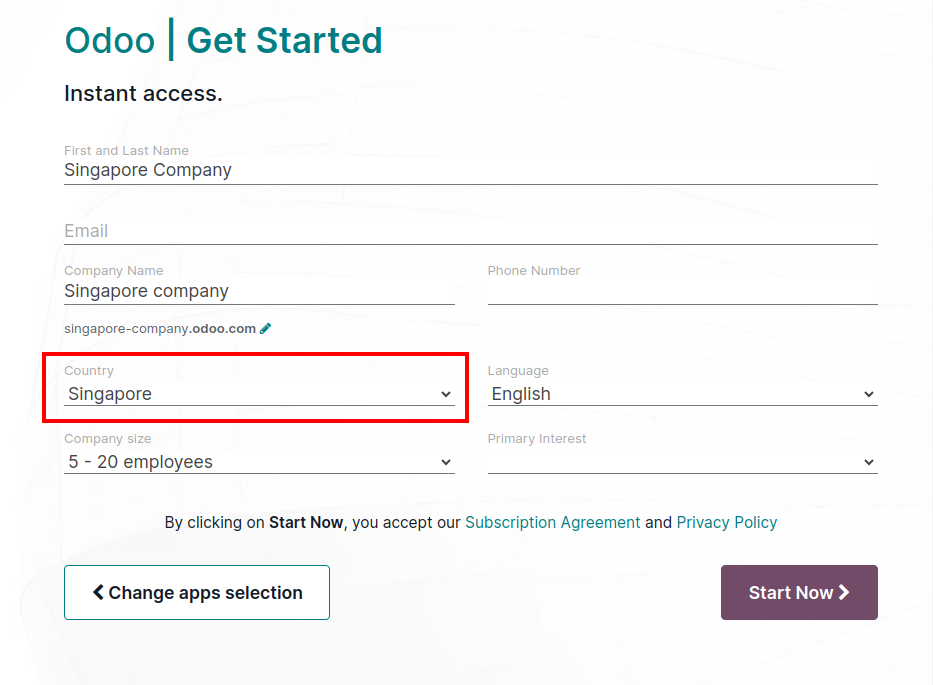
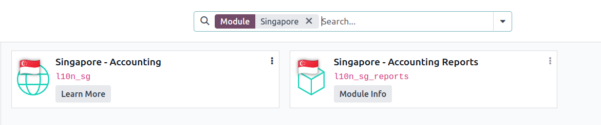
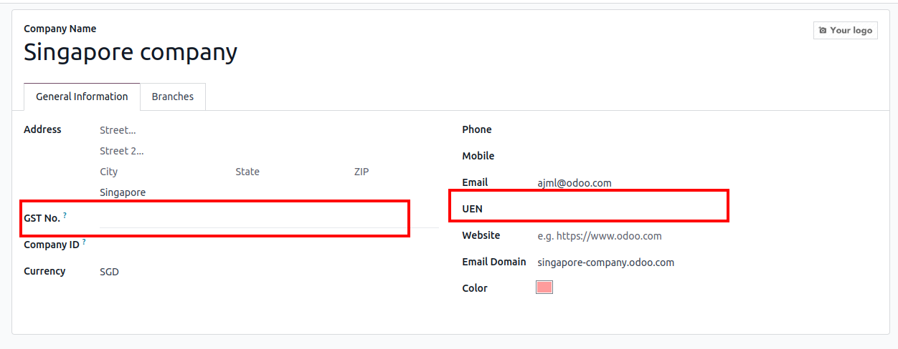
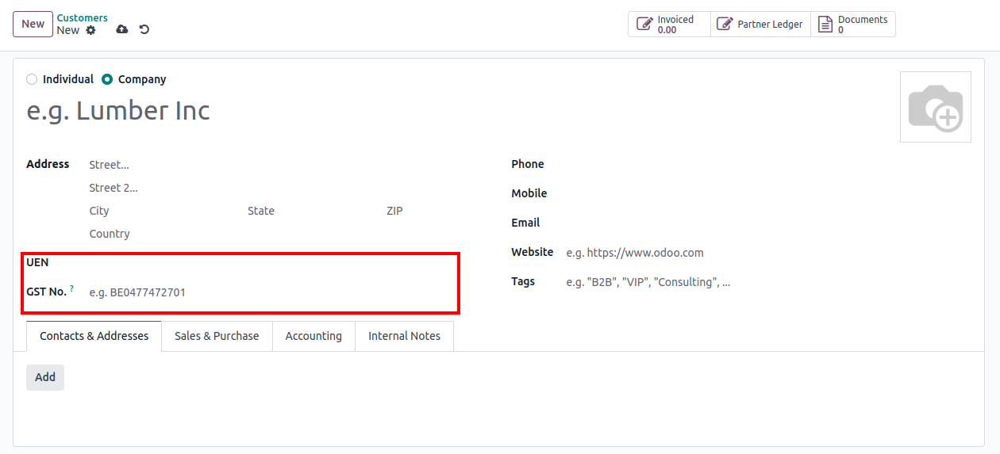
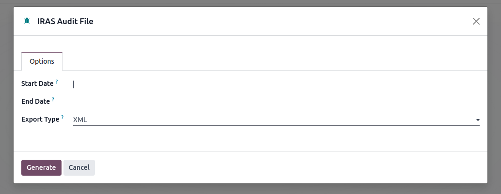
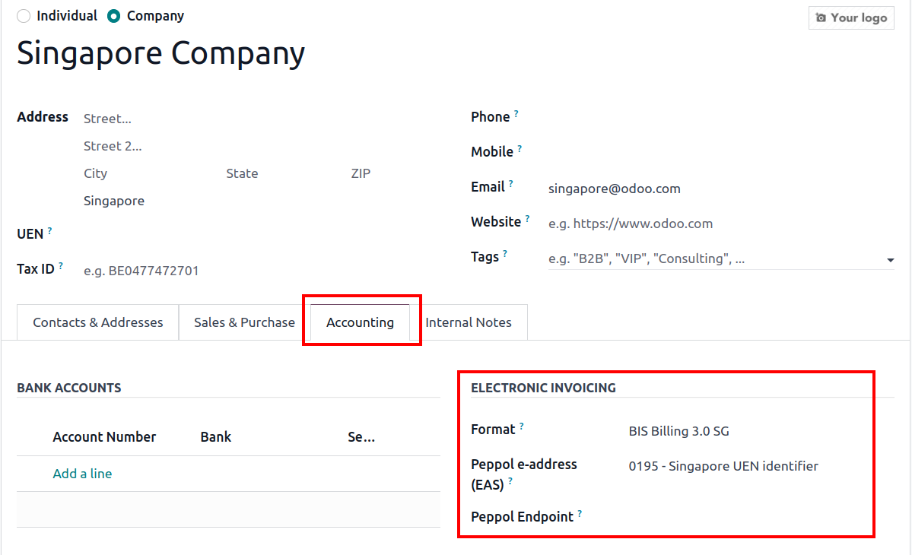
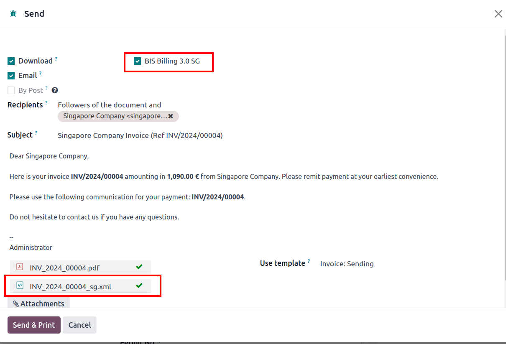
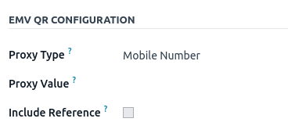
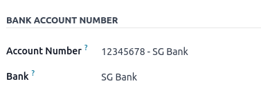

=========
Singapore
=========

Introduction
============

Odoo will automatically configure the accounting module to reflect your chosen package
when you install a localisation package. In this case, you will get the following benefits
when installing the Singaporean localisation.

+---------------------------------+-------------------------+-------------------------------------------------------------------------------+
|           Module Name           |      Module Key         |                                  Description                                  |
+=================================+=========================+===============================================================================+
| Singapore - Accounting          | `ln10_sg`               | This module adds the following:                                               |
|                                 |                         |                                                                               |
|                                 |                         | - Singaporean CoA                                                             |
|                                 |                         | - UEN (Unique Entity Number) Field on Company & Partner                       |
|                                 |                         | - PermitNo & PermitNoDate on Invoice                                          |
+---------------------------------+-------------------------+-------------------------------------------------------------------------------+
| Singapore - Accounting Reports  | `l10n_sg_reports`       | Generate the IRAS Audit file                                                  |
+---------------------------------+-------------------------+-------------------------------------------------------------------------------+
|                                 |                         |                                                                               |
+---------------------------------+-------------------------+-------------------------------------------------------------------------------+
| **Optional Modules**                                                                                                                      |
+---------------------------------+-------------------------+-------------------------------------------------------------------------------+
| Employment Hero Payroll         | `l10n_employment_hero`  | Employment Hero Payroll Integration.                                          |
|                                 |                         | This module will synchronise all payrun journals from Employment Hero to Odoo |
+---------------------------------+-------------------------+-------------------------------------------------------------------------------+

.. _singapore/configuration:

Configuration
=============

The Singapore localisation package can be installed in two ways.

a. via Company Set-up
---------------------

b. via App
----------

Search for the :guilabel:`App` icon in the Odoo Dashboard.

Removed the filter in the search bar and search :guilabel:`Singapore`.

Company Information & Contacts Set-up
=====================================

The following fields will replace the tax ID field when you install the SG localisation:

- **GST No.**
- **UEN**

Company Information
-------------------

Contact form
------------

These fields need to be filled in order to generate some accounting reports.

.. _singapore/Chart of Accounts:

Chart of Accounts (CoA)
=======================

The Singaporean chart of accounts is included in Singapore - Accounting module.

.. note::
   Installing a localisation also installs a default chart of accounts. *The chart of account (i.e. Account Code, Account Name )can be customised
   according to the client's needs.*

.. seealso::
   :doc:`../accounting/get_started/chart_of_accounts`

.. _singapore/taxes_&_gst:

Taxes & GST
===========

*Source:* `IRAS Audit File Document <https://www.iras.gov.sg/docs/default-source/asr/etax_guide_recommended_digital_products_features-v1.pdf?sfvrsn=e2f75b3b_28>`_

The taxes are taken from the IRAS website. Here are the taxes for Singapore in Odoo 17.

.. note::
   The tax rates are updated annually in accordance with the Singaporean government.

   New accounts in the CoA will be created in anticipation of these updates. Older accounts for previous taxes are
   eventually archived.

You can configure the taxes according to your needs by going to :menuselection:`Accounting --> Configuration --> Taxes`.

You can also update the **Tax Return Periodicity**  of the company by going to :menuselection:`Accounting --> Configuration --> Settings`.

.. tabs::
   .. tab:: List of Sales Taxes

      +--------------------+--------------------+----------------------------------------------------------------------------------------------------------+
      | Type of Supply     | Tax Percentage     | Description                                                                                              |
      +====================+====================+==========================================================================================================+
      |                                                             **Standard-Rated**                                                                     |
      +--------------------+--------------------+----------------------------------------------------------------------------------------------------------+
      | SR                 | 9%                 | Standard-Rated supply of goods or services                                                               |
      +--------------------+--------------------+----------------------------------------------------------------------------------------------------------+
      | SRCA-S             | N/A                | Customer Accounting supply made by supplier                                                              |
      +--------------------+--------------------+----------------------------------------------------------------------------------------------------------+
      | SRCA-C             | 9%                 | Customer Accounting supply accountable by the customer on supplier’s behalf                              |
      +--------------------+--------------------+----------------------------------------------------------------------------------------------------------+
      | SRRC               | 9%                 | Imported services and LVG accountable by the customer under the reverse charge mechanism                 |
      +--------------------+--------------------+----------------------------------------------------------------------------------------------------------+
      | SROVR-RS           | 9%                 | Supply of remote services accountable by the electronic marketplace on behalf of thirdparty suppliers    |
      +--------------------+--------------------+----------------------------------------------------------------------------------------------------------+
      | SROVR-LVG          | 9%                 | Supply of LVG accountable by the redeliverer or electronic marketplace on behalf of thirdparty suppliers |
      +--------------------+--------------------+----------------------------------------------------------------------------------------------------------+
      | SRLVG              | 9%                 | Own supply of LVG                                                                                        |
      +--------------------+--------------------+----------------------------------------------------------------------------------------------------------+
      |                                                               **Zero-Rated**                                                                       |
      +--------------------+--------------------+----------------------------------------------------------------------------------------------------------+
      | ZR                 | 0%                 | Zero-Rated                                                                                               |
      +--------------------+--------------------+----------------------------------------------------------------------------------------------------------+
      |                                                                 **Exempt**                                                                         |
      +--------------------+--------------------+----------------------------------------------------------------------------------------------------------+
      | ES33               | N/A                | Regulation 33 Exempt Supplies                                                                            |
      +--------------------+--------------------+----------------------------------------------------------------------------------------------------------+
      | ESN33              | N/A                | Non-Regulation 33 Exempt Supplies                                                                        |
      +--------------------+--------------------+----------------------------------------------------------------------------------------------------------+
      |                                                                 **Deemed**                                                                         |
      +--------------------+--------------------+----------------------------------------------------------------------------------------------------------+
      | DS                 | 9%                 | Deemed                                                                                                   |
      +--------------------+--------------------+----------------------------------------------------------------------------------------------------------+
      |                                                             **Out-of-Scope**                                                                       |
      +--------------------+--------------------+----------------------------------------------------------------------------------------------------------+
      | OS                  | N/A               | Out-of-Scope                                                                                             |
      +--------------------+--------------------+----------------------------------------------------------------------------------------------------------+

   .. tab:: List of Purchase Taxes

      +--------------------+--------------------+----------------------------------------------------------------------------------------------------------+
      | Type of Supply     | Tax Percentage     | Description                                                                                              |
      +====================+====================+==========================================================================================================+
      |                                                             **Standard-Rated**                                                                     |
      +--------------------+--------------------+----------------------------------------------------------------------------------------------------------+
      | TX                 | 9%                 | Standard-rated Purchases                                                                                 |
      +--------------------+--------------------+----------------------------------------------------------------------------------------------------------+
      | TXCA               | 9%                 | Standard-rated purchases of prescribed goods subject to customer accounting                              |
      +--------------------+--------------------+----------------------------------------------------------------------------------------------------------+
      |                                                               **Zero-Rated**                                                                       |
      +--------------------+--------------------+----------------------------------------------------------------------------------------------------------+
      | ZR                 | 0%                 | Purchases from GST-registered suppliers that are subject to GST at 0%                                    |
      +--------------------+--------------------+----------------------------------------------------------------------------------------------------------+
      |                                                             **Imported Goods**                                                                     |
      +--------------------+--------------------+----------------------------------------------------------------------------------------------------------+
      | IM                 | 9%                 | Imports of Goods                                                                                         |
      +--------------------+--------------------+----------------------------------------------------------------------------------------------------------+
      | ME                 | 0%                 | Imports of goods under a Special Scheme                                                                  |
      +--------------------+--------------------+----------------------------------------------------------------------------------------------------------+
      | IGDS               | 9%                 | Imports of goods under the Import GST Deferment Scheme                                                   |
      +--------------------+--------------------+----------------------------------------------------------------------------------------------------------+
      |                                                           **Disallowed Expenses**                                                                  |
      +--------------------+--------------------+----------------------------------------------------------------------------------------------------------+
      | BL                 | 9%                 | Disallowed Expenses                                                                                      |
      +--------------------+--------------------+----------------------------------------------------------------------------------------------------------+
      |                                                **Purchases from Non-GST Registered Suppliers**                                                     |
      +--------------------+--------------------+----------------------------------------------------------------------------------------------------------+
      | NR                 | N/A                | Purchases from Non-GST Registered Suppliers                                                              |
      +--------------------+--------------------+----------------------------------------------------------------------------------------------------------+
      |                                                                 **Exempt**                                                                         |
      +--------------------+--------------------+----------------------------------------------------------------------------------------------------------+
      | EP                 | N/A                | Exempt                                                                                                   |
      +--------------------+--------------------+----------------------------------------------------------------------------------------------------------+
      |                                                              **Out-of-Scope**                                                                      |
      +--------------------+--------------------+----------------------------------------------------------------------------------------------------------+
      | OP                 | N/A                | Supplies outside the scope of the GST Act                                                                |
      +--------------------+--------------------+----------------------------------------------------------------------------------------------------------+
      |                                                    **Purchases by Partially Exempt Traders**                                                       |
      +--------------------+--------------------+----------------------------------------------------------------------------------------------------------+
      | TX                 | 9%                 | Standard-rated purchases directly attributable to the making of taxable supplies                         |
      +--------------------+--------------------+----------------------------------------------------------------------------------------------------------+
      | TXRC-TS            | 9%                 | Imported services and LVG directly attributable to the making of taxable supplies                        |
      +--------------------+--------------------+----------------------------------------------------------------------------------------------------------+
      | IM                 | 9%                 | Import of goods directly attributable to the making of taxable supplies                                  |
      +--------------------+--------------------+----------------------------------------------------------------------------------------------------------+
      | TX-ESS             | 9%                 | Standard-rated purchases directly attributable to Regulation 33 exempt supplies                          |
      +--------------------+--------------------+----------------------------------------------------------------------------------------------------------+
      | TXRC-ESS           | 9%                 | Imported services and LVG directly attributalbe to Regulation 33 exempt supplies                         |
      +--------------------+--------------------+----------------------------------------------------------------------------------------------------------+
      | IM-ESS             | 9%                 | Import of goods directly attributable to Regulation 33 exempt supplies                                   |
      +--------------------+--------------------+----------------------------------------------------------------------------------------------------------+
      | TX-N33             | 9%                 | Standard-rated purchases directly attributable to Non-Regulation 33 exempt supplies                      |
      +--------------------+--------------------+----------------------------------------------------------------------------------------------------------+
      | TXRC-N33           | 9%                 | Imported services and LVG directly attributable to Non-Regulation 33 exempt supplies                     |
      +--------------------+--------------------+----------------------------------------------------------------------------------------------------------+
      | IM-N33             | 9%                 | Import of goods directly attributable to Non-Regulation 33 exempt supplies                               |
      +--------------------+--------------------+----------------------------------------------------------------------------------------------------------+
      | TX-RE              | 9%                 | Purchase from GST-registered suppliers that are subject to GST at 9% and are either attributable to the  |
      |                    |                    | making of both xable and exempt supplies or incurred for the overall running of the business             |
      +--------------------+--------------------+----------------------------------------------------------------------------------------------------------+
      | TXRC-RE            | 9%                 | Imported services and LVG that are subject to reverse charge and are either attributable to the making   |
      |                    |                    | of both taxable and exempt supplies or incurred for the overall running of the businesses                |
      +--------------------+--------------------+----------------------------------------------------------------------------------------------------------+
      | IM-RE              | 9%                 | Import of goods that are subject to GST at 9% and are either attributable to the making of both taxable  |
      |                    |                    | and exempt supplies or incurred for the overall running of the business                                  |
      +--------------------+--------------------+----------------------------------------------------------------------------------------------------------+

.. _singapore/accounting_reports:

Accounting Reports
==================

a. GST Report
-------------

When the Singaporean localisation is installed, the tax report is updated to reflect the legal requirements
as stipulated by the government of Singapore. The GST report format is based on the file submitted to the website.

.. important::
   To know more about :guilabel:`Filing GST returns`, please check this page from the Inland Revenue Authority of Singapore
   `<https://www.iras.gov.sg/taxes/goods-services-tax-(gst)/filing-gst/completing-gst-returns>`_

Proper :doc:`tax closing <../accounting/reporting/tax_returns>` needs to be executed  as it closes and posts the tax return
journal entry. The final tax report may be generated after the tax closing procedure has been done.

.. admonition:: Configuring Additional Taxes and Tax Closing Procedures

   Some taxes may not be included when you download a localisation. You can simply add and configure taxes
   by going to :menuselection:`Accounting --> Configuration --> Settings --> Taxes`.

   In order for the amount to be included in the tax report, the ::guilabel:`tax grids and tax groups`
   need to be configured during the process of adding your taxes.

   For more information, please visit the article regarding :doc:`taxes <../accounting/taxes>`.

b. IRAS Audit File
------------------

Odoo allows export of the GST

The **UEN** and the **GST No** fields are required to generate the IRAS audit file.

To generate the report, go to the :menuselection:`Accounting --> Reporting --> IRAS Audit File`.

Enter the **Start Date** and the **End Date**. Choose the file format and click on **Generate**.

.. _singapore/other_configuration:

Additional Configurations
=========================

1. Electronic Invoicing
-----------------------

Odoo supports **BIS Billing 3.0 SG** the electronic invoicing format.

Enabling Electronic Invoicing
~~~~~~~~~~~~~~~~~~~~~~~~~~~~~

Electronic invoicing can be set-up by accessing your partner's **contact form**. 

You can access the **partner contact form** via the following:

- :menuselection:`Accounting --> Customers`
- :menuselection:`Accounting --> Vendors`
- :menuselection:`Contacts`

Downloading the Electronic Invoicing file (XML)
~~~~~~~~~~~~~~~~~~~~~~~~~~~~~~~~~~~~~~~~~~~~~~~

Once the Sales Order is confirmed, click on :menuselection:`Send & Print` to generate the XML file as you cannot
generate the XML by printing like how you can with invoices or quotations.

:guilabel:`Tick` on *BIS Billing 3.0 SG* to ensure that it gets generated as one it has been missed,
Odoo will not be able to generate the XML file anymore.

**If you do not wish to send an email**, simply :guilabel:`untick` *Email*
and :guilabel:`click` on *'Send & Print'.*

However, you may also simply generate by just :guilabel:`unticking` both *Email* & *Download* then proceed as per usual.

2. Add PayNow QR codes to invoices
----------------------------------

PayNow is a payment service platform that allows customers to make instant domestic payments to
individuals and merchants in Singapore dollars via online and mobile banking.

Activate QR codes
~~~~~~~~~~~~~~~~~

Go to :menuselection:`Accounting --> Configuration --> Settings`. Under the :guilabel:`Customer Payments` section,
activate the :guilabel:`QR Codes` feature.

PayNow bank account configuration
~~~~~~~~~~~~~~~~~~~~~~~~~~~~~~~~~

Go to :menuselection:`Contacts --> Configuration --> Bank Accounts` and select the bank account for
which you want to activate PayNow. Set the :guilabel:`Proxy Type` and fill in the :guilabel:`Proxy
Value` field depending on the type you chose.

.. important::
   - The account holder's country must be set to Singapore on its contact form.
   - You could also include the invoice number in the QR code by checking the :guilabel:`Include
     Reference` checkbox.

.. seealso::
   :doc:`../accounting/bank`

Bank journal configuration
~~~~~~~~~~~~~~~~~~~~~~~~~~

Go to :menuselection:`Accounting --> Configuration --> Journals`, open the bank journal, then fill
out the :guilabel:`Account Number` and :guilabel:`Bank` under the :guilabel:`Journal Entries` tab.

Issue invoices with PayNow QR codes
~~~~~~~~~~~~~~~~~~~~~~~~~~~~~~~~~~~

When creating a new invoice, open the :guilabel:`Other Info` tab and set the :guilabel:`Payment
QR-code` option to *EMV Merchant-Presented QR-code*.

.. image:: singapore/sg-qr-code-invoice-setting.png
   :alt: Select EMV Merchant-Presented QR-code option

Ensure that the :guilabel:`Recipient Bank` is the one you configured, as Odoo uses this field to
generate the PayNow QR code.

3. Employment Hero
------------------

Odoo has created a a connector with Employment Hero as an alternative payroll solution. This module synchronises the payslip
accounting entries automatically that were created from Employment Hero to Odoo.

.. important::
   Odoo only records the journal entries from Employment Hero. Payroll administration is still done in the
   Employment Hero platform.

For more information about configuration, please refer to this document `here. <https://www.odoo.com/documentation/17.0/applications/finance/fiscal_localizations/australia.html#employment-hero-australian-payroll>`_
