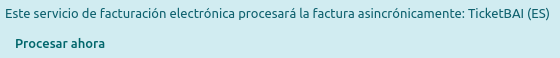
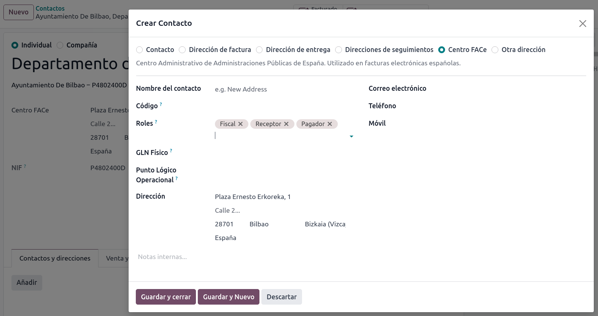

=====
Spain
=====

.. _localizations/spain/modules:

Modules
=======

The following modules are installed automatically with the Spanish localization:

.. list-table::
   :header-rows: 1
   :widths: 25 25 50

   * - Name
     - Technical name
     - Description
   * - :guilabel:`Spain - Accounting (PGCE 2008)`
     - `l10n_es`
     - Spanish :ref:`fiscal localization package <fiscal_localizations/packages>`, complete with
       the Spanish chart of accounts, taxes, tax report, and fiscal positions.
   * - :guilabel:`Spain - Accounting (PGCE 2008) Reports`
     - `l10n_es_reports`
     - Accounting reports for Spain.
   * - :guilabel:`Spain - Accounting Reports (2024 Update)`
     - `l10n_es_reports_2024`
     - Adds extra fields regarding Rectificación for Modelo 303.
   * - :guilabel:`Spain - Facturae EDI`
     - `l10n_es_edi_facturae`
     - Creates EDI Facturae files required to send to AGE (Administración General del Estado).
   * - :guilabel:`Spain - Facturae EDI - Administrative Centers Patch`
     - `l10n_es_edi_facturae_adm_centers`
     - Patch module for Administrative Centers in EDI Facturae.
   * - :guilabel:`Spain - Facturae EDI - Invoice Period`
     - `l10n_es_edi_facturae_invoice_period`
     - Patch module for Invoice Period in EDI Facturae.

Additionally, the following modules must be manually :ref:`installed <general/install>`:

.. list-table::
   :header-rows: 1
   :widths: 25 25 50

   * - Name
     - Technical name
     - Description
   * - :guilabel:`Spain - Modelo 130`
     - `l10n_es_reports_modelo130`
     - Allows Modelo 130 Tax report specifications.
   * - :guilabel:`Spain - Modelo 130 Tax report`
     - `l10n_es_modelo130`
     - Allows Modelo 130 Tax report specifications.
   * - :guilabel:`Spain - Point of Sale`
     - `l10n_es_pos`
     - Spanish localization for Point of Sale.
   * - :guilabel:`Spain - POS + TicketBAI`
     - `l10n_es_pos_tbai`
     - Sends invoices to the Diputaciones Forales of Araba/Álava, Bizkaia and Gipuzkoa.
   * - :guilabel:`Spain - SII EDI Suministro de Libros`
     - `l10n_es_edi_sii`
     - Sends taxes information to SII (Suministro Inmediato de Información).
   * - :guilabel:`Spain - TicketBAI`
     - `l10n_es_edi_tbai`
     - Sends invoices and vendor bills to the Diputaciones Forales of Araba/Álava, Bizkaia and
       Gipuzkoa.
   * - :guilabel:`Spain - Veri*Factu`
     - `l10n_es_edi_verifactu`
     - Sends Veri*Factu XML to AEAT (Agencia Estatal de Administración Tributaria).
   * - :guilabel:`Spain - Veri*Factu for Point of Sale`
     - `l10n_es_edi_verifactu_pos`
     - Adds Veri*Factu support to Point of Sale.

.. note::
   In some cases, such as when upgrading to a version with additional modules, it is possible that
   modules may not be installed automatically. Any missing modules can be manually :doc:`installed
   <../../general/apps_modules>`.

.. _localizations/spain/loc-review:

Localization overview
=====================

The Spanish localization package ensures compliance with Spanish fiscal and accounting regulations.
It includes tools for managing taxes, fiscal positions, reporting, and a predefined chart of
accounts tailored to Spain’s standards.

The Spanish localization package provides the following key features:

- :doc:`Chart of accounts <../accounting/get_started/chart_of_accounts>`: a predefined structure
  tailored to Spanish accounting standards.
- :doc:`Taxes <../accounting/taxes>` pre-configured tax rates, including standard VAT, zero-rated,
  and exempt options.
- :doc:`Fiscal positions <../accounting/taxes/fiscal_positions>`: automated tax adjustments based
  on customer or supplier registration status.
- :ref:`Reporting <localizations/spain/reports>`

.. note::
   - There are several distinct :ref:`Spanish fiscal localization packages
     <fiscal_localizations/packages>` available, each featuring its own pre-configured PGCE (Plan
     General de Contabilidad) :doc:`chart of accounts
     <../accounting/get_started/chart_of_accounts>`:

     - :guilabel:`Spain - SMEs (2008)`
     - :guilabel:`Spain - Non-profit entities (2008)`
     - :guilabel:`Spain - Cooperatives - Complete (2008)`
     - :guilabel:`Spain - Cooperatives - SMEs (2008)`
     - :guilabel:`Spain - Complete (2008)`

   - New Odoo Online databases created with Spain as the selected country are set up by default with
     the :guilabel:`Spain - SMEs (2008)` fiscal localization package.

.. _localizations/spain/reports:

Reports
-------

The Spanish-specific statement reports available are:

- Balance Sheet
- Profit & Loss (ES)
- EC Sales List
- :ref:`Tax report (Modelo) <localizations/spain/tax-report>`

.. _localizations/spain/tax-report:

Tax report
~~~~~~~~~~

To access Spain-specific tax reports (Modelo), go to :menuselection:`Accounting --> Reporting -->
Tax Report`, click :icon:`fa-book` :guilabel:`Report:` and select one of the following:

- Tax Report (Mod 111)(ES)
- Tax Report (Mod 115)(ES)
- :ref:`Tax Report (Mod 130)(ES) <localizations/spain/modelo-130>`
- Tax Report (Mod 303)(ES)
- Tax Report (Mod 347)(ES)
- Tax Report (Mod 349)(ES)
- Tax Report (Mod 390)(ES)

.. tip::
   To export the VAT records books (Libros de IVA) in XLSX format, click :icon:`fa-book`
   :guilabel:`Report:` and select :guilabel:`Generic Tax report`. Then, click the
   :icon:`fa-caret-down` :guilabel:`(down arrow)` and select :guilabel:`VAT Records Books (XLSX)` to
   generate the XLSX file.

.. _localizations/spain/modelo-130:

Modelo 130
~~~~~~~~~~

.. _localizations/spain/modelo-130-percentage:

Change the percentage
*********************

If you wish to change the percentage computation of the box :guilabel:`[04]` under the :guilabel:`I`
section and/or of the box :guilabel:`[09]` under the :guilabel:`II` section:

#. Activate the :ref:`developer mode <developer-mode>`, go to :menuselection:`Accounting -->
   Reporting --> Tax Report`, and select the report :guilabel:`Tax report (Modelo 130)`.
#. Click the :icon:`fa-cogs` (:guilabel:`cogs`) icon to the right of :guilabel:`Report: Tax Report
   (Mod 130) (ES)`.
#. Click the box you wish to change, and in the pop-up window, click on the :guilabel:`percentage`
   line. In the new pop-up window, change the value in the :guilabel:`Formula` field to the
   percentage you wish to apply.
   Repeat this action if you wish to modify the other box as well.

.. _localizations/spain/modelo-130-agriculture:

Report agriculture activity
***************************

If you wish to have any amount input in the :guilabel:`II` section (from boxes :guilabel:`[08]` to
:guilabel:`[11]`), you must change the **industry** of the corresponding contact to
:guilabel:`Agriculture`:

#. Go to the contact form (:menuselection:`Accounting --> Customers --> Customers`
   or :menuselection:`Accounting --> Vendors --> Vendors`, for example), and select a contact.
#. In the :guilabel:`Sales & Purchase` tab, set the :guilabel:`Industry` field to
   :guilabel:`Agriculture`.

Repeat this operation for all contacts related to the **agriculture** industry.

.. _localizations/spain/veri-factu:

Veri*Factu
==========

.. note::
   Producers of Veri*Factu billing systems must self-certify their compliance with the regulations.
   :download:`Download Odoo's "declaración responsable"<spain/declaracion_responsable.pdf>`

**Veri*Factu** is the Spanish Tax Agency's verifiable invoice issuance system. It is mandatory for
most taxpayers in Spain, except for those who use the SII system or are under a regional tax regime
(i.e., TicketBai).

Odoo allows :ref:`invoices <localizations/spain/veri-factu-invoices>` and Point of Sale :ref:`orders
<localizations/spain/veri-factu-orders>` to be automatically sent to the tax authorities.

.. _localizations/spain/veri-factu-configuration:

Configuration
-------------

To enable **Veri\*Factu**, follow these steps:

#. Open the Settings app to make sure your company's :guilabel:`Country` and :guilabel:`Tax ID` are
   correctly set in the :ref:`Companies <general/companies/company>` section.
#. :ref:`Install <general/install>` the :guilabel:`Spain - Veri*Factu` (`l10n_es_edi_verifactu`)
   module.
#. Go to :menuselection:`Accounting --> Configuration --> Settings` or :menuselection:`Invoicing -->
   Configuration --> Settings`, scroll to the :guilabel:`Veri\*Factu` section, check the
   :guilabel:`Enable Veri*Factu` option, and click :icon:`oi-arrow-right` :guilabel:`Manage
   certificates` to add a certificate.
#. In the :guilabel:`Certificates for Veri\*Factu` list view, click :guilabel:`New`.
#. Click :guilabel:`Upload your file`, then select a certificate file and enter the
   :guilabel:`Password` needed to open the certificate (if there is one).

.. note::
   - At least one certificate has to be uploaded.
   - By default Veri*Factu is in testing mode. The data is sent to test servers and is not
     considered official. When official data can be sent to the production servers, go to the
     :guilabel:`Veri\*Factu` section in the :guilabel:`Settings` and disable :guilabel:`Test
     Environment`.

.. _localizations/spain/veri-factu-invoices:

Invoices
--------

Once an :doc:`invoice <../../finance/accounting/customer_invoices>` is confirmed, it can be
:ref:`sent <accounting/invoice/sending>`. In the :guilabel:`Send` window, the Veri*Factu option is
available if Veri*Factu has been enabled.

Click :guilabel:`Send` to generate a JSON file containing the invoice details. This file is stored
as a Veri*Factu document. In the :guilabel:`Veri*Factu` tab, all corresponding documents are
listed by their creation date and current status.

.. tip::
   To download a JSON file, click on its document in the :guilabel:`Veri*Factu` tab. Then, in
   the :guilabel:`Open: Veri*Factu Documents` window, click the link in the :guilabel:`JSON` field.

.. note::
   - The document should be sent to the :abbr:`AEAT (Agencia Estatal de Administración Tributaria)`
     immediately. However, it may be delayed due to mandatory waiting periods between submissions
     required by the :abbr:`AEAT (Agencia Estatal de Administración Tributaria)`. In such cases,
     the document is automatically sent the next time a scheduled action runs.
   - A Veri\*Factu **QR code** appears on the invoice PDF. Scan this code to verify that the invoice
     has been received and recognized by the :abbr:`AEAT (Agencia Estatal de Administración
     Tributaria)`.

.. _localizations/spain/veri-factu-orders:

Point of sale orders
--------------------

Once an order has been :ref:`paid <pos/sell>`, a JSON file containing the order details is
generated. This file is stored as a Veri*Factu document.

Go to :menuselection:`Point of Sale --> Orders --> Orders`. In the :guilabel:`Orders` list view,
select the relevant order. In the :guilabel:`Veri*Factu` tab, all the corresponding documents are
listed by their creation date and current status.

.. tip::
   To download a JSON file, click on its document in the :guilabel:`Veri*Factu` tab. Then, in
   the :guilabel:`Open: Veri*Factu Documents` window, click the link in the :guilabel:`JSON` field.

.. note::
   - The document should be sent to the :abbr:`AEAT (Agencia Estatal de Administración Tributaria)`
     immediately. However, it may be delayed due to mandatory waiting periods between submissions
     required by the :abbr:`AEAT (Agencia Estatal de Administración Tributaria)`. In such cases,
     the document is automatically sent the next time a scheduled action runs.

If an invoice is generated for an order during the payment process, the Veri*Factu document is
:ref:`created and sent for the invoice <localizations/spain/veri-factu-invoices>` instead.

.. note::
   A Veri\*Factu **QR code** appears on the order receipt, even if an invoice is created for the
   order. Scan this code to verify that the invoice has been received and recognized by the
   :abbr:`AEAT (Agencia Estatal de Administración Tributaria)`

.. _localizations/spain/ticketbai:

TicketBAI
=========

`Ticket BAI <https://www.gipuzkoa.eus/es/web/ogasuna/ticketbai>`_ or **TBAI** is an e-Invoicing
system used by the Basque government and its three provincial councils (Álava, Biscay, and
Gipuzkoa). Odoo supports the **TicketBAI (TBAI)** electronic invoicing format for all three regions
of the **Basque Country**.

.. note::
   To use TicketBAI, make sure:

   - :guilabel:`Country` and :guilabel:`Tax ID` fields on the :doc:`company record
     <../../general/companies>` are filled in.
   - :guilabel:`Spain -TicketBAI` (`l10n_es_edi_TBAI`) module is :ref:`installed <general/install>`.

Go to :menuselection:`Accounting --> Configuration --> Settings` and scroll down to the
:guilabel:`Spain Localization` section. In the :guilabel:`Tax Agency for TBAI` field, select a
region and :guilabel:`Save`. Then, click :guilabel:`Manage certificates (SII/TicketBAI)`.

In the :guilabel:`Certificates for EDI invoices on Spain` view, click :guilabel:`New`, then
:guilabel:`Upload your file` to upload the certificate and enter the :guilabel:`Password` provided
by the tax agency.

.. warning::
   To test certificates, go to :menuselection:`Accounting --> Configuration --> Settings` and enable
   :guilabel:`Test Mode` in the :guilabel:`Spain Localization` section.

.. _localizations/spain/ticketbai-usecase:

Use case
--------

Once an invoice has been :doc:`created <../../finance/accounting/customer_invoices>` and confirmed,
a :guilabel:`The invoice will soon be sent to TicketBAI (ES) - Process now` banner appears at the
top.

Invoices are automatically sent through TicketBAI once a day. To manually trigger the scheduled
action and send the invoice, click :guilabel:`Process Now`.

When the invoice is **sent**, the :guilabel:`Electronic Invoice` field status changes to
:guilabel:`Sent`, and the XML file can be found in the **chatter**. Under the
:guilabel:`EDI Documents` tab, the traceability of other generated documents related to the invoice
(e.g., whether the invoice should also be sent through the **SII**) is displayed.

.. note::
   The TBAI **QR code** is displayed on the invoice PDF.

   .. image:: spain/qr-code.png
      :alt: QR code of the TicketBAI on the invoice.

.. _localizations/spain/face:

FACe
====

`FACe <https://face.gob.es/en>`_ is the e-Invoicing platform used by the public administrations in
Spain to send electronic invoices.

Before configuring the :abbr:`FACe (General Entrance for Electronic Invoices)` system,
:ref:`install <general/install>` the :guilabel:`Spain - Facturae EDI` (`l10n_es_edi_facturae`)
module and other **Facturae EDI**-related modules.

To enable FACe, go to :menuselection:`Settings --> General Settings`, click
:guilabel:`Update Info` in the :guilabel:`Companies` section, then click :guilabel:`Update Info` and
set the :guilabel:`Country` and :guilabel:`Tax ID` of your company. Next, add the
:guilabel:`Facturae signature certificate` by clicking :guilabel:`Add a line`, uploading the
certificate provided by the tax agency, and entering the provided password.

.. _localizations/spain/face-usecase:

Use case
--------

Once you have :doc:`created <../../finance/accounting/customer_invoices>` an invoice and confirmed
it, click :guilabel:`Send & Print`. Make sure :guilabel:`Generate Facturae edi file` is enabled, and
click :guilabel:`Send & Print` again. Once the invoice is sent, the generated XML file is available
in the **chatter**.

.. warning::
   The file is **NOT** automatically sent. You have to send it yourself manually.

.. tip::
   You can send **FACe** XML files in batch through `the governmental portal
   <https://www.facturae.gob.es/formato/Paginas/descarga-aplicacion-escritorio.aspx>`_.

.. _localizations/spain/face-administrative-centers:

Administrative centers
----------------------

In order for **FACe** to work with **administrative centers**, the invoice *must* include specific
data about the centers.

.. note::
   Make sure to have the :guilabel:`Spain - Facturae EDI - Administrative Centers Patch`
   (`l10n_es_edi_facturae_adm_centers`) module :ref:`installed <general/install>`.

To add **administrative centers**, create a new **contact** to add to the **partner** company.
Select :guilabel:`FACe Center` as the **type**, assign one or more **role(s)** to that contact, and
:guilabel:`Save`. The **three** roles usually required are:

- Órgano gestor: :guilabel:`Receptor` (Receiver);
- Unidad tramitadora: :guilabel:`Pagador` (Payer);
- Oficina contable: :guilabel:`Fiscal` (Fiscal).

.. tip::
   - If administrative centers need different :guilabel:`Codes` per role, you *must* create
     different centers for each role.
   - When an electronic invoice is created using a partner with **administrative centers**, *all*
     administrative centers are included in the invoice.
   - You can add one contact with multiple roles or multiple contacts with a different role each.
