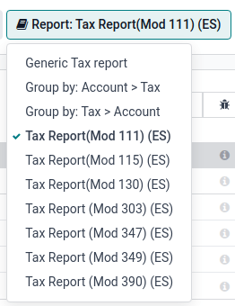

=====
Spain
=====

Configuration
=============

Install the 🇪🇸 **Spanish** :doc:`fiscal localization package <../fiscal_localizations>` to get all
the default accounting features of the Spanish localization.

Three **Spanish** localizations exist, each with its own pre-configured **PGCE** charts of accounts:

- Spain - SMEs (2008);
- Spain - Complete (2008);
- Spain - Non-profit entities (2008).

To select the one to use, go to :menuselection:`Accounting --> Configuration --> Settings` and
select a package in the :guilabel:`Fiscal Localization` section.

.. warning::
   You can only change the accounting package as long as you have not created any accounting entry.

Chart of accounts
=================

You can reach the **Chart of Accounts** by going to :menuselection:`Accounting --> Configuration -->
Accounting: Chart of Accounts`.

.. tip::
    When you create a new Odoo Online database, **Spain - SMEs (2008)** is installed by default.

Taxes
=====

Default Spain-specific taxes are created automatically when the
:guilabel:`Spanish - Accounting (PGCE 2008) (l10n_es)` module is installed, and tax reports are
available when installing the module :guilabel:`Spain - Accounting (PGCE 2008) (l10n_es_reports)`.
Each tax impacts the Spain-specific **tax reports (Modelo)**, available by going to
:menuselection:`Accounting --> Reporting --> Statements Reports: Tax Report`.

Reports
=======

Here is the list of Spanish-specific statement reports available:

- Balance Sheet;
- Profit & Loss;
- EC Sales List;
- Tax Report (Modelo 111);
- Tax Report (Modelo 115);
- Tax Report (Modelo 130);
- Tax Report (Modelo 303);
- Tax Report (Modelo 347);
- Tax Report (Modelo 349);
- Tax Report (Modelo 390).

You can access Spain-specific tax reports by clicking on the **book** icon when on a report and
selecting its Spain-specific version: :guilabel:`(ES)`.

Modelo 130
----------

Change the percentage
~~~~~~~~~~~~~~~~~~~~~

If you wish to change the percentage computation of the box :guilabel:`[04]` under the :guilabel:`I`
section and/or of the box :guilabel:`[09]` under the :guilabel:`II` section:

#. Activate the :ref:`developer mode <developer-mode>`, go to :menuselection:`Accounting -->
   Reporting --> Tax Report`, and select the report :guilabel:`Tax report (Modelo 130)`.
#. Click the :icon:`fa-cogs` (:guilabel:`cogs`) icon to the right of :guilabel:`Report: Tax Report
   (Mod 130) (ES)`.
#. Click the box you wish to change, and in the pop-up window, click on the :guilabel:`percentage`
   line. In the new pop-up window, change the value in the :guilabel:`Formula` field to the
   percentage you wish to apply.
   Repeat this action if you wish to modify the other box as well.

Report agriculture activity
~~~~~~~~~~~~~~~~~~~~~~~~~~~

If you wish to have any amount input in the :guilabel:`II` section (from boxes :guilabel:`[08]` to
:guilabel:`[11]`), you must change the **industry** of the corresponding contact to
:guilabel:`Agriculture`:

#. Go to the contact form (:menuselection:`Accounting --> Customers --> Customers`
   or :menuselection:`Accounting --> Vendors --> Vendors`, for example), and select a contact.
#. In the :guilabel:`Sales & Purchase` tab, set the :guilabel:`Industry` field to
   :guilabel:`Agriculture`.

Repeat this operation for all contacts related to the **agriculture** industry.

TicketBAI
=========

`Ticket BAI <https://www.gipuzkoa.eus/es/web/ogasuna/ticketbai>`_ or **TBAI** is an e-Invoicing
system used by the Basque government and its three provincial councils (Álava, Biscay, and
Gipuzkoa).

Odoo supports the **TicketBAI (TBAI)** electronic invoicing format for all three regions of the
**Basque Country**. To enable **TicketBAI**, set your company's :guilabel:`Country` and
:guilabel:`Tax ID` under :menuselection:`Settings --> General Settings` in the :guilabel:`Companies`
section.

Then, :ref:`install <general/install>` the module :guilabel:`Spain -TicketBAI (l10n_es_edi_TBAI)`,
go to :menuselection:`Accounting --> Configuration --> Settings`, and select a **region** in the
:guilabel:`Spain Localization` section's :guilabel:`Tax Agency for TBAI` field.

Once a region is selected, click :guilabel:`Manage certificates (SII/TicketBAI)`, then click
:guilabel:`New`, upload the certificate, and enter the password provided by the tax agency.

.. warning::
   If you are testing certificates, enable :guilabel:`Test Mode` in the
   :guilabel:`Spain Localization` section, which can be found under :guilabel:`Accounting` in
   the **Settings** app.

Use case
--------

Once an invoice has been :doc:`created <../../finance/accounting/customer_invoices>` and confirmed,
a TicketBAI **banner** appears at the top.

.. image:: spain/ticketbai-invoice.png
   :alt: TicketBAI banner at the top of the invoice once sent.

Odoo sends invoices through TicketBAI automatically every **24 hours**. However, you can click
:guilabel:`Process now` to send the invoice immediately.

When the invoice is **sent**, the status of the field :guilabel:`Electronic Invoice` changes to
:guilabel:`Sent`, and the XML file can be found in the **chatter**. Under the
:guilabel:`EDI Documents` tab, you can see the traceability of other generated documents related to
the invoice (e.g., if the invoice should also be sent through the **SII**, it will appear here).

.. note::
   The TBAI **QR code** is displayed on the invoice PDF.

   .. image:: spain/qr-code.png
      :alt: QR code of the TicketBAI on the invoice.

FACe
====

`FACe <https://face.gob.es/en>`_ is the e-Invoicing platform used by the public administrations in
Spain to send electronic invoices.

Before configuring the :abbr:`FACe (General Entrance for Electronic Invoices)` system,
:ref:`install <general/install>` the :guilabel:`Spain - Facturae EDI (l10n_es_edi_facturae)` module
and other **Facturae EDI**-related modules.

To enable FACe, go to :menuselection:`Settings --> General Settings`, click
:guilabel:`Update Info` in the :guilabel:`Companies` section, then click :guilabel:`Update Info` and
set the :guilabel:`Country` and :guilabel:`Tax ID` of your company. Next, add the
:guilabel:`Facturae signature certificate` by clicking :guilabel:`Add a line`, uploading the
certificate provided by the tax agency, and entering the provided password.

Use case
--------

Once you have :doc:`created <../../finance/accounting/customer_invoices>` an invoice and confirmed
it, click :guilabel:`Send & Print`. Make sure :guilabel:`Generate Facturae edi file` is enabled, and
click :guilabel:`Send & Print` again. Once the invoice is sent, the generated XML file is available
in the **chatter**.

.. warning::
   The file is **NOT** automatically sent. You have to send it yourself manually.

.. tip::
   You can send **FACe** XML files in batch through `the governmental portal <https://www.facturae.gob.es/formato/Paginas/descarga-aplicacion-escritorio.aspx>`_.

Administrative centers
----------------------

In order for **FACe** to work with **administrative centers**, the invoice *must* include specific
data about the centers.

.. note::
   Make sure to have the :guilabel:`Spain - Facturae EDI - Administrative Centers Patch
   (l10n_es_edi_facturae_adm_centers)` module :ref:`installed <general/install>`.

To add **administrative centers**, create a new **contact** to add to the **partner** company.
Select :guilabel:`FACe Center` as the **type**, assign one or more **role(s)** to that contact, and
:guilabel:`Save`. The **three** roles usually required are:

- Órgano gestor: :guilabel:`Receptor` (Receiver);
- Unidad tramitadora: :guilabel:`Pagador` (Payer);
- Oficina contable: :guilabel:`Fiscal` (Fiscal).

.. image:: spain/administrative-center.png
   :alt: Administrative center contact form for public entities.

.. tip::
   - If administrative centers need different :guilabel:`Codes` per role, you *must* create
     different centers for each role.
   - When an electronic invoice is created using a partner with **administrative centers**, *all*
     administrative centers are included in the invoice.
   - You can add one contact with multiple roles or multiple contacts with a different role each.
