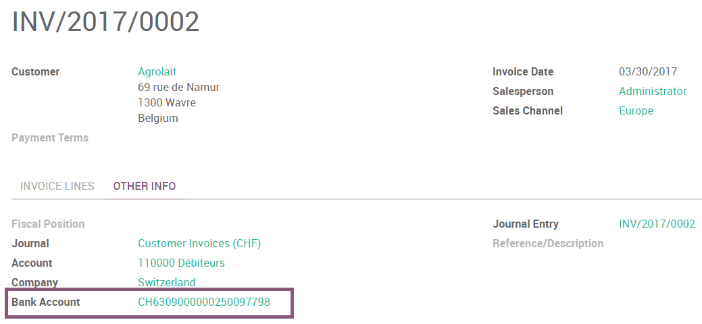
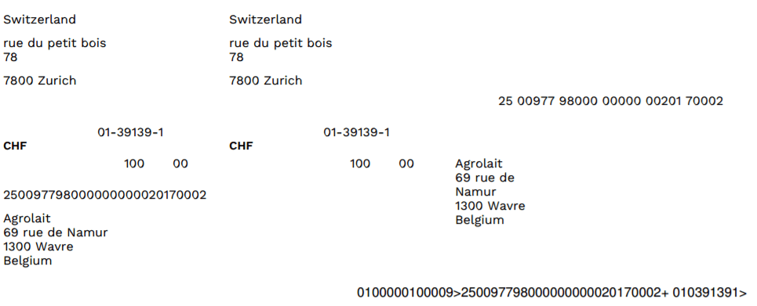
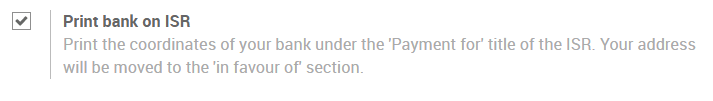
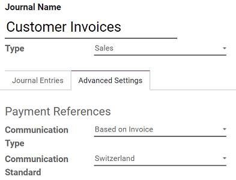
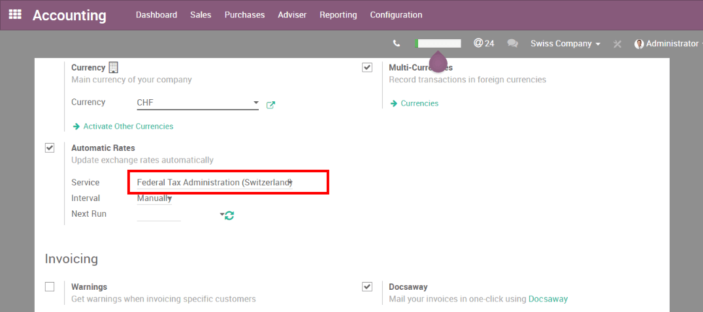

===========
Switzerland
===========

ISR (In-payment Slip with Reference number)
===========================================

The ISRs are payment slips used in Switzerland. You can print them
directly from Odoo. On the customer invoices, there is a new button
called *Print ISR*.

.. tip::
    The button *Print ISR* only appears there is well a bank account
    defined on the invoice. You can use CH6309000000250097798 as bank
    account number and 010391391 as CHF ISR reference.

Then you open a pdf with the ISR.

There exists two layouts for ISR: one with, and one without the bank
coordinates. To choose which one to use, there is an option to print the
bank information on the ISR. To activate it, go in
:menuselection:`Accounting --> Configuration --> Settings --> Customer Invoices`
and enable **Print bank on ISR**:

ISR reference on invoices
-------------------------

To ease the reconciliation process, you can add your ISR reference as **Payment Reference** on your
invoices.

To do so, you need to configure the Journal you usually use to issue invoices. Go to
:menuselection:`Accounting --> Configuration --> Journals`, open the Journal you want to modify (By
default, the Journal is named *Customer Invoices*), click en *Edit*, and open the *Advanced
Settings* tab. In the **Communication Standard** field, select *Switzerland*, and click on *Save*.

Currency Rate Live Update
=========================

You can update automatically your currencies rates based on the Federal
Tax Administration from Switzerland. For this, go in
:menuselection:`Accounting --> Settings`, activate the multi-currencies setting and choose the
service you want.

Updated VAT for January 2025
============================

Starting from the 1st January 2025, new increased VAT rates are applied in Switzerland. The normal
8.0% rate switched to 8.1% and the specific rate for the hotel sector switched to 3.8%. Basic needs
goods have a reduced rate of 2.6% applied.

.. _switzerland/iso20022:

ISO 20022 and SEPA pain versions
================================

Switzerland uses a specific, localized version of the :ref:`ISO 20022
<accounting/sepa_payments/iso20022>` format. To configure the appropriate Swiss format, open the
**Accounting** app, go to :menuselection:`Configuration --> Journals`, and open your **bank**
journal. Click the :guilabel:`Outgoing Payments` tab, then click :guilabel:`Add a line`, and select
:guilabel:`Swiss ISO20022`.

If you need to make :doc:`SEPA payments <../accounting/payments/sepa_payments>`, you can configure a
specific PAIN version. Go to :menuselection:`Configuration --> Journals` and open your
:guilabel:`Bank` journal. Depending on your configuration needs:

- Click the :guilabel:`Incoming Payments` tab, click :guilabel:`Add a line`, select a SEPA payment
  method, and choose a version from the :guilabel:`SEPA Pain Version` field.
- Click the :guilabel:`Outgoing Payments` tab, click :guilabel:`Add a line`, select a SEPA payment
  method, and choose a version from the :guilabel:`XML Format` field.

.. _switzerland/export-xml:

Export XML files
================

.. note::
    To set the **PAIN** version used for XML exports, refer to this :ref:`section
    <switzerland/iso20022>`.

To generate the daily XML payment files required by your online banking portal, :ref:`create a batch
payment <accounting/batch/creation>`. Odoo attaches the generated XML file directly to the chatter,
where you can download it for submission to your bank.

On the **batch payment creation** screen, before clicking :guilabel:`Validate`, you can define which
parties will bear the charges through the :guilabel:`Charge Bearer` field.

.. seealso::
   :doc:`../accounting/bank/bank_synchronization`
