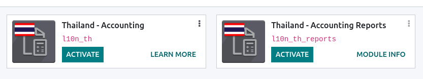
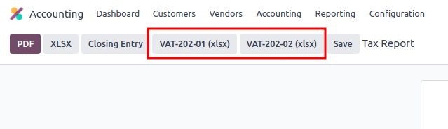
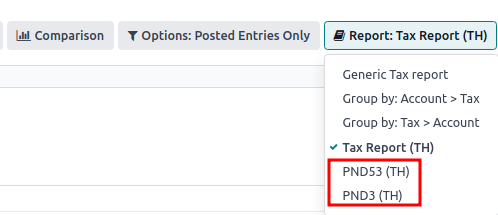
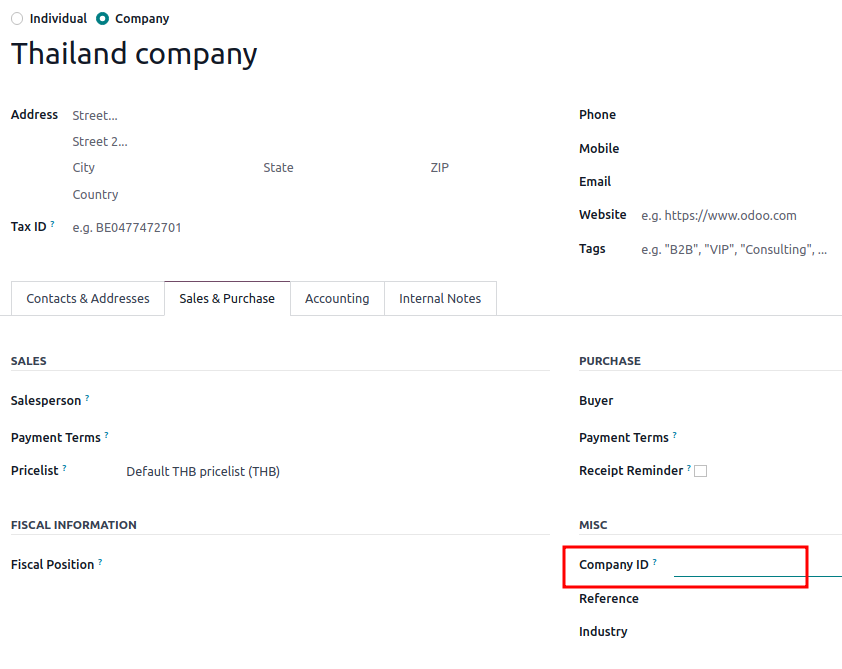

========
Thailand
========

Configuration
=============

:ref:`Install <general/install>` the :guilabel:`🇹🇭 Thailand` localization package to get all the
features of the Thai localization:

.. list-table::
   :header-rows: 1

   * - Name
     - Technical name
     - Description
   * - :guilabel:`Thailand - Accounting`
     - `l10n_th`
     - Default :ref:`fiscal localization package <fiscal_localizations/packages>`
   * - :guilabel:`Thailand - Accounting Reports`
     - `l10n_th_reports`
     - Country-specific accounting reports

Chart of accounts and taxes
===========================

Odoo's fiscal localization package for Thailand includes the following taxes:

- VAT 7%
- VAT-exempted
- Withholding tax
- Withholding income tax

Tax report
==========

Odoo allows users to generate Excel files to submit their VAT to the **Revenue Department** of
Thailand.

Sales and purchase tax report
-----------------------------

To generate a sales and purchase tax report, go to :menuselection:`Accounting --> Reporting --> Tax
Report`. Select a specific time or time range on the tax report, and click
:guilabel:`VAT-202-01 (xlsx)` for purchase tax and :guilabel:`VAT-202-02 (xlsx)` for sales tax.

Withholding PND tax report
--------------------------

PND report data displays the summarized amounts of the applicable **withholding corporate income
tax returns (domestic)** from vendor bills under the :guilabel:`PND53 (TH)` and
:guilabel:`PND3 (TH)` tax reports. It is installed by default with the Thai localization.

.. note::
   Withholding corporate income tax returns (domestic) is the tax used in case the company has
   withheld the tax from “**Personal (PND3)**” or “**Corporate (PND53)**” services provided such as
   rental, hiring, transportation, insurance, management fee, consulting, etc.

The PND tax report allows users to generate a CSV file for bills to upload on the
`RDprep for Thailand e-Filling application <https://efiling.rd.go.th/rd-cms/>`_.

To generate a PND CSV file, go to :menuselection:`Accounting --> Reporting --> Tax Report`, select a
specific time or time range on the tax report, and click :guilabel:`PND3` or :guilabel:`PND53`.

This generates the :file:`Tax Report PND3.csv` and :file:`Tax Report PND53.csv` files that lists all
the vendor bill lines with the applicable withholding tax.

.. image:: thailand/pnd3-pnd53.png
   :alt: PND3 and PND53 CSV files

.. warning::
   Odoo cannot generate the PND or PDF report or **withholding tax certificate** directly. The
   generated :file:`Tax Report PND3.csv` and :file:`Tax Report PND53.csv` files must be exported
   to an external tool to convert them into a **withholding PND** report or a **PDF** file.

Tax invoice
===========

The **tax invoice PDF** report can be generated from Odoo through the **Invoicing** module. Users
have the  option to print PDF reports for normal invoices and tax invoices. To print out
**tax invoices**, users can click on :guilabel:`Print Invoices` in Odoo. Regular invoices can be
printed as **commercial invoices** by clicking on :menuselection:`Cog button (⚙️) --> Print -->
Commercial Invoice`.

.. image:: thailand/tax-invoice.png
   :alt: Commercial invoice printing

Headquarter/Branch number settings
----------------------------------

You can inform a company's **Headquarters** and **Branch number** in the **Contacts** app. Once
in the app, open the **contact form** of the company and under the :guilabel:`Sales & Purchase` tab:

- If the contact is identified as a branch, input the **Branch number** in the
  :guilabel:`Company ID` field.
- If the contact is a **Headquarters**, leave the :guilabel:`Company ID` field **blank**.

.. tip::
   This information is used in the **tax invoice** PDF report and PND **tax report** export.
