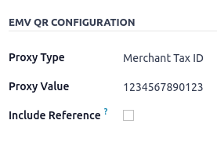

========
Thailand
========

.. _localizations/thailand/modules:

Modules
=======

:ref:`Install <general/install>` the following modules to get all the features of the Thai
localization:

.. list-table::
   :header-rows: 1

   * - Name
     - Technical name
     - Description
   * - :guilabel:`Thailand - Accounting`
     - `l10n_th`
     - This module includes the default
       :ref:`fiscal localization package <fiscal_localizations/packages>`.
   * - :guilabel:`Thailand - Accounting Reports`
     - `l10n_th_reports`
     - This module includes the accounting reports for Thailand.

.. _localizations/thailand/specifics:

Localization overview
=====================

The Thai localization package ensures compliance with Thailand's fiscal and accounting regulations.
It includes tools for managing taxes, withholding taxes, reporting, and a predefined chart of
accounts tailored to Thai standards.

.. _localizations/thailand/taxes:

Taxes
-----

Installing the :guilabel:`Thailand - Accounting` (`l10n_th`) and :guilabel:`Thailand - Accounting
Reports` (`l10n_th_reports`) modules automatically creates default :doc:`taxes
<../accounting/taxes>` for :ref:`tax reports <localizations/thailand/tax_reports>` generation.
The package includes the following taxes:

- **VAT 7%**: For goods where VAT is recognized upon invoicing.
- **VAT 7% S**: For services where VAT is recognized upon payment.
- **VAT 0%**: For taxable goods or services charged at a zero rate, usually exports.
- **VAT-exempted**: For specific goods or services completely exempted from collection or payment
  of VAT.
- :doc:`../../finance/accounting/taxes/retention`: For payments where tax must be deducted at the source by the payer.

.. _localizations/thailand/income_tax_type:

Income tax type (Under section 40)
~~~~~~~~~~~~~~~~~~~~~~~~~~~~~~~~~~

Income tax types are essential for generating **Withholding tax certificates (50 Tawi)** and
**P.N.D. 3 & 53** reports and ensuring compliance with regulatory requirements.

To configure income tax types, go to :menuselection:`Accounting --> Configuration --> Taxes`. For
taxes with the :guilabel:`Purchase` tax type and :guilabel:`Withhold On Payment` enabled, select
the appropriate :guilabel:`Income Tax Type`.

.. _localizations/thailand/tax_reports:

Tax reports
-----------

The relevant VAT and WHT reports can be generated and exported as `CSV` files compatible with RD
Prep(:dfn:`Thai Revenue Department's official software used to format tax data for e-Filing.`).

.. _localizations/thailand/reports/pp30:

P.P. 30 - VAT report
~~~~~~~~~~~~~~~~~~~~

The **P.P. 30** is a monthly value-added tax (VAT) return report required by the Revenue
Department of Thailand. It summarizes the output and input VAT for the period.

The P.P. 30 report can be exported in `CSV` format, compatible with the **RD Prep**. To do so,
follow these steps:

#. Navigate to :menuselection:`Accounting --> Reporting --> Tax Report`, click :icon:`fa-book`
   :guilabel:`Report`, and select :guilabel:`P.P.30 - VAT Report`.
#. Make sure to filter by the appropriate date or date range.
#. On the report page, click the :icon:`fa-cog` :guilabel:`(gear)` icon and select
   :guilabel:`Export for RD Prep (CSV)`.

.. _localizations/thailand/reports/sales_purchase:

Sales and purchase tax reports
******************************

The sales and purchase tax reports detail all input and output VAT transactions for a specific
period, serving as mandatory compliance document that VAT-registered businesses must maintain for
record-keeping and present to the Revenue Department during tax audits.

The sales and purchase tax reports can be exported as `XLSX` files. To do so, follow these steps:

#. Make sure to filter by the appropriate month.
#. Click the :icon:`fa-cog` :guilabel:`(gear)` icon and select :guilabel:`Sales Tax Report (xlsx)`
   or :guilabel:`Purchase Tax Report (xlsx)`.

.. _localizations/thailand/reports/pnd:

P.N.D. 3 & 53 - WHT report
~~~~~~~~~~~~~~~~~~~~~~~~~~

The **P.N.D. 3** and **P.N.D. 53** reports list all the transactions within the period subject to
the withholding of income tax from vendor bills. This applies when a company makes payments for
services received (such as rental, hiring, transportation, insurance, management fees, or
consulting) and is required to withhold "Personal (PND3)" or "Corporate (PND53)" income tax.

To access them, navigate to :menuselection:`Accounting --> Reporting --> Tax Report`, click
:icon:`fa-book` :guilabel:`Report`, and select :guilabel:`P.N.D. 3 & 53 - WHT Report (TH)`.

Both P.N.D. 3 and P.N.D. 53 reports can be exported in `CSV` format, which is compatible with
the **RD Prep** application. To do so, follow these steps:

#. Make sure to filter by the appropriate month.
#. On the report page, click the :icon:`fa-cog` :guilabel:`(gear)` icon and select :guilabel:`PND3
   - Export for RD Prep (CSV)` or :guilabel:`PND 53 - Export for RD Prep (CSV)`.

This generates the :file:`Tax Report PND 3.csv` and :file:`Tax Report PND 53.csv` files that list
all the vendor bill lines with the applicable withholding tax.

.. _localizations/thailand/reports/50tawi:

Withholding tax certificate (50 Tawi)
-------------------------------------

The **50 Tawi**, or *Withholding Tax Certificate*, is a certificate issued by a payer to a payee
as official proof that tax has been withheld from a payment for remittance to the Revenue
Department.

To generate a `PDF` file of a withholding tax certificate:

#. Go to :menuselection:`Accounting --> Vendors --> Payments` and select the payment subject to
   withholding tax.
#. Click the :guilabel:`Print 50 Tawi` button.

.. _localizations/thailand/contacts:

Contacts
========

The Thai localization utilizes specific fields on
:doc:`../../../applications/essentials/contacts` to generate Revenue Department reports and
files used for submission.

.. _localizations/thailand/company:

Branch number
-------------

You can specify a company's branch number directly in the **Contacts** app. Open the company's
contact form, and click the :icon:`fa-plus` :guilabel:`(plus)` icon next to the :guilabel:`Tax ID`
field to add the :guilabel:`Branch Code`:

- If the contact is identified as a branch, input the Branch number in the :guilabel:`Branch Code`
  field.
- If the contact is a Headquarters, leave the :guilabel:`Branch Code` field blank.

.. note::
   Only companies set in :guilabel:`Thailand` feature the :guilabel:`Branch Code` field.

.. _localizations/thailand/accounting:

Accounting
==========

.. _localizations/thailand/tax_invoice:

Tax invoice
-----------

To print a tax invoice, follow the steps to :ref:`create an invoice
<accounting/invoice/creation>` and click :guilabel:`Print` to download the PDF tax invoice.

To print commercial invoices, click the :icon:`fa-cog` :guilabel:`(gear)` icon, click
:guilabel:`Print`, and then select :guilabel:`Commercial Invoice`.

.. _localizations/thailand/promptpay:

PromptPay QR code on invoices
-----------------------------

The PromptPay QR code can be added to invoices to allow customers to pay their bills using the
PromptPay-supported bank mobile application. The QR code is generated based on the invoice amount
and one of the following merchant information:

- Ewallet ID
- Merchant Tax ID
- Mobile Number

To activate PromptPay QR codes on invoices, go to :menuselection:`Accounting --> Configuration -->
Settings` and enable the :guilabel:`Add QR-code Link on PDF` feature under the :guilabel:`Invoice
Online Payment` option.

.. _localizations/thailand/configureqr:

Bank account configuration
~~~~~~~~~~~~~~~~~~~~~~~~~~

To configure the bank account for PromptPay QR codes, go to :menuselection:`Accounting -->
Configuration --> Journals`, and open the journal linked to the relevant bank account.

Under :guilabel:`Journal Entries` tab, fill in the bank account number:

- For an existing account: Hover over the account number and click the :icon:`oi-arrow-right` icon.
- For a new account: Type the account number and click :guilabel:`Create`.

In the bank account form view, go to the :guilabel:`EMV QR Settings` tab. Select the relevant
:guilabel:`Proxy Type` and enter the corresponding :guilabel:`Proxy Value`.

.. seealso::
   :doc:`../../finance/accounting/bank`

.. _localizations/thailand/issueqrinvoice:

Issue invoices with PromptPay QR code
~~~~~~~~~~~~~~~~~~~~~~~~~~~~~~~~~~~~~

When creating a new invoice, open the :guilabel:`Other Info` tab and select :guilabel:`Recipient
Bank` with the account that has :ref:`PromptPay QR configured <localizations/thailand/configureqr>`.

