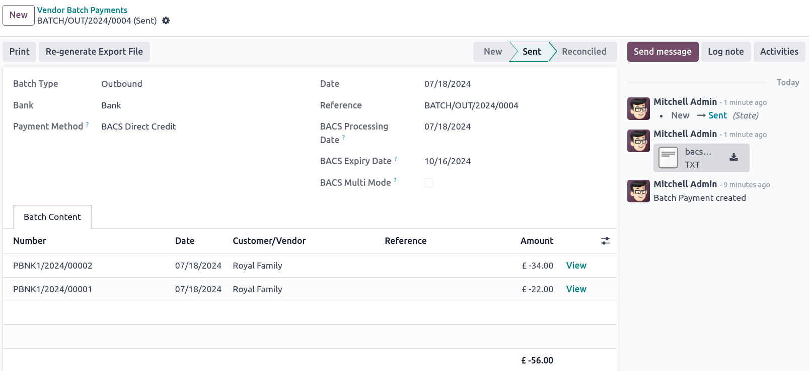

==============
United Kingdom
==============

.. _united-kingdom/modules:

Configuration
=============

:ref:`Install <general/install>` the :guilabel:`UK - Accounting` and the :guilabel:`UK - Accounting
Reports` modules to get all the features of the UK localization.

.. list-table::
   :header-rows: 1

   * - Name
     - Technical name
     - Description
   * - :guilabel:`UK - Accounting`
     - `l10n_uk`
     -  - CT600-ready chart of accounts
        - VAT100-ready tax structure
        - Infologic UK counties listing
   * - :guilabel:`UK - Accounting Reports`
     - `l10n_uk_reports`
     -  - Accounting reports for the UK
        - Allows sending the tax report via the MTD-VAT API to HMRC.
   * - :guilabel:`UK BACS Payment Files`
     - `account_bacs`
     - Allows generating :ref:`united-kingdom/BACS-files` for bill and invoice payments

.. note::
   - Only UK-based companies can submit reports to HMRC.
   - Installing the module :guilabel:`UK - Accounting Reports` installs all two modules at once.

.. seealso::
   - `HM Revenue & Customs <https://www.gov.uk/government/organisations/hm-revenue-customs/>`_
   - `Overview of Making Tax Digital
     <https://www.gov.uk/government/publications/making-tax-digital/overview-of-making-tax-digital/>`_

Chart of accounts
=================

The UK chart of accounts is included in the :guilabel:`UK - Accounting` module. Go to
:menuselection:`Accounting --> Configuration --> Accounting: Chart of Accounts` to access it.

Setup your :abbr:`CoA (chart of accounts)` by going to :menuselection:`Accounting --> Configuration
--> Settings --> Accounting Import section` and choose to :guilabel:`Review Manually` or
:guilabel:`Import (recommended)` your initial balances.

Taxes
=====

As part of the localization module, UK taxes are created automatically with their related financial
accounts and configuration.

Go to :menuselection:`Accounting --> Configuration --> Settings --> Taxes` to update the
:guilabel:`Default Taxes`, the :guilabel:`Tax Return Periodicity` or to :guilabel:`Configure your
tax accounts`.

To edit existing taxes or to :guilabel:`Create` a new tax, go to :menuselection:`Accounting -->
Configuration --> Accounting: Taxes`.

.. seealso::
   - :doc:`taxes <../accounting/taxes>`
   - Tutorial: `Tax report and return
     <https://www.odoo.com/slides/slide/tax-report-and-return-1719?fullscreen=1>`_.

Making Tax Digital (MTD)
------------------------

In the UK, all VAT-registered businesses have to follow the MTD rules by using software to submit
their VAT returns.

The **UK - Accounting Reports** module enables you to comply with the `HM Revenue & Customs
<https://www.gov.uk/government/organisations/hm-revenue-customs/>`_ requirements regarding
`Making Tax Digital
<https://www.gov.uk/government/publications/making-tax-digital/overview-of-making-tax-digital/>`_.

.. important::
   If your periodic submission is more than three months late, it is no longer possible to submit
   it through Odoo, as Odoo only retrieves open bonds from the last three months. Your submission
   has to be done manually by contacting HMRC.

.. _uk_localization/hmrc-registration:

Register your company to HMRC before the first submission
~~~~~~~~~~~~~~~~~~~~~~~~~~~~~~~~~~~~~~~~~~~~~~~~~~~~~~~~~

Go to :menuselection:`Accounting --> Reporting --> Tax report` and click on
:guilabel:`Connect to HMRC`. Enter your company information on the HMRC platform. You only need to
do it once.

Periodic submission to HMRC
~~~~~~~~~~~~~~~~~~~~~~~~~~~

Import your obligations HMRC, filter on the period you want to submit, and send your tax report by
clicking :guilabel:`Send to HMRC`.

.. tip::
   You can use dummy credentials to demo the HMRC flow. To do so, activate the
   :ref:`developer mode <developer-mode>` and go to :menuselection:`General Settings -->
   Technical --> System Parameters`. From here, search for `l10n_uk_reports.hmrc_mode` and change
   the value line to `demo`. You can get such credentials from the `HMRC Developer Hub
   <https://developer.service.hmrc.gov.uk/api-test-user>`_.

Periodic submission to HMRC for multi-company
~~~~~~~~~~~~~~~~~~~~~~~~~~~~~~~~~~~~~~~~~~~~~

Only one company and one user can connect to HMRC simultaneously. If several UK-based companies are
on the same database, the user who submits the HMRC report must follow these instructions before
each submission:

#. Log into the company for which the submission has to be done.
#. Go to :guilabel:`General Settings`, and in the :guilabel:`Users` section, click
   :guilabel:`Manage Users`. Select the user who is connected to HMRC.
#. Go to the :guilabel:`UK HMRC Integration` tab and click :guilabel:`Reset Authentication
   Credentials` or :guilabel:`Remove Authentication Credentials` button.
#. You can now :ref:`register your company to HMRC <uk_localization/hmrc-registration>` and submit
   the tax report for this company.
#. Repeat the steps for other companies' HMRC submissions.

.. note::
   During this process, the :guilabel:`Connect to HMRC` button no longer appears for other UK-based
   companies.

.. _united-kingdom/BACS-files:

Bacs files
==========

:abbr:`Bacs (Bankers' Automated Clearing Services)` files are electronic files used in the UK to
process payments and transfers between bank accounts.

To enable the use of Bacs files, make sure the :ref:`UK BACS Payment Files <united-kingdom/modules>`
module is installed, then:

#. Configure your Bacs Service User Number:

   #. Go to :menuselection:`Accounting --> Configuration --> Settings` and scroll down to the
      :guilabel:`Customer Payments` section.
   #. Enter your :guilabel:`Service User Number` under :guilabel:`BACS` and manually save.

#. Configure your **bank** journal:

   #. Go to :menuselection:`Accounting --> Configuration --> Journals` and select your **bank**
      journal.
   #. In the :guilabel:`Journal Entries` tab, configure the :guilabel:`Account Number` and
      :guilabel:`Bank` fields.
   #. In the :guilabel:`Incoming Payments` and :guilabel:`Outgoing Payments` tabs, make sure the
      :guilabel:`BACS Direct Debit` payment method is enabled.

#. Configure the contacts for whom you wish to use Bacs files: Access the contact form and, in
   the :guilabel:`Accounting` tab, click :guilabel:`Add a line` and fill in the
   :guilabel:`Account Number` and :guilabel:`Bank` fields.

Bill payments
-------------

To generate Bacs files for bill payments, set the :guilabel:`Payment Method` to
:guilabel:`BACS Direct Debit` when :ref:`registering vendor payments <batch-payments/register-payments>`.

Then, create a vendor batch payment:

#. Go to :menuselection:`Accounting --> Vendors --> Batch Payments`, and click :guilabel:`New`.
#. Select the bank journal in the :guilabel:`Bank` field, set the :guilabel:`Payment Method` to
   :guilabel:`BACS Direct Credit`, and select a :guilabel:`BACS Processing Date`.
#. Optionally, you can also:

   - select a :guilabel:`BACS Expiry Date`;
   - enable :guilabel:`BACS Multi Mode` to process the payments on their individual date.

#. Click :guilabel:`Add a line`, select the payments you want to include, click :guilabel:`Select`,
   then :guilabel:`Validate`.

Once validated, the Bacs file is available in the chatter. You can also :guilabel:`Re-generate
Export File` if you need a new Bacs file for that batch payment.

Invoice payments
----------------

Before generating Bacs files for invoice payments, you must first create a **BACS Direct Debit
Instruction**: Go to :menuselection:`Accounting --> Customers --> BACS Direct Debit Instructions`
and click :guilabel:`New`. Select a :guilabel:`Customer`, their :guilabel:`IBAN`, and the
:guilabel:`Journal` you wish to use.

To generate Bacs files for invoice payments, set the :guilabel:`Payment Method` to
:guilabel:`BACS Direct Debit` when :ref:`registering invoice payments <batch-payments/register-payments>`.

.. tip::
   If you register the payment for an invoice linked to a subscription or via
   :menuselection:`Accounting --> Customers --> Payments`, you can select the :guilabel:`BACS
   Payment Type`:

   - :guilabel:`Direct debit-first collection of a series`;
   - :guilabel:`Direct debit single collection`;
   - :guilabel:`Direct debit repeating collection in a series`;
   - :guilabel:`Direct debit-final collection of a series`.

Then, create a customer batch payment:

#. Go to :menuselection:`Accounting --> Customers --> Batch Payments`, and click :guilabel:`New`.
#. Select the bank journal in the :guilabel:`Bank` field, set the :guilabel:`Payment Method` to
   :guilabel:`BACS Direct Credit`, and select a :guilabel:`BACS Processing Date`.
#. Optionally, you can also:

   - select a :guilabel:`BACS Expiry Date`;
   - enable :guilabel:`BACS Multi Mode` to process the payments on their individual date.

#. Click :guilabel:`Add a line`, select the payments you want to include, click :guilabel:`Select`,
   then :guilabel:`Validate`.

Once validated, the Bacs file is available in the chatter. You can also :guilabel:`Re-generate
Export File` if you need a new Bacs file for that batch payment.
