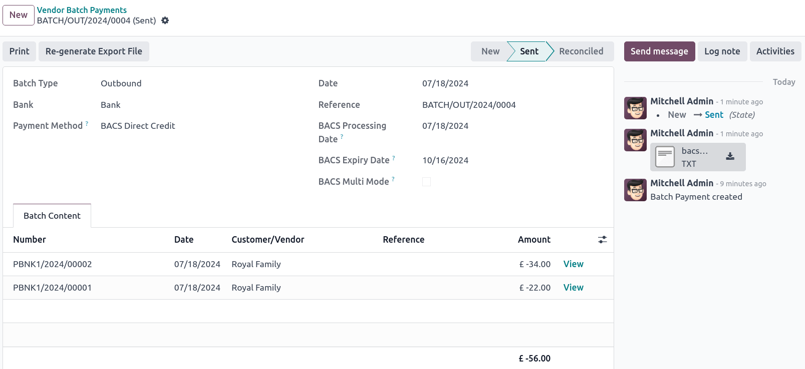

==============
United Kingdom
==============

.. _localization/united-kingdom/modules:

Modules
=======

The following modules are installed automatically with the localization package for the United
Kingdom:

.. list-table::
   :header-rows: 1
   :widths: 25 25 50

   * - Name
     - Technical name
     - Description
   * - :guilabel:`United Kingdom - Accounting`
     - `l10n_uk`
     -  - CT600-ready chart of accounts
        - VAT100-ready tax structure
        - Infologic UK counties listing
   * - :guilabel:`UK - Accounting Reports`
     - `l10n_uk_reports`
     -  - Accounting reports for the UK
        - Allows sending the tax report via the MTD-VAT API to HMRC.
   * - :guilabel:`UK BACS Payment Files`
     - `l10n_uk_bacs`
     - Allows generating :ref:`localization/united-kingdom/BACS-files` for bill and invoice payments

Additionally, the following modules can be manually :ref:`installed <general/install>` in order to
complete the various workflows that they relate to:

.. list-table::
   :header-rows: 1
   :widths: 25 25 50

   * - Name
     - Technical name
     - Description
   * - :guilabel:`UK - Construction Industry Scheme`
     - `l10n_uk_reports_cis`
     -  - Allows sending the monthly return to |HMRC|
        - CIS Deduction (GB) report for UK construction industry
   * - :guilabel:`UK - HMRC API`
     - `l10n_uk_hmrc`
     - Includes the |HMRC| basics.
   * - :guilabel:`British Intrastat Declaration`
     - `l10n_uk_intrastat`
     - **[insert description]**

.. note::
   - Only UK-based companies can submit reports to HMRC.
   - Installing the module :guilabel:`UK - Accounting Reports` automatically includes the
     :guilabel:`United Kingdom - Accounting` module during installation.
   - The :guilabel:`UK - Construction Industry Scheme` module automatically includes the
     :guilabel:`UK - HMRC API` module during installation.

.. seealso::
   - `HM Revenue & Customs <https://www.gov.uk/government/organisations/hm-revenue-customs/>`_
   - `Overview of Making Tax Digital
     <https://www.gov.uk/government/publications/making-tax-digital/overview-of-making-tax-digital/>`_

Localization overview
=====================

The localization package for the United Kingdom provides the following key features to ensure
compliance with local fiscal and accounting regulations:

- :ref:`localization/united-kingdom/chart-of-account`: a predefined structure tailored to the UK's
  accounting standards
- :ref:`localization/united-kingdom/taxes`: pre-configured tax rates, including standard VAT, zero-rated,
  and exempt options
- :ref:`localization/united-kingdom/digital-tax`: integration with HMRC via an :abbr:`API
  (application programming interface)` connection for eased tax submission

.. _localization/united-kingdom/chart-of-account:

Chart of accounts
=================

The UK chart of accounts is included in the :guilabel:`UK - Accounting` module. Go to
:menuselection:`Accounting --> Configuration --> Accounting: Chart of Accounts` to access it.

Set up your :abbr:`CoA (chart of accounts)` by going to :menuselection:`Accounting --> Configuration
--> Settings`, scroll to the `Accounting Import` section and choose to :guilabel:`Review Manually`
or :guilabel:`Import (recommended)` your initial balances.

These accounts can be edited and additional accounts can be :ref:`created <chart-of-account/create>`
if needed.

.. _localization/united-kingdom/taxes:

Taxes
=====

As part of the localization module, UK taxes are created automatically with their related financial
accounts and configuration.

Go to :menuselection:`Accounting --> Configuration --> Settings --> Taxes` to update the
:guilabel:`Default Taxes`, the :guilabel:`Tax Return Periodicity` or to :guilabel:`Configure your
tax accounts`.

To edit existing taxes or to :guilabel:`Create` a new tax, go to :menuselection:`Accounting -->
Configuration --> Accounting: Taxes`.

.. seealso::
   - :doc:`../accounting/taxes`
   - `Tutorial: Tax report and return
     <https://www.odoo.com/slides/slide/tax-report-and-return-1719?fullscreen=1>`_.

.. _localization/united-kingdom/digital-tax:

Making Tax Digital (MTD)
========================

In the UK, all VAT-registered businesses have to follow the MTD rules by using software to submit
their VAT returns. Additionally, some self-employment businesses including sole traders, UK
landlords, and foreign landlords (meaning landlords of foreign properties) have :ref:`additional
requirements <localization/united-kingdom/self-employed>` regarding the information they must submit
to HMRC.

The **UK - Accounting Reports** module enables you to comply with the `HM Revenue & Customs
<https://www.gov.uk/government/organisations/hm-revenue-customs/>`_ requirements regarding
`Making Tax Digital
<https://www.gov.uk/government/publications/making-tax-digital/overview-of-making-tax-digital/>`_.

.. important::
   If your periodic submission is more than three months late, it is no longer possible to submit
   it through Odoo, as Odoo only retrieves open bonds from the last three months. Your submission
   has to be done manually by contacting HMRC.

.. _localization/united-kingdom/self-employed:

MTD for sole traders and landlords
----------------------------------

Individuals who are classified as sole traders or landlords (both UK landlords and foreign
landlords) with a gross income of over £50,000 have to submit their income and expenses to HMRC on a
quarterly basis via a dedicated :abbr:`API application programming interface)`. To use Odoo to
submit these records, first :ref:`configure <localization/united-kingdom/self-config>` the
business's information to connect with the HMRC, then :ref:`submit
<localization/united-kingdom/self-submit>` the following reports:

- :ref:`Cumulative quarterly reports <localization/united-kingdom/cumulative>`
- :ref:`Annual reports <localization/united-kingdom/annual>`
- :ref:`BSAS reports <localization/united-kingdom/bsas>`
- :ref:`Final declarations <localization/united-kingdom/final>`
- :ref:`Final declarations <localization/united-kingdom/amendment>` (optional)

.. _localization/united-kingdom/self-config:

MTD configuration for sole traders and landlords
~~~~~~~~~~~~~~~~~~~~~~~~~~~~~~~~~~~~~~~~~~~~~~~~

Configure Odoo to send your income and expenses to HMRC on a quarterly basis:

#. Go to :menuselection:`Accounting --> Configuration --> Settings`.
#. Scroll down to the :guilabel:`United Kingdom` section and :guilabel:`Enable MTD Income Tax Self
   Assessment`.
#. :guilabel:`Save` the settings and return to the :guilabel:`United Kingdom` section.
#. Enter the :guilabel:`Business ID`.
#. Select the :guilabel:`Business Type`: :guilabel:`Sole Trader`, :guilabel:`UK Landlord` (landlords
   of properties within the UK), or :guilabel:`Foreign Landlord` (landlords of properties outside of
   the UK).

.. note::
   To submit income and expenses to HMRC for multiple entities, create a branch for each individual
   entity. The :guilabel:`National Insurance Number` (NINO) must be set on the parent company, but
   the :guilabel:`Business ID` and :guilabel:`Business Type` are set on the individual branch for
   each entity.

#. Enter the :guilabel:`National Insurance Number` (NINO).
#. Click :icon:`oi-arrow-right` :guilabel:`Connect to HMRC` to open the UK tax service portal.
#. On the UK tax service portal, click :guilabel:`Continue` to give Odoo the permissions necessary
   to submit your income and expenses to HMRC.
#. Click :guilabel:`Sign in to the HMRC online service`.
#. Enter the :guilabel:`User ID` and :guilabel:`Password`, and click :guilabel:`Sign in`.
#. Click :guilabel:`Give permission` to confirm giving permissions to Odoo and return to the Odoo
   :guilabel:`Accounting Settings`.

   If the credentials were valid, three new links appear in the :guilabel:`United Kingdom` section
   of the :guilabel:`Accounting Settings`:

   - :icon:`oi-arrow-right` :guilabel:`Refresh connection` **changed in latest update**
   - :icon:`oi-arrow-right` :guilabel:`Disconnect`
   - :icon:`oi-arrow-right` :guilabel:`Configure your accounting periods`

   .. note::
      As noted in the settings, it is required to click :guilabel:`Refresh Connection` to update the
      information with HMRC if any of these fields are edited.

#. Click :icon:`oi-arrow-right` :guilabel:`Configure your accounting periods`. In the popup window,
   enter the :guilabel:`Tax Year` and select the :guilabel:`Quarterly Period Type`:

   - :guilabel:`Standard` uses 6 April - 5 April.
   - :guilabel:`Calendar` allows you to specify your accounting periods.

   Alternatively, click :guilabel:`Retrieve from HMRC` to retrieve the dates that were used when
   information was previously submitted to HMRC.

   .. note::
      The :guilabel:`Tax Year` should use the `YYYY-YY` format.

#. Click :guilabel:`Submit changes`.

.. _localization/united-kingdom/self-submit:

Submit to HMRC for sole traders and landlords
~~~~~~~~~~~~~~~~~~~~~~~~~~~~~~~~~~~~~~~~~~~~~

For both sole traders and landlords, the process of compiling and submitting tax reports (**tax reports vs income/expenses??**)
is similar, though the actual substance of the reports themselves differ.

To prepare to submit tax reports to HMRC, first navigate to :menuselection:`Accounting -->
Accounting --> Tax Return` and confirm the preconfigured :guilabel:`Accounting Periods`.

To complete and submit the necessary reports, select the appropriate tab below and follow the
instructions for each report.

.. _localization/united-kingdom/cumulative:

Cumulative reports
******************

Cumulative reports should be submitted to HMRC quarterly. Each quarter, complete the period report
with the values that belong to that specific quarter. Then, the values of each quarter's cumulative
report is automatically calculated by summing the values of the current quarter's period report with
any earlier period reports from the same fiscal year.

The :guilabel:`Dates` of every cumulative report should start from the beginning of the fiscal year
(i.e., April 6 for :guilabel:`Standard` :guilabel:`Quarterly Period Type`), even for the cumulative
reports of the second, third, and fourth quarters.

To generate and submit a cumulative report, follow these steps:

#. Navigate to :menuselection:`Accounting --> Accounting --> Tax Returns` and click
   :guilabel:`New`.

    .. note::
       If the active company or branch has not had its accounting periods configured, an
       :guilabel:`Accounting Periods` popup will appear. Enter the :guilabel:`Opening Date`,
       :guilabel:`Fiscal Year End`, and :guilabel:`VAT Periodicity`, and click :guilabel:`Apply`.

#. In the :guilabel:`Generate Return` popup window, select the appropriate cumulative report based
   on your business type, enter the start and end dates of the period in the :guilabel:`Dates`
   field, and click :guilabel:`Generate Return`.

.. tabs::

   .. group-tab:: Sole traders

      3. Click the :guilabel:`Period Report` button to open the period report.
      #. In the :guilabel:`Business Income` section, click the :icon:`fa-pencil`
         (:guilabel:`pencil`) icon on each line, enter the appropriate value, and click
         :guilabel:`Post`.
      #. In the :guilabel:`Business Expenses` section, click the :icon:`fa-pencil`
         (:guilabel:`pencil`) icon on :guilabel:`Consolidated expenses request` line, and select
         either :guilabel:`Yes` to submit consolidated expenses or :guilabel:`No` to submit
         non-consolidated expenses. Click :guilabel:`Post` to confirm.

         - For consolidated expenses, click the :icon:`fa-pencil` (:guilabel:`pencil`) icon on the
           :guilabel:`Consolidated expenses` line, enter the appropriate value, and click
           :guilabel:`Post`.
         - For non-consolidated expenses, click :icon:`fa-caret-right` :guilabel:`Non-consolidated
           request` to expand the line. On each sub-line, click the :icon:`fa-pencil`
           (:guilabel:`pencil`) icon, enter the appropriate value, and click :guilabel:`Post`.

      #. Click :guilabel:`Tax Return` in the breadcrumbs to return to the cumulative report's
         overview.
      #. Click the :guilabel:`Validate` button to ensure there are no errors with the format of the
         report and to generate a PDF of the report in the chatter.

         .. note::
            When using the :guilabel:`Period Report`, it is important to only enter the income and
            expense values for the period of the report. These values are then aggregated with the
            values of the other periods in the cumulative report. To review the values of the
            cumulative report, navigate to the cumulative report's overview and click the
            :guilabel:`Cumulative Report` button to open the cumulative report itself.

      #. Click the :guilabel:`Submit` button to submit the cumulative report to HMRC.

   .. group-tab:: UK landlords

      3. Click the :guilabel:`Period Report` button to open the period report.
      #. In the :guilabel:`Income` section, click the :icon:`fa-pencil` (:guilabel:`pencil`) icon on
         each line, enter the appropriate value, and click :guilabel:`Post`.
      #. In the :guilabel:`Expenses` section, click the :icon:`fa-pencil` (:guilabel:`pencil`) icon
         on :guilabel:`Consolidated expenses request` line, and select either :guilabel:`Yes` to
         submit consolidated expenses or :guilabel:`No` to submit non-consolidated expenses. Click
         :guilabel:`Post` to confirm.

         - For consolidated expenses, click the :icon:`fa-pencil` (:guilabel:`pencil`) icon on the
           :guilabel:`Consolidated expenses` line, enter the appropriate value, and click
           :guilabel:`Post`.
         - For non-consolidated expenses, click :icon:`fa-caret-right` :guilabel:`Non-consolidated
           request` to expand the line. On each sub-line, click the :icon:`fa-pencil`
           (:guilabel:`pencil`) icon, enter the appropriate value, and click :guilabel:`Post`.

      #. Click :guilabel:`Tax Return` in the breadcrumbs to return to the cumulative report's
         overview.
      #. Click the :guilabel:`Validate` button to ensure there are no errors with the format of the
         report and to generate a PDF of the report in the chatter.

         .. note::
            When using the :guilabel:`Period Report`, it is important to only enter the income and
            expense values for the period of the report. These values are then aggregated with the
            values of the other periods in the cumulative report. To review the values of the
            cumulative report, navigate to the cumulative report's overview and click the
            :guilabel:`Cumulative Report` button to open the cumulative report itself.

      #. Click the :guilabel:`Submit` button to submit the cumulative report to HMRC.

   .. group-tab:: Foreign landlords

      #.

.. _localization/united-kingdom/annual:

Annual reports
**************

Annual reports should be submitted to HMRC at the end of each fiscal year. The :guilabel:`Dates` of
the annual report should encompass the entire year (i.e., April 6 to April 5 of the following year
for :guilabel:`Standard` :guilabel:`Quarterly Period Type`).

To generate and submit an annual report, follow these steps:

#. Navigate to :menuselection:`Accounting --> Accounting --> Tax Returns` and click
   :guilabel:`New`.
#. In the :guilabel:`Generate Return` popup window, select the appropriate annual report based on
   your business type, enter the start and end dates of the period in the :guilabel:`Dates` field,
   and click :guilabel:`Generate Return`.

.. tabs::

   .. group-tab:: Sole traders

      3. Click the :guilabel:`Annual Report` button to open the annual report itself.
      #. In the :guilabel:`Adjustments` section, click the :icon:`fa-pencil` (:guilabel:`pencil`)
         icon, add the appropriate value for any line that needs an adjustment value, and click
         :guilabel:`Post`.
      #. In the :guilabel:`Allowances` section, click the :icon:`fa-pencil` (:guilabel:`pencil`)
         icon on :guilabel:`Trading allowance has been requested` line, and select either
         :guilabel:`Yes` to submit allowances with a trading allowance request or :guilabel:`No` to
         submit allowances without a trading allowance request. Click :guilabel:`Post` to confirm.

         - For submitting allowances with a trading allowance request, click the :icon:`fa-pencil`
           icon on the :guilabel:`Trading income allowance` line, enter the appropriate value, and
           click :guilabel:`Post`.
         - For submitting allowances without a trading allowance request, click the
           :icon:`fa-pencil` (:guilabel:`pencil`) icon on each sub-line under the
           :guilabel:`Allowances (without trading allowance request)` line, enter the appropriate
           value, and click :guilabel:`Post`.

           Submitting allowances without a trading allowance request includes the option to submit
           :ref:`Building Allowances <localization/united-kingdom/buildings>` on both the
           :guilabel:`Structures and Building Allowance` line and the :guilabel:`Freeport and
           Investment Zones Structures and Building Allowance` line. Click :guilabel:`Building
           Allowances` on the appropriate line to create new buildings and add existing buildings as
           allowances.

      #. If your business details have recently changed and need to be reported to HMRC, click the
         :icon:`fa-pencil` (:guilabel:`pencil`) icon on the :guilabel:`Business details changed
         recently` in the :guilabel:`Non-Financial Information` section. Select :guilabel:`Yes` and
         click :guilabel:`Post`.
      #. If you have a class 4 NICs exemption reason, click the :icon:`fa-pencil`
         (:guilabel:`pencil`) icon on the :guilabel:`Class 4 NICs exemption reason` line, enter the
         exemption reason, and click :guilabel:`Post`. The exemption reason must perfectly match one
         of the following reasons:

         - non-resident
         - trustee
         - diver
         - ITTOIA-2005
         - over-state-pension-age
         - under-16
      #. Click :guilabel:`Tax Return` in the breadcrumbs to return to the annual report's overview.
      #. Click the :guilabel:`Validate` button to ensure there are no errors with the format of the
         report and to generate a PDF of the report in the chatter.
      #. Click the :guilabel:`Annual Report` button to review the fully prepared report.
      #. Click :guilabel:`Tax Return` in the breadcrumbs to return to the annual report's overview.
      #. Click the :guilabel:`Submit` button to submit the annual report to HMRC.

   .. group-tab:: UK landlords

      3. Click the :guilabel:`Annual Report` button to open the annual report itself.
      #. In the :guilabel:`Adjustments` section, click the :icon:`fa-pencil` (:guilabel:`pencil`)
         icon, add the appropriate value for any line that needs an adjustment value, and click
         :guilabel:`Post`.
      #. Also in the :guilabel:`Adjustments` section are the :guilabel:`Non-resident landlord` and
         the :guilabel:`Jointly let` lines. By default, these lines are set to :guilabel:`No`, but
         change them to :guilabel:`Yes`, click the :icon:`fa-pencil` (:guilabel:`pencil`) icon on
         the relevant line, select :guilabel:`Yes`, and click :guilabel:`Post`.
      #. In the :guilabel:`Allowances` section, if property allowances have been requested, click
         click the :icon:`fa-pencil` (:guilabel:`pencil`) icon on the :guilabel:`Property allowance
         has been requested` line, select :guilabel:`Yes`, and click :guilabel:`Post`. If no
         property allowance has been requested, leave the line set to :guilabel:`. Either way,
         complete the rest of the :guilabel:`Allowances` section:

         - If a property allowance has been requested, click the :icon:`fa-pencil`
           (:guilabel:`pencil`) icon on the :guilabel:`Allowances (Property Allowance Request` line,
           enter the appropriate value, and click :guilabel:`Post`.
         - If no property allowance has been requested, click the :guilabel:`Allowances (All Other
           Allowances Request)` line to expand it. On each sub-line click the :icon:`fa-pencil`
           (:guilabel:`pencil`) icon, enter the appropriate value, and click :guilabel:`Post`.

           Submitting allowances without a trading allowance request includes the option to submit
           :ref:`Building Allowances <localization/united-kingdom/buildings>` on both the
           :guilabel:`Structured building allowance` line and the :guilabel:`Enhanced structured
           building allowance` line. Click :guilabel:`Building Allowances` on the appropriate line
           to create new buildings and add existing buildings as allowances.

   .. group-tab:: Foreign landlords

      #.

.. _localization/united-kingdom/bsas:

BSAS reports
************

The :abbr:`BSAS (business source adjustable summary)` report is pre-filled with data from the
cumulative reports that a business has submitted over the course of a tax year. In the majority of
cases, no modifications are needed and the BSAS can be submitted as-is. Adjustments should only be
made if necessary.

To generate and submit a BSAS report, follow these steps:

#. Navigate to :menuselection:`Accounting --> Accounting --> Tax Returns` and click
   :guilabel:`New`.
#. In the :guilabel:`Generate Return` popup window, select the appropriate BSAS report based on your
   business type, enter the start and end dates of the period in the :guilabel:`Dates` field, and
   click :guilabel:`Generate Return`.

.. tabs::

   .. group-tab:: Sole traders

      3. Click :guilabel:`Validate` to prepare the report to be populated with data from HMRC and to
         generate a PDF of the report in the chatter.
      #. Click :guilabel:`Fetch from HMRC` to populate the report based on the cumulative and annual
         reports that have been submitted previously.
      #. Click the :guilabel:`BSAS Report` button to open the BSAS report itself. If necessary,
         make any of the following edits to the BSAS report:

          #. In the :guilabel:`Business Income` section, click the :icon:`fa-pencil`
             (:guilabel:`pencil`) icon on any line whose value needs to be updated, enter the
             appropriate value, and click :guilabel:`Post`.
          #. In the :guilabel:`Expenses` section, add the expenses to report, whether they are
             consolidated or non-consolidated.

             - For consolidated expenses, click the :icon:`fa-pencil` (:guilabel:`pencil`) icon on
               the :guilabel:`Consolidated Expenses` line, enter the appropriate value, and click
               :guilabel:`Post`.
             - For non-consolidated expenses, click to expand the :guilabel:`Non-Consolidated
               Expenses` and display the sub-lines. Click the :icon:`fa-pencil` (:guilabel:`pencil`)
               icon on any sub-line whose value needs to be updated, enter the appropriate value,
               and click :guilabel:`Post`.
          #. In the :guilabel:`Additions` section, click the :icon:`fa-pencil` (:guilabel:`pencil`)
             icon on any line whose value needs to be updated, enter the appropriate value, and
             click :guilabel:`Post`.
          #. In the :guilabel:`Accounting Adjustments` section, click the :icon:`fa-pencil`
             (:guilabel:`pencil`) icon on any line whose value needs to be updated, and click
             :guilabel:`Post`.
      #. Click :guilabel:`Tax Return` in the breadcrumbs to return to the annual report's overview.
      #. Click the :guilabel:`Submit` button to submit the BSAS report to HMRC.

   .. group-tab:: UK landlords

      #.

   .. group-tab:: Foreign landlords

      #.

.. _localization/united-kingdom/final:

Final Declaration
*****************

After the cumulative, annual, and BSAS reports have all been submitted to HMRC, the final
declaration must be submitted. A final declaration is associated with an individual, not a business
ID, so always complete and submit the final declaration from the parent company (not from a branch
in the case of an individual with multiple branches to submit reports for multiple business types).

To generate and submit a final declaration, follow these steps:

#. Navigate to :menuselection:`Accounting --> Accounting --> Tax Returns` and click
   :guilabel:`New`.
#. In the :guilabel:`Generate Return` popup window, select the :guilabel:`Final Declaration`, enter
   the start and end dates of the period in the :guilabel:`Dates` field, and click
   :guilabel:`Generate Return`.
#. Click :guilabel:`Validate` to prepare the report to be populated with data from HMRC and to
   generate a PDF of the report in the chatter.
#. Click :guilabel:`Fetch from HMRC` to populate the report based on the cumulative, annual, and
   BSAS reports that have been submitted previously.
#. If necessary, click the :guilabel:`Allocate Losses` button to allocate the year's losses:

   #. For each :guilabel:`Business Source`, enter the appropriate values to :guilabel:`Carry Back`,
      :guilabel:`Carry Sideways`, and :guilabel:`Carry Forward`.
   #. For each :guilabel:`Business Source`, select the appropriate :guilabel:`Allocation Mode`:

      - :guilabel:`Normal`
      - :guilabel:`Early Years`
      - :guilabel:`Final Years`
   #. Click :guilabel:`Send`.
#. Click the :guilabel:`Final Declaration` button to review the final declaration itself. If any
   edits are necessary, make them via a :ref:`final declaration amendment
   <localization/united-kingdom/amendment>`.
#. Click :guilabel:`Tax Return` in the breadcrumbs to return to the final declaration's overview.
#. Click the :guilabel:`Submit` button to submit the final declaration to HMRC. In the
   :guilabel:`HMRC Final Declaration Agreement` tick the checkbox to indicate that you have read
   and agree to the terms, then click :guilabel:`Submit`.

.. _localization/united-kingdom/amendment:

Final Declaration - Amendment
*****************************

**should amendment even be documented yet - workflow is unclear even to the devs who wrote it and they say they'll update it**

If a :ref:`final declaration <localization/united-kingdom/final>` needs to be amended, it must be
done through a separate report called a final declaration amendment. Like final declarations, final
declaration amendments are associated with individuals, not specific business IDs, so amendments
must be submitted from the parent company (not from a branch in the case of an individual with
multiple branches to submit reports for multiple business types).

To generate and submit a final declaration amendment, follow these steps:

#. Navigate to :menuselection:`Accounting --> Accounting --> Tax Returns` and click
   :guilabel:`New`.
#. In the :guilabel:`Generate Return` popup window, select the :guilabel:`Final Declaration -
   Amendment`, enter the start and end dates of the period in the :guilabel:`Dates` field, and click
   :guilabel:`Generate Return`.
#. Click :guilabel:`Validate` to prepare the report to be populated with data from HMRC and to
   generate a PDF of the report in the chatter. **why do we generate a PDF report if we don't have the right data in it yet**
#. Click :guilabel:`Fetch from HMRC` to populate the report based on the cumulative, annual, and
   BSAS reports and the final declaration that have been submitted previously.
#. **what next**

.. _localization/united-kingdom/buildings-properties:

Manage buildings and properties
~~~~~~~~~~~~~~~~~~~~~~~~~~~~~~~

To more easily complete the different reports required by sole traders and landlords, Odoo allows
you to store and manage the details of :ref:`buildings <localization/united-kingdom/buildings>` and
:ref:`properties <localization/united-kingdom/properties>`. After being created, buildings and
properties can be added to the appropriate reports and their details are automatically included.

.. _localization/united-kingdom/buildings:

Buildings
*********

**how to actually add buildings to the reports?**

.. _localization/united-kingdom/properties:

Properties
**********

.. _localization/united-kingdom/businesses:

MTD for micro entities to large companies
-----------------------------------------

.. _localization/united-kingdom/hmrc-registration:

Register your company to HMRC before the first submission
~~~~~~~~~~~~~~~~~~~~~~~~~~~~~~~~~~~~~~~~~~~~~~~~~~~~~~~~~

Go to :menuselection:`Accounting --> Reporting --> Tax report` and click on
:guilabel:`Connect to HMRC`. Enter your company information on the HMRC platform. You only need to
do it once.

.. _localization/united-kingdom/periodic-hmrc-submission:

Periodic submission to HMRC
~~~~~~~~~~~~~~~~~~~~~~~~~~~

Import your obligations HMRC, filter on the period you want to submit, and send your tax report by
clicking :guilabel:`Send to HMRC`.

.. tip::
   You can use dummy credentials to demo the HMRC flow. To do so, activate the
   :ref:`developer mode <developer-mode>` and go to :menuselection:`General Settings -->
   Technical --> System Parameters`. From here, search for `l10n_uk_reports.hmrc_mode` and change
   the value line to `demo`. You can get such credentials from the `HMRC Developer Hub
   <https://developer.service.hmrc.gov.uk/api-test-user>`_.

.. _localization/united-kingdom/periodic-hmrc-submission-multi:

Periodic submission to HMRC for multi-company
~~~~~~~~~~~~~~~~~~~~~~~~~~~~~~~~~~~~~~~~~~~~~

Only one company and one user can connect to HMRC simultaneously. If several UK-based companies are
on the same database, the user who submits the HMRC report must follow these instructions before
each submission:

#. Log into the company for which the submission has to be done.
#. Go to :guilabel:`General Settings`, and in the :guilabel:`Users` section, click
   :guilabel:`Manage Users`. Select the user who is connected to HMRC.
#. Go to the :guilabel:`UK HMRC Integration` tab and click :guilabel:`Reset Authentication
   Credentials` or :guilabel:`Remove Authentication Credentials` button.
#. :ref:`Register your company to HMRC <localization/united-kingdom/hmrc-registration>` and submit
   the company's tax report.
#. Repeat the steps for other companies' HMRC submissions.

.. note::
   During this process, the :guilabel:`Connect to HMRC` button no longer appears for other UK-based
   companies.

.. _localization/united-kingdom/BACS-files:

Bacs files
==========

:abbr:`Bacs (Bankers' Automated Clearing Services)` files are electronic files used in the UK to
process payments and transfers between bank accounts.

To enable the use of Bacs files, make sure the
:ref:`UK BACS Payment Files <localization/united-kingdom/modules>` module is installed, then:

#. Configure your Bacs Service User Number:

   #. Go to :menuselection:`Accounting --> Configuration --> Settings` and scroll down to the
      :guilabel:`Customer Payments` section.
   #. Enter your :guilabel:`Service User Number` under :guilabel:`BACS` and manually save.

#. Configure your **bank** journal:

   #. Go to :menuselection:`Accounting --> Configuration --> Journals` and select your **bank**
      journal.
   #. In the :guilabel:`Journal Entries` tab, configure the :guilabel:`Account Number` and
      :guilabel:`Bank` fields.
   #. In the :guilabel:`Incoming Payments` and :guilabel:`Outgoing Payments` tabs, make sure the
      :guilabel:`BACS Direct Debit` payment method is enabled.

#. Configure the contacts for whom you wish to use Bacs files: Access the contact form and, in
   the :guilabel:`Accounting` tab, click :guilabel:`Add a line` and fill in the
   :guilabel:`Account Number` and :guilabel:`Bank` fields.

.. _localization/united-kingdom/bill-payments:

Bill payments
-------------

To generate Bacs files for bill payments, set the :guilabel:`Payment Method` to
:guilabel:`BACS Direct Debit` when :doc:`registering vendor payments <../accounting/payments>`.

Then, create a vendor batch payment:

#. Go to :menuselection:`Accounting --> Vendors --> Batch Payments`, and click :guilabel:`New`.
#. Select the bank journal in the :guilabel:`Bank` field, set the :guilabel:`Payment Method` to
   :guilabel:`BACS Direct Credit`, and select a :guilabel:`BACS Processing Date`.
#. Optionally, you can also:

   - select a :guilabel:`BACS Expiry Date`;
   - enable :guilabel:`BACS Multi Mode` to process the payments on their individual date.

#. Click :guilabel:`Add a line`, select the payments you want to include, click :guilabel:`Select`,
   then :guilabel:`Validate`.

Once validated, the Bacs file is available in the chatter. You can also :guilabel:`Re-generate
Export File` if you need a new Bacs file for that batch payment.

.. seealso::
   :doc:`../accounting/payments/batch`

.. _localization/united-kingdom/invoice-payments:

Invoice payments
----------------

Before generating Bacs files for invoice payments, you must first create a **BACS Direct Debit
Instruction**: Go to :menuselection:`Accounting --> Customers --> BACS Direct Debit Instructions`
and click :guilabel:`New`. Select a :guilabel:`Customer`, their :guilabel:`IBAN`, and the
:guilabel:`Journal` you wish to use.

To generate Bacs files for invoice payments, set the :guilabel:`Payment Method` to
:guilabel:`BACS Direct Debit` when :doc:`registering invoice payments <../accounting/payments>`.

.. tip::
   If you register the payment for an invoice linked to a subscription or via
   :menuselection:`Accounting --> Customers --> Payments`, you can select the :guilabel:`BACS
   Payment Type`:

   - :guilabel:`Direct debit-first collection of a series`;
   - :guilabel:`Direct debit single collection`;
   - :guilabel:`Direct debit repeating collection in a series`;
   - :guilabel:`Direct debit-final collection of a series`.

Then, create a customer batch payment:

#. Go to :menuselection:`Accounting --> Customers --> Batch Payments`, and click :guilabel:`New`.
#. Select the bank journal in the :guilabel:`Bank` field, set the :guilabel:`Payment Method` to
   :guilabel:`BACS Direct Credit`, and select a :guilabel:`BACS Processing Date`.
#. Optionally, you can also:

   - select a :guilabel:`BACS Expiry Date`;
   - enable :guilabel:`BACS Multi Mode` to process the payments on their individual date.

#. Click :guilabel:`Add a line`, select the payments you want to include, click :guilabel:`Select`,
   then :guilabel:`Validate`.

Once validated, the Bacs file is available in the chatter. You can also :guilabel:`Re-generate
Export File` if you need a new Bacs file for that batch payment.

.. _localization/united-kingdom/employment-hero:

Employment Hero payroll
=======================

If your business is already up and running with :doc:`Employment Hero
<../../hr/payroll/payroll_localizations/employment_hero>`, you can use our connector as an
alternative payroll solution.

.. important::
   To :ref:`configure the Employment Hero API <employment_hero/configuration>` for **United
   Kingdom**, use the following value as :guilabel:`Payroll URL`: `https://api.yourpayroll.co.uk/`.

.. _localization/united-kingdom/cis-deduction:

.. |HMRC| replace:: :abbr:`HMRC (HM Revenue and Customs)`
.. |CIS| replace:: :abbr:`CIS (Construction Industry Scheme)`

CIS deduction
=============

The Construction Industry Scheme deduction (CIS deduction) is a tax deduction system used in the UK
designed specifically for the construction industry. It requires contractors to deduct a percentage
of payments made to subcontractors and forward these deductions to HM Revenue and Customs (HMRC).
These deductions apply only to the labor portion of the payments and serve as advance payments
towards the subcontractor's tax and National Insurance contributions. Contractors are required to
register for the scheme, but subcontractors are not. However, subcontractors who are not registered
face higher payment deductions. Under the |CIS|, contractors must deduct 20% from payments to
registered subcontractors, while the deduction increases to 30% for unregistered ones.

.. seealso::

   - `Construction Industry Scheme (CIS) <https://www.gov.uk/what-is-the-construction-industry-scheme>`_
   - `Guidelines for CIS contractors
     <https://www.gov.uk/what-you-must-do-as-a-cis-contractor>`_
   - `Guidelines for CIS subcontractors
     <https://www.gov.uk/what-you-must-do-as-a-cis-subcontractor>`_

As a contractor, you are required to register with the |CIS| before hiring subcontractors and to
check whether each subcontractor is registered with the |CIS|. You must also maintain records of all
payments and deductions and submit monthly returns to HMRC, including the following details:

- information about the subcontractors
- records of payments made and any deductions applied
- a declaration confirming that the employment status of all subcontractors has been reviewed
- a declaration confirming that all subcontractors requiring verification have been verified

.. note::
   If no payments were made to subcontractors in the previous tax month, contractors must notify
   |HMRC| by the 19th of the month to avoid a penalty.

To submit Monthly Returns to |HMRC|, :ref:`install <general/install>` the
:ref:`UK - Construction Industry Scheme <localization/united-kingdom/modules>` module.

.. tip::
   To enable the :guilabel:`Test` mode and use test credentials, open the Settings app, activate the
   :ref:`developer mode <developer-mode>` and go to :menuselection:`Settings --> Technical -->
   System Parameters`. Search for `l10n_uk_hmrc.api_mode`, select it, and change the
   :guilabel:`Value` from `production` to `test`.

.. _localization/united-kingdom/cis-monthly-returns:

Monthly returns
---------------

Monthly returns only work for vendor bills and vendor refunds. To submit a complete return to
|HMRC|, several steps must be followed to report all payments made to subcontractors under the
scheme during the previous tax month:

- :ref:`localization/united-kingdom/cis-contractor-setup`
- :ref:`localization/united-kingdom/cis-subcontractor-setup`
- :ref:`localization/united-kingdom/cis-vendorbills`
- :ref:`localization/united-kingdom/cis-monthly-return-sending`

.. _localization/united-kingdom/cis-contractor-setup:

Contractor (company) setup
~~~~~~~~~~~~~~~~~~~~~~~~~~

To configure your company's |HMRC| information, go to the Settings app and, in the
:guilabel:`Companies` section, click :guilabel:`Update Info`. Open the :guilabel:`HMRC` tab and
configure the information in the :guilabel:`HMRC Credentials` and the :guilabel:`Contractor details`
sections. All fields are mandatory.

.. _localization/united-kingdom/cis-subcontractor-setup:

Subcontractor setup
~~~~~~~~~~~~~~~~~~~

Access the subcontractor's contact form and select the :guilabel:`Accounting` tab. In the
:guilabel:`HMRC Details` section, enable the :guilabel:`Construction Industry Scheme` option; the
|CIS|-related fields are displayed.

By default, the :guilabel:`Deduction rate` is set to 30%. To modify it, first enter the
:guilabel:`Verification Number` provided by |HMRC| when verifying the subcontractor's status, then
update the :guilabel:`Deduction Rate` accordingly.

.. note::
   The :guilabel:`Forename` and :guilabel:`Surname` fields are mandatory if the contact type is set
   to :guilabel:`Individual`.

.. _localization/united-kingdom/cis-vendorbills:

Vendor bills
~~~~~~~~~~~~

The appropriate |CIS| tax must be applied to **labor items** on vendor bills based on the
subcontractor's :guilabel:`Deduction Rate`: :guilabel:`0% CIS`, :guilabel:`20% CIS` or
:guilabel:`30% CIS`. To apply the rate, go to the :guilabel:`Invoice Lines` section of the vendor
bill and select the appropriate |CIS| tax rate in the :guilabel:`Taxes` column of the **labor**
items.

.. note::
   - The |CIS| tax rate is not necessary for material items on vendor bills.
   - A yellow banner appears at the top of the page if:

     - The :guilabel:`Construction Industry Scheme` option hasn't been enabled in the
       :ref:`subcontractor <localization/united-kingdom/cis-subcontractor-setup>`'s
       :guilabel:`Contact` form when creating a vendor bill.
     - The |CIS| tax used in the vendor bill does not match the expected |CIS| deduction rate for a
       :ref:`subcontractor <localization/united-kingdom/cis-subcontractor-setup>`.

.. _localization/united-kingdom/cis-monthly-return-sending:

Monthly returns sending
~~~~~~~~~~~~~~~~~~~~~~~

On the 6th of each month, Odoo sends a reminder email to submit a monthly return to |HMRC|. The
recipient email address is the one entered in the company :guilabel:`Email` field. To send monthly
returns to |HMRC|, go to :menuselection:`Accounting --> Reporting --> Tax Return` and follow these
steps:

#. Click :icon:`fa-book` :guilabel:`Report:` and select :guilabel:`CIS Deduction (GB)`.
#. In the :icon:`fa-calendar` :guilabel:`(calendar)` date selector, the :guilabel:`Tax Period` is
   automatically adjusted to match the |CIS| deduction period.
#. Click on :guilabel:`Send to HMRC` in the top-left corner.
#. In the :guilabel:`CIS monthly return` window, select the required options in the
   :guilabel:`Declaration` section:

   - :guilabel:`Employment Status`: To declare that the employment status of all subcontractors has
     been reviewed.
   - :guilabel:`Subcontractor Verification`: To declare that all submitted subcontractors requiring
     verification have been verified.
   - :guilabel:`Inactivity Indicator`: To declare temporary inactivity.

#. In the :guilabel:`Information correct declaration` section, confirm the information is true and
   complete by checking the box. Then, enter the :guilabel:`Password` used in the
   :guilabel:`HMRC Credentials` section during
   :ref:`contractor setup <localization/united-kingdom/cis-contractor-setup>`.
#. Click :guilabel:`Send` to prompt Odoo to request |HMRC| to initiate the transaction.

When |HMRC| replies to a transaction, Odoo automatically notifies the user who submitted it by
email. The email informs them that the response is available in the company's chatter with an
attached XML document for download. Both the electronic and paper versions of the |HMRC| receipt
should be retained. If an error is detected, a new submission is required to comply with |HMRC|
requirements.

.. note::
   - Transactions are updated daily. To manually update the |HMRC| request, click the :icon:`fa-cog`
     :guilabel:`(gear)` icon and select :guilabel:`Refresh HMRC request`.
   - |CIS| invoices are included in the :guilabel:`CIS Deduction (GB)` report but are not sent to
     |HMRC|.
