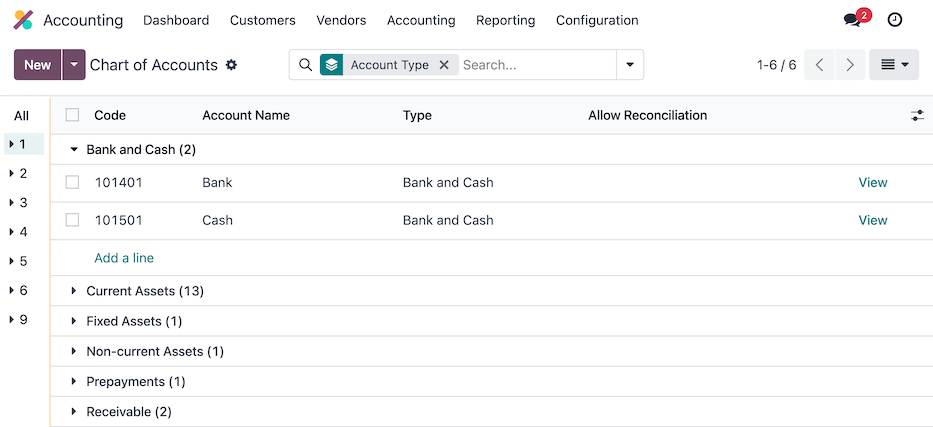
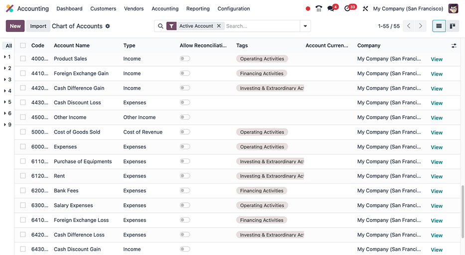
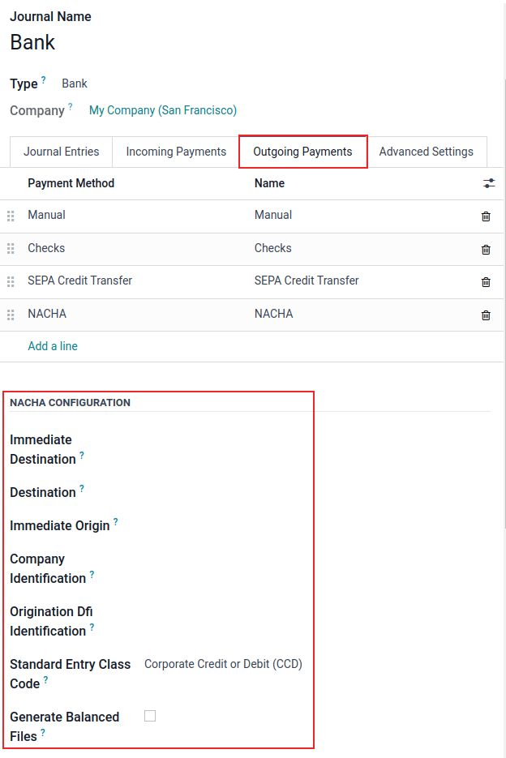
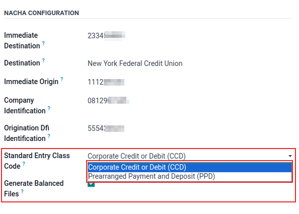
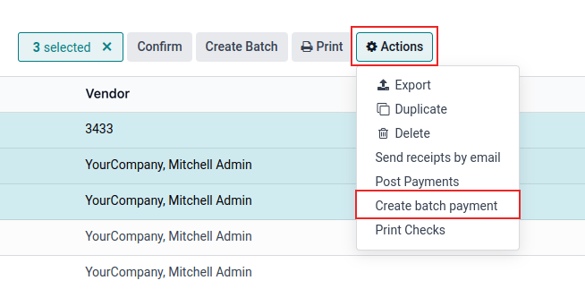
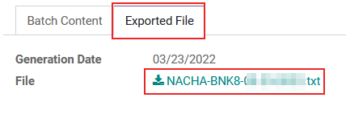

=============
United States
=============

.. |GAAP| replace:: :abbr:`GAAP (Generally Acceptable Accounting Practices)`
.. |FASB| replace:: :abbr:`FASB (Financial Accounting Standards Board)`
.. |SEC| replace:: :abbr:`SEC (Securities and Exchange Commission)`
.. |COA| replace:: :abbr:`CoA (Chart of Accounts)`
.. |AR| replace:: :abbr:`AR (Accounts Receivable)`
.. |AP| replace:: :abbr:`AP (Accounts Payable)`
.. |CFS| replace:: :abbr:`CFS (Cash Flow Statement)`
.. |NACHA| replace:: :abbr:`NACHA (National Automated Clearing House Association)`
.. |ACH| replace:: :abbr:`ACH (Automated Clearing House)`

The Odoo fiscal localization package for the United States follows the Generally Acceptable
Accounting Principles (GAAP) accounting standards and rules used to prepare financial statements,
as outlined by the Financial Accounting Standards Board (FASB) and adopted by the Securities and
Exchange Commission (SEC).

.. seealso::
   - `Financial Accounting Standards Board (FASB) <https://asc.fasb.org/Home>`_
   - `Securities and Exchange Commission (SEC) <https://www.sec.gov/>`_

In addition, a series of videos on the subject of Accounting are available through Odoo's eLearning
platform. These videos cover how to start from scratch, set up configurations, complete common
workflows, and provide in-depth looks at some specific use cases, as well.

.. seealso::
   - `Odoo Tutorials: Accounting & Invoicing
     <https://www.odoo.com/slides/accounting-and-invoicing-19>`_
   - `Odoo SmartClass: Accounting <https://www.odoo.com/slides/smartclass-accounting-121>`_

Configuration
=============

Below are the available modules in Odoo for accounting use in the United States.

.. note::
   The modules listed below are either for reference only or are optional, as the core requirements
   to operate under the US fiscal localization in Odoo are already included under the default
   package that came installed during database initialization.

   Verify the default package is in use by navigating to :menuselection:`Accounting App -->
   Settings` and under the :guilabel:`Fiscal Localization` section at the top, look for the `Generic
   Chart Template` selection to be listed next to the :guilabel:`Package` field label. This chart
   template includes the necessary settings for the US localization for the Odoo *Accounting* app.

   .. image:: united_states/us-l10n-generic-chart-template.png
      :align: center
      :alt: The Generic Chart Template comes pre-configured for the US localization.

Modules installation
--------------------

:ref:`Install <general/install>` the following modules to get all the features of the United States
localization:

.. list-table::
   :header-rows: 1
   :widths: 25 25 50

   * - Name
     - Technical name
     - Description
   * - :guilabel:`United States - Accounting`
     - `l10n_us`
     - Base accounting module for United States localization.
   * - :ref:`US - Accounting Reports <l10n_us/reports>`
     - `l10n_us_reports`
     - Adds United States accounting reports.
   * - :guilabel:`US Checks Layout`
     - `l10n_us_check_printing`
     - Enables the printing of payments on pre-printed check paper. Supports the three most common
       check formats and will work out of the box with the linked checks from `checkdepot.net
       <https://checkdepot.net/collections/computer-checks/Odoo>`_.

       - `Check on top: Quicken / QuickBooks standard
         <https://checkdepot.net/collections/computer-checks/odoo+top-check>`_
       - `Check on middle: Peachtree standard
         <https://checkdepot.net/collections/computer-checks/odoo+middle-check>`_
       - `Check on bottom: ADP standard
         <https://checkdepot.net/collections/computer-checks/odoo+Bottom-Check>`_

   * - :ref:`NACHA Payments <l10n_us/nacha>`
     - `l10n_us_payment_nacha`
     - Export payments as NACHA files for use in the United States.
   * - :ref:`1099 Reporting <l10n_us/1099-report>`
     - `l10n_us_1099`
     - Export 1099 data for e-filing with a 3rd party.
   * - :ref:`Avatax <l10n_us/taxes-avatax>`
     - `account_avatax`
     - Module for the :doc:`AvaTax integration <../accounting/taxes/avatax>` with Odoo.
   * - :ref:`United States - Payroll <l10n_us/payroll>`
     - `l10n_us_hr_payroll`
     - Includes the necessary rules for United States payroll, including:

       - Employee Details
       - Employee Contracts
       - Passport-based Contracts
       - Allowances/Deductions
       - Allow Configurations for Basic/Gross/Net Salary
       - Employee Payslip
       - Integration with Leaves Management

   * - :ref:`United States - Payroll with Accounting <l10n_us/payroll>`
     - `l10n_us_hr_payroll_account`
     - Contains the necessary accounting data for the United States payroll rules.
   * - :ref:`United States - Payroll - Export to ADP <l10n_us/adp>`
     - `l10n_us_hr_payroll_adp`
     - Export Work Entries to the ADP payroll software.

.. _l10n_us/coa:

Chart of accounts
=================

The :doc:`chart of accounts (COA) <../accounting/get_started/chart_of_accounts>` for the United
States localization, in Odoo, follows the standard |GAAP| structure, with accounts grouped into
seven main categories, with corresponding numeric values that prefix individual journal entries:

- **Receivable**: the balance of money (or credit) due to the business for goods or services
  delivered or used, but not yet paid for by customers. |AR| is indicated by the journal code
  labeled (or beginning) with :guilabel:`1`.
- **Payable**: the business's short-term obligations owed to its creditors or suppliers, which have
  not yet been paid. |AP| is indicated by the journal code labeled (or beginning) with
  :guilabel:`2`.
- **Equity**: the amount of money that would be returned to a company's shareholders if all of the
  assets were liquidated and all of the company's debt was paid off in the case of liquidation.
  Equity is indicated by the journal code labeled (or beginning) with :guilabel:`3` or
  :guilabel:`9`.
- **Assets**: items listed on the balance sheet that contains economic value or have the ability to
  generate cash flows in the future, such as a piece of machinery, a financial security, or a
  patent. Assets are indicated by the journal code labeled (or beginning) with :guilabel:`1`.
- **Liability**: refers to a company's financial debts or obligations that arise during the course
  of business operations. Liabilities are indicated by the journal code labeled (or beginning) with
  :guilabel:`2`.
- **Income**: synonymous with *net income*, this is the profit a company retains after paying off
  all relevant expenses from sales revenue earned. Income is indicated by the journal code labeled
  (or beginning) with :guilabel:`4` or :guilabel:`6`.
- **Expenses**: the cost of operations that a company incurs to generate revenue. Expenses are
  indicated by the journal code labeled (or beginning) with a :guilabel:`6`.

.. tip::
   Predefined accounts are included in Odoo, as part of the |CoA| that's installed with the US
   localization package. The accounts listed below are preconfigured to perform certain operations
   within Odoo. It is recommended to **not** delete these accounts; however, if changes are needed,
   rename the accounts instead.

   .. list-table::
     :header-rows: 1
     :stub-columns: 1

     * - :guilabel:`Type`
       - :guilabel:`Account Name`
     * - :guilabel:`Current Assets`
       - | :guilabel:`Bank Suspense Account`
         | :guilabel:`Outstanding Receipts`
         | :guilabel:`Outstanding Payments`
         | :guilabel:`Liquidity Transfer`
         | :guilabel:`Stock Valuation`
         | :guilabel:`Stock Interim (Received)`
         | :guilabel:`Stock Interim (Delivered)`
         | :guilabel:`Cost of Production`
     * - :guilabel:`Income`
       - | :guilabel:`Foreign Exchange Gain`
         | :guilabel:`Cash Difference Gain`
         | :guilabel:`Cash Discount Gain`
     * - :guilabel:`Expenses`
       - | :guilabel:`Cash Discount Loss`
         | :guilabel:`Foreign Exchange Loss`
         | :guilabel:`Cash Difference Loss`
     * - :guilabel:`Current Year Earnings`
       - :guilabel:`Undistributed Profits/Losses`
     * - :guilabel:`Receivable`
       - :guilabel:`Account Receivable`
     * - :guilabel:`Payable`
       - :guilabel:`Account Payable`

.. seealso::
   - :doc:`../accounting/get_started/chart_of_accounts`
   - :doc:`../accounting/get_started/cheat_sheet`

View, edit, and sort accounts
-----------------------------

Access the *Chart of Accounts* dashboard in Odoo  by navigating to :menuselection:`Accounting app
--> Configuration --> Accounting: Chart of Accounts`.

From the :guilabel:`Chart of Accounts` dashboard, create new accounts by clicking the purple
:guilabel:`New` button in the top-left corner of the dashboard and :ref:`filling in the
corresponding form <chart-of-account/create>`. Search and sort through existing accounts by using
specific :guilabel:`Filters` and :guilabel:`Group By` criteria, which are available in the mega menu
under the :guilabel:`Search...` bar.

To filter accounts by category, click the :icon:`fa-caret-down` :guilabel:`(caret down)` icon to
access the mega menu and look under the :guilabel:`Filters` column for individual selections.
Clicking on a specific category will only show accounts that match that particular filter.

To view all the available account types, remove all of the filters in the :guilabel:`Search...` bar,
and then click the :icon:`fa-caret-down` :guilabel:`(caret down)` icon to access the mega menu. From
there, select :guilabel:`Account Type` under the :guilabel:`Group By` column heading to list all of
the account types in the table.

Besides structure, there are other key differences in the chart of accounts in the United States,
compared to other countries:

- **Specificity**: US |GAAP| often requires more detailed accounts compared to some other countries.
  This can include separate accounts for various types of revenue, expenses, and assets, providing
  more granular information in financial reports.
- **Regulatory Requirements**: In the United States, there are specific regulatory requirements set
  by bodies such as the |SEC| for publicly traded companies. These requirements may influence the
  structure and content of the |COA| to ensure compliance with reporting standards.
- **Industry Practices**: Certain industries in the United States may have unique accounting
  requirements or specialized |COA| structures. For example, financial institutions often have
  specific accounts related to loans, investments, and interest income.
- **Tax Considerations**: The |COA| may also reflect tax considerations, such as accounts for
  deductible expenses, deferred tax assets, and liabilities, to ensure compliance with tax laws and
  facilitate tax reporting.

These differences, ultimately, should be reflected in the |COA| structure itself, with the addition
of new accounts, as needed, in order to meet the demands of US accounting reporting requirements.

.. seealso::
   - :ref:`Create a new account <chart-of-account/create>`
   - :doc:`../../essentials/search`

.. _l10n_us/taxes:

Taxes
=====

In the United States, tax rates and what is considered taxable vary by jurisdiction. Default *Sales*
and *Purchase* taxes are created automatically when the Odoo *Accounting* application is installed.
To manage existing or configure additional taxes, navigate to :menuselection:`Accounting -->
Configuration --> Taxes`.

.. _l10n_us/taxes-avatax:

AvaTax
------

**Avalara AvaTax** is a cloud-based tax calculation and compliance software that integrates with
Odoo for the United States and Canadian accounting localizations. Integrating AvaTax with Odoo
provides real-time and region-specific tax calculations when items are sold, purchased, and invoiced
in the database.

.. important::
   AvaTax is only available for integration with databases/companies that have locations in the
   United States and Canada. This means the fiscal position/country of a database can only be set to
   the United States or Canada. Reference this documentation for more information:
   :ref:`avatax/fiscal_country`.

.. seealso::
   Refer to the documentation articles below to integrate and configure an AvaTax account with an
   Odoo database:

   - :doc:`AvaTax integration <../accounting/taxes/avatax>`
   - :doc:`Avalara management portal <../accounting/taxes/avatax/avalara_portal>`
   - :doc:`Calculate taxes with AvaTax <../accounting/taxes/avatax/avatax_use>`
   - `US Tax Compliance: AvaTax elearning video
     <https://www.odoo.com/slides/slide/us-tax-compliance-avatax-2858?fullscreen=1>`_
   - Avalara's support documents: `About AvaTax
     <https://community.avalara.com/support/s/document-item?language=en_US&bundleId=dqa1657870670369_dqa1657870670369&topicId=About_AvaTax.html&_LANG=enus>`_

.. _l10n_us/reports:

Reports
=======

A number of :doc:`report selections <../accounting/reporting>` are readily available for the US
localization, under the :menuselection:`Accounting app --> Reporting` drop-down menu:

- :ref:`Balance Sheet <reporting/balance-sheet>`: a "snapshot" of a company's financial position at
  a specific point in time, which contains an overview of a company's assets, liabilities, and
  equity.
- :ref:`Profit & Loss <accounting/reporting/balance-sheet>`: otherwise known as a *P&L statement* or
  *income statement*, provides a summary of a company's revenues, expenses, and profits/losses over
  a given period of time.
- :ref:`Cash Flow Statement <l10n_us/cash-flow-statement>`: shows how much cash and cash equivalents
  a company has received and spent in a given period.
- :ref:`Executive Summary <accounting/reporting/executive-summary>`: an overview report that covers
  the key performance indicators of a company's financial position, such as revenue, profit, and
  debt.
- :ref:`Tax Report <reporting/tax-report>`: an official form filed for a tax authority that reports
  income, expenses, and other pertinent tax information. Tax reports allow taxpayers to calculate
  their tax liability, schedule tax payments, or request refunds for the overpayment of taxes. In
  Odoo, the tax report can be made monthly, every two months, quarterly, every 4 months,
  semi-annually, and annually.
- :guilabel:`Check Register`: a report that displays cash transactions (regardless of the journal)
  with their running balance after the transaction. Only visible with the *US - Accounting Reports*
  (`l10n_us_reports`) module installed.
- :ref:`1099 Report <l10n_us/1099-report>`: a CSV download of payments made to non-employees in a
  period to file electronically in a third-party service. Only visible with the *1099 Reporting*
  (`l10n_us_1099`) module installed.

.. _l10n_us/report-filters:

Depending on the type of report, certain filters are available at the top of the dashboard:

- a *date* filter, indicated by a :icon:`fa-calendar` :guilabel:`(calendar)` icon that precedes a
  date in *MM/DD/YYYY* format. Use this to select a specific date or date range for the report.
- a :icon:`fa-bar-chart` :guilabel:`Comparison` filter, to compare reporting periods against each
  other
- a *journal* filter, as indicated by a :icon:`fa-book` :guilabel:`(book)` icon and the default
  setting of :guilabel:`All Journals`. Use this filter to specify which journals should be included
  in the report.
- an *entries type* filter, as indicated by a :icon:`fa-filter` :guilabel:`(filter)` icon, with the
  default setting of :guilabel:`Posted Entries Only, Accrual Basis`. Use this filter to determine
  which type of journal entries should be included in the report (e.g. posted or draft), along with
  the type of accounting method (e.g. accrual or cash basis).

  - There are view options in this filter, as well, one that will :guilabel:`Hide lines at 0` for
    more relevant viewing, along with a :guilabel:`Split Horizontally` option to keep the report
    above the screen's fold, removing the need to scroll.

    .. image:: united_states/us-l1on-accounting-method-reporting-menu.png
       :align: center
       :alt: Accounting method filter menu for reports, covering accrual vs. cash basis methods.

- a *decimal* filter, that by default, includes figures with cents, as indicated by the
  :guilabel:`In .$` setting. Use the other options in the drop-down menu to change figures in the
  report to whole numbers (:guilabel:`In $`), thousands (:guilabel:`In K$`), or millions
  (:guilabel:`In M$`) formats.
- a report *customization* filter, indicated by the :icon:`fa-cogs` :guilabel:`(gears)` icon. Use
  this filter to customize the current report's sections and line items, or build new reports, as
  desired.

.. seealso::
   - :doc:`Accounting reporting <../accounting/reporting>`
   - :doc:`../../essentials/search`

.. _l10n_us/1099-report:

1099 report
-----------

The 1099 report, available by :ref:`installing <general/install>` the *1099 Reporting*
(`l10n_us_1099`) module, includes payments that are made to non-employees across a given reporting
period. Use the available CSV download from the report in Odoo to file 1099 payments electronically
via a third-party service.

To generate a 1099 report, navigate to :menuselection:`Accounting app --> Reporting --> Management:
1099 Report` to open a :guilabel:`1099 Report` wizard.

First, enter the date range of the transactions to report in the :guilabel:`Start Date` and
:guilabel:`End Date` fields.

Then, edit the journal items that appear on the wizard. Click :guilabel:`Add a line` to add any
items that are missing. Be sure to remove any items that should not be included in the report by
clicking :icon:`fa-times` :guilabel:`(delete)` on the row.

Finally, once all necessary items are included in the 1099 report, click on the :guilabel:`Generate`
button. Doing so, downloads a CSV file that groups transactions by the partner that received the
payments.

.. _l10n_us/cash-flow-statement:

Cash flow statement
-------------------

Navigate to the *Cash Flow Statement* (CFS) dashboard by going to :menuselection:`Accounting app -->
Reporting --> Statement Reports: Cash Flow Statement`. From here, |CFS| reports can be generated
using the various :ref:`filters <l10n_us/report-filters>` that are available at the top of the
dashboard.

Odoo uses the *direct* cash flow method to compile cash flow statements, which measures actual cash
inflows and outflows from the company's operations, such as when cash is received from customers or
when cash payments are made to suppliers.

By default, an account labeled with any of the three default :guilabel:`Tags` on the
:guilabel:`Chart of Accounts` dashboard will be included in the report, which includes:
:guilabel:`Operating Activities`, :guilabel:`Financing Activities`, and :guilabel:`Investing &
Extraordinary Activities`.

Additionally, the cash flow statement in Odoo:

- is limited to the *Bank* and *Cash* journals to reflect money coming in or out; and
- also contains *Expenses* accounts, to show the counterpart transactions versus *Bank* or *Cash*
  journal entries, while excluding |AR| and |AP| activity.

.. example::
   Create a vendor bill for $100, as an operating expense (not |AP|). Doing so will **not** reflect
   a transaction on the cash flow statement. However, register a corresponding payment for $100,
   and the transaction **will** reflect on the cash flow statement as :guilabel:`Cash paid for
   operating activities`.

   .. image:: united_states/us-l10n-operating-expenses-example.png
      :align: center
      :alt: Example of a bill registered as an operating expense as part of a cash flow statement.

.. _l10n_us/cash-discount:

Cash discount
=============

Cash discounts can be configured from :menuselection:`Accounting app --> Payment Terms`. Each
payment term can be set up with a cash discount and reduced tax.

.. seealso::
   :doc:`../accounting/customer_invoices/cash_discounts`

.. _l10n_us/writing-checks:

Writing checks
==============

Using checks is still a common payment practice in the US. Be sure the *US Checks Layout*
(`l10n_us_check_printing`) module for the US localization is :ref:`installed <general/install>`.

To enable check printing from Odoo, navigate to :menuselection:`Accounting --> Configuration -->
Settings` and find the :guilabel:`Vendor Payments` section. From here, tick the :guilabel:`Checks`
checkbox to reveal several fields for check configuration.

Select a :guilabel:`Check Layout` from the drop-down menu:

- :guilabel:`Print Check (Top) - US`
- :guilabel:`Print Check (Middle) - US`
- :guilabel:`Print Check (Bottom) - US`

Next, choose whether or not to enable the :guilabel:`Multi-Pages Check Stub` checkbox.

Optionally set a :guilabel:`Check Top Margin` and :guilabel:`Check Left Margin`, if required.

Once all check configurations are complete, :guilabel:`Save` the settings.

.. tip::
   Some of the check formats may require pre-printed paper from a third party vendor,
   https://checkdepot.net/collections/odoo-checks is recommended.

.. seealso::
   :doc:`../accounting/payments/pay_checks`

.. _l10n_us/payroll:

Payroll
=======

The *Payroll* application is responsible for calculating an employee's pay, taking into account all
work, vacation, and sick time, benefits, and deductions. The *Payroll* app pulls information from
the *Attendances*, *Timesheets*, *Time Off*, *Employees* and *Expenses* applications, to calculate
the worked hours and compensation for each employee.

When using an external payroll provider, such as *ADP*, it is necessary to export the various
payroll-related data, such as work entries, repayment of expenses, taxes, commissions, and any other
relevant data, so the data can be uploaded into the payroll provider, who then issues the actual
paychecks or directly deposits the funds into an employee's bank account.

In order to export the payroll data, the work entries must first be validated and correct. Refer to
the :doc:`work entries <../../hr/payroll/work_entries>` documentation for more information
regarding validating work entries.

Once work entries are validated, the information can be :ref:`exported to ADP <l10n_us/adp>`.

After payments have been issued to employees, payslips can be processed into batches, validated, and
posted to the corresponding accounting journals to keep all financial records in Odoo current.

Required information
--------------------

It is important to have the *Employees* application installed, and all employee information
populated. Several fields in both the :ref:`employee records <l10n_us/payroll-employee-records>`, as
well as in an :ref:`employee contracts <l10n_us/payroll-employee-contracts>`, are necessary to
properly process the employee's pay. Ensure the following fields are filled out in their respective
places.

.. _l10n_us/payroll-employee-records:

Employee records
~~~~~~~~~~~~~~~~

In each employee record, there is various information the *Payroll* application requires to properly
process payslips, including various banking, tax, and work information.

Navigate to the :menuselection:`Employees app` and select an employee record to view the sections of
the employee form that directly affect *Payroll*:

- :guilabel:`Work Information` tab:

  - :guilabel:`Work Address`: indicates where the employee is located, including the state, which
    affects the tax calculations.
  - :guilabel:`Working Hours`: determines how pay is calculated, and determines if an employee earns
    overtime.

- :guilabel:`Private Information` tab:

  - :guilabel:`SSN No`: the last four digits of the employee's Social Security Number (SSN) appears
    on payslips.
  - :guilabel:`Bank Account Number`: the bank account associated with the NACHA payment file.

- :guilabel:`HR Settings` tab:

  - :guilabel:`Federal Tax Filing Status`: the tax status an employee uses for Payroll tax
    calculations, which can be different from their state status.
  - :guilabel:`State Tax Filing Status`: the tax status an employee uses for their state portion of
    the Payroll tax calculation.
  - :guilabel:`W-2 Form`: a US tax form indicating the summary of wages, taxes, and benefits paid to
    an employee during a tax period (typically one year).
  - :guilabel:`W-4 Form`: an IRS form that helps outline the amount of federal taxes to withhold for
    an employee, which is paid to the IRS by the company.

.. _l10n_us/payroll-employee-contracts:

Employee contracts
~~~~~~~~~~~~~~~~~~

Additionally, there is information that is found in an employee contract that also affects the
*Payroll* application.

Navigate to the :menuselection:`Employees app --> Employees --> Contracts` and select a contract
record to view the sections of a contract that directly affect *Payroll*:

- :guilabel:`General Information`:

  - :guilabel:`Salary Structure Type: United States: Employee`: defines when the employee is paid,
    their working schedule, and the work entry type.
  - :guilabel:`Work Entry source`: determines how work entries are calculated.

- :guilabel:`Salary Information` tab:

  - :guilabel:`SSN No`: the last four digits of the employee's Social Security Number (SSN) appears
    on payslips.
  - :guilabel:`Wage type`: determines how the employee is paid, wether a Fixed wage (salary) or
    Hourly wage.
  - :guilabel:`Schedule Pay`: defines how often the employee is paid, either :guilabel:`Annually`,
    :guilabel:`Semi-annually`, :guilabel:`Quarterly`, :guilabel:`Bi-monthly`, :guilabel:`Monthly`,
    :guilabel:`Semi-monthly`, :guilabel:`Bi-weekly`, :guilabel:`Weekly`, or :guilabel:`Daily`. In
    the US, Semi-monthly (24 payments a year) or bi-weekly (26 payments a year) are the most common.
  - :guilabel:`Wage, Yearly, and Monthly cost`: used to show the total cost of an employee. It is
    recommended to populate the :guilabel:`Yearly` wage first, as it auto-populates the other
    fields.
  - :guilabel:`Pre-tax benefits`: populate this section according to the employee's selections.
    Pre-tax benefits decrease the gross wage, which lowers the base amount that is taxed. These are
    displayed at the beginning of the payslip.
  - :guilabel:`Post-tax benefits`: these benefits are deductions made *after* taxes are calculated.
    These appear towards the end of the payslip before the net amount is displayed.

.. seealso::
   :doc:`Employees documentation <../../hr/employees/new_employee>`

.. _l10n_us/adp:

Export work entries to ADP
--------------------------

Requirements
~~~~~~~~~~~~

In order to create a report that can be uploaded to ADP, there are some initial configuration steps
that must be completed first.

First, ensure the *United States - Payroll - Export to ADP* (`l10n_us_hr_payroll_adp`) module is
:ref:`installed <general/install>`.

Then, the company **must** have an *ADP Code* entered in the company settings. To do so, navigate
to :menuselection:`Payroll app --> Configuration --> Settings`. Enter the :guilabel:`ADP Code` in
the :guilabel:`US Localization` section.

Next, work entry types **must** have the correct ADP code listed in the *External Code* field for
each work entry type that is being referenced.

Lastly, every employee **must** have an *ADP Code* entered on their employee form. To do so,
navigate to :menuselection:`Employees app`, select an employee record, and open the :guilabel:`HR
Settings` tab. Enter the :guilabel:`ADP Code` in the :guilabel:`ADP Information` section.

The :guilabel:`ADP Code` code is how ADP identifies that particular employee, and is typically a
six-digit number.

.. seealso::
   - :ref:`payroll/new-work-entry`
   - :doc:`../../hr/employees/new_employee`

Export data
~~~~~~~~~~~

Once :doc:`work entries <../../hr/payroll/work_entries>` have been verified, the information can be
exported to a CSV file, which can then be uploaded into ADP.

To export the data, navigate to :menuselection:`Payroll app --> Reporting --> United States: ADP
Export`, then click :guilabel:`New`. Next, enter the :guilabel:`Start Date` and :guilabel:`End Date`
for the work entries using the calendar pop-over.

Then, enter a :guilabel:`Batch ID` in the corresponding field. The recommendation for this field is
to enter the date in a `YY-MM-DD` format, followed by any other characters to distinguish that
specific batch, such as a department name, or any other defining characteristics for the batch.

Enter a :guilabel:`Batch Description` in the corresponding field. This should be short and
descriptive, but distinct from the :guilabel:`Batch Name`.

Ensure the correct company populates the :guilabel:`Company` field. Change the selected company with
the drop-down menu, if needed.

Lastly, add the employee's work entry information to the list. Click :guilabel:`Add a line` and an
:guilabel:`Add: Employee` pop-up window loads. The list can be :doc:`filtered
<../../essentials/search>` to more easily find the employees to add to the list.

.. tip::
   Process the data export in multiple groups instead of in one large group that contains all
   employees. This helps to meaningfully differentiate the batches and makes processing more
   tenable, overall. The most common ways to group employees is by department, or by wage type
   (hourly or salaried).

Select the employees to add to the list by ticking the box to the left of their name. Once all
desired employees have been selected, click the :guilabel:`Select` button in the lower-left corner,
and the employees appear in the list.

To create the CSV file, click the :guilabel:`Generate` button in the top-left corner.

.. _l10n_us/ach-electronic-transfers:

ACH - electronic transfers
==========================

Automated Clearing House (ACH) payments are a modern way to transfer funds electronically between
bank accounts, replacing traditional paper-based methods. |ACH| payments are commonly used for
direct deposits, bill payments, and business transactions.

Receive ACH payments: payment provider integration
--------------------------------------------------

|ACH| payments are supported by *Authorize.net* and *Stripe* payment integrations in Odoo.

.. seealso::
   - :ref:`Setting up Authorize.net for ACH payments (Odoo) <authorize/ach_payments>`
   - `Authorize.net's ACH payment processing for small businesses documentation
     <https://www.authorize.net/resources/blog/2021/ach-payments-for-small-businesses.html>`_
   - :doc:`Setting up Stripe for ACH payments (Odoo) <../payment_providers/stripe>`
   - `Stripe's ACH Direct Debit documentation <https://docs.stripe.com/payments/ach-debit>`_

.. _l10n_us/nacha:

Send payments: NACHA files
--------------------------

Odoo can generate a National Automated Clearing House Association (NACHA) compatible |ACH| file to
send to a company's bank. For each individual *Bank* journal that the company wishes to pay vendors
with, a |NACHA| configuration section needs to be filled out on the Odoo database.

Configuration
~~~~~~~~~~~~~

First, navigate to the :menuselection:`Accounting app --> Configuration --> Journals`. Open the
bank journal and click into the :guilabel:`Outgoing Payments` tab.

.. note::
   The following |NACHA| configuration information is normally provided by the company's financial
   institution once they have been approved to send payments via their account.

Under the section labeled, :guilabel:`NACHA configuration` are the fields required to generate a
|NACHA| compatible |ACH| file to send to a company's bank. First, enter the routing number of the
financial institution in the field labeled, :guilabel:`Immediate Destination`. This information is
widely available on the Internet and generally varies by bank location. This number is usually
provided during the initial account setup.

Next, enter the registered name of the financial institution in the field called,
:guilabel:`Destination`. This information will be provided by the bank or credit union.

Following the :guilabel:`Destination` field is the :guilabel:`Immediate Origin` field. Enter the
9-digit company ID or Employer Identification Number (EIN) into this field. This information is
provided by the financial institution.

Next, enter the :guilabel:`Company Identification` number, which is a 10-digit number made from
combining the 9-digit company ID or Employer Identification Number (EIN), along with an additional
number at the start of the sequence. This number is often a `1`. Check with the financial
institution should this first number differ to verify that it is correct, as this number is provided
for |ACH| approved accounts.

Enter the :guilabel:`Originating DFI Identification` number next, which should contain an assigned
8-digit number from the financial institution.

.. important::
   Enter the numerical values in this section *exactly* as the company's financial institution
   (e.g. bank or credit union) has provided them, otherwise risk failing a successful |NACHA|
   configuration in Odoo.

There are two options for the next field: :guilabel:`Standard Entry Class Code`. Select the
drop-down menu to the right of the field and pick either :guilabel:`Corporate Credit or Debit (CCD)`
or :guilabel:`Prearranged Payment and Deposit (PPD)`. Again, this information will be provided by
the financial institution. By default :guilabel:`Corporate Credit or Debit (CCD)` is selected.

Finally, the last option is for :guilabel:`Generated Balanced Files`. Tick the checkbox to the right
of the field to enable :guilabel:`Generated Balanced Files`. Consult the company's accountant or
financial advisor to make an informed decision for this field.

Manually save the configuration by clicking the :icon:`fa-cloud-upload` :guilabel:`(cloud upload)`
icon, or navigate away from this screen to auto-save. The configuration is now complete.

.. _l10n_us/batch-payment:

Create batch payment
~~~~~~~~~~~~~~~~~~~~

Now, record each payment in Odoo using the |NACHA| payment method.

.. seealso::
   :ref:`Register Payments in Odoo <payments/register>`

.. important::
   Be aware of the cut-off time for same-day payments. Either the file needs to have a future date
   associated with each payment or the file needs to be sent prior to the cut-off, if the dates
   included in it match today's date. Consult the financial institution for the exact cut-off time
   for their processing of same-day payments.

Once all the payments to be included in the |NACHA| |ACH| file have been made, a batch payment needs
to be made from the :icon:`fa-cog` :guilabel:`Action` menu.

To create the batch payments, access the payments page, by navigating to :menuselection:`Accounting
--> Vendors --> Payments`. Select all the payments that should be included in the |NACHA| |ACH|
file, by ticking the checkboxes to the far-left of the rows.

         selected.

.. warning::
   All payments in the batch must share the same payment method.

Next, navigate to the batched payment (:menuselection:`Accounting --> Vendors --> Batch Payments`).
Click into the payment just created and then click into the :guilabel:`Exported File` tab. The
generated file is listed with the :guilabel:`Generation Date`. Click the :icon:`fa-download`
:guilabel:`(download)` button to download the file.

If any adjustments need to be made, click the :guilabel:`Re-generate Export File` button to recreate
a new |NACHA| |ACH| file.

.. seealso::
   - :doc:`../accounting/payments/batch`
   - :doc:`Europe's direct debiting <../accounting/payments/batch_sdd>`
