=============
United States
=============

.. |GAAP| replace:: :abbr:`GAAP (Generally Acceptable Accounting Practices)`
.. |FASB| replace:: :abbr:`FASB (Financial Accounting Standards Board)`
.. |SEC| replace:: :abbr:`SEC (Securities and Exchange Commission)`
.. |COA| replace:: :abbr:`CoA (Chart of Accounts)`
.. |AR| replace:: :abbr:`AR (Accounts Receivable)`
.. |AP| replace:: :abbr:`AP (Accounts Payable)`
.. |CFS| replace:: :abbr:`CFS (Cash Flow Statement)`
.. |NACHA| replace:: :abbr:`NACHA (National Automated Clearing House Association)`
.. |ACH| replace:: :abbr:`ACH (Automated Clearing House)`
.. |P&L| replace:: :abbr:`P&L (Profit and Loss)`

The Odoo fiscal localization package for the United States follows the Generally Acceptable
Accounting Principles (GAAP) accounting standards and rules used to prepare financial statements, as
outlined by the Financial Accounting Standards Board (FASB) and adopted by the Securities and
Exchange Commission (SEC).

.. seealso::
   - `Financial Accounting Standards Board (FASB) <https://asc.fasb.org/Home>`_
   - `Securities and Exchange Commission (SEC) <https://www.sec.gov/>`_

In addition, a series of videos on the subject of Accounting are available through Odoo's eLearning
platform. These videos cover how to start from scratch, set up configurations, complete common
workflows, and provide in-depth looks at some specific use cases, as well.

.. seealso::
   - `Odoo Tutorials: Accounting & Invoicing
     <https://www.odoo.com/slides/accounting-and-invoicing-19>`_
   - `Odoo SmartClass: Accounting <https://www.odoo.com/slides/smartclass-accounting-121>`_

Configuration
=============

The core module for the US fiscal localization is included in the default package installed during
database initialization. Verify the US package is in use by navigating to :menuselection:`Accounting
App --> Settings`. Under the :guilabel:`Fiscal Localization` section, the :guilabel:`Package` field
should be set to `United States`. This package includes the necessary settings for the US
localization for the Odoo **Accounting** app.

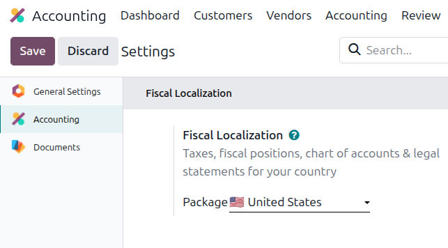

.. _l10n_us/optional-modules:

Modules installation
--------------------

:ref:`Install <general/install>` the following modules to get all the features of the United States
localization:

.. list-table::
   :header-rows: 1
   :widths: 25 25 50

   * - Name
     - Technical name
     - Description
   * - :guilabel:`United States - Accounting`
     - `l10n_us`
     - Base accounting module for United States localization.
   * - :ref:`US - Accounting Reports <l10n_us/reports>`
     - `l10n_us_reports`
     - Adds United States accounting reports.
   * - :guilabel:`US Checks Layout`
     - `l10n_us_check_printing`
     - Enables the printing of payments on pre-printed check paper. Supports the three most common
       check formats and will work out of the box with the linked checks from `checkdepot.net
       <https://checkdepot.net/collections/computer-checks/Odoo>`_.

       - `Check on top: Quicken / QuickBooks standard
         <https://checkdepot.net/collections/computer-checks/odoo+top-check>`_
       - `Check on middle: Peachtree standard
         <https://checkdepot.net/collections/computer-checks/odoo+middle-check>`_
       - `Check on bottom: ADP standard
         <https://checkdepot.net/collections/computer-checks/odoo+Bottom-Check>`_

   * - :ref:`NACHA Payments <l10n_us/nacha>`
     - `l10n_us_payment_nacha`
     - Export payments as NACHA files for use in the United States.
   * - :ref:`1099 Reporting <l10n_us/1099-report>`
     - `l10n_us_1099`
     - Export 1099 data for e-filing with a third party.
   * - :ref:`Avatax <l10n_us/taxes-avatax>`
     - `account_avatax`
     - Module for the :doc:`AvaTax integration <../accounting/taxes/avatax>` with Odoo.
   * - :doc:`United States - Payroll <../../hr/payroll/payroll_localizations/united_states>`
     - `l10n_us_hr_payroll`
     - Includes the necessary rules for United States payroll, including:

       - Employee Details
       - Employee Contracts
       - Passport-based Contracts
       - Allowances/Deductions
       - Allow Configurations for Basic/Gross/Net Salary
       - Employee Payslip
       - Integration with Leaves Management

   * - :guilabel:`United States - Payroll with Accounting`
     - `l10n_us_hr_payroll_account`
     - Contains the necessary accounting data for the United States payroll rules.
   * - :ref:`United States - Payroll - Export to ADP <payroll/united_states/adp>`
     - `l10n_us_hr_payroll_adp`
     - Export Work Entries to the ADP payroll software.

.. seealso::
   :doc:`United States payroll localization <../../hr/payroll/payroll_localizations/united_states>`

.. _l10n_us/coa:

Chart of accounts
=================

The :doc:`chart of accounts (COA) <../accounting/get_started/chart_of_accounts>` for the United
States localization, in Odoo, follows the standard |GAAP| structure, with accounts grouped into
seven main categories, with corresponding numeric values that prefix individual journal entries:

- **Receivable**: the balance of money (or credit) due to the business for goods or services
  delivered or used, but not yet paid for by customers. |AR| is indicated by the journal code
  labeled (or beginning) with :guilabel:`1`.
- **Payable**: the business's short-term obligations owed to its creditors or suppliers, which have
  not yet been paid. |AP| is indicated by the journal code labeled (or beginning) with
  :guilabel:`2`.
- **Equity**: the amount of money that is returned to a company's shareholders if all of the assets
  were liquidated and all of the company's debt was paid off in the case of liquidation. Equity is
  indicated by the journal code labeled (or beginning) with :guilabel:`3` or :guilabel:`9`.
- **Assets**: items listed on the balance sheet that contains economic value or have the ability to
  generate cash flows in the future, such as a piece of machinery, a financial security, or a
  patent. Assets are indicated by the journal code labeled (or beginning) with :guilabel:`1`.
- **Liability**: refers to a company's financial debts or obligations that arise during the course
  of business operations. Liabilities are indicated by the journal code labeled (or beginning) with
  :guilabel:`2`.
- **Income**: synonymous with *net income*, this is the profit a company retains after paying off
  all relevant expenses from sales revenue earned. Income is indicated by the journal code labeled
  (or beginning) with :guilabel:`4` or :guilabel:`6`.
- **Expenses**: the cost of operations that a company incurs to generate revenue. Expenses are
  indicated by the journal code labeled (or beginning) with a :guilabel:`6`.

.. tip::
   Predefined accounts are included in Odoo, as part of the |CoA| that is installed with the US
   localization package. The accounts listed below are preconfigured to perform certain operations
   within Odoo. It is recommended to **not** delete these accounts; however, if changes are needed,
   rename the accounts instead.

   .. list-table::
     :header-rows: 1
     :stub-columns: 1

     * - :guilabel:`Type`
       - :guilabel:`Account Name`
     * - :guilabel:`Current Assets`
       - | :guilabel:`Bank Suspense Account`
         | :guilabel:`Outstanding Receipts`
         | :guilabel:`Outstanding Payments`
         | :guilabel:`Liquidity Transfer`
         | :guilabel:`Stock Valuation`
         | :guilabel:`Stock Interim (Received)`
         | :guilabel:`Stock Interim (Delivered)`
         | :guilabel:`Cost of Production`
     * - :guilabel:`Income`
       - | :guilabel:`Foreign Exchange Gain`
         | :guilabel:`Cash Difference Gain`
         | :guilabel:`Cash Discount Gain`
     * - :guilabel:`Expenses`
       - | :guilabel:`Cash Discount Loss`
         | :guilabel:`Foreign Exchange Loss`
         | :guilabel:`Cash Difference Loss`
     * - :guilabel:`Current Year Earnings`
       - | :guilabel:`Accumulated Retained Earnings`
         | :guilabel:`Profit or Loss Appropriation`
     * - :guilabel:`Receivable`
       - :guilabel:`Account Receivable`
     * - :guilabel:`Payable`
       - :guilabel:`Account Payable`

.. seealso::
   - :doc:`../accounting/get_started/chart_of_accounts`
   - :doc:`../accounting/get_started/cheat_sheet`

View, edit, and sort accounts
-----------------------------

Access the *Chart of Accounts* dashboard in Odoo by navigating to :menuselection:`Accounting app -->
Configuration --> Accounting: Chart of Accounts`. From the :guilabel:`Chart of Accounts` dashboard,
create new accounts by clicking the :guilabel:`New` button in the top-left corner of the dashboard
and :ref:`filling in the corresponding form <chart-of-account/create>`. Search and sort through
existing accounts by using specific :guilabel:`Filters` and :guilabel:`Group By` criteria, which are
available in the search drop-down menu.

To filter accounts by category, click the :icon:`fa-caret-down` :guilabel:`(dropdown)` icon to
access the drop-down menu and look under the :guilabel:`Filters` column for individual selections.
Clicking on a specific category will only show accounts that match that particular filter.

To view all the available account types, remove all of the filters in the search bar, and then click
the :icon:`fa-caret-down` :guilabel:`(dropdown)` icon to access the drop-down menu. From there,
select :guilabel:`Account Type` under the :guilabel:`Group By` column heading to list all of the
account types in the table.

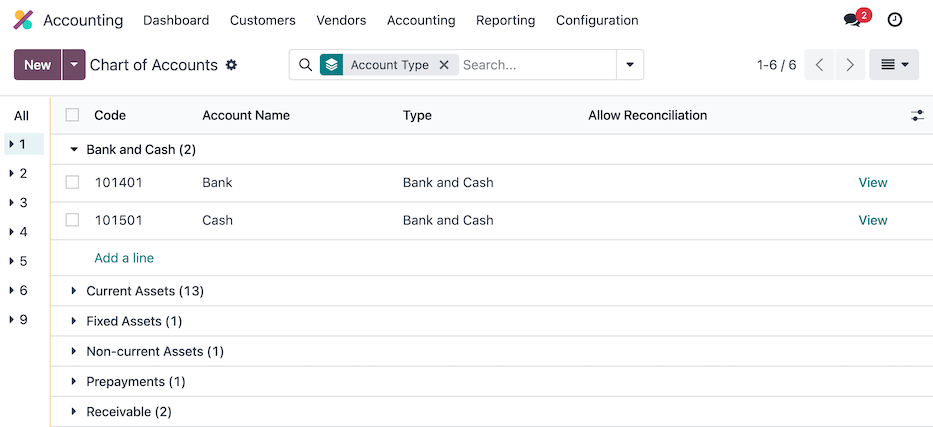

Besides structure, there are other key differences in the chart of accounts in the United States,
compared to other countries:

- **Specificity**: US |GAAP| often requires more detailed accounts compared to some other countries.
  This can include separate accounts for various types of revenue, expenses, and assets, providing
  more granular information in financial reports.
- **Regulatory Requirements**: In the United States, there are specific regulatory requirements set
  by bodies such as the |SEC| for publicly traded companies. These requirements may influence the
  structure and content of the |COA| to ensure compliance with reporting standards.
- **Industry Practices**: Certain industries in the United States may have unique accounting
  requirements or specialized |COA| structures. For example, financial institutions often have
  specific accounts related to loans, investments, and interest income.
- **Tax Considerations**: The |COA| may also reflect tax considerations, such as accounts for
  deductible expenses, deferred tax assets, and liabilities, to ensure compliance with tax laws and
  facilitate tax reporting.

These differences, ultimately, should be reflected in the |COA| structure itself, with the addition
of new accounts, as needed, in order to meet the demands of US accounting reporting requirements.

.. seealso::
   - :ref:`Create a new account <chart-of-account/create>`
   - :doc:`../../essentials/search`

.. _l10n_us/taxes:

Taxes
=====

In the United States, tax rates and what is considered taxable vary by jurisdiction. Default *sales*
and *purchase* taxes are created automatically when the Odoo **Accounting** app is installed. To
manage existing or configure additional taxes, navigate to :menuselection:`Accounting -->
Configuration --> Taxes`.

.. _l10n_us/taxes-avatax:

AvaTax
------

**Avalara AvaTax** is a cloud-based tax calculation and compliance software that integrates with
Odoo for several localizations. Integrating AvaTax with Odoo provides real-time and region-specific
tax calculations when items are sold, purchased, and invoiced in the database.

.. important::
   AvaTax is available for integration with databases/companies that have locations in the United
   States and Canada. Reference the :ref:`accounting/avatax/fiscal_country` documentation for more
   information.

.. seealso::
   Refer to the documentation articles below to integrate and configure an AvaTax account with an
   Odoo database:

   - :doc:`AvaTax integration <../accounting/taxes/avatax>`
   - :doc:`Avalara management portal <../accounting/taxes/avatax/avalara_portal>`
   - :doc:`Calculate taxes with AvaTax <../accounting/taxes/avatax/avatax_use>`
   - `US Tax Compliance: AvaTax elearning video
     <https://www.odoo.com/slides/slide/us-tax-compliance-avatax-2858?fullscreen=1>`_
   - Avalara's support documents: `About AvaTax
     <https://community.avalara.com/support/s/document-item?language=en_US&bundleId=dqa1657870670369_dqa1657870670369&topicId=About_AvaTax.html&_LANG=enus>`_

.. _l10n_us/reports:

Reports
=======

In addition to the :doc:`generic reports <../accounting/reporting>`, the following reports are
available for the US localization under the :menuselection:`Accounting --> Reporting` menu:

- :ref:`Check Register <l10n_us/optional-modules>`: A report displaying cash transactions
  (regardless of the journal) with their running balance after the transaction.
- :ref:`1099 Report <l10n_us/1099-report>`: A CSV download of payments made to non-employees in a
  period to file electronically in a third-party service.

.. seealso::
   - :doc:`Accounting reporting <../accounting/reporting>`
   - :doc:`../../essentials/search`
   - :ref:`Cash basis reporting <accounting/cash-basis/report-filter>`

.. _l10n_us/1099-report:

1099 report
-----------

The :ref:`1099 report <l10n_us/optional-modules>` includes payments that are made to non-employees
across a given reporting period. Use the available CSV download from the report in Odoo to file 1099
payments electronically via a third-party service.

To generate a 1099 report, navigate to :menuselection:`Accounting app --> Reporting --> Management:
1099 Report` to open a :guilabel:`1099 Report` wizard.

First, enter the date range of the transactions to report in the :guilabel:`Start Date` and
:guilabel:`End Date` fields.

Then, edit the journal items that appear on the wizard. Click :guilabel:`Add a line` to add any
items that are missing. Be sure to remove any items that should not be included in the report by
clicking :icon:`fa-times` :guilabel:`(delete)` on the row.

Finally, once all necessary items are included in the 1099 report, click on the :guilabel:`Generate`
button. Doing so downloads a CSV file that groups transactions by the partner that received the
payments.

.. _l10n_us/cash-flow-statement:

Cash flow statement
-------------------

Navigate to the *Cash Flow Statement* (CFS) dashboard by going to :menuselection:`Accounting app -->
Reporting --> Statement Reports: Cash Flow Statement`. From here, |CFS| reports can be generated
using the various :ref:`filters <accounting/reporting/filters>` that are available at the top of the
dashboard.

Odoo uses the *direct* cash flow method to compile cash flow statements, which measures actual cash
inflows and outflows from the company's operations, such as when cash is received from customers or
when cash payments are made to suppliers.

By default, an account labeled with any of the three default :guilabel:`Tags` on the
:guilabel:`Chart of Accounts` dashboard is included in the report, which includes:
:guilabel:`Operating Activities`, :guilabel:`Financing Activities`, and :guilabel:`Investing &
Extraordinary Activities`.

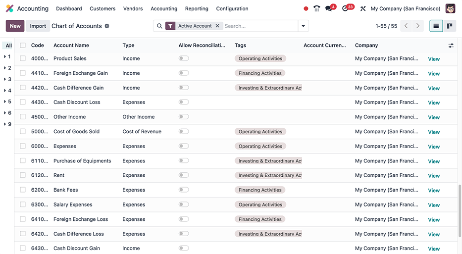

Additionally, the cash flow statement in Odoo:

- is limited to the *Bank* and *Cash* journals to reflect money coming in or out; and
- also contains *Expenses* accounts, to show the counterpart transactions versus *Bank* or *Cash*
  journal entries, while excluding |AR| and |AP| activity.

.. example::
   Create a vendor bill for $100, as an operating expense (not |AP|). Doing so will **not** reflect
   a transaction on the cash flow statement. However, register a corresponding payment for $100, and
   the transaction **will** reflect on the cash flow statement as :guilabel:`Cash paid for operating
   activities`.

   .. image:: united_states/us-l10n-operating-expenses-example.png
      :alt: Example of a bill registered as an operating expense as part of a cash flow statement.

.. _l10n_us/profit-loss-statement:

Profit & loss statement
-----------------------

To view the |P&L| statement, navigate to :menuselection:`Accounting --> Reporting --> Profit and
Loss`. To conform with |GAAP| standards and facilitate migration from other US accounting software,
the labels of the generic |P&L| statement are modified for the US localization. The structure and
formulas in this :doc:`custom report <../accounting/reporting/customize>` are identical to the
generic report.

To view the labels used in the report, enter :ref:`developer mode <developer-mode>`, navigate to the
|P&L| statement, and click the :icon:`fa-cogs` :guilabel:`(cogs)` smart button. The US |P&L|
statement line items correspond to the generic |P&L| statement line items as follows:

.. list-table::
   :header-rows: 1
   :stub-columns: 0

   * - Generic P&L Statement
     - US P&L Statement
   * - Revenue
     - Income
   * - Less Costs of Revenue
     - Cost of Sales
   * - Gross Profit
     - Gross Profit
   * - Less Operating Expenses
     - Expense
   * - Operating Income (or Loss)
     - Net Operating Income
   * - Plus Other Income
     - Other Income
   * - Less Other Expenses
     - Other Expense
   * - *--*
     - Net Other Income
   * - Net Profit
     - Net Income
   * - Less Allocations and Plus Withdrawals
     - *--*
   * - Net Profit Left After Allocations and Withdrawals
     - *--*

.. note::
   *Net Other Income* is calculated by subtracting *Other Expense* from *Other Income*.

   European accounting frameworks include appropriation of profit in the generic |P&L| statement.
   Under |GAAP| accounting standards, the |P&L| statement summarizes performance only. As a result,
   the US report does not include *Allocations and Withdrawals*.

.. _l10n_us/cash-discount:

Cash discount
=============

Cash discounts can be configured from :menuselection:`Accounting app --> Payment Terms`. Each
payment term can be set up with a cash discount and reduced tax.

.. seealso::
   :doc:`../accounting/customer_invoices/cash_discounts`

.. _l10n_us/writing-checks:

Writing checks
==============

.. note::
   Be sure the :guilabel:`US Checks Layout` (`l10n_us_check_printing`) module for the US
   localization is :ref:`installed <general/install>`.

To print checks in Odoo, :doc:`enable and configure checks <../accounting/payments/pay_checks>`.

In the :guilabel:`Check Layout` field, select one of the available pre-printed or blank check
layouts from the drop-down menu:

- :guilabel:`Print Check (Top) - US`
- :guilabel:`Print Check (Middle) - US`
- :guilabel:`Print Check (Bottom) - US`
- :guilabel:`Print Blank Check (Top) - US`
- :guilabel:`Print Blank Check (Middle) - US`
- :guilabel:`Print Blank Check (Bottom) - US`

.. tip::
   - For pre-printed layouts, we recommend using `pre-printed checks from checkdepot.net
     <https://checkdepot.net/collections/odoo-checks>`_.
   - For blank layouts, high-security check paper is required, such as `blank checks from
     checkdepot.net <https://checkdepot.net/collections/blank-check-paper>`_.

.. _l10n_us/ach-electronic-transfers:

ACH - electronic transfers
==========================

Automated Clearing House (ACH) payments are a modern way to transfer funds electronically between
bank accounts, replacing traditional paper-based methods. |ACH| payments are commonly used for
direct deposits, bill payments, and business transactions.

Receive ACH payments: payment provider integration
--------------------------------------------------

|ACH| payments are supported by *Authorize.net* and *Stripe* payment integrations in Odoo.

.. seealso::
   - :ref:`Setting up Authorize.net for ACH payments (Odoo) <authorize/ach_payments>`
   - `Authorize.net's ACH payment processing for small businesses documentation
     <https://www.authorize.net/resources/blog/2021/ach-payments-for-small-businesses.html>`_
   - :doc:`Setting up Stripe for ACH payments (Odoo) <../payment_providers/stripe>`
   - `Stripe's ACH Direct Debit documentation <https://docs.stripe.com/payments/ach-debit>`_

.. _l10n_us/nacha:

Send payments: NACHA files
--------------------------

Odoo can generate a National Automated Clearing House Association (NACHA) compatible |ACH| file to
send to a company's bank. For each individual *Bank* journal that the company wishes to pay vendors
with, a |NACHA| configuration section needs to be filled out on the Odoo database.

Configuration
~~~~~~~~~~~~~

First, navigate to the :menuselection:`Accounting app --> Configuration --> Journals`. Open the bank
journal and click into the :guilabel:`Outgoing Payments` tab.

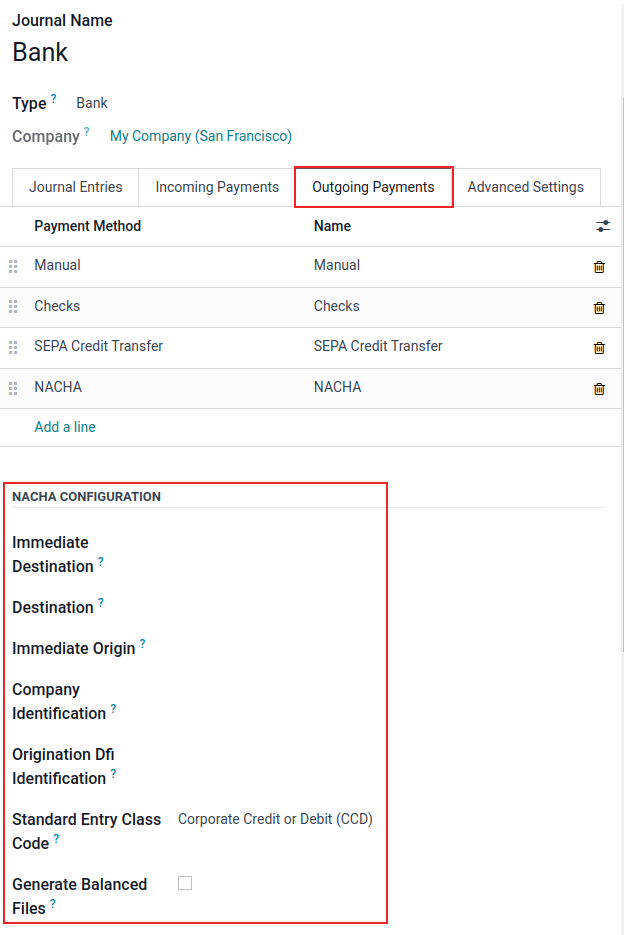

.. note::
   The following |NACHA| configuration information is normally provided by the company's financial
   institution once they have been approved to send payments via their account.

Under the section labeled, :guilabel:`NACHA configuration` are the fields required to generate a
|NACHA| compatible |ACH| file to send to a company's bank. First, enter the routing number of the
financial institution in the field labeled, :guilabel:`Immediate Destination`. This information is
widely available on the Internet and generally varies by bank location. This number is usually
provided during the initial account setup.

Next, enter the registered name of the financial institution in the field called,
:guilabel:`Destination`. This information is provided by the bank or credit union.

Following the :guilabel:`Destination` field is the :guilabel:`Immediate Origin` field. Enter the
9-digit company ID or Employer Identification Number (EIN) into this field. This information is
provided by the financial institution.

Next, enter the :guilabel:`Company Identification` number, which is a 10-digit number made from
combining the 9-digit company ID or Employer Identification Number (EIN), along with an additional
number at the start of the sequence. This number is often a `1`. Check with the financial
institution should this first number differ to verify that it is correct, as this number is provided
for |ACH| approved accounts.

Enter the :guilabel:`Originating DFI Identification` number next, which should contain an assigned
8-digit number from the financial institution.

.. important::
   Enter the numerical values in this section *exactly* as the company's financial institution (e.g.
   bank or credit union) has provided them, otherwise risk failing a successful |NACHA|
   configuration in Odoo.

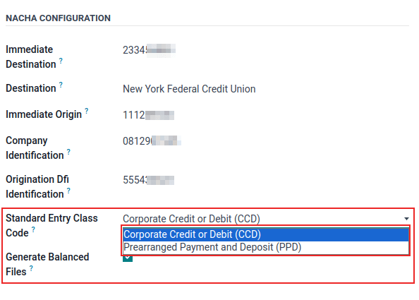

Two options are available for the next field: :guilabel:`Standard Entry Class Code`. Select the
drop-down menu to the right of the field and pick either :guilabel:`Corporate Credit or Debit (CCD)`
or :guilabel:`Prearranged Payment and Deposit (PPD)`. Again, this information is provided by the
financial institution. By default :guilabel:`Corporate Credit or Debit (CCD)` is selected.

Finally, the last option is for :guilabel:`Generated Balanced Files`. Tick the checkbox to the right
of the field to enable :guilabel:`Generated Balanced Files`. Consult the company's accountant or
financial adviser to make an informed decision for this field.

Manually save the configuration by clicking the :icon:`fa-cloud-upload` :guilabel:`(cloud upload)`
icon, or navigate away from this screen to auto-save. The configuration is now complete.

.. _l10n_us/batch-payment:

Create batch payment
~~~~~~~~~~~~~~~~~~~~

Now, record each payment in Odoo using the |NACHA| payment method.

.. seealso::
   :ref:`Register Payments in Odoo <accounting/payments/from-invoice-bill>`

.. important::
   Be aware of the cut-off time for same-day payments. Either the file needs to have a future date
   associated with each payment or the file needs to be sent prior to the cut-off, if the dates
   included in it match today's date. Consult the financial institution for the exact cut-off time
   for their processing of same-day payments.

Once all the payments to be included in the |NACHA| |ACH| file have been made, a batch payment needs
to be made from the :icon:`fa-cog` :guilabel:`Action` menu.

To create the batch payments, access the payments page, by navigating to :menuselection:`Accounting
--> Vendors --> Payments`. Select all the payments that should be included in the |NACHA| |ACH|
file, by ticking the checkboxes to the far-left of the rows.

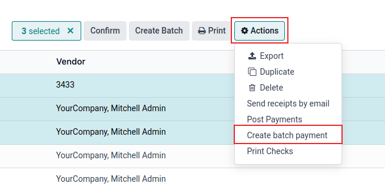
         selected.

.. important::
   All payments in the batch **must** share the same |NACHA| payment method.

Next, navigate to the batched payment (:menuselection:`Accounting --> Vendors --> Batch Payments`).
Click into the payment recently created and then click into the :guilabel:`Exported File` tab. The
generated file is listed with the :guilabel:`Generation Date`. Click the :icon:`fa-download`
:guilabel:`(download)` button to download the file.

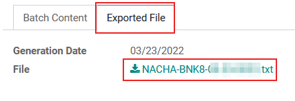

If any adjustments need to be made, click the :guilabel:`Re-generate Export File` button to recreate
a new |NACHA| |ACH| file.

.. seealso::
   - :doc:`../accounting/payments/batch`
   - :doc:`Europe's direct debiting <../accounting/payments/sepa_payments>`

.. |API| replace:: :abbr:`API (Application Programming Interface)`

Pay by direct deposit
=====================

Direct deposit is an electronic fund transfer primarily used in the United States, in which money is
sent directly to a bank account without the use of a physical check or manual deposit. Odoo offers
direct deposit through an international money transfer service called `Wise.com
<https://wise.com/>`_.

Wise provides an |API|, invoicing tools, and business accounts. Businesses can send and receive
payments using Wise's cross-border payment technology without building everything from scratch.

This feature can be used to pay vendor bills.

Configuration
-------------

Wise configuration
~~~~~~~~~~~~~~~~~~

Wise configuration involves three main steps: creating a Wise account, linking a bank account to the
Wise account, and generating |API| tokens from the Wise account. These steps are detailed below:

1. Navigate to `Wise.com <https://wise.com/>`_ and click :guilabel:`Sign-Up` to create an account.
#. Select :guilabel:`Business Account` and finish providing company and personal user details to
   complete the sign-up process.

   i. Wise may require additional verification documents depending on the business type and country.
      This process can take 1–3 business days.

#. Navigate to the account settings by clicking the :guilabel:`Company Name` in the top-right corner
   of the dashboard.
#. Select :menuselection:`Payment Methods --> Connected bank accounts` and click :guilabel:`Connect
   Your Bank Account`.
#. Search for the bank and add the bank account information. This bank account will be configured in
   Odoo as well.

#. Go to the account settings by clicking the :guilabel:`Company Name` in the top-right corner of
   the dashboard.
#. Select :menuselection:`Integration and Tools --> API Tokens` and click :guilabel:`Add new token`.
#. Add a description and select :guilabel:`Full Access`, then click :guilabel:`Create Token`.
#. Find the token under :guilabel:`API tokens` and click :guilabel:`Reveal key`.
#. Copy the token to the clipboard.

Odoo configuration
~~~~~~~~~~~~~~~~~~

Odoo configuration involves four main steps: installing the Wise module, adding Wise |API|
credentials, adding the company bank account, and adding the vendor bank account. These steps are
detailed below:

1. In the Odoo database, :ref:`install <general/install>` the :guilabel:`United States - Direct
   Deposit` module.

   .. tip::
      To see the module in search results, remove the :doc:`Apps filter
      <../../general/apps_modules>` from the search bar.

#. Go to :menuselection:`Accounting app --> Configuration --> Settings` and scroll down to the
   :guilabel:`Vendor Payments` section.
#. In the setting for :guilabel:`U.S. Direct Deposit (via Wise)`, enter the :guilabel:`Wise API
   token` generated in Wise.

#. Click :icon:`fa-plug` :guilabel:`Connect to Wise` to ensure the connection is established between
   the Odoo database and the Wise account.

   .. image:: united_states/connect-to-wise.png
      :alt: Click the Connect to Wise button to ensure the connection is established between the
            Odoo database and the Wise account.

#. Create the company and vendor bank accounts:

   a. Go to the :guilabel:`Contacts` app and select the company/vendor's contact card.
   #. Switch to the :guilabel:`Accounting` tab and click on the :guilabel:`Bank accounts` field,
      then click :guilabel:`Create`.

      .. image:: united_states/create-bank-account.png
         :alt: Click the Bank accounts field, then click Create to enter the bank account details.

   #. Click  on the :guilabel:`Bank` field, then select the bank from the list, or click
      :guilabel:`Search more` if it's not visible. If the bank isn't listed, click :guilabel:`Create
      new` to fill out the bank details, then click :guilabel:`Save`.

      .. image:: united_states/bank-information.png
         :alt: Click the Bank accounts field, then select or create the bank.

   #. Finally, enter the company bank account information (linked in Wise) or vendor bank account
      information, and click :guilabel:`Save`.

      i. The :guilabel:`Bank accounts` field in the :guilabel:`Accounting` tab should now display
         the newly added bank account.

         .. image:: united_states/bank-account-information.png
            :alt: Enter the company/vendor bank account information, then click Save.

   #. Repeat these steps for the **vendor** bank account.

      .. important::
         To avoid errors when initiating payments to the vendor, ensure the following:

         - Verify the destination bank account with the vendor, then mark it as :ref:`Trusted
           <accounting/batch/bank-accounts>`.
         - Select the correct :guilabel:`Bank Account Type` (checking or savings).
         - Select the preferred :guilabel:`Direct Deposit Transfer Type` for the vendor/destination
           account. Pricing can be verified directly in Wise.
         - See `Wise US pricing <https://wise.com/us/pricing/business>`__ to calculate price by
           feature & transaction amount; for pricing in other countries, select the country at the
           top of the page.

.. note::
   Wise offers a `Sandbox environment <https://sandbox.transferwise.tech/login>`_ for testing
   features and integrations.

   Select the appropriate environment to ensure accurate results (*sandbox* for testing,
   *production* for real transactions).

Pay vendor bills with direct deposit
------------------------------------

After configuring direct deposit in both Wise and Odoo, vendor payments can be created individually
in the Odoo database, batched for transfer, and then paid in Wise.

1. :ref:`Create vendor bills <accounting/vendor_bills/creation>`.
#. :doc:`Pay the vendor bills <../accounting/payments>` using :guilabel:`U.S. Direct Deposit` as the
   :guilabel:`Payment Method` for the transaction.
#. :doc:`Create a batch payment <../accounting/payments/batch>`. Batch payments can include payments
   from multiple vendors.
#. Confirm the :guilabel:`Batch Type` is :guilabel:`Outbound`, and click :guilabel:`Initiate
   payment`. Odoo will redirect to Wise.

   i. Sign into the Wise account if needed, and see all the pending transactions.

#. Review the details and confirm the batch number is the same in Odoo and Wise.
#. Click :guilabel:`Pay for this batch` or :guilabel:`I've now paid` to pay for the entire batch.

.. note::
   If pop-ups are blocked in the browser settings, Odoo can't redirect to Wise. Instead, Odoo
   displays a message stating:

   `"A popup window has been blocked. You may need to change your browser settings to allow popup
   windows for this page."`

   The payment record is still created in Wise, and can be accessed by clicking :guilabel:`View
   Batch` on the batch payment.

Cancel a batch payment
----------------------

To cancel a batch payment, follow these steps:

1. Navigate to :menuselection:`Accounting --> Vendors --> Batch Payments`.
#. Select the batch payment to cancel, then click :guilabel:`View Batch`. Odoo will redirect to the
   batch in Wise. Sign into the Wise account if needed.
#. Click :guilabel:`Cancel batch` in Wise.

ISO 20022
=========

ISO 20022 is a global standard for sending financial information between banks and payment systems
using XML files. It can be thought of as a universal language for money messages.

This standard helps banks all over the world talk to each other in the same way, or *language*, so
information is transferred correctly, making sending and receiving money faster, clearer, and safer.

In Odoo, ISO 20022 files are generated from :ref:`batch payments <l10n_us/batch-payment>`.

Configurations
--------------

Before creating ISO 20022 records, several configurations must be made, including :ref:`general
settings <l10n_us/settings>`, contact information for the :ref:`company
<l10n_us/contact-info-company>`, and contact and banking information for all :ref:`recipients
<l10n_us/contact-info-recipient>`.

.. _l10n_us/settings:

Settings
~~~~~~~~

First, navigate to :menuselection:`Acounting app --> Configuration --> Settings`, scroll to the
:guilabel:`Customer Payment` section, and enable the :guilabel:`Batch Payments` option.

Then scroll to the :guilabel:`Vendor Payments` section and enable the :guilabel:`SEPA Credit
Transfer / ISO20022` option. Once Enabled, three fields appear: :guilabel:`Your Company`,
:guilabel:`Name Identification`, and :guilabel:`Issuer`. Enter the information for these fields. The
information entered is required by the bank to identify the account, and is added to the XML file.

Click :guilabel:`Save` after making changes.

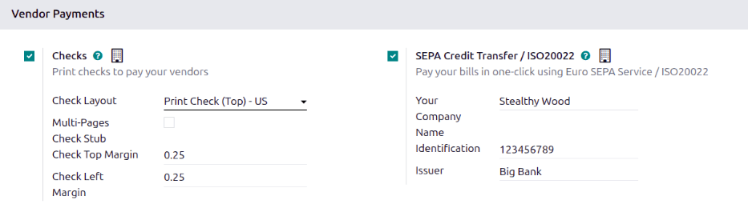

.. note::
   The :guilabel:`Name Identification` and :guilabel:`Issuer` information are typically provided by
   the bank.

.. _l10n_us/contact-info-company:

Company information
~~~~~~~~~~~~~~~~~~~

Ensure the company's address information is correct, as the XML files generated include the company
address. Navigate to the :menuselection:`Settings app --> Users & Companies --> Companies`, and
click on the desired company to open the company form. Ensure the :guilabel:`Address` fields are
fully configured in the :guilabel:`General Information` tab.

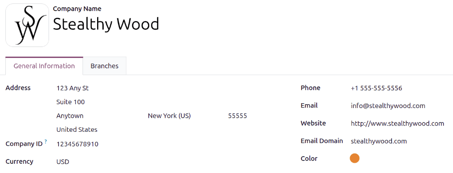

.. _l10n_us/contact-info-recipient:

Recipient information
~~~~~~~~~~~~~~~~~~~~~

The XML file generated contains the address and banking information for *all* recipients. Open the
**Contacts** app and ensure every contact record that receives payments, both persons and companies,
includes complete :guilabel:`Address` information in the top-half of the contact form.

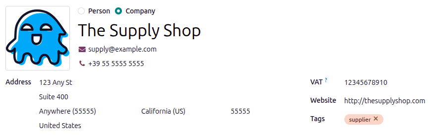

Next, click into the :guilabel:`Accounting` tab, and ensure at least one trusted bank account
populates the :guilabel:`Banks` field. If no bank is listed, add a :ref:`new bank account
<l10n_us/add-bank>`.

.. _l10n_us/add-bank:

Add a bank account
******************

To add a bank account on a contact record, open the **Contacts** app and click on the contact
record, and click into the :guilabel:`Accounting` tab. Click into the blank field next to
:guilabel:`Banks`, click :guilabel:`Create...`, and a :guilabel:`Create Banks` pop-up window loads.
Fill out the following fields on the form, then click :guilabel:`Save`:

- :guilabel:`Account Number`: Enter the bank account number.
- :guilabel:`ABA/Routing Number`: Enter the ABA or routing number for the account.
- :guilabel:`Account Holder`: Using the drop-down menu, select the owner of the bank account. The
  contact name (person or company) populates this field by default.
- :guilabel:`Bank`: Using the drop-down menu, select the bank for the account. If the bank does not
  appear in the list, add a new bank by clicking :guilabel:`Search more...` then click
  :guilabel:`New`, and fill out the :guilabel:`Create Bank` form.
- :guilabel:`Send Money`: Ensure this slider is set to :guilabel:`Trusted`. The slider and text
  appears green if the bank account is trusted. If this is **not** set to trusted, an error appears
  when attempting to make a payment to the contact.

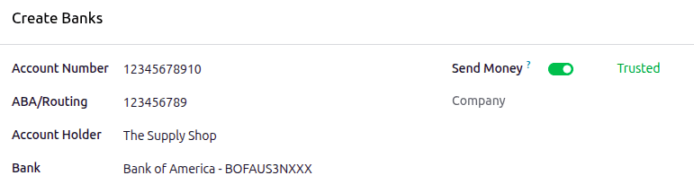

.. note::
   Trusted bank accounts appear in green in the :guilabel:`Accounting` tab.

   .. image:: united_states/us-l10n-trusted.png
      :alt: A trusted bank account on a contact form.

Bank journal settings
~~~~~~~~~~~~~~~~~~~~~

Ensure the ISO payment methods appear in the bank journal, and are configured correctly. Navigate to
:menuselection:`Accounting app --> Configurations --> Journals` and click on the journal
:guilabel:`Bank`. Click into the :guilabel:`Outgoing Payments` tab, and ensure that in the
:guilabel:`Payment Method` column, both `ISO20022` and `U.S. ISO20022` appear.

Next, ensure all entries listed have the :guilabel:`101404 Outstanding Payments` account selected in
the :guilabel:`Outstanding Payments accounts` column. This allows Odoo to create journal entries for
payments.

ISO20022 vs U.S. ISO20022
-------------------------

The U.S. ISO20022 is similar to the ISO standard, with some U.S.-specific rules and formatting.

.. example::
   The U.S. ISO20022 uses ABA routing numbers, which are specific to the U.S., while the generic
   ISO20022 uses IBAN numbers.

.. list-table::
   :header-rows: 1
   :stub-columns: 0

   * - Feature
     - Global ISO 20022
     - U.S. ISO 20022
   * - Developed by
     - ISO (global organization)
     - U.S. payment system operators (Fed, TCH, NACHA)
   * - Used for
     - Global & cross-border payments
     - Domestic U.S. payments
   * - Format
     - XML-based standard
     - XML (same base) with U.S. data rules
   * - Examples
     - SEPA Credit Transfer (Europe), SWIFT MX messages
     - Fedwire ISO 20022, CHIPS ISO 20022
   * - Differences
     - Global fields and formats
     - Trimmed or modified to fit U.S. needs (e.g., ABA routing numbers instead of IBANs)

.. tip::
   It is recommended to use the generic ISO20022 for *international* transfers, and use the U.S.
   ISO20022 for *domestic* transfers.

Workflow
--------

First, :ref:`create <accounting/vendor_bills/creation>` and :ref:`confirm
<accounting/vendor_bills/bill-confirmation>` a vendor bill. Then, click the :guilabel:`Pay` button,
and a :guilabel:`Pay` pop-up window loads. Using the drop-down menu, select :guilabel:`ISO20022` in
the :guilabel:`Payment Method` field, then click :guilabel:`Create Payment`.

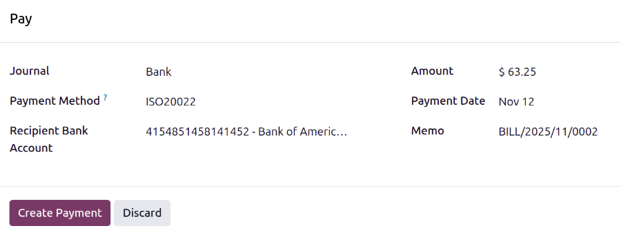

A green :guilabel:`In Payment` banner now appears on the vendor bill. Next, navigate to
:menuselection:`Accounting --> Vendors --> Payments`, and tick the checkbox next to the payment that
was paid using ISO20022 file to select it. Click :guilabel:`Create Batch`, then click
:guilabel:`Validate` on the batch form. Once validated, the batch payment moves to the
:guilabel:`Sent` stage, and the U.S. ISO20022 XML file is created and added to the chatter. The XML
file can be downloaded and used to initiate a bank payment.

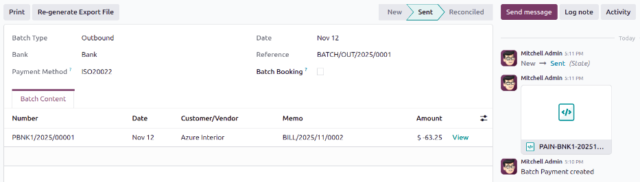

Once the XML file is created, the following steps occur **outside** of the Odoo database.

Log into the bank's online portal or payment system. Most banks that support ISO 20022 have a
special section for `file uploads` or `import payments`. Upload the XML ISO 20022 file created by
Odoo (ending in `.xml`) and upload it to the bank system.

The bank checks the XML file by reading the file and making sure all details (accounts, amounts,
etc.) are valid. The list of payments appears inside the file. Review and confirm the information,
then click `Approve` or `Submit`.

The bank processes each payment in the file and transfers the funds to the recipients.

   - :doc:`Europe's direct debiting <../accounting/payments/sepa_payments>`
