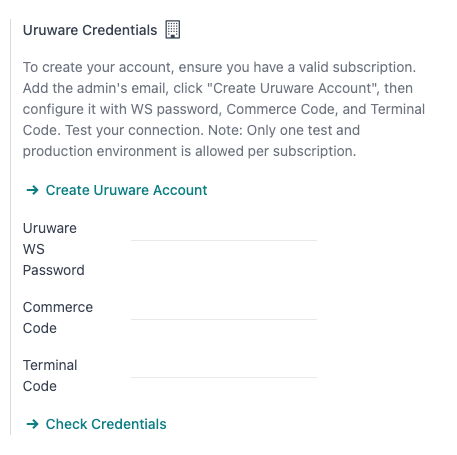
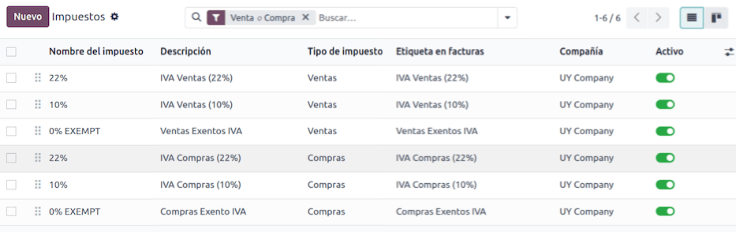
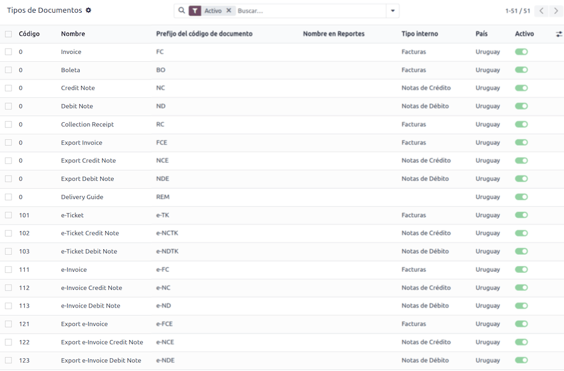

=======
Uruguay
=======

.. |DGI| replace:: :abbr:`DGI (Dirección General Impositiva)`
.. |EDI| replace:: :abbr:`EDI (Electronic Data Interchange)`
.. |CAEs| replace:: :abbr:`CAEs (Constancia de Autorización de Emisión)`

.. _uruguay/intro:

Introduction
============

With the Uruguayan localization, you can generate electronic documents with its XML, fiscal folio,
electronic signature and connection to tax authority Dirección General Impositiva (DGI) through
Uruware.

The supported documents are:

- :guilabel:`e-Invoice`, :guilabel:`e-Invoice Credit Note`, :guilabel:`e-Invoice Debit Note`;
- :guilabel:`e-Ticket`, :guilabel:`e-Ticket Credit Note`, :guilabel:`e-Ticket Debit Note`;
- :guilabel:`Export e-Invoice`, :guilabel:`Export e-Invoice Credit Note`, :guilabel:`Export
  e-Invoice Debit Note`.

The localization requires an Uruware account, which enables users to generate electronic documents
within Odoo.

Glossary
--------

The following terms are used throughout the Uruguayan localization:

- **DGI**: *Dirección General Impositiva* is the government entity responsible for enforcing tax
  payments in Uruguay.
- **EDI**: *Electronic Data Interchange* refers to the sending of electronic documents.
- **Uruware**: is the third-party organization that facilitates the interchange of electronic
  documents between companies and the Uruguayan government.
- **CAE**: *Constancia de Autorización de Emisión* is a document requested from the tax authority's
  website to enable electronic invoice issuance.

Configuration
=============

Modules installation
--------------------

:ref:`Install <general/install>` the following modules to get all the features of the Uruguayan
localization:

.. list-table::
   :header-rows: 1
   :widths: 25 25 50

   * - Name
     - Technical name
     - Description
   * - :guilabel:`Uruguay - Accounting`
     - `l10n_uy`
     - The default :doc:`fiscal localization package <../fiscal_localizations>`. It adds accounting
       characteristics for the Uruguayan localization, which represent the minimum configuration
       required for a company to operate in Uruguay according to the guidelines set by the |DGI|.
       The module's installation automatically loads: chart of accounts, taxes, documents types, and
       tax supported types.
   * - :guilabel:`Uruguay Accounting EDI`
     - `l10n_uy_edi`
     - Includes all the technical and functional requirements to generate and validate
       :doc:`Electronics Documents <../accounting/customer_invoices/electronic_invoicing>`, based on
       the technical documentation published by the |DGI|. The authorized documents are :ref:`listed
       above <uruguay/intro>`.

.. note::
   Odoo automatically installs the base module **Uruguay - Accounting** when a database is installed
   with `Uruguay` selected as the country. However, to enable electronic invoicing, the **Uruguay
   Accounting EDI** (`l10n_uy_edi`) module needs to be manually :ref:`installed <general/install>`.

Company
-------

To configure your company information, open the **Settings** app, scroll down to the
:guilabel:`Companies` section, click :guilabel:`Update Info`, and configure the following:

- :guilabel:`Company Name`
- :guilabel:`Address`, including the :guilabel:`Street`, :guilabel:`City`, :guilabel:`State`,
  :guilabel:`ZIP`, and :guilabel:`Country`
- :guilabel:`Tax ID`: enter the identification number for the selected taxpayer type.
- :guilabel:`DGI Main Branch Code`: this is part of the XML when creating an electronic document. If
  this field is not set, all electronic documents will be rejected.

  To find the :guilabel:`DGI Main Branch Code`, follow these steps:

  #. From your `DGI account <https://servicios.dgi.gub.uy/serviciosenlinea>`_, go to
     :menuselection:`Servicios en línea DGI --> Registro único tributario --> Consulta de datos`.
  #. Select :menuselection:`Consulta de Datos Registrales --> Consulta de Datos de Entidades`.
  #. Open the generated PDF to get the *DGI Main Branch Code* from the :guilabel:`Domicilio Fiscal
     Número de Local` section.

After configuring the company in the database settings, navigate to :menuselection:`Contacts` and
search for your company to verify the following:

- the company type is set to :guilabel:`Company`.
- the :guilabel:`Identification Number` :guilabel:`Type` is :guilabel:`RUT / RUC`.

.. _l10n_uy/uruware-account:

Set up a Uruware account
------------------------

To set up a Uruware account, follow these steps:

#. Verify that you have a valid Odoo subscription.
#. Locate the Uruware credentials settings by navigating to the :menuselection:`Accounting -->
   Configuration --> Settings`.
#. Scroll down to the :guilabel:`Uruguayan Localization` section and select the environment
   (:guilabel:`Production` or :guilabel:`Testing`).
#. Click on :guilabel:`Create Uruware Account`.

Upon doing so, an email is sent to the address associated with your Odoo subscription with the
password to enter Uruware's portal and set up your account.

.. tip::
  - The email with the credentials is not immediate; it might take up to 48 hours for the account to
    be created.
  - The company's :guilabel:`Tax ID` needs to be set up to be able to create an Uruware account.
  - The password sent expires after 24 hours. In this case, reset it by using the *Forgot Password*
    link in Uruware's portal.

.. note::
   This action will create an account with Uruware with the following information:

   - Legal name (razón social)
   - RUT from the company
   - Username (the Odoo subscription email or `RUT`.odoo. For example: `213344556677.odoo`)
   - Odoo database link

   To ensure your account is created correctly, please add any missing information from above.

Once the account is created and you have received the email containing the credentials, configure
your accounts directly in the Uruware `testing portal <https://odootest.ucfe.com.uy/Gestion/>`_ or
`production portal <https://prod6109.ucfe.com.uy/Gestion/>`_:

Use the account credentials in the email to log in to the to the corresponding (`test
<https://odootest.ucfe.com.uy/Gestion/>`_ or `production <https://prod6109.ucfe.com.uy/Gestion/>`_)
portal.

In Uruware's portal, the following steps are needed to be able to issue invoices from Odoo:

#. Complete and correct the company's information.
#. Add your digital certificate.
#. Add your :abbr:`CAEs (Constancia de Autorización para Emisión)` for each document-type you plan
   to issue.
#. Configure the format of the PDF to be printed and sent to your customers.

.. important::
   Be sure to configure two accounts, one for testing and one for production. The certificate is
   needed in both environments, but :abbr:`CAEs (Constancia de Autorización para Emisión)` are only
   needed in production.

.. seealso::
   - `Odoo Tutorials: Uruguay Localization
     <https://www.odoo.com/slides/smart-tutorial-localizacion-de-uruguay-432>`_
   - `Odoo Help Forum: Uruguay
     <https://www.odoo.com/forum/help-1?search=l10n_uy>`_

Electronic invoice data
-----------------------

To configure the electronic invoice data, an environment and credentials need to be configured. To
do so, navigate to :menuselection:`Accounting --> Configuration --> Settings` and scroll down to the
:guilabel:`Uruguayan Localization` section.

First, select the :guilabel:`UCFE Web Services` environment:

- :guilabel:`Production`: for production databases. In this mode, electronic documents are sent to
  |DGI| through Uruware for their validation.
- :guilabel:`Testing`: for test databases. In this mode, the direct connection flows can be tested,
  with the files sent to the |DGI| testing environment through Uruware.
- :guilabel:`Demo`: files are created and accepted automatically in demo mode but are **not** sent
  to the |DGI|. For this reason, rejection errors will not appear in this mode. Every internal
  validation can be tested in demo mode. Avoid selecting this option in a production database.

.. note::
   Using :guilabel:`Demo` mode does not require a Uruware account.

Then, enter the :guilabel:`Uruware Data`:

- :guilabel:`Uruware WS Password`
- :guilabel:`Commerce Code`
- :guilabel:`Terminal Code`

.. note::
   This data can be obtained from the Uruware portal after configuring the :ref:`Uruware account
   <l10n_uy/uruware-account>`.

   To get the :guilabel:`Uruware WS Password`, go to :menuselection:`Configuration --> Company -->
   Edit` and look for the :guilabel:`Validators and Additional Information` tab to find
   :guilabel:`WS Password`.

   To get the :guilabel:`Commerce Code`, go to :menuselection:`Configuration --> Branches`.

   To get the :guilabel:`Terminal Code`, go to :menuselection:`Configuration --> Issuing Points`.

Master data
-----------

Chart of accounts
~~~~~~~~~~~~~~~~~

The :doc:`chart of accounts <../accounting/get_started/chart_of_accounts>` is installed by default
as part of the set of data included in the localization module, the accounts are mapped
automatically in taxes, default accounts payable, and default accounts receivable.

Accounts can be added or deleted according to the company's needs.

.. seealso::
   :doc:`../accounting/get_started/chart_of_accounts`

Contacts
~~~~~~~~

To create a contact, navigate to :menuselection:`Contacts app` and select :guilabel:`New`. Then
enter the following information:

- :guilabel:`Company Name`
- :guilabel:`Address`:

  - :guilabel:`Street`: required to confirm an electronic invoice.
  - :guilabel:`City`
  - :guilabel:`State`
  - :guilabel:`ZIP`
  - :guilabel:`Country`: required to confirm an electronic invoice.

- :guilabel:`Identification Number`:

  - :guilabel:`Type`: select a identification type.
  - :guilabel:`Number`: required to confirm an electronic invoice.

Taxes
~~~~~

As part of the Uruguay localization module, taxes are automatically created with its configuration
and related financial accounts.

Document types
~~~~~~~~~~~~~~

Some accounting transactions, like *customer invoices* and *vendor bills* are classified by document
types. These are defined by the government fiscal authorities, in this case by the |DGI|.

Each document type can have a unique sequence per journal where it is assigned. The data is created
automatically when the localization module is installed, and the information required for the
document types is included by default.

To review the document types included in the localization, navigate to :menuselection:`Accounting
--> Configuration --> Document Types`.

.. note::
   In Uruguay, |CAEs| **must** be uploaded in Uruware. Sequences (and PDFs) are received in Odoo
   from Uruware, based on their |CAEs|. |CAEs| are **only** used in production. When testing, only a
   range of sequences used in Uruware need to be set.

Sales journals
~~~~~~~~~~~~~~

To generate and confirm an electronic document that will be validated by |DGI|, the sales journal
needs to be configured with the following:

- :guilabel:`Invoicing Type`: by default :guilabel:`Electronic` option is set. This is necessary to
  send electronic documents via web service to the Uruguayan government through Uruware. The other
  option, :guilabel:`Manual`, is for open invoices previously stamped in another system, for
  example, in the |DGI|.
- :guilabel:`Use Documents?`: Activate this option if this journal will use documents from the list
  of document types in Odoo.

Workflows
=========

Once you have configured your database, you can create your documents.

Sales documents
---------------

Customer invoices
~~~~~~~~~~~~~~~~~

:doc:`Customer invoices <../accounting/customer_invoices>` are electronic documents that, when
validated, are sent to |DGI| via Uruware. These documents can be created from your sales order or
manually. They must contain the following data:

- :guilabel:`Customer`: type the customer's information.
- :guilabel:`Due date`: to compute if the invoice is due now or later (*contado* or *crédito*,
  respectively).
- :guilabel:`Journal`: select the electronic sales journal.
- :guilabel:`Document Type`: document type in this format, for example, `(111) e-Invoice`.
- :guilabel:`Products`: specify the product(s) with the correct taxes.

.. note::
   Every document type has a specific credit note and debit note (e.g., the document type
   :guilabel:`(111) e-Invoice` has an :guilabel:`(112) e-Invoice Credit Note`).

Customer credit note
~~~~~~~~~~~~~~~~~~~~

The :doc:`Customer credit note <../accounting/customer_invoices/credit_notes>` is an electronic
document that, when validated, is sent to |DGI| via Uruware. It is necessary to have a validated
(posted) invoice to register a credit note. On the invoice, click the :guilabel:`Credit note` button
to access the :guilabel:`Create credit note` form, then complete the following information:

- :guilabel:`Reason`: type the reason for the credit note.
- :guilabel:`Journal`: select the journal that has to be electronic and has the :guilabel:`Use
  Documents?` option active.
- :guilabel:`Document Type`: select the credit note document type.
- :guilabel:`Reversal Date`: type the date.

Customer debit note
~~~~~~~~~~~~~~~~~~~

The :doc:`Customer debit note <../accounting/customer_invoices/credit_notes>` is an electronic
document that, when validated, is sent to |DGI| via Uruware. It is necessary to have a validated
(posted) invoice to register a debit note. On the invoice, click the :icon:`fa-cog`
(:guilabel:`action menu`) icon, select the :guilabel:`Debit note` option to access the
:guilabel:`Create credit note` form, then complete the following information:

- :guilabel:`Reason`: Type the reason for the debit note.
- :guilabel:`Journal`: Select the journal that has to be electronic and has the :guilabel:`Use
  Documents?` option active.
- :guilabel:`Copy lines`: Tick the checkbox to copy the invoice lines to the debit note.
- :guilabel:`Debit note date`: Type the date.

.. note::
   Confirm the invoice to create it with an internal reference. To send the document to |DGI| via
   Uruware, click on :guilabel:`Send and Print` and select the checkbox :guilabel:`Create CFE`. The
   legal document sequence (number) is brought from Uruware once the document has been processed.
   Make sure you have |CAEs| available in Uruware.

.. note::
   The PDF of the validated document is pulled from Uruware following the specification by the
   Uruguayan government (DGI).

Addendas and disclosures
========================

*Addendas* and *disclosures* are additional notes and comments added to an electronic document that
can be mandatory or optional. To create a new addenda, go to :menuselection:`Accounting -->
Configuration --> Addendas and disclosures` and click :guilabel:`New`.

Enter the following information:

- :guilabel:`Name`: name of the addenda or mandatory disclosure.
- :guilabel:`Type`: Select the type of remark, this will add it to the specific section in the XML.
- :guilabel:`Is legend`: Select this box if the text is a mandatory disclosure, leave it blank if it
  is additional information.
- :guilabel:`Content`: Add the complete text of the addenda or disclosure.

Leyenda and additional information in product
---------------------------------------------

To add a *leyenda* or additional information to the product and XML, it is necessary to add the
preconfigured addenda and disclosure to the product in the invoice line. Add the *leyenda* in the
:guilabel:`Disclosure` field of the product specified in the line.

Leyenda and additional information
----------------------------------

To add a *leyenda* or additional information to the electronic invoice and XML, access the invoice,
go to the :guilabel:`Other Info` tab, and select the desired addenda in the :guilabel:`Addenda and
Disclosure` field. The addenda and disclosures added here will appear in the XML and visibly in the
PDF document.

This applies to the following types of *addendas*:

- Document
- Issuer
- Receiver
- Addendas

.. note::
   To add a temporary note to the electronic document, use the :guilabel:`Terms and Conditions`
   field. This information will be sent in the addenda of the invoice, but it won't be saved for
   future documents.
