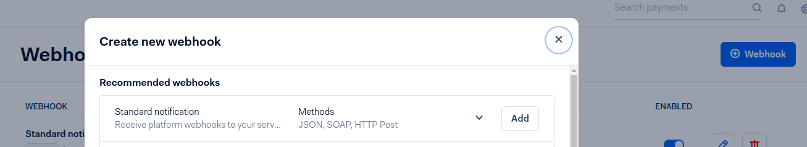
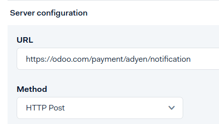
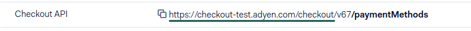

:show-content:

=====
Adyen
=====

.. toctree::
   :titlesonly:

   adyen/install_pay_by_link_patch

`Adyen <https://www.adyen.com/>`_ is a Dutch company that offers several online payment
possibilities.

.. seealso::
   - :doc:`adyen/install_pay_by_link_patch`
   - :ref:`payment_acquirers/add_new`
   - :doc:`../payment_acquirers`

Configuration
=============

Credentials tab
---------------

Odoo needs your **API Credentials** to connect with your Adyen account, which comprise:

- **Merchant Account**: The code of the merchant account to use with Adyen.
- :ref:`API Key <adyen/api_key>`: The API key of the webservice user.
- :ref:`HMAC Key <adyen/hmac_key>`: The HMAC key of the webhook.
- :ref:`Checkout API URL <adyen/urls>`: The base URL for the Checkout API endpoints.

You can copy your credentials from your Adyen account, and paste them in the related fields under
the **Credentials** tab.

.. important::
   If you are trying Adyen as a test, with a *test account*, change the **State** to *Test Mode*. We
   recommend doing this on a test Odoo database, rather than on your main database.

.. _adyen/api_key:

API Key
~~~~~~~

In order to retrieve the API Key, log into your Adyen account, go to
:menuselection:`Developers --> API Credentials`.
- If you already have an API user, open it.
- If you don't have an API user yet, click on **Create new credential**.
Go to :menuselection:`Authentication` and get or generate your **API Key**. Be careful to copy your
API key as you'll not be allowed to get it later without generating a new one.

.. _adyen/hmac_key:

HMAC key
~~~~~~~~

In order to retrieve the HMAC Key, you'll need to configure a `Standard Notification` webhook. For
this, log into your Adyen account then go to :menuselection:`Developers --> Webhooks --> Add webhook
--> Add Standard notification`.

There, in :menuselection:`General --> Server Configuration --> URL`, enter your server address
followed by `/payment/adyen/notification` and in :menuselection:`General --> Server Configuration
--> Method`, select `HTTP Post`.

Then continue in :menuselection:`Security --> HMAC Key --> Generate new HMAC key`. Be
careful to copy it as you'll not be allowed to get it later without generating a new one.

You have to save the webhook to finalize its creation.

.. _adyen/urls:

URLs
~~~~

To retrieve the URLs, log into your Adyen account, go to :menuselection:`Developers --> API URLs`.
Pick one of the URLs listed next to **Checkout API** as your **Checkout API URL**.

