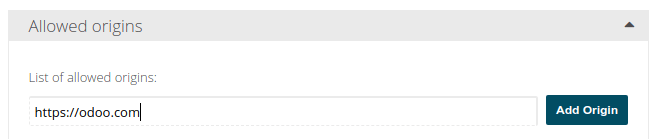
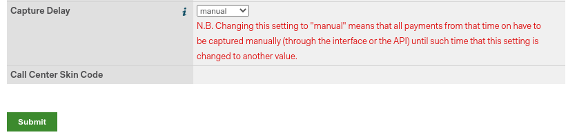

=====
Adyen
=====

`Adyen <https://www.adyen.com/>`_ is a Dutch-based company that offers several online payment
possibilities.

Configuration
=============

.. seealso::
   - :ref:`payment_acquirers/add_new`

Credentials tab
---------------

Odoo needs your **API Credentials** to connect with your Adyen account, which comprise:

- **Merchant Account**: The code of the merchant account to use with Adyen.
- :ref:`API Key <adyen/api_and_client_keys>`: The API key of the webservice user.
- :ref:`Client Key <adyen/api_and_client_keys>`: The client key of the webservice user.
- :ref:`HMAC Key <adyen/hmac_key>`: The HMAC key of the webhook.
- :ref:`Checkout API URL <adyen/urls>`: The base URL for the Checkout API endpoints.
- :ref:`Recurring API URL <adyen/urls>`: The base URL for the Recurring API endpoints.

You can copy your credentials from your Adyen account, and paste them in the related fields under
the **Credentials** tab.

.. important::
   If you are trying Adyen as a test, with a *test account*, change the **State** to *Test Mode*. We
   recommend doing this on a test Odoo database, rather than on your main database.

.. _adyen/api_and_client_keys:

API Key and Client Key
~~~~~~~~~~~~~~~~~~~~~~

In order to retrieve the API Key and the Client Key, log into your Adyen account, go to
:menuselection:`Developers --> API Credentials`.
- If you already have an API user, open it.
- If you don't have an API user yet, click on **Create new credential**.
Go to :menuselection:`Authentication` and get or generate your **API Key** and **Client Key**. Be
careful to copy your API key as you'll not be allowed to get it later without generating a new one.

This is also the place where you'll :ref:`allow payments to be made from your website
<adyen/allowed_origins>`.

.. _adyen/hmac_key:

HMAC key
~~~~~~~~

In order to retrieve the HMAC Key, you'll need to configure a `Standard Notification` webhook. For
this, log into your Adyen account then go to :menuselection:`Developers --> Webhooks --> Add webhook
--> Add Standard notification`.

.. image:: media/adyen_add_webhook.png
   :align: center
   :alt: Configure a webhook.

There, in :menuselection:`Transport --> URL`, enter your server address followed by
`/payment/adyen/notification`.

.. image:: media/adyen_webhook_url.png
   :align: center
   :alt: Enter the notification URL.

Then continue in :menuselection:`Additional Settings --> HMAC Key --> Generate new HMAC key`. Be
careful to copy it as you'll not be allowed to get it later without generating a new one.

You have to save the webhook to finalize its creation.

.. _adyen/urls:

URLs
~~~~

To retrieve the URLs, log into your Adyen account, go to :menuselection:`Developers --> API URLs`.
Pick one of the URLs listed next to **Recurring** as your **Recurring API URL** and one of the URLs
listed next to **Checkout API** as your **Checkout API URL**.

.. image:: media/adyen_api_urls.png
   :align: center
   :alt: Get the links for the different API.

Adyen Account
-------------

.. _adyen/allowed_origins:

Allow payments from a specific origin
~~~~~~~~~~~~~~~~~~~~~~~~~~~~~~~~~~~~~

To allow payment originated from your website, follow the steps in :ref:`adyen/api_and_client_keys`
to navigate to your API user and go to :menuselection:`Allowed Origins`, then add the URLs from
where payments will be made (the URLs of the servers hosting your Odoo instances).

Place a hold on a card
----------------------

Adyen allows you to capture an amount manually instead of having an immediate capture.

To set it up, enable the **Capture Amount Manually** option on Odoo, as explained in the
:ref:`payment acquirers documentation <payment_acquirers/capture_amount>`.

Then, open your Adyen Merchant Account, go to :menuselection:`Account --> Settings`, and set the
**Capture Delay** to **manual**.

.. caution::
   - If you configure Odoo to capture amounts manually, make sure to set the **Capture Delay** to
     **manual** on Adyen. Otherwise, the transaction will be blocked in the authorized state in
     Odoo.
   - Odoo doesn't support the partial capture yet. Be aware that if you make a partial capture from
     Adyen's interface, Odoo will manage it as if it was a full capture.

.. note::
   After **7 days**, if the transaction hasn't been captured yet, the customer has the right to
   **revoke** it.

.. seealso::
   - :doc:`../payment_acquirers`
