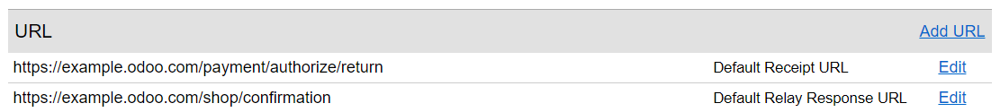
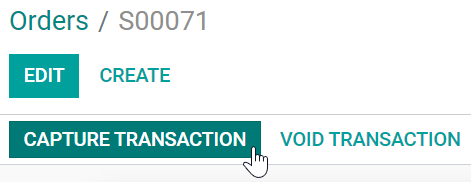
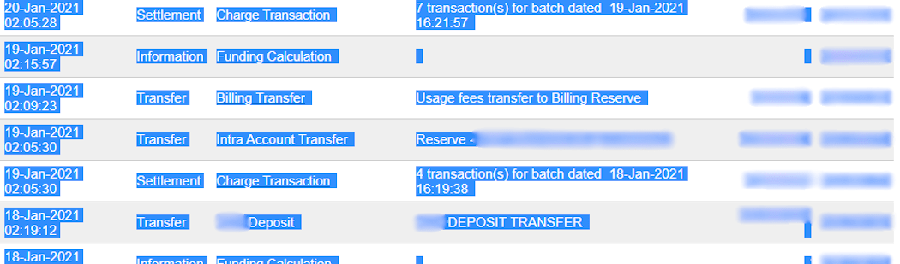

=============
Authorize.Net
=============

`Authorize.Net <https://www.authorize.net>`_ is a United States-based online payment solution
provider allowing businesses to accept **credit cards**. Among others, it offers the ability to
process customer payments after delivery.

Authorize.Net account
=====================

First, choose a plan and `create an Authorize.Net account
<https://www.authorize.net/sign-up/pricing.html>`_.

Odoo needs the Authorize.Net account's **API credentials and keys** to connect to it, which
comprises the:

- API login ID,
- Transaction key, and
- Signature key.

To retrieve them, log in to Authorize.Net and go to :menuselection:`Account --> Security Settings:
API Credentials & Keys`. While the :guilabel:`API Login ID` is displayed, both keys need to be
generated.

To do so, select :guilabel:`New Transaction Key` and click :guilabel:`Submit`. Copy the key and
store it somewhere secure as it will not be displayed afterward. Repeat the same process for the
:guilabel:`Signature Key`.

.. image:: authorize/authorize-api-keys.png
   :alt: Generating the transaction and signature keys on Authorize.Net

.. seealso::
   `Authorize.Net Getting Started Guide
   <https://support.authorize.net/knowledgebase/Knowledgearticle/?code=000002939>`_

Configuration
=============

.. seealso::
   Refer to the :doc:`payment acquirers documentation <../payment_acquirers>` for more information
   about general configuration options.

To activate Authorize.Net as a payment acquirer in Odoo, go to :menuselection:`Accounting -->
Configuration --> Payment Acquirers`. Find :guilabel:`Authorize.Net`, click the :guilabel:`Activate`
button, and change the :guilabel:`State` to :guilabel:`Enabled`.

Credentials
-----------

Fill in the :guilabel:`API Login Id`, :guilabel:`API Transaction Key`, and :guilabel:`API Signature
Key` fields with the values displayed or generated on Authorize.Net's :guilabel:`API Credentials &
Keys` page, and :guilabel:`Save`.

.. note::
   An :guilabel:`API Client Key` is only necessary if the :guilabel:`Payment from Odoo` option is
   selected as :ref:`Payment Flow <payment_acquirers/payment_flow>`.

.. important::
   To test Authorize.Net with a **sandbox account**, first change the :guilabel:`State` field to
   :guilabel:`Test Mode`. It is recommended to do so on a test Odoo database, rather than on a
   production database.

   .. note::
      If the :guilabel:`Test Mode` is used with the credentials of a non-sandbox account, it will
      result in the following error: *The merchant login ID or password is invalid or the account is
      inactive*.

Payment flow
------------

It is possible either to redirect users to Authorize.Net's portal to authenticate the payment or to
keep users on the current page and authenticate the payment from Odoo.

To configure the payment flow, go to :menuselection:`Accounting --> Configuration --> Payment
Acquirers --> Authorize.Net --> Configuration tab`. Under :guilabel:`Payment Flow`, select
:guilabel:`Redirection to the acquirer website` or :guilabel:`Payment from Odoo` and
:guilabel:`Save`.

Payment from Odoo
~~~~~~~~~~~~~~~~~

If :guilabel:`Payment from Odoo` is selected, an :guilabel:`API Client Key` is needed. To generate
one, go to :menuselection:`Accounting --> Configuration --> Payment Acquirers --> Authorize.Net -->
Credentials tab`. Click :guilabel:`Generate Client Key` to automatically fill in the :guilabel:`API
Client Key` field and :guilabel:`Save`.

Redirection to the acquirer website
~~~~~~~~~~~~~~~~~~~~~~~~~~~~~~~~~~~

If :guilabel:`Redirection to the acquirer website` is selected, a :guilabel:`Default Receipt URL`
and :guilabel:`Default Relay Response URL` should be added to the Authorize.Net account.

To do so, log in to Authorize.Net, and go to :menuselection:`Account --> Transaction Format
Settings: Response/Receipt URLs`. Click :guilabel:`Add URL`, enter the URL following the format
below, and click :guilabel:`Submit`:

- :guilabel:`Default Receipt URL`: add `/payment/authorize/return` after the main website URL.

  .. example::
     `https://example.odoo.com/payment/authorize/return`

- :guilabel:`Default Relay Response URL`: add `/shop/confirmation` after the main website URL.

  .. example::
     `https://example.odoo.com/shop/confirmation`

.. note::
   Failing to complete this step results in the following error: *The referrer, relay response or
   receipt link URL is invalid*.

Capture payments after delivery
-------------------------------

To reserve funds for 30 days on the customer's card without charging them yet, go to
:menuselection:`Accounting --> Configuration --> Payment Acquirers --> Authorize.Net -->
Configuration tab`, enable :guilabel:`Capture Amount Manually`, and :guilabel:`Save`.

To capture the payment, go to the related sales order and click :guilabel:`Capture Transaction`. If
the order is canceled, click :guilabel:`Void Transaction` to unlock the funds from the customer's
card.

.. warning::
   After **30 days**, transactions are **voided automatically** by Authorize.Net.

Import an Authorize.Net statement
=================================

Export from Authorize.Net
-------------------------

.. _authorize-import-template:

.. admonition:: Template

   `Download the Excel import template <https://docs.google.com/spreadsheets/d/1CMVtBWLLVIrUpYA92paw-cL7-WdKLbaa/edit?usp=share_link&ouid=105295722917050444558&rtpof=true&sd=true>`_

To export a statement:

- Log in to Authorize.Net.
- Go to :menuselection:`Account --> Statements --> eCheck.Net Settlement Statement`.
- Define an export range using an *opening* and *closing* batch settlement. All transactions within
  the two batch settlements will be exported to Odoo.
- Select all transactions within the desired range, copy them, and paste them into the
  :guilabel:`Report 1 Download` sheet of the :ref:`Excel import template
  <authorize-import-template>`.

.. example::

   .. image:: authorize/authorize-settlement-batch.png
      :align: center
      :alt: Settlement batch of an Authorize.Net statement

   In this case, the first batch (01/01/2021) of the year belongs to the settlement of 12/31/2020,
   so the **opening** settlement is from 12/31/2020.

Once the data is in the :guilabel:`Report 1 Download` sheet:

- Go to the :guilabel:`Transaction Search` tab on Authorize.Net.
- Under the :guilabel:`Settlement Date` section, select the previously used range of batch
  settlement dates in the :guilabel:`From:` and :guilabel:`To:` fields and click :guilabel:`Search`.
- When the list has been generated, click :guilabel:`Download to File`.
- In the pop-up window, select :guilabel:`Expanded Fields with CAVV Response/Comma Separated`,
  enable :guilabel:`Include Column Headings`, and click :guilabel:`Submit`.
- Open the text file, select :guilabel:`All`, copy the data, and paste it into the :guilabel:`Report
  2 Download` sheet of the :ref:`Excel import template <authorize-import-template>`.
- Transit lines are automatically filled in and updated in the :guilabel:`transit for report 1` and
  :guilabel:`transit for report 2` sheets of the :ref:`Excel import template
  <authorize-import-template>`. Make sure all entries are present, and **if not**, copy the formula
  from previously filled-in lines of the :guilabel:`transit for report 1` or :guilabel:`2` sheets
  and paste it into the empty lines.

.. important::
   To get the correct closing balance, **do not remove** any line from the Excel sheets.

Import into Odoo
----------------

To import the data into Odoo:

- Open the :ref:`Excel import template <authorize-import-template>`.
- Copy the data from the :guilabel:`transit for report 2` sheet and use *paste special* to only
  paste the values in the :guilabel:`Odoo Import to CSV` sheet.
- Look for *blue* cells in the :guilabel:`Odoo Import to CSV` sheet. These are chargeback entries
  without any reference number. As they cannot be imported as such, go to
  :menuselection:`Authorize.Net --> Account --> Statements --> eCheck.Net Settlement Statement`.
- Look for :guilabel:`Charge Transaction/Chargeback`, and click it.
- Copy the invoice description, paste it into the :guilabel:`Label` cell of the :guilabel:`Odoo
  Import to CSV` sheet, and add `Chargeback /` before the description.
- If there are multiple invoices, add a line into the :ref:`Excel import template
  <authorize-import-template>` for each invoice and copy/paste the description into each respective
  :guilabel:`Label` line.

.. note::
   For **combined chargeback/returns** in the payouts, create a new line in the :ref:`Excel import
   template <authorize-import-template>` for each invoice.

.. example::

   .. image:: authorize/authorize-chargeback-desc.png
      :alt: Chargeback description

- Next, delete *zero transaction* and *void transaction* line items, and change the format
  of the :guilabel:`Amount` column in the :guilabel:`Odoo Import to CSV` sheet to *Number*.
- Go back to :menuselection:`eCheck.Net Settlement Statement --> Search for a Transaction` and
  search again for the previously used batch settlements dates.
- Verify that the batch settlement dates on eCheck.Net match the related payments' dates found in
  the :guilabel:`Date` column of the :guilabel:`Odoo Import to CSV`.
- If it does not match, replace the date with the one from eCheck.Net. Sort the column by *date*,
  and make sure the format is `MM/DD/YYYY`.
- Copy the data - column headings included - from the :guilabel:`Odoo Import to CSV` sheet, paste
  it into a new Excel file, and save it using the CSV format.
- Open the Accounting app, go to :menuselection:`Configuration --> Journals`, tick the
  :guilabel:`Authorize.Net` box, and click :menuselection:`Favorites --> Import records --> Load
  file`. Select the CSV file and upload it into Odoo.

.. tip::
   List of `eCheck.Net return codes <https://support.authorize.net/knowledgebase/Knowledgearticle/?code=000001293>`_

.. seealso::
   - `Authorize.Net: Getting Started Guide
     <https://support.authorize.net/s/article/Authorize-Net-Getting-Started-Guide>`_
   - :doc:`../payment_acquirers`
   - :doc:`../../websites/ecommerce/shopper_experience/payment_acquirer`
