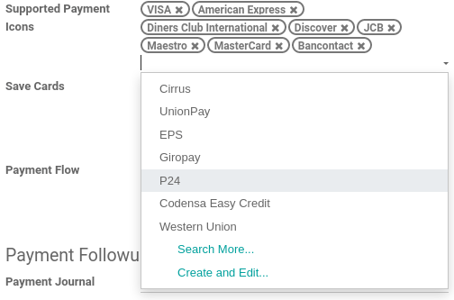

======
Stripe
======

`Stripe <https://stripe.com/>`_ is a United States-based online payment solution provider, allowing
businesses to accept **credit cards** and other payment methods.

Link your Stripe Account with Odoo
==================================

.. seealso::
   - :ref:`payment_acquirers/add_new`

The method to acquire your credentials depends on your hosting type:

.. tabs::
   .. group-tab:: Odoo Online

      #. Go to the **eCommerce** or the **Sales** app and click on the *Activate Stripe* or the *Set
         payments* button on the onboarding banner.
      #. Fill in the requested information and submit the form.
      #. Confirm your email address when Stripe sends you a confirmation email.
      #. At the end of the process, you are redirected to Odoo. If you submitted all the requested
         information, you are all set and your payment acquirer is enabled.
      #. Your can continue to :ref:`stripe/local-payment-methods`.

      .. tip::
         To use your own API keys, :ref:`activate the Developer mode <developer-mode>` and
         :ref:`enable Stripe manually <payment_acquirers/add_new>`. You can then :ref:`Fill in your
         credentials <stripe/api_keys>`, :ref:`generate a webhook <stripe/webhook>` and enable the
         payment acquirer.

   .. group-tab:: Odoo.sh or On-premise

      #. Go to the **eCommerce** or the **Sales** app and click on the *Activate Stripe* or the *Set
         payments* button on the onboarding banner.
      #. Fill in the requested information and submit the form.
      #. Confirm your email address when Stripe sends you a confirmation email.
      #. At the end of the process, you are redirected to the payment acquirer **Stripe** on Odoo.
      #. :ref:`Fill in your credentials <stripe/api_keys>`.
      #. :ref:`Generate a webhook <stripe/webhook>`.
      #. Enable the payment acquirer.
      #. You are all set and can continue to :ref:`stripe/local-payment-methods`.

.. tip::
   To connect your Stripe account after the onboarding is already completed, go to
   :menuselection:`Accounting --> Configuration --> Payment Acquirers --> Stripe` and click on the
   *Connect Stripe* button.

.. important::
   If you are testing Stripe (in **test mode**), change the **State** to *Test Mode*. We recommend
   doing this on a test Odoo database rather than on your main database.

.. _stripe/api_keys:

Fill in your credentials
------------------------

In case your **API Credentials** are required to connect with your Stripe account, these are the
credentials that must be completed:

- :ref:`Publishable Key <stripe/api_keys>`: The key solely used to identify the account with Stripe.
- :ref:`Secret Key <stripe/api_keys>`: The key to sign the merchant account with Stripe.
- :ref:`Webhook Signing Secret <stripe/webhook>`: When you enable your webhook on your Stripe
  account, this signing secret must be set to authenticate the messages sent from Stripe to Odoo.

To retrieve the publishable and secret keys, follow this `link to your API keys
<https://dashboard.stripe.com/account/apikeys>`_, or log into your Stripe dashboard and go to
:menuselection:`Developers --> API Keys --> Standard Keys`.

.. _stripe/webhook:

Generate a webhook
------------------

In case your **Webhook Signing Secret** is required to connect with your Stripe account, you can
create a webhook either automatically or manually.

.. tabs::
   .. tab:: Manage the webhook automatically

      Make sure your :ref:`Publishable and Secret keys <stripe/api_keys>` are filled in, then click
      on the :guilabel:`Generate your Webhook` button.

      .. tip::
         To update the webhook, click once again on the :guilabel:`Generate your Webhook` button.

   .. tab:: Manage the webhook manually

      Visit the `webhooks page on Stripe <https://dashboard.stripe.com/webhooks>`_, or log into your
      Stripe dashboard and go to :menuselection:`Developers --> Webhooks`. Then, click on
      :guilabel:`Add endpoint` in your :guilabel:`Hosted endpoints` and insert the following data
      into the pop-up form:

      - | In the :guilabel:`Endpoint URL`, enter your Odoo database's URL followed by
        | `/payment/stripe/webhook`.
        | For example: `https://yourcompany.odoo.com/payment/stripe/webhook`
      - At the bottom of the form, you can select events to listen to. Click on :guilabel:`Select
        events`. Then:

        - In the :guilabel:`Payment Intent` section, select
          :guilabel:`payment_intent.amount_capturable_updated` and
          :guilabel:`payment_intent.succeeded`.
        - In the :guilabel:`Setup Intent` section, select :guilabel:`setup_intent.succeeded`.

        .. note::
           It is possible to select other events, but they are currently not processed by Odoo.

      When you click on :guilabel:`Add endpoint`, your Webhook is configured. Click on
      :guilabel:`reveal` to display your signing secret.

      .. tip::
         To update an existing webhook, click on it. Then, click on the three dots at the right side
         of the **Webhook URL** and on :guilabel:`Update details`.

.. _stripe/local-payment-methods:

Enable local payment methods
============================

Local payment methods are payment methods that are only available for certain merchants and
customers countries and currencies.

Odoo supports the following local payment methods:

- Bancontact
- EPS
- giropay
- iDEAL
- Przelewy24 (P24)

To enable specific local payment methods with Stripe, list them as supported payment icons. To do
so, go to :menuselection:`Payment Acquirers --> Stripe --> Configuration` and add the desired
payment methods in the **Supported Payment Icons** field. If the desired payment method is already
listed, you don't have anything to do. If a payment icon record doesn't exist in the database, its
related payment method is considered enabled with Stripe.

.. seealso::
   - :doc:`../payment_acquirers`
