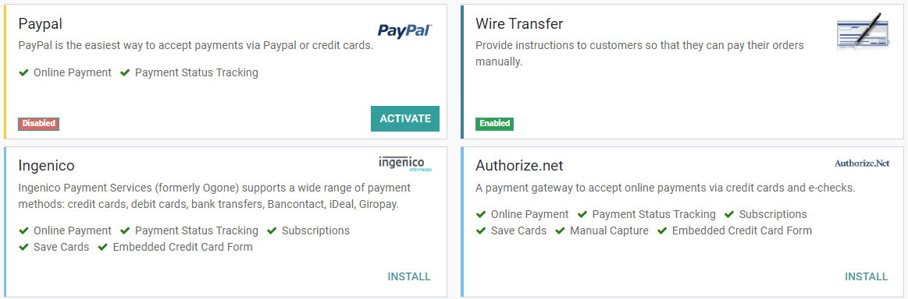

:show-content:

=================================================
Payment providers (credit cards, online payments)
=================================================

.. toctree::
   :titlesonly:

   payment_providers/wire_transfer
   payment_providers/adyen
   payment_providers/alipay
   payment_providers/amazon_payment_services
   payment_providers/asiapay
   payment_providers/authorize
   payment_providers/buckaroo
   payment_providers/flutterwave
   payment_providers/mercado_pago
   payment_providers/mollie
   payment_providers/ogone
   payment_providers/paypal
   payment_providers/razorpay
   payment_providers/sips
   payment_providers/stripe

Odoo embeds several **payment providers** that allow your customers to pay on their *Customer
Portals* or your *eCommerce website*. They can pay sales orders, invoices, or subscriptions with
recurring payments with their favorite payment methods such as **Credit Cards**.

Offering several payment methods increases the chances of getting paid in time, or even immediately,
as you make it more convenient for your customers to pay with the payment method they prefer and
trust.

.. image:: payment_providers/online-payment.png
   :align: center
   :alt: Pay online in the customer portal and select which payment provider to use.

.. note::
   Odoo apps delegate the handling of sensitive information to the certified payment provider so
   that you don't ever have to worry about PCI compliance.

   This means that no sensitive information (such as credit card numbers) is stored on Odoo servers
   or Odoo databases hosted elsewhere. Instead, Odoo apps use a unique reference number to the data
   stored safely in the payment providers' systems.

.. _payment_providers/supported_providers:

Supported payment providers
===========================

From an accounting perspective, we can distinguish two types of payment providers: the payment
providers that are third-party services and require you to follow another accounting workflow, and
the payments that go directly on the bank account and follow the usual reconciliation workflow.

.. _payment_providers/online_providers:

Online payment providers
------------------------

.. list-table::
   :header-rows: 1
   :stub-columns: 1
   :widths: auto

   * -
     - Payment flow
     - :ref:`Tokenization <payment_providers/features/tokenization>`
     - :ref:`Manual capture <payment_providers/features/manual_capture>`
     - :ref:`Refunds <payment_providers/features/refund>`
     - :ref:`Express checkout <payment_providers/features/express_checkout>`
   * - :doc:`Adyen <payment_providers/adyen>`
     - Payment from Odoo
     - |V|
     - Full only
     - Full and partial
     -
   * - :doc:`Amazon Payment Services <payment_providers/amazon_payment_services>`
     - Payment from the provider website
     -
     -
     -
     -
   * - :doc:`AsiaPay <payment_providers/asiapay>`
     - Payment from the provider website
     -
     -
     -
     -
   * - :doc:`Authorize.Net <payment_providers/authorize>`
     - Payment from Odoo
     - |V|
     - Full only
     - Full only
     -
   * - :doc:`Buckaroo <payment_providers/buckaroo>`
     - Payment from the provider website
     -
     -
     -
     -
   * - :doc:`Flutterwave <payment_providers/flutterwave>`
     - Payment from the provider website
     - |V|
     -
     -
     -
   * - :doc:`Mercado Pago <payment_providers/mercado_pago>`
     - Payment from the provider website
     -
     -
     -
     -
   * - :doc:`Mollie <payment_providers/mollie>`
     - Payment from the provider website
     -
     -
     -
     -
   * - :doc:`PayPal <payment_providers/paypal>`
     - Payment from the provider website
     -
     -
     -
     -
   * - :doc:`Razorpay <payment_providers/razorpay>`
     - Payment from the provider website
     -
     - Full only
     - Full and partial
     -
   * - :doc:`SIPS <payment_providers/sips>`
     - Payment from the provider website
     -
     -
     -
     -
   * - :doc:`Stripe <payment_providers/stripe>`
     - Payment from the provider website
     - |V|
     - Full only
     - Full and partial
     - |V|

.. |V| replace:: ✔

.. note::
   Some of these online payment providers can also be added as :doc:`bank accounts
   <../finance/accounting/bank/setup/bank_accounts>`, but this is **not** the same process as adding
   them as payment providers. Payment providers allow customers to pay online, and bank accounts are
   added and configured on your Accounting app to do a bank reconciliation, which is an accounting
   control process.

.. _payment_providers/bank_payments:

Bank payments
-------------

- | :doc:`Wire Transfer <payment_providers/wire_transfer>`
  | When selected, Odoo displays your payment information with a payment reference. You have to
    approve the payment manually once you have received it on your bank account.
- | SEPA Direct Debit
  | Your customers can sign a SEPA Direct Debit mandate online and get their bank account charged
    directly. :doc:`Click here <../finance/accounting/receivables/customer_payments/batch_sdd>` for
    more information about this payment method.

.. _payment_providers/features:

Additional features
===================

Some payment providers support additional features for the payment flow. Refer to the :ref:`table
above <payment_providers/online_providers>` to check if your payment provider supports these
features.

.. _payment_providers/features/tokenization:

Tokenization
------------

If your payment provider supports this feature, customers can choose to save their card for later. A
**payment token** is created in Odoo and can be used as a payment method for subsequent payments
without having to enter the card details again. This is particularly useful for the eCommerce
conversion rate and for subscriptions that use recurring payments.

Enable this feature by navigating to the :guilabel:`Configuration` tab from your payment provider
and by ticking the :guilabel:`Allow Saving Payment Methods` checkbox.

.. note::
   You remain fully PCI-compliant when you enable this feature because Odoo does not store the card
   details directly. Instead, it creates a payment token that only holds a reference to the card
   details stored on the payment provider's server.

.. _payment_providers/features/manual_capture:

Manual capture
--------------

If your payment provider supports this feature, you can authorize and capture payments in two steps
instead of one. When you authorize a payment, the funds are reserved on the customer's payment
method but they are not immediately charged. The charge is only made when you manually capture the
payment later on. You can also void the authorization to release the reserved funds; this is
equivalent to a regular cancellation. Capturing payments manually can prove itself useful in many
situations:

  - Receive the payment confirmation and wait until the order is shipped to capture the payment.
  - Review and verify that orders are legitimate before the payment is completed and the fulfillment
    process starts.
  - Avoid potentially high processing fees for cancelled payments: payment providers will not charge
    you for voiding an authorization.
  - Hold a security deposit to return later, minus any deductions (e.g., after a damage).

Enable this feature by navigating to the :guilabel:`Configuration` tab from your payment provider
and by ticking the :guilabel:`Capture Amount Manually` checkbox.

To capture the payment after it was authorized, go to the related sales order or invoice and click
on the :guilabel:`CAPTURE TRANSACTION` button. To release the funds, click on the :guilabel:`VOID
TRANSACTION` button.

.. note::
   - Some payment providers support capturing only part of the authorized amount. The remaining
     amount can then be either captured or voided. These providers have the value **Full and
     partial** in the :ref:`table above <payment_providers/online_providers>`. The providers that
     only support capturing or voiding the full amount have the value **Full only**.
   - The funds are likely not reserved forever. After a certain time, they may be automatically
     released back to the customer's payment method. Refer to your payment provider's documentation
     for the exact reservation duration.
   - Odoo does not support this feature for all payment providers but some allow the manual capture
     from their website interface.

.. _payment_providers/features/refund:

Refunds
-------

If your payment provider supports this feature, you can refund payments directly from Odoo. It does
not need to be enabled first. To refund a customer payment, navigate to it and click on the
:guilabel:`REFUND` button.

.. note::
   - Some payment providers support refunding only part of the amount. The remaining amount can then
     optionally be refunded too. These providers have the value **Full and partial** in the
     :ref:`table above <payment_providers/online_providers>`. The providers that only support
     refunding the full amount have the value **Full only**.
   - Odoo does not support this feature for all payment providers but some allow to refund payments
     from their website interface.

.. _payment_providers/features/express_checkout:

Express checkout
----------------

If your payment provider supports this feature, customers can use the **Google Pay** and **Apple
Pay** buttons to pay their eCommerce orders in one click without filling the contact form. Using one
of those buttons, they'll go straight from the cart to the confirmation page, stopping by the
payment form of Google or Apple to validate the payment.

Enable this feature by navigating to the :guilabel:`Configuration` tab from your payment provider
and by ticking the :guilabel:`Allow Express Checkout` checkbox.

.. note::
   All prices shown in the express checkout payment form are always taxes included.

.. _payment_providers/configuration:

Configuration
=============

.. note::
   Each provider has its specific configuration flow, depending on :ref:`which feature is available
   <payment_providers/online_providers>`.

.. _payment_providers/add_new:

Add a new payment provider
--------------------------

To add a new payment provider and make it available to your customers, go to
:menuselection:`Accounting --> Configuration --> Payment Providers`, look for your payment provider,
install the related module, and activate it. To do so, open the payment provider and change its
state from *Disabled* to *Enabled*.

.. warning::
   We recommend using the *Test Mode* on a duplicated database or a test database. The Test Mode is
   meant to be used with your test/sandbox credentials, but Odoo generates Sales Orders and Invoices
   as usual. It isn't always possible to cancel an invoice, and this could create some issues with
   your invoices numbering if you were to test your payment providers on your main database.

.. _payment_providers/credentials_tab:

Credentials tab
~~~~~~~~~~~~~~~

If not done yet, go to the online payment provider website, create an account, and make sure to have
the credentials required for third-party use. Odoo requires these credentials to communicate with
the payment provider.

The form in this section is specific to the payment provider you are configuring. Please refer to
the related documentation for more information.

.. _payment_providers/configuration_tab:

Configuration tab
~~~~~~~~~~~~~~~~~

You can change the payment provider's front-end appearance by modifying its name under the
**Displayed as** field and which credit card icons to display under the **Supported Payment Icons**
field.

.. _payment_providers/countries:

Countries
*********

Restrict the use of the payment provider to a selection of countries. Leave this field blank to make
the payment provider available in all countries.

.. _payment_providers/journal:

Maximum Amount
**************

Restrict the maximum amount that can be paid with the selected provider. Leave this field to `0.00`
to make the payment provider available regardless of the payment amount.

.. important::
   This feature is not intended to work on pages which allow the customer to update the payment
   amount. For example, the **Donation** snippet of the Website app, and the **Checkout** page of
   the **eCommerce** app when paid delivery methods are enabled.

Payment journal
***************

The **Payment journal** selected for your payment provider must be a *Bank* journal.

.. _payment_providers/publish:

Publish on the website
----------------------

By default, payment providers are *unpublished*, which means that only internal users can see them
on the website. Your customers cannot make payments through an unpublished provider but they can
still manage :dfn:`(delete and assign to a subscription)` their already existing tokens linked to
such an provider. This conveniently allows you to test an provider while preventing making payments
and registering new tokens.

Click on the :guilabel:`Publish` button located in the top right corner of the provider's form to
publish it on the website and make it available to your customers. Click on the
:guilabel:`Unpublish` button to unpublish it.

.. tip::
   Payment providers are automatically published and unpublished when you respectively change their
   state to `enabled` and `test`.

.. _payment_providers/accounting:

Accounting perspective
======================

The **Bank Payments** that go directly to one of your bank accounts follow their usual
reconciliation workflows. However, payments recorded with **Online Payment Providers** require you
to consider how you want to record your payments' journal entries. We recommend you to ask your
accountant for advice.

You need to select a *Payment Journal* on your provider configuration to record the payments,
on a **Outstanding Account**. The Journal's **type** must be *Bank Journal*.

You can use a single journal for many payment methods. And for each payment method, you can either:

- Define an **Accounting Account** to separate these payments from another payment method.
- Leave blank to fallback on the default account, which you can see or change in the settings.

.. image:: payment_providers/bank_journal.png
   :align: center
   :alt: A bank journal in the "Incoming Payments Tab".

You can have the same bank account for the whole company, or for some journals only, or a single
payment method... What best suit your needs.

.. seealso::
   - :doc:`payment_providers/wire_transfer`
   - :doc:`payment_providers/adyen`
   - :doc:`payment_providers/alipay`
   - :doc:`payment_providers/authorize`
   - :doc:`payment_providers/asiapay`
   - :doc:`payment_providers/buckaroo`
   - :doc:`payment_providers/mercado_pago`
   - :doc:`payment_providers/mollie`
   - :doc:`payment_providers/ogone`
   - :doc:`payment_providers/paypal`
   - :doc:`payment_providers/razorpay`
   - :doc:`payment_providers/sips`
   - :doc:`payment_providers/stripe`
   - :doc:`../websites/ecommerce/shopper_experience/payment_providers`
