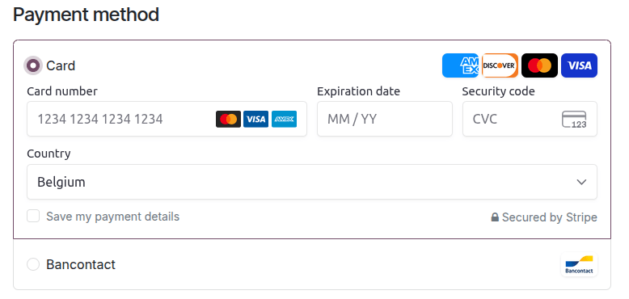

:show-content:

===============
Online payments
===============

.. toctree::
   :titlesonly:

   payment_providers/wire_transfer
   payment_providers/adyen
   payment_providers/alipay
   payment_providers/amazon_payment_services
   payment_providers/asiapay
   payment_providers/authorize
   payment_providers/buckaroo
   payment_providers/demo
   payment_providers/flutterwave
   payment_providers/mercado_pago
   payment_providers/mollie
   payment_providers/ogone
   payment_providers/paypal
   payment_providers/razorpay
   payment_providers/sips
   payment_providers/stripe
   payment_providers/xendit

Odoo embeds several **payment providers** that allow your customers to pay online, on their
*customer portals*, or on your *eCommerce website*. They can pay sales orders, invoices, or
subscriptions with recurring payments using their favorite payment methods, such as
**credit cards**.

Each payment provider is linked to a list of supported :ref:`payment methods
<payment_providers/payment_methods>` that can be (de)activated based on your needs.

.. note::
   Odoo apps delegate the handling of sensitive information to the certified payment provider so
   that you don't ever have to worry about PCI compliance. No sensitive information (such as credit
   card numbers) is stored on Odoo servers or Odoo databases hosted elsewhere. Instead, Odoo apps
   use a unique reference number for the data stored safely in the payment providers' systems.

.. _payment_providers/supported_providers:

Supported payment providers
===========================

To access the supported payment providers, go to :menuselection:`Accounting --> Configuration -->
Payment Providers`, :menuselection:`Website --> Configuration --> Payment Providers`, or
:menuselection:`Sales --> Configuration --> Payment Providers`.

.. _payment_providers/online_providers:

Online payment providers
------------------------

.. list-table::
   :header-rows: 1
   :stub-columns: 1
   :widths: auto

   * -
     - Payment flow from
     - :ref:`Tokenization <payment_providers/tokenization>`
     - :ref:`Manual capture <payment_providers/manual_capture>`
     - :ref:`Refunds <payment_providers/refunds>`
     - :ref:`Express checkout <payment_providers/express_checkout>`
   * - :doc:`Adyen <payment_providers/adyen>`
     - Odoo
     - |V|
     - Full and partial
     - Full and partial
     -
   * - :doc:`Amazon Payment Services <payment_providers/amazon_payment_services>`
     - The provider's website
     -
     -
     -
     -
   * - :doc:`AsiaPay <payment_providers/asiapay>`
     - The provider's website
     -
     -
     -
     -
   * - :doc:`Authorize.Net <payment_providers/authorize>`
     - Odoo
     - |V|
     - Full only
     - Full only
     -
   * - :doc:`Buckaroo <payment_providers/buckaroo>`
     - The provider's website
     -
     -
     -
     -
   * - :doc:`Flutterwave <payment_providers/flutterwave>`
     - The provider's website
     - |V|
     -
     -
     -
   * - :doc:`Mercado Pago <payment_providers/mercado_pago>`
     - The provider's website
     -
     -
     -
     -
   * - :doc:`Mollie <payment_providers/mollie>`
     - The provider's website
     -
     -
     -
     -
   * - :doc:`PayPal <payment_providers/paypal>`
     - The provider's website
     -
     -
     -
     -
   * - :doc:`Razorpay <payment_providers/razorpay>`
     - Odoo
     - |V|
     - Full only
     - Full and partial
     -
   * - :doc:`SIPS <payment_providers/sips>`
     - The provider's website
     -
     -
     -
     -
   * - :doc:`Stripe <payment_providers/stripe>`
     - Odoo
     - |V|
     - Full only
     - Full and partial
     - |V|
   * - :doc:`Xendit <payment_providers/xendit>`
     - The provider's website
     -
     -
     -
     -

.. |V| replace:: ✔

.. note::
   - Each provider has its own specific configuration flow, depending on which feature is
     available.
   - Some of these online payment providers can also be added as :doc:`bank accounts
     <../finance/accounting/bank>`, but this is **not** the same process as adding them as payment
     providers. Payment providers allow customers to pay online, and bank accounts are added and
     configured in the Accounting app to do a :doc:`bank reconciliation
     <accounting/bank/reconciliation>`.

.. tip::
   In addition to the regular payment providers that integrate with an API, such as Stripe, PayPal,
   or Adyen, Odoo bundles the :doc:`Demo payment provider <payment_providers/demo>`. This payment
   provider allows you to test business flows involving online payments. No credentials are required
   as the demo payments are dummy payments.

.. _payment_providers/bank_payments:

Bank payments
-------------

- | :doc:`Wire Transfer <payment_providers/wire_transfer>`
  | When selected, Odoo displays your payment information with a payment reference. You have to
    approve the payment manually once you have received it in your bank account.
- | :doc:`SEPA Direct Debit <../finance/accounting/payments/batch_sdd>`
  | Your customers can make a bank transfer to register a SEPA Direct Debit mandate and get their
    bank account charged directly.

.. _payment_providers/add_new:

Enable a payment provider
=========================

To add a new payment provider and make its related payment methods available to your customers,
proceed as follows:

#. Go to the payment provider's website, create an account, and make sure you have the API
   credentials requested for third-party use. These are necessary for Odoo to communicate with the
   payment provider.
#. In Odoo, navigate to the :guilabel:`Payment providers` by going to :menuselection:`Accounting -->
   Configuration --> Payment Providers`, :menuselection:`Website --> Configuration --> Payment
   Providers`, or :menuselection:`Sales --> Configuration --> Payment Providers`.
#. Select the provider and configure the :guilabel:`Credentials` tab.
#. Set the :guilabel:`State` field to :guilabel:`Enabled`.

.. note::
   - The fields available in the :guilabel:`Credentials` tab depend on the payment provider. Refer
     to the :ref:`related documentation <payment_providers/supported_providers>` for more
     information.
   - Once you have enabled the payment provider, it is automatically published on your website.
     If you wish to unpublish it, click the :guilabel:`Published` button. Customers cannot make
     payments through an unpublished provider, but they can still manage
     :dfn:`(delete and assign to a subscription)` their existing tokens linked to such a provider.

.. _payment_providers/test-mode:

Test mode
---------

If you wish to try the payment provider as a test, set the :guilabel:`State` field in the payment
provider form to :guilabel:`Test mode`, then enter your provider's test/sandbox credentials in the
:guilabel:`Credentials` tab.

.. note::
   By default, the payment provider remains **unpublished** in test mode so that it's not visible to
   visitors.

.. warning::
   We recommend using the test mode on a duplicate or a test database to avoid potential issues
   with your invoice numbering.

.. _payment_providers/payment_methods:

Payment methods
===============

Each payment provider is related to a list of supported payment methods; the methods listed in the
:guilabel:`Payment methods` field in the :guilabel:`Configuration` tab of the payment provider form
are the ones that have been activated. To activate or deactivate a payment method for a provider,
click :guilabel:`Enable Payment Methods`, then click the toggle button of the related method.

.. tip::
   Payment methods are displayed on your website based on their sequence order. To reorder them,
   click :guilabel:`Enable Payment Methods` in the payment provider form, then, in the
   :guilabel:`Payment Methods` list, drag and drop the payment methods in the desired order.

Icons and brands
----------------

The icons displayed next to the payment method on your website are either the icons of the brands
activated for the payment method or, if there aren't any, the icons of the payment methods
themselves. To modify them, go to :menuselection:`Accounting --> Configuration --> Payment Methods`,
:menuselection:`Website --> Configuration --> Payment Methods` or :menuselection:`Sales -->
Configuration --> Payment Methods`, then click on the payment method.

To modify a payment method's icon, hover your mouse over the image in the upper-right corner of the
payment method's form and click the pencil icon (:guilabel:`✎`).

Select the :guilabel:`Brands` tab to view the brands that have been activated for the payment
method. The brands and their related icons are displayed based on their sequence order; to reorder
them, drag and drop them in the desired order. To modify a brand's icon, select the brand, then,
in the popup window that opens, hover the mouse over the image in the upper-right corner and click
the pencil icon (:guilabel:`✎`).

Advanced configuration
----------------------

To configure payment methods further, go to :menuselection:`Accounting --> Configuration --> Payment
Methods`, :menuselection:`Website --> Configuration --> Payment Methods` or :menuselection:`Sales
--> Configuration --> Payment Methods`. Click on the payment method, then activate the
:ref:`developer mode <developer-mode>`. Click the :guilabel:`Configuration` tab to adapt the
features.

.. danger::
   - Each payment method is preconfigured in a way that aligns with the payment providers'
     behavior and their integration with Odoo. Any change to this configuration may result in errors
     and should be tested on a duplicate or test database first.
   - Modifications to the payment method's configuration only work to the extent of the method's
     and provider's capabilities. For example, adding :ref:`countries
     <payment_providers/currencies_countries>` for a payment method only supported in one country or
     enabling :ref:`tokenization <payment_providers/tokenization>` for a method linked to a provider
     that does not support it will not produce the intended results.

.. _payment_providers/tokenization:

Tokenization
============

:ref:`If the payment provider supports this feature <payment_providers/online_providers>`, customers
can save their payment method details for later. To enable this feature, go to the
:guilabel:`Configuration` tab of the selected payment provider and enable :guilabel:`Allow Saving
Payment Methods`.

In this case, a **payment token** is created in Odoo to be used as a payment method for subsequent
payments without the customer having to enter their payment method details again. This is
particularly useful for the eCommerce conversion rate and subscriptions that use recurring payments.

.. note::
   You remain fully PCI-compliant when you enable this feature because Odoo does not store the card
   details directly. Instead, it creates a payment token that only references the card details
   stored on the payment provider's server.

.. _payment_providers/manual_capture:

Manual capture
==============

:ref:`If the payment provider supports this feature <payment_providers/online_providers>`, you can
authorize and capture payments in two steps instead of one. To enable this feature, go to the
:guilabel:`Configuration` tab of the selected payment provider and enable :guilabel:`Capture Amount
Manually`.

When you authorize a payment, the funds are reserved on the customer's payment method but not
immediately charged. They are charged when you manually capture the payment later on. You can also
void the authorization to cancel it and release the reserved funds. Capturing payments manually is
helpful in many situations:

- Receive the payment confirmation and wait until the order is shipped to capture the payment.
- Review and verify that orders are legitimate before the payment is completed and the fulfillment
  process starts.
- Avoid potentially high refund fees for refunded payments: payment providers will not charge you
  for voiding an authorization.
- Hold a security deposit to return later, minus any deductions (e.g., in case of damages).

To capture the payment after it was authorized, go to the related sales order or invoice and click
the :guilabel:`Capture Transaction` button. To release the funds, click the :guilabel:`Void
Transaction` button.

.. note::
   - Some payment providers support capturing only part of the authorized amount. The remaining
     amount can then be either captured or voided. These providers have the value **Full and
     partial** in the :ref:`table above <payment_providers/online_providers>`. The providers that
     only support capturing or voiding the total amount have the value **Full only**.
   - The funds are likely not reserved forever. After a certain time, they may be automatically
     released back to the customer's payment method. Refer to your payment provider's documentation
     for the exact reservation duration.
   - Odoo does not support this feature for all payment providers, but some allow the manual capture
     from their website interface.

.. _payment_providers/refunds:

Refunds
=======

If your payment provider supports this feature, you can refund payments directly from Odoo. It does
not need to be enabled first. To refund a customer payment, navigate to it and click the
:guilabel:`Refund` button.

.. note::
   - Some payment providers support refunding only part of the amount. The remaining amount can then
     optionally be refunded, too. These providers have the value **Full and partial** in the
     :ref:`table above <payment_providers/online_providers>`. The providers that only support
     refunding the total amount have the value **Full only**.
   - Odoo does not support this feature for all payment providers, but some allow to refund payments
     from their website interface.

.. _payment_providers/express_checkout:

Express checkout
================

:ref:`If the payment provider supports this feature <payment_providers/online_providers>`, you can
allow customers to use the :guilabel:`Google Pay` and :guilabel:`Apple Pay` buttons and pay their
eCommerce orders in one click. When they use one of these buttons, customers go straight from the
cart to the confirmation page without filling out the contact form. They just have to validate the
payment on Google's or Apple's payment form.

To enable this feature, go to the :guilabel:`Configuration` tab of the selected payment provider and
enable :guilabel:`Allow Express Checkout`.

.. note::
   All prices shown on the express checkout payment form always include taxes.

Availability
============

You can adapt the payment provider's availability by specifying the :guilabel:`Maximum amount`
allowed and modifying the :guilabel:`Currencies` and :guilabel:`Countries` in the
:guilabel:`Configuration` tab.

.. _payment_providers/currencies_countries:

Currencies and countries
------------------------

All payment providers have a different list of available currencies and countries. They serve as a
first filter during payment operations, i.e., the payment methods linked to the payment provider are
not available for selection if the customer's currency or country is not in the supported list. As
there might be errors, updates, and unknowns in the lists of available currencies and countries,
adding or removing a payment provider's supported currencies or countries is possible.

.. note::

   - :ref:`Payment methods <payment_providers/payment_methods>` also have their own list of
     available currencies and countries that serves as another filter during payment operations.
   - If the list of supported currencies or countries is empty, it means the list is too long to be
     displayed, or Odoo does not have information on that payment provider. The payment provider
     remains available, even though it is possible the payment will be refused at a later stage
     should the country or currency not be supported.

Maximum amount
--------------

You can restrict the :guilabel:`Maximum Amount` that can be paid with the selected provider. Leave
the field to `0.00` to make the payment provider available regardless of the payment amount.

.. important::
   This feature is not intended to work on pages that allow the customer to update the payment
   amount, e.g., the **Donation** snippet and the **Checkout** page when paid :doc:`shipping methods
   <../websites/ecommerce/checkout_payment_shipping/shipping>` are enabled.

.. _payment_providers/journal:

Payment journal
===============

A :doc:`payment journal <accounting/bank>` must be defined for the payment provider to record the
payments on an **outstanding account**. By default, the :guilabel:`Bank` journal is added as the
payment journal for all payment providers. To modify it, go to the :guilabel:`Configuration` tab of
the selected payment provider and select another :guilabel:`Payment journal`.

.. note::
   - The payment journal must be a :guilabel:`Bank` journal.
   - The same journal can be used for several payment providers.
   - Payment journals must only be configured if the :doc:`Invoicing or Accounting app <accounting>`
     is installed.

Accounting perspective
----------------------

From an accounting perspective, there are two types of online payment workflows: the payments that
are directly deposited into your bank account and follow the usual :doc:`reconciliation
<accounting/bank/reconciliation>` workflow, and those coming from third-party :ref:`online payment
providers <payment_providers/online_providers>` and require you to follow another accounting
workflow. For these payments, you need to consider how you want to record your payments' journal
entries. We recommend you ask your accountant for advice.

By default, the :guilabel:`Bank Account` defined for the :ref:`payment journal
<payment_providers/journal>` is used, but you can also specify an :ref:`outstanding account
<bank/outstanding-accounts>` for each payment provider to separate the provider's payments from
other payments.

.. image:: payment_providers/bank_journal.png
   :alt: Define an outstanding account for a payment provider.

.. seealso::
   - :doc:`payment_providers/wire_transfer`
   - :doc:`payment_providers/adyen`
   - :doc:`payment_providers/alipay`
   - :doc:`payment_providers/authorize`
   - :doc:`payment_providers/asiapay`
   - :doc:`payment_providers/buckaroo`
   - :doc:`payment_providers/demo`
   - :doc:`payment_providers/mercado_pago`
   - :doc:`payment_providers/mollie`
   - :doc:`payment_providers/ogone`
   - :doc:`payment_providers/paypal`
   - :doc:`payment_providers/razorpay`
   - :doc:`payment_providers/sips`
   - :doc:`payment_providers/stripe`
   - :doc:`payment_providers/xendit`
   - :doc:`../websites/ecommerce/checkout_payment_shipping/payments`
   - :doc:`accounting/bank`
