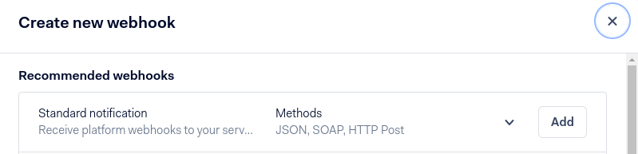
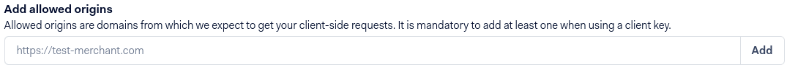

=====
Adyen
=====

`Adyen <https://www.adyen.com/>`_ is a Dutch company that offers several online payment
possibilities.

.. seealso::
   - :ref:`payment_providers/add_new`
   - :doc:`../payment_providers`

.. note::
   Adyen works only with customers processing **more** than **10 million annually** or invoicing a
   **minimum** of **1.000** transactions **per month**.

Configuration
=============

.. seealso::
   :ref:`payment_providers/add_new`

First, reach Adyen support to enable :guilabel:`multiple partial capture` for you.

Credentials tab
---------------

Odoo needs your **API Credentials** to connect with your Adyen account, which comprise:

- **Merchant Account**: The code of the merchant account to use with Adyen.
- :ref:`API Key <adyen/api_and_client_keys>`: The API key of the webservice user.
- :ref:`Client Key <adyen/api_and_client_keys>`: The client key of the webservice user.
- :ref:`HMAC Key <adyen/hmac_key>`: The HMAC key of the webhook.
- :ref:`API URL Prefix<adyen/urls>`: The base URL for the API endpoints.

You can copy your credentials from your Adyen account, and paste them in the related fields under
the **Credentials** tab.

.. important::
   If you are trying Adyen as a test, with an Adyen *test account*, head to
   :menuselection:`Accounting --> Configuration --> Payment Providers`. There, click on
   :guilabel:`Adyen`, enable :guilabel:`Test Mode` and enter your credentials in the
   :guilabel:`Credentials` tab.

.. _adyen/api_and_client_keys:

API Key and Client Key
~~~~~~~~~~~~~~~~~~~~~~

In order to retrieve the API Key and the Client Key, log into your Adyen account, go to
:menuselection:`Developers --> API Credentials`.

- If you already have an API user, open it.
- If you don't have an API user yet, click on **Create new credential**.

Go to :menuselection:`Server settings --> Authentification` and copy or generate your **API Key**.
Be careful to copy your API key as you'll not be allowed to get it later without generating a new
one.

Now, head to :menuselection:`Client settings --> Authentification` and cody or generate your
**Client Key**. This is also the place where you can :ref:`allow payments to be made from your
website <adyen/allowed_origins>`.

.. _adyen/hmac_key:

HMAC key
~~~~~~~~

In order to retrieve the HMAC Key, you'll need to configure a `Standard Notification` webhook. For
this, log into your Adyen account then go to :menuselection:`Developers --> Webhooks --> Add webhook
--> Add Standard notification`.

There, in :menuselection:`General --> Server configuration --> URL`, enter your server address
followed by `/payment/adyen/notification`.

.. image:: adyen/adyen-webhook-url.png
   :align: center
   :alt: Enter the notification URL.

Then enter :menuselection:`Security --> HMAC Key --> Generate`. Be careful to copy the key as you
will not be allowed to do it later without generating a new one.

.. image:: adyen/adyen-hmac-key.png
   :align: center
   :alt: Generate a HMAC key and save it.

You have to save the webhook to finalize its creation.

.. _adyen/urls:

API URLs
~~~~~~~~

All Adyen API URLs include a customer area-specific prefix generated by Adyen. To configure the
URLs, proceed as follows:

#. Log into your Adyen account, then go to :menuselection:`Developers --> API URLs`.
#. Copy the :guilabel:`Prefix` for your live Customer area (i.e., **data center**) and save it for
   later.

   .. image:: adyen/adyen-api-urls.png
     :alt: Copy the prefix for the Adyen APIs

#. In Odoo, :ref:`navigate to the payment provider Adyen <payment_providers/add_new>`.
#. In the :guilabel:`API URL Prefix` field, enter the prefix you previously saved.

.. note::
   If you are trying Adyen as a test, you can use the following Prefix instead:

   - :guilabel:`API URL Prefix`: `checkout-test`

Adyen Account
-------------

.. _adyen/allowed_origins:

Allow payments from a specific origin
~~~~~~~~~~~~~~~~~~~~~~~~~~~~~~~~~~~~~

To allow payment originated from your website, follow the steps in :ref:`adyen/api_and_client_keys`
to navigate to your API user and go to :menuselection:`Add allowed origins`, then add the URLs from
where payments will be made (the URLs of the servers hosting your Odoo instances).

Place a hold on a card
----------------------

Adyen allows you to capture an amount manually instead of having an immediate capture.

To set it up, enable the **Capture Amount Manually** option on Odoo, as explained in the
:ref:`payment providers documentation <payment_providers/features/manual_capture>`.

Then, open your Adyen Merchant Account, go to :menuselection:`Account --> Settings`, and set the
**Capture Delay** to **manual**.

.. image:: adyen/adyen_capture_delay.png
   :align: center
   :alt: Capture Delay settings in Adyen

.. caution::
   - If you configure Odoo to capture amounts manually, make sure to set the **Capture Delay** to
     **manual** on Adyen. Otherwise, the transaction will be blocked in the authorized state in
     Odoo.

.. note::
   - After **7 days**, if the transaction has not been captured yet, the customer has the right to
     **revoke** it.

.. seealso::
   :doc:`../payment_providers`
