=====
Adyen
=====

`Adyen <https://www.adyen.com/>`_ is a Dutch company that offers several online payment
possibilities.

.. note::
   Adyen is more focused on enterprise customers and may require a minimum number of transactions
   and a minimum processed volume.

.. _payment_providers/adyen/configure_dashboard:

Adyen configuration
===================

#. Create an Adyen account if necessary and log into your `Adyen Customer Area
   <https://ca-live.adyen.com/>`_.

   .. tip::
      Log into your **Test account** to try the integration without charging customers.
      Switch to your **Live account** once you are ready to accept payments.

#. `Contact the Adyen support team <https://docs.adyen.com/platforms/quickstart-guide/support#contact-adyen-support>`_
   to enable the **Multiple partial capture** feature.
#. In the Adyen Customer Area, go to :menuselection:`Developers --> API credentials` and click the
   relevant API credential user name in the list or click :icon:`fa-plus-circle` :guilabel:`Create
   new credential` to create a new one.
#. In the :guilabel:`Server settings` section, click :guilabel:`Generate API key`, then click the
   :icon:`fa-copy` (:guilabel:`Copy API key`) icon and save the value for the
   :ref:`payment_providers/adyen/configure_odoo` step.
#. In the :guilabel:`Client settings` section, click :guilabel:`Generate client key`, then click the
   :icon:`fa-copy` (:guilabel:`Copy client key`) icon and save the value for the
   :ref:`payment_providers/adyen/configure_odoo` step.
#. Enter your Odoo database URL in the :guilabel:`Add allowed origins` field, then click
   :guilabel:`Add`.
#. Click :guilabel:`Save changes` at the bottom of the page.
#. Go to :menuselection:`Developers --> Webhooks` in the left menu and click :icon:`fa-plus-circle`
   :guilabel:`Create new webhook`.
#. In the :guilabel:`Create new webhook` popup, click :guilabel:`Add` on the :guilabel:`Standard
   webhook` line.
#. On the :guilabel:`Webhook generation` form, in the :guilabel:`Server configuration` section,
   enter your Odoo database :guilabel:`URL` followed by `/payment/adyen/notification`.
#. In the :guilabel:`Security` section, click :guilabel:`Generate` under :guilabel:`HMAC`, then
   click the :icon:`fa-copy` (:guilabel:`Copy HMAC to the clipboard`) icon and save the value for
   the :ref:`payment_providers/adyen/configure_odoo` step.
#. Click :guilabel:`Save configuration` at the bottom of the page.
#. Go to :menuselection:`Developers --> API URLs`, then copy the :guilabel:`Prefix` and save the
   value for the :ref:`payment_providers/adyen/configure_odoo` step.

.. _payment_providers/adyen/configure_odoo:

Odoo configuration
==================

#. :ref:`Navigate to the payment provider Ayden <payment_providers/supported_providers>`.
#. Fill in the :ref:`Merchant Account <adyen/merchant-account>`, :guilabel:`API Key`,
   :guilabel:`Client Key`, :guilabel:`HMAC Key`, and :guilabel:`API URL Prefix` fields with the
   values saved at the :ref:`Adyen configuration step
   <payment_providers/adyen/configure_dashboard>`.
#. Configure the remaining options as needed.
#. Set the :guilabel:`State` field to :guilabel:`Enabled`.

.. tip::
   If you want to :ref:`test Adyen without affecting live transactions
   <payment_providers/test-mode>`, use your **Test account** credentials, enter
   `https://checkout-test.adyen.com` in the :guilabel:`API URL Prefix` field, and set the
   :guilabel:`State` field to :guilabel:`Test Mode`.

Manual capture
==============

To enable :ref:`manual capture <payment_providers/manual_capture>` for Adyen payments, follow
these steps:

#. :ref:`Navigate to the payment provider Ayden <payment_providers/supported_providers>`.
#. Go to the :guilabel:`Configuration` tab and enable :guilabel:`Capture Amount Manually`.
#. Log in to your Adyen Customer Area, then go to :menuselection:`Settings` and click
   :guilabel:`Company` in the :guilabel:`Account management` section.
#. In the :guilabel:`General` section, click the :icon:`fa-pencil` (:guilabel:`Edit property`)
   icon next to the :guilabel:`Capture Delay` field.
#. In the popup, set the :guilabel:`Capture delay` field to :guilabel:`Manual` and click
   :guilabel:`Save`.

.. note::
   - If the transaction is not captured within 7 days, the customer is entitled to revoke it.
   - You can :ref:`manually capture <payment_providers/manual_capture>` and :ref:`refund
     <payment_providers/refunds>` payments directly from your Adyen Customer Area.

.. seealso::
   :doc:`../payment_providers`

Supported payment methods
=========================

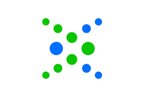

   ACH Direct Debit

   Affirm

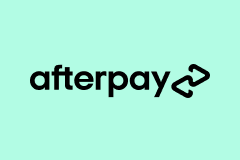

   Afterpay

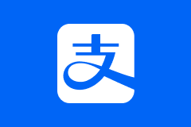

   Alipay

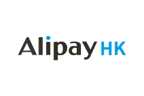

   AliPayHK

   Alma

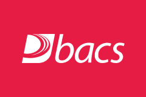

   BACS Direct Debit

   Bancontact

   Benefit

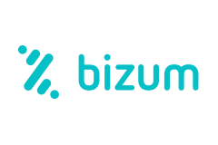

   Bizum

   BLIK

   Card

   Cash App Pay

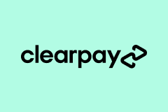

   Clearpay

   Dana

   DuitNow

   EPS

   FPX

   GCash

   GoPay

   iDEAL

   KakaoPay

   Klarna

   Klarna - Pay Now

   Klarna - Pay over time

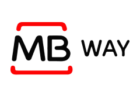

   MB WAY

   MobilePay

   MoMo

   Multibanco

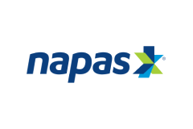

   Napas Card

   Online Banking Czech Republic

   Online Banking India

   Online Banking Slovakia

   Online Banking Thailand

   Open banking

   P24

   PayBright

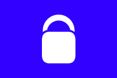

   PaySafeCard

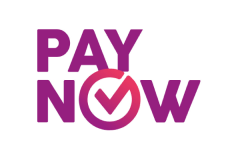

   PayNow

   Paypal

   Paytm

   Paytrail

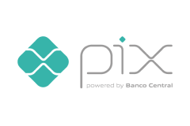

   Pix

   Prompt Pay

   Ratepay

   Samsung Pay

   SEPA Direct Debit

   Swish

   Touch'n Go

   Trustly

   Twint

   UPI

   Vipps

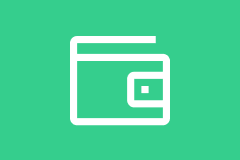

   Wallets India

   Walley

   WeChat Pay

   Zip
