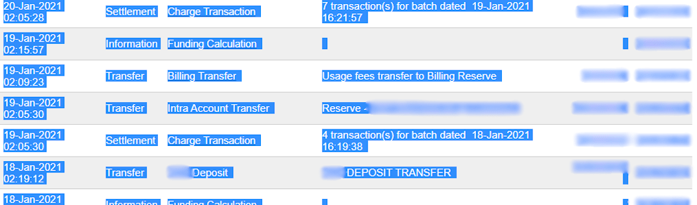

:custom-css: payment_methods.css

=============
Authorize.net
=============

`Authorize.net <https://www.authorize.net>`_ is a United States-based online payment solution
provider, allowing businesses to accept credit cards and :ref:`ACH payments
<payment_providers/authorize/ach_payments>`.

.. _payment_providers/authorize/portal:

Configuration on the Authorize.net portal
=========================================

#. `Create an Authorize.net account <https://www.authorize.net/sign-up/pricing>`_ if necessary and
   `log in to the Authorize.net merchant portal <https://login.authorize.net>`_.
#. On the merchant portal homepage, go to :menuselection:`Account --> Account and API Settings`.
#. Click :guilabel:`API Credentials and Keys`.
#. Copy the :guilabel:`API Login ID` and save it for the
   :ref:`payment_providers/authorize/odoo-configuration` step.
#. Click :guilabel:`Generate new transaction key`, then :guilabel:`Generate new signature key`
   and save the keys for the :ref:`payment_providers/authorize/odoo-configuration` step.

.. _payment_providers/authorize/ach_payments:

ACH payments (USA only)
-----------------------

:abbr:`ACH (automated clearing house)` is an electronic funds transfer system used between bank
accounts in the United States. To enable this payment method for your Authorize.net account, `apply
for the eCheck service on Authorize.net
<https://support.authorize.net/knowledgebase/Knowledgearticle/?code=KA-04421>`_.

.. seealso::
   :ref:`l10n_us/ach-electronic-transfers`

.. _payment_providers/authorize/odoo-configuration:

Odoo configuration
==================

#. :ref:`Navigate to the payment provider Authorize.net <payment_providers/add_new>`.
#. Set the :guilabel:`State` field to :guilabel:`Enabled` (or :guilabel:`Test Mode` if you want to
   :ref:`test the integration without affecting live transactions <payment_providers/test-mode>`).
#. Fill in the :guilabel:`API Login ID`, :guilabel:`API Transaction Key`, and :guilabel:`API
   Signature Key` fields with the values saved at the step
   :ref:`payment_providers/authorize/portal`.

   .. note::
      When using the :ref:`test mode <payment_providers/test-mode>`, enter the
      :ref:`API credentials <payment_providers/authorize/portal>` of your `Authorize.net sandbox
      account <https://logintest.authorize.net/>`_.

#. Click :guilabel:`Generate Client Key`.
#. Click :guilabel:`Generate your webhook` to create the :guilabel:`Webhook ID`.
#. Configure the remaining options as needed.

.. tip::
   - To recreate the webhook (e.g., after a domain change), click :guilabel:`Re-generate your
     webhook`.
   - The webhook is automatically configured with the correct URL and event types. To review
     webhook notifications on Authorize.net, log into the merchant portal, go to
     :menuselection:`Account --> Account and API Settings`, and click :guilabel:`Webhooks`.

Supported payment methods
=========================

.. container:: payment-methods d-grid gap-3 mx-1 my-0 p-0

   .. figure:: payment_method_images/ach_direct_debit.png
      :alt: ACH Direct Debit
      :width: 64px
      :figclass: text-center
      :class: o-no-modal border-0 p-0 bg-transparent

      ACH Direct Debit

   .. figure:: payment_method_images/card.png
      :alt: Card
      :width: 64px
      :figclass: text-center
      :class: o-no-modal border-0 p-0 bg-transparent

      Card

Import an Authorize.Net statement
=================================

.. _authorize-import-template:

Export from Authorize.Net
-------------------------

.. admonition:: Template

   :download:`Download the Excel import template. <authorize/authorize-net-magic-sheet.xlsx>`

- Log in to Authorize.Net.
- Go to :menuselection:`Account --> Statements --> eCheck.Net Settlement Statement`.
- Define an export range using an *opening* and *closing* batch settlement. All transactions within
  the two batch settlements will be exported to Odoo.
- Select all transactions within the desired range, copy them, and paste them into the
  :guilabel:`Report 1 Download` sheet of the :ref:`Excel import template
  <authorize-import-template>`.

.. example::

   .. image:: authorize/authorize-settlement-batch.png
      :align: center
      :alt: Settlement batch of an Authorize.Net statement

   In this case, the first batch (01/01/2021) of the year belongs to the settlement of 12/31/2020,
   so the **opening** settlement is from 12/31/2020.

Once the data is in the :guilabel:`Report 1 Download` sheet:

- Go to the :guilabel:`Transaction Search` tab on Authorize.Net.
- Under the :guilabel:`Settlement Date` section, select the previously used range of batch
  settlement dates in the :guilabel:`From:` and :guilabel:`To:` fields and click :guilabel:`Search`.
- When the list has been generated, click :guilabel:`Download to File`.
- In the pop-up window, select :guilabel:`Expanded Fields with CAVV Response/Comma Separated`,
  enable :guilabel:`Include Column Headings`, and click :guilabel:`Submit`.
- Open the text file, select :guilabel:`All`, copy the data, and paste it into the :guilabel:`Report
  2 Download` sheet of the :ref:`Excel import template <authorize-import-template>`.
- Transit lines are automatically filled in and updated in the :guilabel:`transit for report 1` and
  :guilabel:`transit for report 2` sheets of the :ref:`Excel import template
  <authorize-import-template>`. Make sure all entries are present, and **if not**, copy the formula
  from previously filled-in lines of the :guilabel:`transit for report 1` or :guilabel:`2` sheets
  and paste it into the empty lines.

.. important::
   To get the correct closing balance, **do not remove** any line from the Excel sheets.

Import into Odoo
----------------

To import the data into Odoo:

- Open the :ref:`Excel import template <authorize-import-template>`.
- Copy the data from the :guilabel:`transit for report 2` sheet and use *paste special* to only
  paste the values in the :guilabel:`Odoo Import to CSV` sheet.
- Look for *blue* cells in the :guilabel:`Odoo Import to CSV` sheet. These are chargeback entries
  without any reference number. As they cannot be imported as such, go to
  :menuselection:`Authorize.Net --> Account --> Statements --> eCheck.Net Settlement Statement`.
- Look for :guilabel:`Charge Transaction/Chargeback`, and click it.
- Copy the invoice description, paste it into the :guilabel:`Label` cell of the :guilabel:`Odoo
  Import to CSV` sheet, and add `Chargeback /` before the description.
- If there are multiple invoices, add a line into the :ref:`Excel import template
  <authorize-import-template>` for each invoice and copy/paste the description into each respective
  :guilabel:`Label` line.

.. note::
   For **combined chargeback/returns** in the payouts, create a new line in the :ref:`Excel import
   template <authorize-import-template>` for each invoice.

.. example::

   .. image:: authorize/authorize-chargeback-desc.png
      :alt: Chargeback description

- Next, delete *zero transaction* and *void transaction* line items, and change the format
  of the :guilabel:`Amount` column in the :guilabel:`Odoo Import to CSV` sheet to *Number*.
- Go back to :menuselection:`eCheck.Net Settlement Statement --> Search for a Transaction` and
  search again for the previously used batch settlements dates.
- Verify that the batch settlement dates on eCheck.Net match the related payments' dates found in
  the :guilabel:`Date` column of the :guilabel:`Odoo Import to CSV`.
- If it does not match, replace the date with the one from eCheck.Net. Sort the column by *date*,
  and make sure the format is `MM/DD/YYYY`.
- Copy the data - column headings included - from the :guilabel:`Odoo Import to CSV` sheet, paste
  it into a new Excel file, and save it using the CSV format.
- Open the Accounting app, go to :menuselection:`Configuration --> Journals`, tick the
  :guilabel:`Authorize.Net` box, and click :menuselection:`Favorites --> Import records --> Load
  file`. Select the CSV file and upload it into Odoo.

.. tip::
   List of `eCheck.Net return codes <https://support.authorize.net/knowledgebase/Knowledgearticle/?code=000001293>`_
