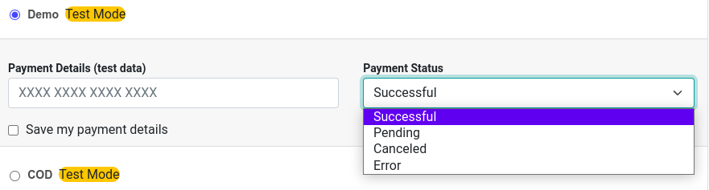
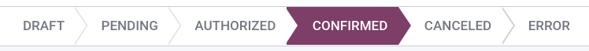

====
Demo
====

Odoo's **Demo Payment Provider** allows you to test business flows involving online transactions
without requiring real banking credentials.

Configuration
=============

.. seealso::
   :ref:`payment_providers/add_new`

.. important::
   Switch the state to :guilabel:`Test Mode`.

Payment outcome
===============

Upon checkout or when paying a bill online, you can choose the payment outcome when using the demo
payment provider. To do so, click on the :guilabel:`Payment Status` drop-down menu and select the
desired outcome.

Transaction state
=================

If you selected :guilabel:`Pending` as **payment outcome**, you can change the state of the
transaction straight from its form view. To access a transaction's form view, activate the
:ref:`developer mode <developer-mode>`, and go to :menuselection:`Accounting / Website -->
Configuration --> Payment Transactions`. Then, change the status of a transaction by clicking on the
state bar (:guilabel:`Draft, Pending, Authorized, Confirmed, Canceled, Error`).

