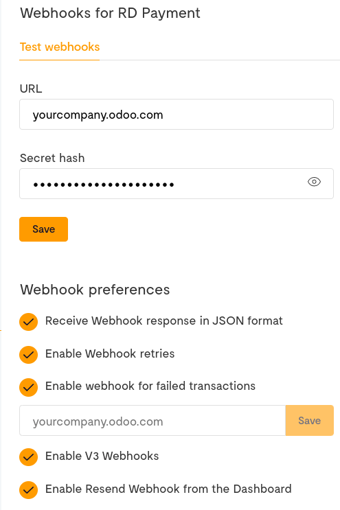

===========
Flutterwave
===========

`Flutterwave <https://flutterwave.com/>`_ is an online payments provider established in Nigeria and
covering several African countries and payment methods.

.. _payment_providers/flutterwave/configure_dashboard:

Configuration on Flutterwave Dashboard
======================================

#. Log into `Flutterwave Dashboard <https://dashboard.flutterwave.com/>`_ and go to
   :menuselection:`Settings --> API`. Copy the values of the :guilabel:`Public Key` and
   :guilabel:`Secret Key` fields and save them for later.
#. | Go to :menuselection:`Settings --> Webhooks` and enter your Odoo database URL followed by
     `/payment/flutterwave/webhook` in the :guilabel:`URL` text field.
   | For example: `https://yourcompany.odoo.com/payment/flutterwave/webhook`.
#. Fill the :guilabel:`Secret hash` with a password that you generate and save its value for later.
#. Make sure *all* the remaining checkboxes are ticked.
#. Click on **Save** to finalize the configuration.

.. _payment_providers/flutterwave/configure_odoo:

Configuration on Odoo
=====================

#. :ref:`Navigate to the payment provider Flutterwave <payment_providers/add_new>` and change its
   state to :guilabel:`Enabled`.
#. In the :guilabel:`Credentials` tab, fill the :guilabel:`Public Key`, :guilabel:`Secret Key`, and
   :guilabel:`Webhook Secret` with the values you saved at the step
   :ref:`payment_providers/flutterwave/configure_dashboard`.
#. Configure the rest of the options to your liking.

   .. important::
      If you choose to allow saving payment methods, it is recommended to only enable card payments
      from Flutterwave dashboard, as only cards can be saved as payment tokens. To do so, go to your
      Flutterwave Dashboard and then to :menuselection:`Settings --> Account Settings`.

.. seealso::
   - :doc:`../payment_providers`
