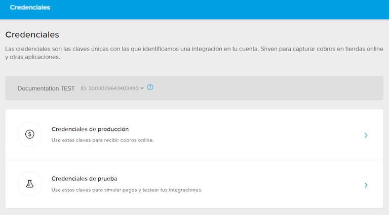

============
Mercado Pago
============

`Mercado Pago <https://www.mercadopago.com/>`_ is an online payment provider covering several
countries, currencies and payment methods in Latin America.

.. _payment_providers/mercado_pago/configure_dashboard:

Configuration on Mercado Pago Dashboard
=======================================

#. Log into the `Mercado Pago Dashboard <https://www.mercadopago.com.mx/developers/panel>`_
   and select your application or create a new one.
#. Select :guilabel:`Credenciales de producción` in the left part of the application page, then
   select the industry, optionally enter your domain, and click :guilabel:`Activar credenciales
   de producción`.
#. Copy the :guilabel:`Access token` and save it for later.

.. tip::
   If you are trying Mercado Pago as a test, select :guilabel:`Credienciales de prueba` in the left
   part of the application page, then copy the test :guilabel:`Access token`.

.. _payment_providers/mercado_pago/configure_odoo:

Configuration on Odoo
=====================

#. :ref:`Navigate to the payment provider Mercado Pago <payment_providers/add_new>` and change its
   state to :guilabel:`Enabled`.
#. In the :guilabel:`Credentials` tab, fill in the :guilabel:`Access Token` with the value you saved
   at the :ref:`payment_providers/mercado_pago/configure_dashboard` step.
#. Configure the rest of the options to your liking.

.. seealso::
   - :doc:`../payment_providers`
   - `Mercado Pago Odoo webinar <https://www.youtube.com/watch?v=CX8vPHMb1ic>`_
