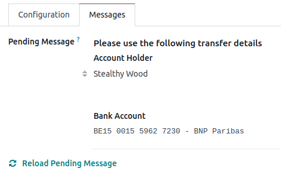

==============
Wire transfers
==============

The **Wire transfer** payment method allows you to provide payment instructions to your customers,
such as the bank details and communication. They are displayed:

- at the end of the checkout process, once the customer has selected :guilabel:`Wire transfer` as a
  payment method and clicked the :guilabel:`Pay now` button:

  .. image:: wire_transfer/payment_instructions_checkout.png
     :alt: Payment instructions at checkout

- on the customer portal:

  .. image:: wire_transfer/payment_instructions_portal.png
     :alt: Payment instructions on the customer portal

.. note::
   - While this method is very accessible and requires minimal setup, it is very inefficient
     process-wise. We recommend setting up a :doc:`payment provider <../payment_providers>` instead.
   - Online orders remain in the :guilabel:`Quotation sent` (i.e., unpaid order) stage until you
     receive the payment and :guilabel:`Confirm` the order.

.. tip::
   **Wire transfer** can be used as a template for other payment methods that are processed
   manually, such as checks, by renaming or duplicating it.

Configuration
=============

To configure **Wire Transfer**, go to :menuselection:`Accounting / Website --> Configuration -->
Payment Providers`, and open the :guilabel:`Wire Transfer` card. Then, in the
:guilabel:`Configuration` tab:

- Select the :guilabel:`Communication` to be used;

  - :guilabel:`Based on Document Reference`: sales order or invoice number
  - :guilabel:`Based on Customer ID`: customer identifier

- Tick the :guilabel:`Enable QR codes` check box to activate :doc:`QR code payments
  <../accounting/customer_invoices/epc_qr_code>`.

Define the payment instructions in the :guilabel:`Messages` tab:

If you have already defined :doc:`a bank account <../accounting/bank>`, the account number will be
automatically added to the default message generated by Odoo. You can also add it afterwards and
update the message by clicking :guilabel:`Reload pending message`.

.. seealso::
   :ref:`payment_providers/journal`
