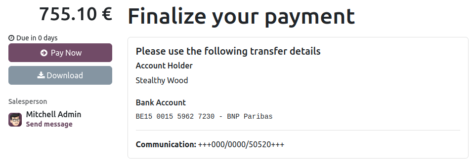

==============
Wire transfers
==============

The **Wire Transfer** payment method allows you to provide payment instructions to your customers,
such as your bank details and a reference to include with the payment. These instructions are
displayed after the customer selects :guilabel:`Wire Transfer` as the payment method and clicks the
:guilabel:`Pay now` button at the end of the checkout process on your ecommerce website or
on the customer portal.

.. note::
   - While this method is widely accessible and requires minimal setup, it is not efficient
     process-wise. It is recommended to set up a :doc:`payment provider <../payment_providers>`
     instead.
   - Online orders remain in the :guilabel:`Quotation sent` (i.e., unpaid order) stage until you
     receive the payment and manually :guilabel:`Confirm` the order.

.. tip::
   **Wire transfer** can be used as a template for other payment methods that are processed
   manually, such as checks, by renaming or duplicating it.

Configuration
=============

To configure **Wire Transfer**:

#. :ref:`Navigate to the Wire Transfer payment provider <payment_providers/supported_providers>`.
#. In the :guilabel:`Configuration` tab, select whether the memo or :guilabel:`Communication` to be
   displayed alongside the payment instructions should be:

   - :guilabel:`Based on Document Reference`: the sales order or invoice number
   - :guilabel:`Based on Customer ID`: the customer identifier

#. Enable :guilabel:`Enable QR codes` to activate QR code payments.

   .. note::
      :doc:`Additional accounting setup <../accounting/customer_invoices/epc_qr_code>` is required
      to use QR codes.

#. Define the payment instructions in the :guilabel:`Messages` tab. If :doc:`a bank account
   <../accounting/bank>` has already been defined, the account number is automatically added to the
   default message generated by Odoo. You can also add it afterward and update the message by
   clicking :guilabel:`Reload pending message`.

   .. image:: wire_transfer/payment_instructions.png
      :alt: Define payment instructions

#. Set the :guilabel:`State` field to :guilabel:`Enabled`.

.. tip::
   You can also test wire transfers using the :ref:`payment_providers/test-mode`.

.. seealso::
   :doc:`../payment_providers`
