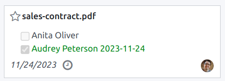
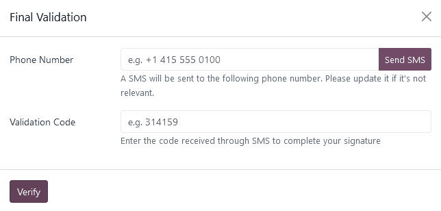
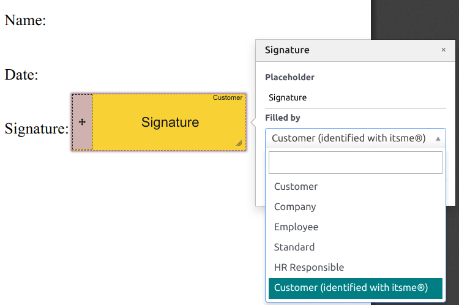
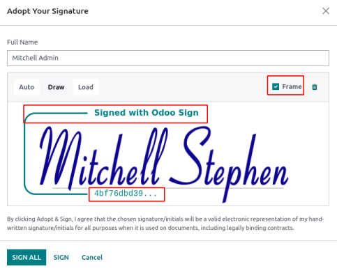
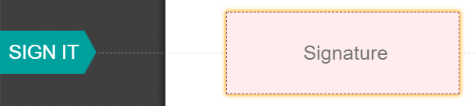

====
Sign
====

**Odoo Sign** allows you to send, sign, and approve documents online, using electronic signatures.

An **electronic signature** shows a person's agreement to the content of a document. Just like a
handwritten signature, the electronic one represents a legal bounding by the terms of the signed
document.

With Sign, you can upload any PDF file and add fields to it. These fields can be automatically
filled in with the user's details present in your database.

.. seealso::
   - `Odoo Sign: product page <https://www.odoo.com/app/sign>`_
   - `Odoo Tutorials: Sign [video] <https://www.odoo.com/slides/sign-61>`_

Validity of electronic signatures
=================================

Documents signed via the Sign app are valid electronic signatures in the European Union and the
United States of America. They also meet the requirements for electronic signatures in most
countries. The legal validity of electronic signatures generated by Odoo depends on your country's
legislation. Companies doing business abroad should also consider other countries' electronic
signature laws.

European Union
--------------

The `eIDAS regulation <http://data.europa.eu/eli/reg/2014/910/oj>`_ establishes the framework for
electronic signatures in the `27 member states of the European Union
<https://europa.eu/european-union/about-eu/countries_en>`_. It distinguishes three types of
electronic signatures:

#. Simple electronic signatures
#. Advanced electronic signatures
#. Qualified electronic signatures

Odoo generates the first type, **simple electronic signatures**; these signatures are legally valid
in the EU, as stated in the eIDAS regulation.

Electronic signatures may not be automatically recognized as valid. You may need to bring
supporting evidence of a signature's validity. While the Sign app provides a simple electronic
signature, some supporting evidence is automatically collected during the signature process, such
as:

#. Email and SMS validation (if enabled)
#. Strong identity proof through itsme® (available in Belgium and the Netherlands)
#. Timestamped, IP and geographically traceable access logs to the documents and their associated
   signatures
#. Document traceability and inalterability (any alteration made to a signed document is detected by
   Odoo with the use of cryptographic proofs)

United States of America
------------------------

The `ESIGN Act (Electronic Signatures in Global and National Commerce Act)
<https://www.fdic.gov/regulations/compliance/manual/10/X-3.1.pdf>`_, at the interstate and
international levels, and the `UETA (Uniform Electronic Transactions Act)
<https://www.uniformlaws.org/committees/community-home/librarydocuments?communitykey=2c04b76c-2b7d-4399-977e-d5876ba7e034&tab=librarydocuments>`_,
at the state level, provide the legal framework for electronic signatures. Note that `Illinois
<https://www.ilga.gov/legislation/ilcs/ilcs5.asp?ActID=89&>`_ and `New York
<https://its.ny.gov/electronic-signatures-and-records-act-esra>`_ have not adopted the UETA, but
similar acts instead.

Overall, to be recognized as valid, electronic signatures have to meet five criteria:

#. The signer must show a clear **intent to sign**. For example, using a mouse to draw a signature
   can show intent. The signer must also have the option to opt out of the electronic document.
#. The signer must first express or imply their **consent to conduct business electronically**.
#. **The signature must be clearly attributed**. In Odoo, metadata, such as the signer's IP address,
   is added to the signature, which can be used as supporting evidence.
#. **The signature must be associated with the signed document**, for example, by keeping a record
   detailing how the signature was captured.
#. Electronically signed documents need to be **retained and stored** by all parties involved; for
   example, by providing the signer either a fully-executed copy or the possibility to download a
   copy.

.. important::
   The above information has no legal value; it is only provided for general informational purposes.
   As laws governing electronic signatures rapidly evolve, we cannot guarantee that all information
   is up-to-date. We advise contacting a local attorney for legal advice regarding electronic
   signature compliance and validity.

Send a document to sign
=======================

One-time signature
------------------

You can click :guilabel:`Upload a PDF to sign` from your dashboard for a one-time signature. Select
your document, open it, and drag and drop the required :ref:`fields <sign/fields>` in your document.
You can modify the :ref:`role <sign/role>` assigned to a field by clicking on it and selecting the
one you want.

When ready, click :guilabel:`Send`, and fill in the required fields. Once sent, your document
remains available. Go to :menuselection:`Documents --> All Documents` to see your document
and the status of the signatures.

Validity dates and reminders
~~~~~~~~~~~~~~~~~~~~~~~~~~~~

You can set **validity dates** on limited-duration agreement documents or send **automatic email
reminders** to obtain signatures on time. From your dashboard, click :guilabel:`Send` on your
document. On the new page, go to the :guilabel:`Options` section and fill in the :guilabel:`Valid
Until` and :guilabel:`Reminder` fields.

Templates
---------

You can create document templates when you have to send the same document several times. From your
dashboard, click :guilabel:`Upload a PDF template`. Select the document and add the required
:ref:`fields <sign/fields>`. You can modify the :ref:`role <sign/role>` of a field by clicking on it
and selecting the one you want.

Click :guilabel:`Template Properties` to add :guilabel:`Tags` to your template, define a
:guilabel:`Signed Document Workspace`, add :guilabel:`Signed Document Tags`, set a
:guilabel:`Redirect Link` that will be available in the signature confirmation message received
after the signature, or define :guilabel:`Authorized Users` if you want to restrict the use of your
template to specific authorized users or groups.

Your templates are visible by default on your dashboard. You can click :guilabel:`Send` to quickly
send a document template to a signer or :guilabel:`Sign Now` if you are ready to sign your document
immediately.

.. tip::
   You can **create a template from a document that was previously sent**. To do so, go to
   :menuselection:`Documents --> All Documents`. On the document you want to retrieve, click on the
   the vertical ellipsis (:guilabel:`⋮`), then :guilabel:`Template`. Click on the vertical ellipsis
   (:guilabel:`⋮`) again, then :guilabel:`Restore`. Your document now appears on your dashboard next
   to your other templates.

.. _sign/role:

Roles
=====

Each field in a Sign document is related to a role corresponding to a specific person. When a
document is being signed, the person assigned to the role must fill in their assigned fields and
sign it.

Roles are available by going to :menuselection:`Sign --> Configuration --> Roles`.

It is possible to update existing roles or to create new roles by clicking on :guilabel:`New`.
Choose a :guilabel:`Role Name`, add an :guilabel:`Extra Authentication Step` to confirm the
identity of the signing person, and if the document can be reassigned to another contact, select
:guilabel:`Change Authorized` for the role. A :guilabel:`Color` can also be chosen for the role.
This color can help understand which roles are responsible for which field when configuring a
template.

Secured identification
----------------------

As the owner of a document, you may request an :guilabel:`Extra Authentication Step` through
:ref:`SMS verification <sign/sms>` or via :ref:`Itsme® <sign/itsme>` (available in Belgium and the
Netherlands). Both authentication options require :ref:`credits <iap/buying_credits>`. If you do not
have any credits left, the authentication steps will be skipped.

.. seealso::
   - :doc:`In-App Purchase (IAP) <../general/in_app_purchase>`
   - :doc:`SMS pricing and FAQ <../marketing/sms_marketing/pricing/pricing_and_faq>`

.. _sign/sms:

SMS verification
~~~~~~~~~~~~~~~~

Go to :menuselection:`Sign --> Configuration --> Roles`. Click in the :guilabel:`Extra
Authentication Step` column for the role, and select :guilabel:`Unique Code Via SMS`.

.. note::
   Before being able to send SMS Text Messages, you need to register your phone number. To do so, go
   to :menuselection:`Sign --> Configuration --> Settings` and click :guilabel:`Buy credits` under
   :guilabel:`Authenticate by SMS`.

Go to the document to sign, add the field for which the SMS verification is required, for example,
the :guilabel:`Signature` field, and click :guilabel:`Send`. On the new page, select the
:guilabel:`customer` and click :guilabel:`Send`.

The person signing the document fills in the :guilabel:`Signature` field, then :guilabel:`Sign`, and
clicks :guilabel:`Validate & Send Completed Document`. A :guilabel:`Final Validation` page pops up
where to add their phone number. One-time codes are sent by SMS.

.. note::
   - This feature is enabled by default.
   - As soon as the :guilabel:`Extra Authentication Step` applies to a role, this validation step is
     requested for any field assigned to this role.

.. _sign/itsme:

Itsme®
~~~~~~

Itsme® authentication can be used to allow signatories to provide their identity using itsme®. This
feature is only available in **Belgium** and the **Netherlands**.

The feature can be enabled in :guilabel:`Sign Settings` and applies automatically to the
:guilabel:`Customer (identified with itsme®)` role. To enable it for other roles, go to
:menuselection:`Sign --> Configuration --> Roles`. Click in the :guilabel:`Extra Authentication
Step` column for the role, and select :guilabel:`Via itsme®`.

Go to the document that needs to be signed and add the :guilabel:`Signature` field. Switch to any
role configured to use the feature, and click :guilabel:`Validate` and :guilabel:`Send`.

Upon signing the document, the signer completes the :guilabel:`Signature` field and proceeds by
clicking on :guilabel:`Validate & Send Completed Document`, triggering a
:guilabel:`Final verification` page where authentication via itsme® is required.

Signatory hash
==============

Each time someone signs a document, a **hash** - a unique digital signature of the operation - is
generated to ensure traceability, integrity, and inalterability. This process guarantees that any
changes made after a signature is affixed can be easily detected, maintaining the document's
authenticity and security throughout its lifecycle.

A visual security frame displaying the beginning of the hash is added to the signatures. Internal
users can hide or show it by turning the :guilabel:`Frame` option on or off when signing the
document.

.. _sign/field-types:

Tags
====

Tags can be used to categorize and organize documents, allowing users to quickly search for and
filter documents based on specific criteria.

You can manage tags by going to :menuselection:`Configuration --> Tags`. To create a tag, click
:guilabel:`New`. On the new line, add the :guilabel:`Tag Name` and select a :guilabel:`Color Index`
for your tag.

To apply a tag to a document, use the dropdown list available in your document.

.. note::
   You can modify the tags of a signed document by going to :menuselection:`Documents --> All
   Documents`, clicking the vertical ellipsis (:guilabel:`⋮`) on your document, then
   :guilabel:`Details`, and modifying your :guilabel:`Tags`.

Sign order
==========

When a document needs to be signed by different parties, the signing order lets you control the
order in which your recipients receive it for signature.

After uploading a PDF with at least two signature fields with two different roles and clicking
:guilabel:`Send`, toggle the :guilabel:`Specify Signing Order` button and search for the signer's
name or email information to add them. You can decide on the signing order by typing **1** or **2**
in the first column.

Each recipient receives the signature request notification only once the previous recipient has
completed their action.

.. seealso::
   `Odoo Quick Tips: Sign order [video] <https://www.youtube.com/watch?v=2KUq7RPt1cU/>`_

.. _sign/fields:

Field types
===========

Fields are used in a document to indicate what information must be completed by the signers. You can
add fields to your document simply by dragging and dropping them for the left column into your
document.

Various field types can be used to sign documents (placeholder, autocompletion, etc.). By
configuring your own field types, also known as signature item types, the signing process can be
even faster for your customers, partners, and employees.

To create and edit field types, go to :menuselection:`Sign --> Configuration --> Settings -->
Edit field types`.

You can select an existing field by clicking on it, or you can :guilabel:`Create` a new one. First,
edit the :guilabel:`Field Name`. Then, select a :guilabel:`Field Type`:

- :guilabel:`Signature`: users are asked to enter their signature either by drawing it, generating
  an automatic one based on their name, or uploading a local file (usually an image).
  Each subsequent :guilabel:`Signature` field type then reuses the data entered in the first field.
- :guilabel:`Initial`: users are asked to enter their initials, in a similar way to the
  :guilabel:`Signature` field.
- :guilabel:`Text`: users enter text on a single line.
- :guilabel:`Multiline Text`: users enter text on multiple lines.
- :guilabel:`Checkbox`: users can tick a box (e.g., to mark their approval or consent).
- :guilabel:`Selection`: users choose a single option from a variety of options.

The :guilabel:`Auto-fill Partner Field` setting is used to automatically fill in a field during the
signature process. It uses the value of one of the fields on the contact (`res.partner`) model of
the person signing the document. To do so, enter the contact model field's technical name.

.. tip::
   To know the technical name of a field, enable developer mode and hover your mouse on the question
   mark next to the field.

.. note::
   Auto-completed values are suggestions and can be modified as required by the person signing the
   document.

The size of the fields can also be changed by editing the :guilabel:`Default Width` and
:guilabel:`Default Height`. Both sizes are defined as a percentage of the full page expressed as a
decimal, with 1 equalling the full page's width or height. By default, the width of new fields you
create is set to 15% (0.150) of a full page's width, while their height is set to 1.5% (0.015) of a
full page's height.

Next, write a :guilabel:`Tip`. Tips are displayed inside arrows on the left-hand side of the user's
screen during the signing process to help them understand what the step entails (e.g., "Sign here"
or “Fill in your birthdate”). You can also use a :guilabel:`Placeholder` text to be displayed inside
the field before it is completed.

