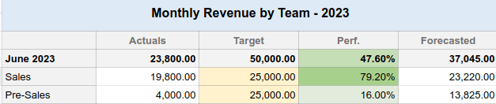
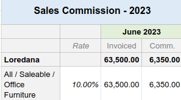

=========
Templates
=========

Spreadsheet templates allow you to quickly create spreadsheets without starting from scratch.

Several pre-built templates are available when creating a new spreadsheet from the **Documents**
app, such as:

- :ref:`budget reports <templates/budget-reports>`,
- :ref:`pipeline revenue reports <templates/pipeline-reports>`, or
- :ref:`sales commission report <templates/sales-commission>`.

.. image:: templates/report-templates.png
   :alt: View of all the default templates

You can also :ref:`save any spreadsheet as a template <templates/save>` and :ref:`manage and edit
existing templates <templates/manage>`.

Default templates
=================

.. _templates/budget-reports:

Accounting: budget reports
--------------------------

Budget reports compare a company's actual spending with its budget over a defined period. Two
templates are available: one uses quarterly intervals (:guilabel:`Budget Report (Quarterly)`), while
the other uses monthly intervals (:guilabel:`Budget Report (Monthly)`).

.. image:: templates/budget-report.png
   :alt: Extract of a budget report

The cells under the :guilabel:`Actuals` column are automatically filled in with the amount of money
made and spent over the corresponding period (month or quarter). The data is taken from posted
journal items under :ref:`income and expense accounts <chart-of-account/type>`.

.. warning::
   Journal items under the :guilabel:`Other Income` account type are not considered when collecting
   data.

To analyze your budget's performance, fill the cells under the :guilabel:`Budget` column with how
much money you expect to make (:guilabel:`Income` rows) and spend (:guilabel:`Expenses` rows) over
the related period and per account. Then, the performance (:guilabel:`Perf.`) column compares
:guilabel:`Actuals` data to their corresponding budget, expressed as a percentage.

Lastly, the :guilabel:`Net Profit` row represents the total :guilabel:`Income` minus the total
:guilabel:`Expenses` for the :guilabel:`Actuals` and :guilabel:`Budget` columns.

.. _templates/pipeline-reports:

CRM: pipeline revenue reports
-----------------------------

Two pipeline revenue reports are available. The :guilabel:`Pipeline Revenue Report (Monthly)` is
dedicated to one-time revenue (:abbr:`NRR (non-recurring revenue)`), while the :guilabel:`MRR/NRR
Pipeline Revenue Report (Monthly)` covers recurring and non-recurring revenue (:abbr:`MRR (monthly
recurring revenue)`).

.. tip::
   Enable :guilabel:`Recurring Revenues` by going to :menuselection:`CRM --> Configuration -->
   Settings`.

The cells under the :guilabel:`Actuals` column are automatically filled in with the amount of
monthly revenue from **won** opportunities.

To compute the revenue performance, fill in the monthly revenue targets.

- For the :guilabel:`Revenue by Team` sheet, fill in the cells under the :guilabel:`Target` columns
  for each sales team.
- For the :guilabel:`Revenue by Salesperson` sheet, open the :guilabel:`Targets` sheet and fill in
  the cells next to each salesperson. Use the :guilabel:`Monthly Factor` table below to adapt the
  main targets depending on the month of the year.

Then, the performance (:guilabel:`Perf.`) column compares :guilabel:`Actuals` data to their related
budget, expressed as a percentage.

Lastly, the :guilabel:`Forecasted` column gathers the monthly revenue of leads multiplied by their
:guilabel:`Probability` percentage.

.. note::
   For actuals and forecasts:

   - The :guilabel:`Expected Closing` date found on leads is used to assign them to a month.
   - The recurring monthly revenue is used even if the recurring plan's number of months is set to
     a different value than 1 month. For example, a yearly plan's revenue is divided by 12 months.

.. _templates/sales-commission:

Sales: sales commission
-----------------------

This report presents the monthly commission earned or due to each salesperson.

The :guilabel:`Rate` column is pre-filled with the percentage rate from the :guilabel:`Rates` tab,
which can be customized for each product category according to the company's policy. Adjusting the
rate for a specific product category automatically updates the commission amount for that category.

The :guilabel:`Invoiced` column shows the total amount of untaxed invoices grouped by salesperson
and month.

Lastly, the :guilabel:`Comm.` column is computed by multiplying the invoiced amount with the rate
percentage.

.. _templates/save:

Save a spreadsheet as a template
================================

Any spreadsheet can be saved as a template. From the menu bar, click :menuselection:`File --> Save
as template`. Modify the default :guilabel:`Template Name` if necessary and click
:guilabel:`Confirm`.

.. note::
   Templates are available to all users on the database.

.. _templates/manage:

Manage and edit templates
=========================

Manage templates by going to :menuselection:`Documents --> Configuration --> Spreadsheet Templates`.
Remove the :guilabel:`My Templates` :ref:`filter <search/preconfigured-filters>` to view all
templates in the database.

To edit an existing template, click `✎ Edit` next to the desired template. Modifications are
automatically saved.

.. tip::
   Use the download button under the :guilabel:`Data` column to export a template in JSON format.
   The file can be imported into another database.
