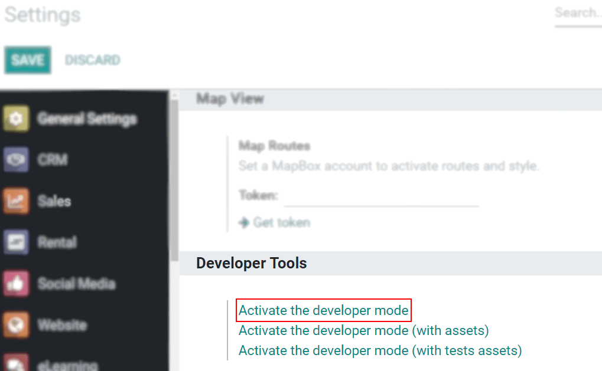
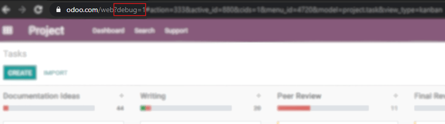
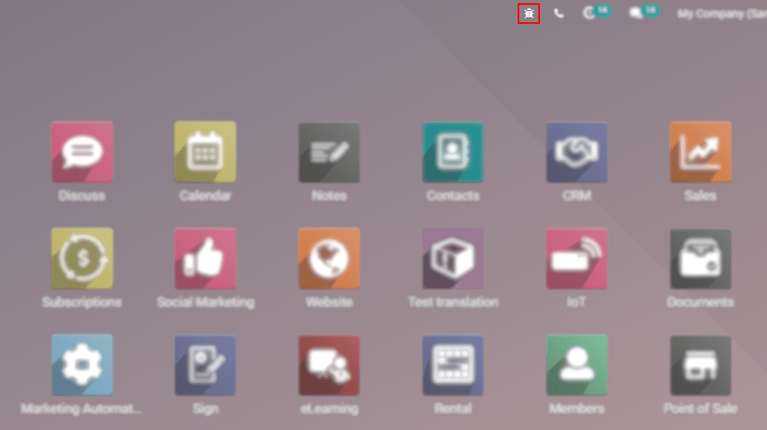

:show-content:

=======
General
=======

.. toctree::

    general/users
    general/export_import_data
    general/multi_companies
    general/auth
    general/tags
    general/payment_acquirers
    general/voip
    general/in_app_purchase
    general/unsplash

**Odoo** is a suite of open source business apps that cover all your company needs: :doc:`CRM
<sales/crm>`, :doc:`eCommerce <websites/ecommerce>`, :doc:`accounting <finance/accounting>`,
:doc:`inventory <inventory_and_mrp/inventory>`, :doc:`point of sale <sales/point_of_sale>`,
:doc:`project management <services/project>`, etc. Its unique value proposition is to be at the same
time *very easy* to use and *fully integrated*.

This section of the documentation covers all functional aspects that aren't app-specific. You can
find, for example, information about:

- :doc:`general/users` and :doc:`general/users/access_rights`, to configure each user correctly.
- :doc:`general/export_import_data`, to transfer data from and to other environments than Odoo or
  update data.
- :doc:`general/payment_acquirers`, to allow your customers to pay with their favorite payment
  method.
- :doc:`general/auth/google`, as an authentication method.

.. important::
   - | **Installing or uninstalling apps, managing users, etc., is up to you.**
     | As the administrator of your database, you are responsible for its usage, as you know best
       how your organization works. This includes the installation or uninstallation of :ref:`apps
       <general/apps-modules>` as well as the number of :doc:`users <general/users>` currently in
       use.
   - | **Odoo apps have dependencies.**
     | Installing some apps and features with dependencies may also install additional apps and
       modules that are technically required, even if you won't actively use them.
   - | **Always test app installation/removal on a duplicate of your database.**
     | This way, you can know what app dependencies may be required or what data may be erased.

.. seealso::
   - :ref:`Online Database management: Duplicate a database <duplicate_online>`
   - :ref:`On-premises Database management: Duplicate a database <duplicate_premise>`
   - `Submit a Support Ticket <https://www.odoo.com/help>`_

.. _general/apps-modules:

Apps and modules
================

Odoo is *not a smartphone*, and its apps shouldn't be installed or uninstalled carelessly. Apply
caution when adding or removing apps and modules on your database since this may impact your
subscription costs.

.. _general/uninstall:

Uninstall apps and modules
--------------------------

Go to :menuselection:`Apps`, click on the *dropdown menu* of the app you want to uninstall, then on
*Uninstall*.

.. image:: general/uninstall.png
   :align: center

Some apps have dependencies, meaning that one app requires another. Therefore, uninstalling one app
may uninstall multiple apps and modules. Odoo warns you which dependant apps and modules are
affected by it.

.. image:: general/uninstall_deps.png
   :align: center

To complete the uninstallation, click on *Confirm*.

.. danger::
   Uninstalling an app also uninstalls all its dependencies and permanently erases their data.

.. _developer-mode:

Activate the developer mode (debug mode)
========================================

The developer mode (or debug mode) gives you access to extra and advanced tools.

Through the Settings
--------------------

Go to :menuselection:`Settings --> Activate the developer mode`.

.. note::
   *Activate the developer mode (with assets)* is used by developers; *Activate the developer mode
   (with tests assets)* is used by developers and testers.

Once activated, the *Deactivate the developer mode* option becomes available.

Through a browser extension
---------------------------

| Go to the settings and extensions of your web browser, and search for *Odoo Debug*. Once the
  extension is installed, a new icon will be shown on your toolbar.
| For the *Odoo Debug* extension, a single click enables a normal version of the mode, while a
  double click enables it with assets. To deactivate it, use a single click.

.. image:: general/monkey.png
   :align: center
   :alt: View of odoo’s debug icon in a chrome’s toolbar

Through the URL
---------------

In the URL add ``?debug=1`` or ``?debug=true`` after *web*.

.. tip::
   Developers: type ``?debug=assets`` and activate the mode with assets.

Locate the mode tools
---------------------

The Developer mode tools can be accessed from the *Open Developer Tools* button, located on the
header of your pages.

Mobile Push Notifications
=========================

As of Odoo 12.0, 13.0 or above, there is no more complex configuration to enable push
notifications in the mobile app.

Simply go to :menuselection:`Settings --> General Settings --> Odoo Cloud Notification (OCN)`
and make sure that **Push Notifications** is checked.
