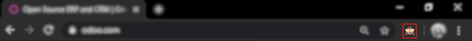

:show-content:

=======
General
=======

.. toctree::

    general/odoo_basics
    general/export_import_data
    general/multi_companies
    general/auth
    general/tags
    general/payment_acquirers
    general/voip
    general/in_app_purchase
    general/unsplash

.. _general/users-features:

Users and Features
==================

As the administrator of your database, you are responsible for its usage.
This includes the Apps you install as well as the number of users currently
in use.

Odoo is many things (ERP, CMS, CRM application, e-Commerce backend, etc.)
but it is *not* a smartphone. You should apply caution when adding/removing
features (especially Apps) on your database since this may impact your
subscription amount significantly (or switch you from a free account
to a paying one on our online platform).

This section contains some information as to how you can manage your Odoo
instances. Before carrying any of these procedures, we **strongly** advise
to test them on a duplicate of your database first. That way, if something goes
wrong, your day-to-day business is not impacted.

.. note:: You can find guides on how to duplicate your databases both for
    :ref:`online <duplicate_online>` and :ref:`on premise <duplicate_premise>`
    installations.

.. note:: If you have questions about the content of this section or if you
    encounter an issue while carrying out these procedures, please contact
    us through our `support form <https://www.odoo.com/help>`__.

Deactivating Users
------------------

.. note:: Make sure you have sufficient **administrative rights** if
    you want to change the status of any of your users.

In your Odoo instance, click on **Settings**. You will have a section
showing you the active users on your database. Click on **Manage Users.**

+----------------+----------------+
|   |settings|   | |browse_users| |
+----------------+----------------+

You'll then see the list of your users.

.. image:: general/list_users.png
    :align: center

.. note:: The pre-selected filter *Internal Users* shows your paying
    users (different from the *Portal Users* which are free). If you
    remove this filter, you'll get all your users (the ones you pay for
    and the portal ones)

In your list of users, click on the user you want to deactivate. As soon
as you are on the userform, click on the Action drop down menu, and
then click on Archive.

.. image:: general/deactivate_user.png
    :align: center

The user is now deactivated.

.. danger:: **Never** deactivate the main user (*admin*)

Uninstalling Apps
-----------------

.. warning:: Make sure you first test what you are about to do on a
    :ref:`duplicate <duplicate_online>` of your database before making any
    changes (*especially* installing/uninstalling apps).

In your Odoo instance click on **Settings**; in this app, you will be
able to see how many applications you have installed. Click on **Browse
Apps** to access the list of your installed applications.

+----------------+----------------+
|   |settings|   | |browse_apps|  |
+----------------+----------------+

In your applications' dashboard, you will see all the icons of your
applications. Click on the application you want to uninstall. Then, on
the form of the application, click on **Uninstall**.

.. image:: general/uninstall.png
    :align: center

.. danger:: Some applications have dependencies, like Invoicing, eCommerce,
    etc. Therefore, the system will give you a warning message to advise
    you of what is about to be removed. If you uninstall your application,
    all its dependencies will be uninstalled as well (and the data in them
    will permanently disappear). If you are sure you still want to uninstall
    it, then click **Confirm**.

Last, after having checked the warning message (if any), click **Confirm**.

.. image:: general/uninstall_deps.png
    :align: center

You have finished uninstalling your application.

Good to know
------------

* **Uninstalling apps, managing users, etc. is up to you**: no one else can
  know if your business flow is broken better than you. If we were to uninstall
  applications for you, we would never be able to tell if relevant data had
  been removed or if one of your business flow was broken because we *do not
  know how you work* and therefore cannot validate these kinds of operations.

* **Odoo Apps have dependencies**: this means that you may need to install
  modules that you do not actively use to access some features of Odoo
  you might need. For example, the Website Builder app is needed to be
  able to show your customer their Quotes in a web page. Even though you
  might not need or use the Website itself, it is needed for the Online
  Quotes feature to work properly.

* **Always test app installation/removal on a duplicate** (or on a
  free trial database): that way you can know what other apps may
  be required, etc. This will avoid surprises when uninstalling
  or when receiving your invoices.

.. |settings| image:: general/settings_app.png
.. |browse_apps| image:: general/browse_apps.png
.. |browse_users| image:: general/browse_users.png

.. _developer-mode:

Activate the developer mode (debug mode)
========================================

The developer mode (or debug mode) gives you access to extra and advanced tools.

Through the Settings application
--------------------------------

Go to :menuselection:`Settings --> Activate the developer mode`.

.. note::
   *Activate the developer mode (with assets)* is used by developers; *Activate the developer mode
   (with tests assets)* is used by developers and testers.

Once activated, the *Deactivate the developer mode* option becomes available.

Through a browser extension
---------------------------

| Go to the settings and extensions of your web browser, and search for *Odoo Debug*. Once the
  extension is installed, a new icon will be shown on your toolbar.
| For the *Odoo Debug* extension, a single click enables a normal version of the mode, while a
  double click enables it with assets. To deactivate it, use a single click.

Through the URL
---------------

In the URL add ``?debug=1`` or ``?debug=true`` after *web*.

.. image:: general/url.png
   :align: center
   :alt: Overview of an url with the debug mode command added in Odoo

.. tip::
   Developers: type ``?debug=assets`` and activate the mode with assets.

Locate the mode tools
---------------------

The Developer mode tools can be accessed from the *Open Developer Tools* button, located on the
header of your pages.

Mobile Push Notifications
=========================

As of Odoo 12.0, 13.0 or above, there is no more complex configuration to enable push
notifications in the mobile app.

Simply go to :menuselection:`Settings --> General Settings --> Odoo Cloud Notification (OCN)`
and make sure that **Push Notifications** is checked.
