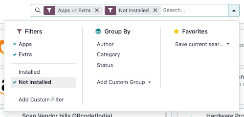
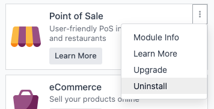
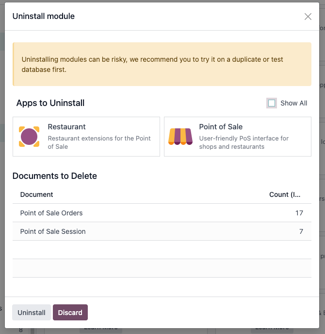

================
Apps and modules
================

:ref:`Install <general/install>`, :ref:`upgrade <general/upgrade>` and :ref:`uninstall
<general/uninstall>` any needed apps and modules from the :menuselection:`Apps` dashboard.

By default, an *Apps* filter is applied. To search for
modules, click on *Filters* and select *Extra*.

.. warning::
   Odoo is *not a smartphone*, and its apps should not be installed or uninstalled carelessly. Apply
   caution when adding or removing apps and modules on the Odoo database since this may impact
   subscription costs.

   - **Administrators manage the database**: The administrator of the database is responsible for
     its usage, as they know best how their organization works.
   - **Odoo apps can have dependencies**: Installing some apps and features with dependencies may
     also install additional apps and modules that are technically required, even if database users
     do not actively use them.
   - **Duplicate the database to test apps**: Testing on a duplicate database reveals what app
     dependencies may be required or what database may be erased. Learn how to duplicate an
     :doc:`Odoo Online database <../../administration/odoo_online>` or an :doc:`Odoo On-premise
     database <../../administration/on_premise>`.

.. _general/install:

Install apps and modules
========================

From the database home page, click on the :guilabel:`Apps` app, then click on the search bar to
find the app to be installed or scroll to find it. From here, click :guilabel:`Activate` on the
app's card.

.. note::
   If the app or module to be installed is not listed, update the app list by activating
   :ref:`developer mode <developer-mode>`, and then click on the :guilabel:`Apps`. Then, in the top
   navigation menu, click :menuselection:`Update Apps List`, and then click :guilabel:`Update`.

.. _general/upgrade:

Upgrade apps and modules
========================

On some occasions, new improvements or app features are added to :doc:`supported versions of Odoo
</administration/supported_versions>`. Upgrade the app to use these new improvements and features.

From the database home page, click on the :guilabel:`Apps` app, then click on the search bar to
find the app to be upgraded or scroll to find it. Then, on the app's card, click
:icon:`fa-ellipsis-v` :guilabel:`(vertical ellipsis)`, and the click :guilabel:`Upgrade`.

.. _general/uninstall:

Uninstall apps and modules
==========================

When an app is no longer needed and another app does not depend on it (e.g., uninstalling the
**Point of Sale** app also uninstalls the **Restaurant** app if it is installed), uninstall it from
the database.

.. danger::
   This will delete database records that are stored in that app. Test uninstalling the app on a
   duplicated database before it is removed on the real database.

From the database home page, click on the :guilabel:`Apps` app, and then click on the search bar to
find the app to be uninstalled or scroll to find it. Then, on the app's card, click
:icon:`fa-ellipses-v` :guilabel:`Menu`, and click :guilabel:`Uninstall`. From here, read the
warning message, and then click :guilabel:`Uninstall`.

Some apps have dependencies, meaning that one app requires another. Therefore, uninstalling one app
may uninstall multiple apps and modules. Odoo provides a warning message showing which dependent
apps and modules are affected by it as well as what database records get removed if the
uninistallation is completed.

