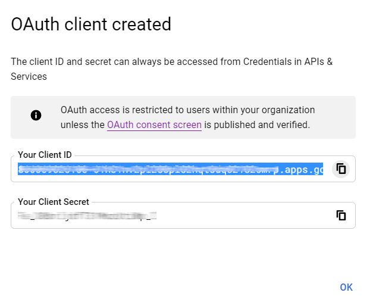

=============================
Google Sign-In Authentication
=============================

The *Google Sign-In Authentication* is a useful function that allows Odoo users to sign in to their
database with their Google account.

This is particularly helpful if the organization uses Google Workspace, and wants employees within
the organization to connect to Odoo using their Google Accounts.

.. warning::
   Databases hosted on Odoo.com should not use Oauth login for the owner or administrator of the
   database as it would unlink the database from their Odoo.com account. If Oauth is set up for that
   user, the database will no longer be able to be duplicated, renamed or otherwise managed from
   the Odoo.com portal.

.. seealso::
   - :doc:`/applications/productivity/calendar/google`
   - :doc:`/administration/maintain/google_oauth`

.. _google-sign-in/configuration:

Configuration
=============

The integration of the Google sign-in function requires configuration both on Google *and* Odoo.

.. _google-sign-in/api:

Google API Dashboard
--------------------

#. Go to the `Google API Dashboard <https://console.developers.google.com/>`_.
#. Make sure the right project is opened. If there isn't a project yet, click on :guilabel:`Create
   Project`, fill out the project name and other details of the company, and click on
   :guilabel:`Create`.

   .. image:: google/new-project-details.png
      :align: center
      :alt: Filling out the details of a new project.

   .. tip::
      Choose the name of the company from the drop-down menu.

.. _google-sign-in/oauth:

OAuth consent screen
~~~~~~~~~~~~~~~~~~~~

#. On the left side menu, click on :menuselection:`OAuth consent screen`.

   .. image:: google/consent-selection.png
      :align: center
      :alt: Google OAuth consent selection menu.

#. Choose one of the options (:guilabel:`Internal` / :guilabel:`External`), and click on
   :guilabel:`Create`.

   .. image:: google/consent.png
      :align: center
      :alt: Choice of a user type in OAuth consent.

   .. warning::
      *Personal* Gmail Accounts are only allowed to be **External** User Type, which means Google
      may require an approval, or for *Scopes* to be added on. However, using a *Google WorkSpace*
      account allows for **Internal** User Type to be used.

      Note, as well, that while the API connection is in the *External* testing mode, then no
      approval is necessary from Google. User limits in this testing mode is set to 100 users.

#. Fill out the required details and domain info, then click on :guilabel:`Save and Continue`.
#. On the :menuselection:`Scopes` page, leave all fields as is, and click on :guilabel:`Save and
   Continue`.
#. Next, if continuing in testing mode (*External*), add the email addresses being configured under
   the :guilabel:`Test users` step by clicking on :guilabel:`Add Users`, and then the
   :guilabel:`Save and Continue` button. A summary of the app registration appears.
#. Finally, scroll to the bottom, and click on :guilabel:`Back to Dashboard`.

.. _google-sign-in/credentials:

Credentials
~~~~~~~~~~~

#. On the left side menu, click on :menuselection:`Credentials`.

   .. image:: google/credentials-button.png
      :align: center
      :alt: Credentials button menu.

#. Click on :guilabel:`Create Credentials`, and select :guilabel:`OAuth client ID`.

   .. image:: google/client-id.png
      :align: center
      :alt: OAuth client id selection.

#. Select :guilabel:`Web Application` as the :guilabel:`Application Type`. Now, configure the
   allowed pages on which Odoo will be redirected.

   In order to achieve this, in the :guilabel:`Authorized redirect URIs` field, enter the database's
   domain immediately followed by `/auth_oauth/signin`. For example:
   `https://mydomain.odoo.com/auth_oauth/signin`, then click on :guilabel:`Create`.

#. Now that the *OAuth client* has been created, a screen will appear with the :guilabel:`Client ID`
   and :guilabel:`Client Secret`. Copy the :guilabel:`Client ID` for later, as it will be necessary
   for the configuration in Odoo, which will be covered in the following steps.

.. _google-sign-in/auth-odoo:

Google Authentication on Odoo
-----------------------------

.. _google-sign-in/client-id:

Retrieve the Client ID
~~~~~~~~~~~~~~~~~~~~~~

Once the previous steps are complete, two keys are generated on the Google API Dashboard:
:guilabel:`Client ID` and :guilabel:`Client Secret`. Copy the :guilabel:`Client ID`.

.. _google-sign-in/odoo-activation:

Odoo activation
~~~~~~~~~~~~~~~

#. Go to :menuselection:`Odoo General Settings --> Integrations` and activate :guilabel:`OAuth
   Authentication`.

   .. note::
      Odoo may prompt the user to log-in again after this step.

#. Go back to :menuselection:`General Settings --> Integrations --> OAuth Authentication`, activate
   the selection and :guilabel:`Save`. Next, return to :menuselection:`General Settings -->
   Integrations --> Google Authentication` and activate the selection. Then fill out the
   :guilabel:`Client ID` with the key from the Google API Dashboard, and :guilabel:`Save`.

   .. image:: google/odoo-client-id.png
      :align: center
      :alt: Filling out the client id in Odoo settings.

   .. note::
      Google OAuth2 configuration can also be accessed by clicking on :guilabel:`OAuth Providers`
      under the :guilabel:`OAuth Authentication` heading in :menuselection:`Integrations`.

.. _google-sign-in/log-in:

Log in to Odoo with Google
==========================

To link the Google account to the Odoo profile, click on :guilabel:`Log in with Google` when first
logging into Odoo.

   .. image:: google/first-login.png
      :align: center
      :alt: Reset password screen with "Log in with Google" button.

Existing users must :ref:`reset their password <users/reset-password>` to access the
:menuselection:`Reset Password` page, while new users can directly click on :guilabel:`Log in with
Google`, instead of choosing a new password.

.. seealso::
   - `Google Cloud Platform Console Help - Setting up OAuth 2.0
     <https://support.google.com/cloud/answer/6158849>`_
