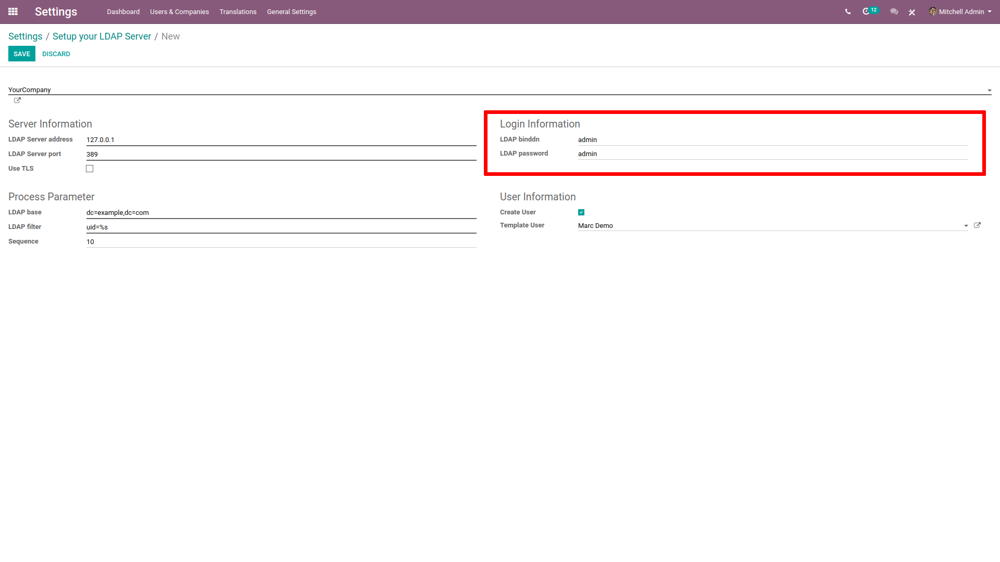

=================
Sign in with LDAP
=================

- Install the Lightweight Directory Access Protocol (LDAP) module in General Settings.

- Click on **Create** in Setup the :abbr:`LDAP (Lightweight Directory Access Protocol)` Server.

.. image:: ldap/ldap01.png
    :align: center
    :alt: LDAP Authentication checkbox highlighted in the integrations settings on Odoo.

.. image:: ldap/ldap02.png
    :align: center
    :alt: Create highlighted in the LDAP server settings.

- Choose the company using the LDAP.

.. image:: ldap/ldap03.png
    :align: center
    :alt: Select the company drop-down menu highlighted in LDAP setup.

- In **Server Information**, enter the IP address of the server and the port it listens to.

- Tick **Use TLS** if the server is compatible.

.. image:: ldap/ldap04.png
    :align: center
    :alt: LDAP server settings highlighted in LDAP server setup on Odoo.

- In **Login Information**, enter ID and password of the account used to query the server. If left
  empty, the server queries anonymously.

- In **Process Parameter**, enter the domain name of the LDAP server in :abbr:`LDAP (Lightweight
  Directory Access Protocol)` nomenclature (e.g. ``dc=example,dc=com``).

- In **LDAP filter**, enter ``uid=%s``

.. image:: ldap/ldap06.png
    :align: center
    :alt: Process parameter highlighted in LDAP server setup on Odoo.

- In **User Information**, tick *Create User* if Odoo should create a User profile the first time
  someone logs in with :abbr:`LDAP (Lightweight Directory Access Protocol)`.

- In **Template User**, indicate a template for the new profiles created. If left blanked, the admin
  profile will be used as template.

.. image:: ldap/ldap07.png
    :align: center
    :alt: User information highlighted on LDAP server setup on Odoo.
