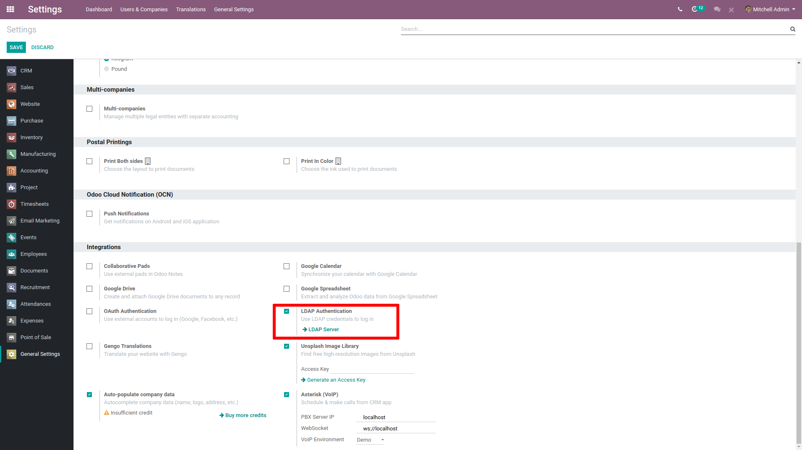
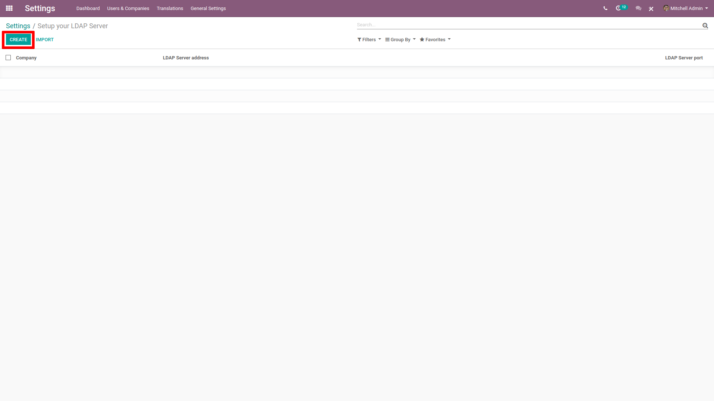
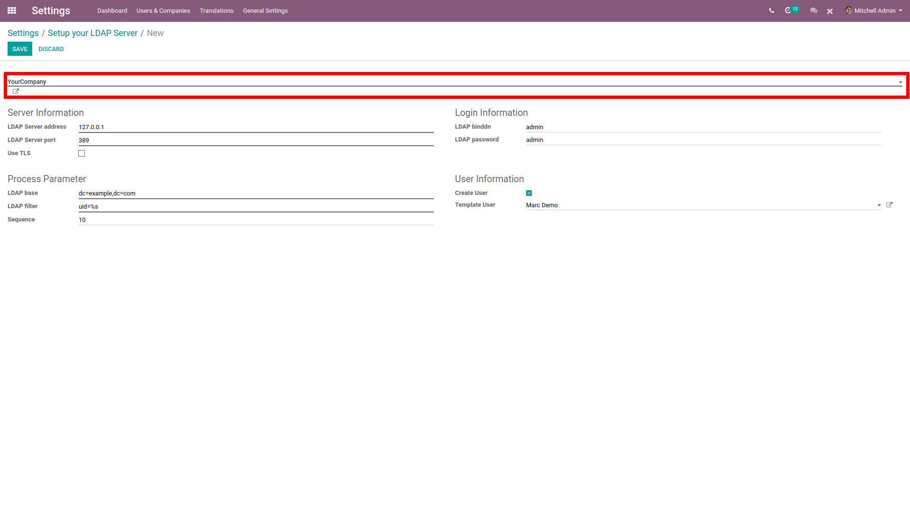
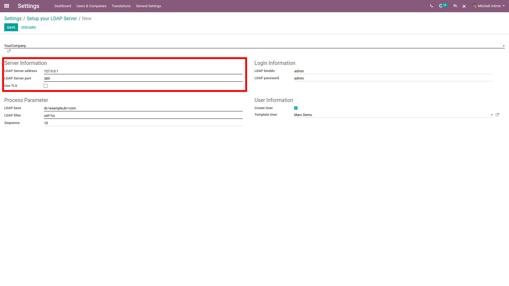
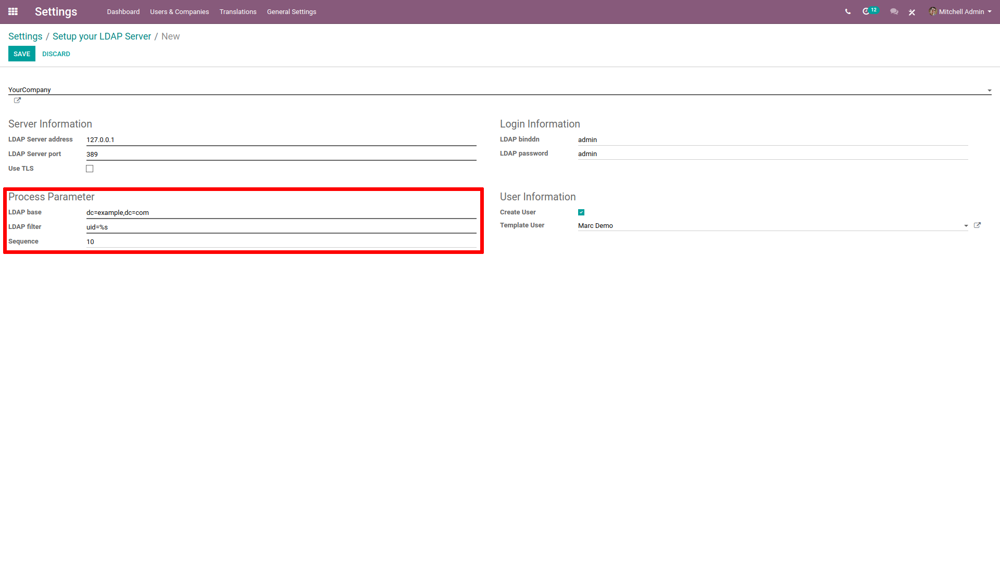
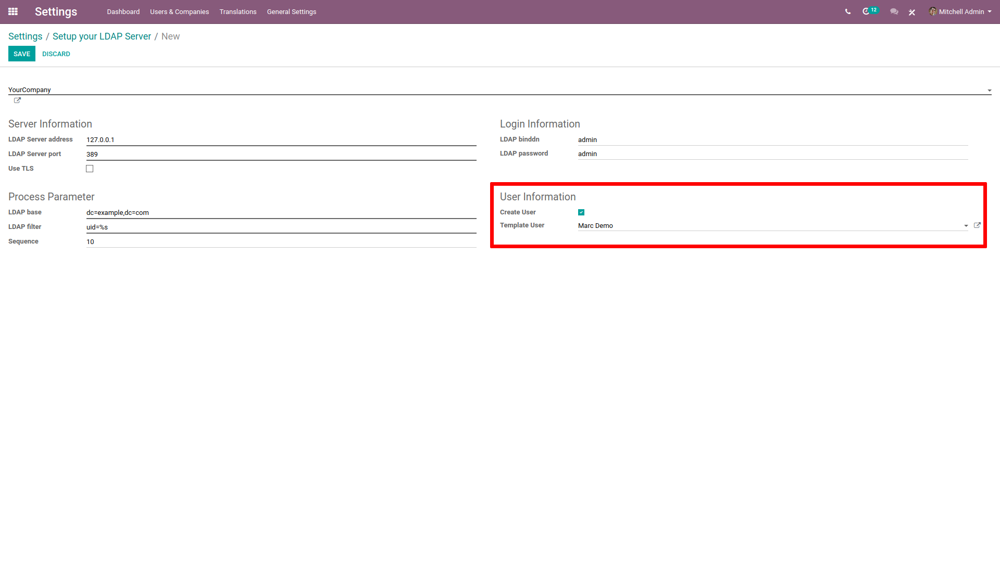

=======================================
How to allow users to sign in with LDAP
=======================================

- Install the LDAP module in General Settings.

- Click on **Create** in Setup your LDAP Server.

- Choose the company about to use the LDAP.

- In **Server Information**, enter the IP address of your server and the port it listens to.

- Tick **User TLS** if your server is compatible.

- In **Login Information**, enter ID and password of the account used to query the server. If left empty, the server will be queried anonymously.

- In **Process Parameter**, enter the domain name of your LDAP server in LDAP nomenclature (e.g. ``dc=example,dc=com``).

- In **LDAP filter**, enter ``uid=%s``

- In **User Information**, tick *Create User* if you want Odoo to create a User profile the first time someone log in with LDAP.

- In **Template User**, indicate a template for the new profiles created. If left blanked, the admin profile will be used as template.

